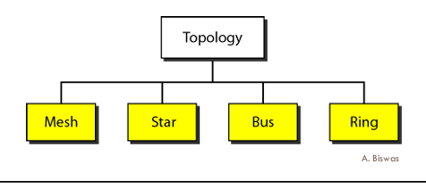
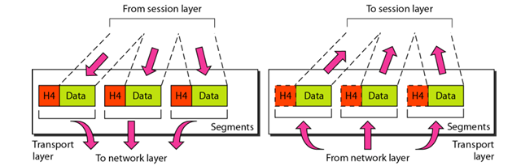

# <h1 align="center">Computer Network</h1>

### 🧑‍💻Author: Anil Kumar
---
- **Network:**
       A network is a set of devices connected by communication meduim.
- **Computer Network:** A computer network is a system that connects multiple devices—like computers, servers, or smartphones—so they can communicate, share data, and resources efficiently. It is the backbone of the digital world. Every time you send a WhatsApp message, stream Netflix, or make a UPI payment, you’re using a computer network.
        
- **Data Communications:**
    exchange of data between two 
devices via  transmission medium.

## Communication Protocol
<div style="display: flex; justify-content: center;"> 
  <div class="mermaid" style="display: flex; justify-content: center; width: 800px; height: 200px; font-size: 22px;">
    flowchart LR
      Sender[Sender] <------->| Communication Medium | Receiver[Receiver]
  </div>
</div>

<div style="background-color: #b15b21; padding: 10px; border-radius: 8px; font-weight: bold; width: fit-content; margin: 20px auto; text-align: center;">
  Both sender and receiver follow the protocol.
</div>

---
> ### Five Components of Data Communication
1. Message  
2. Sender  
3. Receiver  
4. Medium  
5. Protocol

- **Protocol:** A protocol is set of rules that govern data communications. It is like an agreement  between communicating devices.
Without a protocol, two devices may 
be connected but cannot communicate, just like a person cannot understand 
Assamese who speaks only Tamil

> ### During data communication, data flow is of 3 type:

<p align="center">
  
</p>
  
- type of connection between them : point to point, multipoint  

| Connection Type  | Description                                                                 | Real-life Example                |
|------------------|-----------------------------------------------------------------------------|----------------------------------|
| Point-to-Point   | Entire capacity of the link is reserved for transmission between two devices | Telephone call between two people |
| Multipoint       | More than two devices share a common link                                   | Classroom with one teacher and many students |


> ### Goals of the network
1. Performance  
2. Reliability  
3. Security  


---
>  # but how the network in real life look likes

*  **Physical Topology**: The term physical topology refers to the way in which a network is laid 
out physically.

<p align="center">
  
</p>
  

- **Mesh Topology**  
  Every device has a dedicated point-to-point link to every other device.

- **Star Topology**  
   - Each device has a dedicated point-to-point link only to a central controller, 
usually called a hub.
   - If a device wants to send data to 
another device, it sends the data to 
hub, which relays the data to another 
connected device.

- **Bus Topology**  
   - Bus topology uses multipoint connections.
   - Nodes are connected to the bus cable by drop lines (connection running 
between device and the main cable)and taps (connector).

- **Ring Topology**  
  Each device has a dedicated point-to
point with only two devices on either 
side of it.


---
> ### Categories of Networks
  ### Types of Networks

| Network Type | Description | Example |
|--------------|-------------|---------|
| Local Area Network (LAN) | Usually privately owned and links devices in a single office, building, or campus. | Our campus network |
| Metropolitan Area Network (MAN) | Covers a town or a city, designed for customers who need high-speed connectivity. | Cable TV network |
| Wide Area Network (WAN) | Provides long-distance transmission of data, image, audio, and video over large geographic areas (country, continent, or even the planet). | Internet backbone, telecom networks |
| Internet | When two or more networks (LAN, MAN, WAN) are connected, they become an internetwork or Internet. | The global Internet |


* **👉 Standard:** A set of agreed rules or guidelines made by organizations(like IEEE, ISO, ITU, ANSI) so that different devices and systems can work together


---

# <P align="center">OSI Model</P>

*  ISO is the organization. OSI is the model.
*  An ISO standard
 that covers all aspects ofnetwork communications is the Open Systems Interconnection
 model. 

* An **open system** lets two different computers talk to each other using common rules.
The **OSI model** explains how this communication works without changing their hardware or software.

> ### Layered Architecture of OSI Model
 <P align="center">
 
 </P>

  * Each layer in the sending device adds its own information
 to the message it receives from the layer just above it and passes the whole package to
 the layer just below it.

> ### Physical Layer

 * Main Responsibility: The physical layer is concerned with
transmitting raw bits over a communication medium/channel.
 <P align="center">
 
 </P>

* It also define the type of transmission media.
* The physical layer data consists of a stream of
bits (sequence of 0s and 1s) with no interpretation(explanation).
* **Data Rate**: The number of bits transmitted per second is also specified
by the physical layer.
* Bit synchronization at the physical layer ensures sender and receiver agree on timing so that each bit (0 or 1) is correctly recognized. Without it, bits would get misread, causing data corruption.
* It also defines the Line configuration, Physical topology,Transmission mode.

> ### Data Link Layer

* **Main Responsibility**: It makes 
physical layer appear error-free to the network layer.

<P align="center">
 
 </P>


| Feature              | Hop-to-Hop Delivery                          | End-to-End Delivery                        |
|-----------------------|----------------------------------------------|--------------------------------------------|
| **OSI Layer**        | Data Link Layer                              | Network Layer                              |
| **Scope**            | Delivery from one node(router,switch..) to the next (one link) | Delivery from source device to destination device |
| **Responsibility**   | Ensures a frame is delivered to the next hop | Ensures a packet is delivered across the entire path |
| **Unit of Data**     | Frame                                        | Packet                                     |
| **Reliability**      | Checks errors at each link (e.g., CRC)       | Ensures packet reaches the correct destination |
| **Example**          | PC → Switch, Switch → Router                 | Client → Web Server across the Internet    |

> Why Both Hop-to-Hop and End-to-End Delivery are Needed?
> * We need both because hop-to-hop checks each step of the journey, while end-to-end makes sure the whole message reaches the destination. Together, they keep communication reliable and complete.


* **Framing**: The data link layer divides the stream of bits received from 
the network layer into manageable data units called frames.

* **Flow control**: If the rate at which the data are absorbed by the receiver is 
less than the rate at which data are produced in the sender, the data link 
layer imposes a flow control mechanism to avoid overloading of receiver. 

 * A trailer is added to the end of frame for error control.
 * **Access control**: When two or more devices are connected to the same link, 
data link layer protocols determine which device has control over the link at 
any given time.


> ### Network Layer
 * **MainResponsibility**: The network is responsible for the source-to
destination delivery of packet, possibly across multiple networks 
(links).


<P align="center">
 
 </P>

* **Logical Addressing**: If packet passes the network boundary, we need another addressing system to help 
distinguish the source and destination systems.

>Q: If the Data Link layer can deliver packets using MAC addresses, why do we need logical addressing (IP addresses) in the Network layer?
> * MAC addresses work only inside a local network (e.g., your laptop to a printer via a switch). But if you send data to a server in another country, the packet must cross many networks. Here, the IP address (logical address) guides routers to deliver data end-to-end, just like a full postal address across cities.
>

* **Routing**:  When independent networks or links are connected to form internetwork 
(network of networks), the connecting devices (called routers or switches) routes or 
switch the packets to their final destination. The network layer ensures this 
mechanism for source-to-destination delivery.


> ### Transport Layer
* **Main Responsibility**: The transport layer is responsible for process-to-process delivery of the 
entire message in segments.


<P align="center">
 
 </P>

* **Service-point addressing**:Since computers often run multiple programs at the same time, source-to-destination delivery means not only sending data from the source computer to the destination computer, but also ensuring delivery from a specific process (running program) on one computer to the corresponding process on the other.

* **Segmentation**:
 A message is divided into transmittable segments, with each segment 
containing a sequence number.
* Transport Layer can be either connectionless and connection-oriented. is its connectionless then segments are individually sent to destination.but if its connection oriented transport layer needs to make first connection with transport layer of the destination machine before delivering data.
* **Flow Control**:like data link layer flow control does't happen at each hop, in this layer flow control heppen end-to-end.

* **Error Control**: error control perfromed process to process.

> ### Session Layer

* **Main Responsibility**: The session layer is responsible for dialog 
control and synchronization.

* **Dialog Control**:Dialog control is the function of the session layer in networking that manages who can talk, when, and for how long in a communication between two devices.
* **Synchronization**:This Layer allow to add check point to a stream of data. if a crash happens then requires to transmit only those data after the recent check point.

> ### Presentation Layer:

* **Main Responsibility**: The presentation layer is responsible for 
translation, compression and encryption.

* **Translation**: The presentation layer at the sender changes the information from its sender
dependent format into a common format.

* **Encryption**:Encryption means that the sender transforms the original information to another 
form and sends the resulting message out over the network.

 * **Compression**: Data compressing reduces the number of bits contained in 
the information.

>**Application Layer**: The application layer is responsible for 
providing services to the user.

* **Network Virtual Terminal(NVT)**:NVT is a universal standard text format in Telnet, acting like a common language so different computers can talk without worrying about their internal representation.
* Some service also there like file transfer ,mail service.

---

> ## **TCP/IP protocol Suite**:

* TCP/IP do not exactly match those in OSI model,it defined as having four layers:

1. Application 
2. Transport
3. Internet
4. host to network

# Difference between TCP/IP and OSI Model

| Aspect              | OSI Model (7 Layers)                              | TCP/IP Model (4 Layers)                        |
|---------------------|---------------------------------------------------|-----------------------------------------------|
| **Full Form**       | Open Systems Interconnection                      | Transmission Control Protocol / Internet Protocol |
| **Developed By**    | ISO (International Organization for Standardization) | DARPA (Defense Advanced Research Projects Agency) |
| **Layers**          | 7 Layers: Application, Presentation, Session, Transport, Network, Data Link, Physical | 4 Layers: Application, Transport, Internet, Network Access |
| **Approach**        | Theoretical, reference model                      | Practical, protocol-oriented model             |
| **Application Layer** | Split into Application, Presentation, Session    | Combined into a single Application layer       |
| **Transport Layer** | Provides reliable (TCP) and unreliable (UDP) delivery | Provides both TCP (reliable) and UDP (unreliable) |
| **Network Layer**   | Separate Network layer                            | Internet layer (similar role)                  |
| **Data Flow**       | Defines what each layer *should* do (guideline)   | Defines how protocols *actually work*          |
| **Protocol Dependency** | Protocol-independent                          | Protocol-specific (TCP, IP, UDP, etc.)         |
| **Usage**           | Used as a teaching and reference model            | Used in real-world networking and the Internet |

* TCP/IP model has only connectionless mode in network layer but support both mode in transport layer, but when it comes to OSI model just opposite.

> ### IP Addressing 
  

<P align="center">
 
 </P>

<P align="center">
 
 </P>

* If we can have a common network id for all the node in a particular 
LAN then it will be better because router need not to maintain info of 
all the nodes.
* But, we have to also identify the individual node. Therefore, we also 
require to have some way to get each node’s identity.
* Thus, Internet Protocol (IP) divides the address (IPv4 address) into two 
parts: Network id and Host id
*IPv4 has 32 bits address (4 bytes). Each byte is separated by a dot.

> What do u know about NAT ?
> * Network address translation(NAT) enables a user to have a large set of address internally(Private IP Address) and one address, or a small set of addresses, externally(public IP Address).


What do u know about NAT ?

- Network Address Translation (NAT) enables a user to have a large set of addresses internally (Private IP Address) and one address, or a small set of addresses, externally (Public IP Address).

> **About Fragmentation**
>- An IPv4 datagram (packet) can be as large as 65,535 bytes.
>- But not all physical networks (like Ethernet, Wi-Fi, etc.) can handle such a big packet.
>- Each physical network has a limit on packet size called MTU (Maximum Transmission Unit).
>- If a datagram is bigger than the MTU, it must be broken into smaller pieces so it can pass through.
>- This breaking process is called Fragmentation.

# Difference between IPv4 and IPv6

| Feature              | IPv4                                        | IPv6                                           |
|----------------------|---------------------------------------------|-----------------------------------------------|
| **Address Size**     | 32-bit (≈ 4.3 billion addresses)            | 128-bit (≈ 3.4 × 10^38 addresses)             |
| **Address Format**   | Decimal, 4 numbers separated by dots (e.g., 192.168.1.1) | Hexadecimal, 8 groups separated by colons (e.g., 2001:0db8::1) |
| **Header**           | Variable length (20–60 bytes)               | Fixed length (40 bytes), simpler structure     |
| **Configuration**    | Manual or DHCP                             | Auto-configuration + DHCPv6 supported          |
| **Security**         | IPSec optional                             | IPSec built-in by default                      |
| **Broadcast**        | Supports broadcast                         | No broadcast; uses multicast and anycast       |
| **Fragmentation**    | Done by both sender and routers             | Done only by sender                            |
| **Address Classes**  | Classful addressing (A, B, C, etc.), NAT used | Classless, hierarchical addressing, no NAT needed |
| **Advantages**       | Limited addresses, complex header           | Larger address space, better header, new options, extensions, stronger security |

* **Tunneling**:It is a strategy used when two computers using IPv6 want to 
communicate with each other and the packet must pass through a 
region that uses IPv4.

> ### What if some system use IPv4 but majority of the internet has moved to IPv6 !
> * Header translation: It is necessary when the majority of the Internet 
has moved to IPv6 but some systems still use IPv4.
> * The sender wants to use IPv6, but the receiver does not understand 
IPv6.

<P align="center">
 
 </P>
 
 * The header of the IPv6 packet is converted to an IPv4 header.


> ## Analog v/s Digital Signal
> - Analog data is captured as continuous values. For instance, when someone 
speaks an analog wave is created in the air. This can be captured by a 
microphone and converted to an analog signalor sampled and 
converted to a digital signal.
> - Digital data is captured as discrete values. For instance, data stored in 
computer memory in the form of 0s and 1s. These can be converted to a 
digitalor modulated into an analog signal.
> - In data communications, we commonly use periodic analog signals
 and nonperiodic digital signals.

* Attenuation means a loss of energy. 
* Amplifiers are used to compensate for this loss of energy by 
amplifying the signal.
* **Noise** is an unwanted disturbance in an electrical signal.

> ### Performance
> * One important issue in networking is the performanceof the 
network—how good is it?
> 1. Bandwidth
> 2. Throughput
> 3. Latency (Delay)
> 4. Bandwidth-Delay Product

* **Bandwidth**:-bandwidth in bits per second, refers to the number of 
bits per second a channel, a link or even a network can transmit.
* **Throughput**:-The throughput is a measure of how fast we can actuallysend data 
through a network.


> ### Delay
>  The latency or delay defines how long it takes for an entire message 
to completely arrive at the destination from the time the first bit is sent 
out from the source.
> 1. propagation time 
> 2. transmission time 
> 3. queuing time 
> 4. processing time

* **propagation time**:- measures the time required for a bit to travel from 
the source to the destination.
* **transmission time**:-measures the time required for entire message to 
reach its destination.
* **queuing time**:-Queuing timeis the time needed for each intermediate or end device 
to hold the message before it can be processed.
* **Processing time**: the time required to process (eg. Error correction) 
the message at end device (receiver) or parts of message (eg. frames) 
at intermediate devices (eg. router).

> ### Transmission media
<P align="center">
 
 </P>

> ### Error Detection vs. Error Correction 

* The correction of error is more difficult than detection of an error.
* In error detection, we are looking only to see any error has occurred.
* We are not even interested in number of error. The single-bit error or 
burst error is same for us.
* In error correction, we need to know exact number of bits that are 
corrupted and more importantly, the locationin the message.

  ```mermaid
  flowchart 
      Sender[ correction] ---->Receiver[Forward error correction]
      Sender[ correction]----> fsd[Retransmission]


* Forward error correction: Receiver tries to guess by using redundant bits.
* Retransmission: Receiver requests sender to retransmit the message.

 * Hamming distance indicates how many errors in the codewordscan be 
detected and corrected.


---

> ### Why Framming?
> * Limited buffer sizeat the receiver.
> * A larger block of data has higher probability of error.

> ### Framming Methods
* 1. Byte stuffing:- The sender inserts a special byte (e.g., ESC) just before each “accidental” flag byte in the 
data (like in C language, “ macros are replaced with values/definitions”). 
* 2. Bit stuffing:-Whenever the sender encounters five consecutive 1s in the data, it automatically stuffs a 0 
bit into the outgoing bit stream. 

<P align="center">
 
 </P>

> ### Flow Control:
> 1. Stop-and-Wait Flow Control
> 2. Sliding-Window Flow Control


* ## Stop-and-Wait Flow Control
  1. Source transmits a frame.
  2. Destination receives theframe,and replies with a small frame called 
acknowledgement (ACK).
  3. Source waits for the ACK before sending the next frame.
  4. Destination can stop the flow by not sending ACK(e.g., if the 
destination is busy …).
  5.  It is not efficient for long haul transmission and high speed transmission.
   
* ## Sliding-Window Flow Control
  1. Idea: allow multiple frames to transmit.
      * Receiver has a buffer of W frames
      * Transmitter can send up to W frames withoutreceivingACK
  2. Each frame needs to be numbered: sequence number is included in the 
frame header.
  3. ACK includes the sequence number of the next expected frameby the 
receiver

## Performance of both methods(Errors)
  1. Lost frames
  2. Damaged frames

### Two approachesfor error control :
  1. automatic repeat request
  2. forward error correction
  
## Automatic Repeat Request(ARQ)
 * The role of ARQ is to turn an unreliable data link into a reliable one.
  

      ```mermaid
      flowchart 
      Sender[versions of ARQ ] ---->Receiver[Stop-and-wait]
      Sender[ versions of ARQ]----> fsd[Go-back-N]
      Sender[ versions of ARQ]----> lkjfd[Selective-reject]

###  Stop-and-Wait ARQ
  1.  The source station is equipped with a timer.
  2.  Source transmits a single frame, and waits for an ACK.
  3.  If the frame is lost.
     
      * The timer eventually fires, and the source retransmits the frame.
  4. If receiver receives a damaged frame, discard it.
     * he timer eventually fires, and the source retransmits the frame.
  5. If everything goes right, but the ACK is damagedor lost, the sourcewill not recognize it.
     * he timer eventually fires, the sourcewill retransmit the frame.
     * Receiver gets two copies of the same frame!
  6. Simple, but inefficient for long distance and high 
speed applications.

### Go-Back-N ARQ
  1.  Based on sliding-window flow control.
  2.  Use window size to control the number of unacknowledged frames outstanding.
  3.   If no error, the destination will send ACK as usual with next frame expected (positive 
ACK,RR: receive ready).
  4.  If error, the destination will reply with rejection (negative ACK,REJ: reject).
  
### Selective-Reject ARQ
  1. Also called selective repeat
  2. Only rejected frames are retransmitted
  3. Receiver must maintain large enough buffer, and must contain logic for 
reinserting the retransmitted frame in the proper sequence.
  
> Piggybacking ?
> * Piggybacking means sending an acknowledgement (ACK) along with data in the same frame instead of sending it separately because of to overcome overhead.

> What is HDLC?
>  * HDLC (High-Level Data Link Control) is a bit-oriented data link layer protocol developed by ISO.
> * Provides reliable and efficient communication over both synchronous and asynchronous links.

 ### Types of HDLC Frames
 1. I-Frame (Information Frame)
    * Carries user data and control information.
    * Used for normal data transfer.
2. S-Frame (Supervisory Frame)
    * Provides control (ACK, NAK, flow control).
  3. U-Frame (Unnumbered Frame)
     * Used for control purposes (like establishing/terminating a connection).


> ### Point-to-Point Protocol (PPP) 
 * HDLC can be used in both point-to-point and multi-point configuration.
 * PPP is the most commonly used protocol for point-to-point access.


## Why Switching?
 * When we have multiple devices, we have problem of how to connect them to 
make one-to-one communication possible.
 * One solution could be use of mesh topology to have point-to-point connection or 
have star topology to have just one central node.
  * Both are not practical when applied to very large network.
  *  In the network, what we can have is the devices that are part of the network and 
capable of creating temporary connections between two or more devices.
 * Switch is a device that has such capability.

# Switching Methods

* Main responsibility of a switch is to:  
  1. Forward packets/data from input port to output port  
  2. Select port based on the address in the packet header  


 ```mermaid
flowchart
    Sender[Methods of Switching] ---> Circuit[Circuit Switching]
    Sender[Methods of Switching] ---> Packet[Packet Switching]
    Sender[Methods of Switching] ---> Message[Message Switching]
    Packet[Packet Switching]--->dt[Datagram networks]
    Packet[Packet Switching]--->dt2[Virtual-circuit network]


```


   <P align="center">

</P>


1. In circuit switching, a physical circuit (or channel) is established between the 
source and destination of the message before the delivery of the message.
2. The circuit switching is mostly used at the physical layer, and was never 
implemented at the network layer.
3. The network layer in the Internet today is a packet-switched network.
4. The connecting devices in a packet-switched network still need to decide how to 
route the packets to the final destination. 
5. Datagram switching is done at the network layer.


   <P align="center">

</P>

6. A virtual-circuit network is cross between a circuit-switched network and 
datagram network.
7. Virtual-circuit network is implemented in the data link layer, while circuit-switched 
network in physical layer and datagram network in network layer.


## Controlled Access
* n controlled access, the stations consults one another to find which 
station has the right to send. 
* A station cannot send unless it has been authorized by the other 
stations.

 ```mermaid
flowchart
    Sender[controlled access methods] ---> Circuit[Reservation]
    Sender[controlled access methods] ---> Packet[Polling]
    Sender[controlled access methods] ---> Message[Token Passing]
  
```

