🧑‍💻 **Author:** RK ROY

# 🌐 Complete Computer Networks Notes

> **Author:** RK  
> **Version:** 1.0

## 📚 Table of Contents

1. [Introduction to Computer Networks](#introduction-to-computer-networks)
2. [Network Fundamentals](#network-fundamentals)
3. [OSI Model & TCP/IP Stack](#osi-model--tcpip-stack)
4. [Physical Layer](#physical-layer)
5. [Data Link Layer](#data-link-layer)
6. [Network Layer](#network-layer)
7. [Transport Layer](#transport-layer)
8. [Session Layer](#session-layer)
9. [Presentation Layer](#presentation-layer)
10. [Application Layer](#application-layer)
11. [Network Security](#network-security)
12. [Wireless Networks](#wireless-networks)
13. [Network Performance](#network-performance)
14. [Interview Questions](#interview-questions)

---

## 🚀 Introduction to Computer Networks

### What is a Computer Network?

A **Computer Network** is a collection of interconnected computing devices that can communicate and share resources with each other. These devices include computers, servers, routers, switches, and other network equipment.

### 🎯 Key Objectives of Networks

- **Resource Sharing**: Share hardware, software, and data
- **Communication**: Enable messaging and data exchange
- **Reliability**: Provide backup and fault tolerance
- **Cost Reduction**: Share expensive resources
- **Scalability**: Easy expansion and modification

### 📊 Network Classification

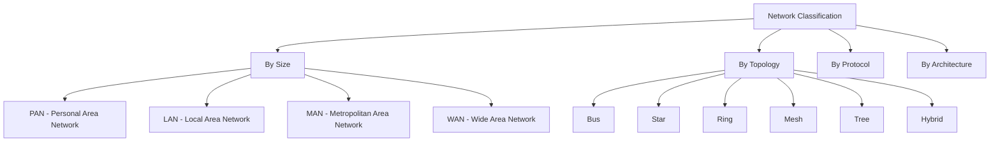

#### 🏠 Network Types by Size

| Type    | Range       | Examples                       |
| ------- | ----------- | ------------------------------ |
| **PAN** | 1-10 meters | Bluetooth, USB connections     |
| **LAN** | 10m - 1km   | Office networks, home networks |
| **MAN** | 1-100 km    | City-wide networks, cable TV   |
| **WAN** | 100km+      | Internet, satellite networks   |

#### 🔗 Network Topologies

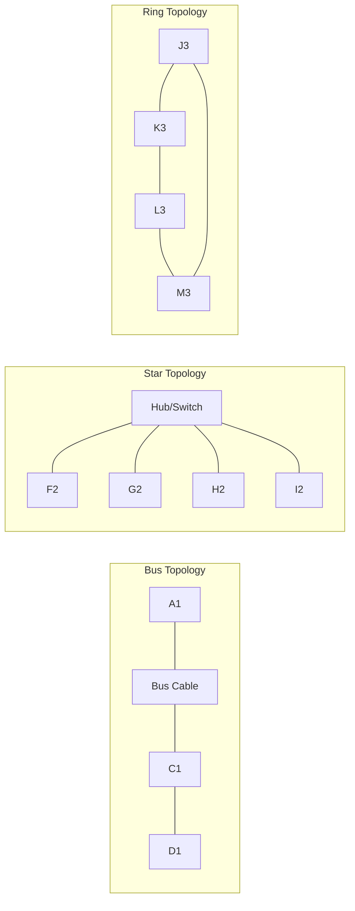

---

## 🔧 Network Fundamentals

### 📡 Communication Methods

#### 1. **Simplex Communication**

- Unidirectional data flow
- Example: Radio broadcasting, TV signals

#### 2. **Half-Duplex Communication**

- Bidirectional, but not simultaneous
- Example: Walkie-talkie, traditional Ethernet

#### 3. **Full-Duplex Communication**

- Simultaneous bidirectional communication
- Example: Telephone, modern Ethernet

### 🔄 Switching Techniques

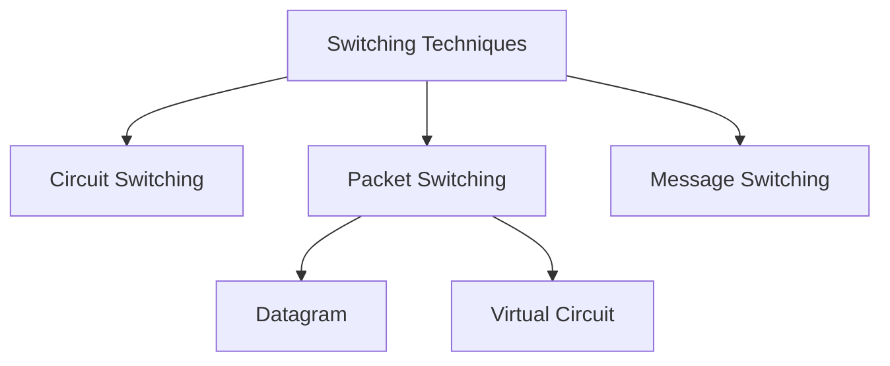

#### Circuit Switching

- **Concept**: Dedicated path established before communication
- **Advantages**: Guaranteed bandwidth, low latency
- **Disadvantages**: Inefficient resource utilization
- **Example**: Traditional telephone networks

#### Packet Switching

- **Concept**: Data divided into packets, each routed independently
- **Advantages**: Efficient resource utilization, fault tolerance
- **Disadvantages**: Variable delay, potential packet loss
- **Example**: Internet, Ethernet networks

### 🎯 Network Performance Metrics

#### 1. **Bandwidth**

- Maximum data transfer rate
- Measured in bps (bits per second)
- **Formula**: `Bandwidth = Data / Time`

#### 2. **Latency (Delay)**

- Time taken for data to travel from source to destination
- **Components**:
    - **Propagation Delay**: `Distance / Speed of Signal`
    - **Transmission Delay**: `Message Size / Bandwidth`
    - **Processing Delay**: Time to process packet
    - **Queuing Delay**: Time waiting in buffers

#### 3. **Throughput**

- Actual data transfer rate achieved
- Always ≤ Bandwidth

#### 4. **Jitter**

- Variation in packet delay
- Critical for real-time applications

---

## 🏗️ OSI Model & TCP/IP Stack

### 🎯 OSI (Open Systems Interconnection) Model

The OSI model is a conceptual framework that describes network communication in 7 layers:

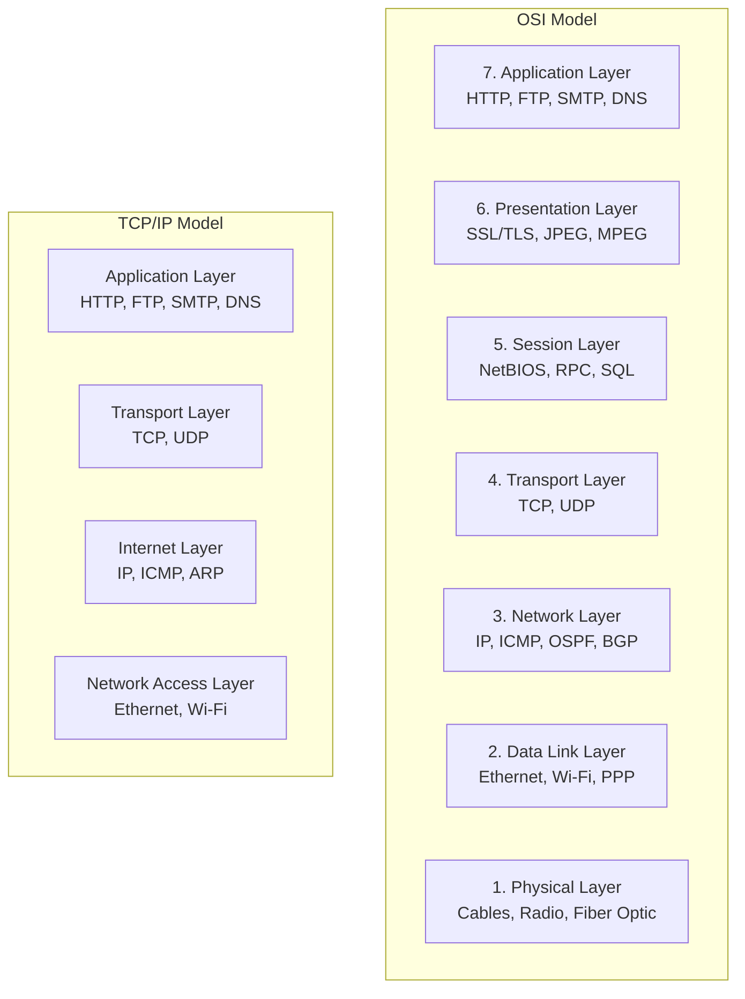

### 📋 Layer-by-Layer Breakdown

| OSI Layer        | Function                          | Protocols           | Data Unit    |
| ---------------- | --------------------------------- | ------------------- | ------------ |
| **Application**  | User interface                    | HTTP, FTP, SMTP     | Data/Message |
| **Presentation** | Data formatting, encryption       | SSL/TLS, JPEG       | Data         |
| **Session**      | Session management                | NetBIOS, RPC        | Data         |
| **Transport**    | End-to-end delivery               | TCP, UDP            | Segment      |
| **Network**      | Routing, logical addressing       | IP, ICMP            | Packet       |
| **Data Link**    | Frame formatting, error detection | Ethernet, Wi-Fi     | Frame        |
| **Physical**     | Bit transmission                  | Cables, Radio waves | Bit          |

---

## ⚡ Physical Layer

### 🔌 Transmission Media

#### 1. **Guided Media (Wired)**

##### Twisted Pair Cable

- **Unshielded Twisted Pair (UTP)**
    - Categories: Cat5, Cat5e, Cat6, Cat6a, Cat7
    - Bandwidth: Up to 10 Gbps (Cat6a)
    - Distance: Up to 100m
- **Shielded Twisted Pair (STP)**
    - Better EMI protection
    - Higher cost than UTP

##### Coaxial Cable

- **Structure**: Central conductor, insulator, metallic shield, outer jacket
- **Types**:
    - **50Ω**: Used in LANs (10Base2, 10Base5)
    - **75Ω**: Used in cable TV, broadband
- **Bandwidth**: Up to 1 GHz

##### Fiber Optic Cable

- **Advantages**:
    - High bandwidth (up to 100+ Gbps)
    - Long distance (up to 100+ km)
    - EMI immune
    - Secure (difficult to tap)
- **Types**:
    - **Single Mode**: Long distance, expensive
    - **Multi Mode**: Short distance, cheaper

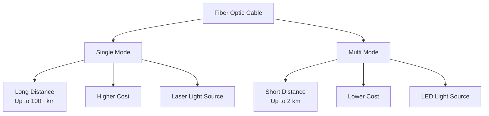

#### 2. **Unguided Media (Wireless)**

##### Radio Waves

- **Frequency**: 3 kHz - 300 MHz
- **Characteristics**: Omnidirectional, long range
- **Applications**: AM/FM radio, cellular networks

##### Microwaves

- **Frequency**: 300 MHz - 300 GHz
- **Characteristics**: Line-of-sight, directional
- **Applications**: Satellite communication, point-to-point links

##### Infrared

- **Frequency**: 300 GHz - 400 THz
- **Characteristics**: Short range, blocked by obstacles
- **Applications**: Remote controls, IrDA

### 📊 Digital Signal Encoding

#### 1. **Line Coding Schemes**

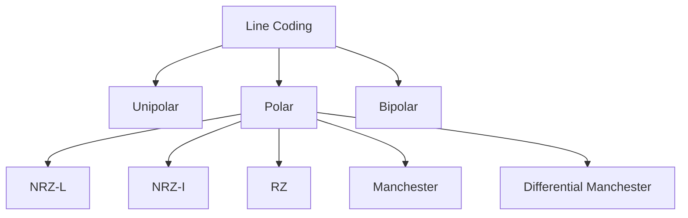

#### 2. **Multiplexing Techniques**

##### Frequency Division Multiplexing (FDM)

- Different signals use different frequency bands
- Used in: Radio, TV broadcasting

##### Time Division Multiplexing (TDM)

- Different signals use different time slots
- **Types**:
    - **Synchronous TDM**: Fixed time slots
    - **Asynchronous TDM**: Dynamic time allocation

##### Wavelength Division Multiplexing (WDM)

- Different signals use different light wavelengths
- Used in: Fiber optic networks

---

## 🔗 Data Link Layer

### 🎯 Functions of Data Link Layer

1. **Framing**: Organize bits into frames
2. **Physical Addressing**: MAC addresses
3. **Error Detection and Correction**
4. **Flow Control**: Manage data rate between sender/receiver
5. **Access Control**: Manage shared medium access

### 📦 Frame Structure

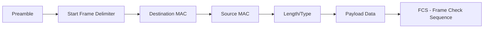

### 🛡️ Error Detection Methods

#### 1. **Parity Check**

- **Simple Parity**: Add 1 bit to make total 1s even/odd
- **2D Parity**: Parity for rows and columns
- **Limitation**: Cannot detect even number of errors

#### 2. **Cyclic Redundancy Check (CRC)**

- **Concept**: Treat data as polynomial, divide by generator
- **Advantages**: Detects all single-bit errors, most burst errors
- **Common**: CRC-16, CRC-32

**Example CRC Calculation:**

```
Data: 1101
Generator: 101

1101000 ÷ 101 = 1011 remainder 001
Transmitted: 1101001
```

#### 3. **Checksum**

- Sum all data words, send complement
- Used in IP, TCP, UDP headers

### 🔄 Flow Control

#### 1. **Stop-and-Wait Protocol**

- Sender waits for ACK before sending next frame
- **Efficiency**: `η = 1 / (1 + 2a)` where `a = Propagation Time / Transmission Time`

#### 2. **Sliding Window Protocol**

- Multiple frames can be outstanding
- **Go-Back-N**: Retransmit all frames after error
- **Selective Repeat**: Retransmit only erroneous frames

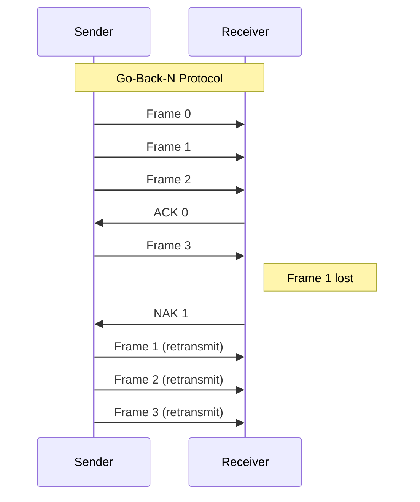

### 🚦 Medium Access Control (MAC)

#### 1. **CSMA/CD (Carrier Sense Multiple Access with Collision Detection)**

- Used in Ethernet
- **Algorithm**:
    1. Listen before transmit
    2. Transmit if medium idle
    3. Monitor for collision during transmission
    4. If collision detected, send jam signal and backoff

#### 2. **CSMA/CA (Collision Avoidance)**

- Used in Wi-Fi (802.11)
- **Features**:
    - RTS/CTS handshake
    - NAV (Network Allocation Vector)
    - Binary exponential backoff

### 🌉 Switching and Bridging

#### Switch vs Hub

| Feature              | Hub      | Switch               |
| -------------------- | -------- | -------------------- |
| **OSI Layer**        | Physical | Data Link            |
| **Collision Domain** | Single   | Per port             |
| **Bandwidth**        | Shared   | Dedicated            |
| **Intelligence**     | None     | MAC address learning |
| **Full-Duplex**      | No       | Yes                  |

#### Bridge Learning Algorithm

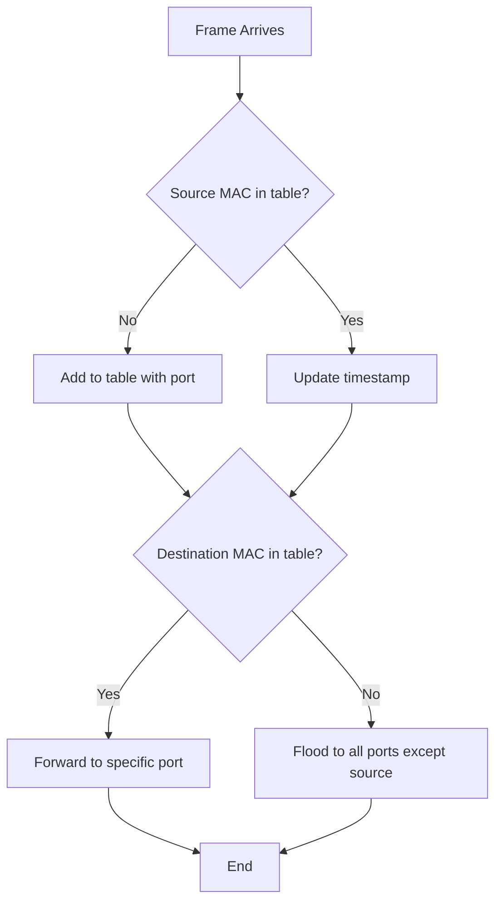

### 📡 Ethernet Standards

| Standard      | Speed    | Medium     | Distance |
| ------------- | -------- | ---------- | -------- |
| **10Base5**   | 10 Mbps  | Thick coax | 500m     |
| **10Base2**   | 10 Mbps  | Thin coax  | 200m     |
| **10BaseT**   | 10 Mbps  | UTP        | 100m     |
| **100BaseTX** | 100 Mbps | UTP Cat5   | 100m     |
| **1000BaseT** | 1 Gbps   | UTP Cat5e  | 100m     |
| **10GBaseT**  | 10 Gbps  | UTP Cat6a  | 100m     |

---

## 🌍 Network Layer

### 🎯 Functions of Network Layer

1. **Routing**: Determine best path for packets
2. **Logical Addressing**: IP addresses
3. **Packet Forwarding**: Move packets between networks
4. **Fragmentation**: Break large packets into smaller ones
5. **Congestion Control**: Manage network congestion

### 📍 IP Addressing

#### IPv4 Address Structure

```
32-bit address: X.X.X.X (dotted decimal notation)
Example: 192.168.1.1 = 11000000.10101000.00000001.00000001
```

#### IPv4 Address Classes

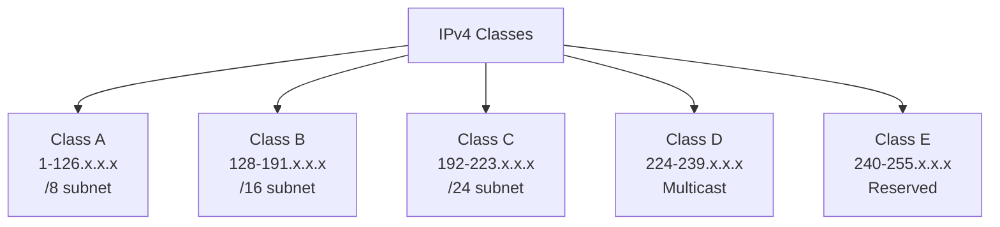

| Class | Range                       | Default Subnet Mask | Networks  | Hosts per Network |
| ----- | --------------------------- | ------------------- | --------- | ----------------- |
| **A** | 1.0.0.0 - 126.255.255.255   | 255.0.0.0 (/8)      | 126       | 16,777,214        |
| **B** | 128.0.0.0 - 191.255.255.255 | 255.255.0.0 (/16)   | 16,384    | 65,534            |
| **C** | 192.0.0.0 - 223.255.255.255 | 255.255.255.0 (/24) | 2,097,152 | 254               |

#### Special IP Addresses

| Address                     | Purpose           |
| --------------------------- | ----------------- |
| **0.0.0.0**                 | This network      |
| **127.x.x.x**               | Loopback          |
| **192.168.x.x**             | Private (Class C) |
| **172.16.x.x - 172.31.x.x** | Private (Class B) |
| **10.x.x.x**                | Private (Class A) |
| **255.255.255.255**         | Broadcast         |

#### Subnetting

**CIDR (Classless Inter-Domain Routing) Notation:**

- Format: `Network/Prefix_Length`
- Example: `192.168.1.0/24`

**Subnet Calculation Example:**

```
Network: 192.168.1.0/26
Subnet Mask: 255.255.255.192
Subnets: 4 (2^2)
Hosts per Subnet: 62 (2^6 - 2)

Subnets:
1. 192.168.1.0/26   (192.168.1.1 - 192.168.1.62)
2. 192.168.1.64/26  (192.168.1.65 - 192.168.1.126)
3. 192.168.1.128/26 (192.168.1.129 - 192.168.1.190)
4. 192.168.1.192/26 (192.168.1.193 - 192.168.1.254)
```

### 🚀 IPv6

#### Features of IPv6

- **128-bit addressing**: 2^128 addresses
- **No NAT required**: Large address space
- **Built-in security**: IPSec mandatory
- **Auto-configuration**: Stateless address configuration
- **Better QoS**: Flow labeling

#### IPv6 Address Format

```
8 groups of 4 hexadecimal digits
Example: 2001:0db8:85a3:0000:0000:8a2e:0370:7334

Compressed: 2001:db8:85a3::8a2e:370:7334
```

#### IPv6 Address Types

| Type           | Prefix          | Description     |
| -------------- | --------------- | --------------- |
| **Unicast**    | 2000::/3        | One-to-one      |
| **Multicast**  | FF00::/8        | One-to-many     |
| **Anycast**    | Same as Unicast | One-to-nearest  |
| **Loopback**   | ::1/128         | Local loopback  |
| **Link-Local** | FE80::/10       | Local link only |

### 🧭 Routing Algorithms

#### 1. **Distance Vector Routing**

- **Algorithm**: Bellman-Ford
- **Example**: RIP (Routing Information Protocol)
- **Characteristics**:
    - Distributed computation
    - Each node knows distance to neighbors
    - Periodic updates
    - Count-to-infinity problem

#### 2. **Link State Routing**

- **Algorithm**: Dijkstra's
- **Example**: OSPF (Open Shortest Path First)
- **Characteristics**:
    - Complete network topology known
    - Shortest path calculated locally
    - Faster convergence than distance vector

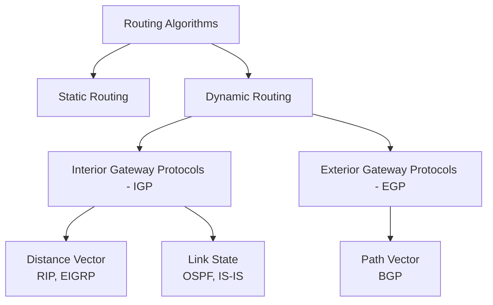

### 📊 Routing Protocols

#### RIP (Routing Information Protocol)

- **Metric**: Hop count (max 15)
- **Update Timer**: 30 seconds
- **Convergence**: Slow
- **Advantages**: Simple, easy to configure
- **Disadvantages**: Scalability issues, slow convergence

#### OSPF (Open Shortest Path First)

- **Metric**: Cost (bandwidth-based)
- **Algorithm**: Link State (Dijkstra's)
- **Features**:
    - Area-based hierarchy
    - Fast convergence
    - Load balancing support
    - Authentication

#### BGP (Border Gateway Protocol)

- **Type**: Path Vector
- **Purpose**: Inter-domain routing
- **Features**:
    - Policy-based routing
    - Path attributes (AS_PATH, NEXT_HOP, etc.)
    - Scalable for Internet routing

### 🔧 Network Layer Protocols

#### ICMP (Internet Control Message Protocol)

- **Purpose**: Error reporting and network diagnostics
- **Message Types**:
    - Echo Request/Reply (ping)
    - Destination Unreachable
    - Time Exceeded (traceroute)
    - Redirect

#### ARP (Address Resolution Protocol)

- **Purpose**: Resolve IP to MAC address
- **Process**:
    1. Check ARP cache
    2. Send ARP request (broadcast)
    3. Receive ARP reply
    4. Update ARP cache

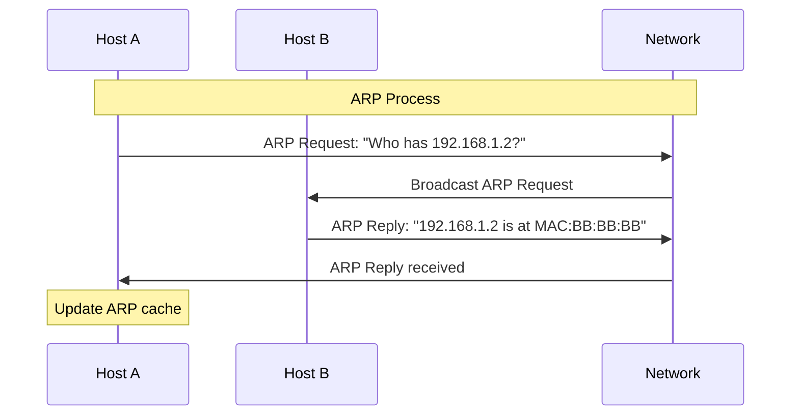

---

## 🚚 Transport Layer

### 🎯 Functions of Transport Layer

1. **Process-to-Process Delivery**: Port numbers
2. **Segmentation**: Break data into segments
3. **Connection Management**: Establish/terminate connections
4. **Flow Control**: End-to-end flow control
5. **Error Detection**: End-to-end error recovery
6. **Congestion Control**: Prevent network overload

### 🔢 Port Numbers

#### Well-Known Ports (0-1023)

| Port      | Protocol | Service            |
| --------- | -------- | ------------------ |
| **20/21** | FTP      | File Transfer      |
| **22**    | SSH      | Secure Shell       |
| **23**    | Telnet   | Remote Login       |
| **25**    | SMTP     | Email Transfer     |
| **53**    | DNS      | Domain Name System |
| **80**    | HTTP     | Web Traffic        |
| **110**   | POP3     | Email Retrieval    |
| **143**   | IMAP     | Email Access       |
| **443**   | HTTPS    | Secure Web         |
| **993**   | IMAPS    | Secure IMAP        |
| **995**   | POP3S    | Secure POP3        |

### 📡 UDP (User Datagram Protocol)

#### Characteristics

- **Connectionless**: No connection establishment
- **Unreliable**: No guaranteed delivery
- **Fast**: Low overhead
- **Simple**: Minimal features

#### UDP Header Structure

```
 0                   1                   2                   3
 0 1 2 3 4 5 6 7 8 9 0 1 2 3 4 5 6 7 8 9 0 1 2 3 4 5 6 7 8 9 0 1
+-+-+-+-+-+-+-+-+-+-+-+-+-+-+-+-+-+-+-+-+-+-+-+-+-+-+-+-+-+-+-+-+
|          Source Port          |       Destination Port        |
+-+-+-+-+-+-+-+-+-+-+-+-+-+-+-+-+-+-+-+-+-+-+-+-+-+-+-+-+-+-+-+-+
|            Length             |           Checksum            |
+-+-+-+-+-+-+-+-+-+-+-+-+-+-+-+-+-+-+-+-+-+-+-+-+-+-+-+-+-+-+-+-+
```

#### Use Cases

- **DNS queries**: Fast lookup
- **DHCP**: Dynamic IP assignment
- **Streaming media**: Real-time data
- **SNMP**: Network management
- **Gaming**: Low latency required

### 🔗 TCP (Transmission Control Protocol)

#### Characteristics

- **Connection-oriented**: Three-way handshake
- **Reliable**: Guaranteed delivery
- **Ordered**: Sequential data delivery
- **Flow Control**: Sliding window
- **Congestion Control**: Prevent network overload

#### TCP Header Structure

```
 0                   1                   2                   3
 0 1 2 3 4 5 6 7 8 9 0 1 2 3 4 5 6 7 8 9 0 1 2 3 4 5 6 7 8 9 0 1
+-+-+-+-+-+-+-+-+-+-+-+-+-+-+-+-+-+-+-+-+-+-+-+-+-+-+-+-+-+-+-+-+
|          Source Port          |       Destination Port        |
+-+-+-+-+-+-+-+-+-+-+-+-+-+-+-+-+-+-+-+-+-+-+-+-+-+-+-+-+-+-+-+-+
|                        Sequence Number                        |
+-+-+-+-+-+-+-+-+-+-+-+-+-+-+-+-+-+-+-+-+-+-+-+-+-+-+-+-+-+-+-+-+
|                    Acknowledgment Number                      |
+-+-+-+-+-+-+-+-+-+-+-+-+-+-+-+-+-+-+-+-+-+-+-+-+-+-+-+-+-+-+-+-+
|  Data |           |U|A|P|R|S|F|                               |
| Offset| Reserved  |R|C|S|S|Y|I|            Window             |
|       |           |G|K|H|T|N|N|                               |
+-+-+-+-+-+-+-+-+-+-+-+-+-+-+-+-+-+-+-+-+-+-+-+-+-+-+-+-+-+-+-+-+
|           Checksum            |         Urgent Pointer        |
+-+-+-+-+-+-+-+-+-+-+-+-+-+-+-+-+-+-+-+-+-+-+-+-+-+-+-+-+-+-+-+-+
```

#### TCP Flags

- **SYN**: Synchronize sequence numbers
- **ACK**: Acknowledgment
- **FIN**: Finish connection
- **RST**: Reset connection
- **PSH**: Push data immediately
- **URG**: Urgent data

### 🤝 TCP Connection Management

#### Three-Way Handshake (Connection Establishment)

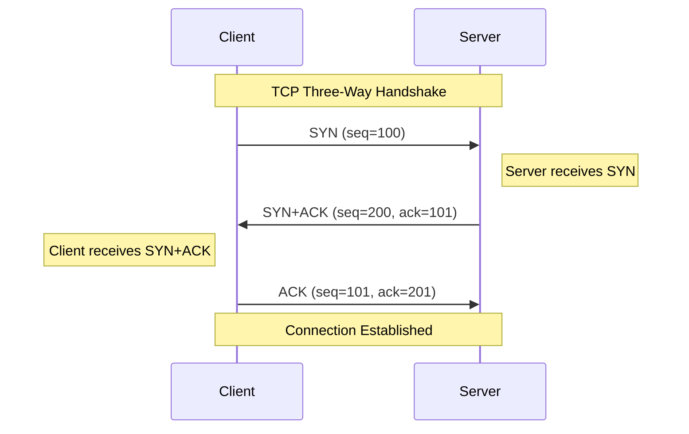

#### Four-Way Handshake (Connection Termination)

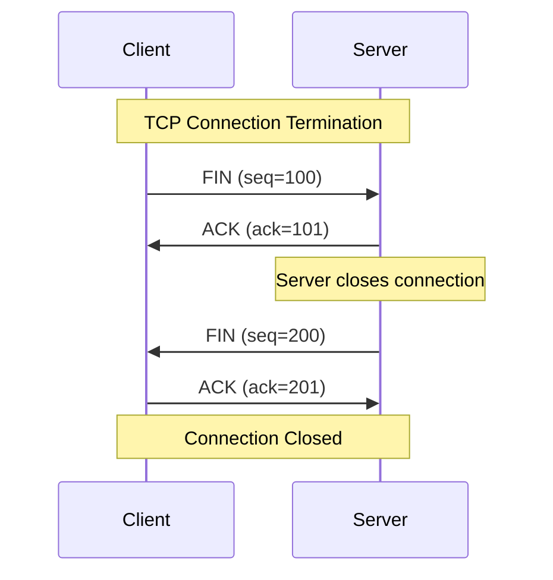

### 🌊 TCP Flow Control

#### Sliding Window Protocol

- **Window Size**: Amount of unacknowledged data allowed
- **Dynamic**: Receiver advertises window size
- **Purpose**: Prevent buffer overflow at receiver

**Example:**

```
Sender Window: [1000-1999] (Window Size = 1000)
Receiver acknowledges: ACK 1500, Window = 800
New Sender Window: [1500-2299]
```

### 🚦 TCP Congestion Control

#### Algorithms

##### 1. **Slow Start**

- Start with small congestion window (1 MSS)
- Double window size each RTT until threshold
- **Goal**: Find available bandwidth quickly

##### 2. **Congestion Avoidance**

- Linear increase after slow start threshold
- Increase window by 1 MSS per RTT
- **Goal**: Avoid congestion

##### 3. **Fast Retransmit**

- Retransmit on 3 duplicate ACKs
- Don't wait for timeout
- **Goal**: Quick error recovery

##### 4. **Fast Recovery**

- After fast retransmit, don't go to slow start
- Set window to half of original
- **Goal**: Maintain throughput

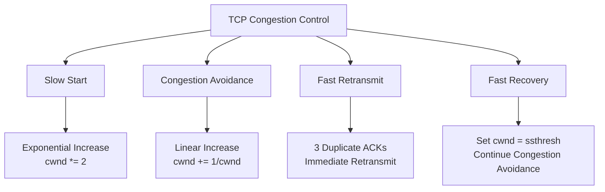

#### Congestion Window Evolution

```
Time    Event               cwnd    ssthresh
0       Start               1       16
1 RTT   No loss            2       16
2 RTT   No loss            4       16
3 RTT   No loss            8       16
4 RTT   No loss            16      16
5 RTT   No loss            17      16
6 RTT   No loss            18      16
7 RTT   Timeout/3 DupACK   9       9
8 RTT   No loss            10      9
```

---

## 🎭 Session Layer

### 🎯 Functions of Session Layer

1. **Session Management**: Establish, maintain, terminate sessions
2. **Synchronization**: Add checkpoints for crash recovery
3. **Dialog Control**: Half-duplex or full-duplex communication
4. **Session Recovery**: Resume interrupted sessions

### 🔧 Session Layer Protocols

#### 1. **NetBIOS (Network Basic Input/Output System)**

- **Purpose**: Network communication interface
- **Services**:
    - Name service (port 137)
    - Datagram service (port 138)
    - Session service (port 139)

#### 2. **RPC (Remote Procedure Call)**

- **Purpose**: Execute procedures on remote systems
- **Types**:
    - **Sun RPC**: Used in NFS
    - **DCE RPC**: Distributed Computing Environment
    - **Microsoft RPC**: Windows systems

#### 3. **SQL Sessions**

- **Purpose**: Database connection management
- **Features**:
    - Connection pooling
    - Transaction management
    - Cursor management

### 📝 Session Management Example

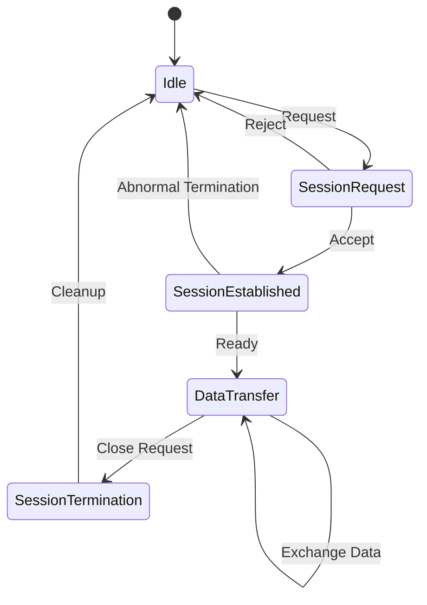

---

## 🎨 Presentation Layer

### 🎯 Functions of Presentation Layer

1. **Data Translation**: Convert between different data formats
2. **Encryption/Decryption**: Secure data transmission
3. **Compression**: Reduce data size
4. **Character Encoding**: ASCII, Unicode, EBCDIC conversion

### 🔐 Encryption and Security

#### Symmetric Encryption

- **Same key** for encryption and decryption
- **Examples**: AES, DES, 3DES
- **Advantage**: Fast
- **Disadvantage**: Key distribution problem

#### Asymmetric Encryption

- **Different keys** for encryption and decryption
- **Examples**: RSA, ECC, DSA
- **Advantage**: Secure key exchange
- **Disadvantage**: Slower than symmetric

#### SSL/TLS Protocol Stack

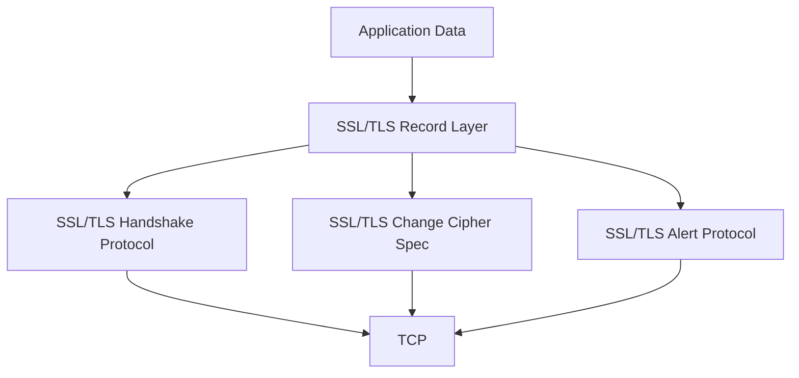

#### TLS Handshake Process

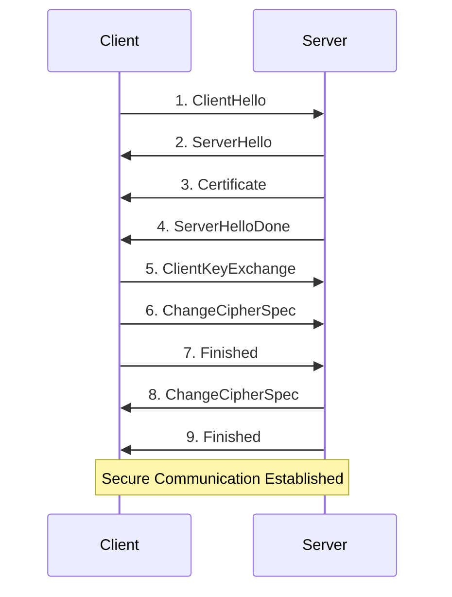

### 🗜️ Data Compression

#### Lossless Compression

- **No data loss**
- **Examples**: ZIP, GZIP, LZW
- **Use cases**: Text files, executables

#### Lossy Compression

- **Some data loss acceptable**
- **Examples**: JPEG, MP3, MPEG
- **Use cases**: Images, audio, video

### 🔤 Data Formats

#### Common File Formats

| Type         | Format               | Description        |
| ------------ | -------------------- | ------------------ |
| **Text**     | ASCII, UTF-8, UTF-16 | Character encoding |
| **Image**    | JPEG, PNG, GIF       | Image compression  |
| **Video**    | MPEG, AVI, MP4       | Video compression  |
| **Audio**    | MP3, WAV, AAC        | Audio compression  |
| **Document** | PDF, DOC, RTF        | Document formats   |

---

## 🌐 Application Layer

### 🎯 Functions of Application Layer

1. **Network Services**: Provide services to user applications
2. **User Interface**: Direct interaction with end users
3. **Application Protocols**: Define communication rules
4. **Data Representation**: Format data for presentation

### 🌍 World Wide Web (HTTP/HTTPS)

#### HTTP (HyperText Transfer Protocol)

##### HTTP Methods

| Method      | Purpose             | Idempotent | Safe |
| ----------- | ------------------- | ---------- | ---- |
| **GET**     | Retrieve data       | Yes        | Yes  |
| **POST**    | Submit data         | No         | No   |
| **PUT**     | Update resource     | Yes        | No   |
| **DELETE**  | Remove resource     | Yes        | No   |
| **HEAD**    | Get headers only    | Yes        | Yes  |
| **OPTIONS** | Get allowed methods | Yes        | Yes  |
| **PATCH**   | Partial update      | No         | No   |

##### HTTP Status Codes

| Code Range | Category      | Examples                            |
| ---------- | ------------- | ----------------------------------- |
| **1xx**    | Informational | 100 Continue                        |
| **2xx**    | Success       | 200 OK, 201 Created                 |
| **3xx**    | Redirection   | 301 Moved, 304 Not Modified         |
| **4xx**    | Client Error  | 400 Bad Request, 404 Not Found      |
| **5xx**    | Server Error  | 500 Internal Error, 503 Unavailable |

##### HTTP Message Format

**Request:**

```
GET /index.html HTTP/1.1
Host: www.example.com
User-Agent: Mozilla/5.0
Accept: text/html,application/xhtml+xml
Accept-Language: en-US,en;q=0.5
Accept-Encoding: gzip, deflate
Connection: keep-alive

[Request Body]
```

**Response:**

```
HTTP/1.1 200 OK
Date: Mon, 27 Jul 2025 12:28:53 GMT
Server: Apache/2.4.7
Content-Type: text/html; charset=UTF-8
Content-Length: 1234
Connection: keep-alive

[Response Body]
```

#### HTTPS (HTTP Secure)

- **HTTP over TLS/SSL**
- **Port**: 443
- **Features**:
    - Data encryption
    - Data integrity
    - Authentication

### 📧 Electronic Mail

#### Email Architecture

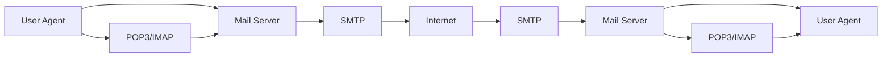

#### SMTP (Simple Mail Transfer Protocol)

##### SMTP Commands

| Command       | Purpose           | Example                          |
| ------------- | ----------------- | -------------------------------- |
| **HELO/EHLO** | Identify client   | HELO mail.example.com            |
| **MAIL FROM** | Sender address    | MAIL FROM: <user@example.com>    |
| **RCPT TO**   | Recipient address | RCPT TO: <recipient@example.com> |
| **DATA**      | Message body      | DATA                             |
| **QUIT**      | End session       | QUIT                             |

##### SMTP Session Example

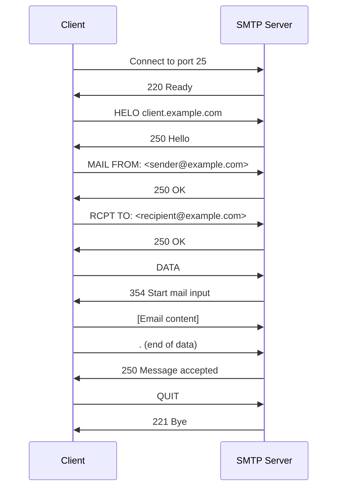

#### POP3 (Post Office Protocol 3)

- **Purpose**: Download emails to local device
- **Port**: 110 (143 for POP3S)
- **Characteristics**:
    - Download and delete from server
    - Single device access
    - Offline access

#### IMAP (Internet Message Access Protocol)

- **Purpose**: Access emails on server
- **Port**: 143 (993 for IMAPS)
- **Characteristics**:
    - Emails remain on server
    - Multi-device access
    - Server-side folders
    - Online/offline sync

### 🗂️ File Transfer

#### FTP (File Transfer Protocol)

##### FTP Modes

- **Active Mode**: Server initiates data connection
- **Passive Mode**: Client initiates data connection

##### FTP Connections

- **Control Connection**: Port 21, commands
- **Data Connection**: Port 20 (active) or random (passive)

```mermaid
sequenceDiagram
    participant C as FTP Client
    participant S as FTP Server

    Note over C,S: FTP Active Mode
    C->>S: Connect to port 21 (control)
    C->>S: USER username
    S->>C: 331 Password required
    C->>S: PASS password
    S->>C: 230 Login successful
    C->>S: PORT 192,168,1,100,4,0
    S->>C: 200 PORT command successful
    C->>S: LIST
    S->>C: Data connection from port 20
    S->>C: 226 Transfer complete
```

#### SFTP (SSH File Transfer Protocol)

- **Secure file transfer** over SSH
- **Port**: 22
- **Features**:
    - Encryption
    - Authentication
    - Integrity checking

### 🏷️ Domain Name System (DNS)

#### DNS Hierarchy

```mermaid
graph TD
    A[Root "."] --> B[Top Level Domain<br/>.com .org .net]
    B --> C[Second Level Domain<br/>google.com]
    C --> D[Subdomain<br/>mail.google.com]
```

#### DNS Record Types

| Type      | Purpose        | Example                                |
| --------- | -------------- | -------------------------------------- |
| **A**     | IPv4 address   | example.com → 192.168.1.1              |
| **AAAA**  | IPv6 address   | example.com → 2001:db8::1              |
| **CNAME** | Canonical name | www.example.com → example.com          |
| **MX**    | Mail exchange  | example.com → mail.example.com         |
| **NS**    | Name server    | example.com → ns1.example.com          |
| **PTR**   | Reverse lookup | 1.1.168.192.in-addr.arpa → example.com |
| **TXT**   | Text record    | SPF, DKIM records                      |

#### DNS Resolution Process

```mermaid
sequenceDiagram
    participant C as Client
    participant R as Recursive Resolver
    participant Root as Root Server
    participant TLD as TLD Server
    participant Auth as Authoritative Server

    C->>R: Query: www.example.com
    R->>Root: Query: www.example.com
    Root->>R: Refer to .com TLD
    R->>TLD: Query: www.example.com
    TLD->>R: Refer to example.com NS
    R->>Auth: Query: www.example.com
    Auth->>R: Answer: 192.168.1.1
    R->>C: Answer: 192.168.1.1
```

### 🌐 Dynamic Host Configuration Protocol (DHCP)

#### DHCP Process (DORA)

```mermaid
sequenceDiagram
    participant C as DHCP Client
    participant S as DHCP Server

    Note over C,S: DHCP DORA Process
    C->>S: 1. DISCOVER (broadcast)
    S->>C: 2. OFFER (IP + options)
    C->>S: 3. REQUEST (accept offer)
    S->>C: 4. ACKNOWLEDGE (confirm)
    Note over C,S: IP Configuration Complete
```

#### DHCP Options

| Option          | Description               |
| --------------- | ------------------------- |
| **Subnet Mask** | Network subnet mask       |
| **Router**      | Default gateway           |
| **DNS Server**  | Domain name servers       |
| **Lease Time**  | IP address lease duration |
| **Domain Name** | Local domain name         |

---

## 🔒 Network Security

### 🎯 Security Threats

#### Types of Attacks

```mermaid
graph TD
    A[Network Security Threats] --> B[Passive Attacks]
    A --> C[Active Attacks]

    B --> D[Eavesdropping]
    B --> E[Traffic Analysis]

    C --> F[Masquerading]
    C --> G[Replay]
    C --> H[Modification]
    C --> I[Denial of Service]
```

#### Common Network Attacks

##### 1. **Man-in-the-Middle (MITM)**

- **Description**: Attacker intercepts communication
- **Prevention**: Encryption, certificate validation

##### 2. **Denial of Service (DoS)**

- **Description**: Overwhelm target with requests
- **Types**:
    - **SYN Flood**: Exhaust TCP connection table
    - **UDP Flood**: Overwhelm with UDP packets
    - **DDoS**: Distributed denial of service

##### 3. **ARP Spoofing**

- **Description**: Send fake ARP responses
- **Impact**: Redirect traffic, MITM attacks
- **Prevention**: Static ARP entries, ARP monitoring

##### 4. **DNS Spoofing**

- **Description**: Provide false DNS responses
- **Impact**: Redirect users to malicious sites
- **Prevention**: DNSSEC, DNS over HTTPS

### 🔐 Cryptographic Protocols

#### IPSec (Internet Protocol Security)

##### IPSec Modes

- **Transport Mode**: Encrypt payload only
- **Tunnel Mode**: Encrypt entire IP packet

##### IPSec Protocols

- **AH (Authentication Header)**: Authentication only
- **ESP (Encapsulating Security Payload)**: Encryption + Authentication

```mermaid
graph TB
    A[IPSec] --> B[Transport Mode]
    A --> C[Tunnel Mode]

    B --> D[Original IP Header | AH/ESP | Data]
    C --> E[New IP Header | AH/ESP | Original IP Header | Data]
```

#### VPN (Virtual Private Network)

##### VPN Types

- **Site-to-Site**: Connect networks
- **Remote Access**: Connect individual users
- **Client-to-Site**: User to corporate network

##### VPN Protocols

- **PPTP**: Point-to-Point Tunneling Protocol
- **L2TP**: Layer 2 Tunneling Protocol
- **OpenVPN**: SSL/TLS-based VPN
- **WireGuard**: Modern, fast VPN protocol

### 🛡️ Firewalls

#### Firewall Types

```mermaid
graph TD
    A[Firewall Types] --> B[Packet Filter]
    A --> C[Stateful Inspection]
    A --> D[Application Gateway]
    A --> E[Next-Generation Firewall]

    B --> F[Layer 3/4<br/>IP, Port filtering]
    C --> G[Connection State<br/>Track sessions]
    D --> H[Layer 7<br/>Application-aware]
    E --> I[Deep Packet Inspection<br/>IPS, Malware detection]
```

#### Firewall Rules Example

```bash
# Allow HTTP traffic
iptables -A INPUT -p tcp --dport 80 -j ACCEPT

# Allow HTTPS traffic
iptables -A INPUT -p tcp --dport 443 -j ACCEPT

# Allow SSH from specific network
iptables -A INPUT -p tcp -s 192.168.1.0/24 --dport 22 -j ACCEPT

# Block all other incoming traffic
iptables -P INPUT DROP
```

### 🔍 Intrusion Detection Systems (IDS)

#### IDS Types

- **Network-based IDS (NIDS)**: Monitor network traffic
- **Host-based IDS (HIDS)**: Monitor individual systems

#### Detection Methods

- **Signature-based**: Match known attack patterns
- **Anomaly-based**: Detect unusual behavior
- **Hybrid**: Combination of both approaches

---

## 📡 Wireless Networks

### 🎯 Wireless Communication Fundamentals

#### Electromagnetic Spectrum

| Band    | Frequency     | Wavelength | Applications            |
| ------- | ------------- | ---------- | ----------------------- |
| **VLF** | 3-30 kHz      | 100-10 km  | Submarine communication |
| **LF**  | 30-300 kHz    | 10-1 km    | Navigation, AM radio    |
| **MF**  | 300 kHz-3 MHz | 1 km-100 m | AM radio                |
| **HF**  | 3-30 MHz      | 100-10 m   | Short wave radio        |
| **VHF** | 30-300 MHz    | 10-1 m     | FM radio, TV            |
| **UHF** | 300 MHz-3 GHz | 1 m-10 cm  | Cellular, Wi-Fi         |
| **SHF** | 3-30 GHz      | 10-1 cm    | Satellite, radar        |

#### Wireless Propagation

##### Path Loss Models

- **Free Space Loss**: `L = 20log(d) + 20log(f) + 32.44`
- **Two-Ray Model**: Ground reflection effects
- **Log-normal Shadowing**: Random variations

##### Fading Types

- **Large-scale fading**: Path loss, shadowing
- **Small-scale fading**: Multipath, Doppler shift

### 📱 Cellular Networks

#### Cellular Evolution

```mermaid
timeline
    title Cellular Network Evolution

    1G : Analog
       : AMPS
       : Voice only

    2G : Digital
       : GSM, CDMA
       : Voice + SMS

    3G : Data
       : UMTS, CDMA2000
       : Internet access

    4G : Broadband
       : LTE, WiMAX
       : High-speed data

    5G : Ultra-fast
       : NR (New Radio)
       : IoT, low latency
```

#### Cellular Concepts

##### Frequency Reuse

- **Concept**: Reuse frequencies in non-adjacent cells
- **Cluster Size**: N = i² + ij + j²
- **Reuse Distance**: D = R√(3N)

##### Handoff Process

- **Hard Handoff**: Break-before-make
- **Soft Handoff**: Make-before-break
- **Inter-frequency**: Different frequency
- **Inter-system**: Different technology

#### 5G Architecture

```mermaid
graph TB
    A[5G Core Network] --> B[User Equipment - UE]
    A --> C[gNodeB - Base Station]

    A --> D[Network Functions]
    D --> E[AMF - Access Management]
    D --> F[SMF - Session Management]
    D --> G[UPF - User Plane]
    D --> H[PCF - Policy Control]
```

##### 5G Key Features

- **Enhanced Mobile Broadband (eMBB)**: Up to 20 Gbps
- **Ultra-Reliable Low Latency (URLLC)**: <1ms latency
- **Massive IoT (mIoT)**: 1 million devices/km²
- **Network Slicing**: Virtual networks

### 📶 Wi-Fi (IEEE 802.11)

#### Wi-Fi Standards Evolution

| Standard     | Year | Frequency | Max Speed | Range |
| ------------ | ---- | --------- | --------- | ----- |
| **802.11**   | 1997 | 2.4 GHz   | 2 Mbps    | ~20m  |
| **802.11a**  | 1999 | 5 GHz     | 54 Mbps   | ~35m  |
| **802.11b**  | 1999 | 2.4 GHz   | 11 Mbps   | ~35m  |
| **802.11g**  | 2003 | 2.4 GHz   | 54 Mbps   | ~38m  |
| **802.11n**  | 2009 | 2.4/5 GHz | 600 Mbps  | ~70m  |
| **802.11ac** | 2013 | 5 GHz     | 6.93 Gbps | ~35m  |
| **802.11ax** | 2019 | 2.4/5 GHz | 9.6 Gbps  | ~30m  |

#### Wi-Fi Frame Structure

```mermaid
graph LR
    A[Frame Control] --> B[Duration]
    B --> C[Address 1]
    C --> D[Address 2]
    D --> E[Address 3]
    E --> F[Sequence Control]
    F --> G[Address 4]
    G --> H[Data]
    H --> I[FCS]
```

#### Wi-Fi Security

##### Security Protocols

- **WEP (Wired Equivalent Privacy)**
    - **Key Length**: 40/104 bits
    - **Weakness**: RC4 vulnerabilities
    - **Status**: Deprecated

- **WPA (Wi-Fi Protected Access)**
    - **Encryption**: TKIP
    - **Authentication**: PSK or 802.1X
    - **Improvement**: Dynamic keys

- **WPA2**
    - **Encryption**: AES-CCMP
    - **Standard**: IEEE 802.11i
    - **Security**: Strong encryption

- **WPA3**
    - **Features**: SAE (Simultaneous Authentication of Equals)
    - **Protection**: Against offline dictionary attacks
    - **Forward Secrecy**: Individual data protection

#### CSMA/CA Process

```mermaid
sequenceDiagram
    participant S as Station
    participant M as Medium
    participant D as Destination

    Note over S,M: CSMA/CA Process
    S->>M: Sense medium
    alt Medium Idle
        S->>M: Wait DIFS
        S->>M: Random backoff
        S->>D: RTS (Request to Send)
        D->>S: CTS (Clear to Send)
        S->>D: Data Frame
        D->>S: ACK
    else Medium Busy
        S->>S: Wait until idle
        Note over S: Restart process
    end
```

### 🔵 Bluetooth

#### Bluetooth Architecture

```mermaid
graph TB
    A[Application Layer] --> B[SDP - Service Discovery]
    B --> C[RFCOMM/L2CAP]
    C --> D[HCI - Host Controller Interface]
    D --> E[Link Manager Protocol]
    E --> F[Baseband Layer]
    F --> G[Radio Layer]
```

#### Bluetooth Versions

| Version       | Data Rate | Range | Features             |
| ------------- | --------- | ----- | -------------------- |
| **1.x**       | 1 Mbps    | 10m   | Basic connectivity   |
| **2.x + EDR** | 3 Mbps    | 10m   | Enhanced Data Rate   |
| **3.x + HS**  | 24 Mbps   | 10m   | High Speed (Wi-Fi)   |
| **4.x (LE)**  | 1 Mbps    | 10m   | Low Energy           |
| **5.x**       | 2 Mbps    | 50m+  | Improved range/speed |

#### Bluetooth Piconet

```mermaid
graph TD
    A[Master] --> B[Slave 1]
    A --> C[Slave 2]
    A --> D[Slave 3]
    A --> E[Slave 4]
    A --> F[Slave 5]
    A --> G[Slave 6]
    A --> H[Slave 7]

    Note: Maximum 7 active slaves per piconet
```

---

## 📊 Network Performance

### 🎯 Performance Metrics

#### Bandwidth vs Throughput

- **Bandwidth**: Maximum theoretical capacity
- **Throughput**: Actual data transfer rate
- **Goodput**: Application-level throughput (excluding overhead)

#### Latency Components

- **Processing Delay**: Router processing time
- **Queuing Delay**: Time in router buffers
- **Transmission Delay**: Time to put packet on wire
- **Propagation Delay**: Time for signal to travel

**Total Latency = Processing + Queuing + Transmission + Propagation**

#### Quality of Service (QoS)

##### QoS Parameters

- **Bandwidth**: Guaranteed minimum throughput
- **Latency**: Maximum acceptable delay
- **Jitter**: Variation in latency
- **Packet Loss**: Maximum acceptable loss rate

##### QoS Mechanisms

```mermaid
graph TD
    A[QoS Mechanisms] --> B[Classification]
    A --> C[Marking]
    A --> D[Policing]
    A --> E[Shaping]
    A --> F[Queuing]
    A --> G[Scheduling]

    F --> H[FIFO - First In First Out]
    F --> I[PQ - Priority Queuing]
    F --> J[WFQ - Weighted Fair Queuing]
    F --> K[CBWFQ - Class-Based WFQ]
```

##### Traffic Shaping vs Policing

| Aspect              | Shaping               | Policing                 |
| ------------------- | --------------------- | ------------------------ |
| **Action**          | Buffer excess traffic | Drop/mark excess traffic |
| **Smoothing**       | Yes                   | No                       |
| **Output Rate**     | Consistent            | Bursty                   |
| **Buffer Required** | Yes                   | No                       |

#### Network Congestion Control

##### Congestion Detection

- **Packet Loss**: Primary indicator
- **Increased Delay**: Buffer buildup
- **Explicit Congestion Notification (ECN)**: Router signaling

##### Congestion Avoidance

- **Random Early Detection (RED)**: Proactive packet dropping
- **Weighted RED (WRED)**: Class-based dropping
- **Explicit Congestion Notification**: Mark packets instead of dropping

---

## ❓ Interview Questions

### 🔥 Fundamental Concepts

#### Q1: Explain the difference between OSI and TCP/IP models.

**Answer:**

- **OSI Model**: 7-layer theoretical model
    - More detailed separation of functions
    - Includes Session and Presentation layers
    - Not widely implemented as-is

- **TCP/IP Model**: 4-layer practical model
    - Application, Transport, Internet, Network Access
    - Based on actual Internet protocols
    - Widely implemented and used

**Key Difference**: OSI is theoretical, TCP/IP is practical implementation.

#### Q2: What is the difference between a router and a switch?

**Answer:**
| Feature | Switch | Router |
|---------|--------|--------|
| **OSI Layer** | Layer 2 (Data Link) | Layer 3 (Network) |
| **Addresses** | MAC addresses | IP addresses |
| **Domain** | Broadcast domain | Different networks |
| **Function** | Forward frames | Route packets |
| **Intelligence** | Learn MAC addresses | Routing algorithms |

#### Q3: Explain TCP 3-way handshake and why it's needed.

**Answer:**

```
Client → Server: SYN (seq=x)
Server → Client: SYN+ACK (seq=y, ack=x+1)
Client → Server: ACK (seq=x+1, ack=y+1)
```

**Purpose:**

1. **Establish connection**: Both sides agree to communicate
2. **Synchronize sequence numbers**: For reliable data transfer
3. **Exchange initial parameters**: Window size, MSS, etc.

#### Q4: What is the difference between TCP and UDP?

**Answer:**
| Feature | TCP | UDP |
|---------|-----|-----|
| **Connection** | Connection-oriented | Connectionless |
| **Reliability** | Reliable (guaranteed delivery) | Unreliable (best effort) |
| **Ordering** | Ordered delivery | No ordering guarantee |
| **Flow Control** | Yes (sliding window) | No |
| **Congestion Control** | Yes | No |
| **Overhead** | Higher (20+ bytes header) | Lower (8 bytes header) |
| **Use Cases** | Web, email, file transfer | DNS, streaming, gaming |

### 🌐 Network Layer Questions

#### Q5: Explain CIDR and provide an example of subnetting.

**Answer:**
**CIDR (Classless Inter-Domain Routing)**:

- Replaces classful addressing
- Uses prefix length notation (/24, /16, etc.)
- Allows efficient address allocation

**Subnetting Example:**

```
Given: 192.168.1.0/24, need 4 subnets

Solution:
- Need 2 bits for 4 subnets (2² = 4)
- New subnet mask: /26 (255.255.255.192)
- Host bits: 32 - 26 = 6 bits = 62 hosts/subnet

Subnets:
1. 192.168.1.0/26   (192.168.1.1 - 192.168.1.62)
2. 192.168.1.64/26  (192.168.1.65 - 192.168.1.126)
3. 192.168.1.128/26 (192.168.1.129 - 192.168.1.190)
4. 192.168.1.192/26 (192.168.1.193 - 192.168.1.254)
```

#### Q6: What is NAT and why is it used?

**Answer:**
**NAT (Network Address Translation)**:

- Translates private IP addresses to public IP addresses
- Allows multiple devices to share single public IP

**Types:**

- **Static NAT**: One-to-one mapping
- **Dynamic NAT**: Pool of public IPs
- **PAT (Port Address Translation)**: Many-to-one with port mapping

**Benefits:**

1. **Address Conservation**: IPv4 address shortage solution
2. **Security**: Hide internal network structure
3. **Flexibility**: Change internal addressing without affecting external

**Drawbacks:**

1. **End-to-end connectivity**: Breaks peer-to-peer applications
2. **Performance**: Additional processing overhead
3. **Complexity**: Complicates some protocols (FTP, SIP)

### 🔒 Security Questions

#### Q7: Explain the difference between symmetric and asymmetric encryption.

**Answer:**
| Feature | Symmetric | Asymmetric |
|---------|-----------|------------|
| **Keys** | Same key for encrypt/decrypt | Different keys (public/private) |
| **Speed** | Fast | Slower |
| **Key Distribution** | Difficult (shared secret) | Easier (public key) |
| **Examples** | AES, DES, 3DES | RSA, ECC, DSA |
| **Use Cases** | Bulk data encryption | Key exchange, digital signatures |

**Hybrid Approach**: Use asymmetric to exchange symmetric keys, then use symmetric for data encryption.

#### Q8: What is a VPN and how does it work?

**Answer:**
**VPN (Virtual Private Network)**:

- Creates secure tunnel over public network
- Encrypts data between endpoints
- Provides secure remote access

**How it works:**

1. **Authentication**: Verify user/device identity
2. **Tunnel Creation**: Establish encrypted channel
3. **Encapsulation**: Wrap original packets in VPN headers
4. **Encryption**: Encrypt encapsulated packets
5. **Transmission**: Send over public network
6. **Decryption**: Decrypt at destination

**Benefits:**

- **Security**: Encrypted communication
- **Privacy**: Hide real IP address
- **Access**: Reach remote networks securely

### 📡 Wireless Questions

#### Q9: Explain the hidden terminal problem in wireless networks.

**Answer:**
**Hidden Terminal Problem**:

- Occurs when two stations can't hear each other but both can communicate with a third station
- Results in collisions at the third station

**Scenario:**

```
A ←--→ B ←--→ C
```

- A and C are hidden from each other
- Both try to send to B simultaneously
- Collision occurs at B

**Solution - RTS/CTS:**

1. Sender sends RTS (Request to Send)
2. Receiver responds with CTS (Clear to Send)
3. Other stations hearing CTS wait
4. Data transmission proceeds
5. ACK confirms successful reception

#### Q10: Compare different Wi-Fi security protocols.

**Answer:**
| Protocol | Encryption | Key Management | Security Level |
|----------|------------|----------------|----------------|
| **WEP** | RC4 (40/104-bit) | Static keys | Very Weak |
| **WPA** | TKIP | Dynamic keys | Moderate |
| **WPA2** | AES-CCMP | 802.1X or PSK | Strong |
| **WPA3** | AES-GCMP | SAE | Very Strong |

**WPA3 Improvements:**

- **SAE (Simultaneous Authentication of Equals)**: Protects against offline dictionary attacks
- **Forward Secrecy**: Individual session protection
- **Enhanced Open**: Opportunistic Wireless Encryption for open networks

### 🚀 Performance Questions

#### Q11: What factors affect network performance?

**Answer:**
**Bandwidth-related:**

- Available bandwidth
- Congestion
- QoS policies

**Latency-related:**

- **Distance**: Geographic separation
- **Processing**: Router/switch delays
- **Queuing**: Buffer delays
- **Medium**: Propagation speed

**Protocol-related:**

- Protocol overhead
- Error recovery mechanisms
- Flow control algorithms

**Application-related:**

- Data size and patterns
- Protocol choice (TCP vs UDP)
- Caching strategies

#### Q12: Explain TCP congestion control algorithms.

**Answer:**
**Four Main Algorithms:**

1. **Slow Start**:
    - Start with cwnd = 1 MSS
    - Double every RTT until threshold
    - **Goal**: Find available bandwidth quickly

2. **Congestion Avoidance**:
    - Linear increase (cwnd += 1/cwnd per ACK)
    - After slow start threshold
    - **Goal**: Avoid congestion

3. **Fast Retransmit**:
    - Retransmit on 3 duplicate ACKs
    - Don't wait for timeout
    - **Goal**: Quick error recovery

4. **Fast Recovery**:
    - After fast retransmit, don't restart slow start
    - Set cwnd = ssthresh
    - **Goal**: Maintain throughput

### 🎯 Scenario-Based Questions

#### Q13: Design a network for a small office with 50 users.

**Answer:**
**Requirements Analysis:**

- 50 users need internet access
- File sharing capabilities
- Email and web services
- Security requirements

**Proposed Design:**

```mermaid
graph TD
    A[Internet] --> B[Router/Firewall]
    B --> C[Layer 3 Switch]
    C --> D[Access Switch 1<br/>25 ports]
    C --> E[Access Switch 2<br/>25 ports]
    C --> F[Server VLAN]
    F --> G[File Server]
    F --> H[Email Server]

    I[Wi-Fi Access Point] --> C
```

**Key Components:**

1. **Router/Firewall**: Security and internet access
2. **Layer 3 Switch**: Core switching and inter-VLAN routing
3. **Access Switches**: User connectivity
4. **VLANs**: Separate user and server traffic
5. **Wi-Fi**: Wireless access
6. **Servers**: Local services

**IP Addressing:**

- User VLAN: 192.168.10.0/24
- Server VLAN: 192.168.20.0/24
- Management VLAN: 192.168.99.0/24

#### Q14: Troubleshoot: User can't access a website.

**Answer:**
**Systematic Troubleshooting:**

1. **Layer 1 - Physical**:

    ```bash
    # Check cable connections
    ethtool eth0
    ```

2. **Layer 2 - Data Link**:

    ```bash
    # Check interface status
    ifconfig eth0
    # Check ARP table
    arp -a
    ```

3. **Layer 3 - Network**:

    ```bash
    # Check IP configuration
    ip addr show
    # Test local connectivity
    ping 192.168.1.1
    # Test internet connectivity
    ping 8.8.8.8
    ```

4. **Layer 4 - Transport**:

    ```bash
    # Check port connectivity
    telnet example.com 80
    nmap -p 80 example.com
    ```

5. **Layer 7 - Application**:
    ```bash
    # DNS resolution
    nslookup example.com
    dig example.com
    # HTTP connectivity
    curl -v http://example.com
    ```

**Common Issues:**

- **No link**: Cable/NIC problem
- **Wrong IP**: DHCP/static configuration
- **DNS issues**: Can ping IP but not hostname
- **Firewall**: Blocks specific ports/protocols
- **Routing**: No route to destination

### 🏆 Advanced Questions

#### Q15: Explain BGP and why it's critical for the Internet.

**Answer:**
**BGP (Border Gateway Protocol)**:

- **Type**: Path Vector protocol
- **Purpose**: Inter-domain routing between ISPs
- **Characteristics**: Policy-based routing

**Key Features:**

1. **AS (Autonomous System)**: Collection of networks under single administration
2. **Path Attributes**: AS_PATH, NEXT_HOP, LOCAL_PREF, MED
3. **Policy Control**: Route filtering, preference setting
4. **Loop Prevention**: AS_PATH loop detection

**Why Critical:**

- **Internet Backbone**: Connects different ISPs
- **Scalability**: Handles millions of routes
- **Policy Control**: ISPs can implement business policies
- **Reliability**: Multiple paths for redundancy

**Example BGP Process:**

```
AS 100 announces: 192.168.1.0/24 via path [100]
AS 200 receives and re-announces: 192.168.1.0/24 via path [200, 100]
AS 300 receives both paths and chooses based on policy
```

#### Q16: Design a data center network architecture.

**Answer:**
**Modern Data Center Architecture - Leaf-Spine:**

```mermaid
graph TD
    A[Internet] --> B[Border Routers]
    B --> C[Spine Layer]

    C --> D[Leaf Switch 1]
    C --> E[Leaf Switch 2]
    C --> F[Leaf Switch 3]
    C --> G[Leaf Switch 4]

    D --> H[Servers Rack 1]
    E --> I[Servers Rack 2]
    F --> J[Servers Rack 3]
    G --> K[Servers Rack 4]
```

**Key Principles:**

1. **Leaf-Spine Architecture**: Every leaf connects to every spine
2. **Equal-Cost Multi-Path (ECMP)**: Load balancing
3. **Layer 3 to the Edge**: Minimize broadcast domains
4. **Redundancy**: No single points of failure

**Benefits:**

- **Scalability**: Easy to add leaf switches
- **Performance**: Consistent latency between servers
- **Reliability**: Multiple paths for redundancy
- **Management**: Simplified topology

**Technologies:**

- **VXLAN**: Network virtualization
- **BGP EVPN**: Control plane for VXLAN
- **Anycast Gateway**: Distributed gateway
- **Automation**: SDN controllers

---

## 📚 Summary & Quick Reference

### 🎯 Key Protocols by Layer

| Layer            | Protocols                        |
| ---------------- | -------------------------------- |
| **Application**  | HTTP/HTTPS, FTP, SMTP, DNS, DHCP |
| **Presentation** | SSL/TLS, JPEG, MPEG              |
| **Session**      | NetBIOS, RPC, SQL sessions       |
| **Transport**    | TCP, UDP                         |
| **Network**      | IP, ICMP, ARP, OSPF, BGP         |
| **Data Link**    | Ethernet, Wi-Fi, PPP             |
| **Physical**     | Cables, Radio waves, Fiber optic |

### 🔢 Important Port Numbers

```
20/21 - FTP          22 - SSH           23 - Telnet
25 - SMTP            53 - DNS           67/68 - DHCP
80 - HTTP            110 - POP3         143 - IMAP
443 - HTTPS          993 - IMAPS        995 - POP3S
161/162 - SNMP       389 - LDAP         636 - LDAPS
```

### 📊 Network Performance Formulas

```
Bandwidth-Delay Product = Bandwidth × Round-Trip Time
Efficiency = Useful Data / Total Data Transmitted
Utilization = Used Bandwidth / Available Bandwidth
Propagation Delay = Distance / Speed of Signal
Transmission Delay = Frame Size / Link Rate
```

### 🛠️ Common Network Commands

```bash
# Network Configuration
ifconfig / ip addr                    # View/configure interfaces
route / ip route                      # View/configure routing table
netstat / ss                         # Network connections and statistics

# Connectivity Testing
ping <host>                          # ICMP echo test
traceroute / tracepath <host>        # Route tracing
telnet <host> <port>                 # TCP port testing
nmap <host>                          # Port scanning

# DNS
nslookup / dig <hostname>            # DNS lookup
host <hostname>                      # DNS resolution

# Network Monitoring
tcpdump                              # Packet capture
wireshark                            # Packet analysis
iperf3                               # Bandwidth testing
mtr                                  # Network diagnostics
```

---

## 🎓 Study Tips for Interviews

### 📝 Preparation Strategy

1. **Understand Fundamentals**: Master OSI model, TCP/IP stack
2. **Practice Subnetting**: Calculate subnets quickly
3. **Know Common Ports**: Memorize well-known port numbers
4. **Troubleshooting Skills**: Practice systematic problem-solving
5. **Security Awareness**: Understand common attacks and defenses
6. **Current Technologies**: Stay updated with modern networking

### 🎯 Key Areas to Focus

- **Protocol Details**: TCP handshake, HTTP methods, DNS resolution
- **Network Design**: Subnet planning, VLAN design, redundancy
- **Performance**: Bandwidth vs throughput, latency components
- **Security**: Encryption, VPN, firewall concepts
- **Troubleshooting**: Layer-by-layer problem diagnosis

### 💡 Final Tips

1. **Draw Diagrams**: Visualize network concepts
2. **Use Examples**: Relate concepts to real-world scenarios
3. **Practice Calculations**: Subnetting, performance metrics
4. **Stay Current**: Follow networking trends and technologies
5. **Hands-on Experience**: Lab practice with tools and commands

---

**📞 Happy Networking! 🌐**

> Remember: Networking is about connecting people, devices, and dreams. Master the fundamentals, practice regularly, and stay curious about new technologies!

---

_End of Computer Networks Notes - Version 1.0_
