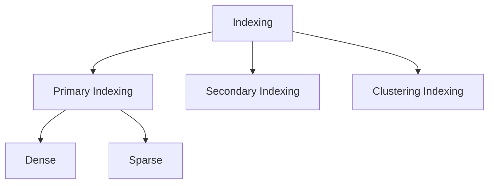
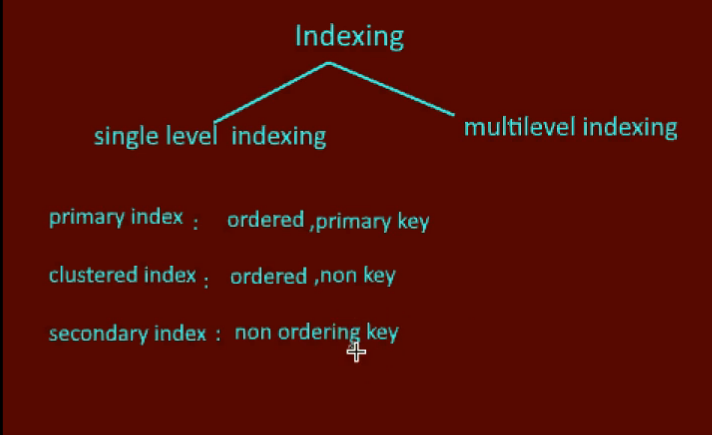
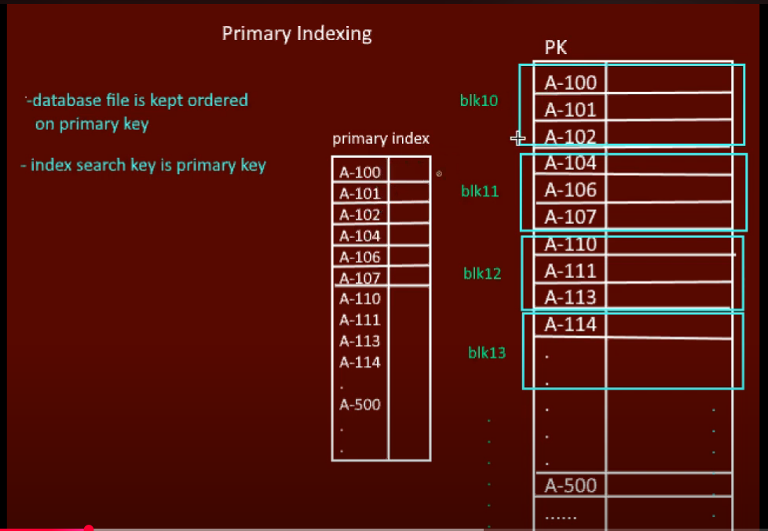
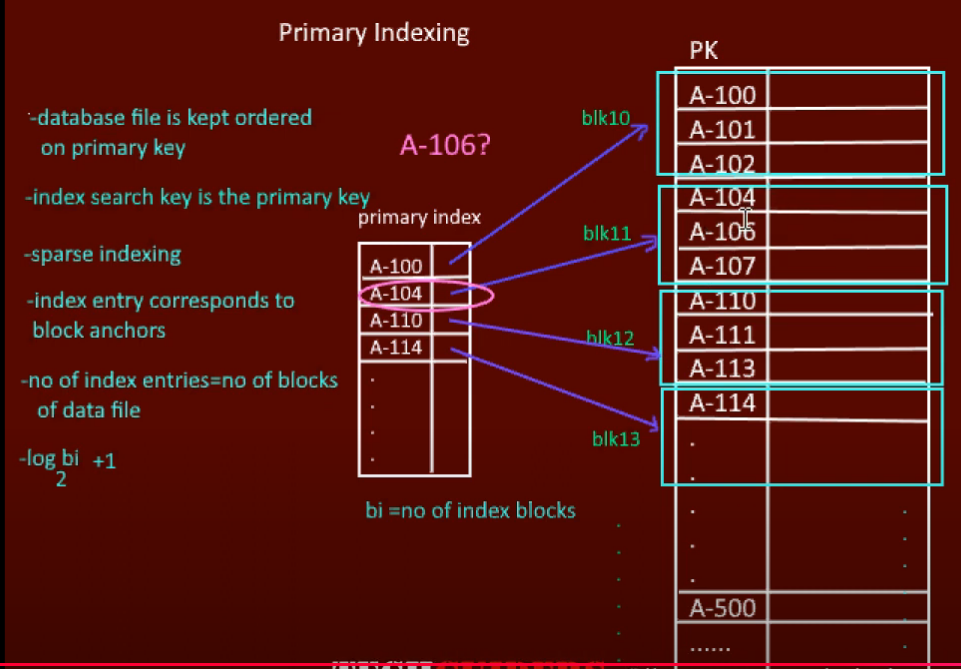
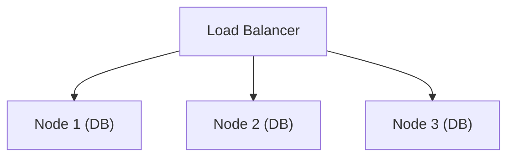

<h1 align="center"> 🌎 DATABASE </h1>
<p align="center">
</p>

---

🧑‍💻 **Author:** RK ROY & Senju Nikhil

> 🧾 _"Databases aren’t just about data—they’re about trust, speed, and reliability."_

---

- <p style = "color:orange"> 📚 Data </p>
    
    - Data is a collections of raw, unorganized facts and details like numbers, text, images, and more.
    - Data is measured in terms of bits and bytes.
    - Data can be recorded and does not have any meaning unless processed.
- <p style = "color:orange"> ㊙️ Types of data </p>
    
    - <p style = "color:"> Quantitative data </p>
        
        - Numerical Form.
        - weight, volume, temperature, etc.
    - Qualitative data
        - Descriptive, but not numerical.
        - Gender, ethnicity, religion, etc.

- <p style = "color:orange"> Information </p>
    
    - Provides context of the data and enables decision making.

- <p style = "color:orange"> Database </p>
      
    - Database is an electronic place/system where data is stored in a way that it can be easily accessed, managed, and updated.
    - To make real use Data, we need Database management systems. (DBMS)

- <p style = "color:orange"> DBMS </p>
     
    - A DBMS (Database Management System) is software that interacts with users, applications, and the database itself to store, manage, and retrieve data efficiently and securely.
      - Advantages :
          - Data Integrity and Consistency : Ensures accuracy and consistency of data across the database.
          - Data Sharing : Multiple users and applications can access the database simultaneously
          - Data Security : Allows different users to have different levels of access.
  <br>

<div align = "center"> <h1 style = "color:purple"> 📚 DBMS Architecture </h1> </div>

- <p style = "color:orange"> View of Data (Three Schema Architecture) </p>
    
    - The purpose is to hide unnecessary details from users and make databases easier to use through three levels of abstraction:
        
    - <p style = "color:green"> Physical Level (Internal Level) </p>
            
        - Describes how data is actually stored in memory (files, indexes, etc.).
        - Deals with low-level data structures, storage allocation, compression, encryption.
        - Goal: Store data efficiently.
    - <p style = "color:green"> Logical Level (Conceptual Level) </p>
                
        - Describes what data is stored and relationships among data.
        - Users at this level don’t worry about physical storage details.
        - Database designers (DBAs) use this level to plan the database structure.
        - Goal: Make database easy to design and manage.
    - <p style = "color:green"> View Level (External Level) </p>
       
        - Describes how users see the data.
        - Different users can have different views of the same database.
        - Uses views/schemas to show only relevant parts of the data.
        - Also helps secure data by restricting what each user group can see.
        - Goal: Provide personalized, secure data views.

<div align = "center">
     </img> 
</div>

- <p style = "color:orange"> Data Models </p>
      
    - Provides a way to describe the design of a DB at logical level.
    - Underlying the structure of the DB is the Data Model; a collection of conceptual tools for describing
  data, data relationships, data semantics & consistency constraints.
   - E.g., ER model, Relational Model, object-oriented model, object-relational data model etc.

- <p style = "color:orange"> Database Languages </p>
     
    - Data definition language (DDL) to specify the database schema.
    - Data manipulation language (DML) to express database queries and updates.
    - Practically, both language features are present in a single DB language, e.g., SQL language.
    - DDL
        - We specify consistency constraints, which must be checked, every time DB is updated.
    - DML
        - Data manipulation involves
            - Retrieval of information stored in DB.
            - Insertion of new information into DB.
            - Deletion of information from the DB.
            - Updating existing information stored in DB.
        - Query language, a part of DML to specify statement requesting the retrieval of information.

<br> 
<div align = "center"> <h1 style = "color:purple"> 📖 Relational Model </h1> </div>

- Relational Model organizes the data in the form of tables.
- Tuple : A single row of the table representing a single data point / a unique record.
- Degree of table: number of attributes/columns in a given table/relation.
- Cardinality: Total no. of tuples in a given relation
- 🗽 Integrity constraints : Integrity constraints in databases are rules that ensure the accuracy, consistency, and validity of data stored in a relational database. They prevent invalid data from being entered and maintain the logical correctness of relationships among tables.
    - Domain integrity :
        - Ensures that values in a column are valid according to the column’s data type, range, or format.
        - Example :
            ```SQL
            age INT CHECK (age >= 0);
            ```

    - Entity Integrity :
        - Ensures that every table has a primary key, and that primary key values are unique and not NULL.
        - Prevents duplicate or missing identifiers for rows.
        - Example :
            ```SQL
            student_id INT PRIMARY KEY;
            ```

    - Referential Integrity :
        - Ensures consistency between foreign keys and the primary key they reference.
        - Prevents “orphan” records (foreign key referring to a non-existent row).
        - Example :
            ```SQL
            FOREIGN KEY (course_id) REFERENCES Course(course_id);
            ```

    - Key Integrity :
        - Guarantee uniqueness of data in certain columns.
        - Includes Primary Key, Unique Key, and Foreign Key constraint
        - Example :
            ```SQL
            email VARCHAR(100) UNIQUE;
            ```

    - Check Constraints
        - Define a condition that each row must satisfy.
        - Example :
            ```SQL
            salary DECIMAL CHECK (salary > 0);
            ```

- <p style = "color:green"> Relational Model keys </p>
   
    - 🔑 Simple Key : Key with only one attribute.
    - 🔑 Primary Key :
        - A column or set of columns that uniquely identifies each row in a table.
        - Cannot have null values.
        - There is only one primary key per table.
        - Example : student_id in student table.
    - 🔑 Candidate Key :
        - Set of all unique keys.
        - Any column (or combination of columns) that can uniquely identify a row.
        - A table can have multiple candidate keys, but only one is chosen as the primary key
        - Example : In an employee table, employee_id and employee_email both are candidate key, but one is choosen as primary key, and other remains as candidate key.
    - 🔑 Super Key :
        - Candidate Key Union U any other attributes.
        - A set of one or more attributes that can uniquely identify a row.
        - Candidate key ⊆ Super key.
        - A super key may contain extra columns.
        - Example : In a Books table:
            - ISBN is a candidate key.
              ISBN + title is also a super key (but not a candidate key since it has extra column).
    - 🔑 Alternate Key :
        - A candidate key that is not chosen as the primary key.
        - Still uniquely identifies rows.
        - Example : In a Users table:
            - Candidate keys: user_id, email.
              If user_id is chosen as the primary key, email becomes an alternate key.
    - 🔑 Foreign Key :
        - A column in one table that refers to the primary key of another table.
        - Used to link tables together.
        - Example :
            - In an Orders table, customer_id can be a foreign key that refers to customer_id in the Customers table.
    - 🔑 Composite Key :
        - A key made up of two or more columns that together uniquely identify a row.
        - Used when a single column is not enough.
        - Example :
            - In an Enrollment table:
              (student_id, course_id) together can be a composite primary key (because a student can take multiple courses).
    - 🔑 Unique Key :
        - Like a candidate key: ensures all values are unique, but can allow one null value (depends on DBMS).
        - Can be used to enforce uniqueness on non-primary attributes.
        - Example :
            - In an Employees table:
              email can be a unique key if it's not the primary key.
    - 🔑 Compound Key :
        - PK which is formed using 2 foreign keys.
        - Key with more than one attribute.

<div align = "center"> 
     </img>
</div>

# 🔐 Key Constraints

- Key Constraints: The six types of key constraints present in the Database management system are:-

- <p style = "color:green"> NOT NULL </p>
   
    - This constraint will restrict the user from not having a NULL value. It ensures that every element in
      the database has a value.

- <p style = "color:green"> UNIQUE </p>
   
    - This constraint ensures that the values in the column are unique.

- <p style = "color:green"> DEFAULT </p> 
   
   - it is used to set the default value to the column. The default value is added to the columns if no value
  is specified for them.

- <p style = "color:green"> CHECK </p>
   
    - It is one of the integrity constraints in DBMS. It keeps the check that integrity of data is maintained
      before and after the completion of the CRUD.

- <p style = "color:green">  PRIMARY KEY </p>
   
    - This is an attribute or set of attributes that can uniquely identify each entity in the entity set. The
      primary key must contain unique as well as not null values.

- <p style = "color:green"> FOREIGN KEY </p>
   
    - Whenever there is some relationship between two entities, there must be some common
      attribute between them. This common attribute must be the primary key of an entity set and will become the
      foreign key of another entity set. This key will prevent every action which can result in loss of connection
      between tables.

<br> 
<div align = "center"> <h1 style = "color:purple"> 📳 Entity RelationShip Model </h1>  </div>

- <p style = "color:orange"> Data Models </p>
    
    - Collection of conceptual tools for describing data, data relationships, data semantics, and consistency constraints.

- <p style = "color:orange"> ER Model </p>
   
    - it is a high level data model based on a perception of a real world that consists of a collection of basic objects, called entities and of relationships among these objects.
    - Graphical representation of ER Model is ER diagram, which acts as a blueprint of DB.

- <p style = "color:orange"> Entity </p>
   
    - An Entity is a “thing” or “object” in the real world that is distinguishable from all other objects.
        - Entity can be uniquely identified. (By a primary attribute, aka Primary Key)
        - Strong Entity: Can be uniquely identified.
        - Weak Entity: Can’t be uniquely identified., depends on some other strong entity.
        - Weak entity depends on strong entity for existence.

- <p style = "color:orange"> Attributes </p>
   
    - An entity is represented by a set of attributes.
    - Each entity has a value for each of its attributes.
    - For each attribute, there is a set of permitted values, called the domain, or value set, of that attribute.
    - E.g., Student Entity has following attributes
        - studentId
        - studentName
        - course

- <p style = "color:orange"> Types of Attributes </p>
   
   - Simple
        - Attributes which can’t be divided further.
        - E.g., Customer’s account number in a bank, Student’s Roll number etc
    - Composite
        - Can be divided into subparts (that is, other attributes).
        - E.g., Name of a person, can be divided into first-name, middle-name, last-name.
        - Address can also be divided, street, city, state, PIN code.
    - Single Valued
        - Only one value attribute.
        - e.g., Student ID, loan-number for a loan.
    - Multi-Valued
        - Attribute having more than one value.
        - e.g., phone-number, nominee-name on some insurance, dependent-name etc.
    - Derived
        - Value of this type of attribute can be derived from the value of other related attributes.
        - e.g., Age, loan-age, membership-period etc.

- <p style = "color:orange"> Relationships </p>
   
    - Association among two or more entities.
    - e.g., Person has vehicle, Parent has Child, Customer borrow loan etc.
    - Strong Relationship, between two independent entities.
    - Weak Relationship, between weak entity and its owner/strong entity.
        - e.g., Loan <instalment-payments> Payment.
    - Degree of Relationship
        - Number of entities participating in a relationship.
        - Unary, Only one entity participates. e.g., Employee manages employee.
        - Binary, two entities participates. e.g., Student takes Course.
        - Ternary relationship, three entities participates. E.g, Employee works-on branch, employee works-on job.

- Entity Relationship Diagram (ERD)
    - An entity relationship diagram (ER diagram or ERD) is a visual representation of how items in a database relate to each other.

- Relationship - One to One

<div>  </img> </div>

- One to Many

<div>  </img> </div>

- Many to One

<div>  </img> </div>

- Many to Many

<div>  </img> </div>

<div>  </img> </div>

- One to Many

<div>  </img> </div>

- Many to One

<div>  </img> </div>

- Many to Many

<div>  </img> </div>

- Strong Entity :
    - An entity that can be uniquely identified by its own attributes, without depending on any other entity.
    - Has a primary key that uniquely identifies each record.
    - In an ER diagram, a strong entity is shown with a single rectangle.

- Weak Entity :
    - An entity that cannot be uniquely identified by its own attributes alone.
    - Depends on a strong entity (called the owner entity) for its identification.
    - In an ER diagram, a weak entity is shown with a double rectangle, and its identifying relationship is shown with a double diamond.

<br> 
<div align = "center"> <h1 style = "color:purple"> 📙 Normalization </h1> </div>

- DBMS Normalization is a systematic approach to decompose (break down) tables to eliminate data redundancy(repetition)
- It is a multi-step process that puts data into tabular form, removes duplicate data, and set up the relationship between tables.

- <p style = "color:green"> 🧠 Why we need Normalization in DBMS ? </p>
   
    - Eliminating redundant(useless) data.
    - Normalization helps in keeping data consistent by storing the data in one table and referencing it everywhere else.
    - Storage optimization although that is not an issue these days because Database storage is cheap
    - Breaking down large tables into smaller tables with relationships, so it makes the database structure more scalable and adaptable.

- <p style = "color:green">  Problems without Normalization in DBMS </p>
   
   - If a table is not properly normalized and has data redundancy(repetition) then it will not only eat up extra memory space but will also make it difficult for you to handle and update the data in the database, without losing data.
    - Insertion, Updation, and Deletion Anomalies are very frequent if the database is not normalized.
    - To understand these anomalies let us take an example of a Student table.

<div align = "center">

| rollno | name | branch | hod  | office_tel |
| :----- | :--- | :----- | :--- | :--------- |
| 401    | Akon | CSE    | Mr.X | 123        |
| 402    | Bkon | CSE    | Mr.X | 123        |
| 403    | Ckon | CSE    | Mr.X | 123        |
| 404    | Dkon | CSE    | Mr.X | 123        |

</div>

- In the table above, we have data for four Computer Sci. students.
    - As we can see, data for the fields branch, hod(Head of Department), and office_tel are repeated for the students who are in the same branch in the college, this is Data Redundancy.

- <p style = "color:green"> Insertion Anomaly in DBMS </p>
   
    - Suppose for a new admission, until and unless a student opts for a branch, data of the student cannot be inserted, or else we will have to set the branch information as NULL.
    - Also, if we have to insert data for 100 students of the same branch, then the branch information will be repeated for all those 100 students.
        - These scenarios are nothing but Insertion anomalies.

- <p style = "color:green"> Updation Anomaly in DBMS </p>
   
    - What if Mr. X leaves the college? or Mr. X is no longer the HOD of the computer science department? In that case, all the student records will have to be updated, and if by mistake we miss any record, it will lead to data inconsistency.
    - This is an Updation anomaly because you need to update all the records in your table just because one piece of information got changed.

- <p style = "color:green"> Deletion Anomaly in DBMS </p>
   
    - In our Student table, two different pieces of information are kept together, the Student information and the Branch information.
    - So if only a single student is enrolled in a branch, and that student leaves the college, or for some reason, the entry for the student is deleted, we will lose the branch information too.
    - So never in DBMS, we should keep two different entities together, which in the above example is Student and branch,

- The solution for all the three anomalies described above is to keep the student information and the branch information in two different tables. And use the branch_id in the student table to reference the branch.

# 📖 Types of DBMS Normal Forms

- <p style = "color:green"> First Normal Form (1NF) </p>
    
    - For a table to be in the First Normal Form, it should follow the following rules:
        - It should only have single(atomic) valued attributes/columns.
        - All the columns in a table should have unique names.
        - Example :

<div align = "center">

Not in 1NF

| StudentID | Name | Subjects           |
| --------- | ---- | ------------------ |
| 1         | Raj  | Math, Physics      |
| 2         | Roy  | Chemistry, Biology |

In 1NF

| StudentID | Name | Subject   |
| --------- | ---- | --------- |
| 1         | Raj  | Math      |
| 1         | Raj  | Physics   |
| 2         | Roy  | Chemistry |
| 2         | Roy  | Biology   |

</div>

- <p style = "color:green"> Second Normal Form (2NF) </p>
   
    - For a table to be in the Second Normal Form, it should follow the following rules:
        - It should be in the First Normal form.
        - It should not have partial dependencies.
        - 🧠 what is a partial dependency ?
            - When a table has a primary key that is made up of two or more columns, then all the columns(not included in the primary key) in that table should depend on the entire primary key and not on a part of it. If any column(which is not in the primary key) depends on a part of the primary key then we say we have Partial dependency in the table.
        - Example

<div align = "center"> 
Not in 2NF

| StudentID | SubjectID | StudentName | SubjectName |
| --------- | --------- | ----------- | ----------- |
| 1         | 101       | Raj         | Math        |
| 1         | 102       | Raj         | Physics     |
| 2         | 103       | Roy         | Chemistry   |

Not in 2NF Because here lets say we have a primary key (studentId, SubjectId) then StudentName here is having a partial dependency as StudentName is only dependent on studentId but on SubjectId;

In 2NF (split it into 3 tables)

| StudentID | StudentName |
| --------- | ----------- |
| 1         | Raj         |
| 2         | Roy         |

| SubjectID | SubjectName |
| --------- | ----------- |
| 101       | Math        |
| 102       | Physics     |
| 103       | Chemistry   |

| StudentID | SubjectID |
| --------- | --------- |
| 1         | 101       |
| 1         | 102       |
| 2         | 103       |

</div>

- <p style = "color:green"> Third Normal Form (3NF) </p>
   
    - For a table to be in the Third Normal Form, it should follow the following rules:
        - It should be in 1NF and 2NF.
        - And, it doesn't have Transitive Dependency.
        - 🧠 what is a Transitive Dependency ?
            - In a table we have some column that acts as the primary key and other columns depends on this column. But what if a column that is not the primary key depends on another column that is also not a primary key or part of it? Then we have Transitive dependency in our table.
        - Example :

<div align = "center"> 
Not in 3NF

| EmployeeID | EmployeeName | DeptID | DeptName | DeptLocation |
| ---------- | ------------ | ------ | -------- | ------------ |
| 1          | Aman         | 10     | IT       | Mumbai       |
| 2          | Neha         | 20     | HR       | Delhi        |

Not in 3BNF because here, DeptName and DeptLocation are non-prime attributes and depend on DeptID, which is not a key but still determines them.

In 3NF (split it into 2 tables)

| EmployeeID | EmployeeName | DeptID |
| ---------- | ------------ | ------ |
| 1          | Aman         | 10     |
| 2          | Neha         | 20     |

| DeptID | DeptName | DeptLocation |
| ------ | -------- | ------------ |
| 10     | IT       | Mumbai       |
| 20     | HR       | Delhi        |

</div>

- <p style = "color:green"> Boyce-Codd Normal Form (BCNF) </p>
   
    - For a table to be in the Boyce-Codd Normal Form, it should follow the following rules:
        - This form deals with a certain type of anomaly that is not handled by 3NF.
        - Must be in 3NF.
        - and, for each functional dependency ( X → Y ), X should be a Super Key.
        - Example :

<div align = "center">
Not in BCNF

| studentId | Course | Instructor |
| --------- | ------ | ---------- |
| 1         | DBMS   | Raj        |
| 2         | DS     | Raj        |
| 3         | AI     | Roy        |

Not in BCNF as Candidate key = (StudentID, CourseID) and CourseID is not a key, but it determines Instructor

In BCNF

| Course | Instructor |
| ------ | ---------- |
| DBMS   | Raj        |
| DS     | Raj        |
| AI     | Roy        |

| studentId | Course |
| --------- | ------ |
| 1         | DBMS   |
| 2         | DS     |
| 3         | AI     |

</div>

- <p style = "color:green"> Fourth Normal Form (4NF) </p>
   
    - For a table to be in the Fourth Normal Form, it should follow the following rules:
        - It is in the Boyce-Codd Normal Form.
        - And, it doesn't have Multi-Valued Dependency.
        - Example :

<div align = "center">
Not in 4NF

| Student | Course | Hobby   |
| ------- | ------ | ------- |
| Raj     | DBMS   | Cricket |
| Raj     | DBMS   | Music   |
| Raj     | AI     | Cricket |
| Raj     | AI     | Music   |

Not in 4NF because here, student can have multiple courses and multiple hobbies, but here course and hobby are independent of each other.

In 4NF

| Student | Course |
| ------- | ------ |
| Raj     | DBMS   |
| Raj     | AI     |

| Student | Hobby   |
| ------- | ------- |
| Raj     | Cricket |
| Raj     | Music   |

</div>

- <p style = "color:green"> Fifth Normal Form (5NF) </p>
   
    - For a table to be in the Fifth Normal Form, it should follow the following rules:
        - It is in the Fourth Normal Form.
        - The fifth normal form is also called the PJNF - Project-Join Normal Form
        - It is the most advanced level of Database Normalization.
        - Using Fifth Normal Form you can fix Join dependency and reduce data redundancy.
        - It also helps in fixing Update anomalies in DBMS design.
        - cannot be decomposed into smaller tables without losing data or introducing redundancy.
        - Example :

<div align = "center"> 
    
| Supplier | Part | Project |
| -------- | ---- | ------- |
| s1        | P1   | j1      |
| s1        | P1   | j2     |
| s1 | p2 | j1|
|s1 | p2 | j2|

Not in 5NF because here a supplier can supply many parts, a supplier can work on many projects and a part can be used in many projects, here all 3 facts are mixed leading to redundant combinations.

In 5NF

| Supplier | Part |
| -------- | ---- |
| S1       | P1   |
| S1       | P2   |

| Supplier | Project |
| -------- | ------- |
| S1       | J1      |
| S1       | J2      |

| Part | Project |
| ---- | ------- |
| P1   | J1      |
| P1   | J2      |
| P2   | J1      |
| P2   | J2      |

</div>

- Advantages of Normal Forms :
    - Reduced data redundancy
    - Improved data consistency
    - Simplified database design
    - Improved query performance
    - Easier database maintenance

- 🧠 When to Use Normalization and Denormalization ?
    - Normalization is best suited for transactional systems where data integrity is paramount, such as banking systems and enterprise applications.
    - Denormalization is ideal for read-heavy applications like data warehousing and reporting systems where performance and query speed are more critical than data integrity.

<br> 
<div align = "center"> <h1 style = "color:purple"> 🤑 Transaction & Concurrency Control </h1> </div>

- A transaction refers to a sequence of one or more operations (such as read, write, update, or delete) performed on the database as a single logical unit of work.

- A transaction ensures that either all the operations are successfully executed (committed) or none of them take effect (rolled back)

- Transactions are designed to maintain the integrity, consistency and reliability of the database, even in the case of system failures or concurrent access.

- <p style = "color:green"> Properties of Transaction </p>
   
    - Transactions in DBMS must ensure data is accurate and reliable. They follow four key ACID properties:
        - Atomicity: A transaction is all or nothing. If any part fails, the entire transaction is rolled back. Example: While transferring money, both debit and credit must succeed. If one fails, nothing should change.
        - Consistency: A transaction must keep the database in a valid state, moving it from one consistent state to another. Example: If balance is ₹1000 and ₹200 is withdrawn, the new balance should be ₹800.
        - Isolation: Transactions run independently. One transaction’s operations should not affect another’s intermediate steps. Example: Two users withdrawing from the same account must not interfere with each other’s balance updates.
        - Durability: Once a transaction is committed, its changes stay even if the system crashes. Example: After a successful transfer, the updated balance remains safe despite a power failure.

- <p style = "color:green"> Transaction Schedules </p>
   
    - When multiple transaction requests are made at the same time, we need to decide their order of execution. Thus, a transaction schedule can be defined as a chronological order of execution of multiple transactions. Example: After a successful transfer, the updated balance remains safe despite a power failure.
    - There are broadly two types of transaction schedules discussed as follows:
        - Serial Schedule :
            - In a serial schedule, transactions execute one at a time, ensuring database consistency but increasing waiting time and reducing system throughput. To improve throughput while maintaining consistency, concurrent schedules with strict rules are used, allowing safe simultaneous execution of transactions.
        - Non-Serial Schedule
            - Non-serial schedule is a type of transaction schedule where multiple transactions are executed concurrently, interleaving their operations, instead of running one after another. It improves system efficiency but requires concurrency control to maintain database consistency.

- <p style = "color:green">  🧠 What is meant by a transaction in DBMS ? </p>
   
    - In DBMS, a transaction is a set of logical operations performed to access and modify the contents of the database as per the user's request.

- <p style = "color:green"> 🧠 What is meant by ACID properties in transactions ? </p>
   
    - ACID is an acronym used for the properties of transaction in DBMS. It is used to denote the properties of transactions, i.e. Atomicity, Consistency, Isolation and Durability.

- <p style = "color:green"> 🧠 What is meant by schedules of transactions in DBMS ? </p>
   
    - When multiple transaction requests are made at the same time, we need to decide the order of execution of these transactions. This chronological order of execution of transactions is called as a schedule of transactions in DBMS. It is mainly of two types, i.e. Serial Schedules and Non Serial Schedules.

- <p style = "color:green"> 🧠What do you mean by serializability in DBMS ? </p>
   
    - Serializability is the property of a schedule of transactions in DBMS which determines whether the database would be in consistent state or not if the transactions are executed following the given schedule.

- <p style = "color:green"> Concurrency Control(higher throughput) </p>
   
   
    - Concurrency control is a critical mechanism in DBMS that ensures the consistency and integrity of data when multiple transactions are performed at the same time.
    - Concurrency control is a concept in Database Management Systems (DBMS) that ensures multiple transactions can simultaneously access or modify data without causing errors or inconsistencies.
    - The main goal of concurrency control is to ensure that simultaneous transactions do not lead to data conflicts or violate the consistency of the database. The concept of serializability is often used to achieve this goal.

- <p style = "color:green"> Problems due to Concurreny </p>
   
    - Dirty Read – A transaction reads uncommitted data from another transaction
    - Lost Update – Two transactions overwrite each other’s changes.
    - Unrepeatable Read – A transaction reads the same data twice but gets different values because another transaction modified it in between.
    - Phantom Read – A transaction re-executes a query and finds new rows inserted by another transaction.
- DBMS uses concurrency control (like locks, timestamps, isolation levels) to avoid these issues.

<br> 
<div align = "center"> <h1 style = "color:purple"> 📚 Indexing in DBMS </h1> </div>

<div align = "center"> <h2 style = "color:orange"> Disk Structure </h2> </div>
<div align = "center">
     </img>
</div>

- Assume each block is of size 512B.
- assume we have a table named Employee of 100 records or rows.

<div align = "center">

| eid     | name    | dep     | sec     | add     |
| ------- | ------- | ------- | ------- | ------- |
| Item1.1 | Item2.1 | Item3.1 | Item4.1 | Item5.1 |
| Item1.2 | Item2.2 | Item3.2 | Item4.2 | Item5.2 |

</div>

- Assume each row is of size 128B then in a block we can store 512 / 128 = 4 rows.
- So, if we want to store each of these 100 records we need to create 100 / 4 = 25 blocks.
- By doing so if we want to search some record we need to traverse all 25 blocks.
- We can do better by creating a index table for Employee table which will store the key value pair i.e Key(eid) and value is a pointer pointing to the block itself saying in which block the information of this record is stored in the disk.
- For each record we will have their entry.
- We store index table in the disk as well.
- Lets say the index table size is 16B then we can st store 512 / 16 = 32 blocks.
- And total blocks required to store all the index table = 100 / 32 = 4 blocks.
- For at most we need any 4 blocks to search through the index table and then we can find the block for the record.
- So in total we need only 4 + 1 = 5 blocks to be searched to find the record not 25 blocks as required without indexing.
- But what if the size of the index table itself is much bigger due to larger number of data in the original table itself.
- In that case we can create a multi-level indexing structure mainting another index table for all the index tables.
- And this the reason why we need to B and B+ Trees.

<div align = "center"> <h2 style = "color:Orange"> B Trees <h2>  </div>

- A B-Tree is a specialized m-way tree designed to optimize data access, especially on disk-based storage systems.
- In a B-Tree of order m, each node can have up to m children and m-1 keys, allowing it to efficiently manage large datasets.
- The value of m is decided based on disk block and key sizes.
- One of the standout features of a B-Tree is its ability to store a significant number of keys within a single node, including large key values. It significantly reduces the tree’s height, hence reducing costly disk operatio
- B Trees allow faster data retrieval and updates, making them an ideal choice for systems requiring efficient and scalable data management. By maintaining a balanced structure at all times,
- B-Trees deliver consistent and efficient performance for critical operations such as search, insertion, and deletion.

<div align = "center"> 
     </img>
</div>

- Properties of B Trees :
    - All leaf nodes of a B tree are at the same level, i.e. they have the same depth (height of the tree).
    - The keys of each node of a B tree (in case of multiple keys), should be stored in the ascending order.
    - In a B tree, all non-leaf nodes (except root node) should have at least $m/2$ children.
    - All nodes (except root node) should have at least $m/2 - 1$ keys.
    - A non-leaf node with $n - 1$ key values should have n non NULL children.
    - Keys are inserted in buttom up manner.
    - Height when the B-tree is completely full (i.e., all nodes have the maximum m children):
        - $h_{\min} = \lceil \log_{m}(n+1) \rceil - 1$
    - Height when the B-tree is least filled (each node has the minimum t children):
        - $h_{\max} = \lceil \log_{t}(n+1) \rceil$

<div align = "center"> <h2 style = "color:orange"> B+ Trees </h2> </div>

- A B+ Tree is an advanced data structure used in database systems and file systems to maintain sorted data for fast retrieval, especially from disk. It is an extended version of the B Tree, where all actual data is stored only in the leaf nodes, while internal nodes contain only keys for navigation.

- Components of B+ Tree :
    - Leaf nodes store all the key values and pointers to the actual data.
    - Internal nodes store only the keys that guide searches.
    - All leaf nodes are linked together, supporting efficient sequential and range queries.

# BST vs B-Tree

A **BST (Binary Search Tree)** and a **B-Tree** both store data in sorted order, but they are designed for different use cases.  
The main reason to use a **B-Tree** over a **BST** is **performance in disk-based or large data systems**.

---

## 🔹 Binary Search Tree (BST)

- Each node has at most **2 children**.
- **Operations** (search, insert, delete):
    - **O(log n)** in best/average case (if balanced).
    - **O(n)** in worst case (if skewed/unbalanced).
- Stored usually in **memory (RAM)**, where accessing nodes is cheap (constant time).

---

## 🔹 B-Tree

- A **generalization of BST** → each node can have **many keys** and **many children** (not limited to 2).
- Nodes are designed to match the **block size of disks/pages** in databases.
- Each read/write loads an entire **block**, reducing **disk I/O**.
- **Operations** (search, insert, delete): **O(log n)**, but with **fewer disk reads**.
- Always kept **balanced** (height is low).

---

## ⚡ Why B-Tree over BST?

1. **Disk I/O minimization**
    - Accessing disk is **millions of times slower** than RAM.
    - BST may require traversing many small nodes → many disk reads.
    - B-Tree packs many keys in one node → fewer disk accesses.

2. **Guaranteed balance**
    - B-Tree is **always balanced** (low height).
    - BST can become skewed like a linked list unless extra balancing (AVL, Red-Black).

3. **Databases & File Systems**
    - Used in **databases, indexing, and file systems** (NTFS, EXT4, HFS+).
    - Optimized for **range queries** and **sequential access**.

---

## 👉 In short

- **Use BST** when data fits in memory and you want simplicity.
- **Use B-Tree** when data is on **disk/storage** and you need efficient indexing with **minimal disk reads**.

# 🔹 Difference between B-Tree and B+ Tree

---

## 1. Where keys and data are stored

- **B-Tree**
    - Both **keys + data** (records/pointers to records) can be stored in **internal nodes** and **leaf nodes**.
    - Searching might **stop at an internal node**.

- **B+ Tree**
    - Internal nodes store **only keys** (indexing), **no data**.
    - Leaf nodes store **all actual data/record pointers**.
    - All leaves are **linked together** (linked list).

---

## 2. Search Efficiency

- **B-Tree**: Search may **stop early** at internal nodes → not consistent.
- **B+ Tree**: Always goes to the **leaf level** → predictable search time.

---

## 3. Range Queries

- **B-Tree**: No direct way to scan sequentially → need **in-order traversal**.
- **B+ Tree**: Leaves are linked → **fast sequential access** and **range queries** (e.g., `WHERE age BETWEEN 20 AND 30`).

---

## 4. Space Utilization

- **B-Tree**: Internal nodes hold both **keys + data** → fewer keys per node → **larger height**.
- **B+ Tree**: Internal nodes hold **only keys** → more branching factor → **smaller height**, fewer disk I/Os.

---

## ⚡ Why DBMS and File Systems Prefer B+ Tree

- **Better disk read efficiency** → shorter, broader tree (internal nodes are smaller).
- **Fast range queries** → leaf nodes are linked list.
- **Consistent access time** → every search goes to leaf.
- **Efficient sequential scans** of entire table/index.

---

## 🔹 Example

Suppose **block size = 4 KB**:

- **B-Tree**: Internal node stores **keys + record pointers**, so it may hold ~50 keys.
- **B+ Tree**: Internal node stores **only keys**, so it can hold ~200+ keys.

👉 Tree height shrinks a lot → fewer disk accesses.

---

## ✅ In short

We use **B+ Tree** over **B-Tree** because it gives:

- Smaller height (**fewer disk I/Os**)
- Better **range queries** (linked leaves)
- **Predictable search time** (always goes to leaves)

# 🔍 Need of Indexing in DBMS

Indexing in DBMS is like the **index of a book** – instead of scanning every page to find a topic, you directly go to the page number from the index.

Without indexing, the database might need to **scan the entire table (linear search)**, which is very slow for large datasets.

---

## ✅ Why Indexing is Needed?

### 1. Faster Data Retrieval

- Speeds up queries by avoiding full table scans.
- Example: Searching for `EmployeeID = 105` in a table of **1M rows** → index allows quick access instead of scanning all rows.

### 2. Efficient Searching

- Index uses **tree structures** (B-Tree, B+ Tree) or **hashing**.
- Reduces search complexity from **O(n)** → **O(log n)** or even **O(1)**.

### 3. Improves Range Queries

- Ordered indexes make queries like:

# 📂 Dense Index vs Sparse Index

## 🔹 1. Dense Index

**Definition**: For every search key value in the data file, there exists an index entry.

### How it works:

- Suppose we have records `A, B, C, D, F, H`.
- The index contains an entry for **every key** (`A, B, C, D, F, H`).
- Each index entry points directly to the location of that record in the data file.

### ✅ Advantages:

- Very fast lookups (because every record has an index entry).
- Direct access to any record.

### ❌ Disadvantages:

- More space overhead (since index stores one entry for each record).
- Slower inserts/deletes (index must also be updated for every change).

**Use case**: When fast retrieval is critical, and space overhead is acceptable.

## 🔹 2. Sparse Index

**Definition**: Index records are created **only for some search key values** (not all).

### How it works:

- Index stores only a **few keys** (e.g., first record of each block/page: `A, D, G, L...`).
- To search:
    1. Use the index to find the **closest key ≤ search value**.
    2. Then scan sequentially in the data file until the exact record is found.

### ✅ Advantages:

- Much smaller index size (less space needed).
- Faster to maintain (fewer updates).

### ❌ Disadvantages:

- Slower lookups (may require scanning records within a block).
- Works only if data file is stored in **sorted order**.

**Use case**: When dataset is huge, and space efficiency is more important than fastest possible lookup.

 </img>

## ⚡ Key Differences (Dense vs Sparse)

| Feature                | Dense Index 🟢            | Sparse Index 🟡                           |
| ---------------------- | ------------------------- | ----------------------------------------- |
| **Index entries**      | One for **every record**  | One for **few records** (e.g., per block) |
| **Space requirement**  | High                      | Low                                       |
| **Search speed**       | Very fast (direct access) | Slower (needs sequential scan)            |
| **Maintenance**        | Costly (frequent updates) | Easier (fewer updates)                    |
| **Works with sorted?** | Not necessary             | **Necessary**                             |

👉 **In short**:

- **Dense Index** → Faster, but larger index.
- **Sparse Index** → Smaller, but slower (requires sequential scan).

# 📌 Single Level Indexing vs Multilevel Indexing

---

## 📌 Single Level Indexing

- In this approach, **one index file** is created for the data file.
- The index file contains **pointers to the actual data records**.

### 🔎 Searching process:

1. Look up the index.
2. Use it to directly access the data file.

👉 Works fine for **small datasets**, but as data grows, the index itself becomes too large, leading to **slow searches**.

---

## 📌 Multilevel Indexing

- Instead of keeping **one large index**, we create **indexes on indexes**.
- The first-level index points to **second-level indexes**, which in turn point to the **data blocks**.

### 🔎 Searching process:

1. Start from the **top-level index**.
2. Narrow down step by step until you reach the data file.

👉 This reduces the **search time drastically** because each index file is smaller and can be searched quickly.

---

 </img>

## ⚡ Comparison

| Feature               | Single Level Indexing 🟢     | Multilevel Indexing 🟡             |
| --------------------- | ---------------------------- | ---------------------------------- |
| **Structure**         | One index file               | Multiple levels of indexes         |
| **Search time**       | Slower for large data (O(n)) | Much faster (like O(log n))        |
| **Space requirement** | Requires large index file    | Smaller indexes at multiple levels |
| **Use case**          | Small databases              | Large databases                    |

---

## ✅ Real-Life Analogy

- **Single Level Indexing** → Like having a book with **one index list** at the back. If the index is huge, it takes time to find.
- **Multilevel Indexing** → Like having a **dictionary with tabs (A, B, C…)** → first you go to the tab, then to the word → faster navigation.

---

👉 **In short**:

- **Single Level Index** → Simple but inefficient for huge data.
- **Multilevel Index** → Hierarchical structure (like **B-Tree**), reduces search time and improves efficiency for large databases.

<div align = "center"> <h2 style = "color:orange"> Indexing </h2> </div>

- Indexing in DBMS is used to speed up data retrieval by minimizing disk scans.
- When an index is created, it stores sorted key values and pointers to actual data rows. This reduces the number of disk accesses, improving performance especially on large datasets.

<div align = "center"> 
     </img>
</div>

- The data in which in the form of table are logically represented but are not actually stored in db.
- They are stored in the form of Data Pages.
- DBMS creates Data Pages (generally of 8KB depends upon db to db).
- Each page can store multiple table rows in it.

<div> 
     </img>
</div>

- These data pages untimately gets stored in the data block in physical memory.
- <p style = "color:green"> 🧠 what is a data block ? </p>
   
    - Data block is the minimum amount of data which can be read/write by and I/O operation.
    - It is managed by underlying storage system like disks.
    - Data block size can range from 4KB to 32KB.

- DBMS maintains the mapping of Data Page and Data Block.

- Atrributes of indexing :
    - Access Types: This refers to the type of access such as value-based search, range access, etc.
    - Access Time: It refers to the time needed to find a particular data element or set of elements.
    - Insertion Time: It refers to the time taken to find the appropriate space and insert new data.
    - Deletion Time: Time taken to find an item and delete it as well as update the index structure.
    - Space Overhead: It refers to the additional space required by the index.

# 📚 Types of Indexing in DBMS

Indexing is a data structure technique to quickly retrieve records from a database.  
It improves the speed of operations but may add overhead in terms of storage and maintenance.

<div align = "center">



</div>

<div align = "center">

| Ordered Files   | Primary Index(Sparse) | Clustered Index |
| --------------- | --------------------- | --------------- |
| Unordered Files | Secondary Index       | Secondary Index |
|                 | Key                   | Non-Key         |

</div>

- Primary Index
    - Defined on the **primary key** of a table.
    - The index entries are **sorted on the primary key field**.
    - Each record in the data file is uniquely identified.
    - ✅ Example:
        - StudentID (Primary Key) → Points to Student Record.

<div align = "center">
 </img>
</div>

- Here sparse is index is used (since the key is unique and they are sorted in tables as well).
- Just in case if the keys in table is unique but they are not in sorted order then for each entries we need to make the pointer to its address or block in index table, making is dense.

- Secondary Index
    - Defined on a **non-primary key (candidate key or other attribute)**.
    - Provides an additional path to retrieve data efficiently.
    - Can have multiple secondary indexes for different attributes.
    - ✅ Example:
        - Name (Secondary Key) → Points to Student Record(s)

- Clustered Index
    - The **ordering of the index** determines the **physical order of records** in the data file.
    - A table can have **only one clustered index**.
    - Often created on primary key by default.
    - ✅ Example:
        - Clustered on RollNo → Records stored in sorted order of RollNo.

- Non-Clustered Index
    - The **index is stored separately** from the actual data.
    - Contains pointers to the data location.
    - A table can have **multiple non-clustered indexes**.
    - ✅ Example:
        - Non-Clustered on Name → Index table points to actual record locations.

- Dense Index
    - Index entry for **every search key value** in the data file.
    - Faster lookup but requires more storage.
    - ✅ Example:
        - Key: 10 → Record Address - Key: 20 → Record Address - Key: 30 → Record Address

- Sparse Index
    - Index entries only for **some search key values**.
    - Saves space but lookup may take longer.
    - ✅ Example:
        - Key: 10 → Record Address - Key: 30 → Record Address - (Skips 20, must traverse from 10 or 30)

# 📊 Summary Table

| Index Type      | Key Field        | Record Order | Multiple Allowed | Storage Usage |
| --------------- | ---------------- | ------------ | ---------------- | ------------- |
| Primary Index   | Primary Key      | Sorted       | ❌ No            | Medium        |
| Secondary Index | Non-Primary Key  | Unsorted     | ✅ Yes           | High          |
| Clustered Index | Any (usually PK) | Sorted       | ❌ No            | Medium        |
| Non-Clustered   | Any Attribute    | Unsorted     | ✅ Yes           | High          |
| Dense Index     | All Keys         | Direct Map   | -                | High          |
| Sparse Index    | Some Keys        | Indirect Map | -                | Low           |

# 📌 Types of Indexing in DBMS

Indexing helps in faster retrieval of data. It can be broadly divided into:

- **Single-Level Indexing**
- **Multilevel Indexing**

## 🔹 Single-Level Indexing

This means there is only **one index file** for the data file.  
It is further divided into three types:

### 1. **Primary Index**

- Built on the **primary key** of the table.
- Ordered index → index entries are stored in **sorted order** of primary key.
- Since primary keys are unique, each entry points to exactly one record.
- **Efficient for direct lookups.**

👉 **Example**: Employee table indexed on `EmpID` (primary key).

### 2. **Clustered Index**

- Built on a **non-primary key attribute** that determines the **physical order** of data.
- Ordered, but not on primary key.
- Only **one clustered index** is allowed per table, because data can be physically ordered only in one way.

👉 **Example**: A clustered index on `Salary` where rows are physically ordered by salary values.

### 3. **Secondary Index**

- Built on a **non-ordering key** (any attribute that is neither primary key nor clustered).
- Does not affect the **physical order** of data.
- Multiple **secondary indexes** can exist in a table.
- Typically implemented using **dense indexes**.

👉 **Example**: An index on `Department` in Employee table, even though data is not stored in department order.

## 🔹 Multilevel Indexing

- When the index file itself becomes too large, we create **indexes on indexes**.
- Reduces search time by applying a **hierarchical structure (like B-Tree)**.
- Useful for **large databases**.

<div align="center">
    
</div>

## ✅ Summary

- **Primary Index** → Ordered, built on **primary key**.
- **Clustered Index** → Ordered, built on **non-key attribute**, determines data storage order.
- **Secondary Index** → Built on **non-ordering attributes**, allows flexible searching.
- **Multilevel Indexing** → Adds hierarchy to indexes for efficiency in **large datasets**.

# 📌 Primary Indexing

Primary Indexing is an **ordered index** built on the **primary key** of a table.

Since the **primary key is unique and sorted**, the index entries are also stored in sorted order.

---

## 🔹 Structure

The index file contains two fields:

1. **Primary Key (search key)**
2. **Pointer (address) to the actual record in the data file**

---

## 📖 Example

Suppose you have a **Student** table:

| RollNo (PK) | Name   | Marks |
| ----------- | ------ | ----- |
| 101         | Aakash | 85    |
| 102         | Nikhil | 90    |
| 103         | Riya   | 78    |
| 104         | Sam    | 88    |

The **primary index** will look like this:

| RollNo (Index Key) | Pointer to Record |
| ------------------ | ----------------- |
| 101                | → Record 1        |
| 102                | → Record 2        |
| 103                | → Record 3        |
| 104                | → Record 4        |

---

## 🔹 How It Works

If you want to search for **RollNo = 103**:

1. Go to the index file (small in size).
2. Perform a **binary search** on the sorted RollNo.
3. Get the pointer and directly access the record in the main file.

✅ This avoids scanning the entire table (**no full table scan**).

---

## ⏱️ Time Complexity

- **Searching in index file:** `O(log₂N)` (binary search)
- **Accessing record from pointer:** `O(1)`
- ✅ **Overall:** `O(log₂N)`

---

## 📌 Key Points

- Works only on the **primary key**.
- Index file is **smaller** than the data file, so searching is faster.
- Records in data file are stored in the **same sorted order** as primary key.

---

# 🔹 Types of Primary Indexing

<div align="center">
    
</div>

## 1️⃣ Dense Primary Index

- **Every search key value (primary key) has an entry in the index.**
- That means for **each record** in the data file, there’s a corresponding index entry.

### ✅ Example

**Data File (sorted by RollNo):**

| RollNo | Name   | Marks |
| ------ | ------ | ----- |
| 101    | Aakash | 85    |
| 102    | Nikhil | 90    |
| 103    | Riya   | 78    |
| 104    | Sam    | 88    |

**Index File (Dense Index):**

| RollNo | Pointer |
| ------ | ------- |
| 101    | → Rec 1 |
| 102    | → Rec 2 |
| 103    | → Rec 3 |
| 104    | → Rec 4 |

📌 Every row is indexed.

- Search is **very fast** (`O(log N)`), but index size is **large**.

---

<div align="center">
    
</div>

## 2️⃣ Sparse Primary Index

- **Not every search key has an entry.**
- Only **one entry per block (page)** of the data file is kept in the index.
- Inside the block, records are searched **linearly**.

### ✅ Example (suppose each block stores 2 records):

**Data File:**

- **Block 1:** (101, Aakash), (102, Nikhil)
- **Block 2:** (103, Riya), (104, Sam)

**Index File (Sparse Index):**

| RollNo | Pointer (to block) |
| ------ | ------------------ |
| 101    | → Block 1          |
| 103    | → Block 2          |

📌 Here:

- To search **RollNo = 102** → go to index (find Block 1) → scan block linearly.
- Index size is **much smaller**, but lookup is a bit **slower**.

---

## 🔍 Comparison

| Feature          | Dense Index               | Sparse Index                         |
| ---------------- | ------------------------- | ------------------------------------ |
| Entries in Index | One for **every record**  | One for **every block/page**         |
| Index Size       | Large                     | Small                                |
| Search Speed     | Very fast (direct access) | Slower (block scan needed)           |
| Storage Overhead | High                      | Low                                  |
| Use Case         | When memory is sufficient | When data is huge, memory is limited |

---

## 👉 In Summary

- **Dense Index** → faster search, more storage.
- **Sparse Index** → smaller index, slower search.

# 📌 Clustering Index

<div align="center">
    
</div>
A **Clustering Index** is created when the records in a data file are physically ordered (clustered) based on a **non-primary key column** (called the clustering field).

Unlike a primary index (which is built on a primary key that is unique), a clustering index can be built on a field that is **not unique**.

---

## 🔹 Key Idea

- Records with the **same value** of the clustering field are **stored together (clustered)** in the same block.
- The **index contains one entry for each distinct value** of the clustering field.
- Each index entry points to the **first block containing that value**.

---

## 📖 Example

Suppose you have a **Student** table:

| RollNo (PK) | Name   | Department |
| ----------- | ------ | ---------- |
| 101         | Aakash | CSE        |
| 104         | Sam    | CSE        |
| 103         | Riya   | ECE        |
| 102         | Nikhil | CSE        |
| 105         | Aman   | ECE        |

### Step 1: Store data in **clustered order by Department**

| RollNo | Name   | Department |
| ------ | ------ | ---------- |
| 101    | Aakash | CSE        |
| 102    | Nikhil | CSE        |
| 104    | Sam    | CSE        |
| 103    | Riya   | ECE        |
| 105    | Aman   | ECE        |

(All `CSE` students are grouped, then `ECE` students.)

### Step 2: Build **Clustering Index** on Department

| Department | Pointer (to first record) |
| ---------- | ------------------------- |
| CSE        | → Record 1 (Aakash)       |
| ECE        | → Record 4 (Riya)         |

---

## 🔹 How It Works

- Search for `Department = CSE`:
    1. Look into the clustering index → find pointer to the first `CSE` record.
    2. Retrieve **all consecutive CSE records** directly since they are stored together.

✅ Efficient for **range queries** and **group queries** (e.g., “Find all CSE students”).

---

## ⏱️ Time Complexity

- **Search for a value:** `O(log₂M)` in index (where M = distinct values).
- **Retrieving records:** sequential scan in clustered block(s).
- Much faster than scanning the whole table.

---

## 📌 Key Points

- Built on **non-primary key** (clustering field).
- **One index entry per distinct value**.
- Records are **physically grouped** by clustering field.
- Good for queries on **non-unique attributes** (department, city, branch).

---

## 🔍 Comparison with Primary Index

| Feature          | Primary Index                 | Clustering Index              |
| ---------------- | ----------------------------- | ----------------------------- |
| Based On         | Primary Key (unique)          | Non-primary key (can repeat)  |
| Record Ordering  | Ordered by primary key        | Ordered by clustering field   |
| Entries in Index | One per record (dense/sparse) | One per distinct value        |
| Use Case         | Searching by unique key       | Range queries, grouped values |
| Example          | RollNo                        | Department, Branch, City      |

---

## 🔹 Advantages

- Efficient for **range queries** (`WHERE department = 'CSE'`).
- Saves storage → **one entry per distinct value**.
- Supports **group-based queries** effectively.

---

## 🔹 Disadvantages

- Records must be **physically stored in clustered order** → costly to maintain on insert/delete.
- Only **one clustering index** can exist per table.
- Less efficient for **point queries** on unique values (better to use primary index).

---

✅ **In short:**  
A Clustering Index **groups records with the same non-key attribute values together** and creates index entries only for distinct values, making it ideal for **range and group queries**.

# 📌 Secondary Index

<div align="center">
    
</div>

A **Secondary Index** is an index built on a **non-clustering field**, which may or may not be unique.  
Unlike a primary or clustering index, the **data file does not need to be ordered** according to the secondary key.

- It is used to **speed up searches on fields that are not primary keys**.
- Can be built on **any column**, even if the column has **duplicate values**.

---

## 🔹 Key Idea

- The **data file itself is not ordered** according to the secondary key.
- The **index contains one entry for each occurrence** of the key (dense index).
- Each entry contains:
    1. **Search key** (the secondary field)
    2. **Pointer** to the record in the main data file

✅ Because multiple records can have the same secondary key, there can be **multiple entries** in the index for the same key.

---

## 📖 Example

Suppose we have a **Student** table:

| RollNo (PK) | Name   | Department |
| ----------- | ------ | ---------- |
| 101         | Aakash | CSE        |
| 104         | Sam    | CSE        |
| 103         | Riya   | ECE        |
| 102         | Nikhil | CSE        |
| 105         | Aman   | ECE        |

**Secondary Index on Department:**

| Department | Pointer (to record) |
| ---------- | ------------------- |
| CSE        | → Record 1 (Aakash) |
| CSE        | → Record 4 (Nikhil) |
| CSE        | → Record 2 (Sam)    |
| ECE        | → Record 3 (Riya)   |
| ECE        | → Record 5 (Aman)   |

- The **index is sorted by Department**, but the **data file itself is not clustered**.
- The index contains **all occurrences** of each value (dense).

---

## 🔹 How It Works

- Search for `Department = CSE`:
    1. Look into the **secondary index** → find all entries for CSE.
    2. Follow **pointers** to access records in the main data file.

✅ Allows **fast retrieval** even when the data file is unordered.

---

## ⏱️ Time Complexity

- **Search in index:** `O(log₂N)` if the index is sorted (N = number of index entries).
- **Accessing records:** `O(k)` (k = number of records with that key).

---

## 🔹 Key Points

- Built on **non-primary key** (secondary field).
- **Data file order is irrelevant**.
- Can be **dense** (entry for every record) or **sparse** (rarely used for secondary index).
- Useful for **range queries or lookups on non-primary fields**.
- **Multiple secondary indexes** can exist on a table (unlike clustering index, limited to one).

---

## 🔍 Comparison with Clustering Index

| Feature           | Clustering Index                   | Secondary Index             |
| ----------------- | ---------------------------------- | --------------------------- |
| Based On          | Non-primary key (clustering field) | Non-primary key (any field) |
| Data Ordering     | Records physically ordered         | Records can be unordered    |
| Index Entries     | One per distinct value             | One per record (dense)      |
| Number of Indexes | Only one per table                 | Multiple allowed per table  |
| Use Case          | Range/group queries                | Lookup/search queries       |
| Example           | Department, Branch                 | Name, City, Age             |

---

## 🔹 Advantages

- Allows **fast retrieval** on fields other than primary key.
- **Multiple secondary indexes** can be created.
- Works well even if **data is unordered**.

---

## 🔹 Disadvantages

- Index size can be **large** (dense index).
- Accessing multiple records may require **random disk accesses** → slower than clustered access.
- Maintaining the index during **inserts/deletes/updates** can be costly.

---

✅ **In short:**  
A **Secondary Index** allows efficient searches on **non-primary, non-clustered fields**, storing a **pointer for each record** in the main file.  
It’s very flexible but can be **slower than clustering index** for range queries.

# 🔄 Transactions in DBMS

A **transaction** is a sequence of one or more SQL operations (like `INSERT`, `DELETE`, `UPDATE`, `SELECT`) that forms a **logical unit of work** on a database.

👉 **Goal**:

- Either all operations succeed (and are made permanent),
- Or none of them are applied (rolled back).

Transactions are essential for **data integrity and consistency**.

---

## ✅ ACID Properties of a Transaction

To ensure correctness in a multi-user environment, transactions must follow **ACID**:

### 1. Atomicity

- **All or Nothing principle**
- If one part fails, the whole transaction is rolled back.
- Prevents **partial updates**.

📌 **Example**:  
Money transfer → Debit succeeds but credit fails → Rollback debit.

---

### 2. Consistency

- Database must remain valid **before and after** a transaction.
- All **constraints** (e.g., PK, FK, balance ≥ 0) must hold.
- If DB starts consistent → must end consistent.

---

### 3. Isolation

- Concurrent transactions must not interfere.
- Executed **as if running alone**.
- Prevents issues:
    - Dirty Reads
    - Non-repeatable Reads
    - Phantom Reads

---

### 4. Durability

- Once committed → changes are **permanent**.
- Survive crashes and restarts.

---

## 🔁 Transaction States

A transaction passes through the following states:

1. **Active** → Performing read/write.
    - Success → Partially Committed.
    - Failure → Failed.

2. **Partially Committed** → Execution finished, waiting to commit.
    - Success → Committed.
    - Failure → Failed.

3. **Committed** → Changes **permanently saved**. No rollback possible.

4. **Failed** → Error during execution or commit. Rollback needed.

5. **Aborted** → Rollback done, DB restored to original state.

6. **Terminated** → Transaction completed (commit/abort).

---

## 🔁 Operations in a Transaction

- `Read(X)` → Reads value of X.
- `Write(X)` → Writes value to X.
- `Commit` → Finalizes & makes changes permanent.
- `Rollback` → Undo all changes since transaction began.

---

## 🔁 Recovery Mechanism in DBMS

To enforce **Atomicity & Durability**, DBMS includes **Recovery Management**:

- If transaction fails → undo changes.
- If succeeds → preserve changes even after crash.

---

## 📄 1. Shadow-Copy Scheme

### 🔧 How it Works

- A **db-pointer** points to current DB copy.
- When transaction starts → create new copy.
- Updates applied only on **new copy**.
- Old copy = **shadow copy**.

📌 Cases:

- If **abort** → discard new copy.
- If **commit** → write new copy & update `db-pointer`.

### ✅ Guarantees

- **Atomicity** → old DB intact if fail.
- **Durability** → committed DB survives crash.

⚠️ **Drawback**:

- Very **inefficient** (entire DB copy per transaction).

---

## 📝 2. Log-Based Recovery

A **log** = chronological record of DB operations.

👉 Stored in **stable storage** (survives crashes).  
👉 Written **before DB changes**.

Two approaches:

---

### 🕒 A. Deferred Database Modifications

- Changes are logged, **not applied** until commit.
- At commit → apply logs to DB.

📌 Cases:

- Crash **before commit** → ignore logs.
- Crash **during write** → redo logs.

✅ **Benefits**:

- Simple rollback (ignore logs).
- Ensures atomicity.

---

### ⚡ B. Immediate Database Modifications

- Changes made to DB **before commit**.
- Logs written **first** (Write-Ahead Logging - WAL).

📌 Cases:

- Crash **before commit** → rollback using old values.
- Crash **after commit** → redo using new values.

✅ **Benefits**:

- Faster updates.
- Supports concurrent transactions.

---

## ✅ Comparison of Recovery Methods

| Method                    | Atomicity Guarantee      | Durability Guarantee            | Drawback                             |
| ------------------------- | ------------------------ | ------------------------------- | ------------------------------------ |
| **Shadow-Copy**           | Discard new copy if fail | db-pointer updated after commit | Inefficient (full DB copy each time) |
| **Log-Based (Deferred)**  | Ignore logs on abort     | Redo from logs if crash         | Slower final write                   |
| **Log-Based (Immediate)** | Undo using old values    | Redo using new values           | More complex rollback logic          |

---

## 🔚 Summary

- **Transactions** = logical units of work.
- Must follow **ACID properties**.
- **States**: Active → Partially Committed → Committed/Failed → Aborted/Terminated.
- **Recovery** ensures atomicity & durability using:
    - Shadow-Copy (simple but inefficient)
    - Log-Based (deferred/immediate, widely used).

# 📘 What is NoSQL?

**NoSQL** stands for **"Not Only SQL"**.  
It's a category of databases designed to handle:

- Unstructured / Semi-structured data
- High scalability and availability
- Schema-less flexibility
- Distributed architecture

Unlike traditional **Relational Databases (RDBMS)**, NoSQL databases do not store data in tables with rows and columns. Instead, they use different models like **documents, key-value pairs, columns, and graphs**.

---

## 🧱 Key Characteristics of NoSQL

- **Schema-free** – You don’t need to predefine the structure of your data.
- **Non-tabular structure** – Uses flexible formats (JSON, key-value, etc.).
- **Handles big data** – Designed for high data volume and velocity.
- **Horizontal scaling** – Easily distributes data across multiple servers.
- **Open-source and Cloud-friendly** – Built for cloud-native applications.

---

## 📜 History Behind NoSQL

Emerged in the **late 2000s**, as:

- Storage costs dropped significantly.
- Agile development needed faster schema adaptation.
- Data became more unstructured and dynamic.

**NoSQL improved developer productivity** and supported:

- Cloud computing
- Geographically distributed applications
- Real-time, scalable apps

---

## ✅ Advantages of NoSQL

### A. 🔄 Flexible Schema

- No fixed schema required.
- Easy to adapt when data format or requirements change.

### B. 🧩 Horizontal Scaling (Scale-Out)

- Add more servers (nodes) to handle more data or traffic.
- Achieved via **Sharding** or **Replica Sets**.
- Easier than scaling relational DBs (which require vertical scaling).

### C. 🔁 High Availability

- **Auto-replication**: Data is duplicated across servers.
- If one server fails, another still serves the data.

### D. ⚡ Fast Reads & Writes

- No joins, since related data is often stored together.
- Ideal for read-heavy applications.
- Great for **real-time apps** and **caching**.

### E. 🧠 Built-in Caching

- Some NoSQL DBs like **Redis** serve as in-memory caches for fast data retrieval.

### F. ☁️ Cloud-native

- Built for **microservices**, **real-time apps**, and **distributed cloud systems**.

---

## 🧰 When to Use NoSQL?

- Fast-paced **Agile development**
- **Unstructured / semi-structured** data
- Need to store **huge data volumes**
- **Scalable architecture** required (scale-out)
- Use cases like **real-time streaming, IoT, microservices**

---

## ❌ Common Misconceptions about NoSQL

1. **❌ Doesn’t Support Relationships**
    - **Truth**: NoSQL can store relationship data – just differently.
    - Relationships are often embedded within documents (e.g., MongoDB).
    - No need for joins; nested structures make it easier.

2. **❌ No ACID Support**
    - **Truth**: Many NoSQL DBs (like MongoDB 4.x+) **do support ACID transactions**.

---

## 🔄 Types of NoSQL Databases

### 1. 🔑 Key-Value Store

- Simplest NoSQL type: stores data as **key-value pairs**
- Keys are unique identifiers; values can be anything (JSON, string, int, blob)
- **Examples**: Redis, DynamoDB, Riak

**Use Cases**:

- Caching
- Session management
- Fast lookups

---

### 2. 🧱 Document-Based Store

- Stores data in **JSON-like documents**
- Schema is flexible
- Fields can store arrays, nested documents, etc.
- **Examples**: MongoDB, CouchDB

**Use Cases**:

- E-commerce platforms
- Content management
- Mobile apps
- Supports ACID transactions

---

### 3. 📊 Column-Oriented Store (Wide-Column)

- Stores data in **columns, not rows**
- Efficient for **analytical queries, aggregates, and compressions**
- **Examples**: Apache Cassandra, HBase, Google Bigtable

**Use Cases**:

- Time-series data
- Analytics dashboards
- IoT and telemetry

---

### 4. 🌐 Graph-Based Store

- Data is stored as **nodes (entities)** and **edges (relationships)**
- Direct relationship modeling (no joins)
- Optimized for traversal queries
- **Examples**: Neo4j, Amazon Neptune

**Use Cases**:

- Social networks
- Fraud detection
- Recommendation systems
- Knowledge graphs

# ⚠️ Disadvantages of NoSQL

### 1. Data Redundancy

- Data is often duplicated for performance → higher storage cost.
- Compression helps but doesn’t eliminate redundancy.

### 2. Costly Deletes & Updates

- Not as efficient due to data duplication and lack of joins.

### 3. Not One-Size-Fits-All

- Each NoSQL type fits specific use cases.
- You may need to use multiple types together.

### 4. Limited ACID Support (generally)

- Though some support it (like MongoDB), others prioritize **availability over consistency**.

### 5. Lacks Constraint Enforcement

- No **foreign keys** or strict schema enforcement by default.

---

# ⚔️ SQL vs NoSQL — Quick Comparison

| Feature          | SQL                             | NoSQL                                                          |
| ---------------- | ------------------------------- | -------------------------------------------------------------- |
| **Data Model**   | Tables with fixed schemas       | JSON docs, key-value pairs, column families, graphs            |
| **Schema**       | Predefined (Fixed)              | Flexible (Schema-less)                                         |
| **Scaling**      | Vertical (Scale-up)             | Horizontal (Scale-out)                                         |
| **ACID**         | Fully supported                 | Partial (varies by DB)                                         |
| **JOINs**        | Supported                       | Not needed (nested or denormalized data)                       |
| **Data Mapping** | Requires ORM                    | Native data structures (e.g., MongoDB maps to JSON-like docs)  |
| **Examples**     | MySQL, Oracle, PostgreSQL       | MongoDB, Redis, Cassandra, Neo4j                               |
| **Best For**     | Complex queries, strict schemas | Real-time apps, scalability, schema flexibility, big data, IoT |

---

# 🧠 Summary

**NoSQL** is a powerful alternative to traditional databases, best suited for:

- Modern, agile applications
- Handling massive and varied data
- Applications with **real-time needs**

👉 Choose NoSQL when your use case demands:  
**flexibility, performance, scalability, and high availability.**

# ✅ Types of Databases

## 1. Relational Databases (RDBMS)

**Definition:**

- Based on the Relational Model (E.F. Codd, 1970s).
- Data is stored in tables (rows and columns).
- Tables are related using foreign keys.

**Key Features:**

- Use SQL (Structured Query Language).
- Follow ACID properties (Atomicity, Consistency, Isolation, Durability).
- Highly structured and normalized data.
- Good for complex queries and joins.

**Example:**

- **User Table:** `user_id`, `name`, `email`
- **Orders Table:** `order_id`, `user_id`, `amount`
- Use `JOIN` to get all orders by a particular user.

**Use Cases:**

- Banking systems
- School databases
- HR systems

**Popular Tools:**

- MySQL
- PostgreSQL
- Oracle DB
- MS SQL Server

**Limitations:**

- Struggles with horizontal scaling.
- Not suited for unstructured or dynamic schema.

---

## 2. Object-Oriented Databases (OODBMS)

**Definition:**

- Based on Object-Oriented Programming (OOP).
- Data is stored as objects (like in Java, C++, Python).

**Key Concepts:**

- Supports encapsulation, inheritance, and object identity.
- Each object bundles both data and methods together.

**Example:**

```cpp
class Student {
    string name;
    int age;
    void printDetails();
}
```

- The entire object (data + function) can be stored and retrieved from the DB.

**Use Cases:**

- CAD/CAM
- Scientific applications
- Multimedia databases

**Popular Tools:**

- ObjectDB
- db4o
- GemStone

**Advantages:**

- Works well with complex real-world models.
- Integrates directly with OOP languages.
- Handles multimedia and spatial data easily.

**Limitations:**

- High complexity, slower CRUD operations.
- Less community support.
- Doesn’t support views like RDBMS.

---

## 3. NoSQL Databases

**Definition:**

- "Not Only SQL": Designed for modern web apps with high volume and flexible data.
- Non-tabular, can store unstructured or semi-structured data.

**Types:**

- Key-Value (Redis, DynamoDB)
- Document (MongoDB)
- Wide-Column (Cassandra)
- Graph (Neo4j)

**Example (MongoDB Document):**

```json
{
	"name": "Nikhil",
	"skills": ["Flutter", "Node.js"],
	"active": true
}
```

**Use Cases:**

- Real-time analytics
- Content management
- IoT
- Chat apps

**Advantages:**

- Flexible schema
- Horizontally scalable
- Fast for read-heavy workloads
- Designed for Big Data and Cloud

**Limitations:**

- Not all support ACID transactions
- Some may have data redundancy
- Complex updates can be difficult

> 👉 For full details, see LEC-15 notes.<!--───────────────────────────────────────────-->

## 4. Hierarchical Databases

**Definition:**

- Data is organized in a tree-like (parent-child) structure.
- Each child record has only **one parent**.
- Follows a **one-to-many relationship**.

**Characteristics:**

- Fast and simple traversal (from root to leaf).
- Cannot easily model many-to-many relationships.

**Example:**

```
Company
 ├── Department A
 │    ├── Employee 1
 │    └── Employee 2
 └── Department B
    └── Employee 3
```

**Use Cases:**

- File systems
- Drop-down menus
- XML-based data

**Popular Tools:**

- IBM IMS
- Windows Registry

**Advantages:**

- Fast access for simple hierarchical data.
- Works well with directory-like structures.

**Limitations:**

- Inflexible for complex data (only one parent per node).
- Data redundancy due to lack of normalization.
- Full traversal required for some queries.

---

## 5. Network Databases

**Definition:**

- Extension of hierarchical databases.
- Allows a child to have **multiple parents** (supports many-to-many relationships).
- Uses a **graph structure** instead of a tree.

**Characteristics:**

- Relationships are explicitly modeled using links.
- More flexible than the hierarchical model.

**Example:**  
An employee works in multiple departments:

```
Department A ↔ Employee 1 ↔ Department B
```

**Use Cases:**

- Telecom
- Transport
- Engineering applications (complex relationships)

**Popular Tools:**

- IDMS
- TurboIMAGE
- Raima DB

**Advantages:**

- Better at modeling complex relationships.

**Limitations:**

- Difficult to maintain and query.
- Poor community support today.
- Many-to-many relationships can slow down performance.

---

## 📊 Summary Table

| Database Type   | Structure     | Schema  | Relationships      | Examples           | Use Cases                       |
| --------------- | ------------- | ------- | ------------------ | ------------------ | ------------------------------- |
| Relational      | Tables (SQL)  | Fixed   | Join (Foreign Key) | MySQL, Oracle      | Banking, ERP, School systems    |
| Object-Oriented | Objects (OOP) | Classes | Inheritance        | ObjectDB, GemStone | Multimedia, complex object data |
| Hierarchical    | Tree          | Rigid   | One-to-many        | IBM IMS            | XML, file systems, dropdowns    |

---

# ✅ What is Clustering in DBMS?

## 🔸 Definition

**Clustering** in DBMS means connecting multiple servers (nodes) to manage a single database system. These servers work together to provide:

- **High Availability**
- **Fault Tolerance**
- **Scalability**
- **Data Redundancy**

---

## ✅ Why Clustering is Needed?

Imagine a shopping website (like Amazon) with millions of users placing orders simultaneously.  
A single server can't handle such massive traffic or data.

**Solution:**  
Cluster multiple servers so each handles part of the load.

---

## ✅ How Clustering Works

- Multiple servers (nodes) are connected.
- The same database is **replicated** across these nodes (Replica Sets).
- Requests are routed to any available node.
- If one node fails, another node handles the request.
- Synchronization logic keeps all nodes up-to-date.

> **Example:**  
> If DB on Server A fails, Server B takes over with no data loss.

---

## ✅ Advantages of Clustering

### 1. 🔁 Data Redundancy

- Each node/server has a replica of the data.
- If one server fails, others still have the data.
- Prevents data loss (intentional redundancy).

### 2. ⚖️ Load Balancing

- Requests are distributed across all servers.
- No single machine is overloaded.
- Supports more users without crashing.

### 3. 🔄 High Availability

- System remains available even if some nodes fail.
- Essential for mission-critical systems (banking, e-commerce, healthcare).

### 4. 📈 Scalability

- Easily add new nodes to handle more traffic.

### 5. 🛡️ Fault Tolerance

- If one server fails, others continue handling requests.

---

## ✅ Real-World Architecture

<div align = "center">



</div>

- All nodes have the same database.
- Load balancer routes requests based on availability.
- If Node 2 crashes, Node 1 and Node 3 still serve users.

---

## ✅ Summary Table

| Feature           | Description                                   |
| ----------------- | --------------------------------------------- |
| Data Redundancy   | Same data stored on multiple nodes for backup |
| Load Balancing    | Distributes traffic among nodes evenly        |
| High Availability | System remains accessible if nodes fail       |
| Scalability       | Add new nodes to handle more traffic          |
| Fault Tolerance   | Other servers continue if one fails           |

---

## ✅ Technologies That Use DB Clustering

| Tool       | Type                        |
| ---------- | --------------------------- |
| MongoDB    | Replica Sets, Sharding      |
| MySQL      | Shared-nothing architecture |
| Amazon RDS | Multi-AZ Deployment         |
| PostgreSQL | Patroni, BDR, Citus         |
| Oracle RAC | Real Application Clusters   |

---

| Network | Graph | Complex | Many-to-many | IDMS, TurboIMAGE | Telecom, engineering apps |

# 🔶 Partitioning in Databases

Partitioning is a database optimization technique where a large table is split into smaller, manageable parts called **partitions**.  
Think of it as dividing a huge Excel sheet into several smaller sheets for easier handling.

- SQL queries can access partitioned data transparently—no query changes needed.

---

## 🔸 Why Partition?

- Large databases are hard to manage and slow to query.
- Partitioning breaks data into smaller pieces, making operations faster and easier.

---

# 🔶 Types of Partitioning

## 1. Vertical Partitioning (Column-wise)

- Divides a table based on columns.
- Each partition stores a subset of attributes (columns).
- To get full data for a row, you need to **JOIN** partitions.

**Example:**

```sql
-- Original Table
Employee(emp_id, name, salary, address, phone)

-- After vertical partition
Emp_basic(emp_id, name)
Emp_details(emp_id, salary, address, phone)
```

**Use Case:**

- Different applications use different columns.
- Optimizes access patterns.

---

## 2. Horizontal Partitioning (Row-wise)

- Divides a table based on rows.
- Each partition contains different rows but the same columns.
- Each partition can be stored on different servers.

**Example:**

```sql
-- Original Table: Sales(year, region, amount)

-- Partition by year
Sales_2021(...)
Sales_2022(...)
```

**Use Case:**

- Data is too large for one server.
- Easy to split by logical ranges (dates, regions, user IDs, etc.).

---

# 🔶 When to Use Partitioning?

- Dataset is too large to handle efficiently.
- Query response time is slow due to volume.
- Multiple concurrent requests overload the server.

---

# 🔶 Benefits of Partitioning

| Feature       | Benefit                                      |
| ------------- | -------------------------------------------- |
| Parallelism   | Multiple queries run on different partitions |
| Availability  | If one partition fails, others remain online |
| Performance   | Smaller tables → faster indexes/queries      |
| Manageability | Easier to archive, backup, or purge data     |
| Cost Saving   | Avoids expensive hardware upgrades           |

---

# 🔶 What is Sharding?

**Sharding** is a special form of horizontal partitioning where  
**each shard is stored on a separate database server/instance**.

- A routing layer directs queries to the correct shard.
- Common in distributed/cloud databases (MongoDB, Cassandra, Facebook TAO).

**Example:**

- Users with `user_id` 1–1,000,000 → Shard 1
- Users with `user_id` 1,000,001–2,000,000 → Shard 2

---

# 🔶 Sharding Architecture

```lua
          +---------------------+
           |   Application/API   |
           +---------------------+
                     |
              +---------------+
              | Routing Layer |
              +---------------+
             /        |        \
     +----------+ +----------+ +----------+
     | Shard 1  | | Shard 2  | | Shard 3  |
     +----------+ +----------+ +----------+
```

---

# 🔶 Advantages of Sharding

- **Scalability:** Easily add new shards/servers as data grows.
- **Availability:** If one shard fails, others keep running.
- **Performance:** Smaller datasets per shard → faster queries.

---

# 🔶 Disadvantages of Sharding

| Problem            | Explanation                                        |
| ------------------ | -------------------------------------------------- |
| Complexity         | Routing, mapping, shard key selection is complex   |
| Data Skew          | Uneven distribution can overload some shards       |
| Re-sharding        | Changing shard boundaries is difficult/risky       |
| Analytical Queries | Need to scan all shards for full data              |
| Scatter-Gather     | Querying across shards increases network/CPU usage |

---

# 🔶 Scatter-Gather Problem

Occurs when a query must search all shards, even if only a few records match.

**Example:**

```sql
SELECT * FROM users WHERE email LIKE '%@gmail.com';
```

- Query can't use `user_id` for routing.
- Must be sent to all shards, processed independently, then aggregated.

**Results:**

- High network traffic
- Increased query time
- CPU usage on all shards

---

# 🔶 Distributed Databases

A **distributed database** is the result of applying partitioning, sharding, and clustering.  
It behaves like one logical DB but is physically stored across multiple servers/nodes.

**Examples:**

- Google Bigtable
- Amazon DynamoDB
- Apache Cassandra
- CockroachDB

---

# ✅ Summary Table

| Concept        | Description                                          |
| -------------- | ---------------------------------------------------- |
| Partitioning   | Splitting data within a table (vertical/horizontal)  |
| Sharding       | Horizontal partitioning + distributed across servers |
| Distributed DB | Logical DB spread across multiple locations          |
| Routing Layer  | Forwards queries to correct shard                    |
| Benefits       | Scalability, availability, parallelism               |
| Challenges     | Complexity, skew, re-sharding, scatter-gather        |

# ✅ Case Study: Scaling a Cab Booking App

## 🚗 Startup Phase: Monolithic Setup

- **Small user base** (~10 customers)
- **Single server** handles everything:
    - Customers
    - Trips
    - Locations
    - Booking history
- **Light traffic:** ~1 trip booking every 5 minutes
- **No scaling needed** — simple monolithic architecture

---

## 🚨 Problem Phase: Traffic Spike

- **Bookings increase:** 30 per minute
- **Issues:**
    - API latency rises
    - Transactions fail (deadlocks, starvation)
    - App becomes sluggish
    - Poor customer experience

---

## ⚙️ Pattern 1: Query Optimization & Connection Pooling

**Goal:** Improve performance without major architectural changes

- **Query Optimization**
    - Use indexes
    - Avoid `SELECT *` and unnecessary joins
- **Caching**
    - In-memory cache (e.g., Redis) for frequently accessed data
        - Booking history
        - User profiles
        - Payment history
- **Connection Pooling**
    - Reuse DB connections (e.g., HikariCP, pgbouncer)
- **DB Redundancy**
    - Secondary copy for read-heavy operations (optional)

> **Scales to 2 cities, ~100 bookings/minute**

---

## ⚙️ Pattern 2: Vertical Scaling (Scale Up)

**Goal:** Upgrade hardware

- Double RAM
- Upgrade CPU
- Switch to SSD/faster storage

**Limitation:**

- Cost increases exponentially
- Good short-term fix

> **Scales to 5 cities, ~300 bookings/minute**

---

## ⚙️ Pattern 3: Command Query Responsibility Segregation (CQRS)

**Problem:** Large machine struggles with read/write separation

- **Primary DB:** Handles all writes
- **Read Replicas:** Handle read queries
- **Data Replication:** Asynchronous to replicas

**Limitation:**

- Write load still goes to one primary
- Replication lag affects real-time experience

> **Write load becomes bottleneck**

---

## ⚙️ Pattern 4: Multi-Primary Replication

**Goal:** Distribute write load

- Every node acts as both primary & replica
- Logical ring of replication
- Write anywhere, read from fastest responder

**Challenges:**

- Conflict resolution for concurrent writes
- Data consistency is tricky

> **Scales to 10+ cities, 50 requests/sec**

---

## ⚙️ Pattern 5: Partitioning by Functionality

**Problem:** All data in one DB schema

- **Split DB by functionality:**
    - User/profile info → DB 1
    - Trip info → DB 2
    - Location info → DB 3
- Each DB can be scaled separately

**Limitation:**

- Application layer must join results across DBs
- Adds complexity

> **Preparing for international expansion**

---

## ⚙️ Pattern 6: Horizontal Scaling (Sharding)

**Problem:** DB instance too large

- **Shard the database:**
    - Use 50 machines
    - Each stores part of the data (e.g., by customer ID or region)
    - Each shard may have replicas

**Challenges:**

- Shard mapping logic
- Re-sharding during growth
- Scatter-gather for analytics queries

> **Scale across continents**

---

## ⚙️ Pattern 7: Data Centre-Wise Partitioning

**Problem:** High latency for international requests

- **Deploy app/DBs to multiple global data centers**
    - India, Europe, US, etc.
- **Geo-route traffic** to nearest data center
- **Cross-data center replication**
    - Disaster recovery
    - High availability

> **Global-level availability — ready for IPO!**

---

## 🔁 Summary Table

| Pattern # | Name                          | What It Solves                 | When to Use              |
| --------- | ----------------------------- | ------------------------------ | ------------------------ |
| 1         | Query Optimization & Pooling  | Early performance issues       | Small to medium traffic  |
| 2         | Vertical Scaling              | Easy RAM/CPU boost             | Quick fix, but limited   |
| 3         | CQRS                          | Separate read/write load       | Medium-scale traffic     |
| 4         | Multi-Primary Replication     | Write bottleneck, availability | Distributed writes       |
| 5         | Functional Partitioning       | Module-wise isolation          | Feature-based scaling    |
| 6         | Horizontal Scaling (Sharding) | Too much data, bottlenecks     | Very large scale systems |
| 7         | Data Center Partitioning      | High global latency            | Multi-region deployments |

# 📌 CAP Theorem in Distributed Databases

The **CAP Theorem** (Brewer’s Theorem) states that a distributed database system can only guarantee **two out of three** properties at any time:

- **C – Consistency:** All nodes see the same data at the same time.
- **A – Availability:** Every request receives a response (may not be the latest).
- **P – Partition Tolerance:** The system continues to operate even if network partitions occur.

> **You can only pick two:**
>
> - **CP:** Consistency + Partition Tolerance (sacrifices Availability)
> - **CA:** Consistency + Availability (sacrifices Partition Tolerance)
> - **AP:** Availability + Partition Tolerance (sacrifices Consistency)

---

## 🔍 CAP Terms Explained

### 1. 🟩 Consistency

- All nodes return the same, up-to-date data for any request.
- **Example:** Update profile picture → all users see the new picture instantly.

### 2. 🟦 Availability

- System always responds to requests, even if some nodes are down.
- **Example:** Instagram feed loads even during server issues (may show stale data).

### 3. 🟨 Partition Tolerance

- System keeps working even if some nodes can’t communicate.
- **Example:** Server A and B lose connection, but the app still works (with possible trade-offs).

---

## ⚖️ CAP Trade-Offs

| Model | Guarantees                         | Sacrifices          | Example DB          | Use Case                                    |
| ----- | ---------------------------------- | ------------------- | ------------------- | ------------------------------------------- |
| CP    | Consistency + Partition Tolerance  | Availability        | MongoDB             | Banking, Payments                           |
| AP    | Availability + Partition Tolerance | Consistency         | Cassandra, DynamoDB | Social apps, Realtime Games                 |
| CA    | Consistency + Availability         | Partition Tolerance | MySQL, PostgreSQL   | Enterprise systems without network failures |

**Partition Tolerance is essential** in real-world distributed systems.  
So, the real choice is between **Consistency** and **Availability**.

---

## 💡 NoSQL Databases & CAP

- **CA:** MySQL, PostgreSQL (single-node setups)
- **CP:** MongoDB (primary/secondary replication)
- **AP:** Cassandra, DynamoDB (eventual consistency)

**Eventual Consistency:**  
In AP systems, data may not be instantly consistent, but will synchronize over time.

---

## 📊 CAP Use Cases

| Use Case            | CAP Preference | Database Type | Example DB        |
| ------------------- | -------------- | ------------- | ----------------- |
| Banking / Financial | CP             | Document      | MongoDB           |
| Social Media Feed   | AP             | Wide Column   | Cassandra         |
| Internal CRM / ERP  | CA             | Relational    | PostgreSQL, MySQL |

---

# 🧠 Master-Slave Database Concept

**Master-Slave** is a database architecture for scaling read/write operations:

- **Master DB:** Handles all writes (insert, update, delete).
- **Slave DBs:** Replicas of master, handle reads (queries, views).

---

## ⚙️ How It Works

- **Writes:** Go to master (source of truth).
- **Reads:** Served from slaves (reduces load, improves speed).
- **Replication:** Master data is copied to slaves.
    - **Synchronous:** Writes to master and slaves at the same time (strong consistency).
    - **Asynchronous:** Slaves updated after master (faster, but may be slightly stale).

---

## 📌 CQRS Pattern

This setup implements **Command Query Responsibility Segregation (CQRS):**

- **Command (Write):** Master
- **Query (Read):** Slaves

---

## 📊 Real-World Example

**Cab Booking App:**

- **Master DB:** Handles bookings, payments, user updates.
- **Slave DBs:** Serve booking history, cab availability, location views.

---

## ✅ Advantages

| Benefit           | Description                              |
| ----------------- | ---------------------------------------- |
| Scalability       | Add more slaves for more users           |
| High Availability | If one slave fails, others serve data    |
| Load Balancing    | Distributes workload                     |
| Data Safety       | Master is source of truth; slaves backup |
| Performance       | Faster reads, reduced latency            |

---

## ❌ Challenges

| Challenge        | Why it Matters                                |
| ---------------- | --------------------------------------------- |
| Replication Lag  | Slaves may be behind master (async)           |
| Write Bottleneck | Master can become bottleneck for heavy writes |
| Complex Config   | Managing replication/failover is tricky       |

---

**Summary:**  


