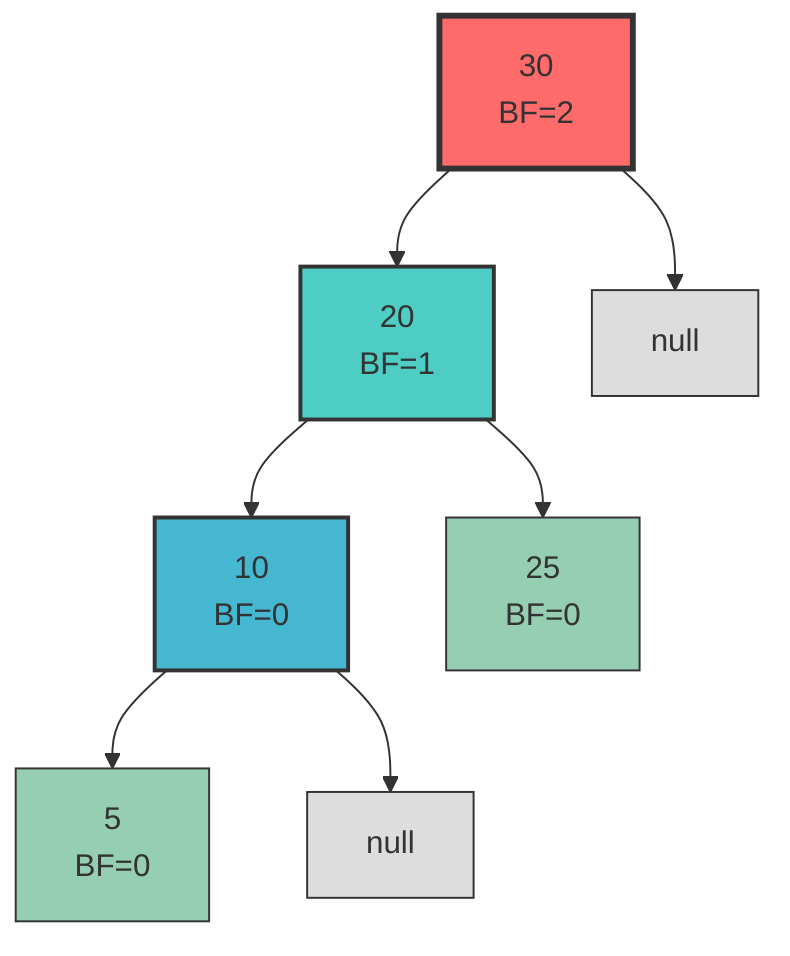
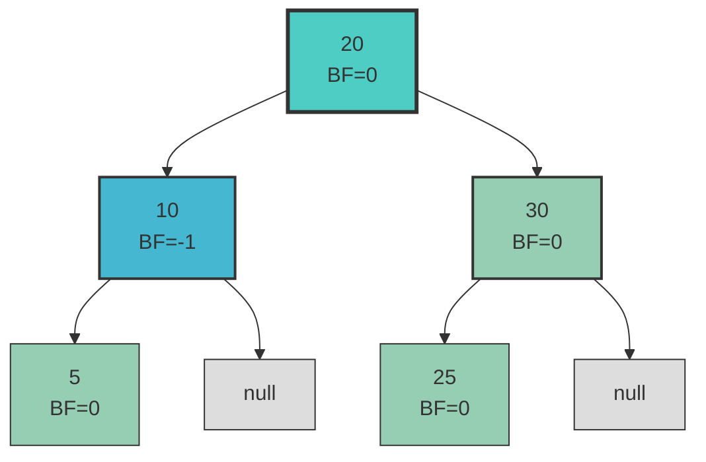
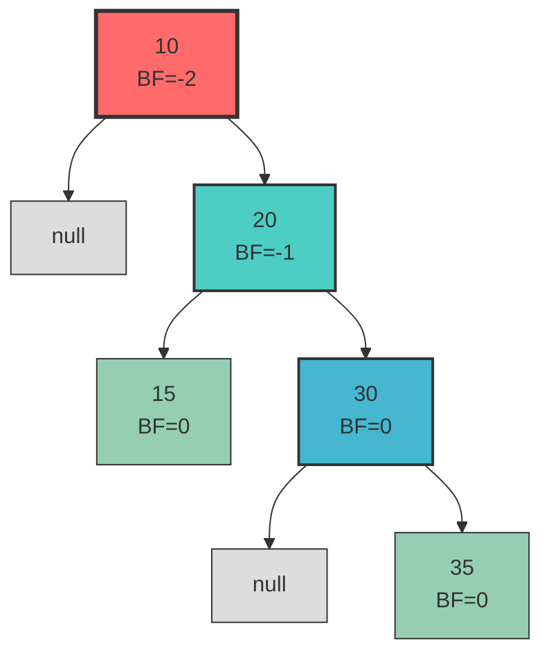
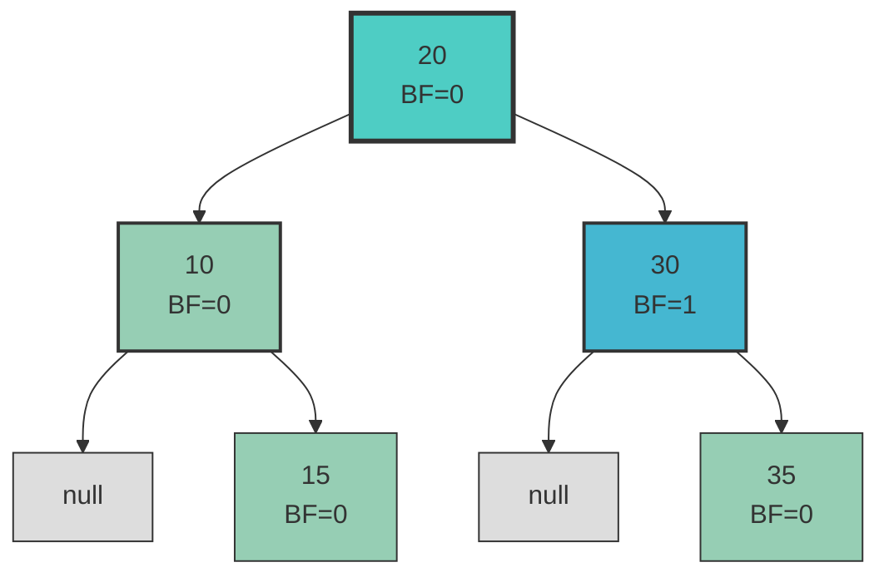
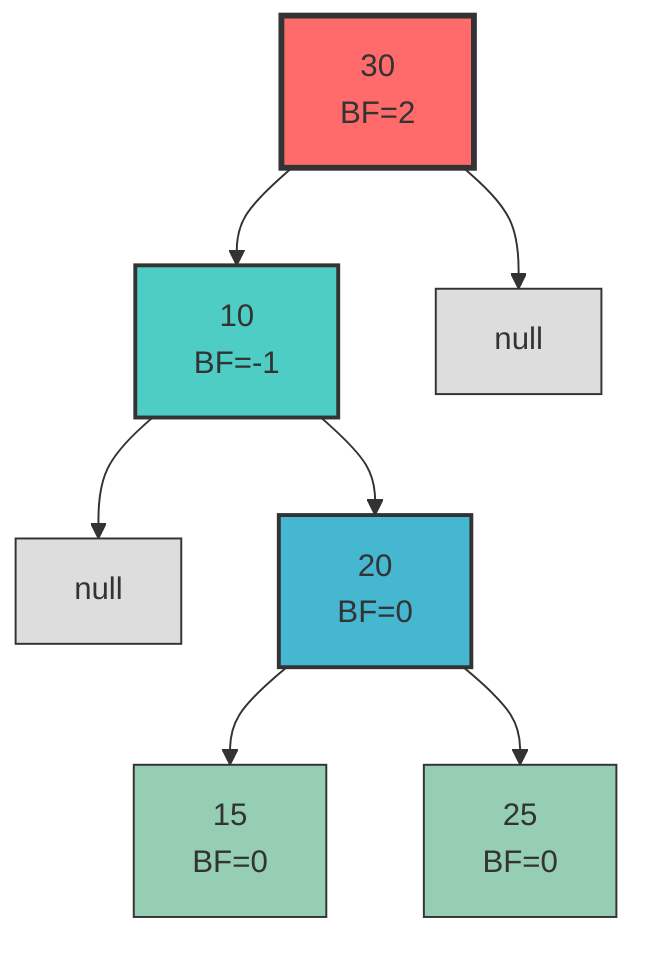
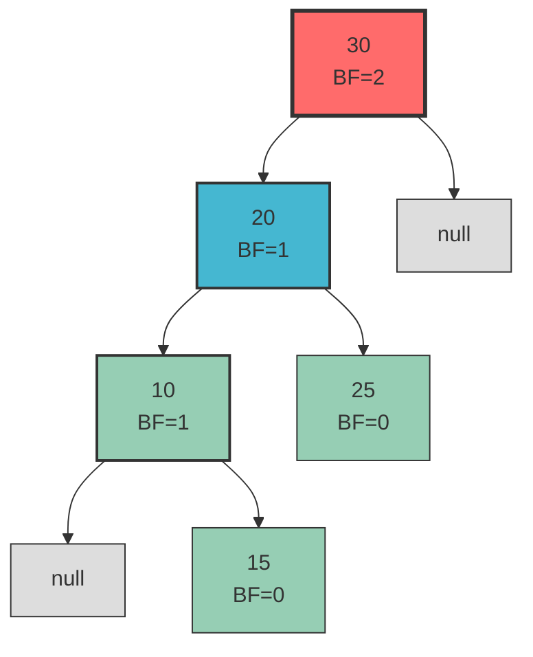
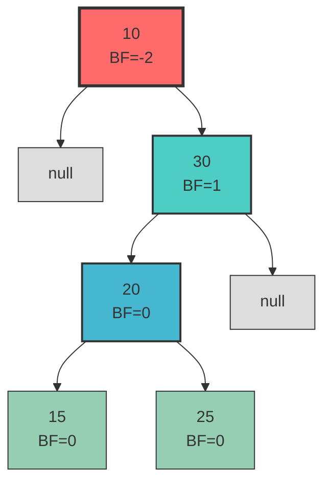
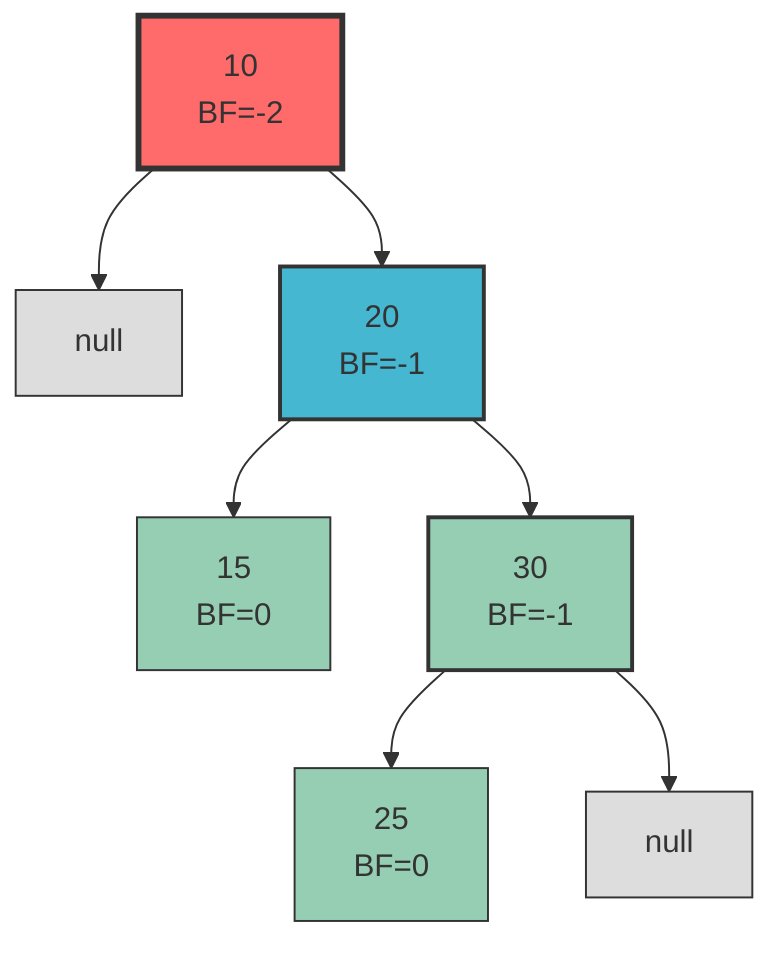
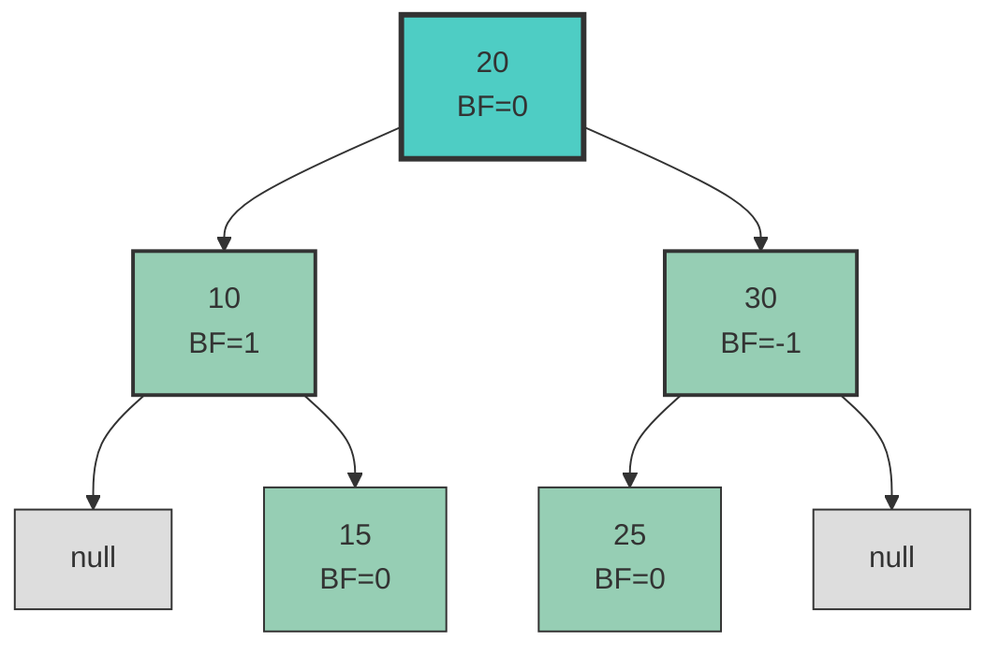

# 🔄 Rotations in AVL Tree

AVL trees are self-balancing binary search trees where the height difference between left and right subtrees (balance factor) is at most 1 for every node. When this balance is violated due to insertions or deletions, rotations are performed to restore balance.

**Balance Factor** = Height of Left Subtree - Height of Right Subtree
- Valid range: {-1, 0, 1}
- If BF > 1: Left heavy (needs right rotation)
- If BF < -1: Right heavy (needs left rotation)

## Types of Rotations

There are four types of rotations in AVL trees:

1. Right Rotation (LL case)
2. Left Rotation (RR case) 
3. Left-Right Rotation (LR case)
4. Right-Left Rotation (RL case)

## Right Rotation (LL Case)

**When to use**: When a node has a balance factor > 1 and the left child has balance factor ≥ 0 (Left-Left case).

### Before Rotation (Imbalanced Tree)

### After Right Rotation (Balanced Tree)

## Left Rotation (RR Case)

**When to use**: When a node has a balance factor < -1 and the right child has balance factor ≤ 0 (Right-Right case).

### Before Rotation (Imbalanced Tree)

### After Left Rotation (Balanced Tree)

## Left-Right Rotation (LR Case)

**When to use**: When a node has a balance factor > 1 and the left child has balance factor < 0 (Left-Right case).

This is a double rotation: first left rotate the left child, then right rotate the root.

### Before Rotation (Imbalanced Tree)

### After First Rotation (Left on 10)

### After Second Rotation (Right on 30) - Balanced Tree

## Right-Left Rotation (RL Case)

**When to use**: When a node has a balance factor < -1 and the right child has balance factor > 0 (Right-Left case).

This is a double rotation: first right rotate the right child, then left rotate the root.

### Before Rotation (Imbalanced Tree)

### After First Rotation (Right on 30)

### After Second Rotation (Left on 10) - Balanced Tree

## Summary of AVL Tree Rotations

| Case | Rotation Type | When to Use | Steps |
|------|---------------|-------------|-------|
| LL | Right Rotation | Balance factor > 1 and left child has BF ≥ 0 | Single right rotation on the unbalanced node |
| RR | Left Rotation | Balance factor < -1 and right child has BF ≤ 0 | Single left rotation on the unbalanced node |
| LR | Left-Right Rotation | Balance factor > 1 and left child has BF < 0 | Left rotation on left child, then right rotation on root |
| RL | Right-Left Rotation | Balance factor < -1 and right child has BF > 0 | Right rotation on right child, then left rotation on root |

## Key Points to Remember

- **Red nodes** in diagrams indicate imbalanced nodes (BF > 1 or BF < -1)
- **Balance Factor (BF)** = Height of Left Subtree - Height of Right Subtree
- AVL trees maintain balance by ensuring all nodes have BF ∈ {-1, 0, 1}
- Single rotations fix LL and RR cases
- Double rotations fix LR and RL cases
- After rotations, the tree becomes balanced and maintains BST property
