<div align="center">
🧑‍💻 **Author:** RK ROY <br>
🚀 Data Structures and Algorithms - Interview Preparation Guide

_A comprehensive theoretical guide covering all essential DSA concepts for technical interviews_

[](https://www.java.com/)
[](#)
[](#)

---

</div>

## 📋 Table of Contents

- [🎯 Overview](#-overview)
- [⏰ Time and Space Complexity](#-time-and-space-complexity)
- [📊 Arrays and Strings](#-arrays-and-strings)
- [🔗 Linked Lists](#-linked-lists)
- [📚 Stacks and Queues](#-stacks-and-queues)
- [🌳 Trees](#-trees)
- [🕸️ Graphs](#️-graphs)
- [🗂️ Hash Tables](#️-hash-tables)
- [🏔️ Heaps](#️-heaps)
- [⚡ Advanced Data Structures](#-advanced-data-structures)
- [🔄 Sorting Algorithms](#-sorting-algorithms)
- [🔍 Searching Algorithms](#-searching-algorithms)
- [💡 Dynamic Programming](#-dynamic-programming)
- [🎯 Interview Tips](#-interview-tips)

---

## 🎯 Overview

This guide covers the theoretical foundations of data structures and algorithms essential for technical interviews. Each section includes:

- **Core Concepts** - Fundamental theory and principles
- **Implementation Details** - How to implement in Java
- **Time/Space Complexity** - Big O analysis
- **Use Cases** - Real-world applications
- **Interview Questions** - Common theoretical questions

---

## ⏰ Time and Space Complexity

- The time complexity of an algorithm quantifies the amount of time taken by an algorithm to run as a function of the length of the input.
- The amount of memory required by the algorithm to solve given problem is called space complexity of the algorithm

---

> ## Time Complexity in Algorithms

- Time complexity measures how the **execution time of an algorithm** grows with the input size (N).

---

> ### Common Asymptotic Notations

| Notation            | Meaning                                                                        | Example                            |
| ------------------- | ------------------------------------------------------------------------------ | ---------------------------------- |
| **O(f(n))** (Big-O) | Upper bound – Worst case time. Algorithm will take **at most** this much time. | Linear Search → O(n) in worst case |
| **Ω(f(n))** (Omega) | Lower bound – Best case time. Algorithm will take **at least** this much time. | Linear Search → Ω(1) in best case  |
| **Θ(f(n))** (Theta) | Tight bound – Both upper & lower bounds(average case).                         | Binary Search → Θ(log n)           |

---

> ### Diagram: Relation Between Notations

```mermaid
graph LR
    A["O(1) - Constant"] --> B["O(log n) - Logarithmic"]
    B --> C["O(n) - Linear"]
    C --> D["O(n log n) - Linearithmic"]
    D --> E["O(n²) - Quadratic"]
    E --> F["O(2ⁿ) - Exponential"]
    F --> G["O(n!) - Factorial"]
```



> ### Complexity Classes

| Notation   | Name         | Example                          | Description                             |
| ---------- | ------------ | -------------------------------- | --------------------------------------- |
| O(1)       | Constant     | Array access                     | Time doesn't increase with input size   |
| O(log n)   | Logarithmic  | Binary search                    | Time increases logarithmically          |
| O(n)       | Linear       | Linear search                    | Time increases linearly                 |
| O(n log n) | Linearithmic | Merge sort                       | Common in efficient sorting algorithms  |
| O(n²)      | Quadratic    | Bubble sort                      | Time increases quadratically            |
| O(2ⁿ)      | Exponential  | Recursive Fibonacci              | Time doubles with each additional input |
| O(n!)      | Factorial    | Traveling salesman (brute force) | Extremely inefficient for large inputs  |

> ### Space Complexity

- **Auxiliary Space**: Extra space used by algorithm (excluding input)
- **Space Complexity**: Total space used (including input)

<div align = "center">


</div>

> ### Difference between Space Complexity and Auxiliary Space

| Aspect              | Space Complexity                                                                 | Auxiliary Space                                                       |
| ------------------- | -------------------------------------------------------------------------------- | --------------------------------------------------------------------- |
| Definition          | Total memory an algorithm needs to run (input + extra).                          | Extra memory used during computation (excluding input).               |
| Includes            | Input space + program code + temporary variables + data structures + recursion.  | Only temporary variables, extra data structures, and recursion stack. |
| Relation            | Space Complexity = Input Space + Auxiliary Space                                 | Subset of space complexity.                                           |
| Example (MergeSort) | Needs `O(n)` input + `O(n)` extra array + `O(log n)` recursion = **O(n)** total. | Extra array `O(n)` + recursion `O(log n)` = **O(n)** auxiliary.       |

> ### **Common Interview Questions:**

> #### 1. Difference Between Time and Space Complexity

- **Time Complexity**: Measures how the execution time of an algorithm grows with input size `n`.
- **Space Complexity**: Measures how much memory (RAM) an algorithm requires to run.
- **Example**:
    - Merge Sort → Time: O(n log n), Space: O(n)
    - Quick Sort → Time: O(n log n), Space: O(log n) (recursion stack)

> #### 2. Calculating Complexity of Recursive Algorithms

- Use the **recurrence relation** based on recursive calls.
- Solve using **recursion tree** or **Master Theorem**.
- **Example**:
    - Binary Search:  
      `T(n) = T(n/2) + O(1)` → `O(log n)`
    - Merge Sort:  
      `T(n) = 2T(n/2) + O(n)` → `O(n log n)`

> #### 3. Best, Average, and Worst-Case Complexity

- **Best Case (Ω)**: Minimum time an algorithm takes (ideal input).
    - Example: Linear Search → Ω(1) (target at first position).
- **Average Case (Θ)**: Expected time over all possible inputs.
    - Example: Linear Search → Θ(n/2).
- **Worst Case (O)**: Maximum time for the hardest input.
    - Example: Linear Search → O(n) (target not present).

> #### 4. Amortized Analysis

- **Definition**: Average time per operation over a sequence of operations, ensuring expensive steps are rare.
- **Not worst-case of one operation, but the average across many.**
- Amortized Analysis is used for algorithms where an occasional operation is very slow, but most other operations are faster
- **Example**:
    - Dynamic Array (ArrayList in Java):
        - Most insertions → O(1)
        - Occasional resize → O(n)
        - **Amortized insertion → O(1)**

---

## 📊 Arrays and Strings

> ### Arrays

#### Theory

- **Definition**: Collection of elements stored in contiguous memory locations
- **Access**: Random access using indices
- **Memory Layout**: Elements stored sequentially


> #### Implementation in Java

```java path=null start=null
// Static Array
int[] staticArray = new int[5];

// Dynamic Array (ArrayList)
ArrayList<Integer> dynamicArray = new ArrayList<>();

// Operations
public class ArrayOperations {
    // Access: O(1)
    public int get(int[] arr, int index) {
        return arr[index];
    }

    // Search: O(n)
    public int linearSearch(int[] arr, int target) {
        for (int i = 0; i < arr.length; i++) {
            if (arr[i] == target) return i;
        }
        return -1;
    }

    // Insert at end: O(1) amortized for ArrayList
    public void append(ArrayList<Integer> list, int value) {
        list.add(value);
    }

    // Insert at arbitrary position: O(n)
    public void insert(ArrayList<Integer> list, int index, int value) {
        list.add(index, value);
    }
}
```

> #### Complexity Analysis

| Operation          | Time Complexity | Space Complexity |
| ------------------ | --------------- | ---------------- |
| Access             | O(1)            | O(1)             |
| Search             | O(n)            | O(1)             |
| Insert (end)       | O(1) amortized  | O(1)             |
| Insert (arbitrary) | O(n)            | O(1)             |
| Delete             | O(n)            | O(1)             |

> #### Use Cases

- **Database indexing**
- **Implementing other data structures**
- **Mathematical computations**
- **Image processing (2D arrays)**

> ### Strings

#### Theory

- **Definition**: Sequence of characters
- **Immutability**: Strings are immutable in Java
- **String Pool**: Java optimizes memory using string interning

> #### Key Concepts

```java path=null start=null
public class StringConcepts {
    // String vs StringBuilder vs StringBuffer
    public void stringComparison() {
        String s1 = "Hello";           // Immutable
        StringBuilder sb = new StringBuilder(); // Mutable, not thread-safe
        StringBuffer sbf = new StringBuffer();  // Mutable, thread-safe
    }

    // String algorithms
    public boolean isAnagram(String s1, String s2) {
        if (s1.length() != s2.length()) return false;

        int[] count = new int[26];
        for (int i = 0; i < s1.length(); i++) {
            count[s1.charAt(i) - 'a']++;
            count[s2.charAt(i) - 'a']--;
        }

        for (int c : count) {
            if (c != 0) return false;
        }
        return true;
    }
}
```

> ## Common Interview Questions:\*\*

> #### 1. Why are strings immutable in Java?

- **Security**: Prevents tampering with sensitive data like file paths, class loaders, and network connections.
- **Thread-safety**: Immutable objects are safe to share across multiple threads.
- **Caching/Hashing**: The hashcode of a string can be cached, making it efficient in hash-based collections like `HashMap`.
- **String Pool**: Immutability allows reuse of string literals in the pool, saving memory.

> #### 2. What's the difference between `==` and `.equals()` for strings?

- `==` → Compares **references** (whether two variables point to the same object).
- `.equals()` → Compares **contents** (character sequences).

> #### 3. Explain string interning and the string pool.

- String Pool: A special memory region in the heap where unique string literals are stored.
- Interning: Ensures identical string literals share the same reference, reducing memory usage.

Example:

```java
String a = "java";
String b = "java";
System.out.println(a == b);  // true (same pooled reference)
```

> #### **4. When would you use StringBuilder vs StringBuffer?**

- StringBuilder
    - Mutable.
    - Not thread-safe.
    - Faster.
    - Best for single-threaded operations.

- StringBuffer
    - Mutable.
    - Thread-safe (synchronized).
    - Slower than StringBuilder.
    - Best for multi-threaded operations.

> #### **5. Time Complexities of Common String Operations**

| Operation                   | Time Complexity                    |
| --------------------------- | ---------------------------------- |
| Access character (`charAt`) | O(1)                               |
| Concatenation using `+`     | O(n)                               |
| Substring                   | O(n) (copies chars)                |
| Length                      | O(1)                               |
| Equals (content compare)    | O(n)                               |
| Hashcode (first call)       | O(n), then cached                  |
| StringBuilder `append()`    | Amortized O(1)                     |
| StringBuffer `append()`     | Amortized O(1), slower due to sync |

> ## 🔗 Linked Lists

### Theory

- **Definition**: Linear data structure where elements are stored in nodes
- **Node Structure**: Data + Reference to next node
- **Dynamic Size**: Can grow/shrink during runtime
- It mainly allows efficient insertion and deletion operations compared to arrays.
- Like arrays, it is also used to implement other data structures like stack, queue and deque.
- **Access** : Sequential access, but in array it is random.

> ### Types of Linked Lists


> #### Singly Linked List

```mermaid
graph LR
    A["Node 1<br/>Data: 10<br/>Next: →"] --> B["Node 2<br/>Data: 20<br/>Next: →"]
    B --> C["Node 3<br/>Data: 30<br/>Next: null"]
```

<div align = "center">



</div>

```java path=null start=null
public class SinglyLinkedList<T> {
    private Node<T> head;
    private int size;

    private static class Node<T> {
        T data;
        Node<T> next;

        Node(T data) {
            this.data = data;
            this.next = null;
        }
    }

    // Insert at beginning: O(1)
    public void insertAtBeginning(T data) {
        Node<T> newNode = new Node<>(data);
        newNode.next = head;
        head = newNode;
        size++;
    }

    // Insert at end: O(n)
    public void insertAtEnd(T data) {
        Node<T> newNode = new Node<>(data);
        if (head == null) {
            head = newNode;
            return;
        }

        Node<T> current = head;
        while (current.next != null) {
            current = current.next;
        }
        current.next = newNode;
        size++;
    }

    // Delete by value: O(n)
    public boolean delete(T data) {
        if (head == null) return false;

        if (head.data.equals(data)) {
            head = head.next;
            size--;
            return true;
        }

        Node<T> current = head;
        while (current.next != null && !current.next.data.equals(data)) {
            current = current.next;
        }

        if (current.next != null) {
            current.next = current.next.next;
            size--;
            return true;
        }
        return false;
    }

    // Reverse: O(n)
    public void reverse() {
        Node<T> prev = null;
        Node<T> current = head;
        Node<T> next;

        while (current != null) {
            next = current.next;
            current.next = prev;
            prev = current;
            current = next;
        }
        head = prev;
    }
}
```

> #### Doubly Linked List

```mermaid
graph LR
    A["← Node 1 →<br/>Data: 10"] <--> B["← Node 2 →<br/>Data: 20"]
    B <--> C["← Node 3 →<br/>Data: 30"]
```

<div align = "center">



</div>

```java path=null start=null
public class DoublyLinkedList<T> {
    private Node<T> head;
    private Node<T> tail;
    private int size;

    private static class Node<T> {
        T data;
        Node<T> next;
        Node<T> prev;

        Node(T data) {
            this.data = data;
        }
    }

    // Insert at beginning: O(1)
    public void insertAtBeginning(T data) {
        Node<T> newNode = new Node<>(data);
        if (head == null) {
            head = tail = newNode;
        } else {
            newNode.next = head;
            head.prev = newNode;
            head = newNode;
        }
        size++;
    }

    // Insert at end: O(1)
    public void insertAtEnd(T data) {
        Node<T> newNode = new Node<>(data);

        if (tail == null) {
            head = tail = newNode;
        } else {
            tail.next = newNode;
            newNode.prev = tail;
            tail = newNode;
        }
        size++;
    }
}
```

> ### Complexity Comparison

| Operation          | Singly LL                        | Doubly LL                                 | Array          |
| ------------------ | -------------------------------- | ----------------------------------------- | -------------- |
| Access             | O(n)                             | O(n)                                      | O(1)           |
| Search             | O(n)                             | O(n)                                      | O(n)           |
| Insert (beginning) | O(1)                             | O(1)                                      | O(n)           |
| Insert (end)       | O(n), O(1) if tail is maintained | O(1)                                      | O(1) amortized |
| Delete             | O(n)                             | O(1) if node reference is given else O(N) | O(n)           |

> ## Circular Linked List in Java

> ## 🔹 What is a Circular Linked List?

- A **Circular Linked List (CLL)** is a variation of a linked list where:
    - The **last node** points back to the **first node**.
    - It can be **singly circular** (only `next` points back) or **doubly circular** (`next` and `prev` both wrap around).
- No `null` references in the chain, making traversal continuous.

> ## 🔹 Singly Circular Linked List

> ### Structure

- Each node has:
    - `data`
    - `next` (points to next node, last node points back to head)

<div align = "center">


</div>

> #### Implementation

```java
public class CircularSinglyLinkedList<T> {
    private Node<T> head;
    private Node<T> tail;
    private int size;
    private static class Node<T> {
        T data;
        Node<T> next;

        Node(T data) {
            this.data = data;
        }
    }

    // Insert at end: O(1)
    public void insertAtEnd(T data) {
        Node<T> newNode = new Node<>(data);
        if (head == null) {
            head = tail = newNode;
            tail.next = head; // circular link
        } else {
            tail.next = newNode;
            tail = newNode;
            tail.next = head; // keep circular
        }
        size++;
    }

    // Insert at beginning: O(1)
    public void insertAtBeginning(T data) {
        Node<T> newNode = new Node<>(data);
        if (head == null) {
            head = tail = newNode;
            tail.next = head;
        } else {
            newNode.next = head;
            head = newNode;
            tail.next = head; // keep circular
        }
        size++;
    }

    // Traverse: O(n)
    public void traverse(int cycles) {
        if (head == null) return;
        Node<T> current = head;
        int count = 0;
        do {
            System.out.print(current.data + " -> ");
            current = current.next;
            count++;
        } while (current != head && count < size * cycles);
        System.out.println("(back to head)");
    }
}
```

> #### Time Complexity

| Operation           | Time Complexity |
| ------------------- | --------------- |
| Insert at Beginning | O(1)            |
| Insert at End       | O(1)            |
| Delete at Beginning | O(1)            |
| Delete at End       | O(n)            |
| Traverse/Search     | O(n)            |

> ## **Doubly Circular Linked List**

- Structure
    - Each node has:
        - data
        - next (points to next node)
        - prev (points to previous node)
        - head.prev = tail and tail.next = head

<div align = "center">


</div>

> ### Implementation

```java
public class CircularDoublyLinkedList<T> {
    private Node<T> head;
    private Node<T> tail;
    private int size;
    private static class Node<T> {
        T data;
        Node<T> next;
        Node<T> prev;

        Node(T data) {
            this.data = data;
        }
    }

    // Insert at end: O(1)
    public void insertAtEnd(T data) {
        Node<T> newNode = new Node<>(data);
        if (head == null) {
            head = tail = newNode;
            head.next = head;
            head.prev = head;
        } else {
            tail.next = newNode;
            newNode.prev = tail;
            newNode.next = head;
            head.prev = newNode;
            tail = newNode;
        }
        size++;
    }

    // Insert at beginning: O(1)
    public void insertAtBeginning(T data) {
        Node<T> newNode = new Node<>(data);
        if (head == null) {
            head = tail = newNode;
            head.next = head;
            head.prev = head;
        } else {
            newNode.next = head;
            newNode.prev = tail;
            head.prev = newNode;
            tail.next = newNode;
            head = newNode;
        }
        size++;
    }

    // Traverse forward: O(n)
    public void traverseForward(int cycles) {
        if (head == null) return;
        Node<T> current = head;
        int count = 0;
        do {
            System.out.print(current.data + " <-> ");
            current = current.next;
            count++;
        } while (current != head && count < size * cycles);
        System.out.println("(back to head)");
    }

    // Traverse backward: O(n)
    public void traverseBackward(int cycles) {
        if (tail == null) return;
        Node<T> current = tail;
        int count = 0;
        do {
            System.out.print(current.data + " <-> ");
            current = current.prev;
            count++;
        } while (current != tail && count < size * cycles);
        System.out.println("(back to tail)");
    }
}
```

> #### Time Complexity

| Operation           | Time Complexity |
| ------------------- | --------------- |
| Insert at Beginning | O(1)            |
| Insert at End       | O(1)            |
| Delete at Beginning | O(1)            |
| Delete at End       | O(1)            |
| Traverse/Search     | O(n)            |

> ### Use Cases

- **Music playlists** (next/previous functionality)
- **Browser history** (back/forward navigation)
- **Undo/Redo operations**
- **Implementation of stacks and queues**

> **Common Interview Questions:**

> #### 1. How do you detect a cycle in a linked list?

- To detect a cycle, we use **Floyd’s Cycle Detection Algorithm (Tortoise and Hare)**:
    - Have two pointers: `slow` moves one step at a time, `fast` moves two steps.
    - If they ever meet, there is a cycle.
    - If `fast` or `fast.next` becomes null, then there is no cycle.

```java
boolean hasCycle(Node head) {
    Node slow = head, fast = head;
    while (fast != null && fast.next != null) {
        slow = slow.next;
        fast = fast.next.next;
        if (slow == fast) return true; // cycle detected
    }
    return false; // no cycle
```

**Time Complexity:** O(n)  
**Space Complexity:** O(1)

> #### 2. How do you find the middle element of a linked list?

- To find the middle, use two pointers:
    - `slow` moves one step at a time.
    - `fast` moves two steps at a time.
    - When `fast` reaches the end, `slow` will be at the middle element.

```java
Node findMiddle(Node head) {
    Node slow = head, fast = head;
    while (fast != null && fast.next != null) {
        slow = slow.next;
        fast = fast.next.next;
    }
    return slow;
}
```

**Time Complexity:** O(n)  
**Space Complexity:** O(1)

> #### 3. How do you reverse a linked list iteratively and recursively?

- **Iterative approach:**
    - Maintain three pointers (`prev`, `curr`, `next`).
    - Traverse the list and reverse the `next` links one by one.

```java
Node reverseIterative(Node head) {
    Node prev = null, curr = head, next;
    while (curr != null) {
        next = curr.next;
        curr.next = prev;
        prev = curr;
        curr = next;
    }
    return prev;
}
```

- **Recursive approach:**
    - Recursively reverse the rest of the list.
    - Make the current node the new tail by adjusting its `next`.

```java
Node reverseRecursive(Node head) {
    if (head == null || head.next == null) return head;
    Node newHead = reverseRecursive(head.next);
    head.next.next = head;
    head.next = null;
    return newHead;
}
```

**Time Complexity:** O(n)

**Space Complexity:**

- Iterative: O(1)
- Recursive: O(n) due to call stack

> #### 4. What are the advantages and disadvantages of linked lists vs arrays?

| Aspect        | Linked List                           | Array                         |
| ------------- | ------------------------------------- | ----------------------------- |
| Memory        | Dynamic, grows/shrinks at runtime     | Fixed size (must be declared) |
| Insertion     | O(1) at beginning (with head pointer) | O(n) (requires shifting)      |
| Deletion      | O(1) at beginning (with head pointer) | O(n) (requires shifting)      |
| Random Access | O(n), must traverse                   | O(1), direct indexing         |
| Cache Usage   | Poor (non-contiguous memory)          | Good (contiguous memory)      |
| Extra Space   | Requires pointer for next/prev        | No extra space needed         |

**Advantages of Linked List:**

- Dynamic size.
- Efficient insertions/deletions at head/tail.

**Disadvantages of Linked List:**

- Extra memory for pointers.
- Slower traversal and poor cache performance.

> #### 5. How do you merge two sorted linked lists?

- To merge two sorted linked lists:
    - Use two pointers to traverse both lists.
    - Compare values, attach the smaller one to the merged list.
    - Continue until all nodes from both lists are processed.

```java
Node mergeSortedLists(Node l1, Node l2) {
    Node dummy = new Node(0);
    Node tail = dummy;
    while (l1 != null && l2 != null) {
        if (l1.data <= l2.data) {
            tail.next = l1;
            l1 = l1.next;
        } else {
            tail.next = l2;
            l2 = l2.next;
        }
        tail = tail.next;
    }
    if (l1 != null) tail.next = l1;
    if (l2 != null) tail.next = l2;
    return dummy.next;
}
```

**Time Complexity:** O(n + m)  
**Space Complexity:** O(1) (if done in-place)

---

> ## 📚 Stacks and Queues

> ### Stack (LIFO - Last In First Out)

#### Theory

- **Principle**: Last element added is first to be removed
- **Operations**: Push, Pop, Peek, isEmpty
- **Memory**: Can be implemented using arrays or linked lists

```mermaid
graph TB
    subgraph "Stack Operations"
        A["Top → 30"]
        B["     20"]
        C["     10"]
        D["Bottom"]

        A -.->|Push 40| E["Top → 40"]
        E --> F["     30"]
        F --> G["     20"]
        G --> H["     10"]
        H --> I["Bottom"]

        A -.->|Pop| J["Top → 20"]
        J --> K["     10"]
        K --> L["Bottom"]
    end
```



> #### Implementation

```java
// Stackk using Array;
public class Stack<T> {
    private T[] stack;
    private int top;
    public Stack() {
        stack = new T[(int)(1e5 + 1)];
        top = -1;
    }

    // Push: O(1)
    public void push(T data) {
        stack[++top] = data;
    }

    // Pop: O(1)
    public T pop() {
        if (isEmpty()) {
            throw new EmptyStackException();
        }
        return stack[top--];
    }

    // Peek: O(1)
    public T peek() {
        if (isEmpty()) {
            throw new EmptyStackException();
        }
        return stack[top];
    }

    // isEmpty: O(1)
    public boolean isEmpty() {
        return top == -1;
    }

    // Size: O(1)
    public int size() {
        return top + 1;
    }
}
```

```java path=null start=null
// Stack Using LinkedList
public class Stack<T> {
    private Node<T> top;
    private int size;
    private static class Node<T> {
        T data;
        Node<T> next;
        Node(T data) {
            this.data = data;
        }
    }

    // Push: O(1)
    public void push(T data) {
        Node<T> newNode = new Node<>(data);
        newNode.next = top;
        top = newNode;
        size++;
    }

    // Pop: O(1)
    public T pop() {
        if (isEmpty()) {
            throw new EmptyStackException();
        }
        T data = top.data;
        top = top.next;
        size--;
        return data;
    }

    // Peek: O(1)
    public T peek() {
        if (isEmpty()) {
            throw new EmptyStackException();
        }
        return top.data;
    }

    // isEmpty: O(1)
    public boolean isEmpty() {
        return top == null;
    }
}
```

```java
// Stack Using Queue (Not Efficient) ;
class stack {
    Queue < Integer > q = new LinkedList < > ();
    void push(int x) {
        q.add(x);
        for (int i = 0; i < q.size() - 1; i++) {
            q.add(q.remove());
        }
    }
    int pop() {
        return q.remove();
    }
    int top() {
        return q.peek();
    }
    int size() {
        return q.size();
    }
}
```

> #### Use Cases

- **Function call management** (call stack)
- **Expression evaluation** (infix to postfix)
- **Backtracking algorithms**
- **Undo operations in applications**
- **Browser history**

> ### Queue (FIFO - First In First Out)

#### Theory

- **Principle**: First element added is first to be removed
- **Operations**: Enqueue, Dequeue, Front, Rear
- **Variants**: Simple Queue, Circular Queue, Priority Queue, Deque

<div align = "center">


</div>

> #### Implementation

```java
// Queue Using Array;
public class Queue<T> {
    private T[] arr;
    private int front;
    private int rear;
    private int size;
    private int capacity;
    @SuppressWarnings("unchecked")
    public Queue(int capacity) {
        this.capacity = capacity;
        arr = (T[]) new Object[capacity];
        front = 0;
        rear = -1;
        size = 0;
    }
    // Check if queue is empty
    public boolean isEmpty() {
        return size == 0;
    }
    // Check if queue is full
    public boolean isFull() {
        return size == capacity;
    }
    // Enqueue: O(1)
    public void enqueue(T data) {
        if (isFull()) {
            System.out.println("Queue is full!");
            return;
        }
        rear = (rear + 1) % capacity; // circular increment
        arr[rear] = data;
        size++;
    }
    // Dequeue: O(1)
    public T dequeue() {
        if (isEmpty()) {
            System.out.println("Queue is empty!");
            return null;
        }
        T item = arr[front];
        arr[front] = null; // optional: clear reference
        front = (front + 1) % capacity; // circular increment
        size--;
        return item;
    }
    // Peek (front element): O(1)
    public T peek() {
        if (isEmpty()) {
            System.out.println("Queue is empty!");
            return null;
        }
        return arr[front];
    }
    // Get size
    public int getSize() {
        return size;
    }
}
```

```java path=null start=null
// Using LinkedList
public class Queue<T> {
    private Node<T> front;
    private Node<T> rear;
    private int size;
    private static class Node<T> {
        T data;
        Node<T> next;
        Node(T data) {
            this.data = data;
        }
    }
    // Enqueue: O(1)
    public void enqueue(T data) {
        Node<T> newNode = new Node<>(data);
        if (rear == null) {
            front = rear = newNode;
        } else {
            rear.next = newNode;
            rear = newNode;
        }
        size++;
    }
    // Dequeue: O(1)
    public T dequeue() {
        if (isEmpty()) {
            throw new NoSuchElementException();
        }
        T data = front.data;
        front = front.next;
        if (front == null) {
            rear = null;
        }
        size--;
        return data;
    }
}
```

```java
// Queue Using Stack (Not Efficient) ;
public class QueueUsingStackUnoptimized<T> {
    private Stack<T> s1 = new Stack<>();
    private Stack<T> s2 = new Stack<>();
    // Enqueue: O(1)
    public void enqueue(T data) {
        s1.push(data);
    }
    // Dequeue: O(n)
    public T dequeue() {
        if (s1.isEmpty()) {
            System.out.println("Queue is empty!");
            return null;
        }
        // Move elements to s2
        while (!s1.isEmpty()) {
            s2.push(s1.pop());
        }
        // Pop from s2
        T front = s2.pop();
        // Move back to s1
        while (!s2.isEmpty()) {
            s1.push(s2.pop());
        }
        return front;
    }
    public boolean isEmpty() {
        return s1.isEmpty();
    }
}
```

```java
// Queue Using Stack (Efficient) --> Amortized O(1), Worst O(n) (Deque);
public class QueueUsingStackOptimized<T> {
    private Stack<T> s1 = new Stack<>();
    private Stack<T> s2 = new Stack<>();
    // Enqueue: O(1)
    public void enqueue(T data) {
        s1.push(data);
    }
    // Dequeue: Amortized O(1)
    public T dequeue() {
        if (isEmpty()) {
            System.out.println("Queue is empty!");
            return null;
        }
        // If s2 is empty, refill it from s1
        if (s2.isEmpty()) {
            while (!s1.isEmpty()) {
                s2.push(s1.pop());
            }
        }
        return s2.pop();
    }
    public boolean isEmpty() {
        return s1.isEmpty() && s2.isEmpty();
    }
```

> ### Priority Queue

#### Theory

- **Definition**: Elements have priorities, higher priority elements are served first
- **Implementation**: Usually implemented using heaps
- **Applications**: Task scheduling, Dijkstra's algorithm

```java path=null start=null
// Using Java's built-in PriorityQueue
PriorityQueue<Integer> minHeap = new PriorityQueue<>();
PriorityQueue<Integer> maxHeap = new PriorityQueue<>(Collections.reverseOrder());

// Custom comparator
PriorityQueue<Task> taskQueue = new PriorityQueue<>(
    (t1, t2) -> Integer.compare(t2.priority, t1.priority)
);
```

**Common Interview Questions:**

1. Implement a stack using queues and vice versa.
2. How would you implement a min/max stack?
3. What's the difference between stack and heap memory?
4. Explain the applications of stacks in compiler design.
5. How does function recursion use the call stack?

---

## 🌳 Trees

### Binary Trees

#### Theory

- **Definition**: Hierarchical data structure with at most two children per node
- **Terminology**: Root, Parent, Child, Leaf, Height, Depth
- **Properties**: Height, Balance Factor, Complete vs Full trees


#### Implementation

```java path=null start=null
public class BinaryTree<T> {
    private TreeNode<T> root;

    private static class TreeNode<T> {
        T data;
        TreeNode<T> left;
        TreeNode<T> right;

        TreeNode(T data) {
            this.data = data;
        }
    }

    // Tree Traversals

    // Inorder: Left → Root → Right
    public void inorderTraversal(TreeNode<T> node, List<T> result) {
        if (node != null) {
            inorderTraversal(node.left, result);
            result.add(node.data);
            inorderTraversal(node.right, result);
        }
    }

    // Preorder: Root → Left → Right
    public void preorderTraversal(TreeNode<T> node, List<T> result) {
        if (node != null) {
            result.add(node.data);
            preorderTraversal(node.left, result);
            preorderTraversal(node.right, result);
        }
    }

    // Postorder: Left → Right → Root
    public void postorderTraversal(TreeNode<T> node, List<T> result) {
        if (node != null) {
            postorderTraversal(node.left, result);
            postorderTraversal(node.right, result);
            result.add(node.data);
        }
    }

    // Level Order Traversal (BFS)
    public List<T> levelOrderTraversal() {
        List<T> result = new ArrayList<>();
        if (root == null) return result;

        Queue<TreeNode<T>> queue = new LinkedList<>();
        queue.offer(root);

        while (!queue.isEmpty()) {
            TreeNode<T> current = queue.poll();
            result.add(current.data);

            if (current.left != null) queue.offer(current.left);
            if (current.right != null) queue.offer(current.right);
        }

        return result;
    }
}
```

### Binary Search Tree (BST)

#### Theory

- **Property**: Left subtree < Root < Right subtree
- **Search Efficiency**: O(log n) average case, O(n) worst case
- **Inorder Traversal**: Gives sorted sequence


```java path=null start=null
public class BinarySearchTree {
    private TreeNode root;

    private class TreeNode {
        int val;
        TreeNode left, right;

        TreeNode(int val) {
            this.val = val;
        }
    }

    // Search: O(log n) average, O(n) worst
    public boolean search(int val) {
        return searchHelper(root, val);
    }

    private boolean searchHelper(TreeNode node, int val) {
        if (node == null) return false;
        if (node.val == val) return true;

        return val < node.val ?
            searchHelper(node.left, val) :
            searchHelper(node.right, val);
    }

    // Insert: O(log n) average, O(n) worst
    public void insert(int val) {
        root = insertHelper(root, val);
    }

    private TreeNode insertHelper(TreeNode node, int val) {
        if (node == null) {
            return new TreeNode(val);
        }

        if (val < node.val) {
            node.left = insertHelper(node.left, val);
        } else if (val > node.val) {
            node.right = insertHelper(node.right, val);
        }

        return node;
    }
}
```

### AVL Trees (Self-Balancing BST)

#### Theory

- **Balance Factor**: Height difference between left and right subtrees ∈ {-1, 0, 1}
- **Rotations**: Single and double rotations to maintain balance
- **Guarantee**: O(log n) operations in all cases


### Red-Black Trees

#### Theory

- **Properties**:
    1. Every node is either red or black
    2. Root is always black
    3. No two adjacent red nodes
    4. Every path from root to null has same number of black nodes

### Trie (Prefix Tree)

#### Theory

- **Purpose**: Efficient string storage and retrieval
- **Structure**: Each path from root to leaf represents a string
- **Applications**: Autocomplete, spell checkers, IP routing


```java path=null start=null
public class Trie {
    private TrieNode root;

    private class TrieNode {
        TrieNode[] children;
        boolean isEndOfWord;

        TrieNode() {
            children = new TrieNode[26]; // for lowercase letters
            isEndOfWord = false;
        }
    }

    public Trie() {
        root = new TrieNode();
    }

    // Insert: O(m) where m is length of word
    public void insert(String word) {
        TrieNode current = root;

        for (char ch : word.toCharArray()) {
            int index = ch - 'a';
            if (current.children[index] == null) {
                current.children[index] = new TrieNode();
            }
            current = current.children[index];
        }

        current.isEndOfWord = true;
    }

    // Search: O(m)
    public boolean search(String word) {
        TrieNode current = root;

        for (char ch : word.toCharArray()) {
            int index = ch - 'a';
            if (current.children[index] == null) {
                return false;
            }
            current = current.children[index];
        }

        return current.isEndOfWord;
    }
}
```

**Common Interview Questions:**

1. What are the different tree traversal methods?
2. How do you check if a binary tree is balanced?
3. Explain the difference between BST, AVL, and Red-Black trees.
4. How do you find the lowest common ancestor in a binary tree?
5. What are the applications of tries?

---

## 🕸️ Graphs

### Theory

- **Definition**: Collection of vertices (nodes) connected by edges
- **Types**: Directed vs Undirected, Weighted vs Unweighted
- **Representations**: Adjacency Matrix, Adjacency List, Edge List


### Graph Representations

#### Adjacency List

```java path=null start=null
public class GraphAdjacencyList {
    private Map<Integer, List<Integer>> adjList;
    private int vertices;

    public GraphAdjacencyList(int vertices) {
        this.vertices = vertices;
        adjList = new HashMap<>();

        for (int i = 0; i < vertices; i++) {
            adjList.put(i, new ArrayList<>());
        }
    }

    // Add edge: O(1)
    public void addEdge(int src, int dest) {
        adjList.get(src).add(dest);
        adjList.get(dest).add(src); // For undirected graph
    }
}
```

#### Adjacency Matrix

```java path=null start=null
public class GraphAdjacencyMatrix {
    private int[][] matrix;
    private int vertices;

    public GraphAdjacencyMatrix(int vertices) {
        this.vertices = vertices;
        matrix = new int[vertices][vertices];
    }

    // Add edge: O(1)
    public void addEdge(int src, int dest) {
        matrix[src][dest] = 1;
        matrix[dest][src] = 1; // For undirected graph
    }
}
```

### Graph Traversal Algorithms

#### Depth-First Search (DFS)


```java path=null start=null
public class GraphTraversal {
    // DFS Recursive: O(V + E)
    public void dfsRecursive(int vertex, boolean[] visited,
                           Map<Integer, List<Integer>> adjList) {
        visited[vertex] = true;
        System.out.print(vertex + " ");

        for (int neighbor : adjList.get(vertex)) {
            if (!visited[neighbor]) {
                dfsRecursive(neighbor, visited, adjList);
            }
        }
    }

    // DFS Iterative: O(V + E)
    public void dfsIterative(int startVertex, Map<Integer, List<Integer>> adjList, int vertices) {
        boolean[] visited = new boolean[vertices];
        Stack<Integer> stack = new Stack<>();

        stack.push(startVertex);

        while (!stack.isEmpty()) {
            int vertex = stack.pop();

            if (!visited[vertex]) {
                visited[vertex] = true;
                System.out.print(vertex + " ");

                for (int neighbor : adjList.get(vertex)) {
                    if (!visited[neighbor]) {
                        stack.push(neighbor);
                    }
                }
            }
        }
    }
}
```

#### Breadth-First Search (BFS)

```java path=null start=null
// BFS: O(V + E)
public void bfs(int startVertex, Map<Integer, List<Integer>> adjList, int vertices) {
    boolean[] visited = new boolean[vertices];
    Queue<Integer> queue = new LinkedList<>();

    visited[startVertex] = true;
    queue.offer(startVertex);

    while (!queue.isEmpty()) {
        int vertex = queue.poll();
        System.out.print(vertex + " ");

        for (int neighbor : adjList.get(vertex)) {
            if (!visited[neighbor]) {
                visited[neighbor] = true;
                queue.offer(neighbor);
            }
        }
    }
}
```

### Shortest Path Algorithms

#### Dijkstra's Algorithm

- **Purpose**: Find shortest path from source to all vertices
- **Requirement**: Non-negative edge weights
- **Time Complexity**: O((V + E) log V) with priority queue

```java path=null start=null
public class DijkstraAlgorithm {
    public int[] dijkstra(int[][] graph, int src) {
        int V = graph.length;
        int[] dist = new int[V];
        boolean[] visited = new boolean[V];

        Arrays.fill(dist, Integer.MAX_VALUE);
        dist[src] = 0;

        PriorityQueue<int[]> pq = new PriorityQueue<>(
            Comparator.comparingInt(a -> a[1])
        );
        pq.offer(new int[]{src, 0});

        while (!pq.isEmpty()) {
            int[] current = pq.poll();
            int u = current[0];

            if (visited[u]) continue;
            visited[u] = true;

            for (int v = 0; v < V; v++) {
                if (graph[u][v] != 0 && !visited[v]) {
                    int newDist = dist[u] + graph[u][v];
                    if (newDist < dist[v]) {
                        dist[v] = newDist;
                        pq.offer(new int[]{v, newDist});
                    }
                }
            }
        }

        return dist;
    }
}
```

#### Floyd-Warshall Algorithm

- **Purpose**: All pairs shortest path
- **Time Complexity**: O(V³)
- **Space Complexity**: O(V²)

### Minimum Spanning Tree

#### Kruskal's Algorithm

- **Approach**: Sort edges, use Union-Find to detect cycles
- **Time Complexity**: O(E log E)

#### Prim's Algorithm

- **Approach**: Start from vertex, grow MST by adding minimum weight edge
- **Time Complexity**: O(E log V) with priority queue

**Common Interview Questions:**

1. What's the difference between DFS and BFS?
2. How do you detect cycles in directed and undirected graphs?
3. Explain topological sorting and its applications.
4. What's the difference between Dijkstra's and Bellman-Ford algorithms?
5. How do you check if a graph is bipartite?

---

## 🗂️ Hash Tables

### Theory

- **Definition**: Data structure that maps keys to values using hash function
- **Hash Function**: Converts key into array index
- **Collision**: When two keys map to same index
- **Load Factor**: Number of elements / Table size


### Hash Functions

```java path=null start=null
public class HashFunctions {
    // Division Method
    public int divisionHash(int key, int tableSize) {
        return key % tableSize;
    }

    // Multiplication Method
    public int multiplicationHash(int key, int tableSize) {
        double A = 0.6180339887; // (√5 - 1) / 2
        return (int)(tableSize * ((key * A) % 1));
    }

    // String hash function
    public int stringHash(String key, int tableSize) {
        int hash = 0;
        int prime = 31;

        for (char c : key.toCharArray()) {
            hash = hash * prime + c;
        }

        return Math.abs(hash) % tableSize;
    }
}
```

### Collision Resolution

#### Separate Chaining


```java path=null start=null
public class HashTableChaining<K, V> {
    private LinkedList<Entry<K, V>>[] table;
    private int capacity;
    private int size;

    private static class Entry<K, V> {
        K key;
        V value;

        Entry(K key, V value) {
            this.key = key;
            this.value = value;
        }
    }

    @SuppressWarnings("unchecked")
    public HashTableChaining(int capacity) {
        this.capacity = capacity;
        table = new LinkedList[capacity];

        for (int i = 0; i < capacity; i++) {
            table[i] = new LinkedList<>();
        }
    }

    private int hash(K key) {
        return Math.abs(key.hashCode()) % capacity;
    }

    // Put: O(1) average, O(n) worst case
    public void put(K key, V value) {
        int index = hash(key);
        LinkedList<Entry<K, V>> chain = table[index];

        for (Entry<K, V> entry : chain) {
            if (entry.key.equals(key)) {
                entry.value = value;
                return;
            }
        }

        chain.add(new Entry<>(key, value));
        size++;

        // Resize if load factor exceeds threshold
        if ((double) size / capacity > 0.75) {
            resize();
        }
    }

    // Get: O(1) average, O(n) worst case
    public V get(K key) {
        int index = hash(key);
        LinkedList<Entry<K, V>> chain = table[index];

        for (Entry<K, V> entry : chain) {
            if (entry.key.equals(key)) {
                return entry.value;
            }
        }

        return null;
    }

    private void resize() {
        LinkedList<Entry<K, V>>[] oldTable = table;
        capacity *= 2;
        size = 0;
        table = new LinkedList[capacity];

        for (int i = 0; i < capacity; i++) {
            table[i] = new LinkedList<>();
        }

        for (LinkedList<Entry<K, V>> chain : oldTable) {
            for (Entry<K, V> entry : chain) {
                put(entry.key, entry.value);
            }
        }
    }
}
```

#### Open Addressing

- **Linear Probing**: Check next slot sequentially
- **Quadratic Probing**: Check slots at quadratic intervals
- **Double Hashing**: Use second hash function for probing

```java path=null start=null
public class HashTableOpenAddressing<K, V> {
    private Entry<K, V>[] table;
    private int capacity;
    private int size;
    private final Entry<K, V> DELETED = new Entry<>(null, null);

    private static class Entry<K, V> {
        K key;
        V value;

        Entry(K key, V value) {
            this.key = key;
            this.value = value;
        }
    }

    // Linear probing implementation
    private int probe(K key) {
        int index = Math.abs(key.hashCode()) % capacity;

        while (table[index] != null &&
               !table[index].key.equals(key) &&
               table[index] != DELETED) {
            index = (index + 1) % capacity; // Linear probing
        }

        return index;
    }
}
```

### Use Cases

- **Database indexing**
- **Caching systems**
- **Symbol tables in compilers**
- **Password verification**
- **Blockchain (Merkle trees)**

**Common Interview Questions:**

1. How do hash tables work internally?
2. What are different collision resolution techniques?
3. How do you handle hash table resizing?
4. What's the difference between HashMap and HashTable in Java?
5. How do you implement a LRU cache using hash tables?

---

## 🏔️ Heaps

### Theory

- **Definition**: Complete binary tree with heap property
- **Min Heap**: Parent ≤ Children
- **Max Heap**: Parent ≥ Children
- **Complete Binary Tree**: All levels filled except possibly the last


### Implementation

```java path=null start=null
public class MinHeap {
    private int[] heap;
    private int size;
    private int capacity;

    public MinHeap(int capacity) {
        this.capacity = capacity;
        this.size = 0;
        heap = new int[capacity];
    }

    // Helper methods
    private int parent(int i) { return (i - 1) / 2; }
    private int leftChild(int i) { return 2 * i + 1; }
    private int rightChild(int i) { return 2 * i + 2; }

    private void swap(int i, int j) {
        int temp = heap[i];
        heap[i] = heap[j];
        heap[j] = temp;
    }

    // Insert: O(log n)
    public void insert(int value) {
        if (size >= capacity) {
            throw new IllegalStateException("Heap is full");
        }

        heap[size] = value;
        size++;
        heapifyUp(size - 1);
    }

    private void heapifyUp(int index) {
        while (index > 0 && heap[parent(index)] > heap[index]) {
            swap(index, parent(index));
            index = parent(index);
        }
    }

    // Extract min: O(log n)
    public int extractMin() {
        if (size <= 0) {
            throw new IllegalStateException("Heap is empty");
        }

        if (size == 1) {
            size--;
            return heap[0];
        }

        int root = heap[0];
        heap[0] = heap[size - 1];
        size--;
        heapifyDown(0);

        return root;
    }

    private void heapifyDown(int index) {
        int smallest = index;
        int left = leftChild(index);
        int right = rightChild(index);

        if (left < size && heap[left] < heap[smallest]) {
            smallest = left;
        }

        if (right < size && heap[right] < heap[smallest]) {
            smallest = right;
        }

        if (smallest != index) {
            swap(index, smallest);
            heapifyDown(smallest);
        }
    }

    // Build heap from array: O(n)
    public static void buildHeap(int[] arr) {
        int n = arr.length;

        // Start from last non-leaf node and heapify down
        for (int i = (n / 2) - 1; i >= 0; i--) {
            heapifyDown(arr, n, i);
        }
    }

    private static void heapifyDown(int[] arr, int n, int i) {
        int smallest = i;
        int left = 2 * i + 1;
        int right = 2 * i + 2;

        if (left < n && arr[left] < arr[smallest]) {
            smallest = left;
        }

        if (right < n && arr[right] < arr[smallest]) {
            smallest = right;
        }

        if (smallest != i) {
            int temp = arr[i];
            arr[i] = arr[smallest];
            arr[smallest] = temp;

            heapifyDown(arr, n, smallest);
        }
    }
}
```

### Heap Applications

- **Priority Queues**
- **Heap Sort algorithm**
- **Graph algorithms** (Dijkstra's, Prim's)
- **Find K largest/smallest elements**
- **Median maintenance**

### Complexity Analysis

| Operation       | Time Complexity | Space Complexity |
| --------------- | --------------- | ---------------- |
| Insert          | O(log n)        | O(1)             |
| Extract Min/Max | O(log n)        | O(1)             |
| Peek            | O(1)            | O(1)             |
| Build Heap      | O(n)            | O(1)             |
| Heapify         | O(log n)        | O(1)             |

**Common Interview Questions:**

1. What's the difference between min heap and max heap?
2. How do you build a heap from an unsorted array?
3. Explain heap sort algorithm.
4. How do you find the Kth largest element using heaps?
5. What's the time complexity of building a heap from scratch?

---

## ⚡ Advanced Data Structures

### Union-Find (Disjoint Set Union)

#### Theory

- **Purpose**: Keep track of elements partitioned into disjoint sets
- **Operations**: Union, Find, Connected
- **Optimizations**: Union by rank, Path compression


```java path=null start=null
public class UnionFind {
    private int[] parent;
    private int[] rank;

    public UnionFind(int n) {
        parent = new int[n];
        rank = new int[n];

        for (int i = 0; i < n; i++) {
            parent[i] = i;
            rank[i] = 0;
        }
    }

    // Find with path compression: O(α(n)) amortized
    public int find(int x) {
        if (parent[x] != x) {
            parent[x] = find(parent[x]); // Path compression
        }
        return parent[x];
    }

    // Union by rank: O(α(n)) amortized
    public void union(int x, int y) {
        int rootX = find(x);
        int rootY = find(y);

        if (rootX != rootY) {
            if (rank[rootX] < rank[rootY]) {
                parent[rootX] = rootY;
            } else if (rank[rootX] > rank[rootY]) {
                parent[rootY] = rootX;
            } else {
                parent[rootY] = rootX;
                rank[rootX]++;
            }
        }
    }

    public boolean connected(int x, int y) {
        return find(x) == find(y);
    }
}
```

### Segment Tree

#### Theory

- **Purpose**: Range query and update operations
- **Structure**: Binary tree where each node represents a range
- **Applications**: Range sum, range minimum, lazy propagation

```mermaid
graph TD
    A["[0,7] sum=36"] --> B["[0,3] sum=10"]
    A --> C["[4,7] sum=26"]
    B --> D["[0,1] sum=3"]
    B --> E["[2,3] sum=7"]
    C --> F["[4,5] sum=9"]
    C --> G["[6,7] sum=17"]
```

```java path=null start=null
public class SegmentTree {
    private int[] tree;
    private int n;

    public SegmentTree(int[] arr) {
        n = arr.length;
        tree = new int[4 * n]; // Safe size for segment tree
        build(arr, 0, 0, n - 1);
    }

    // Build tree: O(n)
    private void build(int[] arr, int node, int start, int end) {
        if (start == end) {
            tree[node] = arr[start];
        } else {
            int mid = (start + end) / 2;
            build(arr, 2 * node + 1, start, mid);
            build(arr, 2 * node + 2, mid + 1, end);
            tree[node] = tree[2 * node + 1] + tree[2 * node + 2];
        }
    }

    // Range query: O(log n)
    public int query(int l, int r) {
        return query(0, 0, n - 1, l, r);
    }

    private int query(int node, int start, int end, int l, int r) {
        if (r < start || end < l) {
            return 0; // Out of range
        }

        if (l <= start && end <= r) {
            return tree[node]; // Complete overlap
        }

        int mid = (start + end) / 2;
        int leftSum = query(2 * node + 1, start, mid, l, r);
        int rightSum = query(2 * node + 2, mid + 1, end, l, r);

        return leftSum + rightSum;
    }

    // Update: O(log n)
    public void update(int idx, int val) {
        update(0, 0, n - 1, idx, val);
    }

    private void update(int node, int start, int end, int idx, int val) {
        if (start == end) {
            tree[node] = val;
        } else {
            int mid = (start + end) / 2;

            if (idx <= mid) {
                update(2 * node + 1, start, mid, idx, val);
            } else {
                update(2 * node + 2, mid + 1, end, idx, val);
            }

            tree[node] = tree[2 * node + 1] + tree[2 * node + 2];
        }
    }
}
```

### LRU Cache

#### Theory

- **Purpose**: Cache with Least Recently Used eviction policy
- **Implementation**: HashMap + Doubly Linked List
- **Time Complexity**: O(1) for get and put operations

```java path=null start=null
public class LRUCache {
    private Map<Integer, Node> cache;
    private int capacity;
    private Node head, tail;

    private class Node {
        int key, value;
        Node prev, next;

        Node(int key, int value) {
            this.key = key;
            this.value = value;
        }
    }

    public LRUCache(int capacity) {
        this.capacity = capacity;
        cache = new HashMap<>();

        // Dummy head and tail
        head = new Node(0, 0);
        tail = new Node(0, 0);
        head.next = tail;
        tail.prev = head;
    }

    // Get: O(1)
    public int get(int key) {
        Node node = cache.get(key);

        if (node == null) {
            return -1;
        }

        // Move to head (most recently used)
        moveToHead(node);
        return node.value;
    }

    // Put: O(1)
    public void put(int key, int value) {
        Node node = cache.get(key);

        if (node == null) {
            Node newNode = new Node(key, value);

            if (cache.size() >= capacity) {
                // Remove least recently used
                Node tail = removeTail();
                cache.remove(tail.key);
            }

            cache.put(key, newNode);
            addToHead(newNode);
        } else {
            node.value = value;
            moveToHead(node);
        }
    }

    private void addToHead(Node node) {
        node.prev = head;
        node.next = head.next;
        head.next.prev = node;
        head.next = node;
    }

    private void removeNode(Node node) {
        node.prev.next = node.next;
        node.next.prev = node.prev;
    }

    private void moveToHead(Node node) {
        removeNode(node);
        addToHead(node);
    }

    private Node removeTail() {
        Node lastNode = tail.prev;
        removeNode(lastNode);
        return lastNode;
    }
}
```

---

## 🔄 Sorting Algorithms

### Comparison-Based Sorting

```mermaid
graph TD
    A["Sorting Algorithms"] --> B["Comparison-Based"]
    A --> C["Non-Comparison Based"]

    B --> D["Bubble Sort O(n²)"]
    B --> E["Selection Sort O(n²)"]
    B --> F["Insertion Sort O(n²)"]
    B --> G["Merge Sort O(n log n)"]
    B --> H["Quick Sort O(n log n) avg"]
    B --> I["Heap Sort O(n log n)"]

    C --> J["Counting Sort O(n+k)"]
    C --> K["Radix Sort O(d×(n+k))"]
    C --> L["Bucket Sort O(n+k)"]
```

#### Merge Sort

- **Strategy**: Divide and Conquer
- **Time Complexity**: O(n log n) in all cases
- **Space Complexity**: O(n)
- **Stable**: Yes

```java path=null start=null
public class MergeSort {
    public void mergeSort(int[] arr, int left, int right) {
        if (left < right) {
            int mid = left + (right - left) / 2;

            mergeSort(arr, left, mid);
            mergeSort(arr, mid + 1, right);
            merge(arr, left, mid, right);
        }
    }

    private void merge(int[] arr, int left, int mid, int right) {
        int[] leftArray = new int[mid - left + 1];
        int[] rightArray = new int[right - mid];

        System.arraycopy(arr, left, leftArray, 0, leftArray.length);
        System.arraycopy(arr, mid + 1, rightArray, 0, rightArray.length);

        int i = 0, j = 0, k = left;

        while (i < leftArray.length && j < rightArray.length) {
            if (leftArray[i] <= rightArray[j]) {
                arr[k++] = leftArray[i++];
            } else {
                arr[k++] = rightArray[j++];
            }
        }

        while (i < leftArray.length) {
            arr[k++] = leftArray[i++];
        }

        while (j < rightArray.length) {
            arr[k++] = rightArray[j++];
        }
    }
}
```

#### Quick Sort

- **Strategy**: Divide and Conquer with pivot
- **Time Complexity**: O(n log n) average, O(n²) worst
- **Space Complexity**: O(log n) average
- **Stable**: No (typically)

```java path=null start=null
public class QuickSort {
    public void quickSort(int[] arr, int low, int high) {
        if (low < high) {
            int pivotIndex = partition(arr, low, high);
            quickSort(arr, low, pivotIndex - 1);
            quickSort(arr, pivotIndex + 1, high);
        }
    }

    private int partition(int[] arr, int low, int high) {
        int pivot = arr[high];
        int i = low - 1;

        for (int j = low; j < high; j++) {
            if (arr[j] <= pivot) {
                i++;
                swap(arr, i, j);
            }
        }

        swap(arr, i + 1, high);
        return i + 1;
    }

    private void swap(int[] arr, int i, int j) {
        int temp = arr[i];
        arr[i] = arr[j];
        arr[j] = temp;
    }
}
```

### Non-Comparison Based Sorting

#### Counting Sort

- **Requirement**: Integer keys in limited range
- **Time Complexity**: O(n + k) where k is range
- **Space Complexity**: O(k)
- **Stable**: Yes

```java path=null start=null
public class CountingSort {
    public void countingSort(int[] arr) {
        int max = Arrays.stream(arr).max().orElse(0);
        int min = Arrays.stream(arr).min().orElse(0);
        int range = max - min + 1;

        int[] count = new int[range];
        int[] output = new int[arr.length];

        // Count occurrences
        for (int num : arr) {
            count[num - min]++;
        }

        // Transform count array
        for (int i = 1; i < count.length; i++) {
            count[i] += count[i - 1];
        }

        // Build output array
        for (int i = arr.length - 1; i >= 0; i--) {
            output[count[arr[i] - min] - 1] = arr[i];
            count[arr[i] - min]--;
        }

        System.arraycopy(output, 0, arr, 0, arr.length);
    }
}
```

### Sorting Algorithm Comparison

| Algorithm      | Time (Best) | Time (Average) | Time (Worst) | Space    | Stable |
| -------------- | ----------- | -------------- | ------------ | -------- | ------ |
| Bubble Sort    | O(n)        | O(n²)          | O(n²)        | O(1)     | Yes    |
| Selection Sort | O(n²)       | O(n²)          | O(n²)        | O(1)     | No     |
| Insertion Sort | O(n)        | O(n²)          | O(n²)        | O(1)     | Yes    |
| Merge Sort     | O(n log n)  | O(n log n)     | O(n log n)   | O(n)     | Yes    |
| Quick Sort     | O(n log n)  | O(n log n)     | O(n²)        | O(log n) | No     |
| Heap Sort      | O(n log n)  | O(n log n)     | O(n log n)   | O(1)     | No     |
| Counting Sort  | O(n + k)    | O(n + k)       | O(n + k)     | O(k)     | Yes    |
| Radix Sort     | O(d×(n+k))  | O(d×(n+k))     | O(d×(n+k))   | O(n+k)   | Yes    |

**Common Interview Questions:**

1. Which sorting algorithm would you choose for different scenarios?
2. Explain the difference between stable and unstable sorting.
3. How does Quick Sort's partitioning work?
4. Why is Merge Sort preferred for linked lists?
5. When would you use Counting Sort over comparison-based algorithms?

---

## 🔍 Searching Algorithms

### Linear Search

- **Time Complexity**: O(n)
- **Space Complexity**: O(1)
- **Use Case**: Unsorted data

### Binary Search

#### Theory

- **Requirement**: Sorted array
- **Strategy**: Divide and Conquer
- **Time Complexity**: O(log n)
- **Space Complexity**: O(1) iterative, O(log n) recursive

```mermaid
graph TD
    A["Binary Search Process"] --> B["Compare target with middle"]
    B --> C["Target < Middle"]
    B --> D["Target > Middle"]
    B --> E["Target = Middle"]
    C --> F["Search left half"]
    D --> G["Search right half"]
    E --> H["Found!"]
```

```java path=null start=null
public class BinarySearch {
    // Iterative Binary Search
    public int binarySearch(int[] arr, int target) {
        int left = 0, right = arr.length - 1;

        while (left <= right) {
            int mid = left + (right - left) / 2;

            if (arr[mid] == target) {
                return mid;
            } else if (arr[mid] < target) {
                left = mid + 1;
            } else {
                right = mid - 1;
            }
        }

        return -1;
    }

    // Recursive Binary Search
    public int binarySearchRecursive(int[] arr, int target, int left, int right) {
        if (left > right) {
            return -1;
        }

        int mid = left + (right - left) / 2;

        if (arr[mid] == target) {
            return mid;
        } else if (arr[mid] < target) {
            return binarySearchRecursive(arr, target, mid + 1, right);
        } else {
            return binarySearchRecursive(arr, target, left, mid - 1);
        }
    }

    // Find first occurrence
    public int findFirst(int[] arr, int target) {
        int left = 0, right = arr.length - 1;
        int result = -1;

        while (left <= right) {
            int mid = left + (right - left) / 2;

            if (arr[mid] == target) {
                result = mid;
                right = mid - 1; // Continue searching left
            } else if (arr[mid] < target) {
                left = mid + 1;
            } else {
                right = mid - 1;
            }
        }

        return result;
    }

    // Find last occurrence
    public int findLast(int[] arr, int target) {
        int left = 0, right = arr.length - 1;
        int result = -1;

        while (left <= right) {
            int mid = left + (right - left) / 2;

            if (arr[mid] == target) {
                result = mid;
                left = mid + 1; // Continue searching right
            } else if (arr[mid] < target) {
                left = mid + 1;
            } else {
                right = mid - 1;
            }
        }

        return result;
    }
}
```

### Specialized Search Algorithms

#### Exponential Search

- **Use Case**: Unbounded/infinite arrays
- **Time Complexity**: O(log n)

#### Interpolation Search

- **Use Case**: Uniformly distributed data
- **Time Complexity**: O(log log n) average, O(n) worst

```java path=null start=null
public int interpolationSearch(int[] arr, int target) {
    int low = 0, high = arr.length - 1;

    while (low <= high && target >= arr[low] && target <= arr[high]) {
        if (low == high) {
            return arr[low] == target ? low : -1;
        }

        // Interpolation formula
        int pos = low + ((target - arr[low]) * (high - low)) / (arr[high] - arr[low]);

        if (arr[pos] == target) {
            return pos;
        } else if (arr[pos] < target) {
            low = pos + 1;
        } else {
            high = pos - 1;
        }
    }

    return -1;
}
```

**Common Interview Questions:**

1. How do you search in a rotated sorted array?
2. What's the difference between binary search and interpolation search?
3. How do you find peak element in an array?
4. How do you search in a 2D sorted matrix?
5. Explain exponential search and its use cases.

---

## 💡 Dynamic Programming

### Theory

- **Definition**: Algorithmic technique for solving optimization problems
- **Principle**: Break problem into subproblems, store results to avoid recomputation
- **Approaches**: Top-down (Memoization), Bottom-up (Tabulation)

### Key Characteristics

1. **Overlapping Subproblems**
2. **Optimal Substructure**
3. **Memoization** or **Tabulation**

```mermaid
graph TD
    A["Dynamic Programming"] --> B["Memoization (Top-Down)"]
    A --> C["Tabulation (Bottom-Up)"]

    B --> D["Recursive + Cache"]
    C --> E["Iterative + Table"]
```

#### Classic Examples

```java path=null start=null
public class DynamicProgramming {

    // Fibonacci - Memoization: O(n) time, O(n) space
    public int fibonacciMemo(int n, Map<Integer, Integer> memo) {
        if (n <= 1) return n;

        if (memo.containsKey(n)) {
            return memo.get(n);
        }

        int result = fibonacciMemo(n - 1, memo) + fibonacciMemo(n - 2, memo);
        memo.put(n, result);

        return result;
    }

    // Fibonacci - Tabulation: O(n) time, O(1) space
    public int fibonacciTab(int n) {
        if (n <= 1) return n;

        int prev2 = 0, prev1 = 1;

        for (int i = 2; i <= n; i++) {
            int current = prev1 + prev2;
            prev2 = prev1;
            prev1 = current;
        }

        return prev1;
    }

    // Longest Common Subsequence: O(m×n) time, O(m×n) space
    public int longestCommonSubsequence(String text1, String text2) {
        int m = text1.length(), n = text2.length();
        int[][] dp = new int[m + 1][n + 1];

        for (int i = 1; i <= m; i++) {
            for (int j = 1; j <= n; j++) {
                if (text1.charAt(i - 1) == text2.charAt(j - 1)) {
                    dp[i][j] = dp[i - 1][j - 1] + 1;
                } else {
                    dp[i][j] = Math.max(dp[i - 1][j], dp[i][j - 1]);
                }
            }
        }

        return dp[m][n];
    }

    // 0/1 Knapsack: O(n×W) time, O(n×W) space
    public int knapsack(int[] weights, int[] values, int capacity) {
        int n = weights.length;
        int[][] dp = new int[n + 1][capacity + 1];

        for (int i = 1; i <= n; i++) {
            for (int w = 1; w <= capacity; w++) {
                if (weights[i - 1] <= w) {
                    dp[i][w] = Math.max(
                        values[i - 1] + dp[i - 1][w - weights[i - 1]],
                        dp[i - 1][w]
                    );
                } else {
                    dp[i][w] = dp[i - 1][w];
                }
            }
        }

        return dp[n][capacity];
    }
}
```

### DP Patterns

1. **Linear DP**: Fibonacci, Climbing Stairs
2. **2D DP**: Longest Common Subsequence, Edit Distance
3. **Interval DP**: Matrix Chain Multiplication
4. **Tree DP**: Binary Tree problems
5. **Bitmask DP**: Traveling Salesman Problem

**Common Interview Questions:**

1. What's the difference between memoization and tabulation?
2. How do you identify if a problem can be solved using DP?
3. Explain overlapping subproblems and optimal substructure.
4. How do you optimize space complexity in DP solutions?
5. What are the common DP patterns?

---

## 🎯 Interview Tips

### Problem-Solving Approach

```mermaid
flowchart TD
    A["Understand Problem"] --> B["Ask Clarifying Questions"]
    B --> C["Think of Examples"]
    C --> D["Identify Patterns"]
    D --> E["Choose Data Structure"]
    E --> F["Design Algorithm"]
    F --> G["Analyze Complexity"]
    G --> H["Code Implementation"]
    H --> I["Test with Examples"]
    I --> J["Optimize if Needed"]
```

### Time Complexity Analysis Framework

1. **Identify the basic operation**
2. **Count how many times it's executed**
3. **Express as a function of input size**
4. **Find the dominant term**

### Space Complexity Considerations

- **Input space**: Space needed to store input
- **Auxiliary space**: Extra space used by algorithm
- **Recursion depth**: Stack space for recursive calls

### Common Optimization Techniques

1. **Two Pointers**: For array/string problems
2. **Sliding Window**: For subarray/substring problems
3. **Hash Maps**: For frequency counting and lookups
4. **Binary Search**: For sorted data problems
5. **Dynamic Programming**: For optimization problems
6. **Greedy Algorithms**: For optimization with greedy choice property

### Data Structure Selection Guide

| Requirement                        | Best Data Structure   |
| ---------------------------------- | --------------------- |
| Fast random access                 | Array                 |
| Frequent insertions/deletions      | Linked List           |
| LIFO operations                    | Stack                 |
| FIFO operations                    | Queue                 |
| Priority-based operations          | Priority Queue (Heap) |
| Key-value mapping                  | Hash Table            |
| Sorted data with frequent searches | BST/TreeMap           |
| Range queries                      | Segment Tree          |
| Union/Find operations              | Disjoint Set Union    |
| Hierarchical data                  | Tree                  |
| Relationships between entities     | Graph                 |

### Interview Checklist

#### Before Coding

- [ ] Understand the problem completely
- [ ] Ask about input constraints and edge cases
- [ ] Discuss approach and time/space complexity
- [ ] Get confirmation before starting to code

#### During Coding

- [ ] Write clean, readable code
- [ ] Handle edge cases
- [ ] Use meaningful variable names
- [ ] Explain your thought process

#### After Coding

- [ ] Walk through your solution with examples
- [ ] Discuss time and space complexity
- [ ] Identify potential optimizations
- [ ] Consider alternative approaches

### Common Edge Cases

1. **Empty input** (null, empty array/string)
2. **Single element**
3. **Duplicate elements**
4. **Negative numbers**
5. **Integer overflow**
6. **Very large inputs**
7. **Already sorted/reverse sorted data**

### Key Concepts to Remember

#### Algorithmic Paradigms

1. **Brute Force**: Try all possibilities
2. **Divide and Conquer**: Break into smaller subproblems
3. **Greedy**: Make locally optimal choices
4. **Dynamic Programming**: Store results of subproblems
5. **Backtracking**: Try partial solutions, backtrack when stuck
6. **Branch and Bound**: Systematically enumerate solutions

#### Important Theorems

1. **Master Theorem**: For analyzing divide-and-conquer recurrences
2. **Amortized Analysis**: Average performance over sequence of operations
3. **Lower Bound**: Theoretical minimum complexity for certain problems

---

## 📚 Additional Resources

### Books

- **"Introduction to Algorithms" by Cormen, Leiserson, Rivest, Stein**
- **"Algorithms" by Robert Sedgewick**
- **"Cracking the Coding Interview" by Gayle McDowell**

### Online Platforms

- **LeetCode**: Practice coding problems
- **HackerRank**: Algorithmic challenges
- **Codeforces**: Competitive programming
- **GeeksforGeeks**: Tutorials and explanations

### Java-Specific Resources

- **Java Collections Framework**
- **Java Concurrency utilities**
- **Stream API for functional programming**

---

<div align="center">

### 🎉 Happy Learning and Good Luck with Your Interviews!

_"The best way to learn is by doing. Practice these concepts regularly!"_

---

**Made with ❤️ for aspiring software engineers**

</div>
