<div align="center">
🧑‍💻 Author: RK ROY <br>

# 🚨 Java Exception Handling - Complete Guide

[](https://www.oracle.com/java/)
[]()
[]()

- A comprehensive guide to mastering Exception Handling in Java with examples, best practices, and advanced concepts\_

- Exception handling is not just about preventing crashes—it's about building resilient, maintainable, and user-friendly applications.

- Remember: **Great exception handling is invisible to users but invaluable to developers and system reliability!**

</div>

---

## 📋 Table of Contents

- [🎯 Introduction](#🎯-introduction)
- [🧠 What is an Exception?](#🧠-what-is-an-exception)
- [🏗️ Exception Hierarchy](#️-exception-hierarchy)
- [📚 Types of Exceptions](#📚-types-of-exceptions)
- [🛠️ Exception Handling Keywords](#🛠️-exception-handling-keywords)
- [🎪 Try-Catch Mechanism](#🎪-try-catch-mechanism)
- [🔄 Multiple Catch Blocks](#🔄-multiple-catch-blocks)
- [🧹 Finally Block](#🧹-finally-block)
- [🎯 Throw vs Throws](#🎯-throw-vs-throws)
- [🔧 Custom Exceptions](#🔧-custom-exceptions)
- [🌊 Exception Propagation](#🌊-exception-propagation)
- [🎨 Best Practices](#🎨-best-practices)
- [⚡ Advanced Concepts](#⚡-advanced-concepts)
- [💡 Real-World Examples](#💡-real-world-examples)
- [📖 Summary](#📖-summary)

---

## 🎯 Introduction

Exception handling is a fundamental concept in Java that allows programs to handle runtime errors gracefully. It's a mechanism to handle runtime errors such as ClassNotFoundException, IOException, SQLException, RemoteException, etc.

### Why Exception Handling?

- **🛡️ Robust Applications**: Prevents program crashes
- **🎯 Error Recovery**: Allows graceful error recovery
- **📝 Better Debugging**: Provides meaningful error messages
- **🔄 Program Continuity**: Maintains normal program flow

---

## 🧠 What is an Exception?

An **Exception** is an unwanted or unexpected event that occurs during the execution of a program and disrupts the normal flow of instructions.

### Key Characteristics:

- 🔥 Runtime occurrence
- 🚫 Disrupts normal execution
- 🎯 Can be handled programmatically
- 📍 Provides stack trace information

### Exception vs Error vs Bug

<div align = "center">


</div>

---

## 🏗️ Exception Hierarchy

Java's exception hierarchy is built around the `Throwable` class:

```mermaid
classDiagram
    class Throwable

    class Error
    class Exception

    Throwable <|-- Error
    Throwable <|-- Exception

    %% Errors
    class LinkageError
    class AssertionError
    class ThreadDeath
    class VirtualMachineError

    Error <|-- LinkageError
    Error <|-- AssertionError
    Error <|-- ThreadDeath
    Error <|-- VirtualMachineError

    %% LinkageError children
    class BootstrapMethodError
    class ClassCircularityError
    class ClassFormatError
    class UnsupportedClassVersionError
    class ExceptionInInitializerError
    class IncompatibleClassChangeError
    class NoClassDefFoundError
    class UnsatisfiedLinkError
    class VerifyError

    LinkageError <|-- BootstrapMethodError
    LinkageError <|-- ClassCircularityError
    LinkageError <|-- ClassFormatError
    LinkageError <|-- UnsupportedClassVersionError
    LinkageError <|-- ExceptionInInitializerError
    LinkageError <|-- IncompatibleClassChangeError
    LinkageError <|-- NoClassDefFoundError
    LinkageError <|-- UnsatisfiedLinkError
    LinkageError <|-- VerifyError

    %% IncompatibleClassChangeError children
    class AbstractMethodError
    class IllegalAccessError
    class InstantiationError
    class NoSuchFieldError
    class NoSuchMethodError

    IncompatibleClassChangeError <|-- AbstractMethodError
    IncompatibleClassChangeError <|-- IllegalAccessError
    IncompatibleClassChangeError <|-- InstantiationError
    IncompatibleClassChangeError <|-- NoSuchFieldError
    IncompatibleClassChangeError <|-- NoSuchMethodError

    %% VirtualMachineError children
    class InternalError
    class OutOfMemoryError
    class StackOverflowError
    class UnknownError

    VirtualMachineError <|-- InternalError
    VirtualMachineError <|-- OutOfMemoryError
    VirtualMachineError <|-- StackOverflowError
    VirtualMachineError <|-- UnknownError

    %% Exceptions
    class IOException
    class ReflectiveOperationException
    class RuntimeException
    class CloneNotSupportedException
    class InterruptedException

    Exception <|-- IOException
    Exception <|-- ReflectiveOperationException
    Exception <|-- RuntimeException
    Exception <|-- CloneNotSupportedException
    Exception <|-- InterruptedException

    %% IOException children
    class FileNotFoundException
    class SocketException
    class UnknownHostException
    class ConnectException

    IOException <|-- FileNotFoundException
    IOException <|-- SocketException
    IOException <|-- UnknownHostException
    SocketException <|-- ConnectException

    %% ReflectiveOperationException children
    class ClassNotFoundException
    class IllegalAccessException
    class InstantiationException
    class InvocationTargetException
    class NoSuchFieldException
    class NoSuchMethodException

    ReflectiveOperationException <|-- ClassNotFoundException
    ReflectiveOperationException <|-- IllegalAccessException
    ReflectiveOperationException <|-- InstantiationException
    ReflectiveOperationException <|-- InvocationTargetException
    ReflectiveOperationException <|-- NoSuchFieldException
    ReflectiveOperationException <|-- NoSuchMethodException

    %% RuntimeException children
    class ArithmeticException
    class ArrayStoreException
    class ClassCastException
    class ConcurrentModificationException
    class EnumConstantNotPresentException
    class IllegalArgumentException
    class IllegalMonitorStateException
    class IllegalThreadStateException
    class NumberFormatException
    class IllegalStateException
    class IndexOutOfBoundsException
    class NegativeArraySizeException
    class NullPointerException
    class SecurityException
    class TypeNotPresentException
    class UnsupportedOperationException

    RuntimeException <|-- ArithmeticException
    RuntimeException <|-- ArrayStoreException
    RuntimeException <|-- ClassCastException
    RuntimeException <|-- ConcurrentModificationException
    RuntimeException <|-- EnumConstantNotPresentException
    RuntimeException <|-- IllegalArgumentException
    RuntimeException <|-- IllegalMonitorStateException
    RuntimeException <|-- IllegalThreadStateException
    RuntimeException <|-- NumberFormatException
    RuntimeException <|-- IllegalStateException
    RuntimeException <|-- IndexOutOfBoundsException
    RuntimeException <|-- NegativeArraySizeException
    RuntimeException <|-- NullPointerException
    RuntimeException <|-- SecurityException
    RuntimeException <|-- TypeNotPresentException
    RuntimeException <|-- UnsupportedOperationException

    %% IndexOutOfBoundsException children
    class ArrayIndexOutOfBoundsException
    class StringIndexOutOfBoundsException

    IndexOutOfBoundsException <|-- ArrayIndexOutOfBoundsException
    IndexOutOfBoundsException <|-- StringIndexOutOfBoundsException
```



### Hierarchy Explanation:

```java path=null start=null
// Base class for all exceptions and errors
java.lang.Object
 └── java.lang.Throwable
     ├── java.lang.Exception (Checked Exceptions)
     │   ├── IOException
     │   ├── ReflectiveOperationException
     │   │   ├── ClassNotFoundException
     │   │   ├── IllegalAccessException
     │   │   ├── InstantiationException
     │   │   ├── InvocationTargetException
     │   │   ├── NoSuchFieldException
     │   │   └── NoSuchMethodException
     │   ├── CloneNotSupportedException
     │   ├── InterruptedException
     │   └── java.lang.RuntimeException (Unchecked Exceptions)
     │       ├── ArithmeticException
     │       ├── ArrayStoreException
     │       ├── ClassCastException
     │       ├── ConcurrentModificationException
     │       ├── EnumConstantNotPresentException
     │       ├── IllegalArgumentException
     │       │   └── NumberFormatException
     │       ├── IllegalMonitorStateException
     │       ├── IllegalStateException
     │       ├── IndexOutOfBoundsException
     │       │   ├── ArrayIndexOutOfBoundsException
     │       │   └── StringIndexOutOfBoundsException
     │       ├── NegativeArraySizeException
     │       ├── NullPointerException
     │       ├── SecurityException
     │       ├── TypeNotPresentException
     │       └── UnsupportedOperationException
     └── java.lang.Error (System Errors)
         ├── AssertionError
         ├── LinkageError
         │   ├── BootstrapMethodError
         │   ├── ClassCircularityError
         │   ├── ClassFormatError
         │   ├── UnsupportedClassVersionError
         │   ├── ExceptionInInitializerError
         │   ├── IncompatibleClassChangeError
         │   │   ├── AbstractMethodError
         │   │   ├── IllegalAccessError
         │   │   ├── InstantiationError
         │   │   ├── NoSuchFieldError
         │   │   └── NoSuchMethodError
         │   ├── NoClassDefFoundError
         │   ├── UnsatisfiedLinkError
         │   └── VerifyError
         ├── ThreadDeath
         └── VirtualMachineError
             ├── InternalError
             ├── OutOfMemoryError
             ├── StackOverflowError
             └── UnknownError
```

---

## 📚 Types of Exceptions

Remember : Every exception occurs at runtime.

### 1. 🔍 Checked Exceptions

Exceptions that are checked by compiler for smooth execution of program at runtime. Must be handled or declared.

#### Characteristics:

- ✅ Compile-time checking
- 📝 Must be handled or declared
- 🎯 Predictable and recoverable
- 📋 Extend `Exception` class (but not `RuntimeException`)

#### Examples:

```java path=null start=null
import java.io.*;
import java.sql.*;
public class CheckedExceptionExample {
    // FileNotFoundException - Checked Exception
    public void readFile(String fileName) throws IOException {
        FileReader file = new FileReader(fileName); // May throw FileNotFoundException
        BufferedReader reader = new BufferedReader(file);
        String line = reader.readLine();
        System.out.println(line);
        reader.close();
    }
    // SQLException - Checked Exception
    public void connectToDatabase() throws SQLException {
        Connection conn = DriverManager.getConnection(
            "jdbc:mysql://localhost:3306/testdb", "user", "password");
        Statement stmt = conn.createStatement();
        ResultSet rs = stmt.executeQuery("SELECT * FROM users");
        conn.close();
    }
    // ClassNotFoundException - Checked Exception
    public void loadClass(String className) throws ClassNotFoundException {
        Class<?> clazz = Class.forName(className); // May throw ClassNotFoundException
        System.out.println("Class loaded: " + clazz.getName());
    }
}
```

### 2. ⚡ Unchecked Exceptions (Runtime Exceptions)

Exceptions that are **not checked** by compiler . Optional to handle.

#### Characteristics:

- ❌ No compile-time checking
- 🎯 Optional to handle
- 🐛 Usually programming errors
- 📋 Extend `RuntimeException` class

#### Examples:

```java path=null start=null
public class UncheckedExceptionExample {
    // NullPointerException
    public void demonstrateNPE() {
        String str = null;
        System.out.println(str.length()); // Throws NullPointerException
    }
    // ArrayIndexOutOfBoundsException
    public void demonstrateArrayException() {
        int[] array = {1, 2, 3};
        System.out.println(array[5]); // Throws ArrayIndexOutOfBoundsException
    }
    // NumberFormatException
    public void demonstrateNumberFormatException() {
        String invalidNumber = "abc123";
        int number = Integer.parseInt(invalidNumber); // Throws NumberFormatException
    }
    // IllegalArgumentException
    public void demonstrateIllegalArgument() {
        Thread.sleep(-1000); // Throws IllegalArgumentException
    }
    // ArithmeticException
    public void demonstrateArithmeticException() {
        int result = 10 / 0; // Throws ArithmeticException
    }
}
```

### 3. 💥 Errors

Serious problems that applications should **not try to catch**.

#### Characteristics:

- 🚫 Should not be caught
- 💀 Usually fatal
- 🏭 System-level problems
- 📋 Extend `Error` class

#### Examples:

```java path=null start=null
public class ErrorExample {
    // OutOfMemoryError
    public void demonstrateOutOfMemoryError() {
        List<String> list = new ArrayList<>();
        while (true) {
            list.add("This will cause OutOfMemoryError");
        }
    }
    // StackOverflowError
    public void demonstrateStackOverflowError() {
        demonstrateStackOverflowError(); // Infinite recursion
    }
    // Note: These are just demonstrations - don't actually run them!
}
```

### Comparison Table:

| Aspect                    | Checked Exceptions  | Unchecked Exceptions | Errors             |
| ------------------------- | ------------------- | -------------------- | ------------------ |
| 🔍 **Compile-time Check** | ✅ Yes              | ❌ No                | ❌ No              |
| 🛠️ **Must Handle**        | ✅ Yes              | ⚠️ Optional          | 🚫 No              |
| 🎯 **Recovery**           | ✅ Possible         | ✅ Possible          | ❌ Not recommended |
| 📋 **Extends**            | `Exception`         | `RuntimeException`   | `Error`            |
| 💡 **Use Case**           | Expected conditions | Programming errors   | System failures    |

| Exception Type                                        | Category          | Notes                                                                   |
| ----------------------------------------------------- | ----------------- | ----------------------------------------------------------------------- |
| `Throwable`                                           | Partially Checked | Parent of all exceptions and errors; not fully checked itself           |
| `Exception`                                           | Partially Checked | Parent of both checked and unchecked (Runtime) exceptions               |
| Subclasses of `Exception` (except `RuntimeException`) | Fully Checked     | Must be declared/handled (e.g., `IOException`, `SQLException`)          |
| `RuntimeException` and its subclasses                 | Unchecked         | Programmer errors (e.g., `NullPointerException`, `ArithmeticException`) |
| `Error` and its subclasses                            | Unchecked         | Serious system errors (e.g., `OutOfMemoryError`, `StackOverflowError`)  |

---

## 🛠️ Exception Handling Keywords

Java provides five keywords for exception handling:

### 1. 🎯 `try`

```java path=null start=null
try {
    // Code that might throw an exception
    int result = riskyOperation();
}
// Try to have as less code as possible in the try block
```

### 2. 🎪 `catch`

```java path=null start=null
catch (SpecificException e) {
    // Handle specific exception
    System.out.println("Handled: " + e.getMessage());
}
//e.getMessage() --> Prints only the description of the exception to the console.
//e.toString() --> Prints only the name and description of the exception to the console.
//e.printStackTrace() --> Prints all the information about the exception to the console.(name of exception, description and stackTrace as well)
```

### 3. 🧹 `finally`

```java path=null start=null
finally {
    // Always executed (cleanup code)
    closeResources();
}
```

### 4. 🚀 `throw`

```java path=null start=null
if (condition) {
    throw new CustomException("Something went wrong!");
}
```

### 5. 📢 `throws`

```java path=null start=null
public void methodName() throws IOException, SQLException {
    // Method that might throw exceptions
}
```

---

## 🎪 Try-Catch Mechanism

The try-catch block is the core of exception handling:

<div align = "center">


</div>

### Basic Syntax:

```java path=null start=null
public class TryCatchExample {
    public static void main(String[] args) {
        try {
            // Risky code that might throw exception
            int[] numbers = {1, 2, 3};
            System.out.println(numbers[5]); // This will throw exception
        } catch (ArrayIndexOutOfBoundsException e) {
            // Handle the specific exception
            System.out.println("❌ Array index is out of bounds!");
            System.out.println("📄 Error message: " + e.getMessage());
            e.printStackTrace(); // Print stack trace
        } catch (Exception e) {
            // Handle any other exception
            System.out.println("❌ Some other exception occurred: " + e.getMessage());
        }
        System.out.println("✅ Program continues normally...");
    }
}
```

### Advanced Try-Catch Example:

```java path=null start=null
// Try with multiple catch block is highly recommended
import java.io.*;
import java.util.*;
public class AdvancedTryCatchExample {
    public static void fileOperations() {
        Scanner scanner = null;
        FileWriter writer = null;
        try {
            // Multiple risky operations
            scanner = new Scanner(new File("input.txt"));
            writer = new FileWriter("output.txt");
            while (scanner.hasNextLine()) {
                String line = scanner.nextLine();
                writer.write(line.toUpperCase() + "\n");
            }
            System.out.println("✅ File operations completed successfully!");
        } catch (FileNotFoundException e) {
            System.err.println("❌ File not found: " + e.getMessage());
        } catch (IOException e) {
            System.err.println("❌ IO Error occurred: " + e.getMessage());
        } catch (Exception e) {
            System.err.println("❌ Unexpected error: " + e.getMessage());
            e.printStackTrace();
        } finally {
            // Cleanup resources
            if (scanner != null) {
                scanner.close();
            }
            if (writer != null) {
                try {
                    writer.close();
                } catch (IOException e) {
                    System.err.println("❌ Error closing writer: " + e.getMessage());
                }
            }
            System.out.println("🧹 Resources cleaned up");
        }
    }
}
//Note : The order of catch block is important, we should consider --> child to parent, but not parent to child;
```

Note :

```java
class Test {
    public static void main(String args[]) {
        try {
            System.out.println(10 / 0);
        } catch (Exception e) {
            System.out.println("Parent Exception");
        } catch (ArithmeticException e) {
            System.out.println("Child Exception");
        }
    }
}
// Note --> This will get compile time error, since parent exception will catch the exception, it does not makes sense to have ArithmeticException since we catch the exception from top to down.
```

Note :

```java
class Test {
    public stati void main(String args[]) {
        try {
            System.out.println("RK ROY");
        } catch (IOEXception e) {}
    }
}
// Compile-time error : you cannot write catch block if not needed for fully checked exception (IOException, InterruptedException, ..)
```

---

## 🧹 Finally Block

The `finally` block always executes, regardless of whether an exception occurs or not.

### Characteristics of Finally Block:

- **🔄 Always Executes**: Runs whether exception occurs or not
- **🧹 Cleanup Code**: Perfect for resource cleanup
- **📍 Placement**: Must come after all catch blocks
- **⚠️ Exception**: Won't execute if JVM exits (`System.exit(0)`)
- 🗒️ Either `0` or any number other than `0` can be put inside exit, the result will be same but its just indicate the different msg at the log level, `0` --> normal termination where as any number other than `0` is consider to be as abnormal termination.

<div align = "center">


</div>

### Basic Finally Example:

```java path=null start=null
import java.io.*;
public class FinallyExample {
    public static void demonstrateFinally() {
        FileInputStream file = null;
        try {
            System.out.println("🚀 Trying to open file...");
            file = new FileInputStream("test.txt");
            // Simulate some file operations
            int data = file.read();
            System.out.println("📄 Read data: " + data);
        } catch (FileNotFoundException e) {
            System.err.println("❌ File not found: " + e.getMessage());
        } catch (IOException e) {
            System.err.println("❌ IO Error: " + e.getMessage());
        } finally {
            // This ALWAYS executes
            System.out.println("🧹 Finally block executing...");
            if (file != null) {
                try {
                    file.close();
                    System.out.println("✅ File closed successfully");
                } catch (IOException e) {
                    System.err.println("❌ Error closing file: " + e.getMessage());
                }
            }
            System.out.println("🔚 Finally block completed");
        }
        System.out.println("🏁 Program continues...");
    }
}
```

### Finally vs Return Statement:

```java path=null start=null
public class FinallyVsReturn {
    public static int demonstrateFinallyWithReturn() {
        try {
            System.out.println("🚀 In try block");
            return 1; // This return is "postponed"
        } catch (Exception e) {
            System.out.println("❌ In catch block");
            return 2;
        } finally {
            System.out.println("🧹 Finally block - always executes!");
            // This executes even before return
        }
        // This line is unreachable
    }
    // What gets returned? Let's see:
    public static void testFinallyReturn() {
        int result = demonstrateFinallyWithReturn();
        System.out.println("🔢 Returned value: " + result); // Will print 1
    }
}
```

## 🔑 `final`, `finally`, and `finalize()`

In Java, `final`, `finally`, and `finalize()` look similar but serve very different purposes.

---

## 🤜 `final` (Keyword)

- Used for **variables, methods, and classes**.
- Prevents modification, overriding, or inheritance.

**Examples:**

```java
// Final variable (constant)
final int x = 10;
// x = 20; ❌ Error

// Final method (cannot be overridden)
class A {
    final void show() {
        System.out.println("Hello");
    }
}
class B extends A {
    // void show() {} ❌ Error
}
// Final class (cannot be inherited)
final class C {}
// class D extends C {} ❌ Error
```

## 🫱 `finally` (Block)

- Used with **try-catch** in exception handling.
- **Purpose:** Ensures that cleanup code (like closing files, releasing resources) always executes.
- **Guarantee:** Executes whether an exception occurs or not.
- **Exception:** Will not run only in rare cases like `System.exit(0)` or sudden JVM crash.

### Example:

```java
try {
    int x = 10 / 0; // Exception occurs here
} catch (ArithmeticException e) {
    System.out.println("Exception handled");
} finally {
    System.out.println("Finally block executed");
}
```

## 🫰 `finalize()` (Method)

- Defined in the `java.lang.Object` class.
- **Purpose:** Called by the **Garbage Collector (GC)** before an object is destroyed.
- Can be overridden to perform cleanup tasks (like releasing resources, closing connections).
- **Important:** Execution of `finalize()` is **not guaranteed** — depends on when/if the GC runs.
- In modern Java, it is considered **deprecated** and not recommended for resource management (use `try-with-resources` instead).

### Example:

```java
class Test {
    @Override
    protected void finalize() {
        System.out.println("Object is destroyed");
    }
}
public class Main {
    public static void main(String[] args) {
        Test t = new Test();
        t = null;          // Make object eligible for GC
        System.gc();       // Request garbage collection
    }
}
```

### Try-With-Resources (Java 7+):

Automatic resource management - a modern alternative to finally:

```java path=null start=null
import java.io.*;
import java.nio.file.*;
public class TryWithResourcesExample {
    // Old way with finally
    public static void oldWayWithFinally() {
        BufferedReader reader = null;
        try {
            reader = Files.newBufferedReader(Paths.get("example.txt"));
            String line = reader.readLine();
            System.out.println("📄 Read: " + line);
        } catch (IOException e) {
            System.err.println("❌ Error: " + e.getMessage());
        } finally {
            if (reader != null) {
                try {
                    reader.close();
                } catch (IOException e) {
                    System.err.println("❌ Error closing: " + e.getMessage());
                }
            }
        }
    }
    // ✅ New way with try-with-resources
    public static void newWayWithTryWithResources() {
        try (BufferedReader reader = Files.newBufferedReader(Paths.get("example.txt"))) {
            String line = reader.readLine();
            System.out.println("📄 Read: " + line);
            // reader.close() is automatically called!
        } catch (IOException e) {
            System.err.println("❌ Error: " + e.getMessage());
        }
        // Much cleaner and safer!
    }
    // Multiple resources
    public static void multipleResources() {
        try (FileInputStream fis = new FileInputStream("input.txt");
             FileOutputStream fos = new FileOutputStream("output.txt");
             BufferedReader reader = new BufferedReader(new InputStreamReader(fis))) {
            // All resources will be closed automatically
            String line;
            while ((line = reader.readLine()) != null) {
                fos.write(line.getBytes());
            }
        } catch (IOException e) {
            System.err.println("❌ Error: " + e.getMessage());
        }
    }
}
// try (r1; r2; r3) --> Here only only those resources are allowed that implements autclosable interface introduced in java v1.7;
// try (r1; r2; r3) --> All the reference variable of the resources are implicitly final.
// try with resources but without catch is totally valid from java v1.7 onwards.

```

---

## 🎯 Throw vs Throws

Two important keywords that are often confused:

### 🚀 `throw` Keyword

- **Purpose**: Explicitly throw an exception
- **Usage**: Inside method body
- **Syntax**: `throw new ExceptionType("message")`
- **Effect**: Immediately terminates current method, there cannot be any other statement below the throw statement.
- **Scope** : Only allowed to use for throwable types.

### 📢 `throws` Keyword

- Used to deligate the responsibility of handling the exception to the caller (JVM or Method).
- It is used only to convince the compiler and its usage does not prevent abnormal termination of the program.
- **Purpose**: Declare that method might throw exceptions
- **Usage**: In method signature
- **Syntax**: `methodName() throws ExceptionType1, ExceptionType2`
- **Effect**: Passes responsibility to caller
- **Scope** : Should try to use only for checked exceptions.

### Comparison Table:

| Aspect           | `throw`                 | `throws`            |
| ---------------- | ----------------------- | ------------------- |
| **📍 Location**  | Inside method body      | Method signature    |
| **🎯 Purpose**   | Throw exception         | Declare exception   |
| **🔢 Count**     | One exception at a time | Multiple exceptions |
| **🔄 Execution** | Terminates method       | Just declaration    |
| **📝 Syntax**    | `throw new Exception()` | `throws Exception`  |

### Throw Examples:

```java path=null start=null
public class ThrowExample {
    public static void validateAge(int age) {
        if (age < 0) {
            // ✋ Explicitly throwing an exception
            throw new IllegalArgumentException("❌ Age cannot be negative: " + age);
        }
        if (age > 150) {
            throw new IllegalArgumentException("❌ Age seems unrealistic: " + age);
        }
        System.out.println("✅ Valid age: " + age);
    }
    public static void withdrawMoney(double balance, double amount) {
        if (amount <= 0) {
            throw new IllegalArgumentException("💰 Amount must be positive");
        }
        if (amount > balance) {
            throw new RuntimeException("💳 Insufficient balance. Available: " + balance + ", Requested: " + amount);
        }
        System.out.println("✅ Withdrawal successful: $" + amount);
    }
    public static void divideNumbers(int a, int b) {
        if (b == 0) {
            throw new ArithmeticException("➗ Division by zero is not allowed!");
        }
        int result = a / b;
        System.out.println("🔢 Result: " + a + " / " + b + " = " + result);
    }
}
```

### Throws Examples:

```java path=null start=null
import java.io.*;
import java.sql.*;
import java.net.*;
public class ThrowsExample {
    // 📢 Method declares it might throw IOException
    public static void readFile(String fileName) throws IOException {
        FileReader file = new FileReader(fileName); // May throw FileNotFoundException
        BufferedReader reader = new BufferedReader(file);
        String line = reader.readLine(); // May throw IOException
        System.out.println("📄 Read: " + line);
        reader.close(); // May throw IOException
    }
    // 📢 Method declares multiple exceptions
    public static void databaseOperation() throws SQLException, ClassNotFoundException {
        Class.forName("com.mysql.cj.jdbc.Driver"); // ClassNotFoundException
        Connection conn = DriverManager.getConnection(
            "jdbc:mysql://localhost:3306/testdb", "user", "password"); // SQLException
        Statement stmt = conn.createStatement(); // SQLException
        ResultSet rs = stmt.executeQuery("SELECT * FROM users"); // SQLException
        conn.close();
    }
    // 📢 Method that calls other methods with throws
    public static void performOperations() {
        try {
            readFile("data.txt"); // Must handle IOException
            databaseOperation(); // Must handle SQLException and ClassNotFoundException
        } catch (IOException e) {
            System.err.println("📁 File error: " + e.getMessage());
        } catch (SQLException e) {
            System.err.println("🗃️ Database error: " + e.getMessage());
        } catch (ClassNotFoundException e) {
            System.err.println("🔍 Driver not found: " + e.getMessage());
        }
    }
    // 📢 Can also re-throw exceptions
    public static void processFile(String fileName) throws IOException {
        try {
            readFile(fileName);
        } catch (IOException e) {
            // Log the error
            System.err.println("📝 Logging error: " + e.getMessage());
            // Re-throw the same exception
            throw e;
        }
    }
}
```

### Combining Throw and Throws:

```java path=null start=null
public class ThrowAndThrowsExample {
    // Method that throws custom exceptions
    public static void authenticateUser(String username, String password)
            throws AuthenticationException {
        if (username == null || username.isEmpty()) {
            // Using 'throw' to throw an exception
            throw new AuthenticationException("👤 Username cannot be empty");
        }
        if (password == null || password.length() < 8) {
            // Using 'throw' to throw an exception
            throw new AuthenticationException("🔐 Password must be at least 8 characters");
        }
        // Simulate authentication logic
        if (!"admin".equals(username) || !"password123".equals(password)) {
            throw new AuthenticationException("❌ Invalid credentials");
        }
        System.out.println("✅ Authentication successful!");
    }
    // Custom exception class
    static class AuthenticationException extends Exception {
        public AuthenticationException(String message) {
            super(message);
        }
    }
    // Method that handles the declared exception
    public static void loginUser(String username, String password) {
        try {
            authenticateUser(username, password); // Must handle AuthenticationException
            System.out.println("🎉 User logged in successfully!");
        } catch (AuthenticationException e) {
            System.err.println("🚫 Login failed: " + e.getMessage());
        }
    }
}
```

---

## 🌊 Exception Propagation

Exception propagation is the process by which an exception is passed from the method where it occurs to the method that calls it.

### How Exception Propagation Works:

<div align = "center">


</div>

### Exception Propagation Examples:

```java path=null start=null
public class ExceptionPropagationDemo {
    // Method that throws an exception (not handled here)
    public static void method3() {
        System.out.println("🚀 Entering method3()");
        // This will throw ArithmeticException
        int result = 10 / 0; // 💥 Exception occurs here
        System.out.println("✅ This line won't execute");
    }
    // Method that calls method3 (not handling exception)
    public static void method2() {
        System.out.println("🚀 Entering method2()");
        method3(); // Exception propagates from here
        System.out.println("✅ This line won't execute");
    }
    // Method that calls method2 (not handling exception)
    public static void method1() {
        System.out.println("🚀 Entering method1()");
        method2(); // Exception propagates from here
        System.out.println("✅ This line won't execute");
    }
    // Main method - final opportunity to handle
    public static void main(String[] args) {
        System.out.println("🏁 Starting program...");
        try {
            method1(); // Exception will propagate to here
        } catch (ArithmeticException e) {
            System.err.println("❌ Caught in main: " + e.getMessage());
            System.err.println("🔍 Exception originated in method3");
            e.printStackTrace();
        }
        System.out.println("🏁 Program continues after handling...");
    }
}
```

### Propagation with Checked Exceptions:

```java path=null start=null
import java.io.*;
public class CheckedExceptionPropagation {
    // Method that throws checked exception
    public static void readFileMethod() throws IOException {
        System.out.println("📁 Attempting to read file...");
        FileReader file = new FileReader("nonexistent.txt"); // FileNotFoundException
        BufferedReader reader = new BufferedReader(file);
        reader.readLine();
        reader.close();
    }
    // Method that calls readFileMethod - must declare or handle
    public static void processFileMethod() throws IOException {
        System.out.println("🔄 Processing file...");
        readFileMethod(); // Must declare 'throws IOException' or handle it
    }
    // Method that decides to handle the exception
    public static void handleFileOperations() {
        try {
            processFileMethod();
            System.out.println("✅ File operations completed");
        } catch (FileNotFoundException e) {
            System.err.println("❌ File not found: " + e.getMessage());

        } catch (IOException e) {
            System.err.println("❌ IO error occurred: " + e.getMessage());
        }
    }
    public static void main(String[] args) {
        handleFileOperations();
    }
}
```

### Stopping Exception Propagation:

```java path=null start=null
public class StopPropagationExample {
    public static void riskyMethod() throws Exception {
        throw new Exception("💥 Something went wrong in riskyMethod!");
    }
    // This method handles the exception and stops propagation
    public static void intermediateMethod() {
        try {
            System.out.println("🚀 Calling risky method...");
            riskyMethod();
        } catch (Exception e) {
            System.err.println("✋ Exception caught and handled in intermediateMethod");
            System.err.println("📄 Message: " + e.getMessage());

            // Exception is handled here - propagation stops
            // We can choose to recover gracefully
            System.out.println("🔄 Recovering from error...");
        }
        System.out.println("✅ intermediateMethod completed normally");
    }
    public static void callerMethod() {
        System.out.println("🚀 Entering callerMethod");
        intermediateMethod(); // No exception propagates from here
        System.out.println("✅ callerMethod completed normally");
    }
    public static void main(String[] args) {
        callerMethod();
        System.out.println("🏁 Program finished successfully");
    }
}
```

### Exception Chain (Cause and Effect):

```java path=null start=null
public class ExceptionChainExample {
    public static void lowLevelOperation() throws Exception {
        throw new IOException("💾 Low-level IO error occurred");
    }
    public static void businessLogic() throws BusinessException {
        try {
            lowLevelOperation();
        } catch (IOException e) {
            // Wrap the original exception with business context
            throw new BusinessException(
                "🏢 Business operation failed",
                "BUS-001",
                e); // Original exception as cause
        }
    }
    // Custom business exception with cause chaining
    static class BusinessException extends Exception {
        private String errorCode;
        public BusinessException(String message, String errorCode, Throwable cause) {
            super(message, cause); // Chain the cause
            this.errorCode = errorCode;
        }
        public String getErrorCode() {
            return errorCode;
        }
    }
    public static void main(String[] args) {
        try {
            businessLogic();
        } catch (BusinessException e) {
            System.err.println("❌ Business Error: " + e.getMessage());
            System.err.println("📋 Error Code: " + e.getErrorCode());
            // Access the original cause
            Throwable cause = e.getCause();
            if (cause != null) {
                System.err.println("🔗 Root cause: " + cause.getMessage());
                System.err.println("🏷️ Root cause type: " + cause.getClass().getSimpleName());
            }
            System.err.println("\n📋 Full stack trace:");
            e.printStackTrace();
        }
    }
}
```

---

## 🎨 Best Practices

Following best practices ensures robust and maintainable exception handling:

### 1. 🎯 Be Specific with Exceptions

```java path=null start=null
// ❌ BAD - Too generic
public void processUser(String userId) throws Exception {
    if (userId == null) {
        throw new Exception("User ID is null");
    }
    // ...
}
// ✅ GOOD - Specific exceptions
public void processUser(String userId) throws ValidationException, UserNotFoundException {
    if (userId == null) {
        throw new ValidationException("User ID cannot be null", "userId", null);
    }
    if (!userExists(userId)) {
        throw new UserNotFoundException("User not found with ID: " + userId);
    }
    // ...
}
```

### 2. 📝 Provide Meaningful Error Messages

```java path=null start=null
// ❌ BAD - Vague error message
if (age < 0) {
    throw new IllegalArgumentException("Invalid age");
}
// ✅ GOOD - Descriptive error message
if (age < 0) {
    throw new IllegalArgumentException(
        String.format("Age cannot be negative. Provided value: %d. " +
                     "Please provide a valid age between 0 and 150.", age));
}
```

### 3. 🧹 Always Clean Up Resources

```java path=null start=null
// ❌ BAD - Resource leak potential
public void processFile(String fileName) throws IOException {
    FileInputStream fis = new FileInputStream(fileName);
    // If exception occurs here, file won't be closed
    processData(fis);
    fis.close();
}
// ✅ GOOD - Using try-with-resources
public void processFile(String fileName) throws IOException {
    try (FileInputStream fis = new FileInputStream(fileName)) {
        processData(fis);
        // File automatically closed even if exception occurs
    }
}
// ✅ GOOD - Using finally block
public void processFileAlternative(String fileName) throws IOException {
    FileInputStream fis = null;
    try {
        fis = new FileInputStream(fileName);
        processData(fis);
    } finally {
        if (fis != null) {
            try {
                fis.close();
            } catch (IOException e) {
                // Log the error but don't throw
                System.err.println("Error closing file: " + e.getMessage());
            }
        }
    }
}
```

### 4. 🚫 Don't Swallow Exceptions

```java path=null start=null
// ❌ BAD - Swallowing exception
try {
    riskyOperation();
} catch (Exception e) {
    // Silent failure - very bad!
}
// ❌ BAD - Only printing stack trace
try {
    riskyOperation();
} catch (Exception e) {
    e.printStackTrace(); // Not enough!
}
// ✅ GOOD - Proper error handling
try {
    riskyOperation();
} catch (SpecificException e) {
    // Log the error
    logger.error("Failed to perform risky operation", e);
    // Take appropriate action
    notifyAdministrator(e);
    // Re-throw if necessary or handle gracefully
    throw new ServiceException("Service temporarily unavailable", e);
}
```

### 5. 📊 Use Exception Hierarchy Properly

```java path=null start=null
// ✅ GOOD - Proper exception hierarchy
public abstract class PaymentException extends Exception {
    private String transactionId;
    public PaymentException(String message, String transactionId) {
        super(message);
        this.transactionId = transactionId;
    }
    public String getTransactionId() { return transactionId; }
}
class InsufficientFundsException extends PaymentException {
    public InsufficientFundsException(String message, String transactionId) {
        super(message, transactionId);
    }
}
class CardExpiredException extends PaymentException {
    public CardExpiredException(String message, String transactionId) {
        super(message, transactionId);
    }
}
// Now you can catch specific exceptions or the general PaymentException
try {
    processPayment(amount, cardNumber);

} catch (InsufficientFundsException e) {
    // Handle insufficient funds specifically
    requestAdditionalFunds(e.getTransactionId());

} catch (CardExpiredException e) {
    // Handle expired card specifically
    requestNewCard(e.getTransactionId());

} catch (PaymentException e) {
    // Handle any other payment-related exception
    logPaymentError(e.getTransactionId(), e.getMessage());
}
```

### 6. 📖 Log Before Re-throwing

```java path=null start=null
public class LoggingBestPractice {
    private static final Logger logger = LoggerFactory.getLogger(LoggingBestPractice.class);
    public void processOrder(Order order) throws OrderProcessingException {
        try {
            validateOrder(order);
            chargePayment(order);
            updateInventory(order);
        } catch (ValidationException e) {
            // Log with context before re-throwing
            logger.error("Order validation failed for order ID: {} - {}",
                        order.getId(), e.getMessage(), e);
            throw new OrderProcessingException("Invalid order data", e);
        } catch (PaymentException e) {
            logger.error("Payment processing failed for order ID: {} - {}",
                        order.getId(), e.getMessage(), e);
            throw new OrderProcessingException("Payment processing failed", e);
        } catch (InventoryException e) {
            logger.error("Inventory update failed for order ID: {} - {}",
                        order.getId(), e.getMessage(), e);
            throw new OrderProcessingException("Inventory update failed", e);
        }
    }
}
```

### 7. 🎨 Create Custom Exceptions Judiciously

```java path=null start=null
// ✅ GOOD - Custom exception adds value
public class PasswordValidationException extends Exception {
    private final List<String> failedCriteria;
    private final PasswordStrength currentStrength;
    public PasswordValidationException(String message,
                                     List<String> failedCriteria,
                                     PasswordStrength currentStrength) {
        super(message);
        this.failedCriteria = new ArrayList<>(failedCriteria);
        this.currentStrength = currentStrength;
    }
    public List<String> getFailedCriteria() {
        return new ArrayList<>(failedCriteria);
    }
    public PasswordStrength getCurrentStrength() {
        return currentStrength;
    }
    @Override
    public String getMessage() {
        StringBuilder sb = new StringBuilder(super.getMessage());
        sb.append("\nFailed criteria: ").append(failedCriteria);
        sb.append("\nCurrent strength: ").append(currentStrength);
        return sb.toString();
    }
}
enum PasswordStrength {
    WEAK, MODERATE, STRONG, VERY_STRONG
}
```

### 8. ⚠️ Validate Early and Often

```java path=null start=null
public class ValidationBestPractice {
    public void createUser(String username, String email, int age) {
        // ✅ Validate immediately at method entry
        validateUsername(username);
        validateEmail(email);
        validateAge(age);
        // Now proceed with business logic
        User user = new User(username, email, age);
        saveUser(user);
    }
    private void validateUsername(String username) {
        if (username == null || username.trim().isEmpty()) {
            throw new IllegalArgumentException("👤 Username cannot be null or empty");
        }
        if (username.length() < 3) {
            throw new IllegalArgumentException(
                String.format("👤 Username must be at least 3 characters. Provided: %d", username.length()));
        }
        if (!username.matches("^[a-zA-Z0-9_]+$")) {
            throw new IllegalArgumentException(
                "👤 Username can only contain letters, numbers, and underscores");
        }
    }
    private void validateEmail(String email) {
        if (email == null) {
            throw new IllegalArgumentException("📧 Email cannot be null");
        }
        if (!email.matches("^[A-Za-z0-9+_.-]+@[A-Za-z0-9.-]+\\.[A-Za-z]{2,}$")) {
            throw new IllegalArgumentException("📧 Invalid email format: " + email);
        }
    }
    private void validateAge(int age) {
        if (age < 0) {
            throw new IllegalArgumentException(
                String.format("🎂 Age cannot be negative. Provided: %d", age));
        }
        if (age > 150) {
            throw new IllegalArgumentException(
                String.format("🎂 Age seems unrealistic. Provided: %d", age));
        }
    }
}
```

### 📝 Best Practices Summary:

| Practice                | ❌ Don't                    | ✅ Do                                             |
| ----------------------- | --------------------------- | ------------------------------------------------- |
| **Exception Types**     | Use generic `Exception`     | Use specific exception types                      |
| **Error Messages**      | "Error occurred"            | "File 'config.xml' not found in path '/etc/app/'" |
| **Resource Management** | Manual cleanup in finally   | Try-with-resources or proper finally blocks       |
| **Exception Handling**  | Swallow exceptions silently | Log, handle appropriately, or re-throw            |
| **Custom Exceptions**   | Create for every error      | Create when they add meaningful value             |
| **Validation**          | Validate deep in logic      | Validate early at method entry                    |
| **Logging**             | Log and re-throw same level | Log at boundary, re-throw with context            |
| **Stack Traces**        | Print to console            | Use proper logging framework                      |

---

## ⚡ Advanced Concepts

### 1. 🔄 Exception Translation

Convert low-level exceptions to high-level business exceptions:

```java path=null start=null
public class ExceptionTranslationExample {
    // Low-level data access layer
    public class UserRepository {
        public User findById(String userId) throws DataAccessException {
            try {
                // Database operation that might throw SQLException
                Connection conn = getConnection();
                PreparedStatement stmt = conn.prepareStatement("SELECT * FROM users WHERE id = ?");
                stmt.setString(1, userId);
                ResultSet rs = stmt.executeQuery();

                if (!rs.next()) {
                    return null;
                }
                return mapResultSetToUser(rs);
            } catch (SQLException e) {
                // Translate SQLException to DataAccessException
                throw new DataAccessException(
                    "Failed to retrieve user with ID: " + userId, e);
            }
        }
        private Connection getConnection() throws SQLException {
            // Database connection logic
            return DriverManager.getConnection("jdbc:h2:mem:testdb", "sa", "");
        }
        private User mapResultSetToUser(ResultSet rs) throws SQLException {
            // Mapping logic
            return new User(rs.getString("id"), rs.getString("name"), rs.getString("email"));
        }
    }
    // High-level service layer
    public class UserService {
        private UserRepository userRepository = new UserRepository();
        public User getUser(String userId) throws UserServiceException {
            try {
                User user = userRepository.findById(userId);
                if (user == null) {
                    throw new UserNotFoundException("User not found with ID: " + userId);
                }
                return user;
            } catch (DataAccessException e) {
                // Translate data access exception to service exception
                throw new UserServiceException(
                    "Unable to retrieve user information", e);
            }
        }
    }
    // Exception classes
    class DataAccessException extends Exception {
        public DataAccessException(String message, Throwable cause) {
            super(message, cause);
        }
    }
    class UserServiceException extends Exception {
        public UserServiceException(String message, Throwable cause) {
            super(message, cause);
        }
    }
    class UserNotFoundException extends UserServiceException {
        public UserNotFoundException(String message) {
            super(message, null);
        }
    }
    class User {
        private String id, name, email;
        public User(String id, String name, String email) {
            this.id = id;
            this.name = name;
            this.email = email;
        }
        // Getters...
    }
}
```

### 2. 🔁 Retry Mechanisms

Implement retry logic for transient failures:

```java path=null start=null
public class RetryMechanismExample {
    public class RetryableService {
        private static final Logger logger = LoggerFactory.getLogger(RetryableService.class);
        private static final int MAX_RETRIES = 3;
        private static final long RETRY_DELAY_MS = 1000;
        public String callExternalService(String request) throws ServiceException {
            return executeWithRetry(() -> {
                // Simulate external service call
                if (Math.random() < 0.7) { // 70% chance of failure
                    throw new TransientServiceException("Service temporarily unavailable");
                }
                return "Success: " + request;
            });
        }
        private <T> T executeWithRetry(RetryableOperation<T> operation) throws ServiceException {
            int attempts = 0;
            Exception lastException = null;
            while (attempts < MAX_RETRIES) {
                try {
                    attempts++;
                    logger.info("🚀 Attempt {} of {}", attempts, MAX_RETRIES);

                    return operation.execute();
                } catch (TransientServiceException e) {
                    lastException = e;
                    logger.warn("⚠️ Attempt {} failed: {}", attempts, e.getMessage());
                    if (attempts < MAX_RETRIES) {
                        try {
                            logger.info("😴 Waiting {}ms before retry...", RETRY_DELAY_MS);
                            Thread.sleep(RETRY_DELAY_MS);
                        } catch (InterruptedException ie) {
                            Thread.currentThread().interrupt();
                            throw new ServiceException("Retry interrupted", ie);
                        }
                    }
                } catch (PermanentServiceException e) {
                    // Don't retry permanent failures
                    logger.error("❌ Permanent failure, not retrying: {}", e.getMessage());
                    throw new ServiceException("Permanent service failure", e);
                }
            }
            // All retries exhausted
            logger.error("💥 All {} attempts failed", MAX_RETRIES);
            throw new ServiceException(
                String.format("Service call failed after %d attempts", MAX_RETRIES),
                lastException);
        }
        @FunctionalInterface
        private interface RetryableOperation<T> {
            T execute() throws TransientServiceException, PermanentServiceException;
        }
    }
    // Exception hierarchy for retry logic
    abstract class ServiceException extends Exception {
        public ServiceException(String message, Throwable cause) {
            super(message, cause);
        }
    }
    class TransientServiceException extends RuntimeException {
        public TransientServiceException(String message) {
            super(message);
        }
    }
    class PermanentServiceException extends RuntimeException {
        public PermanentServiceException(String message) {
            super(message);
        }
    }
}
```

### 3. 🔒 Circuit Breaker Pattern

Prevent cascade failures by implementing circuit breaker:

```java path=null start=null
import java.util.concurrent.atomic.AtomicInteger;
import java.util.concurrent.atomic.AtomicLong;
public class CircuitBreakerExample {
    public class CircuitBreaker {
        private final int failureThreshold;
        private final long timeoutDuration;
        private final int successThreshold;
        private final AtomicInteger failureCount = new AtomicInteger(0);
        private final AtomicInteger successCount = new AtomicInteger(0);
        private final AtomicLong lastFailureTime = new AtomicLong(0);
        private volatile CircuitState state = CircuitState.CLOSED;
        public CircuitBreaker(int failureThreshold, long timeoutDuration, int successThreshold) {
            this.failureThreshold = failureThreshold;
            this.timeoutDuration = timeoutDuration;
            this.successThreshold = successThreshold;
        }
        public <T> T execute(CircuitBreakerOperation<T> operation) throws CircuitBreakerException {
            if (state == CircuitState.OPEN) {
                if (System.currentTimeMillis() - lastFailureTime.get() > timeoutDuration) {
                    state = CircuitState.HALF_OPEN;
                    successCount.set(0);
                    System.out.println("🔄 Circuit breaker moving to HALF_OPEN state");
                } else {
                    throw new CircuitBreakerException("🚫 Circuit breaker is OPEN - calls not allowed");
                }
            }
            try {
                T result = operation.execute();
                onSuccess();
                return result;

            } catch (Exception e) {
                onFailure();
                throw new CircuitBreakerException("Operation failed", e);
            }
        }
        private void onSuccess() {
            failureCount.set(0);
            if (state == CircuitState.HALF_OPEN) {
                int currentSuccessCount = successCount.incrementAndGet();
                if (currentSuccessCount >= successThreshold) {
                    state = CircuitState.CLOSED;
                    System.out.println("✅ Circuit breaker moving to CLOSED state");
                }
            }
        }
        private void onFailure() {
            int currentFailureCount = failureCount.incrementAndGet();
            lastFailureTime.set(System.currentTimeMillis());
            if (currentFailureCount >= failureThreshold) {
                state = CircuitState.OPEN;
                System.out.println("❌ Circuit breaker moving to OPEN state");
            }
        }
        public CircuitState getState() {
            return state;
        }
        @FunctionalInterface
        public interface CircuitBreakerOperation<T> {
            T execute() throws Exception;
        }
    }
    enum CircuitState {
        CLOSED,    // Normal operation
        OPEN,      // Failing fast
        HALF_OPEN  // Testing if service recovered
    }
    class CircuitBreakerException extends Exception {
        public CircuitBreakerException(String message) {
            super(message);
        }
        public CircuitBreakerException(String message, Throwable cause) {
            super(message, cause);
        }
    }
    // Usage example
    public class ExternalServiceClient {
        private final CircuitBreaker circuitBreaker =
            new CircuitBreaker(3, 10000, 2); // 3 failures, 10s timeout, 2 successes to close
        public String callService(String request) throws CircuitBreakerException {
            return circuitBreaker.execute(() -> {
                // Simulate external service call
                if (Math.random() < 0.6) {
                    throw new RuntimeException("Service failure");
                }
                return "Success: " + request;
            });
        }
    }
}
```

### 4. 📈 Exception Monitoring and Metrics

Implement exception monitoring for production systems:

```java path=null start=null
import java.util.concurrent.ConcurrentHashMap;
import java.util.concurrent.atomic.AtomicLong;
public class ExceptionMonitoringExample {
    public class ExceptionMetrics {
        private final ConcurrentHashMap<String, AtomicLong> exceptionCounts = new ConcurrentHashMap<>();
        private final ConcurrentHashMap<String, AtomicLong> exceptionTimestamps = new ConcurrentHashMap<>();
        public void recordException(Exception exception) {
            String exceptionType = exception.getClass().getSimpleName();
            // Increment counter
            exceptionCounts.computeIfAbsent(exceptionType, k -> new AtomicLong(0)).incrementAndGet();
            // Record timestamp
            exceptionTimestamps.put(exceptionType, new AtomicLong(System.currentTimeMillis()));
            // Log with context
            logException(exception);
            // Send to monitoring system (e.g., Prometheus, CloudWatch)
            sendToMonitoringSystem(exceptionType);
        }
        private void logException(Exception exception) {
            System.err.printf("🚨 Exception recorded: %s - %s%n",
                            exception.getClass().getSimpleName(),
                            exception.getMessage());
        }
        private void sendToMonitoringSystem(String exceptionType) {
            // Integration with monitoring systems
            System.out.printf("📈 Metrics sent for exception type: %s%n", exceptionType);
        }
        public void printMetrics() {
            System.out.println("📈 Exception Metrics:");
            exceptionCounts.forEach((type, count) ->
                System.out.printf("• %s: %d occurrences%n", type, count.get()));
        }
        public long getExceptionCount(String exceptionType) {
            return exceptionCounts.getOrDefault(exceptionType, new AtomicLong(0)).get();
        }
    }
    // Monitored service wrapper
    public class MonitoredService {
        private final ExceptionMetrics metrics = new ExceptionMetrics();
        public String riskyOperation(String input) throws ServiceException {
            try {
                // Simulate risky operation
                if (input == null) {
                    throw new ValidationException("Input cannot be null");
                }
                if (input.equals("fail")) {
                    throw new BusinessException("Business logic failure");
                }
                if (Math.random() < 0.3) {
                    throw new TransientException("Random transient failure");
                }
                return "Processed: " + input;

            } catch (Exception e) {
                metrics.recordException(e);
                // Re-throw as ServiceException
                if (e instanceof ServiceException) {
                    throw (ServiceException) e;
                } else {
                    throw new ServiceException("Service operation failed", e);
                }
            }
        }
        public void printMetrics() {
            metrics.printMetrics();
        }
    }
    // Exception hierarchy for monitoring
    abstract class ServiceException extends Exception {
        public ServiceException(String message) { super(message); }
        public ServiceException(String message, Throwable cause) { super(message, cause); }
    }
    class ValidationException extends ServiceException {
        public ValidationException(String message) { super(message); }
    }
    class BusinessException extends ServiceException {
        public BusinessException(String message) { super(message); }
    }
    class TransientException extends ServiceException {
        public TransientException(String message) { super(message); }
    }
}
```

---

## 💡 Real-World Examples

Here are comprehensive real-world examples demonstrating exception handling in various scenarios:

### 1. 🏦 Banking System Example

A complete banking system with proper exception handling:

```java path=null start=null
import java.time.LocalDateTime;
import java.util.*;
import java.util.concurrent.ConcurrentHashMap;
public class BankingSystem {
    // Custom exceptions for banking operations
    public static class BankingException extends Exception {
        private String errorCode;
        private LocalDateTime timestamp;
        public BankingException(String message, String errorCode) {
            super(message);
            this.errorCode = errorCode;
            this.timestamp = LocalDateTime.now();
        }
        public String getErrorCode() { return errorCode; }
        public LocalDateTime getTimestamp() { return timestamp; }
    }
    public static class InsufficientBalanceException extends BankingException {
        private double availableBalance;
        private double requestedAmount;
        public InsufficientBalanceException(double availableBalance, double requestedAmount) {
            super(String.format("💳 Insufficient balance. Available: $%.2f, Requested: $%.2f",
                               availableBalance, requestedAmount), "INSUFFICIENT_BALANCE");
            this.availableBalance = availableBalance;
            this.requestedAmount = requestedAmount;
        }
        public double getAvailableBalance() { return availableBalance; }
        public double getRequestedAmount() { return requestedAmount; }
        public double getDeficit() { return requestedAmount - availableBalance; }
    }
    public static class AccountNotFoundException extends BankingException {
        public AccountNotFoundException(String accountNumber) {
            super("🔍 Account not found: " + accountNumber, "ACCOUNT_NOT_FOUND");
        }
    }
    public static class InvalidTransactionException extends BankingException {
        public InvalidTransactionException(String reason) {
            super("❌ Invalid transaction: " + reason, "INVALID_TRANSACTION");
        }
    }
    // Account class
    public static class Account {
        private final String accountNumber;
        private double balance;
        private final String accountHolderName;
        private boolean isActive;
        public Account(String accountNumber, String accountHolderName, double initialBalance) {
            this.accountNumber = accountNumber;
            this.accountHolderName = accountHolderName;
            this.balance = initialBalance;
            this.isActive = true;
        }
        public synchronized void withdraw(double amount) throws BankingException {
            validateAccount();
            validateAmount(amount);
            if (amount > balance) {
                throw new InsufficientBalanceException(balance, amount);
            }
            balance -= amount;
            System.out.println(String.format("✅ Withdrawal successful: $%.2f. New balance: $%.2f",
                                            amount, balance));
        }
        public synchronized void deposit(double amount) throws BankingException {
            validateAccount();
            validateAmount(amount);
            balance += amount;
            System.out.println(String.format("✅ Deposit successful: $%.2f. New balance: $%.2f",
                                            amount, balance));
        }
        private void validateAccount() throws BankingException {
            if (!isActive) {
                throw new InvalidTransactionException("Account is inactive");
            }
        }
        private void validateAmount(double amount) throws BankingException {
            if (amount <= 0) {
                throw new InvalidTransactionException(
                    String.format("Amount must be positive. Provided: $%.2f", amount));
            }

            if (amount > 10000) {
                throw new InvalidTransactionException(
                    String.format("Amount exceeds daily limit of $10,000. Provided: $%.2f", amount));
            }
        }
        // Getters
        public String getAccountNumber() { return accountNumber; }
        public double getBalance() { return balance; }
        public String getAccountHolderName() { return accountHolderName; }
        public boolean isActive() { return isActive; }
        public void setActive(boolean active) { this.isActive = active; }
    }
    // Banking service
    public static class BankingService {
        private final Map<String, Account> accounts = new ConcurrentHashMap<>();
        public void createAccount(String accountNumber, String accountHolderName, double initialBalance)
                throws BankingException {
            if (accounts.containsKey(accountNumber)) {
                throw new InvalidTransactionException("Account already exists: " + accountNumber);
            }
            if (initialBalance < 100) {
                throw new InvalidTransactionException(
                    "Minimum initial balance is $100. Provided: $" + initialBalance);
            }
            Account account = new Account(accountNumber, accountHolderName, initialBalance);
            accounts.put(accountNumber, account);
            System.out.println(String.format("✅ Account created successfully: %s for %s with balance $%.2f",
                                            accountNumber, accountHolderName, initialBalance));
        }
        public void performTransaction(String accountNumber, String operation, double amount)
                throws BankingException {
            Account account = accounts.get(accountNumber);
            if (account == null) {
                throw new AccountNotFoundException(accountNumber);
            }
            try {
                switch (operation.toLowerCase()) {
                    case "withdraw":
                        account.withdraw(amount);
                        break;
                    case "deposit":
                        account.deposit(amount);
                        break;
                    default:
                        throw new InvalidTransactionException("Unknown operation: " + operation);
                }

            } catch (BankingException e) {
                // Log the transaction failure
                System.err.printf("📅 Transaction failed at %s: %s%n",
                                e.getTimestamp(), e.getMessage());
                throw e; // Re-throw for caller to handle
            }
        }
        public void transferFunds(String fromAccount, String toAccount, double amount)
                throws BankingException {
            // This is a compound operation - needs transaction-like behavior
            Account from = accounts.get(fromAccount);
            Account to = accounts.get(toAccount);
            if (from == null) {
                throw new AccountNotFoundException(fromAccount);
            }
            if (to == null) {
                throw new AccountNotFoundException(toAccount);
            }
            try {
                // Withdraw from source account
                from.withdraw(amount);
                try {
                    // Deposit to destination account
                    to.deposit(amount);
                    System.out.println(String.format("✅ Transfer completed: $%.2f from %s to %s",
                } catch (BankingException e) {
                    // Rollback: deposit back to source account
                    try {
                        from.deposit(amount);
                        System.err.println("🔄 Transfer rolled back due to deposit failure");
                    } catch (BankingException rollbackException) {
                        System.err.println("❌ Critical error: Rollback failed! Manual intervention required.");
                        // In real system, this would trigger alerts
                    }
                    throw new InvalidTransactionException("Transfer failed: " + e.getMessage());
                }

            } catch (BankingException e) {
                throw new InvalidTransactionException("Transfer failed: " + e.getMessage());
            }
        }
        public Account getAccount(String accountNumber) throws AccountNotFoundException {
            Account account = accounts.get(accountNumber);
            if (account == null) {
                throw new AccountNotFoundException(accountNumber);
            }
            return account;
        }
    }
    // Demo application
    public static void main(String[] args) {
        BankingService bankingService = new BankingService();
        try {
            System.out.println("🏦 Banking System Demo\n");
            // Create accounts
            bankingService.createAccount("ACC-001", "John Doe", 1000.0);
            bankingService.createAccount("ACC-002", "Jane Smith", 500.0);

            System.out.println();

            // Perform various transactions
            System.out.println("💰 Performing transactions:");
            bankingService.performTransaction("ACC-001", "deposit", 200.0);
            bankingService.performTransaction("ACC-001", "withdraw", 150.0);

            System.out.println();

            // Transfer funds
            System.out.println("🔄 Transferring funds:");
            bankingService.transferFunds("ACC-001", "ACC-002", 300.0);

            System.out.println();

            // Demonstrate exception handling
            System.out.println("⚠️ Testing exception scenarios:");

            try {
                bankingService.performTransaction("ACC-001", "withdraw", 2000.0);
            } catch (InsufficientBalanceException e) {
                System.err.println("🚨 Caught insufficient balance: " + e.getMessage());
                System.err.println("📋 Deficit: $" + e.getDeficit());
            }

            try {
                bankingService.performTransaction("ACC-999", "deposit", 100.0);
            } catch (AccountNotFoundException e) {
                System.err.println("🚨 Caught account not found: " + e.getMessage());
            }

        } catch (BankingException e) {
            System.err.println("🚨 Banking operation failed: " + e.getMessage());
            System.err.println("📋 Error code: " + e.getErrorCode());
            System.err.println("📅 Timestamp: " + e.getTimestamp());
        }
    }
}
```

### 2. 🌐 Web Service Client with Retry Logic

A robust web service client with comprehensive error handling:

```java path=null start=null
import java.io.*;
import java.net.*;
import java.time.LocalDateTime;
import java.util.concurrent.atomic.AtomicInteger;
public class WebServiceClient {
    // Custom exceptions
    public static class ServiceException extends Exception {
        private final int statusCode;
        private final String endpoint;
        public ServiceException(String message, String endpoint) {
            super(message);
            this.statusCode = -1;
            this.endpoint = endpoint;
        }
        public ServiceException(String message, String endpoint, int statusCode) {
            super(message);
            this.statusCode = statusCode;
            this.endpoint = endpoint;
        }
        public ServiceException(String message, String endpoint, Throwable cause) {
            super(message, cause);
            this.statusCode = -1;
            this.endpoint = endpoint;
        }
        public int getStatusCode() { return statusCode; }
        public String getEndpoint() { return endpoint; }
    }
    public static class TransientServiceException extends ServiceException {
        public TransientServiceException(String message, String endpoint) {
            super(message, endpoint);
        }
        public TransientServiceException(String message, String endpoint, int statusCode) {
            super(message, endpoint, statusCode);
        }
    }
    public static class PermanentServiceException extends ServiceException {
        public PermanentServiceException(String message, String endpoint, int statusCode) {
            super(message, endpoint, statusCode);
        }
    }
    // Service response class
    public static class ServiceResponse {
        private final int statusCode;
        private final String body;
        private final boolean success;
        public ServiceResponse(int statusCode, String body) {
            this.statusCode = statusCode;
            this.body = body;
            this.success = statusCode >= 200 && statusCode < 300;
        }
        public int getStatusCode() { return statusCode; }
        public String getBody() { return body; }
        public boolean isSuccess() { return success; }
    }
    // HTTP client with retry logic
    public static class ResilientHttpClient {
        private static final int MAX_RETRIES = 3;
        private static final long RETRY_DELAY_MS = 1000;
        private static final long BACKOFF_MULTIPLIER = 2;
        private final AtomicInteger requestCounter = new AtomicInteger(0);
        public ServiceResponse callService(String endpoint, String requestBody) throws ServiceException {
            int requestId = requestCounter.incrementAndGet();
            System.out.printf("🚀 [Request #%d] Calling service: %s%n", requestId, endpoint);

            return executeWithRetry(endpoint, requestBody, requestId);
        }
        private ServiceResponse executeWithRetry(String endpoint, String requestBody, int requestId)
                throws ServiceException {
            int attempts = 0;
            long currentDelay = RETRY_DELAY_MS;
            Exception lastException = null;
            while (attempts < MAX_RETRIES) {
                attempts++;
                try {
                    System.out.printf("🔄 [Request #%d] Attempt %d/%d%n", requestId, attempts, MAX_RETRIES);

                    ServiceResponse response = performHttpCall(endpoint, requestBody);

                    if (response.isSuccess()) {
                        System.out.printf("✅ [Request #%d] Success on attempt %d%n", requestId, attempts);
                        return response;
                    } else {
                        handleErrorResponse(response, endpoint, attempts, requestId);
                    }
                } catch (IOException e) {
                    lastException = e;
                    System.err.printf("⚠️ [Request #%d] Network error on attempt %d: %s%n",
                                    requestId, attempts, e.getMessage());

                    if (attempts < MAX_RETRIES) {
                        waitBeforeRetry(currentDelay, requestId, attempts);
                        currentDelay *= BACKOFF_MULTIPLIER;
                    }
                } catch (TransientServiceException e) {
                    lastException = e;
                    System.err.printf("⚠️ [Request #%d] Transient error on attempt %d: %s%n",
                                    requestId, attempts, e.getMessage());
                    if (attempts < MAX_RETRIES) {
                        waitBeforeRetry(currentDelay, requestId, attempts);
                        currentDelay *= BACKOFF_MULTIPLIER;
                    }
                } catch (PermanentServiceException e) {
                    System.err.printf("❌ [Request #%d] Permanent error, not retrying: %s%n",
                                    requestId, e.getMessage());
                    throw e;
                }
            }
            // All retries exhausted
            System.err.printf("💥 [Request #%d] All %d attempts failed%n", requestId, MAX_RETRIES);
            throw new ServiceException(
                String.format("Service call failed after %d attempts", MAX_RETRIES),
                endpoint,
                lastException);
        }
        private ServiceResponse performHttpCall(String endpoint, String requestBody) throws IOException, ServiceException {
            // Simulate HTTP call
            System.out.printf("📞 Making HTTP call to: %s%n", endpoint);
            // Simulate network delay
            try {
                Thread.sleep(100);
            } catch (InterruptedException e) {
                Thread.currentThread().interrupt();
                throw new ServiceException("Request interrupted", endpoint, e);
            }
            // Simulate different response scenarios
            double random = Math.random();
            if (random < 0.3) {
                // Simulate network error
                throw new IOException("Connection timeout");
            } else if (random < 0.6) {
                // Simulate server error (transient)
                int statusCode = 503; // Service Unavailable
                throw new TransientServiceException("Service temporarily unavailable", endpoint, statusCode);
            } else if (random < 0.8) {
                // Simulate client error (permanent)
                int statusCode = 400; // Bad Request
                throw new PermanentServiceException("Bad request format", endpoint, statusCode);
            } else {
                // Success
                return new ServiceResponse(200, "{\"result\": \"success\", \"data\": \"response data\"}");
            }
        }
        private void handleErrorResponse(ServiceResponse response, String endpoint,
                                       int attempt, int requestId) throws ServiceException {
            int statusCode = response.getStatusCode();
            if (statusCode >= 500 && statusCode < 600) {
                // Server errors are typically transient
                throw new TransientServiceException(
                    String.format("Server error: %d", statusCode), endpoint, statusCode);
            } else if (statusCode == 429) {
                // Rate limiting - transient
                throw new TransientServiceException(
                    "Rate limit exceeded", endpoint, statusCode);
            } else if (statusCode >= 400 && statusCode < 500) {
                // Client errors are typically permanent
                throw new PermanentServiceException(
                    String.format("Client error: %d", statusCode), endpoint, statusCode);
            } else {
                // Unexpected status code
                throw new ServiceException(
                    String.format("Unexpected response: %d", statusCode), endpoint, statusCode);
            }
        }
        private void waitBeforeRetry(long delay, int requestId, int attempt) {
            try {
                System.out.printf("😴 [Request #%d] Waiting %dms before retry (attempt %d)%n",
                                requestId, delay, attempt + 1);
                Thread.sleep(delay);
            } catch (InterruptedException e) {
                Thread.currentThread().interrupt();
                System.err.printf("❌ [Request #%d] Retry interrupted%n", requestId);
            }
        }
    }
    // Demo application
    public static void main(String[] args) {
        ResilientHttpClient client = new ResilientHttpClient();
        System.out.println("🌐 Web Service Client Demo\n");
        // Test multiple service calls
        String[] endpoints = {
            "/api/users",
            "/api/orders",
            "/api/products"
        };
        for (String endpoint : endpoints) {
            try {
                System.out.println("🔄 Testing endpoint: " + endpoint);
                ServiceResponse response = client.callService("https://api.example.com" + endpoint,
                                                            "{\"request\": \"data\"}");
                System.out.printf("✅ Response: Status=%d, Body=%s%n%n",
                                 response.getStatusCode(), response.getBody());
            } catch (PermanentServiceException e) {
                System.err.printf("❌ Permanent failure for %s: %s (Status: %d)%n%n",
                                e.getEndpoint(), e.getMessage(), e.getStatusCode());
            } catch (ServiceException e) {
                System.err.printf("❌ Service call failed for %s: %s%n", e.getEndpoint(), e.getMessage());
                if (e.getCause() != null) {
                    System.err.printf("🔗 Caused by: %s%n", e.getCause().getMessage());
                }
                System.out.println();
            }
        }
    }
}
```

### 3. 📁 File Processing System

A robust file processing system with comprehensive error handling:

```java path=null start=null
import java.io.*;
import java.nio.file.*;
import java.time.LocalDateTime;
import java.time.format.DateTimeFormatter;
import java.util.*;
import java.util.concurrent.ConcurrentLinkedQueue;
public class FileProcessingSystem {
    // Custom exceptions for file operations
    public static class FileProcessingException extends Exception {
        private final String fileName;
        private final String operation;
        public FileProcessingException(String message, String fileName, String operation) {
            super(message);
            this.fileName = fileName;
            this.operation = operation;
        }
        public FileProcessingException(String message, String fileName, String operation, Throwable cause) {
            super(message, cause);
            this.fileName = fileName;
            this.operation = operation;
        }
        public String getFileName() { return fileName; }
        public String getOperation() { return operation; }
    }
    public static class InvalidFileFormatException extends FileProcessingException {
        public InvalidFileFormatException(String message, String fileName) {
            super(message, fileName, "VALIDATION");
        }
    }
    public static class FileAccessException extends FileProcessingException {
        public FileAccessException(String message, String fileName, String operation, Throwable cause) {
            super(message, fileName, operation, cause);
        }
    }
    // Processing result class
    public static class ProcessingResult {
        private final String fileName;
        private final boolean success;
        private final int recordsProcessed;
        private final List<String> errors;
        private final LocalDateTime processedAt;
        public ProcessingResult(String fileName, boolean success, int recordsProcessed, List<String> errors) {
            this.fileName = fileName;
            this.success = success;
            this.recordsProcessed = recordsProcessed;
            this.errors = new ArrayList<>(errors);
            this.processedAt = LocalDateTime.now();
        }
        // Getters
        public String getFileName() { return fileName; }
        public boolean isSuccess() { return success; }
        public int getRecordsProcessed() { return recordsProcessed; }
        public List<String> getErrors() { return new ArrayList<>(errors); }
        public LocalDateTime getProcessedAt() { return processedAt; }
    }
    // File processor with comprehensive error handling
    public static class RobustFileProcessor {
        private final Queue<String> processingLog = new ConcurrentLinkedQueue<>();
        private final String outputDirectory;
        public RobustFileProcessor(String outputDirectory) {
            this.outputDirectory = outputDirectory;
            createOutputDirectory();
        }
        private void createOutputDirectory() {
            try {
                Path outputPath = Paths.get(outputDirectory);
                if (!Files.exists(outputPath)) {
                    Files.createDirectories(outputPath);
                    log("📁 Created output directory: " + outputDirectory);
                }
            } catch (IOException e) {
                log("❌ Failed to create output directory: " + e.getMessage());
            }
        }
        public ProcessingResult processFile(String inputFilePath) {
            String fileName = Paths.get(inputFilePath).getFileName().toString();
            List<String> errors = new ArrayList<>();
            int recordsProcessed = 0;
            log(String.format("🚀 Starting processing: %s", fileName));
            try {
                // Validate file exists and is readable
                validateFile(inputFilePath);
                // Process the file with resource management
                recordsProcessed = processFileContent(inputFilePath, errors);
                log(String.format("✅ Successfully processed %d records from %s", recordsProcessed, fileName));
                return new ProcessingResult(fileName, true, recordsProcessed, errors);
            } catch (FileProcessingException e) {
                String errorMsg = String.format("❌ Processing failed for %s: %s", fileName, e.getMessage());
                log(errorMsg);
                errors.add(errorMsg);
                return new ProcessingResult(fileName, false, recordsProcessed, errors);
            } catch (Exception e) {
                String errorMsg = String.format("❌ Unexpected error processing %s: %s", fileName, e.getMessage());
                log(errorMsg);
                errors.add(errorMsg);
                return new ProcessingResult(fileName, false, recordsProcessed, errors);
            }
        }
        private void validateFile(String filePath) throws FileProcessingException {
            Path path = Paths.get(filePath);
            if (!Files.exists(path)) {
                throw new FileAccessException(
                    "File does not exist", filePath, "READ",
                    new FileNotFoundException(filePath));
            }
            if (!Files.isReadable(path)) {
                throw new FileAccessException(
                    "File is not readable", filePath, "READ",
                    new AccessDeniedException(filePath));
            }
            if (!Files.isRegularFile(path)) {
                throw new FileAccessException(
                    "Path is not a regular file", filePath, "READ", null);
            }
            // Check file extension
            String fileName = path.getFileName().toString().toLowerCase();
            if (!fileName.endsWith(".txt") && !fileName.endsWith(".csv")) {
                throw new InvalidFileFormatException(
                    "Unsupported file format. Only .txt and .csv files are supported", filePath);
            }
        }
        private int processFileContent(String inputFilePath, List<String> errors)
                throws FileProcessingException {
            String fileName = Paths.get(inputFilePath).getFileName().toString();
            String outputFilePath = Paths.get(outputDirectory, "processed_" + fileName).toString();
            int recordsProcessed = 0;
            int lineNumber = 0;
            // Use try-with-resources for automatic resource management
            try (BufferedReader reader = Files.newBufferedReader(Paths.get(inputFilePath));
                 BufferedWriter writer = Files.newBufferedWriter(Paths.get(outputFilePath))) {
                String line;
                while ((line = reader.readLine()) != null) {
                    lineNumber++;
                    try {
                        // Process each line
                        String processedLine = processLine(line, lineNumber);
                        writer.write(processedLine);
                        writer.newLine();
                        recordsProcessed++;
                    } catch (InvalidFileFormatException e) {
                        String errorMsg = String.format("Line %d: %s", lineNumber, e.getMessage());
                        errors.add(errorMsg);
                        log("⚠️ " + errorMsg);
                        // Continue processing other lines
                    }
                }
                writer.flush();
                log(String.format("📄 Output written to: %s", outputFilePath));

            } catch (IOException e) {
                throw new FileAccessException(
                    "IO error during file processing", inputFilePath, "READ_WRITE", e);
            }
            return recordsProcessed;
        }
        private String processLine(String line, int lineNumber) throws InvalidFileFormatException {
            if (line == null || line.trim().isEmpty()) {
                throw new InvalidFileFormatException("Empty or null line", String.valueOf(lineNumber));
            }
            // Simulate data validation and processing
            String[] parts = line.split(",");
            if (parts.length < 2) {
                throw new InvalidFileFormatException("Line must have at least 2 comma-separated values", String.valueOf(lineNumber));
            }
            // Simulate data transformation
            StringBuilder processedLine = new StringBuilder();
            for (int i = 0; i < parts.length; i++) {
                if (i > 0) processedLine.append(",");
                processedLine.append(parts[i].trim().toUpperCase());
            }
            // Add timestamp
            processedLine.append(",PROCESSED_AT=")
                        .append(LocalDateTime.now().format(DateTimeFormatter.ISO_LOCAL_DATE_TIME));
            return processedLine.toString();
        }
        private void log(String message) {
            String timestamp = LocalDateTime.now().format(DateTimeFormatter.ISO_LOCAL_DATE_TIME);
            String logEntry = String.format("[%s] %s", timestamp, message);
            processingLog.offer(logEntry);
            System.out.println(logEntry);
        }
        public void printProcessingLog() {
            System.out.println("\n📄 Processing Log:");
            processingLog.forEach(System.out::println);
        }
        public void saveProcessingLog(String logFilePath) {
            try (BufferedWriter writer = Files.newBufferedWriter(Paths.get(logFilePath))) {
                for (String logEntry : processingLog) {
                    writer.write(logEntry);
                    writer.newLine();
                }
                log("💾 Processing log saved to: " + logFilePath);

            } catch (IOException e) {
                log("❌ Failed to save processing log: " + e.getMessage());
            }
        }
    }
    // Demo application
    public static void main(String[] args) {
        System.out.println("📁 File Processing System Demo\n");
        RobustFileProcessor processor = new RobustFileProcessor("output");
        // Create sample test files
        createTestFiles();
        // Test files to process
        String[] testFiles = {
            "test_data.txt",
            "invalid_data.csv",
            "nonexistent.txt",
            "empty_file.txt"
        };
        List<ProcessingResult> results = new ArrayList<>();
        for (String testFile : testFiles) {
            System.out.println("──────────────────────────────");
            ProcessingResult result = processor.processFile(testFile);
            results.add(result);
            System.out.println();
        }
        // Print summary
        printProcessingSummary(results);
        // Save processing log
        processor.saveProcessingLog("processing_log.txt");
    }
    private static void createTestFiles() {
        try {
            // Create valid test file
            Files.write(Paths.get("test_data.txt"), Arrays.asList(
                "John,Doe,Engineer",
                "Jane,Smith,Manager",
                "Bob,Johnson,Developer"
            ));
            // Create file with invalid data
            Files.write(Paths.get("invalid_data.csv"), Arrays.asList(
                "Valid,Data,Entry",
                "Invalid", // Missing fields
                "Another,Valid,Entry",
                "", // Empty line
                "Final,Valid,Entry"
            ));
            // Create empty file
            Files.write(Paths.get("empty_file.txt"), Collections.emptyList());

        } catch (IOException e) {
            System.err.println("❌ Failed to create test files: " + e.getMessage());
        }
    }
    private static void printProcessingSummary(List<ProcessingResult> results) {
        System.out.println("📈 Processing Summary:");
        System.out.println("=".repeat(60));
        int totalFiles = results.size();
        int successfulFiles = 0;
        int totalRecordsProcessed = 0;
        for (ProcessingResult result : results) {
            if (result.isSuccess()) {
                successfulFiles++;
                totalRecordsProcessed += result.getRecordsProcessed();
            }
            String status = result.isSuccess() ? "✅ SUCCESS" : "❌ FAILED";
            System.out.printf("%-20s %s (%d records)%n",
                            result.getFileName(), status, result.getRecordsProcessed());
            if (!result.getErrors().isEmpty()) {
                result.getErrors().forEach(error -> System.out.println("    ⚠️ " + error));
            }
        }
        System.out.println("=".repeat(60));
        System.out.printf("📄 Files processed: %d/%d successful%n", successfulFiles, totalFiles);
        System.out.printf("📂 Total records processed: %d%n", totalRecordsProcessed);
    }
}
```

---

## 📖 Summary

### 🎆 Key Takeaways

Exception handling in Java is a powerful mechanism that enables developers to write robust, maintainable applications. Here are the essential concepts to remember:

#### 🏗️ **Core Concepts**

| Concept                     | Description                      | Best Practice                                   |
| --------------------------- | -------------------------------- | ----------------------------------------------- |
| **🔍 Checked Exceptions**   | Compile-time verified exceptions | Use for recoverable conditions                  |
| **⚡ Unchecked Exceptions** | Runtime exceptions               | Use for programming errors                      |
| **💥 Errors**               | System-level problems            | Don't catch, let them propagate                 |
| **🎯 try-catch**            | Exception handling blocks        | Be specific with catch blocks                   |
| **🧹 finally**              | Always executed block            | Use for cleanup operations                      |
| **🚀 throw**                | Explicitly throw exceptions      | Validate inputs and throw meaningful exceptions |
| **📢 throws**               | Declare potential exceptions     | Document all possible exceptions                |

#### 🎨 **Best Practices Checklist**

- ✅ **Be Specific**: Use specific exception types, not generic `Exception`
- ✅ **Meaningful Messages**: Provide clear, actionable error messages
- ✅ **Resource Management**: Always clean up resources (use try-with-resources)
- ✅ **Don't Swallow**: Never catch exceptions silently
- ✅ **Log Appropriately**: Log errors with context before re-throwing
- ✅ **Fail Fast**: Validate inputs early and fail fast
- ✅ **Exception Translation**: Convert low-level exceptions to business exceptions
- ✅ **Document Exceptions**: Clearly document what exceptions methods can throw

#### 📊 **Exception Hierarchy Guidelines**

<div align = "center">


</div>

#### ⚡ **Advanced Patterns**

1. **🔄 Retry Pattern**: For transient failures
2. **🔒 Circuit Breaker**: Prevent cascade failures
3. **🔁 Exception Translation**: Layer-appropriate exceptions
4. **📈 Monitoring**: Track exceptions for insights
5. **📝 Structured Logging**: Log with correlation IDs

#### 🔍 **When to Use Each Exception Type**


#### 🏆 **Exception Handling Maturity Model**

| Level             | Description                | Characteristics                                   |
| ----------------- | -------------------------- | ------------------------------------------------- |
| **🟥 Basic**      | Minimal exception handling | `try-catch` with `printStackTrace()`              |
| **🟨 Functional** | Proper exception types     | Specific exceptions, meaningful messages          |
| **🟦 Structured** | Layered exception handling | Exception translation, proper cleanup             |
| **🟩 Advanced**   | Resilient systems          | Retry logic, circuit breakers, monitoring         |
| **🟧 Expert**     | Proactive exception design | Exception hierarchies, business-driven exceptions |

---

## 🔧 Custom Exceptions

Creating your own exception classes for specific business logic:

### Why Create Custom Exceptions?

- **🎯 Specific Error Handling**: Handle domain-specific errors
- **📝 Better Error Messages**: Meaningful error descriptions
- **🔍 Easy Debugging**: Clear error identification
- **🏗️ Clean Architecture**: Separate business logic errors

### Types of Custom Exceptions:

<div align = "center">


</div>

### Custom Checked Exception:

```java path=null start=null

// Custom checked exception for banking operations
public class InsufficientFundsException extends Exception {
    private double currentBalance;
    private double requestedAmount;
    // Constructor with message only
    public InsufficientFundsException(String message) {
        super(message);
    }
    // Constructor with message and cause
    public InsufficientFundsException(String message, Throwable cause) {
        super(message, cause);
    }
    // Constructor with detailed information
    public InsufficientFundsException(String message, double currentBalance, double requestedAmount) {
        super(message);
        this.currentBalance = currentBalance;
        this.requestedAmount = requestedAmount;
    }
    // Getter methods
    public double getCurrentBalance() {
        return currentBalance;
    }
    public double getRequestedAmount() {
        return requestedAmount;
    }
    public double getDeficit() {
        return requestedAmount - currentBalance;
    }
    @Override
    public String toString() {
        return String.format("InsufficientFundsException: %s [Balance: $%.2f, Requested: $%.2f, Deficit: $%.2f]",
            getMessage(), currentBalance, requestedAmount, getDeficit());
    }
}

// Bank Account class using custom exception
class BankAccount {
    private String accountNumber;
    private double balance;
    public BankAccount(String accountNumber, double initialBalance) {
        this.accountNumber = accountNumber;
        this.balance = initialBalance;
    }
    public void withdraw(double amount) throws InsufficientFundsException {
        if (amount <= 0) {
            throw new IllegalArgumentException("💰 Withdrawal amount must be positive");
        }
        if (amount > balance) {
            throw new InsufficientFundsException(
                "💳 Insufficient funds for withdrawal",
                balance, amount);
        }
        balance -= amount;
        System.out.println(String.format("✅ Withdrawn $%.2f. New balance: $%.2f", amount, balance));
    }
    public double getBalance() {
        return balance;
    }
    public String getAccountNumber() {
        return accountNumber;
    }
}
```

### Custom Unchecked Exception:

```java path=null start=null
// Custom unchecked exception for validation errors
public class ValidationException extends RuntimeException {
    private String fieldName;
    private Object fieldValue;
    private String validationRule;
    public ValidationException(String message) {
        super(message);
    }
    public ValidationException(String message, String fieldName, Object fieldValue) {
        super(message);
        this.fieldName = fieldName;
        this.fieldValue = fieldValue;
    }
    public ValidationException(String message, String fieldName, Object fieldValue, String validationRule) {
        super(message);
        this.fieldName = fieldName;
        this.fieldValue = fieldValue;
        this.validationRule = validationRule;
    }
    public String getFieldName() {
        return fieldName;
    }
    public Object getFieldValue() {
        return fieldValue;
    }
    public String getValidationRule() {
        return validationRule;
    }
    @Override
    public String toString() {
        StringBuilder sb = new StringBuilder("ValidationException: ");
        sb.append(getMessage());
        if (fieldName != null) {
            sb.append(" [Field: ").append(fieldName);
            if (fieldValue != null) {
                sb.append(", Value: ").append(fieldValue);
            }
            if (validationRule != null) {
                sb.append(", Rule: ").append(validationRule);
            }
            sb.append("]");
        }
        return sb.toString();
    }
}
// User class with validation
class User {
    private String username;
    private String email;
    private int age;
    public User(String username, String email, int age) {
        setUsername(username);
        setEmail(email);
        setAge(age);
    }
    public void setUsername(String username) {
        if (username == null || username.trim().isEmpty()) {
            throw new ValidationException(
                "👤 Username cannot be empty",
                "username", username, "NOT_EMPTY");
        }
        if (username.length() < 3) {
            throw new ValidationException(
                "👤 Username must be at least 3 characters",
                "username", username, "MIN_LENGTH_3");
        }
        this.username = username;
    }
    public void setEmail(String email) {
        if (email == null || !email.contains("@")) {
            throw new ValidationException(
                "📧 Invalid email format",
                "email", email, "VALID_EMAIL");
        }
        this.email = email;
    }
    public void setAge(int age) {
        if (age < 0 || age > 150) {
            throw new ValidationException(
                "🎂 Age must be between 0 and 150",
                "age", age, "VALID_RANGE");
        }

        this.age = age;
    }
    // Getters
    public String getUsername() { return username; }
    public String getEmail() { return email; }
    public int getAge() { return age; }
}
```

### Exception Hierarchy for Custom Exceptions:

```java path=null start=null
// Base business exception
public abstract class BusinessException extends Exception {
    private String errorCode;
    private long timestamp;
    public BusinessException(String message, String errorCode) {
        super(message);
        this.errorCode = errorCode;
        this.timestamp = System.currentTimeMillis();
    }
    public String getErrorCode() { return errorCode; }
    public long getTimestamp() { return timestamp; }
}
// Specific business exceptions
class OrderException extends BusinessException {
    public OrderException(String message, String errorCode) {
        super(message, errorCode);
    }
}
class PaymentException extends BusinessException {
    private String transactionId;

    public PaymentException(String message, String errorCode, String transactionId) {
        super(message, errorCode);
        this.transactionId = transactionId;
    }

    public String getTransactionId() { return transactionId; }
}
class InventoryException extends BusinessException {
    private String productId;
    private int availableQuantity;
    private int requestedQuantity;
    public InventoryException(String message, String errorCode,
                            String productId, int availableQuantity, int requestedQuantity) {
        super(message, errorCode);
        this.productId = productId;
        this.availableQuantity = availableQuantity;
        this.requestedQuantity = requestedQuantity;
    }
    // Getters
    public String getProductId() { return productId; }
    public int getAvailableQuantity() { return availableQuantity; }
    public int getRequestedQuantity() { return requestedQuantity; }
}
```

### Using Custom Exceptions:

```java path=null start=null
public class CustomExceptionDemo {
    public static void demonstrateBankingException() {
        BankAccount account = new BankAccount("ACC-001", 500.0);
        try {
            account.withdraw(750.0); // This will throw InsufficientFundsException
        } catch (InsufficientFundsException e) {
            System.err.println("🏦 Banking Error: " + e.getMessage());
            System.err.println("💰 Current Balance: $" + e.getCurrentBalance());
            System.err.println("💸 Requested Amount: $" + e.getRequestedAmount());
            System.err.println("📉 Deficit: $" + e.getDeficit());
        }
    }
    public static void demonstrateValidationException() {
        try {
            User user = new User("", "invalid-email", -5); // Multiple validation errors
        } catch (ValidationException e) {
            System.err.println("✋ Validation Error: " + e.getMessage());
            System.err.println("📋 Field: " + e.getFieldName());
            System.err.println("💡 Rule: " + e.getValidationRule());
            System.err.println("📄 Full details: " + e.toString());
        }
    }
    public static void main(String[] args) {
        System.out.println("🎯 Demonstrating Custom Exceptions:\n");
        System.out.println("1️⃣ Banking Exception Demo:");
        demonstrateBankingException();
        System.out.println("\n2️⃣ Validation Exception Demo:");
        demonstrateValidationException();
    }
}
```

---

## 🔄 Multiple Catch Blocks

You can handle different types of exceptions with multiple catch blocks:

### Rules for Multiple Catch Blocks:

1. **🎯 Specific to General**: More specific exceptions first
2. **📏 One Match Only**: Only one catch block executes
3. **🔄 Order Matters**: Subclass exceptions before superclass
4. **🚫 Unreachable Code**: Avoid unreachable catch blocks

### Example:

```java path=null start=null
import java.io.*;
import java.sql.*;
public class MultipleCatchExample {
    public static void demonstrateMultipleCatch() {
        try {
            // Code that can throw different exceptions
            String input = getUserInput();
            int number = Integer.parseInt(input); // NumberFormatException
            int result = 100 / number; // ArithmeticException

            FileReader file = new FileReader("data.txt"); // FileNotFoundException

            int[] array = new int[5];
            array[number] = result; // ArrayIndexOutOfBoundsException

        } catch (NumberFormatException e) {
            System.err.println("🔢 Invalid number format: " + e.getMessage());

        } catch (ArithmeticException e) {
            System.err.println("➗ Math error (division by zero): " + e.getMessage());

        } catch (FileNotFoundException e) {
            System.err.println("📁 File not found: " + e.getMessage());

        } catch (ArrayIndexOutOfBoundsException e) {
            System.err.println("📊 Array index error: " + e.getMessage());

        } catch (IOException e) {
            // This catches other IO exceptions
            System.err.println("💾 IO Error: " + e.getMessage());

        } catch (RuntimeException e) {
            // This catches other runtime exceptions
            System.err.println("⚡ Runtime error: " + e.getMessage());

        } catch (Exception e) {
            // This catches any other exception
            System.err.println("❌ General exception: " + e.getMessage());

        } finally {
            System.out.println("🧹 Cleanup completed");
        }
    }
    private static String getUserInput() {
        // Simulated user input
        return "invalid_number";
    }
}
```

### Multi-Catch Block (Java 7+):

```java path=null start=null
public class MultiCatchExample {
    public static void demonstrateMultiCatch() {
        try {
            // Code that might throw different exceptions
            performRiskyOperation();
        } catch (IOException | SQLException | ClassNotFoundException e) {
            // Handle multiple exception types with same logic
            System.err.println("❌ Multiple exception types: " + e.getClass().getSimpleName());
            System.err.println("📄 Message: " + e.getMessage());
            logError(e);
        } catch (RuntimeException e) {
            System.err.println("⚡ Runtime exception: " + e.getMessage());
        }
    }
    private static void logError(Exception e) {
        // Common error logging logic
        System.out.println("📝 Logged error: " + e.getClass().getSimpleName());
    }
    private static void performRiskyOperation() throws IOException, SQLException, ClassNotFoundException {
        // Implementation here
    }
}
// Remember that in a single catch block, you can write multiple exception types but but there should not be parent child or child parent relationship between any two exception.
```

### Wrong vs Right Order:

```java path=null start=null
public class CatchOrderExample {
    // ❌ WRONG - This won't compile
    public static void wrongOrder() {
        try {
            throw new FileNotFoundException("File not found");
        } catch (Exception e) {
            // This catches all exceptions
            System.out.println("General exception");
        } catch (IOException e) {
            // ❌ UNREACHABLE - IOException is subclass of Exception
            System.out.println("IO exception");
        }
    }
    // ✅ CORRECT - Specific to general order
    public static void correctOrder() {
        try {
            throw new FileNotFoundException("File not found");
        } catch (FileNotFoundException e) {
            System.out.println("📁 File not found exception");
        } catch (IOException e) {
            System.out.println("💾 IO exception");
        } catch (Exception e) {
            System.out.println("❌ General exception");
        }
    }
}
```

---

### 🎓 **Learning Path**

1. **📚 Master the Basics**: Understand exception hierarchy and keywords
2. **🎯 Practice with Examples**: Work through real-world scenarios
3. **🔧 Build Custom Exceptions**: Create meaningful business exceptions
4. **🎨 Apply Best Practices**: Follow established patterns and guidelines
5. **⚡ Learn Advanced Patterns**: Implement retry logic and circuit breakers
6. **📈 Add Monitoring**: Track and analyze exception patterns

### 🔗 **Additional Resources**

For further learning, explore:

- **Oracle Java Documentation**: Official exception handling guide
- **Effective Java by Joshua Bloch**: Exception handling best practices
- **Java Concurrency in Practice**: Exception handling in concurrent code
- **Microservices Patterns**: Resilience patterns for distributed systems
