# 🗑️ Java Garbage Collection - Complete Guide

> **"Memory management is one of the most important aspects of Java programming. Understanding Garbage Collection is crucial for writing efficient, scalable Java applications."**

## 📋 Table of Contents

1. [What is Garbage Collection?](#what-is-garbage-collection)
2. [Memory Management in Java](#memory-management-in-java)
3. [Heap Memory Structure](#heap-memory-structure)
4. [Types of References](#types-of-references)
5. [Garbage Collection Process](#garbage-collection-process)
6. [GC Algorithms](#gc-algorithms)
7. [Generational Garbage Collection](#generational-garbage-collection)
8. [GC Tuning Parameters](#gc-tuning-parameters)
9. [Performance Monitoring](#performance-monitoring)
10. [Best Practices](#best-practices)
11. [Common Memory Issues](#common-memory-issues)

---

## 🎯 What is Garbage Collection?

**Garbage Collection (GC)** is an automatic memory management feature in Java that **automatically deallocates memory** occupied by objects that are no longer reachable or referenced by any part of the program.

### 🔑 Key Benefits

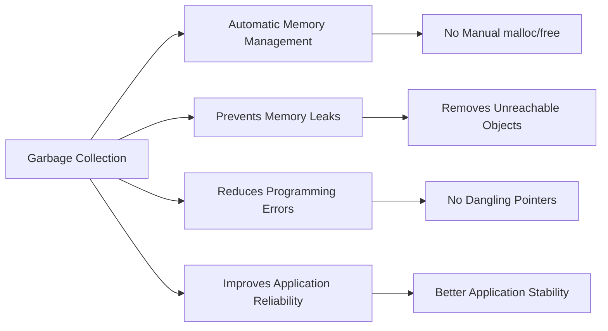

### 📝 Simple Example

```java path=null start=null
public class GCExample {
    public static void main(String[] args) {
        // Creating objects
        String str1 = new String("Hello");
        String str2 = new String("World");

        // Making str1 eligible for GC
        str1 = null;

        // Requesting GC (not guaranteed)
        System.gc();

        // str1 object can now be garbage collected
        // str2 is still reachable
    }
}
```

- A dangling pointer is a pointer that holds the memory address of an object that has already been deallocated or gone out of scope

- The functions malloc() and calloc() are library functions that allocate memory dynamically. Dynamic means the memory is allocated during runtime (execution of the program) from the heap segment.

> malloc()

- malloc() allocates a memory block of given size (in bytes) and returns a pointer to the beginning of the block
- malloc() doesn't initialize the allocated memory.
- If you try to read from the allocated memory without first initializing it, then you will invoke undefined behavior, which usually means the values you read will be garbage values.

> calloc()

- calloc() allocates the memory and also initializes every byte in the allocated memory to 0.
- If you try to read the value of the allocated memory without initializing it, you'll get 0 as it has already been initialized to 0 by calloc().

> malloc() takes a single argument, which is the number of bytes to allocate.

> > Unlike malloc(), calloc() takes two arguments:

- Number of blocks to be allocated.
- Size of each block in bytes.

> Example

```C
// C code that demonstrates the difference
// between calloc and malloc
#include <stdio.h>
#include <stdlib.h>
int main() {
    // Both of these allocate the same number of bytes,
    // which is the amount of bytes that is required to
    // store 5 int values.

    // The memory allocated by calloc will be
    // zero-initialized, but the memory allocated with
    // malloc will be uninitialized so reading it would be
    // undefined behavior.
    int* allocated_with_malloc = malloc(5 * sizeof(int));
    int* allocated_with_calloc = calloc(5, sizeof(int));

    // As you can see, all of the values are initialized to
    // zero.
    printf("Values of allocated_with_calloc: ");
    for (size_t i = 0; i < 5; ++i) {
        printf("%d ", allocated_with_calloc[i]);
    }
    putchar('\n');

    // This malloc requests 1 terabyte of dynamic memory,
    // which is unavailable in this case, and so the
    // allocation fails and returns NULL.
    int* failed_malloc = malloc(1000000000000);
    if (failed_malloc == NULL) {
        printf("The allocation failed, the value of "
               "failed_malloc is: %p",
               (void*)failed_malloc);
    }

    // Remember to always free dynamically allocated memory.
    free(allocated_with_malloc);
    free(allocated_with_calloc);
}
```

> Output :

```text
Values of allocated_with_calloc: 0 0 0 0 0
The allocation failed, the value of failed_malloc is: (nil)
```

> Difference

| S.No | malloc()                                                                   | calloc()                                                                                           |
| ---- | -------------------------------------------------------------------------- | -------------------------------------------------------------------------------------------------- |
| 1    | `malloc()` is a function that creates one block of memory of a fixed size. | `calloc()` is a function that assigns a specified number of blocks of memory to a single variable. |
| 2    | `malloc()` only takes one argument.                                        | `calloc()` takes two arguments.                                                                    |
| 3    | `malloc()` is faster than `calloc()`.                                      | `calloc()` is slower than `malloc()`.                                                              |
| 4    | `malloc()` has high time efficiency.                                       | `calloc()` has low time efficiency.                                                                |
| 5    | `malloc()` is used to indicate memory allocation.                          | `calloc()` is used to indicate contiguous memory allocation.                                       |
| 6    | **Syntax:** `void* malloc(size_t size);`                                   | **Syntax:** `void* calloc(size_t num, size_t size);`                                               |
| 7    | `malloc()` does not initialize the memory to zero.                         | `calloc()` initializes the memory to zero.                                                         |
| 8    | `malloc()` does not add any extra memory overhead.                         | `calloc()` adds some extra memory overhead.                                                        |

---

> The ways to make an object eligible for GC :

- Even though programmer is not responsible to destroy useless objects, it is highly recommended to make an object eligible for GC if it is not longer required.
- An Object is said to be eligible for GC if and only if it does not contain any reference variable.
- The following are the various ways to make an object eligible for GC :
    - Nullifying the reference variable:
        - if an object is no longer required then assign null to all its reference variables then that object is automatically eligible for GC. This approach is nothing but nullifying the reference variable. Shown in example above.
    - Reassigning the reference variable :
        - if an object is no longer required then reassign its reference variable to some other object then old object will be eligible for GC(Garbage Collection).
    - The Objects which are created inside a method are by default eligible for GC once a method completes.
    - Island of isolation :

```java
// Java Program to Illustrate Island of Isolation
public class Test {
    Test i;
    // Method 1
    // Main driver method
    public static void main(String[] args) {
        // Creating object of class inside main() method
        Test t1 = new Test();
        Test t2 = new Test();

        // Object of t1 gets a copy of t2
        t1.i = t2;

        // Object of t2 gets a copy of t1
        t2.i = t1;

        // Till now no object eligible
        // for garbage collection
        t1 = null;

        // Now two objects are eligible for
        // garbage collection
        t2 = null;

        // Calling garbage collector
        System.gc();
    }

    // Method 2
    // overriding finalize() Method
    @Override protected void finalize() throws Throwable
    {
        // Print statement
        System.out.println("Finalize method called");
    }
}
```

Note :

- if an object does not contain any reference variable then it is eligible for garbage collection always.
- Even though object having references sometimes it is eligible for garbage collection(if all references are internal references, eg : island of isolation)

> The methods for requesting JVM to run GC

- There is no guarantee that the jvm will always listen to our request and send the garbage collector for us.
- Once we made an object eligible for GC it may not be destroyed immediately by garbage collector, whenever JVM runs GC then only the objects will be destroyed but when exactly JVM runs garbage collector, we can't expect it is varied from JVM to JVM.
- Instead of waiting until JVM runs GC we can request JVM to run GC programmatically but whether JVM accept our request or not there is not guarantee but most of the times JVM accept our request.
- The following are two ways for requesting JVM to run GC:
    - By using system call :
        - System class contains a static method called gc() for this purpose [System.gc()].
    - By using Runtime class :
        - Java application can communicate with JVM by using Runtime Object.
        - Runtime class present in java.lang package and it is a singleton class.
        - We can create Runtime object by using Runtime.getRuntime() method.
        - Runtime r = Runtime.getRuntime();
        - Once we got runtime object we can call the following methods on that object :
            - Total Memory : r.totalMemory() --> it return number of bytes of total memory present in the heap(i.e Heap Size)
            - Free Memory : r.freeMemory() --> it return number of bytes of free memory present in the heap(i.e Heap Size)
            - gc : r.gc() --> it will trigger garbage collection.

```java
//Runtime example
import java.util.*;
import java.lang.*;
public class RuntimeExample {
    public static void main(String[] args) {
        Runtime r = Runtime.getRuntime();
        long totalMemory = r.totalMemory();
        long freeMemory = r.freeMemory();
        long usedMemory = totalMemory - freeMemory;
        System.out.println("Used: " + usedMemory);
        System.out.println("Free: " + freeMemory);
        System.out.println("Total: " + totalMemory);
    }
}
// Note :
// Its convenient to use System.gc() but it is recommended to use Runtime Object.gc() because internally System.gc() itself calls runtime object.gc() only.
class System {
    public static void gc() {
        Runtime.getRuntime().gc();
    }
}
```

> # Finalization

- Just before destroying an object garbage collector calls finalize() method to perform clean up activities.
- Once a finally method completes autommatically garbase that destorys that object.
- finalize method present in object class with the following declaration.

```java
protected void finalize() throws Throwable {}
```

- we can override finalize method in our class to define our own clean up activities.

> #### Examples

```java
import java.lang.*;
import java.util.*;
public class Test {
    public static void main(String args[]) {
        String str = new String("RAJ");
        str = null;
        System.gc();
        System.out.println("End of Main");
    }
    public void finalize() {
        System.out.println("Finalize method called");
    }
}
// Note here the output will : End of main. --> only this line.
// Because the finalize method here is for object of type Test
```

```java
import java.lang.*;
import java.util.*;
public class Test {
    public static void main(String args[]) {
        Test t1 = new Test();
        t1 = null;
        System.gc();
        System.out.println("End of Main");
    }
    public void finalize() {
        System.out.println("Finalize method called");
    }
}
```

- case 1 :
    - Just before destroying an object garbage collector calls finalize() method on the object which is eligible for GC then the correspoding class finalize() method will be executed.
    - For example, if String object is eligible for GC then String class finalize method will be executed but not Test class Finalize method.

## 🏗️ Memory Management in Java

### JVM Memory Areas

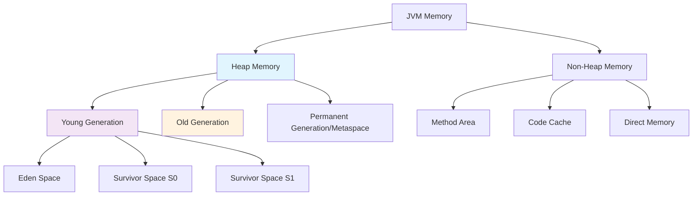

### 🎨 Memory Areas Explained

| Memory Area         | Purpose                               | GC Involvement |
| ------------------- | ------------------------------------- | -------------- |
| **Eden Space**      | Where new objects are allocated       | ✅ Frequent GC |
| **Survivor Spaces** | Objects that survived at least one GC | ✅ Minor GC    |
| **Old Generation**  | Long-lived objects                    | ✅ Major GC    |
| **Metaspace**       | Class metadata (Java 8+)              | ⚠️ Limited GC  |
| **Method Area**     | Runtime constant pool, method data    | ⚠️ Limited GC  |

---

## 🏠 Heap Memory Structure

### Detailed Heap Layout

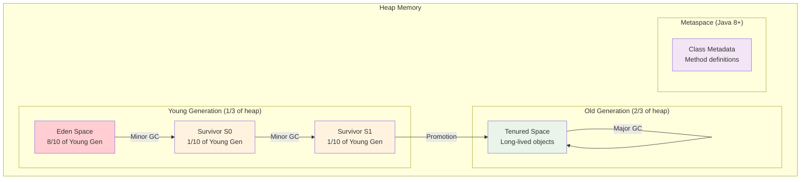

### 📊 Memory Allocation Flow

```java path=null start=null
public class MemoryAllocationDemo {
    public static void main(String[] args) {
        // Step 1: Objects created in Eden space
        List<String> list1 = new ArrayList<>();
        for(int i = 0; i < 1000; i++) {
            list1.add("Object " + i); // Allocated in Eden
        }

        // Step 2: Minor GC triggered when Eden fills up
        // Surviving objects move to Survivor space

        // Step 3: After multiple GC cycles, objects promote to Old Gen
        List<String> longLivedList = new ArrayList<>();
        // This might eventually move to Old Generation
    }
}
```

---

## 🔗 Types of References

Java provides different types of references that influence GC behavior:

### Reference Types Hierarchy

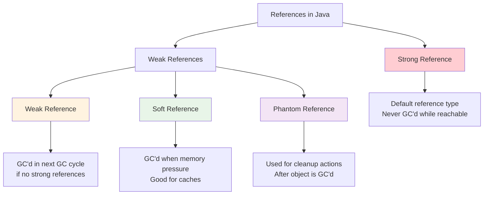

### 💡 Reference Examples

```java path=null start=null
import java.lang.ref.*;
import java.util.*;

public class ReferenceTypesDemo {
    public static void main(String[] args) {
        // 1. Strong Reference (default)
        String strongRef = new String("Strong Reference");

        // 2. Weak Reference
        WeakReference<String> weakRef = new WeakReference<>(new String("Weak"));

        // 3. Soft Reference
        SoftReference<String> softRef = new SoftReference<>(new String("Soft"));

        // 4. Phantom Reference
        ReferenceQueue<String> refQueue = new ReferenceQueue<>();
        PhantomReference<String> phantomRef = new PhantomReference<>(
            new String("Phantom"), refQueue
        );

        // Force garbage collection
        System.gc();

        // Check references after GC
        System.out.println("Strong Ref: " + strongRef); // Still available
        System.out.println("Weak Ref: " + weakRef.get()); // Might be null
        System.out.println("Soft Ref: " + softRef.get()); // Usually still available
        System.out.println("Phantom Ref: " + phantomRef.get()); // Always null
    }
}
```

---

## ⚙️ Garbage Collection Process

### GC Root Objects

Objects that are always reachable and serve as starting points for GC:

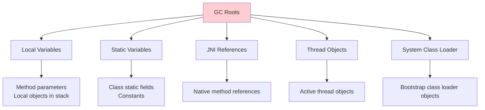

### 🔄 Mark and Sweep Algorithm

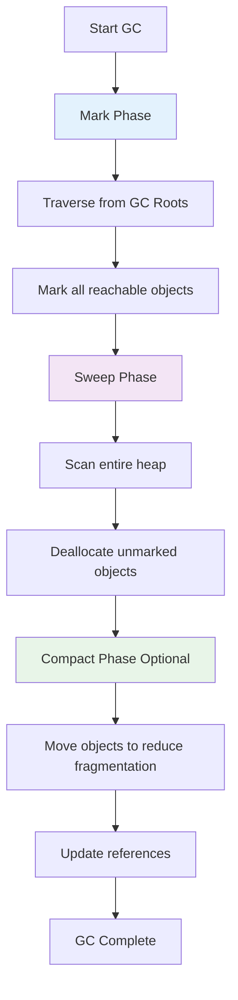

### 📝 Reachability Example

```java path=null start=null
public class ReachabilityExample {
    static Object staticRef; // GC Root - Static variable

    public static void main(String[] args) {
        Object localRef = new Object(); // GC Root - Local variable

        // Create object graph
        Node root = new Node("root");
        Node child1 = new Node("child1");
        Node child2 = new Node("child2");

        root.left = child1;
        root.right = child2;
        child1.parent = root; // Circular reference

        // root is reachable from localRef (GC Root)
        // child1 and child2 are reachable through root

        root = null; // Now entire graph becomes unreachable
        // All nodes (root, child1, child2) eligible for GC
    }
}

class Node {
    String data;
    Node left, right, parent;

    Node(String data) { this.data = data; }
}
```

---

## 🎯 GC Algorithms

### Major GC Algorithms Comparison

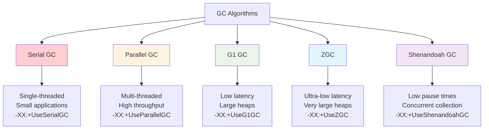

### 📊 Algorithm Performance Characteristics

| Algorithm      | Pause Time | Throughput  | Memory Overhead | Best For                     |
| -------------- | ---------- | ----------- | --------------- | ---------------------------- |
| **Serial**     | High       | Medium      | Low             | Single-core, small apps      |
| **Parallel**   | High       | High        | Low             | Multi-core, batch processing |
| **G1**         | Low-Medium | Medium-High | Medium          | Balanced latency/throughput  |
| **ZGC**        | Ultra-Low  | Medium      | High            | Real-time applications       |
| **Shenandoah** | Ultra-Low  | Medium      | High            | Interactive applications     |

### 🔧 Algorithm Configuration Examples

```java path=null start=null
// JVM startup parameters for different GC algorithms

// Serial GC (default for client-class machines)
// -XX:+UseSerialGC

// Parallel GC (default for server-class machines)
// -XX:+UseParallelGC
// -XX:ParallelGCThreads=4

// G1 GC
// -XX:+UseG1GC
// -XX:MaxGCPauseMillis=200
// -XX:G1HeapRegionSize=16m

// ZGC (Java 11+)
// -XX:+UseZGC
// -XX:+UnlockExperimentalVMOptions

// Shenandoah (OpenJDK)
// -XX:+UseShenandoahGC
// -XX:+UnlockExperimentalVMOptions
```

---

## 👶 Generational Garbage Collection

### Generational Hypothesis

> **"Most objects die young"** - The foundational principle behind generational GC

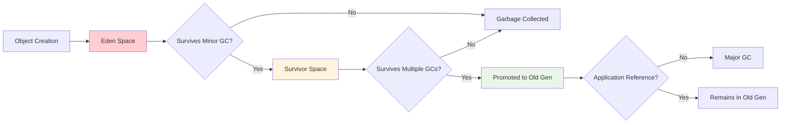

### 🔄 Minor vs Major GC

```mermaid
flowchart TB
  subgraph Minor_GC["Minor GC (Young Generation)"]
    A1["Triggered when Eden is full"]
    A2["Fast execution ~10ms"]
    A3["Copies live objects to Survivor"]
    A4["Clears Eden space"]
    A5["Increments age counter"]
  end

  subgraph Major_GC["Major GC (Old Generation)"]
    B1["Triggered when Old Gen is full"]
    B2["Slower execution ~100ms-1s"]
    B3["Mark-Sweep-Compact algorithm"]
    B4["Can trigger Full GC"]
    B5["Application pause"]
  end

  A1 --> A2 --> A3 --> A4 --> A5
  B1 --> B2 --> B3 --> B4 --> B5

  style A1 fill:#e8f5e8,stroke:#2e7d32,stroke-width:2px
  style B1 fill:#ffcdd2,stroke:#c62828,stroke-width:2px
```

### 📈 Object Lifecycle Example

```java path=null start=null
public class ObjectLifecycleDemo {
    // Static variable - lives in Old Generation
    private static List<String> cache = new ArrayList<>();

    public static void main(String[] args) {
        // Demonstrate object lifecycle
        generateShortLivedObjects(); // Die in Young Gen
        generateLongLivedObjects();  // Promote to Old Gen
    }

    private static void generateShortLivedObjects() {
        // These objects will likely die in Eden or Survivor space
        for(int i = 0; i < 10000; i++) {
            String temp = "Temporary object " + i;
            processString(temp); // temp becomes unreachable after method
        }
        // Most objects eligible for Minor GC
    }

    private static void generateLongLivedObjects() {
        // These objects will be promoted to Old Generation
        for(int i = 0; i < 100; i++) {
            cache.add("Long lived object " + i);
        }
        // Objects survive multiple Minor GCs and get promoted
    }

    private static void processString(String str) {
        // Local processing
        str.toUpperCase();
    }
}
```

---

## 🛠️ GC Tuning Parameters

### Essential JVM Flags

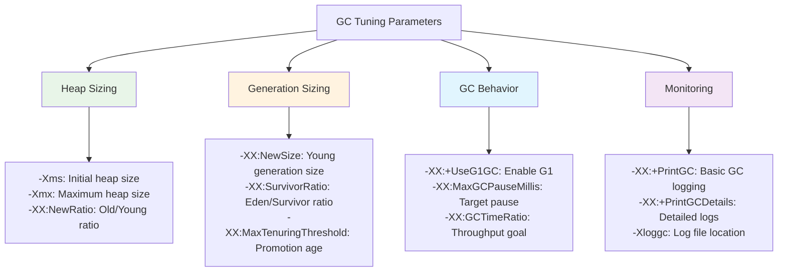

### 📊 Common Tuning Scenarios

#### High Throughput Application

```bash
# Optimize for maximum throughput
-XX:+UseParallelGC
-XX:ParallelGCThreads=8
-XX:+UseParallelOldGC
-XX:GCTimeRatio=99
-Xms4g -Xmx4g
```

#### Low Latency Application

```bash
# Optimize for low pause times
-XX:+UseG1GC
-XX:MaxGCPauseMillis=50
-XX:G1HeapRegionSize=32m
-Xms8g -Xmx8g
```

#### Memory Constrained Environment

```bash
# Optimize for small memory footprint
-XX:+UseSerialGC
-Xms512m -Xmx1g
-XX:MinHeapFreeRatio=10
-XX:MaxHeapFreeRatio=20
```

### 📝 Tuning Example Application

```java path=null start=null
/**
 * Example application to demonstrate GC tuning effects
 * Run with different GC parameters to observe behavior
 */
public class GCTuningDemo {
    private static final int ITERATIONS = 1_000_000;
    private static List<Object> memoryHolder = new ArrayList<>();

    public static void main(String[] args) {
        System.out.println("Starting GC Tuning Demo");
        long startTime = System.currentTimeMillis();

        // Simulate mixed workload
        for(int i = 0; i < ITERATIONS; i++) {
            createShortLivedObjects();

            if(i % 10000 == 0) {
                createLongLivedObjects();
                printMemoryStats();
            }
        }

        long endTime = System.currentTimeMillis();
        System.out.println("Total time: " + (endTime - startTime) + "ms");
    }

    private static void createShortLivedObjects() {
        // Create objects that die quickly
        List<String> temp = new ArrayList<>();
        for(int i = 0; i < 100; i++) {
            temp.add("temp-" + i);
        }
        // temp goes out of scope and becomes eligible for GC
    }

    private static void createLongLivedObjects() {
        // Create some objects that survive longer
        memoryHolder.add(new Object());

        // Occasionally clean up to prevent OutOfMemoryError
        if(memoryHolder.size() > 1000) {
            memoryHolder.clear();
        }
    }

    private static void printMemoryStats() {
        Runtime runtime = Runtime.getRuntime();
        long totalMemory = runtime.totalMemory();
        long freeMemory = runtime.freeMemory();
        long usedMemory = totalMemory - freeMemory;

        System.out.printf("Used: %d MB, Free: %d MB, Total: %d MB%n",
            usedMemory / 1024 / 1024,
            freeMemory / 1024 / 1024,
            totalMemory / 1024 / 1024);
    }
}
```

---

## 📈 Performance Monitoring

### GC Monitoring Tools

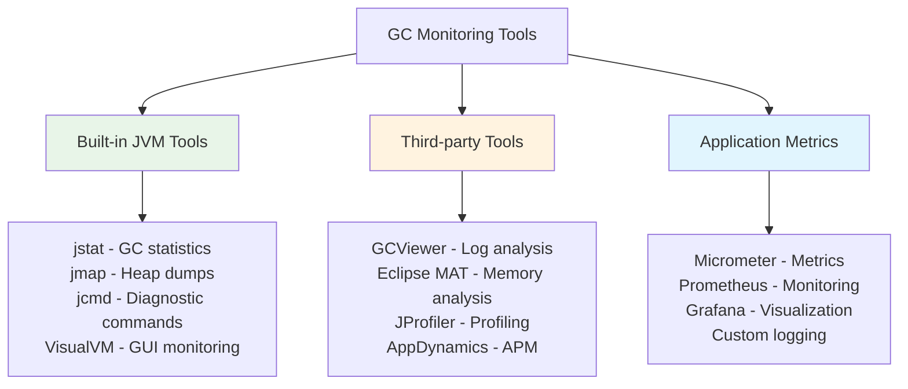

### 📊 Key GC Metrics

| Metric               | Description               | Good Value | Tool    |
| -------------------- | ------------------------- | ---------- | ------- |
| **GC Frequency**     | How often GC occurs       | < 1/sec    | jstat   |
| **GC Pause Time**    | Time spent in GC          | < 100ms    | GC logs |
| **Throughput**       | % time not in GC          | > 95%      | jstat   |
| **Heap Utilization** | Memory usage              | 70-80%     | jmap    |
| **Promotion Rate**   | Objects moving to Old Gen | Low        | GC logs |

### 🔍 Monitoring Code Example

```java path=null start=null
import java.lang.management.*;
import java.util.List;

public class GCMonitor {
    public static void main(String[] args) {
        // Monitor GC in real-time
        Thread monitorThread = new Thread(() -> {
            while(true) {
                printGCStats();
                try {
                    Thread.sleep(5000); // Print every 5 seconds
                } catch(InterruptedException e) {
                    break;
                }
            }
        });

        monitorThread.setDaemon(true);
        monitorThread.start();

        // Simulate application workload
        simulateWorkload();
    }

    private static void printGCStats() {
        List<GarbageCollectorMXBean> gcBeans =
            ManagementFactory.getGarbageCollectorMXBeans();

        System.out.println("\n=== GC Statistics ===");
        for(GarbageCollectorMXBean gcBean : gcBeans) {
            System.out.printf("GC Name: %s%n", gcBean.getName());
            System.out.printf("Collections: %d%n", gcBean.getCollectionCount());
            System.out.printf("Time: %d ms%n", gcBean.getCollectionTime());
        }

        // Memory usage
        MemoryMXBean memoryBean = ManagementFactory.getMemoryMXBean();
        MemoryUsage heapUsage = memoryBean.getHeapMemoryUsage();

        System.out.printf("Heap Used: %d MB%n",
            heapUsage.getUsed() / 1024 / 1024);
        System.out.printf("Heap Max: %d MB%n",
            heapUsage.getMax() / 1024 / 1024);
        System.out.printf("Heap Utilization: %.1f%%%n",
            (double)heapUsage.getUsed() / heapUsage.getMax() * 100);
    }

    private static void simulateWorkload() {
        List<Object> objects = new ArrayList<>();

        for(int i = 0; i < 100000; i++) {
            // Create objects
            objects.add(new Object());

            // Occasionally clear to trigger GC
            if(i % 10000 == 0) {
                objects.clear();
                System.gc(); // Suggest GC
            }
        }
    }
}
```

---

## ✅ Best Practices

### 🎯 Memory Management Best Practices

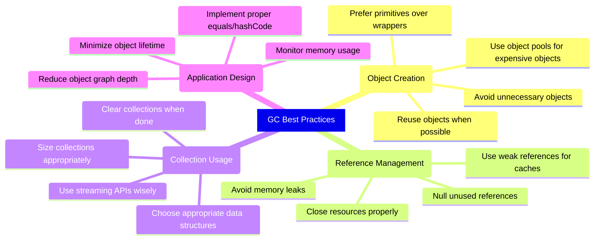

### 📝 Code Examples for Best Practices

#### 1. Object Reuse Pattern

```java path=null start=null
public class ObjectReuseExample {
    // ❌ Bad: Creates new objects repeatedly
    public String badConcatenation(List<String> words) {
        String result = "";
        for(String word : words) {
            result += word; // Creates new String objects
        }
        return result;
    }

    // ✅ Good: Reuses StringBuilder
    public String goodConcatenation(List<String> words) {
        StringBuilder sb = new StringBuilder();
        for(String word : words) {
            sb.append(word); // Reuses internal buffer
        }
        return sb.toString();
    }

    // ✅ Even better: Use String.join()
    public String bestConcatenation(List<String> words) {
        return String.join("", words);
    }
}
```

#### 2. Proper Resource Management

```java path=null start=null
public class ResourceManagementExample {

    // ✅ Good: Try-with-resources
    public void processFile(String filename) throws IOException {
        try(BufferedReader reader = Files.newBufferedReader(Paths.get(filename))) {
            String line;
            while((line = reader.readLine()) != null) {
                processLine(line);
            }
            // Reader automatically closed, eligible for GC
        }
    }

    // ✅ Good: Null unused references
    public void processLargeDataSet() {
        List<Data> largeDataSet = loadLargeDataSet();

        // Process data
        for(Data data : largeDataSet) {
            process(data);
        }

        // Clear reference to help GC
        largeDataSet = null;

        // Continue with other operations
        doOtherWork();
    }

    private void processLine(String line) { /* implementation */ }
    private List<Data> loadLargeDataSet() { return new ArrayList<>(); }
    private void process(Data data) { /* implementation */ }
    private void doOtherWork() { /* implementation */ }
}

class Data {
    // Data implementation
}
```

#### 3. Smart Collection Usage

```java path=null start=null
public class SmartCollectionUsage {

    // ✅ Good: Size collections appropriately
    public List<String> processItems(int expectedSize) {
        // Pre-size to avoid resizing
        List<String> result = new ArrayList<>(expectedSize);

        for(int i = 0; i < expectedSize; i++) {
            result.add("Item " + i);
        }

        return result;
    }

    // ✅ Good: Use appropriate data structure
    public Set<String> findUniqueItems(List<String> items) {
        // HashSet for O(1) lookups vs ArrayList O(n)
        return new HashSet<>(items);
    }

    // ✅ Good: Stream processing for large datasets
    public List<String> processLargeDataset(List<String> data) {
        return data.stream()
            .filter(s -> s.length() > 5)
            .map(String::toUpperCase)
            .collect(Collectors.toList());
        // Intermediate objects are short-lived
    }
}
```

---

## ⚠️ Common Memory Issues

### Memory Leak Patterns

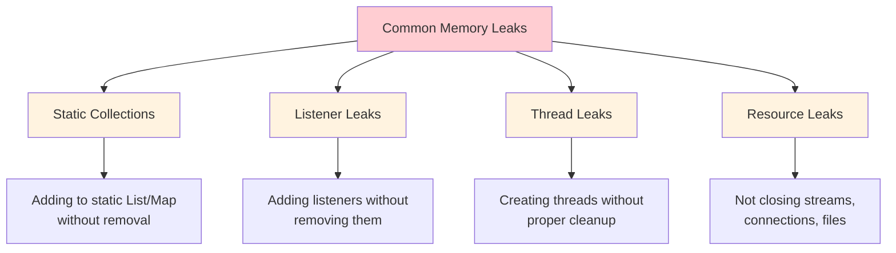

### 🐛 Memory Leak Examples and Fixes

#### 1. Static Collection Leak

```java path=null start=null
public class StaticCollectionLeak {
    // ❌ Problem: Static collection grows indefinitely
    private static final List<String> cache = new ArrayList<>();

    public void badCaching(String data) {
        cache.add(data); // Never removed, causes memory leak
    }

    // ✅ Solution: Use bounded cache with cleanup
    private static final Map<String, String> boundedCache =
        Collections.synchronizedMap(new LinkedHashMap<String, String>() {
            @Override
            protected boolean removeEldestEntry(Map.Entry<String, String> eldest) {
                return size() > 1000; // Limit cache size
            }
        });

    public void goodCaching(String key, String data) {
        boundedCache.put(key, data); // Automatically removes old entries
    }
}
```

#### 2. Listener Leak

```java path=null start=null
public class ListenerLeakExample {
    private final List<EventListener> listeners = new ArrayList<>();

    // ❌ Problem: Listeners accumulate without cleanup
    public void addListener(EventListener listener) {
        listeners.add(listener);
        // If listener holds reference to large objects, memory leak occurs
    }

    // ✅ Solution: Provide removal method and use weak references
    public void addListenerSafe(EventListener listener) {
        listeners.add(new WeakReference<>(listener));
    }

    public void removeListener(EventListener listener) {
        listeners.removeIf(ref -> {
            EventListener l = ref.get();
            return l == null || l.equals(listener);
        });
    }

    // ✅ Better: Use WeakReference for automatic cleanup
    private final List<WeakReference<EventListener>> weakListeners = new ArrayList<>();
}

interface EventListener {
    void onEvent(String event);
}
```

#### 3. OutOfMemoryError Handling

```java path=null start=null
public class MemoryErrorHandling {

    public void handleLargeDataProcessing() {
        try {
            List<String> largeDataSet = new ArrayList<>();

            // Process data in chunks to avoid OOM
            processInChunks(largeDataSet);

        } catch(OutOfMemoryError e) {
            System.err.println("Out of memory! Attempting recovery...");

            // Emergency cleanup
            System.gc(); // Request GC

            // Reduce operation scope
            processWithReducedMemory();
        }
    }

    private void processInChunks(List<String> data) {
        final int CHUNK_SIZE = 1000;

        for(int i = 0; i < data.size(); i += CHUNK_SIZE) {
            int end = Math.min(i + CHUNK_SIZE, data.size());
            List<String> chunk = data.subList(i, end);

            // Process chunk
            processChunk(chunk);

            // Help GC by nulling reference
            chunk = null;

            // Optional: suggest GC after processing chunk
            if(i % (CHUNK_SIZE * 10) == 0) {
                System.gc();
            }
        }
    }

    private void processChunk(List<String> chunk) {
        // Process the chunk
        for(String item : chunk) {
            // Processing logic
        }
    }

    private void processWithReducedMemory() {
        // Implement fallback with reduced memory requirements
        System.out.println("Processing with reduced memory footprint");
    }
}
```

---

## 📊 Performance Analysis Tools

### Command Line Tools

```bash
# Monitor GC in real-time
jstat -gc -t <pid> 1s

# Generate heap dump
jmap -dump:format=b,file=heap.hprof <pid>

# Analyze GC logs
java -Xloggc:gc.log -XX:+PrintGCDetails -XX:+PrintGCTimeStamps YourApp

# Memory histogram
jmap -histo <pid> | head -20
```

### 📈 Sample GC Log Analysis

```
2024-01-15T10:30:15.123+0000: [GC (Allocation Failure)
[PSYoungGen: 786432K->87423K(917504K)]
1048576K->349567K(1966080K), 0.0123456 secs]
[Times: user=0.05 sys=0.01, real=0.01 secs]
```

**Analysis:**

- **Event**: Minor GC triggered by allocation failure
- **Young Gen**: Reduced from 786MB to 87MB
- **Total Heap**: Reduced from 1GB to 341MB
- **Time**: 12.3ms pause time
- **Efficiency**: Good - significant memory freed

---

## 🎓 Advanced Topics

### G1GC Detailed Configuration

```java path=null start=null
/**
 * Advanced G1GC configuration for production applications
 */
public class G1Configuration {
    /*
    JVM Flags for G1GC optimization:

    -XX:+UseG1GC
    -XX:MaxGCPauseMillis=200          // Target pause time
    -XX:G1HeapRegionSize=16m          // Region size (1MB-32MB)
    -XX:G1NewSizePercent=20           // Min young gen size
    -XX:G1MaxNewSizePercent=30        // Max young gen size
    -XX:G1MixedGCCountTarget=8        // Mixed GC cycle target
    -XX:InitiatingHeapOccupancyPercent=45  // Old gen occupancy threshold
    -XX:G1ReservePercent=10           // Reserved heap space
    -XX:+G1UseAdaptiveIHOP            // Adaptive IHOP
    */

    public static void demonstrateG1Behavior() {
        System.out.println("G1GC optimizes for:");
        System.out.println("1. Predictable pause times");
        System.out.println("2. High throughput");
        System.out.println("3. Large heap support (>4GB)");
    }
}
```

### ZGC and Shenandoah for Ultra-Low Latency

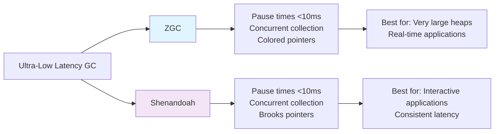

---

## 🏁 Conclusion

### 📝 Key Takeaways

1. **Understand Your Application**: Profile before optimizing
2. **Choose the Right GC**: Match algorithm to use case
3. **Monitor Continuously**: Use tools and metrics
4. **Write GC-Friendly Code**: Follow best practices
5. **Test Thoroughly**: Validate changes under load

### 🎯 Quick Reference Card

| Scenario                 | Recommended GC | Key Flags                               |
| ------------------------ | -------------- | --------------------------------------- |
| **Small Applications**   | Serial GC      | `-XX:+UseSerialGC`                      |
| **High Throughput**      | Parallel GC    | `-XX:+UseParallelGC`                    |
| **Balanced Performance** | G1 GC          | `-XX:+UseG1GC -XX:MaxGCPauseMillis=200` |
| **Ultra-Low Latency**    | ZGC/Shenandoah | `-XX:+UseZGC` or `-XX:+UseShenandoahGC` |

---

### 📚 Additional Resources

- [Oracle JVM Tuning Guide](https://docs.oracle.com/javase/8/docs/technotes/guides/vm/gctuning/)
- [G1GC Deep Dive](https://www.oracle.com/technetwork/tutorials/tutorials-1876574.html)
- [GC Algorithms Comparison](https://blog.gceasy.io/2020/03/25/jvm-garbage-collection-algorithms/)

---

_Created with ❤️ for Java developers who want to master Garbage Collection_

> 💡 **Pro Tip**: Start with default GC settings and only optimize when you have clear performance requirements and measurement data!
