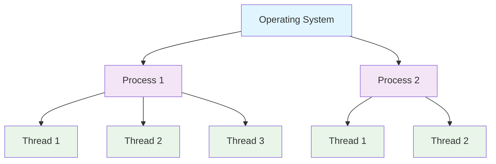
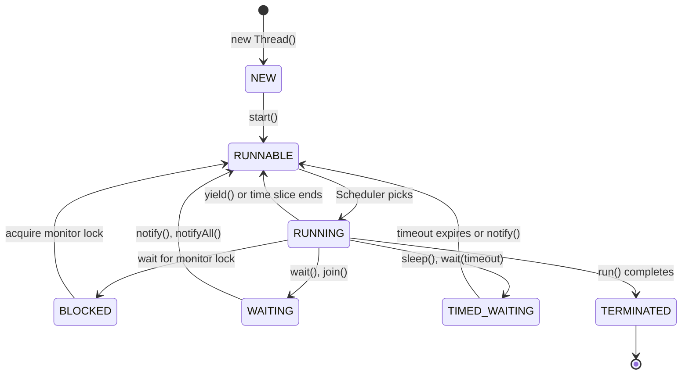
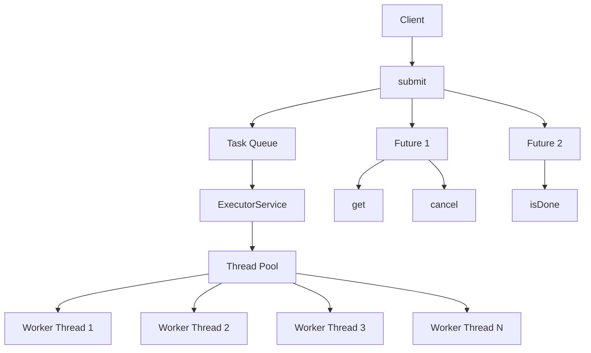
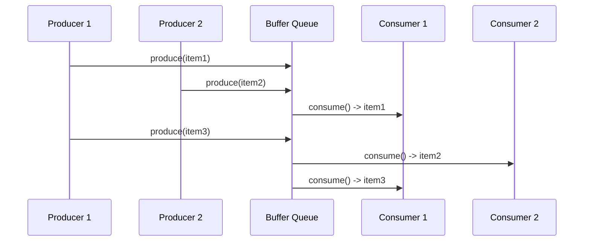
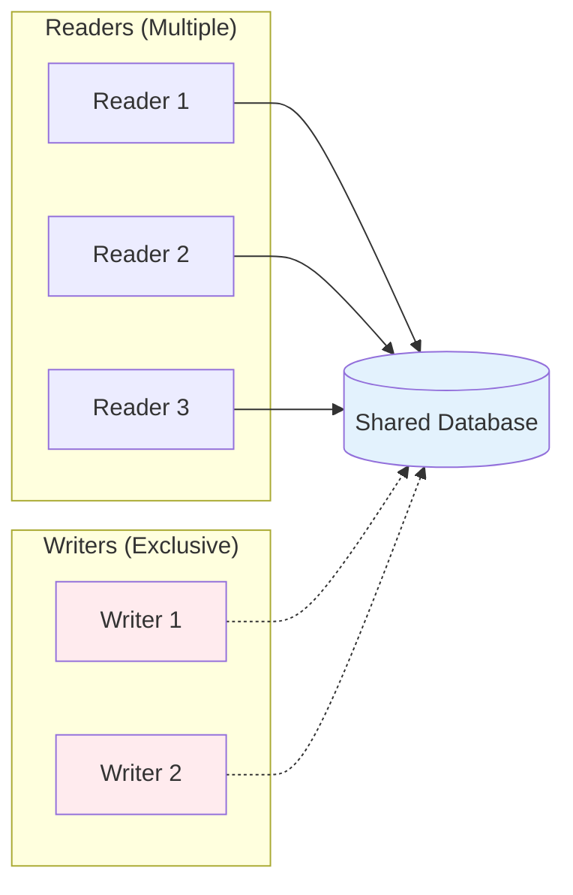
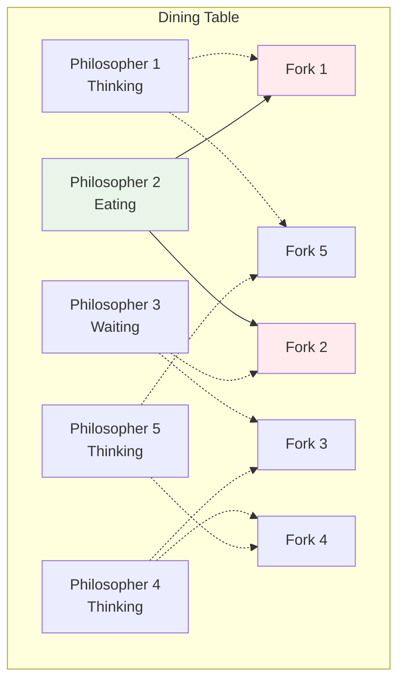
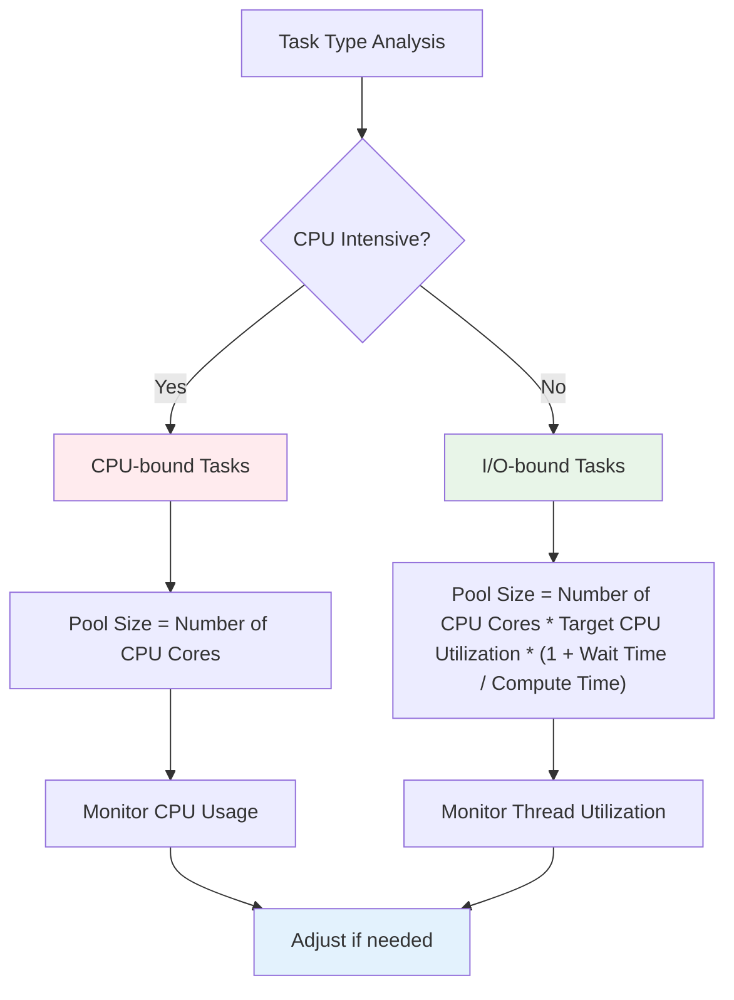

# 🧵 Complete Guide to Java Multithreading

<div align="center">


_Master Java Multithreading from Ground Up_ 🚀

</div>

---

## 📚 Table of Contents

1. [🌟 Introduction](#-introduction)
2. [🔰 Basic Concepts](#-basic-concepts)
3. [🏗️ Thread Creation & Management](#️-thread-creation--management)
4. [🔒 Synchronization & Thread Safety](#-synchronization--thread-safety)
5. [💬 Inter-Thread Communication](#-inter-thread-communication)
6. [⚡ Advanced Concurrency Utilities](#-advanced-concurrency-utilities)
7. [🎯 Real-World Examples & Patterns](#-real-world-examples--patterns)
8. [🚀 Performance & Best Practices](#-performance--best-practices)
9. [🐛 Common Pitfalls & Debugging](#-common-pitfalls--debugging)
10. [📖 Further Reading](#-further-reading)

---

## 🌟 Introduction

**Multithreading** is one of the most powerful features in Java that allows concurrent execution of multiple threads. It enables better resource utilization, improved performance, and enhanced user experience in applications.

### Why Learn Multithreading? 🤔

- ✅ **Better Performance**: Utilize multiple CPU cores effectively
- ✅ **Responsive Applications**: Keep UI responsive while background tasks run
- ✅ **Resource Optimization**: Better CPU and I/O utilization
- ✅ **Scalability**: Handle multiple requests simultaneously
- ✅ **Real-world Necessity**: Essential for modern application development

---

## 🔰 Basic Concepts

### Process vs Thread 🆚



| Aspect            | Process               | Thread               |
| ----------------- | --------------------- | -------------------- |
| **Memory**        | Separate memory space | Shared memory space  |
| **Communication** | IPC (expensive)       | Direct (cheap)       |
| **Creation**      | Heavyweight           | Lightweight          |
| **Switching**     | Expensive             | Cheaper              |
| **Independence**  | Independent           | Dependent on process |

### Concurrency vs Parallelism 🔄

```mermaid
gantt
    title Concurrency vs Parallelism
    dateFormat X
    axisFormat %s

    section Concurrency (Single Core)
    Task A    :0, 2
    Task B    :2, 4
    Task A    :4, 6
    Task C    :6, 8
    Task B    :8, 10

    section Parallelism (Multi Core)
    Core 1 - Task A :0, 10
    Core 2 - Task B :0, 10
    Core 3 - Task C :0, 10
```



**Concurrency**: Multiple tasks making progress by time-slicing on single core  
**Parallelism**: Multiple tasks executing simultaneously on multiple cores

### Thread Lifecycle 🔄



#### Thread States Explained

1. **NEW** 🆕: Thread created but not started
2. **RUNNABLE** 🏃: Thread ready to run or currently running
3. **BLOCKED** 🚧: Waiting for monitor lock
4. **WAITING** ⏳: Waiting indefinitely for another thread
5. **TIMED_WAITING** ⏰: Waiting for specified time period
6. **TERMINATED** ☠️: Thread execution completed

```java path=null start=null
// Example: Thread State Monitoring
public class ThreadStateExample {
    public static void main(String[] args) throws InterruptedException {
        Thread thread = new Thread(() -> {
            try {
                Thread.sleep(2000); // TIMED_WAITING
            } catch (InterruptedException e) {
                Thread.currentThread().interrupt();
            }
        });

        System.out.println("Before start: " + thread.getState()); // NEW
        thread.start();
        System.out.println("After start: " + thread.getState());  // RUNNABLE

        Thread.sleep(100);
        System.out.println("While sleeping: " + thread.getState()); // TIMED_WAITING

        thread.join();
        System.out.println("After completion: " + thread.getState()); // TERMINATED
    }
}
```

---

## 🏗️ Thread Creation & Management

### Method 1: Extending Thread Class 🧬

```java path=null start=null
class MyThread extends Thread {
    private String threadName;

    public MyThread(String name) {
        this.threadName = name;
    }

    @Override
    public void run() {
        for (int i = 1; i <= 5; i++) {
            System.out.println(threadName + " - Count: " + i);
            try {
                Thread.sleep(1000);
            } catch (InterruptedException e) {
                System.out.println(threadName + " interrupted");
                return;
            }
        }
        System.out.println(threadName + " completed");
    }
}

// Usage
public class ThreadExample1 {
    public static void main(String[] args) {
        MyThread thread1 = new MyThread("Thread-1");
        MyThread thread2 = new MyThread("Thread-2");

        thread1.start(); // ✅ Correct way
        thread2.start();

        // thread1.run(); // ❌ Wrong! This runs in main thread
    }
}
```

**Output:**

```
Thread-1 - Count: 1
Thread-2 - Count: 1
Thread-1 - Count: 2
Thread-2 - Count: 2
...
```

### Method 2: Implementing Runnable Interface 🏃‍♀️

```java path=null start=null
class MyRunnable implements Runnable {
    private String taskName;

    public MyRunnable(String name) {
        this.taskName = name;
    }

    @Override
    public void run() {
        for (int i = 1; i <= 5; i++) {
            System.out.println(taskName + " executing step " + i +
                             " [Thread: " + Thread.currentThread().getName() + "]");
            try {
                Thread.sleep(500);
            } catch (InterruptedException e) {
                Thread.currentThread().interrupt();
                return;
            }
        }
    }
}

public class RunnableExample {
    public static void main(String[] args) {
        // Creating threads with Runnable
        Thread thread1 = new Thread(new MyRunnable("Database-Task"));
        Thread thread2 = new Thread(new MyRunnable("Network-Task"));

        // Setting thread names
        thread1.setName("DB-Worker");
        thread2.setName("Network-Worker");

        thread1.start();
        thread2.start();
    }
}
```

### Method 3: Using Lambda Expressions (Modern Approach) ✨

```java path=null start=null
public class ModernThreadExample {
    public static void main(String[] args) {
        // Lambda with Runnable
        Thread task1 = new Thread(() -> {
            for (int i = 0; i < 5; i++) {
                System.out.println("Lambda Task 1: " + i);
                try { Thread.sleep(1000); }
                catch (InterruptedException e) { Thread.currentThread().interrupt(); }
            }
        });

        // Method reference
        Thread task2 = new Thread(ModernThreadExample::backgroundTask);

        // Anonymous runnable
        Runnable printNumbers = () -> {
            IntStream.range(1, 6)
                    .forEach(i -> {
                        System.out.println("Number: " + i);
                        try { Thread.sleep(800); }
                        catch (InterruptedException e) { Thread.currentThread().interrupt(); }
                    });
        };
        Thread task3 = new Thread(printNumbers);

        task1.start();
        task2.start();
        task3.start();
    }

    private static void backgroundTask() {
        System.out.println("Background task running on: " + Thread.currentThread().getName());
        // Task implementation
    }
}
```

### Thread vs Runnable: When to Use What? 🤷‍♀️

| Use Thread Class When                     | Use Runnable Interface When                   |
| ----------------------------------------- | --------------------------------------------- |
| You need to override other Thread methods | You only need to define the task (run method) |
| Single inheritance is acceptable          | You need to extend another class              |
| Simple, standalone threads                | Better design and flexibility                 |
| Learning/prototyping                      | Production code                               |

**👍 Best Practice**: Always prefer `Runnable` interface for better design!

### Method 4: Using Callable and Future 🔮

```java path=null start=null
import java.util.concurrent.*;
import java.util.*;

class FactorialCalculator implements Callable<Long> {
    private final int number;

    public FactorialCalculator(int number) {
        this.number = number;
    }

    @Override
    public Long call() throws Exception {
        long result = 1;
        for (int i = 1; i <= number; i++) {
            result *= i;
            Thread.sleep(100); // Simulate work
        }
        return result;
    }
}

public class CallableExample {
    public static void main(String[] args) {
        ExecutorService executor = Executors.newFixedThreadPool(3);

        List<Future<Long>> futures = new ArrayList<>();

        // Submit multiple tasks
        for (int i = 5; i <= 10; i++) {
            Future<Long> future = executor.submit(new FactorialCalculator(i));
            futures.add(future);
        }

        // Collect results
        for (int i = 0; i < futures.size(); i++) {
            try {
                Long result = futures.get(i).get(5, TimeUnit.SECONDS);
                System.out.println("Factorial of " + (i + 5) + " = " + result);
            } catch (InterruptedException | ExecutionException | TimeoutException e) {
                System.err.println("Task failed: " + e.getMessage());
            }
        }

        executor.shutdown();
    }
}
```

**Key Differences:**

| Feature          | Runnable                       | Callable                 |
| ---------------- | ------------------------------ | ------------------------ |
| **Return Value** | void                           | Generic type T           |
| **Exception**    | Can't throw checked exceptions | Can throw Exception      |
| **Usage**        | Fire and forget                | Need result or status    |
| **Execution**    | Thread.start()                 | ExecutorService.submit() |

---

## 🔒 Synchronization & Thread Safety

### The Problem: Race Conditions 🏁

```java path=null start=null
class UnsafeCounter {
    private int count = 0;

    public void increment() {
        count++; // This is NOT atomic! (read -> increment -> write)
    }

    public int getCount() {
        return count;
    }
}

public class RaceConditionDemo {
    public static void main(String[] args) throws InterruptedException {
        UnsafeCounter counter = new UnsafeCounter();

        // Create 1000 threads, each incrementing 1000 times
        List<Thread> threads = new ArrayList<>();
        for (int i = 0; i < 1000; i++) {
            Thread thread = new Thread(() -> {
                for (int j = 0; j < 1000; j++) {
                    counter.increment();
                }
            });
            threads.add(thread);
            thread.start();
        }

        // Wait for all threads to complete
        for (Thread thread : threads) {
            thread.join();
        }

        System.out.println("Expected: 1000000");
        System.out.println("Actual: " + counter.getCount()); // Often less than 1000000!
    }
}
```

### Solution 1: Synchronized Keyword 🔐

```java path=null start=null
class SafeCounter {
    private int count = 0;

    // Synchronized method
    public synchronized void increment() {
        count++;
    }

    // Synchronized block
    public void decrement() {
        synchronized (this) {
            count--;
        }
    }

    public synchronized int getCount() {
        return count;
    }
}

// Alternative: Static synchronization
class StaticSyncExample {
    private static int globalCounter = 0;

    // Synchronizes on class object
    public static synchronized void incrementGlobal() {
        globalCounter++;
    }

    // Equivalent to above
    public static void incrementGlobalAlternative() {
        synchronized (StaticSyncExample.class) {
            globalCounter++;
        }
    }
}
```

#### Synchronized Method vs Block 📊

| Synchronized Method                 | Synchronized Block                            |
| ----------------------------------- | --------------------------------------------- |
| `public synchronized void method()` | `synchronized(object) { ... }`                |
| Entire method is synchronized       | Only specific code block                      |
| Uses `this` as monitor              | Can specify custom monitor object             |
| Less flexible                       | More flexible and efficient                   |
| Easier to read                      | Better performance (smaller critical section) |

### Solution 2: Explicit Locks 🗝️

```java path=null start=null
import java.util.concurrent.locks.*;

class LockBasedCounter {
    private int count = 0;
    private final ReentrantLock lock = new ReentrantLock();

    public void increment() {
        lock.lock();
        try {
            count++;
        } finally {
            lock.unlock(); // Always unlock in finally block!
        }
    }

    // Try lock with timeout
    public boolean tryIncrement(long timeout, TimeUnit unit) {
        try {
            if (lock.tryLock(timeout, unit)) {
                try {
                    count++;
                    return true;
                } finally {
                    lock.unlock();
                }
            }
            return false; // Couldn't acquire lock within timeout
        } catch (InterruptedException e) {
            Thread.currentThread().interrupt();
            return false;
        }
    }

    public int getCount() {
        lock.lock();
        try {
            return count;
        } finally {
            lock.unlock();
        }
    }
}
```

#### ReadWriteLock for Better Performance 📚

```java path=null start=null
import java.util.concurrent.locks.*;

class ReadWriteCounter {
    private int count = 0;
    private final ReadWriteLock rwLock = new ReentrantReadWriteLock();
    private final Lock readLock = rwLock.readLock();
    private final Lock writeLock = rwLock.writeLock();

    public void increment() {
        writeLock.lock();
        try {
            count++;
        } finally {
            writeLock.unlock();
        }
    }

    public int getCount() {
        readLock.lock(); // Multiple readers can acquire this simultaneously
        try {
            return count;
        } finally {
            readLock.unlock();
        }
    }

    public boolean isEven() {
        readLock.lock();
        try {
            return count % 2 == 0;
        } finally {
            readLock.unlock();
        }
    }
}
```

### Solution 3: Atomic Classes ⚛️

```java path=null start=null
import java.util.concurrent.atomic.*;

class AtomicCounter {
    private final AtomicInteger count = new AtomicInteger(0);

    public void increment() {
        count.incrementAndGet(); // Atomic operation
    }

    public void decrement() {
        count.decrementAndGet();
    }

    public int getCount() {
        return count.get();
    }

    // Compare and set
    public boolean setIfEquals(int expected, int newValue) {
        return count.compareAndSet(expected, newValue);
    }

    // Atomic update with function
    public void multiplyBy(int multiplier) {
        count.updateAndGet(current -> current * multiplier);
    }
}

// Performance comparison example
public class AtomicVsSynchronizedPerformance {
    private static final int THREADS = 100;
    private static final int OPERATIONS_PER_THREAD = 10000;

    public static void main(String[] args) throws InterruptedException {
        // Test synchronized
        SafeCounter syncCounter = new SafeCounter();
        long syncTime = testCounter(() -> syncCounter.increment(), "Synchronized");

        // Test atomic
        AtomicCounter atomicCounter = new AtomicCounter();
        long atomicTime = testCounter(() -> atomicCounter.increment(), "Atomic");

        System.out.println("\nPerformance Comparison:");
        System.out.println("Synchronized: " + syncTime + "ms");
        System.out.println("Atomic: " + atomicTime + "ms");
        System.out.println("Atomic is " + (double)syncTime/atomicTime + "x faster");
    }

    private static long testCounter(Runnable incrementTask, String type) throws InterruptedException {
        long startTime = System.currentTimeMillis();

        List<Thread> threads = new ArrayList<>();
        for (int i = 0; i < THREADS; i++) {
            Thread thread = new Thread(() -> {
                for (int j = 0; j < OPERATIONS_PER_THREAD; j++) {
                    incrementTask.run();
                }
            });
            threads.add(thread);
            thread.start();
        }

        for (Thread thread : threads) {
            thread.join();
        }

        long endTime = System.currentTimeMillis();
        return endTime - startTime;
    }
}
```

### Solution 4: Volatile Keyword ⚡

```java path=null start=null
class VolatileExample {
    // Without volatile, other threads might not see updates
    private volatile boolean running = true;
    private volatile int sharedValue = 0;

    public void stopRunning() {
        running = false; // This change will be visible to all threads immediately
    }

    public void worker() {
        while (running) {
            // Do some work
            sharedValue++; // ⚠️ This is still not atomic!
            try {
                Thread.sleep(100);
            } catch (InterruptedException e) {
                Thread.currentThread().interrupt();
                break;
            }
        }
        System.out.println("Worker stopped. Final value: " + sharedValue);
    }
}

public class VolatileDemo {
    public static void main(String[] args) throws InterruptedException {
        VolatileExample example = new VolatileExample();

        Thread worker = new Thread(example::worker);
        worker.start();

        Thread.sleep(2000);
        example.stopRunning(); // Signal the worker to stop

        worker.join();
        System.out.println("Main thread finished");
    }
}
```

**⚠️ Important**: `volatile` ensures **visibility** but NOT **atomicity**!

### Synchronization Comparison 📊

| Method             | Performance         | Use Case                      | Pros                        | Cons                                 |
| ------------------ | ------------------- | ----------------------------- | --------------------------- | ------------------------------------ |
| **synchronized**   | Moderate            | General synchronization       | Simple, built-in            | Can't interrupt, no timeout          |
| **ReentrantLock**  | Moderate            | Advanced locking needs        | Flexible, interruptible     | More complex, manual unlock          |
| **ReadWriteLock**  | Good for read-heavy | Multiple readers, few writers | Concurrent reads            | Complex, potential writer starvation |
| **Atomic Classes** | Excellent           | Simple atomic operations      | Lock-free, high performance | Limited to supported operations      |
| **volatile**       | Best                | Simple visibility             | Lightweight, fast           | No atomicity guarantee               |

## ⚡ Advanced Concurrency Utilities

### ExecutorService: Thread Pool Management 🏊‍♂️



```java path=null start=null
import java.util.concurrent.*;
import java.util.*;

public class ExecutorServiceExample {
    public static void main(String[] args) {
        // Different types of thread pools
        demonstrateFixedThreadPool();
        demonstrateCachedThreadPool();
        demonstrateScheduledThreadPool();
        demonstrateCustomThreadPool();
    }

    private static void demonstrateFixedThreadPool() {
        System.out.println("\n🔧 Fixed Thread Pool Demo:");

        ExecutorService executor = Executors.newFixedThreadPool(3);

        // Submit 10 tasks to 3-thread pool
        List<Future<String>> futures = new ArrayList<>();
        for (int i = 1; i <= 10; i++) {
            final int taskId = i;
            Future<String> future = executor.submit(() -> {
                Thread.sleep((long)(Math.random() * 2000 + 500));
                return "Task-" + taskId + " completed by " + Thread.currentThread().getName();
            });
            futures.add(future);
        }

        // Collect results
        futures.forEach(future -> {
            try {
                System.out.println("✅ " + future.get());
            } catch (InterruptedException | ExecutionException e) {
                System.err.println("❌ Task failed: " + e.getMessage());
            }
        });

        executor.shutdown();
    }

    private static void demonstrateCachedThreadPool() {
        System.out.println("\n🔄 Cached Thread Pool Demo:");

        ExecutorService executor = Executors.newCachedThreadPool();

        // Submit tasks with varying intervals
        for (int i = 1; i <= 5; i++) {
            final int taskId = i;
            executor.submit(() -> {
                System.out.println("📋 CachedPool Task-" + taskId + " on " +
                                 Thread.currentThread().getName());
                try {
                    Thread.sleep(1000);
                } catch (InterruptedException e) {
                    Thread.currentThread().interrupt();
                }
            });

            // Stagger submissions
            try {
                Thread.sleep(200);
            } catch (InterruptedException e) {
                Thread.currentThread().interrupt();
                break;
            }
        }

        executor.shutdown();
    }

    private static void demonstrateScheduledThreadPool() {
        System.out.println("\n⏰ Scheduled Thread Pool Demo:");

        ScheduledExecutorService scheduler = Executors.newScheduledThreadPool(2);

        // One-time delayed task
        scheduler.schedule(() -> {
            System.out.println("⏳ Delayed task executed after 2 seconds");
        }, 2, TimeUnit.SECONDS);

        // Recurring task with fixed rate
        ScheduledFuture<?> periodicTask = scheduler.scheduleAtFixedRate(() -> {
            System.out.println("🔄 Periodic task: " + new Date());
        }, 1, 3, TimeUnit.SECONDS);

        // Cancel after 10 seconds
        scheduler.schedule(() -> {
            System.out.println("🛑 Cancelling periodic task");
            periodicTask.cancel(false);
            scheduler.shutdown();
        }, 10, TimeUnit.SECONDS);
    }

    private static void demonstrateCustomThreadPool() {
        System.out.println("\n🎛️ Custom Thread Pool Demo:");

        ThreadPoolExecutor customExecutor = new ThreadPoolExecutor(
            2,                          // Core pool size
            4,                          // Maximum pool size
            60L, TimeUnit.SECONDS,      // Keep alive time
            new LinkedBlockingQueue<>(2), // Work queue with capacity 2
            new ThreadFactory() {
                private int threadCount = 1;
                @Override
                public Thread newThread(Runnable r) {
                    Thread t = new Thread(r, "CustomWorker-" + threadCount++);
                    t.setDaemon(false);
                    return t;
                }
            },
            new ThreadPoolExecutor.CallerRunsPolicy() // Rejection policy
        );

        // Monitor pool status
        for (int i = 1; i <= 8; i++) {
            final int taskId = i;
            customExecutor.submit(() -> {
                System.out.println("🔧 Custom Task-" + taskId + " on " +
                                 Thread.currentThread().getName());
                try {
                    Thread.sleep(2000);
                } catch (InterruptedException e) {
                    Thread.currentThread().interrupt();
                }
            });

            // Print pool status
            System.out.printf("Pool Status - Active: %d, Pool Size: %d, Queue Size: %d%n",
                            customExecutor.getActiveCount(),
                            customExecutor.getPoolSize(),
                            customExecutor.getQueue().size());
        }

        customExecutor.shutdown();
    }
}
```

### Thread Pool Types Comparison 📊

| Pool Type                | Core Threads  | Max Threads   | Queue            | Best For                           |
| ------------------------ | ------------- | ------------- | ---------------- | ---------------------------------- |
| **FixedThreadPool**      | N             | N             | Unbounded        | Known workload, stable performance |
| **CachedThreadPool**     | 0             | Integer.MAX   | SynchronousQueue | Short-lived tasks, varying load    |
| **SingleThreadExecutor** | 1             | 1             | Unbounded        | Sequential task execution          |
| **ScheduledThreadPool**  | N             | N             | DelayedWorkQueue | Scheduled/periodic tasks           |
| **WorkStealingPool**     | Runtime cores | Runtime cores | Work-stealing    | Parallel processing                |

### CompletableFuture: Asynchronous Programming 🚀

```java path=null start=null
import java.util.concurrent.*;
import java.util.function.*;

public class CompletableFutureExample {
    public static void main(String[] args) {
        basicAsyncOperations();
        chainingOperations();
        combiningFutures();
        errorHandling();
    }

    private static void basicAsyncOperations() {
        System.out.println("\n🚀 Basic Async Operations:");

        // Simple async task
        CompletableFuture<String> future1 = CompletableFuture.supplyAsync(() -> {
            sleep(1000);
            return "Hello from async task!";
        });

        // Async task with custom executor
        ExecutorService executor = Executors.newFixedThreadPool(2);
        CompletableFuture<Integer> future2 = CompletableFuture.supplyAsync(() -> {
            sleep(500);
            return 42;
        }, executor);

        // Non-blocking way to handle results
        future1.thenAccept(result -> System.out.println("✅ Result 1: " + result));
        future2.thenAccept(result -> System.out.println("✅ Result 2: " + result));

        // Wait for completion
        CompletableFuture.allOf(future1, future2).join();
        executor.shutdown();
    }

    private static void chainingOperations() {
        System.out.println("\n⛓️ Chaining Operations:");

        CompletableFuture<String> pipeline = CompletableFuture
            .supplyAsync(() -> {
                System.out.println("🔄 Step 1: Fetching user ID...");
                sleep(500);
                return "user123";
            })
            .thenApply(userId -> {
                System.out.println("🔄 Step 2: Fetching user details for: " + userId);
                sleep(800);
                return new User(userId, "John Doe", "john@example.com");
            })
            .thenApply(user -> {
                System.out.println("🔄 Step 3: Formatting user info...");
                sleep(300);
                return String.format("User: %s (%s) - %s", user.name, user.id, user.email);
            })
            .thenCompose(userInfo -> {
                // Async composition - returns another CompletableFuture
                return CompletableFuture.supplyAsync(() -> {
                    System.out.println("🔄 Step 4: Logging user access...");
                    sleep(200);
                    return "[LOGGED] " + userInfo;
                });
            });

        pipeline.thenAccept(result -> System.out.println("✅ Final result: " + result));
        pipeline.join(); // Wait for completion
    }

    private static void combiningFutures() {
        System.out.println("\n🤝 Combining Futures:");

        CompletableFuture<String> weatherFuture = CompletableFuture.supplyAsync(() -> {
            sleep(1000);
            return "Sunny, 25°C";
        });

        CompletableFuture<String> newsFuture = CompletableFuture.supplyAsync(() -> {
            sleep(1200);
            return "Breaking: Java 21 Released!";
        });

        CompletableFuture<String> stockFuture = CompletableFuture.supplyAsync(() -> {
            sleep(800);
            return "TECH: +2.5%";
        });

        // Combine two futures
        CompletableFuture<String> weatherAndNews = weatherFuture.thenCombine(
            newsFuture,
            (weather, news) -> "Weather: " + weather + " | News: " + news
        );

        // Combine all futures
        CompletableFuture<String> dashboard = weatherAndNews.thenCombine(
            stockFuture,
            (combined, stock) -> combined + " | Stocks: " + stock
        );

        dashboard.thenAccept(result -> {
            System.out.println("📊 Dashboard: " + result);
        });

        // Race condition - first to complete wins
        CompletableFuture<String> fastest = CompletableFuture.anyOf(
            weatherFuture, newsFuture, stockFuture
        ).thenApply(result -> "Fastest result: " + result);

        fastest.thenAccept(System.out::println);

        CompletableFuture.allOf(dashboard, fastest).join();
    }

    private static void errorHandling() {
        System.out.println("\n🛠️ Error Handling:");

        CompletableFuture<String> riskyOperation = CompletableFuture
            .supplyAsync(() -> {
                sleep(500);
                if (Math.random() < 0.5) {
                    throw new RuntimeException("Random failure!");
                }
                return "Success!";
            })
            .exceptionally(throwable -> {
                System.out.println("❌ Exception caught: " + throwable.getMessage());
                return "Default value after error";
            })
            .thenApply(result -> {
                System.out.println("🔄 Processing: " + result);
                return result.toUpperCase();
            })
            .handle((result, throwable) -> {
                if (throwable != null) {
                    System.out.println("🚨 Handle caught exception: " + throwable.getMessage());
                    return "HANDLED";
                }
                return "✅ Final: " + result;
            });

        riskyOperation.thenAccept(System.out::println);
        riskyOperation.join();
    }

    private static void sleep(long millis) {
        try {
            Thread.sleep(millis);
        } catch (InterruptedException e) {
            Thread.currentThread().interrupt();
        }
    }

    static class User {
        String id, name, email;
        User(String id, String name, String email) {
            this.id = id; this.name = name; this.email = email;
        }
    }
}
```

### ForkJoinPool: Divide and Conquer 🌳

```java path=null start=null
import java.util.concurrent.*;

class FibonacciTask extends RecursiveTask<Long> {
    private final int n;
    private static final int THRESHOLD = 10;

    public FibonacciTask(int n) {
        this.n = n;
    }

    @Override
    protected Long compute() {
        if (n <= THRESHOLD) {
            // Base case: compute directly
            return fibonacci(n);
        } else {
            // Divide: split into subtasks
            FibonacciTask leftTask = new FibonacciTask(n - 1);
            FibonacciTask rightTask = new FibonacciTask(n - 2);

            // Fork: execute subtasks in parallel
            leftTask.fork();
            long rightResult = rightTask.compute();
            long leftResult = leftTask.join();

            // Conquer: combine results
            return leftResult + rightResult;
        }
    }

    private long fibonacci(int n) {
        if (n <= 1) return n;
        long a = 0, b = 1;
        for (int i = 2; i <= n; i++) {
            long temp = a + b;
            a = b;
            b = temp;
        }
        return b;
    }
}

class MergeSortTask extends RecursiveAction {
    private final int[] array;
    private final int start, end;
    private static final int THRESHOLD = 10;

    public MergeSortTask(int[] array, int start, int end) {
        this.array = array;
        this.start = start;
        this.end = end;
    }

    @Override
    protected void compute() {
        if (end - start <= THRESHOLD) {
            // Base case: use simple sort
            insertionSort(array, start, end);
        } else {
            // Divide
            int mid = (start + end) / 2;
            MergeSortTask leftTask = new MergeSortTask(array, start, mid);
            MergeSortTask rightTask = new MergeSortTask(array, mid, end);

            // Fork both tasks
            invokeAll(leftTask, rightTask);

            // Conquer: merge sorted halves
            merge(array, start, mid, end);
        }
    }

    private void insertionSort(int[] arr, int start, int end) {
        for (int i = start + 1; i < end; i++) {
            int key = arr[i];
            int j = i - 1;
            while (j >= start && arr[j] > key) {
                arr[j + 1] = arr[j];
                j--;
            }
            arr[j + 1] = key;
        }
    }

    private void merge(int[] arr, int start, int mid, int end) {
        int[] temp = new int[end - start];
        int i = start, j = mid, k = 0;

        while (i < mid && j < end) {
            temp[k++] = arr[i] <= arr[j] ? arr[i++] : arr[j++];
        }
        while (i < mid) temp[k++] = arr[i++];
        while (j < end) temp[k++] = arr[j++];

        System.arraycopy(temp, 0, arr, start, temp.length);
    }
}

public class ForkJoinExample {
    public static void main(String[] args) {
        testFibonacci();
        testMergeSort();
    }

    private static void testFibonacci() {
        System.out.println("\n🌳 Fork-Join Fibonacci:");
        ForkJoinPool pool = new ForkJoinPool();

        int n = 40;
        long startTime = System.currentTimeMillis();

        FibonacciTask task = new FibonacciTask(n);
        Long result = pool.invoke(task);

        long endTime = System.currentTimeMillis();

        System.out.println("📊 Fibonacci(" + n + ") = " + result);
        System.out.println("⏱️ Time taken: " + (endTime - startTime) + "ms");
        System.out.println("🧵 Parallelism level: " + pool.getParallelism());

        pool.shutdown();
    }

    private static void testMergeSort() {
        System.out.println("\n📊 Fork-Join Merge Sort:");

        int[] array = new int[100000];
        for (int i = 0; i < array.length; i++) {
            array[i] = (int)(Math.random() * 1000000);
        }

        System.out.println("🔄 Sorting " + array.length + " elements...");

        ForkJoinPool pool = new ForkJoinPool();
        long startTime = System.currentTimeMillis();

        MergeSortTask task = new MergeSortTask(array, 0, array.length);
        pool.invoke(task);

        long endTime = System.currentTimeMillis();

        // Verify sorting
        boolean sorted = true;
        for (int i = 1; i < array.length; i++) {
            if (array[i] < array[i-1]) {
                sorted = false;
                break;
            }
        }

        System.out.println("✅ Array sorted: " + sorted);
        System.out.println("⏱️ Time taken: " + (endTime - startTime) + "ms");

        pool.shutdown();
    }
}
```

### Parallel Streams: Simplified Parallelism 🌊

```java path=null start=null
import java.util.*;
import java.util.stream.*;
import java.util.concurrent.ForkJoinPool;

public class ParallelStreamsExample {
    public static void main(String[] args) {
        basicParallelOperations();
        performanceComparison();
        customThreadPool();
        parallelReductions();
    }

    private static void basicParallelOperations() {
        System.out.println("\n🌊 Basic Parallel Stream Operations:");

        List<Integer> numbers = IntStream.range(1, 1000000)
                                        .boxed()
                                        .collect(Collectors.toList());

        // Parallel processing
        long start = System.currentTimeMillis();
        OptionalInt max = numbers.parallelStream()
                                .mapToInt(Integer::intValue)
                                .map(n -> n * n)  // Square each number
                                .filter(n -> n % 2 == 0)  // Keep even squares
                                .max();
        long parallelTime = System.currentTimeMillis() - start;

        // Sequential processing for comparison
        start = System.currentTimeMillis();
        OptionalInt maxSeq = numbers.stream()
                                   .mapToInt(Integer::intValue)
                                   .map(n -> n * n)
                                   .filter(n -> n % 2 == 0)
                                   .max();
        long sequentialTime = System.currentTimeMillis() - start;

        System.out.println("📊 Max even square: " + max.orElse(-1));
        System.out.println("⏱️ Parallel time: " + parallelTime + "ms");
        System.out.println("⏱️ Sequential time: " + sequentialTime + "ms");
        System.out.println("🚀 Speedup: " + (double)sequentialTime/parallelTime + "x");
    }

    private static void performanceComparison() {
        System.out.println("\n📈 Performance Comparison:");

        List<String> data = generateTestData(1000000);

        // CPU-intensive task
        System.out.println("🔥 CPU-intensive task (string processing):");
        measurePerformance("Sequential", () -> {
            data.stream()
                .filter(s -> s.length() > 5)
                .map(String::toLowerCase)
                .map(s -> s.replace('a', 'x'))
                .count();
        });

        measurePerformance("Parallel", () -> {
            data.parallelStream()
                .filter(s -> s.length() > 5)
                .map(String::toLowerCase)
                .map(s -> s.replace('a', 'x'))
                .count();
        });

        // I/O-intensive simulation
        System.out.println("\n💤 I/O-intensive simulation (with sleep):");
        List<Integer> smallData = Arrays.asList(1, 2, 3, 4, 5, 6, 7, 8);

        measurePerformance("Sequential I/O", () -> {
            smallData.stream()
                     .map(ParallelStreamsExample::simulateIOOperation)
                     .collect(Collectors.toList());
        });

        measurePerformance("Parallel I/O", () -> {
            smallData.parallelStream()
                     .map(ParallelStreamsExample::simulateIOOperation)
                     .collect(Collectors.toList());
        });
    }

    private static void customThreadPool() {
        System.out.println("\n🎛️ Custom Thread Pool for Parallel Streams:");

        List<Integer> numbers = IntStream.range(1, 100).boxed().collect(Collectors.toList());

        // Default ForkJoinPool
        System.out.println("Default pool size: " + ForkJoinPool.commonPool().getParallelism());

        // Custom ForkJoinPool
        ForkJoinPool customPool = new ForkJoinPool(2);
        try {
            customPool.submit(() -> {
                numbers.parallelStream()
                       .forEach(n -> {
                           System.out.println("Processing " + n + " on " +
                                            Thread.currentThread().getName());
                           try { Thread.sleep(10); } catch (InterruptedException e) {}
                       });
            }).get();
        } catch (Exception e) {
            e.printStackTrace();
        } finally {
            customPool.shutdown();
        }
    }

    private static void parallelReductions() {
        System.out.println("\n🔄 Parallel Reductions:");

        List<Integer> numbers = IntStream.range(1, 1000000).boxed().collect(Collectors.toList());

        // Sum with parallel reduction
        long sum = numbers.parallelStream()
                         .reduce(0, Integer::sum);
        System.out.println("📊 Sum: " + sum);

        // Parallel collecting
        Map<Boolean, List<Integer>> evenOdd = numbers.parallelStream()
            .collect(Collectors.groupingByConcurrent(n -> n % 2 == 0));

        System.out.println("📊 Even numbers count: " + evenOdd.get(true).size());
        System.out.println("📊 Odd numbers count: " + evenOdd.get(false).size());

        // Custom collector for statistics
        IntSummaryStatistics stats = numbers.parallelStream()
                                           .collect(Collectors.summarizingInt(Integer::intValue));

        System.out.println("📊 Statistics: " + stats);
    }

    private static List<String> generateTestData(int size) {
        Random random = new Random();
        return IntStream.range(0, size)
                       .mapToObj(i -> generateRandomString(random, 10))
                       .collect(Collectors.toList());
    }

    private static String generateRandomString(Random random, int length) {
        return random.ints('a', 'z' + 1)
                    .limit(length)
                    .collect(StringBuilder::new, StringBuilder::appendCodePoint, StringBuilder::append)
                    .toString();
    }

    private static Integer simulateIOOperation(Integer n) {
        try {
            Thread.sleep(100); // Simulate I/O delay
        } catch (InterruptedException e) {
            Thread.currentThread().interrupt();
        }
        return n * 2;
    }

    private static void measurePerformance(String operation, Runnable task) {
        long start = System.currentTimeMillis();
        task.run();
        long time = System.currentTimeMillis() - start;
        System.out.println("⏱️ " + operation + ": " + time + "ms");
    }
}
```

### When to Use Parallel Streams ⚖️

**✅ Use Parallel Streams When:**

- Large datasets (> 10,000 elements)
- CPU-intensive operations
- Independent operations (no shared state)
- Operations that can be easily parallelized

**❌ Avoid Parallel Streams When:**

- Small datasets
- I/O-intensive operations
- Operations that require ordering
- Shared mutable state
- Simple operations (overhead > benefit)

### Advanced Concurrency Summary 📋

| Tool                  | Best For                      | Complexity | Performance                   |
| --------------------- | ----------------------------- | ---------- | ----------------------------- |
| **ExecutorService**   | Task management, thread pools | Medium     | Good                          |
| **CompletableFuture** | Async pipelines, chaining     | High       | Excellent                     |
| **ForkJoinPool**      | Divide-and-conquer problems   | High       | Excellent for recursive tasks |
| **Parallel Streams**  | Data processing               | Low        | Good for large datasets       |

## 🎯 Real-World Examples & Patterns

### Producer-Consumer Pattern 🏭



```java path=null start=null
import java.util.concurrent.*;
import java.util.concurrent.atomic.*;

// Real-world web scraper example
class WebScrapingSystem {
    private final BlockingQueue<String> urlQueue;
    private final BlockingQueue<ScrapedData> resultQueue;
    private final AtomicInteger processedCount = new AtomicInteger(0);
    private final AtomicBoolean shutdownRequested = new AtomicBoolean(false);

    public WebScrapingSystem(int bufferSize) {
        this.urlQueue = new LinkedBlockingQueue<>(bufferSize);
        this.resultQueue = new LinkedBlockingQueue<>();
    }

    // URL Producer
    class UrlProducer implements Runnable {
        @Override
        public void run() {
            try {
                // Simulate URL generation
                for (int i = 1; i <= 100; i++) {
                    String url = "https://example.com/page/" + i;
                    urlQueue.put(url);
                    System.out.println("🔗 Queued URL: " + url);
                    Thread.sleep(100); // Simulate delay between URL generation
                }

                // Add poison pills to signal end
                for (int i = 0; i < 3; i++) {
                    urlQueue.put("POISON_PILL");
                }
            } catch (InterruptedException e) {
                Thread.currentThread().interrupt();
            }
        }
    }

    // Web Scraper Consumer
    class WebScraper implements Runnable {
        private final int scraperId;

        public WebScraper(int id) {
            this.scraperId = id;
        }

        @Override
        public void run() {
            try {
                while (!shutdownRequested.get()) {
                    String url = urlQueue.take();

                    if ("POISON_PILL".equals(url)) {
                        System.out.println("🚫 Scraper-" + scraperId + " received shutdown signal");
                        break;
                    }

                    // Simulate web scraping
                    ScrapedData data = scrapeWebsite(url);
                    resultQueue.put(data);

                    int count = processedCount.incrementAndGet();
                    System.out.println("🔄 Scraper-" + scraperId + " processed: " + url +
                                     " (Total: " + count + ")");
                }
            } catch (InterruptedException e) {
                Thread.currentThread().interrupt();
            }
        }

        private ScrapedData scrapeWebsite(String url) throws InterruptedException {
            // Simulate network delay and processing
            Thread.sleep((long)(Math.random() * 1000 + 500));
            return new ScrapedData(url, "Content from " + url, System.currentTimeMillis());
        }
    }

    // Result Processor Consumer
    class ResultProcessor implements Runnable {
        @Override
        public void run() {
            try {
                while (!shutdownRequested.get() || !resultQueue.isEmpty()) {
                    ScrapedData data = resultQueue.poll(1, TimeUnit.SECONDS);
                    if (data != null) {
                        processResult(data);
                    }
                }
            } catch (InterruptedException e) {
                Thread.currentThread().interrupt();
            }
        }

        private void processResult(ScrapedData data) {
            // Simulate result processing (database save, analysis, etc.)
            System.out.println("💾 Saved data from: " + data.url + " (" + data.content.length() + " chars)");
        }
    }

    public void start() {
        // Start URL producer
        Thread urlProducer = new Thread(new UrlProducer(), "URL-Producer");
        urlProducer.start();

        // Start multiple scrapers
        for (int i = 1; i <= 3; i++) {
            Thread scraper = new Thread(new WebScraper(i), "WebScraper-" + i);
            scraper.start();
        }

        // Start result processor
        Thread processor = new Thread(new ResultProcessor(), "Result-Processor");
        processor.start();
    }

    public void shutdown() {
        shutdownRequested.set(true);
    }

    static class ScrapedData {
        final String url;
        final String content;
        final long timestamp;

        ScrapedData(String url, String content, long timestamp) {
            this.url = url;
            this.content = content;
            this.timestamp = timestamp;
        }
    }
}

public class ProducerConsumerPattern {
    public static void main(String[] args) throws InterruptedException {
        WebScrapingSystem system = new WebScrapingSystem(10);
        system.start();

        // Let it run for 30 seconds
        Thread.sleep(30000);
        system.shutdown();
    }
}
```

### Reader-Writer Pattern 📚

<div align = "center">



</div>

```java path=null start=null
import java.util.concurrent.locks.*;
import java.util.concurrent.*;
import java.util.*;

// Document management system with reader-writer pattern
class DocumentManager {
    private final Map<String, Document> documents = new HashMap<>();
    private final ReadWriteLock lock = new ReentrantReadWriteLock(true); // Fair lock
    private final Lock readLock = lock.readLock();
    private final Lock writeLock = lock.writeLock();
    private final AtomicInteger readerCount = new AtomicInteger(0);
    private final AtomicInteger writerCount = new AtomicInteger(0);

    // Read operation - multiple readers can execute simultaneously
    public Document readDocument(String docId, String readerName) {
        readLock.lock();
        int readers = readerCount.incrementAndGet();
        try {
            System.out.println("📚 " + readerName + " reading document: " + docId +
                             " (Active readers: " + readers + ")");

            // Simulate reading time
            Thread.sleep((long)(Math.random() * 1000 + 500));

            Document doc = documents.get(docId);
            if (doc != null) {
                System.out.println("✅ " + readerName + " read: " + doc.title + " v" + doc.version);
            } else {
                System.out.println("❌ " + readerName + " - Document not found: " + docId);
            }

            return doc;
        } catch (InterruptedException e) {
            Thread.currentThread().interrupt();
            return null;
        } finally {
            readerCount.decrementAndGet();
            readLock.unlock();
        }
    }

    // Write operation - exclusive access required
    public void writeDocument(String docId, String title, String content, String writerName) {
        writeLock.lock();
        int writers = writerCount.incrementAndGet();
        try {
            System.out.println("✍️ " + writerName + " writing document: " + docId +
                             " (Writers waiting: " + writers + ")");

            // Simulate writing time
            Thread.sleep((long)(Math.random() * 2000 + 1000));

            Document existingDoc = documents.get(docId);
            int newVersion = existingDoc != null ? existingDoc.version + 1 : 1;

            Document newDoc = new Document(docId, title, content, newVersion, System.currentTimeMillis());
            documents.put(docId, newDoc);

            System.out.println("✅ " + writerName + " wrote: " + title + " v" + newVersion);
        } catch (InterruptedException e) {
            Thread.currentThread().interrupt();
        } finally {
            writerCount.decrementAndGet();
            writeLock.unlock();
        }
    }

    // Bulk read operation
    public List<Document> listAllDocuments(String readerName) {
        readLock.lock();
        try {
            System.out.println("📋 " + readerName + " listing all documents...");
            Thread.sleep(500);
            return new ArrayList<>(documents.values());
        } catch (InterruptedException e) {
            Thread.currentThread().interrupt();
            return Collections.emptyList();
        } finally {
            readLock.unlock();
        }
    }

    // Status method - read operation
    public void printStatus() {
        readLock.lock();
        try {
            System.out.println("📊 Status: " + documents.size() + " documents, " +
                             readerCount.get() + " active readers, " +
                             writerCount.get() + " waiting writers");
        } finally {
            readLock.unlock();
        }
    }

    static class Document {
        final String id, title, content;
        final int version;
        final long lastModified;

        Document(String id, String title, String content, int version, long lastModified) {
            this.id = id;
            this.title = title;
            this.content = content;
            this.version = version;
            this.lastModified = lastModified;
        }
    }
}

public class ReaderWriterPattern {
    public static void main(String[] args) throws InterruptedException {
        DocumentManager docManager = new DocumentManager();
        ExecutorService executor = Executors.newFixedThreadPool(10);

        // Submit reader tasks
        for (int i = 1; i <= 5; i++) {
            final int readerId = i;
            executor.submit(() -> {
                for (int j = 1; j <= 3; j++) {
                    docManager.readDocument("doc-" + (j % 3 + 1), "Reader-" + readerId);
                    try { Thread.sleep(200); } catch (InterruptedException e) { Thread.currentThread().interrupt(); }
                }
            });
        }

        // Submit writer tasks
        for (int i = 1; i <= 3; i++) {
            final int writerId = i;
            executor.submit(() -> {
                docManager.writeDocument(
                    "doc-" + writerId,
                    "Document " + writerId,
                    "Content of document " + writerId,
                    "Writer-" + writerId
                );
            });
        }

        // Status monitor
        executor.submit(() -> {
            for (int i = 0; i < 10; i++) {
                docManager.printStatus();
                try { Thread.sleep(1000); } catch (InterruptedException e) { Thread.currentThread().interrupt(); }
            }
        });

        executor.shutdown();
        executor.awaitTermination(30, TimeUnit.SECONDS);
    }
}
```

### Dining Philosophers Problem 🍽️

<div align = "center">



</div>

```java path=null start=null
import java.util.concurrent.*;
import java.util.concurrent.locks.*;

// Solution using ordered resource allocation to prevent deadlock
class DiningPhilosophers {
    private final int numberOfPhilosophers;
    private final Semaphore[] forks;
    private final Semaphore diningRoom; // Limits concurrent diners

    public DiningPhilosophers(int numberOfPhilosophers) {
        this.numberOfPhilosophers = numberOfPhilosophers;
        this.forks = new Semaphore[numberOfPhilosophers];
        this.diningRoom = new Semaphore(numberOfPhilosophers - 1); // N-1 to prevent deadlock

        for (int i = 0; i < numberOfPhilosophers; i++) {
            forks[i] = new Semaphore(1); // Each fork can be held by one philosopher
        }
    }

    class Philosopher implements Runnable {
        private final int id;
        private final int leftFork;
        private final int rightFork;
        private int mealsEaten = 0;

        public Philosopher(int id) {
            this.id = id;
            // Ordered resource allocation to prevent deadlock
            this.leftFork = Math.min(id, (id + 1) % numberOfPhilosophers);
            this.rightFork = Math.max(id, (id + 1) % numberOfPhilosophers);
        }

        @Override
        public void run() {
            try {
                for (int meal = 1; meal <= 3; meal++) {
                    think();
                    eat();
                }
                System.out.println("🎉 Philosopher " + id + " finished dining. Total meals: " + mealsEaten);
            } catch (InterruptedException e) {
                Thread.currentThread().interrupt();
            }
        }

        private void think() throws InterruptedException {
            System.out.println("🤔 Philosopher " + id + " is thinking...");
            Thread.sleep((long)(Math.random() * 2000 + 1000)); // Think for 1-3 seconds
        }

        private void eat() throws InterruptedException {
            // Enter dining room (limits concurrent diners)
            diningRoom.acquire();

            try {
                System.out.println("🍽️ Philosopher " + id + " wants to eat...");

                // Pick up forks in order (deadlock prevention)
                forks[leftFork].acquire();
                System.out.println("🍴 Philosopher " + id + " picked up left fork " + leftFork);

                forks[rightFork].acquire();
                System.out.println("🍴 Philosopher " + id + " picked up right fork " + rightFork);

                // Eat
                System.out.println("🍝 Philosopher " + id + " is eating (meal " + (mealsEaten + 1) + ")");
                Thread.sleep((long)(Math.random() * 1500 + 500)); // Eat for 0.5-2 seconds
                mealsEaten++;

                // Put down forks
                forks[rightFork].release();
                System.out.println("⬇️ Philosopher " + id + " put down right fork " + rightFork);

                forks[leftFork].release();
                System.out.println("⬇️ Philosopher " + id + " put down left fork " + leftFork);

            } finally {
                // Leave dining room
                diningRoom.release();
            }
        }
    }

    public void startDining() {
        ExecutorService executor = Executors.newFixedThreadPool(numberOfPhilosophers);

        for (int i = 0; i < numberOfPhilosophers; i++) {
            executor.submit(new Philosopher(i));
        }

        executor.shutdown();
        try {
            executor.awaitTermination(30, TimeUnit.SECONDS);
        } catch (InterruptedException e) {
            Thread.currentThread().interrupt();
        }
    }
}

public class DiningPhilosophersPattern {
    public static void main(String[] args) {
        System.out.println("🍽️ Starting Dining Philosophers Simulation...");
        DiningPhilosophers dining = new DiningPhilosophers(5);
        dining.startDining();
    }
}
```

### Worker Pool Pattern 💼

```java path=null start=null
import java.util.concurrent.*;
import java.util.concurrent.atomic.*;
import java.util.*;

// Image processing service using worker pool
class ImageProcessingService {
    private final ExecutorService workerPool;
    private final AtomicInteger taskCounter = new AtomicInteger(0);
    private final AtomicInteger completedTasks = new AtomicInteger(0);

    public ImageProcessingService(int poolSize) {
        this.workerPool = Executors.newFixedThreadPool(poolSize,
            r -> {
                Thread t = new Thread(r);
                t.setName("ImageWorker-" + Thread.currentThread().getId());
                t.setDaemon(false);
                return t;
            }
        );
    }

    public CompletableFuture<ProcessedImage> processImageAsync(ImageTask task) {
        int taskId = taskCounter.incrementAndGet();

        return CompletableFuture.supplyAsync(() -> {
            System.out.println("🎨 Worker " + Thread.currentThread().getName() +
                             " starting task " + taskId + ": " + task.imageName);

            try {
                // Simulate different processing operations
                ProcessedImage result = processImage(task, taskId);

                int completed = completedTasks.incrementAndGet();
                System.out.println("✅ Task " + taskId + " completed by " +
                                 Thread.currentThread().getName() +
                                 " (Total completed: " + completed + ")");

                return result;
            } catch (Exception e) {
                System.err.println("❌ Task " + taskId + " failed: " + e.getMessage());
                throw new RuntimeException(e);
            }
        }, workerPool);
    }

    private ProcessedImage processImage(ImageTask task, int taskId) throws InterruptedException {
        // Simulate different processing times based on operation type
        long processingTime;
        String operation;

        switch (task.operation) {
            case RESIZE:
                processingTime = 1000;
                operation = "Resizing";
                break;
            case FILTER:
                processingTime = 2000;
                operation = "Applying filter";
                break;
            case COMPRESS:
                processingTime = 1500;
                operation = "Compressing";
                break;
            case CONVERT:
                processingTime = 800;
                operation = "Converting format";
                break;
            default:
                processingTime = 1000;
                operation = "Default processing";
        }

        System.out.println("🔄 " + operation + " " + task.imageName + " (Task " + taskId + ")");
        Thread.sleep(processingTime + (long)(Math.random() * 500)); // Add some randomness

        return new ProcessedImage(task.imageName, task.operation, processingTime);
    }

    public void shutdown() {
        workerPool.shutdown();
        try {
            if (!workerPool.awaitTermination(10, TimeUnit.SECONDS)) {
                workerPool.shutdownNow();
            }
        } catch (InterruptedException e) {
            workerPool.shutdownNow();
            Thread.currentThread().interrupt();
        }
    }

    public void printStats() {
        System.out.println("📊 Stats - Total tasks: " + taskCounter.get() +
                         ", Completed: " + completedTasks.get());
    }

    enum Operation {
        RESIZE, FILTER, COMPRESS, CONVERT
    }

    static class ImageTask {
        final String imageName;
        final Operation operation;

        ImageTask(String imageName, Operation operation) {
            this.imageName = imageName;
            this.operation = operation;
        }
    }

    static class ProcessedImage {
        final String imageName;
        final Operation operation;
        final long processingTime;
        final long timestamp;

        ProcessedImage(String imageName, Operation operation, long processingTime) {
            this.imageName = imageName;
            this.operation = operation;
            this.processingTime = processingTime;
            this.timestamp = System.currentTimeMillis();
        }

        @Override
        public String toString() {
            return String.format("ProcessedImage{name='%s', operation=%s, time=%dms}",
                               imageName, operation, processingTime);
        }
    }
}

public class WorkerPoolPattern {
    public static void main(String[] args) throws InterruptedException {
        ImageProcessingService service = new ImageProcessingService(4);
        List<CompletableFuture<ProcessedImage>> futures = new ArrayList<>();

        // Submit various image processing tasks
        String[] images = {"photo1.jpg", "photo2.png", "photo3.gif", "photo4.jpg",
                          "photo5.png", "photo6.jpg", "photo7.gif", "photo8.png"};

        ImageProcessingService.Operation[] operations = ImageProcessingService.Operation.values();

        for (String image : images) {
            ImageProcessingService.Operation op = operations[(int)(Math.random() * operations.length)];
            ImageProcessingService.ImageTask task = new ImageProcessingService.ImageTask(image, op);

            CompletableFuture<ProcessedImage> future = service.processImageAsync(task);
            futures.add(future);
        }

        // Process results as they complete
        CompletableFuture<Void> allTasks = CompletableFuture.allOf(
            futures.toArray(new CompletableFuture[0])
        );

        allTasks.thenRun(() -> {
            System.out.println("\n🎉 All image processing tasks completed!");
            service.printStats();

            System.out.println("\n📋 Results:");
            futures.forEach(future -> {
                try {
                    ProcessedImage result = future.get();
                    System.out.println("✅ " + result);
                } catch (Exception e) {
                    System.err.println("❌ Error getting result: " + e.getMessage());
                }
            });
        });

        allTasks.join(); // Wait for all tasks to complete
        service.shutdown();
    }
}
```

### Observer Pattern with Threading 👁️

```java path=null start=null
import java.util.concurrent.*;
import java.util.*;

// Stock price monitoring system
class StockPriceMonitor {
    private final List<StockObserver> observers = new CopyOnWriteArrayList<>();
    private final Map<String, Double> stockPrices = new ConcurrentHashMap<>();
    private final ExecutorService notificationExecutor = Executors.newFixedThreadPool(3);
    private final ScheduledExecutorService priceUpdater = Executors.newSingleThreadScheduledExecutor();

    public void addObserver(StockObserver observer) {
        observers.add(observer);
        System.out.println("👁️ Registered observer: " + observer.getName());
    }

    public void removeObserver(StockObserver observer) {
        observers.remove(observer);
        System.out.println("❌ Unregistered observer: " + observer.getName());
    }

    public void updateStockPrice(String symbol, double newPrice) {
        double oldPrice = stockPrices.getOrDefault(symbol, 0.0);
        stockPrices.put(symbol, newPrice);

        // Notify observers asynchronously
        StockPriceEvent event = new StockPriceEvent(symbol, oldPrice, newPrice, System.currentTimeMillis());
        notifyObservers(event);
    }

    private void notifyObservers(StockPriceEvent event) {
        // Notify each observer in parallel
        observers.forEach(observer ->
            notificationExecutor.submit(() -> {
                try {
                    observer.onPriceUpdate(event);
                } catch (Exception e) {
                    System.err.println("❌ Error notifying " + observer.getName() + ": " + e.getMessage());
                }
            })
        );
    }

    public void startRandomPriceUpdates() {
        String[] symbols = {"AAPL", "GOOGL", "MSFT", "TSLA", "AMZN"};

        priceUpdater.scheduleAtFixedRate(() -> {
            String symbol = symbols[(int)(Math.random() * symbols.length)];
            double currentPrice = stockPrices.getOrDefault(symbol, 100.0);
            double change = (Math.random() - 0.5) * 10; // Random change -5 to +5
            double newPrice = Math.max(1.0, currentPrice + change);

            updateStockPrice(symbol, Math.round(newPrice * 100.0) / 100.0);
        }, 1, 2, TimeUnit.SECONDS);
    }

    public void shutdown() {
        priceUpdater.shutdown();
        notificationExecutor.shutdown();
        try {
            if (!notificationExecutor.awaitTermination(5, TimeUnit.SECONDS)) {
                notificationExecutor.shutdownNow();
            }
        } catch (InterruptedException e) {
            notificationExecutor.shutdownNow();
            Thread.currentThread().interrupt();
        }
    }

    static class StockPriceEvent {
        final String symbol;
        final double oldPrice;
        final double newPrice;
        final long timestamp;

        StockPriceEvent(String symbol, double oldPrice, double newPrice, long timestamp) {
            this.symbol = symbol;
            this.oldPrice = oldPrice;
            this.newPrice = newPrice;
            this.timestamp = timestamp;
        }

        public double getChangePercent() {
            if (oldPrice == 0) return 0;
            return ((newPrice - oldPrice) / oldPrice) * 100;
        }
    }
}

interface StockObserver {
    void onPriceUpdate(StockPriceMonitor.StockPriceEvent event);
    String getName();
}

// Different types of observers
class AlertObserver implements StockObserver {
    private final double threshold;
    private final String name;

    public AlertObserver(String name, double threshold) {
        this.name = name;
        this.threshold = threshold;
    }

    @Override
    public void onPriceUpdate(StockPriceMonitor.StockPriceEvent event) {
        double changePercent = event.getChangePercent();
        if (Math.abs(changePercent) > threshold) {
            System.out.println("🚨 ALERT (" + name + "): " + event.symbol +
                             " changed by " + String.format("%.2f", changePercent) + "% to $" +
                             event.newPrice);
        }
    }

    @Override
    public String getName() {
        return name;
    }
}

class LoggingObserver implements StockObserver {
    @Override
    public void onPriceUpdate(StockPriceMonitor.StockPriceEvent event) {
        System.out.println("📋 LOG: " + event.symbol + " $" + event.oldPrice + " -> $" + event.newPrice +
                         " (" + String.format("%+.2f", event.getChangePercent()) + "%)");
    }

    @Override
    public String getName() {
        return "Logger";
    }
}

class PortfolioObserver implements StockObserver {
    private final Set<String> watchedStocks;

    public PortfolioObserver(String... stocks) {
        this.watchedStocks = Set.of(stocks);
    }

    @Override
    public void onPriceUpdate(StockPriceMonitor.StockPriceEvent event) {
        if (watchedStocks.contains(event.symbol)) {
            System.out.println("📏 PORTFOLIO: " + event.symbol + " updated to $" + event.newPrice);

            // Simulate portfolio calculation delay
            try {
                Thread.sleep(100);
            } catch (InterruptedException e) {
                Thread.currentThread().interrupt();
            }
        }
    }

    @Override
    public String getName() {
        return "Portfolio Tracker";
    }
}

public class ObserverPattern {
    public static void main(String[] args) throws InterruptedException {
        StockPriceMonitor monitor = new StockPriceMonitor();

        // Register different types of observers
        monitor.addObserver(new LoggingObserver());
        monitor.addObserver(new AlertObserver("High Volatility Alert", 3.0));
        monitor.addObserver(new AlertObserver("Critical Alert", 5.0));
        monitor.addObserver(new PortfolioObserver("AAPL", "GOOGL", "TSLA"));

        // Start random price updates
        monitor.startRandomPriceUpdates();

        // Let it run for 30 seconds
        Thread.sleep(30000);

        System.out.println("\n🛑 Shutting down monitoring system...");
        monitor.shutdown();
    }
}
```

### Pattern Summary 📋

| Pattern                 | Use Case                  | Key Benefits          | Threading Considerations               |
| ----------------------- | ------------------------- | --------------------- | -------------------------------------- |
| **Producer-Consumer**   | Data processing pipelines | Decoupling, buffering | Use BlockingQueue, handle backpressure |
| **Reader-Writer**       | Shared data access        | Concurrent reads      | ReadWriteLock, reader preference       |
| **Dining Philosophers** | Resource allocation       | Deadlock prevention   | Ordered resources, timeouts            |
| **Worker Pool**         | Task processing           | Resource management   | Thread pool sizing, task distribution  |
| **Observer**            | Event notification        | Loose coupling        | Async notifications, error isolation   |

## 🚀 Performance & Best Practices

### Thread Pool Sizing 🎯

<div align = "center">



</div>

#### Thread Pool Sizing Guidelines 📏

```java path=null start=null
import java.util.concurrent.*;
import java.util.concurrent.atomic.*;

public class ThreadPoolSizingExample {

    // CPU-intensive task example
    static class CpuIntensiveTask implements Callable<Long> {
        private final int iterations;

        CpuIntensiveTask(int iterations) {
            this.iterations = iterations;
        }

        @Override
        public Long call() {
            long result = 0;
            for (int i = 0; i < iterations; i++) {
                result += Math.sqrt(i) * Math.sin(i);
            }
            return result;
        }
    }

    // I/O-intensive task example
    static class IoIntensiveTask implements Callable<String> {
        private final String url;

        IoIntensiveTask(String url) {
            this.url = url;
        }

        @Override
        public String call() throws Exception {
            // Simulate I/O wait
            Thread.sleep(1000);
            return "Data from " + url;
        }
    }

    public static void main(String[] args) throws InterruptedException {
        int cpuCores = Runtime.getRuntime().availableProcessors();
        System.out.println("💻 Available CPU cores: " + cpuCores);

        // Test CPU-intensive tasks
        testCpuIntensiveTasks(cpuCores);

        // Test I/O-intensive tasks
        testIoIntensiveTasks(cpuCores);
    }

    private static void testCpuIntensiveTasks(int cpuCores) throws InterruptedException {
        System.out.println("\n🔥 Testing CPU-intensive tasks:");

        // Optimal pool size for CPU-bound: number of cores
        ExecutorService cpuOptimal = Executors.newFixedThreadPool(cpuCores);

        // Oversized pool for comparison
        ExecutorService cpuOversized = Executors.newFixedThreadPool(cpuCores * 4);

        // Test with optimal size
        long startTime = System.currentTimeMillis();
        submitCpuTasks(cpuOptimal, "Optimal (" + cpuCores + " threads)");
        cpuOptimal.shutdown();
        cpuOptimal.awaitTermination(30, TimeUnit.SECONDS);
        long optimalTime = System.currentTimeMillis() - startTime;

        // Test with oversized pool
        startTime = System.currentTimeMillis();
        submitCpuTasks(cpuOversized, "Oversized (" + (cpuCores * 4) + " threads)");
        cpuOversized.shutdown();
        cpuOversized.awaitTermination(30, TimeUnit.SECONDS);
        long oversizedTime = System.currentTimeMillis() - startTime;

        System.out.println("⏱️ Optimal pool time: " + optimalTime + "ms");
        System.out.println("⏱️ Oversized pool time: " + oversizedTime + "ms");
    }

    private static void testIoIntensiveTasks(int cpuCores) throws InterruptedException {
        System.out.println("\n📋 Testing I/O-intensive tasks:");

        // For I/O-bound: larger pool size
        int ioPoolSize = cpuCores * 2; // Simple formula, adjust based on wait/compute ratio
        ExecutorService ioPool = Executors.newFixedThreadPool(ioPoolSize);
        ExecutorService smallPool = Executors.newFixedThreadPool(cpuCores);

        // Test with larger pool
        long startTime = System.currentTimeMillis();
        submitIoTasks(ioPool, "I/O Optimized (" + ioPoolSize + " threads)");
        ioPool.shutdown();
        ioPool.awaitTermination(30, TimeUnit.SECONDS);
        long ioTime = System.currentTimeMillis() - startTime;

        // Test with smaller pool
        startTime = System.currentTimeMillis();
        submitIoTasks(smallPool, "Small Pool (" + cpuCores + " threads)");
        smallPool.shutdown();
        smallPool.awaitTermination(30, TimeUnit.SECONDS);
        long smallTime = System.currentTimeMillis() - startTime;

        System.out.println("⏱️ I/O optimized time: " + ioTime + "ms");
        System.out.println("⏱️ Small pool time: " + smallTime + "ms");
    }

    private static void submitCpuTasks(ExecutorService executor, String poolName) {
        System.out.println("📊 " + poolName + " - Processing CPU tasks...");
        for (int i = 0; i < 20; i++) {
            executor.submit(new CpuIntensiveTask(1000000));
        }
    }

    private static void submitIoTasks(ExecutorService executor, String poolName) {
        System.out.println("📊 " + poolName + " - Processing I/O tasks...");
        for (int i = 0; i < 20; i++) {
            executor.submit(new IoIntensiveTask("http://example.com/data" + i));
        }
    }
}
```

**Thread Pool Sizing Formulas:**

| Task Type          | Formula                                 | Explanation                                                 |
| ------------------ | --------------------------------------- | ----------------------------------------------------------- |
| **CPU-bound**      | `N_threads = N_cpu`                     | One thread per CPU core                                     |
| **I/O-bound**      | `N_threads = N_cpu * U_cpu * (1 + W/C)` | U_cpu = target CPU utilization, W/C = wait-to-compute ratio |
| **Mixed workload** | Start with N_cpu and monitor            | Adjust based on monitoring                                  |

### Memory Management & GC Considerations 💾

```java path=null start=null
import java.lang.management.*;
import java.util.concurrent.*;
import java.util.*;

public class MemoryAwareThreading {

    // Memory-efficient thread-local storage
    private static final ThreadLocal<StringBuilder> STRING_BUILDER_CACHE =
        ThreadLocal.withInitial(() -> new StringBuilder(1024));

    // Object pool to reduce GC pressure
    private static final BlockingQueue<WorkItem> WORK_ITEM_POOL =
        new LinkedBlockingQueue<>();

    static {
        // Pre-populate object pool
        for (int i = 0; i < 100; i++) {
            WORK_ITEM_POOL.offer(new WorkItem());
        }
    }

    static class WorkItem {
        private String data;
        private long timestamp;

        public void reset() {
            data = null;
            timestamp = 0;
        }

        public void setData(String data) {
            this.data = data;
            this.timestamp = System.currentTimeMillis();
        }

        public String processData() {
            return "Processed: " + data + " at " + timestamp;
        }
    }

    // Memory-efficient string processing
    public static String processString(String input) {
        StringBuilder sb = STRING_BUILDER_CACHE.get();
        sb.setLength(0); // Clear previous content

        sb.append("[PROCESSED] ")
          .append(input.toUpperCase())
          .append(" - Thread: ")
          .append(Thread.currentThread().getName());

        return sb.toString();
    }

    // Object pool usage
    public static String processWithPool(String data) {
        WorkItem item = WORK_ITEM_POOL.poll();
        if (item == null) {
            item = new WorkItem(); // Fallback if pool is empty
            System.out.println("⚠️ Pool empty, creating new WorkItem");
        }

        try {
            item.setData(data);
            return item.processData();
        } finally {
            item.reset();
            WORK_ITEM_POOL.offer(item); // Return to pool
        }
    }

    // GC monitoring
    public static void monitorGC() {
        List<GarbageCollectorMXBean> gcBeans = ManagementFactory.getGarbageCollectorMXBeans();
        MemoryMXBean memoryBean = ManagementFactory.getMemoryMXBean();

        System.out.println("\n📊 Memory & GC Status:");

        // Memory usage
        MemoryUsage heapMemory = memoryBean.getHeapMemoryUsage();
        System.out.println("Heap Memory: " +
                         (heapMemory.getUsed() / 1024 / 1024) + "MB used / " +
                         (heapMemory.getMax() / 1024 / 1024) + "MB max");

        // GC statistics
        for (GarbageCollectorMXBean gcBean : gcBeans) {
            System.out.println(gcBean.getName() + ": " +
                             gcBean.getCollectionCount() + " collections, " +
                             gcBean.getCollectionTime() + "ms total time");
        }
    }

    public static void main(String[] args) throws InterruptedException {
        ExecutorService executor = Executors.newFixedThreadPool(4);

        // Test memory-efficient processing
        List<Future<String>> futures = new ArrayList<>();

        for (int i = 0; i < 1000; i++) {
            final String data = "Data item " + i;
            Future<String> future = executor.submit(() -> {
                // Use thread-local StringBuilder
                String processed1 = processString(data);

                // Use object pool
                String processed2 = processWithPool(data);

                return processed1 + " | " + processed2;
            });
            futures.add(future);
        }

        // Monitor GC during processing
        monitorGC();

        // Wait for completion
        for (Future<String> future : futures) {
            try {
                future.get();
            } catch (ExecutionException e) {
                System.err.println("Task failed: " + e.getMessage());
            }
        }

        executor.shutdown();

        // Final GC stats
        System.gc(); // Suggest GC (not guaranteed)
        Thread.sleep(1000);
        monitorGC();
    }
}
```

### Deadlock Prevention Strategies 🚫

<div align = "center">
    
```mermaid
flowchart TD
    A[Identify Potential Deadlock] --> B{Prevention Strategy}
    B --> C[Lock Ordering]
    B --> D[Timeout-based Locking]
    B --> E[Lock-free Algorithms]
    B --> F[Resource Allocation Graph]

    C --> G[Always acquire locks in same order]
    D --> H[Use tryLock with timeout]
    E --> I[Use atomic operations]
    F --> J[Detect cycles in resource allocation]

    style A fill:#ffebee
    style G fill:#e8f5e8
    style H fill:#e8f5e8
    style I fill:#e8f5e8
    style J fill:#e8f5e8

````
</div>


```java path=null start=null
import java.util.concurrent.locks.*;
import java.util.concurrent.*;
import java.util.*;

public class DeadlockPrevention {

    // Strategy 1: Lock Ordering
    static class BankAccount {
        private final int accountId;
        private double balance;
        private final ReentrantLock lock = new ReentrantLock();

        public BankAccount(int accountId, double initialBalance) {
            this.accountId = accountId;
            this.balance = initialBalance;
        }

        public int getId() { return accountId; }
        public ReentrantLock getLock() { return lock; }
        public double getBalance() { return balance; }
        public void setBalance(double balance) { this.balance = balance; }
    }

    // Deadlock-free money transfer using lock ordering
    public static boolean transferMoney(BankAccount from, BankAccount to, double amount) {
        // Always acquire locks in order of account ID to prevent deadlock
        BankAccount firstLock = from.getId() < to.getId() ? from : to;
        BankAccount secondLock = from.getId() < to.getId() ? to : from;

        firstLock.getLock().lock();
        try {
            secondLock.getLock().lock();
            try {
                if (from.getBalance() >= amount) {
                    from.setBalance(from.getBalance() - amount);
                    to.setBalance(to.getBalance() + amount);
                    System.out.println("✅ Transferred $" + amount + " from Account " +
                                     from.getId() + " to Account " + to.getId());
                    return true;
                } else {
                    System.out.println("❌ Insufficient funds in Account " + from.getId());
                    return false;
                }
            } finally {
                secondLock.getLock().unlock();
            }
        } finally {
            firstLock.getLock().unlock();
        }
    }

    // Strategy 2: Timeout-based locking
    public static boolean transferMoneyWithTimeout(BankAccount from, BankAccount to,
                                                 double amount, long timeoutMs) {
        try {
            // Try to acquire both locks with timeout
            if (from.getLock().tryLock(timeoutMs, TimeUnit.MILLISECONDS)) {
                try {
                    if (to.getLock().tryLock(timeoutMs, TimeUnit.MILLISECONDS)) {
                        try {
                            if (from.getBalance() >= amount) {
                                from.setBalance(from.getBalance() - amount);
                                to.setBalance(to.getBalance() + amount);
                                System.out.println("✅ Transfer completed with timeout approach");
                                return true;
                            }
                            return false;
                        } finally {
                            to.getLock().unlock();
                        }
                    } else {
                        System.out.println("⏰ Timeout acquiring lock for Account " + to.getId());
                        return false;
                    }
                } finally {
                    from.getLock().unlock();
                }
            } else {
                System.out.println("⏰ Timeout acquiring lock for Account " + from.getId());
                return false;
            }
        } catch (InterruptedException e) {
            Thread.currentThread().interrupt();
            return false;
        }
    }

    // Strategy 3: Deadlock detection
    static class DeadlockDetector {
        private final ThreadMXBean threadBean = ManagementFactory.getThreadMXBean();

        public void detectDeadlocks() {
            long[] deadlockedThreadIds = threadBean.findDeadlockedThreads();

            if (deadlockedThreadIds != null) {
                System.out.println("🚨 DEADLOCK DETECTED!");
                ThreadInfo[] threadInfos = threadBean.getThreadInfo(deadlockedThreadIds);

                for (ThreadInfo threadInfo : threadInfos) {
                    System.out.println("Thread: " + threadInfo.getThreadName());
                    System.out.println("Blocked on: " + threadInfo.getLockName());
                    System.out.println("Owned by: " + threadInfo.getLockOwnerName());
                    System.out.println("Stack trace:");

                    for (StackTraceElement element : threadInfo.getStackTrace()) {
                        System.out.println("  " + element);
                    }
                    System.out.println();
                }
            } else {
                System.out.println("✅ No deadlocks detected");
            }
        }
    }

    public static void main(String[] args) throws InterruptedException {
        BankAccount account1 = new BankAccount(1, 1000);
        BankAccount account2 = new BankAccount(2, 1000);
        BankAccount account3 = new BankAccount(3, 1000);

        ExecutorService executor = Executors.newFixedThreadPool(6);
        DeadlockDetector detector = new DeadlockDetector();

        // Start deadlock detector
        ScheduledExecutorService monitor = Executors.newScheduledThreadPool(1);
        monitor.scheduleAtFixedRate(detector::detectDeadlocks, 0, 2, TimeUnit.SECONDS);

        // Submit transfer tasks using safe lock ordering
        for (int i = 0; i < 10; i++) {
            executor.submit(() -> transferMoney(account1, account2, 100));
            executor.submit(() -> transferMoney(account2, account3, 50));
            executor.submit(() -> transferMoney(account3, account1, 25));

            // Also test timeout approach
            executor.submit(() -> transferMoneyWithTimeout(account2, account1, 75, 1000));
        }

        Thread.sleep(10000); // Let tasks complete

        executor.shutdown();
        monitor.shutdown();

        System.out.println("\nFinal balances:");
        System.out.println("Account 1: $" + account1.getBalance());
        System.out.println("Account 2: $" + account2.getBalance());
        System.out.println("Account 3: $" + account3.getBalance());
    }
}
````

### Performance Monitoring 📊

```java path=null start=null
import java.lang.management.*;
import java.util.concurrent.*;
import java.util.concurrent.atomic.*;

public class ThreadingPerformanceMonitor {

    private final AtomicLong taskCount = new AtomicLong(0);
    private final AtomicLong totalProcessingTime = new AtomicLong(0);
    private final AtomicLong errorCount = new AtomicLong(0);

    // Custom thread pool with monitoring
    static class MonitoredThreadPoolExecutor extends ThreadPoolExecutor {
        private final AtomicLong completedTasks = new AtomicLong(0);
        private final AtomicLong totalTime = new AtomicLong(0);

        public MonitoredThreadPoolExecutor(int corePoolSize, int maximumPoolSize,
                                         long keepAliveTime, TimeUnit unit,
                                         BlockingQueue<Runnable> workQueue) {
            super(corePoolSize, maximumPoolSize, keepAliveTime, unit, workQueue);
        }

        @Override
        protected void beforeExecute(Thread t, Runnable r) {
            super.beforeExecute(t, r);
            System.out.println("🔄 Starting task on thread: " + t.getName());
        }

        @Override
        protected void afterExecute(Runnable r, Throwable t) {
            super.afterExecute(r, t);
            completedTasks.incrementAndGet();

            if (t != null) {
                System.err.println("❌ Task failed: " + t.getMessage());
            } else {
                System.out.println("✅ Task completed successfully");
            }
        }

        @Override
        protected void terminated() {
            super.terminated();
            System.out.println("🏁 ThreadPool terminated. Total completed tasks: " +
                             completedTasks.get());
        }

        public long getCompletedTaskCount() {
            return completedTasks.get();
        }
    }

    // Performance metrics collection
    public static class PerformanceMetrics {
        public static void printThreadingMetrics() {
            ThreadMXBean threadBean = ManagementFactory.getThreadMXBean();
            MemoryMXBean memoryBean = ManagementFactory.getMemoryMXBean();

            System.out.println("\n📊 Threading Performance Metrics:");
            System.out.println("================================");

            // Thread information
            System.out.println("Thread Count: " + threadBean.getThreadCount());
            System.out.println("Peak Thread Count: " + threadBean.getPeakThreadCount());
            System.out.println("Daemon Threads: " + threadBean.getDaemonThreadCount());
            System.out.println("Total Started Threads: " + threadBean.getTotalStartedThreadCount());

            // CPU usage per thread (if supported)
            if (threadBean.isThreadCpuTimeSupported()) {
                long[] threadIds = threadBean.getAllThreadIds();
                System.out.println("\nTop CPU consuming threads:");

                Arrays.stream(threadIds)
                      .mapToObj(id -> new AbstractMap.SimpleEntry<>(id, threadBean.getThreadCpuTime(id)))
                      .filter(entry -> entry.getValue() > 0)
                      .sorted(Map.Entry.<Long, Long>comparingByValue().reversed())
                      .limit(5)
                      .forEach(entry -> {
                          ThreadInfo info = threadBean.getThreadInfo(entry.getKey());
                          if (info != null) {
                              System.out.println("  " + info.getThreadName() + ": " +
                                               (entry.getValue() / 1_000_000) + "ms CPU time");
                          }
                      });
            }

            // Memory usage
            MemoryUsage heapUsage = memoryBean.getHeapMemoryUsage();
            System.out.println("\nMemory Usage:");
            System.out.println("  Heap Used: " + (heapUsage.getUsed() / 1024 / 1024) + "MB");
            System.out.println("  Heap Max: " + (heapUsage.getMax() / 1024 / 1024) + "MB");
            System.out.println("  Heap Usage: " +
                             String.format("%.2f%%", (double)heapUsage.getUsed() / heapUsage.getMax() * 100));
        }

        public static void printThreadDump() {
            ThreadMXBean threadBean = ManagementFactory.getThreadMXBean();
            ThreadInfo[] threadInfos = threadBean.dumpAllThreads(true, true);

            System.out.println("\n📜 Thread Dump:");
            System.out.println("==============");

            for (ThreadInfo threadInfo : threadInfos) {
                System.out.println("Thread: " + threadInfo.getThreadName() +
                                 " (" + threadInfo.getThreadState() + ")");

                if (threadInfo.getLockName() != null) {
                    System.out.println("  Waiting on: " + threadInfo.getLockName());
                }

                if (threadInfo.isSuspended()) {
                    System.out.println("  [SUSPENDED]");
                }

                if (threadInfo.isInNative()) {
                    System.out.println("  [IN NATIVE CODE]");
                }

                System.out.println();
            }
        }
    }

    public static void main(String[] args) throws InterruptedException {
        // Create monitored thread pool
        MonitoredThreadPoolExecutor executor = new MonitoredThreadPoolExecutor(
            4, 8, 60L, TimeUnit.SECONDS, new LinkedBlockingQueue<>(100)
        );

        // Performance monitoring scheduler
        ScheduledExecutorService monitor = Executors.newScheduledThreadPool(1);
        monitor.scheduleAtFixedRate(
            PerformanceMetrics::printThreadingMetrics,
            0, 5, TimeUnit.SECONDS
        );

        // Submit various types of tasks
        for (int i = 0; i < 20; i++) {
            final int taskId = i;

            executor.submit(() -> {
                try {
                    // Simulate work
                    Thread.sleep((long)(Math.random() * 2000 + 500));

                    // Randomly simulate errors
                    if (Math.random() < 0.1) {
                        throw new RuntimeException("Simulated error in task " + taskId);
                    }

                    System.out.println("🏆 Task " + taskId + " completed successfully");
                } catch (InterruptedException e) {
                    Thread.currentThread().interrupt();
                } catch (Exception e) {
                    System.err.println("❌ Task " + taskId + " failed: " + e.getMessage());
                    throw e;
                }
            });
        }

        // Let tasks run for a while
        Thread.sleep(15000);

        // Print final thread dump
        PerformanceMetrics.printThreadDump();

        // Shutdown
        executor.shutdown();
        monitor.shutdown();

        // Wait for completion
        if (!executor.awaitTermination(10, TimeUnit.SECONDS)) {
            executor.shutdownNow();
        }

        System.out.println("\n📈 Final Statistics:");
        System.out.println("Completed tasks: " + executor.getCompletedTaskCount());
    }
}
```

## 🐛 Common Pitfalls & Debugging

### Race Conditions Detection 🏃‍♂️

```java path=null start=null
import java.util.concurrent.*;
import java.util.concurrent.atomic.*;
import java.util.*;

public class RaceConditionDebugging {

    // Common pitfall: Unsynchronized access to shared state
    static class ProblematicCounter {
        private int count = 0;
        private final List<String> log = new ArrayList<>(); // Not thread-safe!

        // Race condition: multiple operations without proper synchronization
        public void problematicIncrement(String threadName) {
            int currentValue = count;           // Read
            Thread.yield(); // Increase chances of context switch
            count = currentValue + 1;          // Write
            log.add(threadName + ": " + count); // Another shared resource!
        }

        public int getCount() { return count; }
        public List<String> getLog() { return new ArrayList<>(log); }
    }

    // Improved version with proper synchronization
    static class SafeCounter {
        private int count = 0;
        private final List<String> log = Collections.synchronizedList(new ArrayList<>());

        public synchronized void safeIncrement(String threadName) {
            count++;
            log.add(threadName + ": " + count);
        }

        public synchronized int getCount() { return count; }
        public List<String> getLog() {
            synchronized(log) {
                return new ArrayList<>(log);
            }
        }
    }

    // Race condition detector
    public static void detectRaceCondition() {
        System.out.println("🔍 Testing for race conditions...");

        ProblematicCounter problematic = new ProblematicCounter();
        SafeCounter safe = new SafeCounter();

        int numThreads = 10;
        int incrementsPerThread = 100;

        // Test problematic counter
        ExecutorService executor1 = Executors.newFixedThreadPool(numThreads);
        for (int i = 0; i < numThreads; i++) {
            final String threadName = "Thread-" + i;
            executor1.submit(() -> {
                for (int j = 0; j < incrementsPerThread; j++) {
                    problematic.problematicIncrement(threadName);
                }
            });
        }

        executor1.shutdown();
        try {
            executor1.awaitTermination(10, TimeUnit.SECONDS);
        } catch (InterruptedException e) {
            Thread.currentThread().interrupt();
        }

        // Test safe counter
        ExecutorService executor2 = Executors.newFixedThreadPool(numThreads);
        for (int i = 0; i < numThreads; i++) {
            final String threadName = "Thread-" + i;
            executor2.submit(() -> {
                for (int j = 0; j < incrementsPerThread; j++) {
                    safe.safeIncrement(threadName);
                }
            });
        }

        executor2.shutdown();
        try {
            executor2.awaitTermination(10, TimeUnit.SECONDS);
        } catch (InterruptedException e) {
            Thread.currentThread().interrupt();
        }

        // Results
        int expected = numThreads * incrementsPerThread;
        System.out.println("Expected count: " + expected);
        System.out.println("Problematic counter result: " + problematic.getCount() +
                         " (" + (expected - problematic.getCount()) + " lost updates)");
        System.out.println("Safe counter result: " + safe.getCount());

        if (problematic.getCount() != expected) {
            System.out.println("⚠️ RACE CONDITION DETECTED in problematic counter!");
        }

        if (safe.getCount() == expected) {
            System.out.println("✅ Safe counter works correctly");
        }
    }

    public static void main(String[] args) {
        detectRaceCondition();
    }
}
```

### Memory Visibility Issues 🔍

```java path=null start=null
public class MemoryVisibilityDebugging {

    // Problematic: without volatile, changes may not be visible
    static class VisibilityProblem {
        private boolean running = true;     // Missing volatile!
        private int sharedValue = 0;        // Missing volatile!

        public void worker() {
            System.out.println("🔄 Worker started");
            int localCount = 0;

            while (running) {  // May not see updates from other threads!
                localCount++;
                if (localCount % 100_000_000 == 0) {
                    System.out.println("Worker alive, shared value: " + sharedValue);
                }
            }

            System.out.println("✅ Worker stopped after " + localCount + " iterations");
        }

        public void stop() {
            running = false;
        }

        public void updateValue(int value) {
            sharedValue = value;
        }
    }

    // Fixed version with proper visibility
    static class VisibilityFixed {
        private volatile boolean running = true;  // Ensures visibility
        private volatile int sharedValue = 0;     // Ensures visibility

        public void worker() {
            System.out.println("🔄 Fixed worker started");
            int localCount = 0;

            while (running) {
                localCount++;
                if (localCount % 100_000_000 == 0) {
                    System.out.println("Fixed worker alive, shared value: " + sharedValue);
                }
            }

            System.out.println("✅ Fixed worker stopped after " + localCount + " iterations");
        }

        public void stop() {
            running = false;
        }

        public void updateValue(int value) {
            sharedValue = value;
        }
    }

    public static void demonstrateVisibilityIssue() throws InterruptedException {
        System.out.println("🔍 Testing memory visibility...");

        // Test problematic version
        VisibilityProblem problematic = new VisibilityProblem();
        Thread worker1 = new Thread(problematic::worker);
        worker1.start();

        Thread.sleep(1000);
        System.out.println("🚧 Trying to stop problematic worker...");
        problematic.stop();
        problematic.updateValue(42);

        // Wait a bit - the problematic worker might not stop!
        Thread.sleep(2000);

        if (worker1.isAlive()) {
            System.out.println("⚠️ Problematic worker didn't stop - visibility issue!");
            worker1.interrupt(); // Force stop for demo
        }

        // Test fixed version
        VisibilityFixed fixed = new VisibilityFixed();
        Thread worker2 = new Thread(fixed::worker);
        worker2.start();

        Thread.sleep(1000);
        System.out.println("🚧 Trying to stop fixed worker...");
        fixed.stop();
        fixed.updateValue(42);

        worker2.join(3000); // Wait for proper shutdown

        if (!worker2.isAlive()) {
            System.out.println("✅ Fixed worker stopped properly!");
        }
    }

    public static void main(String[] args) throws InterruptedException {
        demonstrateVisibilityIssue();
    }
}
```

### Deadlock Debugging Tools 🔧

```java path=null start=null
import java.lang.management.*;
import java.util.concurrent.locks.*;
import java.util.concurrent.*;

public class DeadlockDebuggingTools {

    // Intentionally create a deadlock for demonstration
    static class DeadlockDemo {
        private final Object lock1 = new Object();
        private final Object lock2 = new Object();

        public void method1() {
            synchronized (lock1) {
                System.out.println("🔒 Thread " + Thread.currentThread().getName() + " acquired lock1");

                try {
                    Thread.sleep(100); // Increase chance of deadlock
                } catch (InterruptedException e) {
                    Thread.currentThread().interrupt();
                    return;
                }

                System.out.println("🔄 Thread " + Thread.currentThread().getName() + " waiting for lock2");
                synchronized (lock2) {
                    System.out.println("🔒 Thread " + Thread.currentThread().getName() + " acquired lock2");
                }
            }
        }

        public void method2() {
            synchronized (lock2) {
                System.out.println("🔒 Thread " + Thread.currentThread().getName() + " acquired lock2");

                try {
                    Thread.sleep(100); // Increase chance of deadlock
                } catch (InterruptedException e) {
                    Thread.currentThread().interrupt();
                    return;
                }

                System.out.println("🔄 Thread " + Thread.currentThread().getName() + " waiting for lock1");
                synchronized (lock1) {
                    System.out.println("🔒 Thread " + Thread.currentThread().getName() + " acquired lock1");
                }
            }
        }
    }

    // Advanced deadlock detector
    static class AdvancedDeadlockDetector {
        private final ThreadMXBean threadBean;

        public AdvancedDeadlockDetector() {
            this.threadBean = ManagementFactory.getThreadMXBean();
        }

        public boolean detectAndReportDeadlocks() {
            long[] deadlockedThreadIds = threadBean.findDeadlockedThreads();

            if (deadlockedThreadIds != null && deadlockedThreadIds.length > 0) {
                System.out.println("🚨 ========== DEADLOCK DETECTED ==========");
                System.out.println("Number of deadlocked threads: " + deadlockedThreadIds.length);

                ThreadInfo[] threadInfos = threadBean.getThreadInfo(deadlockedThreadIds);

                for (ThreadInfo threadInfo : threadInfos) {
                    printDeadlockInfo(threadInfo);
                }

                System.out.println("=======================================");
                return true;
            }

            return false;
        }

        private void printDeadlockInfo(ThreadInfo threadInfo) {
            System.out.println("\nDeadlocked Thread Details:");
            System.out.println("  Name: " + threadInfo.getThreadName());
            System.out.println("  ID: " + threadInfo.getThreadId());
            System.out.println("  State: " + threadInfo.getThreadState());
            System.out.println("  Lock Name: " + threadInfo.getLockName());
            System.out.println("  Lock Owner: " + threadInfo.getLockOwnerName());
            System.out.println("  Lock Owner ID: " + threadInfo.getLockOwnerId());

            System.out.println("  Stack Trace:");
            for (StackTraceElement element : threadInfo.getStackTrace()) {
                System.out.println("    " + element.toString());
            }

            // Monitor info
            MonitorInfo[] monitors = threadInfo.getLockedMonitors();
            if (monitors.length > 0) {
                System.out.println("  Locked Monitors:");
                for (MonitorInfo monitor : monitors) {
                    System.out.println("    " + monitor.getClassName() + "@" + monitor.getIdentityHashCode());
                }
            }

            // Synchronizer info
            LockInfo[] synchronizers = threadInfo.getLockedSynchronizers();
            if (synchronizers.length > 0) {
                System.out.println("  Locked Synchronizers:");
                for (LockInfo sync : synchronizers) {
                    System.out.println("    " + sync.getClassName() + "@" + sync.getIdentityHashCode());
                }
            }
        }

        public void generateThreadDump() {
            ThreadInfo[] allThreads = threadBean.dumpAllThreads(true, true);

            System.out.println("\n📜 ========== FULL THREAD DUMP ===========");
            System.out.println("Timestamp: " + new java.util.Date());
            System.out.println("Total threads: " + allThreads.length);

            for (ThreadInfo thread : allThreads) {
                System.out.println("\n" + thread.getThreadName() + " [" + thread.getThreadState() + "]");

                if (thread.getLockName() != null) {
                    System.out.println("  Waiting on: " + thread.getLockName());
                    if (thread.getLockOwnerName() != null) {
                        System.out.println("  Owned by: " + thread.getLockOwnerName());
                    }
                }

                // Print first few stack frames
                StackTraceElement[] stack = thread.getStackTrace();
                int framesToShow = Math.min(5, stack.length);
                for (int i = 0; i < framesToShow; i++) {
                    System.out.println("    " + stack[i]);
                }
                if (stack.length > framesToShow) {
                    System.out.println("    ... (" + (stack.length - framesToShow) + " more frames)");
                }
            }
            System.out.println("=========================================");
        }
    }

    public static void main(String[] args) throws InterruptedException {
        DeadlockDemo demo = new DeadlockDemo();
        AdvancedDeadlockDetector detector = new AdvancedDeadlockDetector();

        // Start deadlock detection monitoring
        ScheduledExecutorService monitor = Executors.newScheduledThreadPool(1);
        monitor.scheduleAtFixedRate(() -> {
            if (detector.detectAndReportDeadlocks()) {
                // Generate full thread dump when deadlock is detected
                detector.generateThreadDump();
            } else {
                System.out.println("✅ No deadlocks detected - system healthy");
            }
        }, 1, 2, TimeUnit.SECONDS);

        // Create threads that will deadlock
        Thread thread1 = new Thread(() -> {
            System.out.println("🔄 Thread1 starting method1");
            demo.method1();
        }, "DeadlockThread-1");

        Thread thread2 = new Thread(() -> {
            System.out.println("🔄 Thread2 starting method2");
            demo.method2();
        }, "DeadlockThread-2");

        // Start the threads
        thread1.start();
        thread2.start();

        // Let the deadlock detection run for a while
        Thread.sleep(10000);

        // Cleanup (the deadlocked threads won't finish, so we interrupt them)
        thread1.interrupt();
        thread2.interrupt();
        monitor.shutdown();

        System.out.println("🏁 Deadlock demonstration completed");
    }
}
```

### Debugging Best Practices 🛠️

#### 1. Logging for Multithreaded Applications

```java path=null start=null
import java.util.concurrent.*;
import java.util.logging.*;

public class ThreadSafeLogging {

    // Use thread-safe logging
    private static final Logger logger = Logger.getLogger(ThreadSafeLogging.class.getName());

    static {
        // Configure logging format to show thread information
        ConsoleHandler handler = new ConsoleHandler();
        handler.setFormatter(new Formatter() {
            @Override
            public String format(LogRecord record) {
                return String.format("[%s] %s - Thread: %s - %s%n",
                    record.getLevel(),
                    java.time.Instant.ofEpochMilli(record.getMillis()),
                    Thread.currentThread().getName(),
                    record.getMessage());
            }
        });

        logger.addHandler(handler);
        logger.setLevel(Level.ALL);
        logger.setUseParentHandlers(false);
    }

    public static void demonstrateThreadSafeLogging() {
        ExecutorService executor = Executors.newFixedThreadPool(3);

        for (int i = 0; i < 10; i++) {
            final int taskId = i;
            executor.submit(() -> {
                logger.info("Task " + taskId + " started");

                try {
                    // Simulate work
                    Thread.sleep((long)(Math.random() * 1000));

                    logger.info("Task " + taskId + " processing...");

                    // Simulate potential error
                    if (Math.random() < 0.2) {
                        throw new RuntimeException("Simulated error in task " + taskId);
                    }

                    logger.info("Task " + taskId + " completed successfully");

                } catch (InterruptedException e) {
                    Thread.currentThread().interrupt();
                    logger.warning("Task " + taskId + " interrupted");
                } catch (Exception e) {
                    logger.severe("Task " + taskId + " failed: " + e.getMessage());
                }
            });
        }

        executor.shutdown();
    }

    public static void main(String[] args) {
        demonstrateThreadSafeLogging();
    }
}
```

#### 2. Unit Testing Multithreaded Code

```java path=null start=null
import java.util.concurrent.*;
import java.util.concurrent.atomic.*;

public class MultithreadedTesting {

    // Helper class for testing thread safety
    static class ThreadSafetyTester {

        public static void testThreadSafety(Runnable task, int threadCount, int iterationsPerThread)
                throws InterruptedException {

            ExecutorService executor = Executors.newFixedThreadPool(threadCount);
            CountDownLatch startLatch = new CountDownLatch(1);
            CountDownLatch endLatch = new CountDownLatch(threadCount);

            AtomicReference<Exception> exception = new AtomicReference<>();

            // Start all threads simultaneously
            for (int i = 0; i < threadCount; i++) {
                executor.submit(() -> {
                    try {
                        startLatch.await(); // Wait for all threads to be ready

                        for (int j = 0; j < iterationsPerThread; j++) {
                            task.run();
                        }
                    } catch (Exception e) {
                        exception.set(e);
                    } finally {
                        endLatch.countDown();
                    }
                });
            }

            // Release all threads at once
            startLatch.countDown();

            // Wait for all to complete
            endLatch.await();
            executor.shutdown();

            if (exception.get() != null) {
                throw new RuntimeException("Test failed", exception.get());
            }
        }
    }

    // Example: Testing a thread-safe counter
    static class TestableCounter {
        private final AtomicInteger count = new AtomicInteger(0);

        public void increment() {
            count.incrementAndGet();
        }

        public int getCount() {
            return count.get();
        }
    }

    public static void testCounterThreadSafety() {
        System.out.println("🧪 Testing counter thread safety...");

        TestableCounter counter = new TestableCounter();
        int threadCount = 10;
        int incrementsPerThread = 1000;

        try {
            ThreadSafetyTester.testThreadSafety(
                counter::increment,
                threadCount,
                incrementsPerThread
            );

            int expectedCount = threadCount * incrementsPerThread;
            int actualCount = counter.getCount();

            if (actualCount == expectedCount) {
                System.out.println("✅ Counter test passed: " + actualCount + " / " + expectedCount);
            } else {
                System.out.println("❌ Counter test failed: " + actualCount + " / " + expectedCount);
            }

        } catch (InterruptedException e) {
            Thread.currentThread().interrupt();
            System.out.println("❌ Test interrupted");
        } catch (Exception e) {
            System.out.println("❌ Test failed with exception: " + e.getMessage());
        }
    }

    public static void main(String[] args) {
        testCounterThreadSafety();
    }
}
```

### Common Pitfalls Summary 📋

| Pitfall                | Description                            | Solution                                           |
| ---------------------- | -------------------------------------- | -------------------------------------------------- |
| **Race Conditions**    | Multiple threads accessing shared data | Use synchronization (synchronized, locks, atomics) |
| **Deadlock**           | Circular wait for locks                | Lock ordering, timeouts, deadlock detection        |
| **Memory Visibility**  | Changes not visible across threads     | Use volatile, synchronization, or atomic variables |
| **Resource Leaks**     | Not properly closing thread pools      | Always call shutdown() and use try-with-resources  |
| **Exception Handling** | Uncaught exceptions in threads         | Implement UncaughtExceptionHandler                 |
| **Performance Issues** | Too many/few threads                   | Profile and tune thread pool sizes                 |
| **Starvation**         | Threads not getting CPU time           | Use fair locks, avoid priority inversion           |
| **Spurious Wakeups**   | wait() returning unexpectedly          | Always use while loops with wait()                 |

---

## 📖 Further Reading

### Essential Books 📚

1. **"Java Concurrency in Practice"** by Brian Goetz
    - The definitive guide to Java concurrency
    - Best practices and patterns
    - Advanced topics and performance

2. **"Effective Java"** by Joshua Bloch
    - Item 78-84 cover concurrency
    - Best practices for thread safety
    - Modern Java concurrency features

3. **"Java: The Complete Reference"** by Herbert Schildt
    - Comprehensive coverage of multithreading
    - Good for beginners and reference

### Online Resources 🌐

- **Oracle Java Documentation**: [docs.oracle.com/javase/tutorial/essential/concurrency/](https://docs.oracle.com/javase/tutorial/essential/concurrency/)
- **Java Memory Model**: Understanding happens-before relationships
- **OpenJDK Concurrency Interest Group**: Latest developments and discussions
- **Baeldung Java Concurrency**: [baeldung.com/java-concurrency](https://www.baeldung.com/java-concurrency)

### Tools for Multithreading Development 🔧

| Tool               | Purpose                | Description                           |
| ------------------ | ---------------------- | ------------------------------------- |
| **JConsole**       | Monitoring             | Built-in Java monitoring tool         |
| **VisualVM**       | Profiling              | Visual profiler for Java applications |
| **JProfiler**      | Commercial Profiler    | Advanced profiling and analysis       |
| **Eclipse MAT**    | Memory Analysis        | Memory dump analysis tool             |
| **Async Profiler** | Low-overhead Profiling | Production-ready profiler             |
| **JMX**            | Management             | Runtime monitoring and management     |

### Practice Exercises 🏹

1. **Implement a thread-safe cache** with expiration
2. **Create a web crawler** using producer-consumer pattern
3. **Build a chat server** handling multiple clients
4. **Implement a thread pool** from scratch
5. **Create a parallel sorting algorithm** using Fork-Join
6. **Build a rate limiter** using semaphores
7. **Implement a distributed lock** using coordination

---

## 💬 Inter-Thread Communication

### Wait-Notify Mechanism 📞

```java path=null start=null
class WaitNotifyExample {
    private final Object lock = new Object();
    private boolean messageReady = false;
    private String message;

    // Producer method
    public void produce(String msg) {
        synchronized (lock) {
            while (messageReady) {
                try {
                    lock.wait(); // Wait until message is consumed
                } catch (InterruptedException e) {
                    Thread.currentThread().interrupt();
                    return;
                }
            }

            message = msg;
            messageReady = true;
            System.out.println("Produced: " + message);
            lock.notifyAll(); // Notify waiting consumers
        }
    }

    // Consumer method
    public String consume() {
        synchronized (lock) {
            while (!messageReady) {
                try {
                    lock.wait(); // Wait until message is ready
                } catch (InterruptedException e) {
                    Thread.currentThread().interrupt();
                    return null;
                }
            }

            String consumedMessage = message;
            messageReady = false;
            System.out.println("Consumed: " + consumedMessage);
            lock.notifyAll(); // Notify waiting producers
            return consumedMessage;
        }
    }
}

public class ProducerConsumerExample {
    public static void main(String[] args) {
        WaitNotifyExample example = new WaitNotifyExample();

        // Producer thread
        Thread producer = new Thread(() -> {
            for (int i = 1; i <= 5; i++) {
                example.produce("Message-" + i);
                try {
                    Thread.sleep(1000);
                } catch (InterruptedException e) {
                    Thread.currentThread().interrupt();
                    break;
                }
            }
        });

        // Consumer thread
        Thread consumer = new Thread(() -> {
            for (int i = 1; i <= 5; i++) {
                example.consume();
                try {
                    Thread.sleep(1500);
                } catch (InterruptedException e) {
                    Thread.currentThread().interrupt();
                    break;
                }
            }
        });

        producer.start();
        consumer.start();
    }
}
```

**⚠️ Important Wait-Notify Rules:**

1. Always call `wait()` and `notify()` within synchronized block
2. Use `while` loop (not `if`) to check condition
3. Use `notifyAll()` instead of `notify()` to avoid deadlock

### BlockingQueue: Modern Approach 📮

```java path=null start=null
import java.util.concurrent.*;

class ModernProducerConsumer {
    private final BlockingQueue<String> queue;

    public ModernProducerConsumer(int capacity) {
        this.queue = new ArrayBlockingQueue<>(capacity);
    }

    public void produce(String message) throws InterruptedException {
        queue.put(message); // Blocks if queue is full
        System.out.println("Produced: " + message + " [Queue size: " + queue.size() + "]");
    }

    public String consume() throws InterruptedException {
        String message = queue.take(); // Blocks if queue is empty
        System.out.println("Consumed: " + message + " [Queue size: " + queue.size() + "]");
        return message;
    }

    public boolean tryProduce(String message, long timeout, TimeUnit unit) {
        try {
            boolean success = queue.offer(message, timeout, unit);
            if (success) {
                System.out.println("Produced with timeout: " + message);
            } else {
                System.out.println("Failed to produce (timeout): " + message);
            }
            return success;
        } catch (InterruptedException e) {
            Thread.currentThread().interrupt();
            return false;
        }
    }
}

public class BlockingQueueExample {
    public static void main(String[] args) {
        ModernProducerConsumer pc = new ModernProducerConsumer(3); // Buffer size 3

        // Multiple producers
        for (int i = 1; i <= 2; i++) {
            int producerId = i;
            Thread producer = new Thread(() -> {
                for (int j = 1; j <= 10; j++) {
                    try {
                        pc.produce("P" + producerId + "-M" + j);
                        Thread.sleep(200);
                    } catch (InterruptedException e) {
                        Thread.currentThread().interrupt();
                        break;
                    }
                }
            });
            producer.start();
        }

        // Single consumer
        Thread consumer = new Thread(() -> {
            for (int i = 1; i <= 20; i++) {
                try {
                    pc.consume();
                    Thread.sleep(300);
                } catch (InterruptedException e) {
                    Thread.currentThread().interrupt();
                    break;
                }
            }
        });
        consumer.start();
    }
}
```

### Types of BlockingQueues 📋

| Queue Type                | Description                    | Best Use Case                    |
| ------------------------- | ------------------------------ | -------------------------------- |
| **ArrayBlockingQueue**    | Fixed size, FIFO               | Bounded producer-consumer        |
| **LinkedBlockingQueue**   | Optional bound, FIFO           | High-throughput scenarios        |
| **PriorityBlockingQueue** | Unbounded, priority-ordered    | Task scheduling by priority      |
| **SynchronousQueue**      | No storage, direct handoff     | Direct thread-to-thread transfer |
| **DelayQueue**            | Elements available after delay | Delayed task execution           |

### CountDownLatch: Wait for Multiple Events 📊

```java path=null start=null
import java.util.concurrent.*;

class ServiceInitializer {
    private final CountDownLatch startSignal;
    private final CountDownLatch doneSignal;

    public ServiceInitializer(int numberOfServices) {
        this.startSignal = new CountDownLatch(1); // Start barrier
        this.doneSignal = new CountDownLatch(numberOfServices); // Completion barrier
    }

    public void startAllServices() {
        System.out.println("🚀 Starting all services...");
        startSignal.countDown(); // Release all waiting services
    }

    public void waitForAllServicesComplete() throws InterruptedException {
        doneSignal.await(); // Wait for all services to complete
        System.out.println("✅ All services completed!");
    }

    public void runService(String serviceName, long initTime) {
        try {
            // Wait for start signal
            System.out.println(serviceName + " waiting to start...");
            startSignal.await();

            // Simulate service initialization
            System.out.println(serviceName + " starting initialization...");
            Thread.sleep(initTime);
            System.out.println(serviceName + " completed!");

            // Signal completion
            doneSignal.countDown();

        } catch (InterruptedException e) {
            Thread.currentThread().interrupt();
            System.out.println(serviceName + " interrupted!");
        }
    }
}

public class CountDownLatchExample {
    public static void main(String[] args) throws InterruptedException {
        String[] services = {"Database", "Cache", "MessageQueue", "WebServer"};
        ServiceInitializer initializer = new ServiceInitializer(services.length);

        // Start service threads
        for (String service : services) {
            Thread serviceThread = new Thread(() -> {
                long initTime = (long) (Math.random() * 3000 + 1000); // 1-4 seconds
                initializer.runService(service, initTime);
            });
            serviceThread.start();
        }

        Thread.sleep(1000); // Give threads time to start waiting

        // Start all services simultaneously
        initializer.startAllServices();

        // Wait for all services to complete
        initializer.waitForAllServicesComplete();
        System.out.println("Application ready to serve requests! 🎉");
    }
}
```

### CyclicBarrier: Reusable Synchronization Point 🔄

```java path=null start=null
import java.util.concurrent.*;

class MatrixMultiplication {
    private final int[][] matrixA;
    private final int[][] matrixB;
    private final int[][] result;
    private final CyclicBarrier barrier;
    private final int numberOfThreads;

    public MatrixMultiplication(int[][] a, int[][] b, int threads) {
        this.matrixA = a;
        this.matrixB = b;
        this.result = new int[a.length][b[0].length];
        this.numberOfThreads = threads;

        // Barrier action executed when all threads reach the barrier
        this.barrier = new CyclicBarrier(threads, () -> {
            System.out.println("🎯 Phase completed by all threads!");
        });
    }

    public void multiplyInPhases() {
        int rowsPerThread = matrixA.length / numberOfThreads;

        for (int threadId = 0; threadId < numberOfThreads; threadId++) {
            int startRow = threadId * rowsPerThread;
            int endRow = (threadId == numberOfThreads - 1) ?
                        matrixA.length : (threadId + 1) * rowsPerThread;

            Thread worker = new Thread(new MatrixWorker(startRow, endRow, threadId));
            worker.start();
        }
    }

    private class MatrixWorker implements Runnable {
        private final int startRow, endRow, threadId;

        MatrixWorker(int startRow, int endRow, int threadId) {
            this.startRow = startRow;
            this.endRow = endRow;
            this.threadId = threadId;
        }

        @Override
        public void run() {
            try {
                // Phase 1: Initialize
                System.out.println("Thread-" + threadId + " initializing...");
                Thread.sleep(100);
                barrier.await(); // Wait for all threads to initialize

                // Phase 2: Compute
                System.out.println("Thread-" + threadId + " computing rows " + startRow + "-" + (endRow-1));
                for (int i = startRow; i < endRow; i++) {
                    for (int j = 0; j < matrixB[0].length; j++) {
                        for (int k = 0; k < matrixB.length; k++) {
                            result[i][j] += matrixA[i][k] * matrixB[k][j];
                        }
                    }
                }
                barrier.await(); // Wait for all threads to complete computation

                // Phase 3: Cleanup
                System.out.println("Thread-" + threadId + " cleaning up...");
                Thread.sleep(50);
                barrier.await(); // Wait for all threads to complete cleanup

                System.out.println("✅ Thread-" + threadId + " finished all phases!");

            } catch (InterruptedException | BrokenBarrierException e) {
                System.err.println("Thread-" + threadId + " interrupted: " + e.getMessage());
                Thread.currentThread().interrupt();
            }
        }
    }

    public void printResult() {
        System.out.println("\n📊 Matrix Multiplication Result:");
        for (int[] row : result) {
            for (int val : row) {
                System.out.printf("%6d ", val);
            }
            System.out.println();
        }
    }
}

public class CyclicBarrierExample {
    public static void main(String[] args) throws InterruptedException {
        int[][] matrixA = {{1, 2}, {3, 4}, {5, 6}};
        int[][] matrixB = {{7, 8, 9}, {10, 11, 12}};

        MatrixMultiplication multiplication = new MatrixMultiplication(matrixA, matrixB, 3);
        multiplication.multiplyInPhases();

        Thread.sleep(2000); // Wait for completion
        multiplication.printResult();
    }
}
```

### Semaphore: Resource Access Control 🎫

```java path=null start=null
import java.util.concurrent.*;

class DatabaseConnectionPool {
    private final Semaphore semaphore;
    private final String[] connections;
    private final boolean[] used;

    public DatabaseConnectionPool(int poolSize) {
        this.semaphore = new Semaphore(poolSize, true); // Fair semaphore
        this.connections = new String[poolSize];
        this.used = new boolean[poolSize];

        // Initialize connection pool
        for (int i = 0; i < poolSize; i++) {
            connections[i] = "Connection-" + (i + 1);
        }
    }

    public String acquireConnection() throws InterruptedException {
        semaphore.acquire(); // Wait for available connection
        return getConnection();
    }

    public boolean tryAcquireConnection(long timeout, TimeUnit unit) {
        try {
            if (semaphore.tryAcquire(timeout, unit)) {
                return true;
            }
            return false;
        } catch (InterruptedException e) {
            Thread.currentThread().interrupt();
            return false;
        }
    }

    public void releaseConnection(String connection) {
        if (returnConnection(connection)) {
            semaphore.release();
        }
    }

    private synchronized String getConnection() {
        for (int i = 0; i < used.length; i++) {
            if (!used[i]) {
                used[i] = true;
                System.out.println("🔗 Acquired: " + connections[i] +
                                 " [Available: " + semaphore.availablePermits() + "]");
                return connections[i];
            }
        }
        return null; // Should not happen
    }

    private synchronized boolean returnConnection(String connection) {
        for (int i = 0; i < connections.length; i++) {
            if (connections[i].equals(connection) && used[i]) {
                used[i] = false;
                System.out.println("🔓 Released: " + connection +
                                 " [Available: " + (semaphore.availablePermits() + 1) + "]");
                return true;
            }
        }
        return false;
    }

    public int getAvailableConnections() {
        return semaphore.availablePermits();
    }
}

public class SemaphoreExample {
    public static void main(String[] args) {
        DatabaseConnectionPool pool = new DatabaseConnectionPool(3);

        // Create 10 clients trying to use database connections
        for (int i = 1; i <= 10; i++) {
            int clientId = i;
            Thread client = new Thread(() -> {
                try {
                    System.out.println("Client-" + clientId + " requesting connection...");
                    String connection = pool.acquireConnection();

                    if (connection != null) {
                        // Simulate database work
                        System.out.println("Client-" + clientId + " using " + connection);
                        Thread.sleep((long)(Math.random() * 2000 + 1000));

                        // Release connection
                        pool.releaseConnection(connection);
                        System.out.println("Client-" + clientId + " finished");
                    }
                } catch (InterruptedException e) {
                    Thread.currentThread().interrupt();
                    System.out.println("Client-" + clientId + " interrupted");
                }
            });
            client.start();

            // Stagger client starts
            try {
                Thread.sleep(200);
            } catch (InterruptedException e) {
                Thread.currentThread().interrupt();
                break;
            }
        }
    }
}
```

### Communication Mechanism Comparison 📋

| Mechanism          | Best For               | Capacity     | Reusable | Key Feature         |
| ------------------ | ---------------------- | ------------ | -------- | ------------------- |
| **wait/notify**    | Custom synchronization | N/A          | Yes      | Low-level control   |
| **BlockingQueue**  | Producer-consumer      | Configurable | Yes      | Built-in buffering  |
| **CountDownLatch** | Wait for completion    | Fixed        | No       | One-time barrier    |
| **CyclicBarrier**  | Phased execution       | Fixed        | Yes      | Reusable barrier    |
| **Semaphore**      | Resource limiting      | Configurable | Yes      | Permit-based access |

---

### Key Takeaways 📁

1. **Start Simple**: Begin with basic thread creation and gradually move to advanced concepts
2. **Safety First**: Always consider thread safety when designing concurrent applications
3. **Use High-level APIs**: Prefer ExecutorService, CompletableFuture over raw threads
4. **Monitor and Debug**: Use profiling tools and proper logging for multithreaded applications
5. **Practice**: Build real projects to solidify your understanding
6. **Stay Updated**: Java concurrency continues to evolve with new features

### Next Steps 🚀

1. **Build Projects**: Apply these concepts in real applications
2. **Explore Reactive Programming**: Learn about RxJava, Project Reactor
3. **Study Distributed Systems**: Understand concurrency in distributed environments
4. **Learn Other Languages**: See how other languages handle concurrency
5. **Contribute to Open Source**: Practice with real-world codebases

### Remember 💡

> "Concurrency is not parallelism, but concurrency enables parallelism."
>
> - Rob Pike

Multithreading is a powerful tool, but with great power comes great responsibility. Always:

- 🔒 **Ensure thread safety**
- 🔍 **Test thoroughly**
- 📊 **Monitor performance**
- 📜 **Document your concurrency design**
- 🤝 **Share knowledge** with your team

Happy coding! 🚀✨

---

<div align="center">

**Made with ❤️ for Java developers worldwide**

[](https://www.java.com/)
[]()
[]()

</div>
