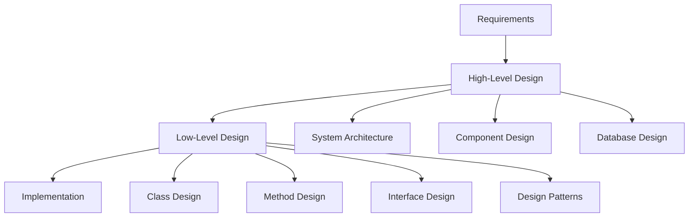
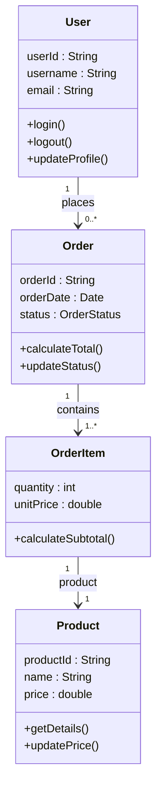
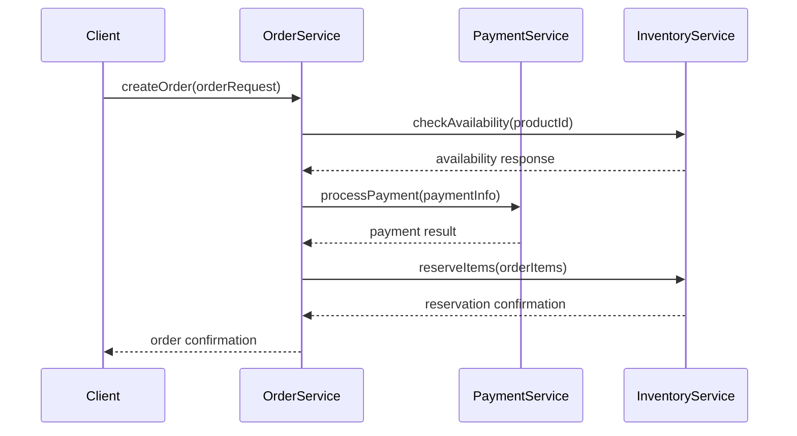
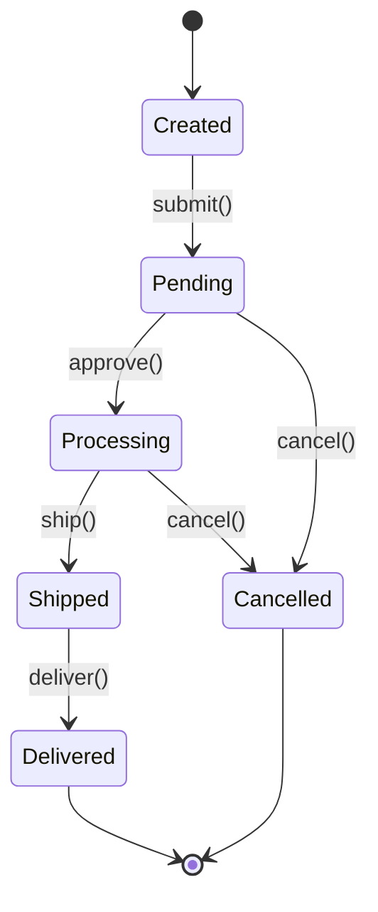
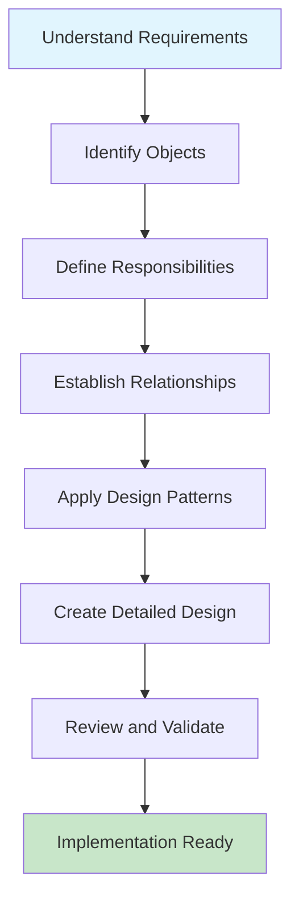

🧑‍💻 **Author:** RK ROY

# What is Low-Level Design (LLD)?

## 🎯 Overview

- **Low-Level Design (LLD)** is the process of designing the internal components of a software system. It focuses on the detailed design of individual classes, interfaces, methods, and their interactions to implement the requirements specified in the High-Level Design.
- **Low-Level Design (LLD)** is the process of translating abstract ideas into concrete implementation
- It’s where you translate **High-Level Design (HLD)** into detailed class diagrams, interfaces, object relationships, and design patterns.

## 🏗️ High-Level vs Low-Level Design



> ### High-Level Design (HLD)

- **Focus**: System architecture and major components
- **Scope**: Overall system structure
- **Audience**: Architects, stakeholders, project managers
- **Examples**:
    - Microservices architecture
    - Database selection
    - Technology stack decisions
    - System integration points

> ### Low-Level Design (LLD)

- **Focus**: Detailed implementation of components
- **Scope**: Classes, methods, and their relationships
- **Audience**: Developers, implementers
- **Examples**:
    - Class diagrams with methods and attributes
    - Sequence diagrams for interactions
    - Design patterns implementation
    - Data structures and algorithms

## 🎨 Key Components of LLD (read oop first, you will find it in the same repo)

> ### 1. Classes and Objects

```java
// Example: User class design
public class User {
    private String userId;
    private String username;
    private String email;
    private UserRole role;

    public User(String userId, String username, String email, UserRole role) {
        this.userId = userId;
        this.username = username;
        this.email = email;
        this.role = role;
    }

    public boolean hasPermission(Permission permission) {
        return role.hasPermission(permission);
    }

    public void updateProfile(String newEmail) {
        if (isValidEmail(newEmail)) {
            this.email = newEmail;
        }
    }

    private boolean isValidEmail(String email) {
        // Email validation logic
        return email.contains("@") && email.contains(".");
    }
}
```

> ### 2. Interfaces and Abstractions

```java
// Interface defining contract
public interface PaymentProcessor {
    PaymentResult processPayment(PaymentRequest request);
    boolean refundPayment(String transactionId);
    PaymentStatus getPaymentStatus(String transactionId);
}

// Concrete implementation
public class CreditCardProcessor implements PaymentProcessor {
    @Override
    public PaymentResult processPayment(PaymentRequest request) {
        // Credit card specific processing logic
        return new PaymentResult(true, "Transaction successful");
    }

    @Override
    public boolean refundPayment(String transactionId) {
        // Refund logic
        return true;
    }

    @Override
    public PaymentStatus getPaymentStatus(String transactionId) {
        // Status check logic
        return PaymentStatus.COMPLETED;
    }
}
```

> ### 3. Class Relationships

<div align = "center">



</div>

## 🛠️ LLD Artifacts

> ### 1. Class Diagrams

Show the static structure of classes and their relationships.

> ### 2. Sequence Diagrams

Illustrate how objects interact over time.



> ### 3. State Diagrams

Show the different states an object can be in.

<div align = "center">



</div>

## 🎯 Why is LLD Important?

> ### 1. **Code Quality**

- Ensures clean, maintainable code
- Reduces technical debt
- Improves readability

> ### 2. **Team Communication**

- Clear documentation for developers
- Consistent understanding across team
- Easier knowledge transfer

> ### 3. **Risk Mitigation**

- Identifies potential issues early
- Reduces implementation bugs
- Facilitates code reviews

> ### 4. **Scalability**

- Designs systems that can grow
- Identifies bottlenecks early
- Plans for future requirements

> ### 5. **Maintainability**

- A well-designed system is easy to read, debug, and extend. When components have clear responsibilities and clean interfaces, you can make changes without fear of breaking unrelated parts of the system.

> ### 6. **Reusability**

- When you design modules with well-thought-out responsibilities and abstractions, those modules can often be reused in different parts of your codebase or even across projects.

## 🚀 LLD Process Overview

<div align = "center">



</div>

> ### Step-by-Step Process

1. **Analyze Requirements**: Understand what needs to be built
2. **Identify Entities**: Find the main objects/classes
3. **Define Responsibilities**: Determine what each class should do
4. **Establish Relationships**: How classes interact
5. **Apply Patterns**: Use proven design solutions
6. **Detail the Design**: Methods, attributes, interfaces
7. **Validate**: Review with stakeholders and team

## 🔍 Real-World Example: E-commerce Cart System

Let's see how LLD applies to a shopping cart:

> ### Requirements

- Users can add/remove items from cart
- Calculate total with taxes and discounts
- Support different payment methods
- Handle inventory management

> ### LLD Approach

```java
// Main entities identified
public class ShoppingCart {
    private String cartId;
    private String userId;
    private List<CartItem> items;
    private DiscountStrategy discountStrategy;

    public void addItem(Product product, int quantity) {
        CartItem existingItem = findItem(product.getId());
        if (existingItem != null) {
            existingItem.updateQuantity(existingItem.getQuantity() + quantity);
        } else {
            items.add(new CartItem(product, quantity));
        }
    }

    public void removeItem(String productId) {
        items.removeIf(item -> item.getProduct().getId().equals(productId));
    }

    public double calculateTotal() {
        double subtotal = items.stream()
            .mapToDouble(CartItem::getSubtotal)
            .sum();

        return discountStrategy.applyDiscount(subtotal);
    }
}

public class CartItem {
    private Product product;
    private int quantity;

    public double getSubtotal() {
        return product.getPrice() * quantity;
    }
}

// Strategy pattern for discounts
public interface DiscountStrategy {
    double applyDiscount(double amount);
}

public class PercentageDiscount implements DiscountStrategy {
    private double percentage;

    @Override
    public double applyDiscount(double amount) {
        return amount * (1 - percentage / 100);
    }
}
```

## 📚 Key Principles in LLD

### 1. **Single Responsibility Principle**

Each class should have only one reason to change.

### 2. **Open/Closed Principle**

Classes should be open for extension but closed for modification.

### 3. **Encapsulation**

Hide internal details and expose only necessary interfaces.

### 4. **Loose Coupling**

Classes should have minimal dependencies on each other.

### 5. **High Cohesion**

Related functionalities should be grouped together.

## 🎯 Best Practices

### ✅ DO

- Start with simple designs and evolve
- Use meaningful names for classes and methods
- Keep methods small and focused
- Document complex logic
- Consider future extensibility

### ❌ DON'T

- Over-engineer solutions
- Create god classes (classes that do everything)
- Ignore error handling
- Skip validation and testing considerations
- Design in isolation without team input

## 🔗 What's Next?

Now that you understand what LLD is, let's explore the fundamental design principles that guide good software design.

---

## 📖 Summary

Low-Level Design is about creating detailed blueprints for software implementation. It bridges the gap between high-level architecture and actual code, ensuring that systems are:

- **Well-structured**: Clear organization of classes and components
- **Maintainable**: Easy to modify and extend
- **Testable**: Designed with testing in mind
- **Scalable**: Can handle growth and change
- **Robust**: Handles edge cases and errors gracefully

The key is to think through the details before coding, apply proven principles and patterns, and create designs that teams can understand and implement successfully.

---
