# Todo --> fix the diagrams

# UML Basics - Visual Modeling for System Design

## 🎯 Overview

**UML (Unified Modeling Language)** is a standardized visual modeling language used to specify, visualize, construct, and document software systems. It provides a common vocabulary and set of notations for creating diagrams that represent different aspects of a system.

## 🎨 Why UML Matters in LLD

- **Visual Communication**: Clear representation of system structure and behavior
- **Design Documentation**: Permanent record of design decisions
- **Team Collaboration**: Common language for developers, architects, and stakeholders
- **Problem Identification**: Spot design issues before implementation
- **Code Generation**: Some tools can generate code from UML diagrams

## 📚 Types of UML Diagrams

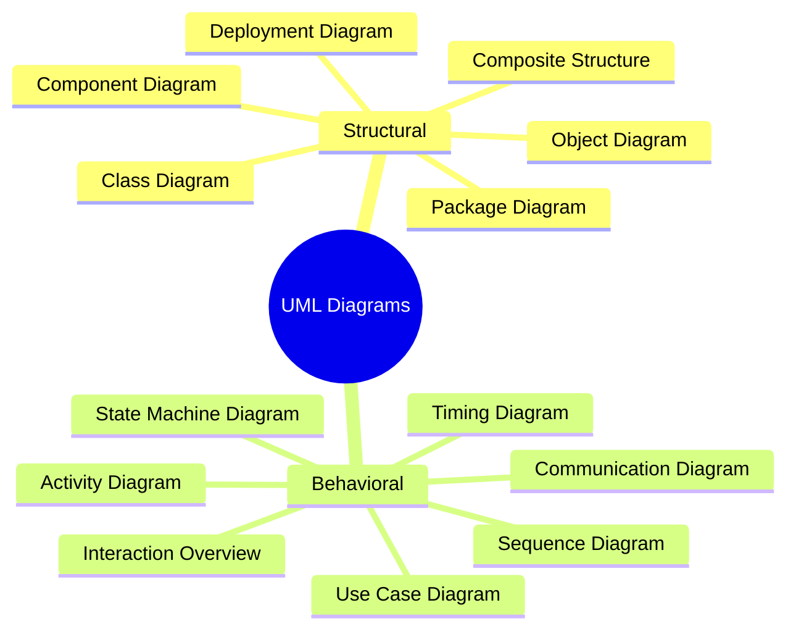
```mermaid
%%{init: {'theme': 'default'}}%%
mindmap
  root((UML Diagrams))
    Structural
      Class Diagram
      Object Diagram
      Component Diagram
      Deployment Diagram
      Package Diagram
      Composite Structure
    Behavioral
      Use Case Diagram
      Activity Diagram
      State Machine Diagram
      Sequence Diagram
      Communication Diagram
      Timing Diagram
      Interaction Overview
```

## 🏗️ Structural Diagrams

> ### 1. Class Diagram

**Most important for LLD** - Shows classes, their attributes, methods, and relationships.

#### Class Diagram Elements

| Symbol          | Meaning        | Example                  |
| --------------- | -------------- | ------------------------ |
| `+`             | Public         | `+play()`                |
| `-`             | Private        | `-city: int`             |
| `#`             | Protected      | `#specialMeow()`         |
| `~`             | Package        | `~helper()`              |
| `{abstract}`    | Abstract class | `{abstract} Vehicle`     |
| `<<interface>>` | Interface      | `<<interface>> Drawable` |
| `{static}`      | Static member  | `{static} counter: int`  |

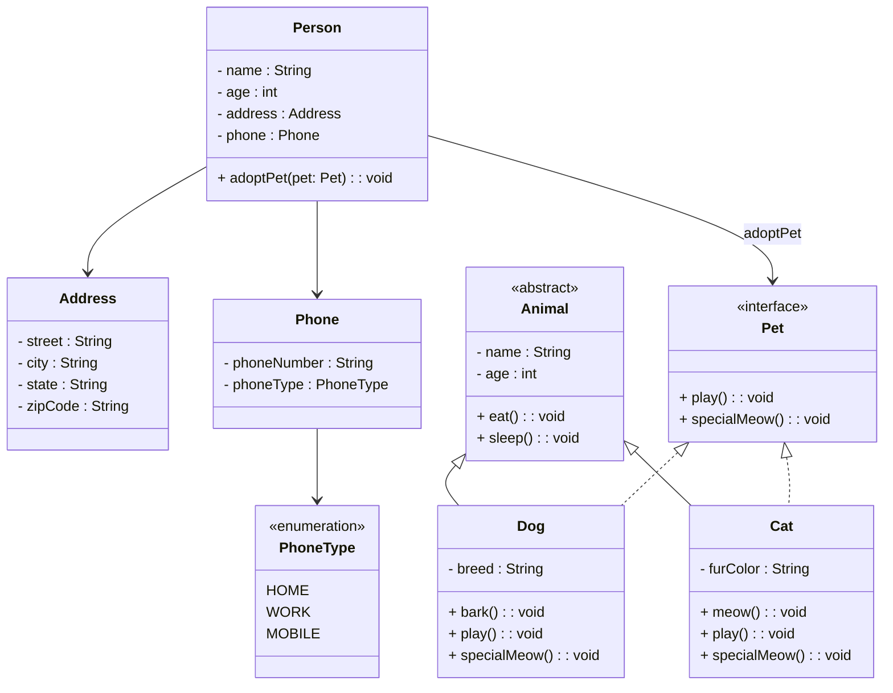
```mermaid
%%{init: {'theme': 'default'}}%%
classDiagram
    class Person {
        - name : String
        - age : int
        - address : Address
        - phone : Phone
        + adoptPet(pet: Pet) : void
    }

    class Address {
        - street : String
        - city : String
        - state : String
        - zipCode : String
    }

    class Phone {
        - phoneNumber : String
        - phoneType : PhoneType
    }

    class PhoneType {
        <<enumeration>>
        HOME
        WORK
        MOBILE
    }

    class Pet {
        <<interface>>
        + play() : void
        + specialMeow() : void
    }

    class Animal {
        <<abstract>>
        - name : String
        - age : int
        + eat() : void
        + sleep() : void
    }

    class Dog {
        - breed : String
        + bark() : void
        + play() : void
        + specialMeow() : void
    }

    class Cat {
        - furColor : String
        + meow() : void
        + play() : void
        + specialMeow() : void
    }

    %% Relationships
    Person --> Address
    Person --> Phone
    Phone --> PhoneType

    Person --> Pet : adoptPet

    Animal <|-- Dog
    Animal <|-- Cat
    Pet <|.. Dog
    Pet <|.. Cat
```

- The relationships between the classes are as follows:
    - Inheritance: `Dog` and `Cat` inherit from `Animal`.
    - Realization/Implementation: `Dog` and `Cat` implement the `Pet` interface.
    - Aggregation: `Person` has an aggregation relationship with `Pet`, indicating that a person can have multiple pets.
    - Composition:`Person` has a composition relationship with `Address`, indicating that an address cannot exist without a person.
    - Association: `Person` has an association relationship with `Phone`, indicating that a person can have multiple phone numbers.
      Dependency: `Phone` depends on the `PhoneType` enumeration for the `phoneType` attribute.

> ### 2. Object Diagram

- Shows instances of classes at a specific moment in time.

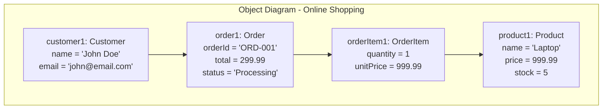
```mermaid
%%{init: {'theme': 'default'}}%%
graph TD
    subgraph "Object Diagram - Online Shopping"
        A["customer1: Customer<br/>name = 'John Doe'<br/>email = 'john@email.com'"]
        B["order1: Order<br/>orderId = 'ORD-001'<br/>total = 299.99<br/>status = 'Processing'"]
        C["product1: Product<br/>name = 'Laptop'<br/>price = 999.99<br/>stock = 5"]
        D["orderItem1: OrderItem<br/>quantity = 1<br/>unitPrice = 999.99"]

        A --> B
        B --> D
        D --> C
    end
```

> ### 3. Component Diagram

Shows how components are organized and their dependencies.

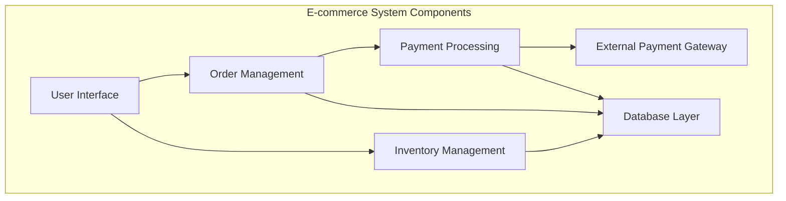
```mermaid
%%{init: {'theme': 'default'}}%%
graph TD
    subgraph "E-commerce System Components"
        A[User Interface]
        B[Order Management]
        C[Payment Processing]
        D[Inventory Management]
        E[Database Layer]
        F[External Payment Gateway]

        A --> B
        A --> D
        B --> C
        B --> E
        C --> F
        C --> E
        D --> E
    end
```

## 🎭 Behavioral Diagrams

> ### 1. Use Case Diagram

- Shows system functionality from user's perspective.
- A Use Case Diagram is a visual representation of how different users (also called actors) interact with a system.
- It’s like a bird’s-eye view of the system’s functionality without getting into any code.
- It answers **"What can users do with this system?"**

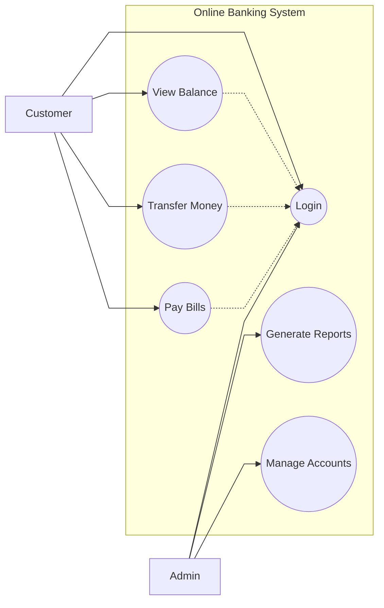
```mermaid
%%{init: {'theme': 'default', 'flowchart': {'curve': 'linear'}}}%%
flowchart LR
  %% actors (outside the system boundary)
  Customer[Customer]
  Admin[Admin]

  %% system boundary (subgraph) with use cases as ovals
  subgraph Online_Banking_System["Online Banking System"]
    direction TB
    UC1((Login))
    UC2((View Balance))
    UC3((Transfer Money))
    UC4((Pay Bills))
    UC5((Generate Reports))
    UC6((Manage Accounts))
  end

  %% actor -> use case links
  Customer --> UC1
  Customer --> UC2
  Customer --> UC3
  Customer --> UC4

  Admin --> UC1
  Admin --> UC5
  Admin --> UC6

  %% indicate "includes" (dotted arrows) — visually similar to UML <<include>>
  UC2 -.-> UC1
  UC3 -.-> UC1
  UC4 -.-> UC1

```

> ### 2. Sequence Diagram

- Shows how objects interact over time.
- A sequence diagram is a type of UML (Unified Modeling Language) diagram that shows how objects in a system interact with each other, step by step.
- It focuses on the order of messages exchanged between different components or actors to achieve a particular task or use case.
- **"Who is doint what and when ? "**
- A **Sequence Diagram** in UML is used to represent the flow of messages between different objects or components over time.
- It shows **how objects interact** through different types of **messages**.

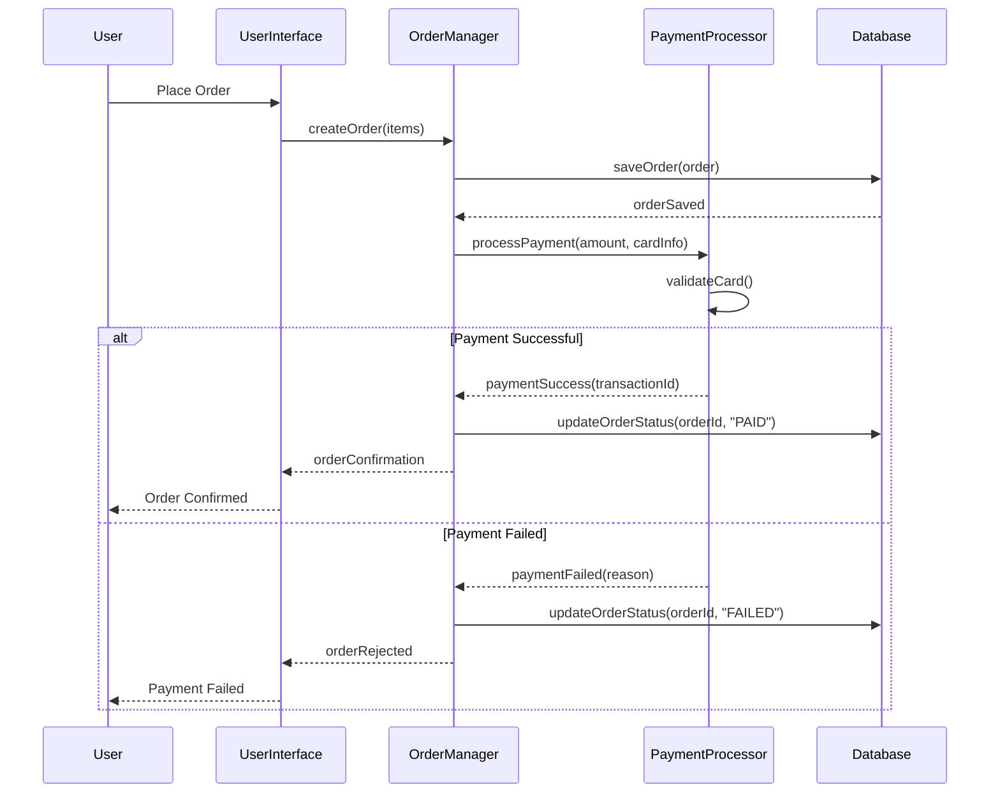
```mermaid
%%{init: {'theme': 'default'}}%%
sequenceDiagram
    participant U as User
    participant UI as UserInterface
    participant OM as OrderManager
    participant PP as PaymentProcessor
    participant DB as Database

    U->>UI: Place Order
    UI->>OM: createOrder(items)

    OM->>DB: saveOrder(order)
    DB-->>OM: orderSaved

    OM->>PP: processPayment(amount, cardInfo)
    PP->>PP: validateCard()

    alt Payment Successful
        PP-->>OM: paymentSuccess(transactionId)
        OM->>DB: updateOrderStatus(orderId, "PAID")
        OM-->>UI: orderConfirmation
        UI-->>U: Order Confirmed
    else Payment Failed
        PP-->>OM: paymentFailed(reason)
        OM->>DB: updateOrderStatus(orderId, "FAILED")
        OM-->>UI: orderRejected
        UI-->>U: Payment Failed
    end
```

### 🌏 Types of Messages in Sequence Diagrams :

A message represents a communication between lifelines (objects/actors). Below are the commonly used UML message types with concise explanations and Mermaid examples.

1. Synchronous Message (Call)

- Meaning: Sender waits for the receiver to finish (blocking call).
- Notation: Solid line with a filled arrowhead to the receiver, often followed by a reply.
- Mermaid: Use `->>` for call and `-->>` for reply. You can show activation with `activate`/`deactivate`.

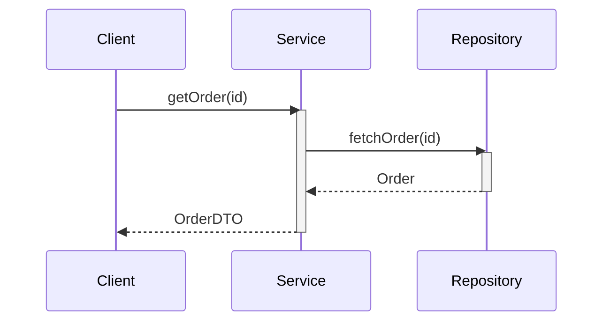
```mermaid
%%{init: {'theme': 'default'}}%%
sequenceDiagram
    participant C as Client
    participant S as Service
    participant R as Repository

    C->>S: getOrder(id)
    activate S
    S->>R: fetchOrder(id)
    activate R
    R-->>S: Order
    deactivate R
    S-->>C: OrderDTO
    deactivate S
```

2. Asynchronous Message (Signal)

- Meaning: Sender does not wait (non-blocking); control returns immediately.
- Notation: In UML, an open arrow. In Mermaid, use `-)` for async messages.

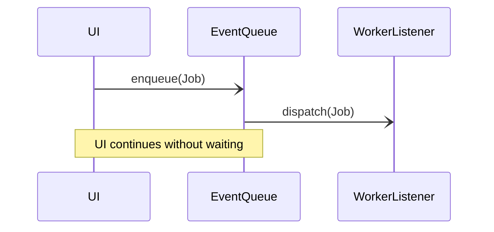
```mermaid
%%{init: {'theme': 'default'}}%%
sequenceDiagram
    participant UI as UI
    participant Q as EventQueue
    participant WL as WorkerListener

    UI-)Q: enqueue(Job)
    Q-)WL: dispatch(Job)
    Note over UI,Q: UI continues without waiting
```

3. Reply / Return Message

- Meaning: Response to a previous call.
- Notation: Dashed line back to the caller.
- Mermaid: `-->>` from callee to caller.

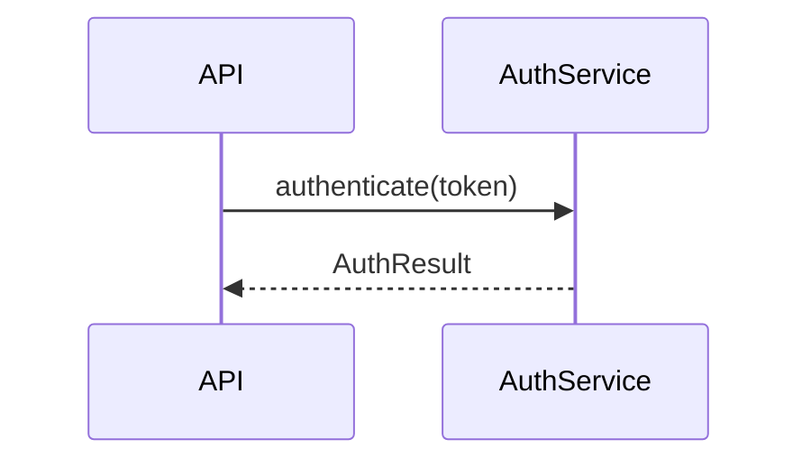
```mermaid
%%{init: {'theme': 'default'}}%%
sequenceDiagram
    participant A as API
    participant Auth as AuthService

    A->>Auth: authenticate(token)
    Auth-->>A: AuthResult
```

4. Create Message

- Meaning: Creates a new lifeline instance.
- Notation: Arrow to the created lifeline’s head; the lifeline starts at that point.
- Mermaid: Use `create participant` before the first message to it.

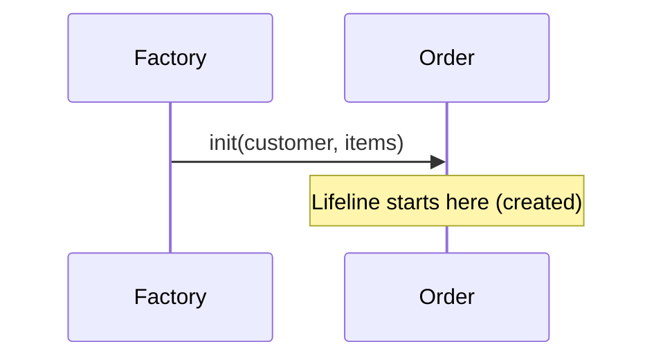
```mermaid
%%{init: {'theme': 'default'}}%%
sequenceDiagram
    participant F as Factory
    participant O as Order
    F->>O: init(customer, items)
    Note over O: Lifeline starts here (created)
```

5. Destroy (Delete) Message

- Meaning: Terminates a lifeline.
- Notation: Message to an X at the end of the lifeline; no further messages after.
- Mermaid: Use `destroy participant` (and optionally `--x` arrow for emphasis).

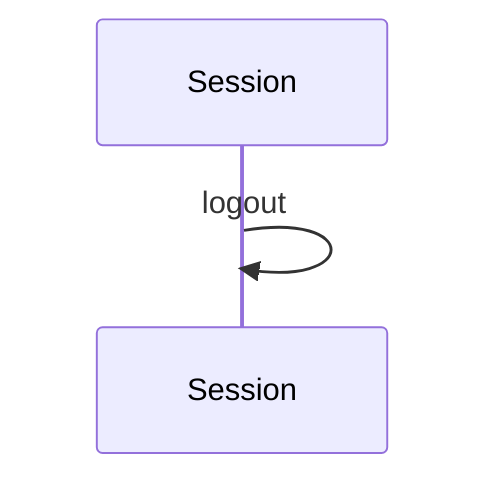
```mermaid

%%{init: {'theme': 'default'}}%%
sequenceDiagram
    participant Session

    Session ->> Session: logout
    destroy Session
```

6. Self Message (Recursive/Internal Call)

- Meaning: An object sends a message to itself.
- Notation: A U-shaped arrow back to the same lifeline.
- Mermaid: Use `A->>A`.

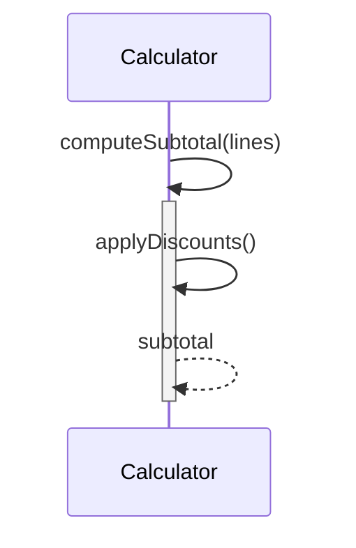
```mermaid
%%{init: {'theme': 'default'}}%%
sequenceDiagram
    participant Calc as Calculator

    Calc->>Calc: computeSubtotal(lines)
    activate Calc
    Calc->>Calc: applyDiscounts()
    Calc-->>Calc: subtotal
    deactivate Calc
```

7. Found Message

- Meaning: Message with unknown sender (arrives from outside the system boundary).
- Notation: Arrow originating from a filled circle to a lifeline (conceptual in UML).
- Mermaid: Not directly supported; approximate by using a dedicated External participant.

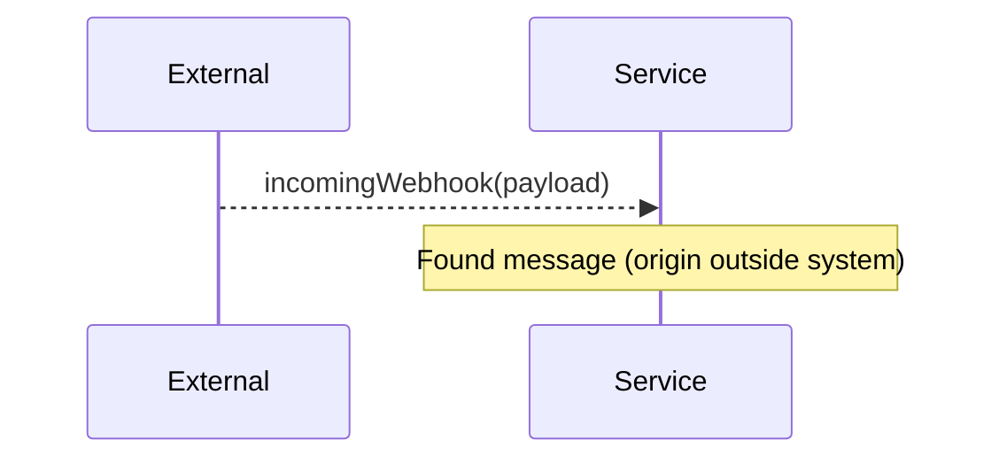
```mermaid
%%{init: {'theme': 'default'}}%%
sequenceDiagram
    participant Ext as External
    participant S as Service

    Ext-->>S: incomingWebhook(payload)
    Note over S: Found message (origin outside system)
```

8. Lost Message

- Meaning: Message whose receiver is unknown or not modeled.
- Notation: Arrow to a filled circle at the edge (conceptual in UML).
- Mermaid: Not directly supported; approximate by sending to a placeholder participant.

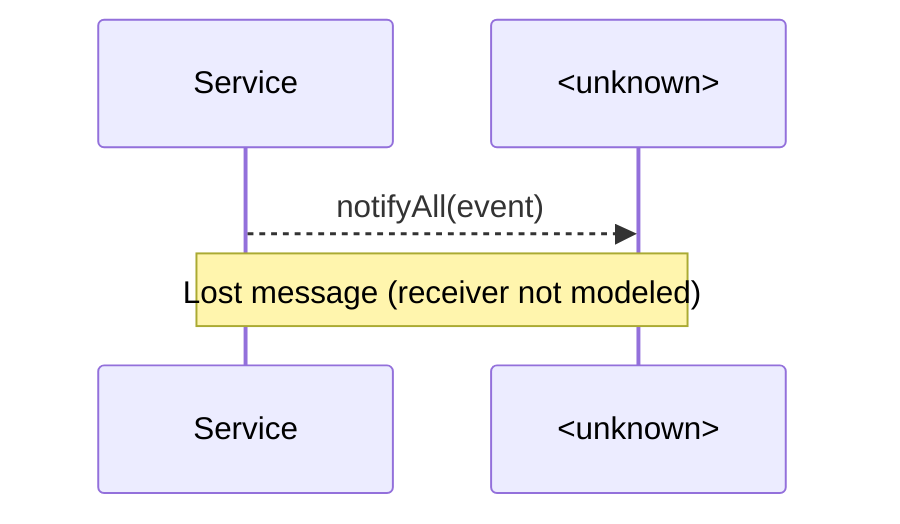
```mermaid
%%{init: {'theme': 'default'}}%%
sequenceDiagram
    participant S as Service
    participant Unknown as <unknown>

    S-->>Unknown: notifyAll(event)
    Note over S,Unknown: Lost message (receiver not modeled)
```

> Notes

- Guarded/conditional flows (alt/opt), loops, and parallel blocks are interaction fragments, not message types, though they commonly wrap messages.
- Activation bars represent time the receiver is active/processing; helpful but optional.

> ### 3. Activity Diagram

- Shows workflow and business processes.

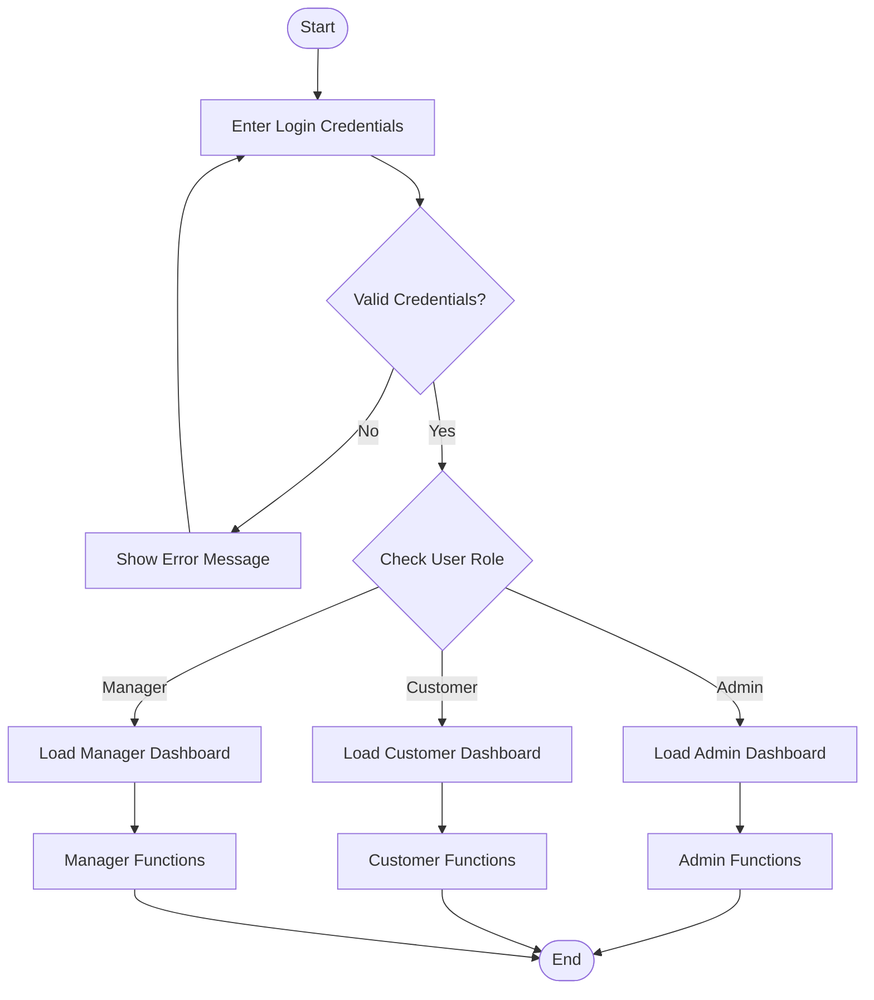
```mermaid
%%{init: {'theme': 'default'}}%%
flowchart TD
    Start([Start]) --> Input[Enter Login Credentials]
    Input --> Validate{Valid Credentials?}

    Validate -->|No| Error[Show Error Message]
    Error --> Input

    Validate -->|Yes| CheckRole{Check User Role}

    CheckRole -->|Admin| AdminDash[Load Admin Dashboard]
    CheckRole -->|Customer| CustomerDash[Load Customer Dashboard]
    CheckRole -->|Manager| ManagerDash[Load Manager Dashboard]

    AdminDash --> AdminActions[Admin Functions]
    CustomerDash --> CustomerActions[Customer Functions]
    ManagerDash --> ManagerActions[Manager Functions]

    AdminActions --> End([End])
    CustomerActions --> End
    ManagerActions --> End
```

> ### 4. State Machine Diagram

- Shows states of an object and transitions between states.

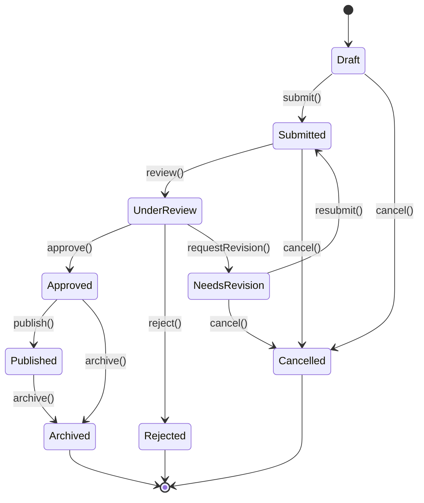
```mermaid
%%{init: {'theme': 'default'}}%%
stateDiagram-v2
    [*] --> Draft
    Draft --> Submitted : submit()
    Draft --> Cancelled : cancel()

    Submitted --> UnderReview : review()
    Submitted --> Cancelled : cancel()

    UnderReview --> Approved : approve()
    UnderReview --> Rejected : reject()
    UnderReview --> NeedsRevision : requestRevision()

    NeedsRevision --> Submitted : resubmit()
    NeedsRevision --> Cancelled : cancel()

    Approved --> Published : publish()
    Approved --> Archived : archive()

    Rejected --> [*]
    Cancelled --> [*]
    Published --> Archived : archive()
    Archived --> [*]
```

## 🔗 Relationships in UML

> ### 1. Association (Simple Association)

- General relationship between classes.
- Association represents a "uses-a" relationship between two classes where one class uses or interacts with the other.
- Example : A `Car` has a`Driver`. Car class uses, or references `Driver` class.

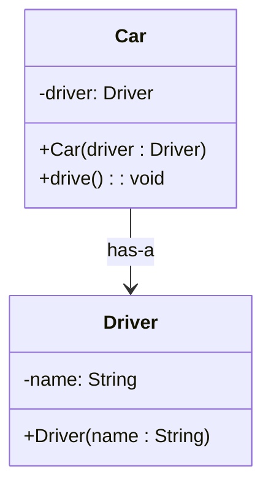
```mermaid
%%{init: {'theme': 'default'}}%%
classDiagram
    class Car {
        -driver: Driver
        +Car(driver : Driver)
        +drive(): void
    }

    class Driver {
        -name: String
        +Driver(name : String)
    }

    Car --> Driver : has-a
```

> ### 2. Aggregation (Has-a)

- "Part-of" relationship where parts can exist independently.
- Aggregation represents a "has-a" relationship where one class (the whole) contains another class (the part), but the contained class can exist independently.
- Example: A `Car` class has an `Engine` class but the Engine class can exist without the Car class.

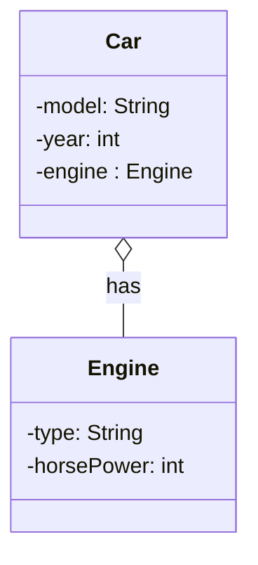
```mermaid
%%{init: {'theme': 'default'}}%%
classDiagram
    class Car {
        -model: String
        -year: int
        -engine : Engine
    }
    class Engine {
        -type: String
        -horsePower: int
    }

    Car o-- Engine : has
```

> ### 3. Composition (Part-of)

- Strong ownership where parts cannot exist without the whole.
- Composition represents a strong "has-a" relationship where the part cannot exist without the whole. If the whole is destroyed, the parts are also destroyed.

- Example: A `House` class is composed of `Room` class but the Room class can not exist without the House class.

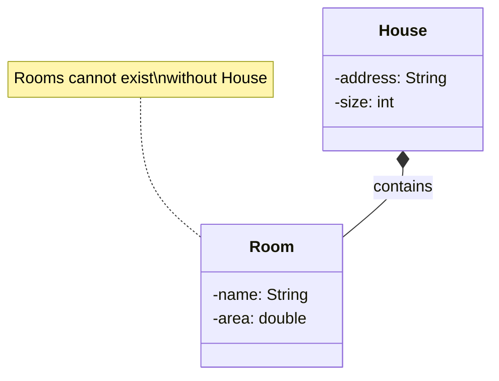
```mermaid
%%{init: {'theme': 'default'}}%%
classDiagram
    class House {
        -address: String
        -size: int
    }

    class Room {
        -name: String
        -area: double
    }

    House *-- Room : contains

    note for Room "Rooms cannot exist\nwithout House"
```

> ### 4. Inheritance (Is-a)

- Generalization/specialization relationship.
- Inheritance (or Generalization) represents an "is-a" relationship where one class (subclass) inherits the attributes and methods of another class (superclass).
- Example: A `Dog` class and a `Cat` class inherit from an `Animal` class, as both dogs and cats are animals.

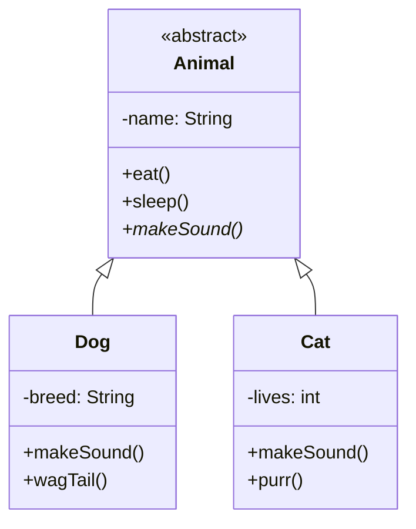
```mermaid
%%{init: {'theme': 'default'}}%%
classDiagram
    class Animal {
        <<abstract>>
        -name: String
        +eat()
        +sleep()
        +makeSound()*
    }

    class Dog {
        -breed: String
        +makeSound()
        +wagTail()
    }

    class Cat {
        -lives: int
        +makeSound()
        +purr()
    }

    Animal <|-- Dog
    Animal <|-- Cat
```

> ### 5. Realization/Implementation

- Implementation of interface by a class.
- Realization or implementation represents a relationship between a class and an interface, where the class implements the methods declared in the interface.
- Example: A `Rectangle` class and a `Circle` class implement the `Shape` interface, which declares a getArea() method.

```mermaid
%%{init: {'theme': 'default'}}%%
classDiagram
    class Drawable {
        <<interface>>
        +draw()
        +move(x, y)
    }

    class Circle {
        -radius: double
        +draw()
        +move(x, y)
        +calculateArea()
    }

    class Rectangle {
        -width: double
        -height: double
        +draw()
        +move(x, y)
        +calculateArea()
    }

    Drawable <|.. Circle
    Drawable <|.. Rectangle
```

> ### 6. Dependency

- One class uses another class.
- Dependency represents a "uses" relationship where a change in one class (the supplier) may affect the other class (the client).
- Example: A `Customer` class uses an `Order` class to place order.

```mermaid
%%{init: {'theme': 'default'}}%%
classDiagram
    class OrderProcessor {
        +processOrder(order)
    }

    class EmailService {
        +sendEmail(recipient, message)
    }

    class Order {
        -orderId: String
        -amount: double
    }

    OrderProcessor ..> EmailService : uses
    OrderProcessor ..> Order : uses
```

## 📊 Multiplicity Indicators

| Notation      | Meaning         |
| ------------- | --------------- |
| `1`           | Exactly one     |
| `0..1`        | Zero or one     |
| `*` or `0..*` | Zero or more    |
| `1..*`        | One or more     |
| `2..5`        | Between 2 and 5 |
| `3`           | Exactly 3       |

### Example with Multiplicity

```mermaid
%%{init: {'theme': 'default'}}%%
classDiagram
    class Library {
        - name : String
        - address : String
    }

    class Book {
        - isbn : String
        - title : String
        - author : String
    }

    class Member {
        - memberId : String
        - name : String
    }

    class Loan {
        - loanDate : Date
        - dueDate : Date
        - returned : boolean
    }

    Library "1" o-- "*" Book : contains
    Member "1" o-- "*" Loan : has
    Book "1" o-- "*" Loan : involved_in

    note for Library "One library has\nmany books"
    note for Member "One member can have\nmultiple loans"
```

## 🛠️ Practical UML Example: Order Management System

Let's design a complete order management system using various UML diagrams.

### Class Diagram

    
```mermaid
%%{init: {'theme': 'default'}}%%
classDiagram
    class Customer {
        - customerId : String
        - name : String
        - email : String
        - address : Address
        + placeOrder(items)
        + getOrderHistory()
        + updateProfile()
    }

    class Order {
        - orderId : String
        - orderDate : Date
        - status : OrderStatus
        - totalAmount : double
        + addItem(product, quantity)
        + removeItem(productId)
        + calculateTotal()
        + updateStatus(status)
    }

    class OrderItem {
        - quantity : int
        - unitPrice : double
        + getSubtotal()
        + updateQuantity(quantity)
    }

    class Product {
        - productId : String
        - name : String
        - price : double
        - stockQuantity : int
        + updatePrice(price)
        + updateStock(quantity)
        + isAvailable()
    }

    class Address {
        - street : String
        - city : String
        - zipCode : String
        - country : String
        + getFullAddress()
    }

    class Payment {
        - paymentId : String
        - amount : double
        - paymentDate : Date
        - method : PaymentMethod
        + processPayment()
        + refund()
    }

    class OrderStatus {
        <<enumeration>>
        PENDING
        CONFIRMED
        SHIPPED
        DELIVERED
        CANCELLED
    }

    class PaymentMethod {
        <<enumeration>>
        CREDIT_CARD
        DEBIT_CARD
        PAYPAL
        CASH
    }

    Customer "1" o-- "*" Order : places
    Customer "1" --> "1" Address : has
    Order "1" o-- "*" OrderItem : contains
    Order "1" --> "1" Payment : has
    OrderItem "*" o-- "1" Product : refers_to
    Order --> OrderStatus
    Payment --> PaymentMethod

````

</div>

> ### Sequence Diagram: Order Processing

```mermaid
sequenceDiagram
    participant C as Customer
    participant UI as OrderUI
    participant OS as OrderService
    participant PS as ProductService
    participant PP as PaymentProcessor
    participant IS as InventoryService
    participant NS as NotificationService

    C->>UI: Select Products & Place Order
    UI->>OS: createOrder(customerId, items)

    loop For each item
        OS->>PS: checkProductAvailability(productId)
        PS->>IS: getStock(productId)
        IS-->>PS: stockLevel
        PS-->>OS: availabilityStatus
    end

    OS->>OS: calculateOrderTotal()
    OS-->>UI: orderCreated(orderId, total)

    UI->>PP: processPayment(orderId, paymentInfo)
    PP->>PP: validatePaymentInfo()
    PP->>PP: chargeAmount()

    alt Payment Successful
        PP-->>OS: paymentSuccess(transactionId)
        OS->>IS: reserveItems(orderItems)
        OS->>OS: updateOrderStatus(CONFIRMED)
        OS->>NS: sendOrderConfirmation(customerId, orderId)
        OS-->>UI: orderConfirmed
        UI-->>C: Order Confirmation
    else Payment Failed
        PP-->>OS: paymentFailed(reason)
        OS->>OS: updateOrderStatus(CANCELLED)
        OS-->>UI: paymentError(reason)
        UI-->>C: Payment Failed
    end
````

> ### State Diagram: Order Lifecycle

```mermaid
stateDiagram-v2
    [*] --> Cart : Add Items
    Cart --> Cart : Add/Remove Items
    Cart --> OrderPlaced : Place Order

    OrderPlaced --> PaymentPending : Initiate Payment
    PaymentPending --> PaymentCompleted : Payment Success
    PaymentPending --> PaymentFailed : Payment Failure

    PaymentFailed --> OrderCancelled : Auto Cancel
    PaymentCompleted --> OrderConfirmed : Confirm Order

    OrderConfirmed --> InTransit : Ship Order
    InTransit --> Delivered : Delivery Complete

    OrderConfirmed --> OrderCancelled : Customer Cancel
    InTransit --> OrderCancelled : Return/Cancel

    Delivered --> [*]
    OrderCancelled --> [*]

    note right of PaymentPending : Timeout after 15 minutes
    note right of OrderConfirmed : Can cancel within 24 hours
```

## 🎯 Best Practices for UML

> ### ✅ DO

1. **Keep it Simple**: Don't over-complicate diagrams
2. **Focus on Key Relationships**: Show the most important relationships
3. **Use Appropriate Diagrams**: Choose the right diagram type for your purpose
4. **Consistent Naming**: Use clear, consistent naming conventions
5. **Add Notes**: Include explanatory notes for complex parts
6. **Version Control**: Keep diagrams updated with code changes

> ### ❌ DON'T

1. **Don't Show Everything**: Avoid cluttered diagrams with every detail
2. **Don't Skip Relationships**: Missing relationships can confuse readers
3. **Don't Use Wrong Notations**: Stick to standard UML notation
4. **Don't Create Outdated Diagrams**: Keep diagrams synchronized with code
5. **Don't Ignore Your Audience**: Create diagrams appropriate for your audience

## 🔧 Tools for UML

> ### Free Tools

- **Draw.io (now diagrams.net)**: Web-based, simple to use
- **PlantUML**: Text-based UML diagrams
- **Mermaid**: Markdown-based diagrams (used in this guide)
- **UMLet**: Simple UML tool
- **ArgoUML**: Open source UML modeling tool

> ### Commercial Tools

- **Lucidchart**: Professional diagramming
- **Visual Paradigm**: Comprehensive UML suite
- **Enterprise Architect**: Advanced modeling tool
- **MagicDraw**: Professional UML tool
- **Visio**: Microsoft's diagramming tool

## 📚 UML in Different Phases

> ### 1. Requirements Analysis

- **Use Case Diagrams**: Capture functional requirements
- **Activity Diagrams**: Model business processes

> ### 2. System Design

- **Class Diagrams**: Define system structure
- **Component Diagrams**: Show system architecture
- **Sequence Diagrams**: Design interactions

> ### 3. Implementation

- **Class Diagrams**: Code structure reference
- **Object Diagrams**: Runtime instances

> ### 4. Testing

- **State Diagrams**: Test state transitions
- **Sequence Diagrams**: Test interaction scenarios

## 🎓 Practice Exercises

> ### Exercise 1: Library Management System

Create UML diagrams for a library system with:

- Books, Members, Loans
- Borrowing and returning processes
- Late fee calculations

> ### Exercise 2: ATM System

Design UML diagrams for an ATM system including:

- User authentication
- Account operations (withdraw, deposit, balance inquiry)
- Transaction processing

> ### Exercise 3: Restaurant Ordering System

Model a restaurant ordering system with:

- Menu management
- Order taking process
- Payment processing
- Kitchen workflow

## 📝 Summary

UML provides a powerful visual language for software design that:

- **Standardizes Communication**: Common vocabulary for development teams
- **Documents Design Decisions**: Permanent record of system structure
- **Identifies Problems Early**: Visual representation helps spot issues
- **Facilitates Planning**: Clear roadmap for implementation
- **Supports Maintenance**: Understanding existing systems

Key takeaways:

- Use appropriate diagram types for different purposes
- Focus on clarity and simplicity
- Keep diagrams updated with code changes
- Choose the right level of detail for your audience
- Use standard UML notation consistently

Remember: UML is a tool to help you design better systems, not an end in itself. Use it when it adds value to your development process!

---
