# UML Basics - Visual Modeling for System Design

## 🎯 Overview

**UML (Unified Modeling Language)** is a standardized visual modeling language used to specify, visualize, construct, and document software systems. It provides a common vocabulary and set of notations for creating diagrams that represent different aspects of a system.

## 🎨 Why UML Matters in LLD

- **Visual Communication**: Clear representation of system structure and behavior
- **Design Documentation**: Permanent record of design decisions
- **Team Collaboration**: Common language for developers, architects, and stakeholders
- **Problem Identification**: Spot design issues before implementation
- **Code Generation**: Some tools can generate code from UML diagrams

## 📚 Types of UML Diagrams

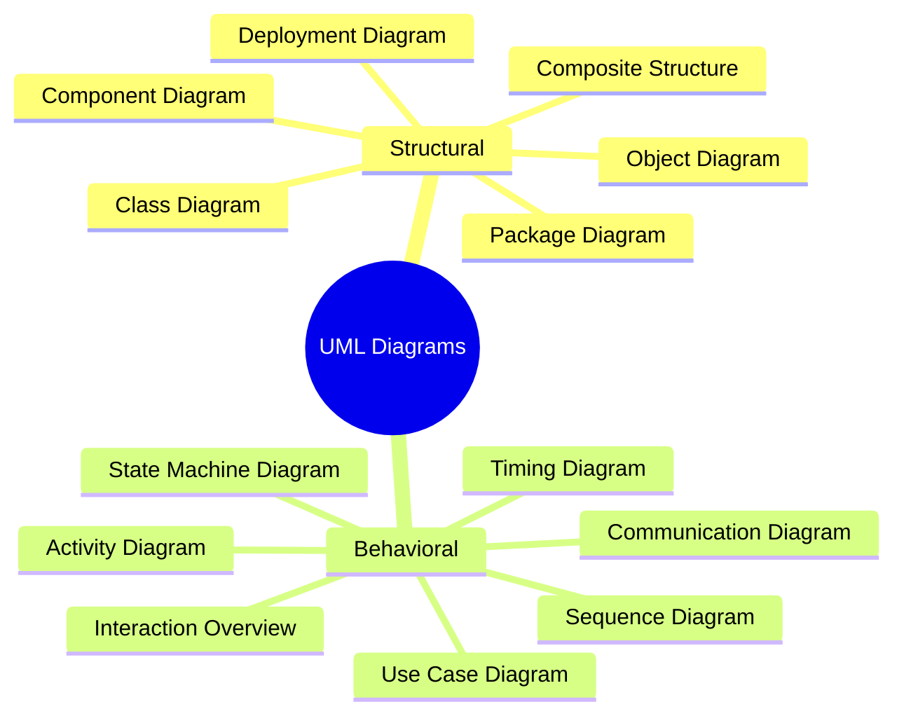

## 🏗️ Structural Diagrams

### 1. Class Diagram

**Most important for LLD** - Shows classes, their attributes, methods, and relationships.

```mermaid
classDiagram
    class Vehicle {
        <<abstract>>
        -String licenseNumber
        -String model
        -int year
        +startEngine()
        +stopEngine()
        +getDetails() String
    }

    class Car {
        -int numberOfDoors
        -String fuelType
        +openTrunk()
        +closeTrunk()
    }

    class Motorcycle {
        -boolean hasSidecar
        +wheelie()
    }

    class Engine {
        -String type
        -int horsepower
        +start()
        +stop()
        +getSpecs() String
    }

    class Owner {
        -String name
        -String licenseId
        -Date licenseExpiry
        +renewLicense()
        +getOwnerInfo() String
    }

    Vehicle <|-- Car
    Vehicle <|-- Motorcycle
    Vehicle *-- Engine
    Owner ||--o{ Vehicle : owns

    note for Vehicle "Abstract base class\nfor all vehicles"
    note for Engine "Composition relationship\nEngine cannot exist without Vehicle"
```

#### Class Diagram Elements

| Symbol          | Meaning        | Example                  |
| --------------- | -------------- | ------------------------ |
| `+`             | Public         | `+getName()`             |
| `-`             | Private        | `-age: int`              |
| `#`             | Protected      | `#calculateBonus()`      |
| `~`             | Package        | `~helper()`              |
| `{abstract}`    | Abstract class | `{abstract} Vehicle`     |
| `<<interface>>` | Interface      | `<<interface>> Drawable` |
| `{static}`      | Static member  | `{static} counter: int`  |

### 2. Object Diagram

Shows instances of classes at a specific moment in time.

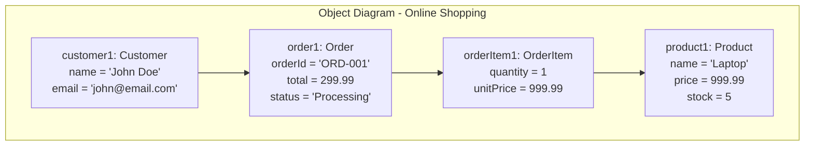

### 3. Component Diagram

Shows how components are organized and their dependencies.

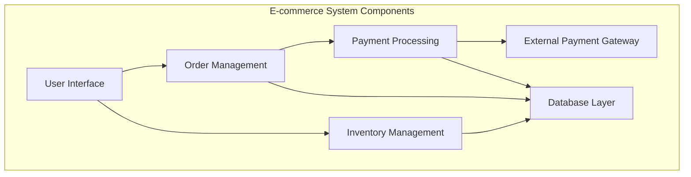

## 🎭 Behavioral Diagrams

### 1. Use Case Diagram

Shows system functionality from user's perspective.

```mermaid
graph LR
    subgraph "Online Banking System"
        Customer((Customer))
        Admin((Admin))

        UC1[Login]
        UC2[View Balance]
        UC3[Transfer Money]
        UC4[Pay Bills]
        UC5[Generate Reports]
        UC6[Manage Accounts]

        Customer --> UC1
        Customer --> UC2
        Customer --> UC3
        Customer --> UC4

        Admin --> UC1
        Admin --> UC5
        Admin --> UC6

        UC2 -.-> UC1 : <<extends>>
        UC3 -.-> UC1 : <<extends>>
        UC4 -.-> UC1 : <<extends>>
    end
```

### 2. Sequence Diagram

Shows how objects interact over time.

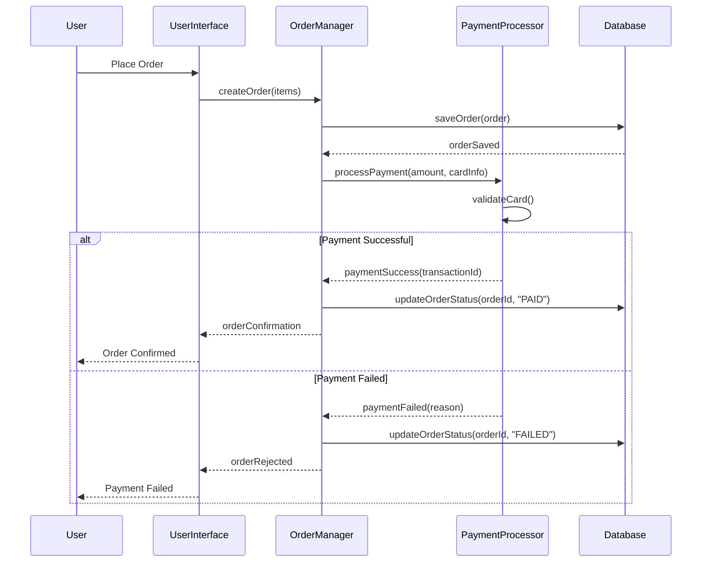

### 3. Activity Diagram

Shows workflow and business processes.


### 4. State Machine Diagram

Shows states of an object and transitions between states.

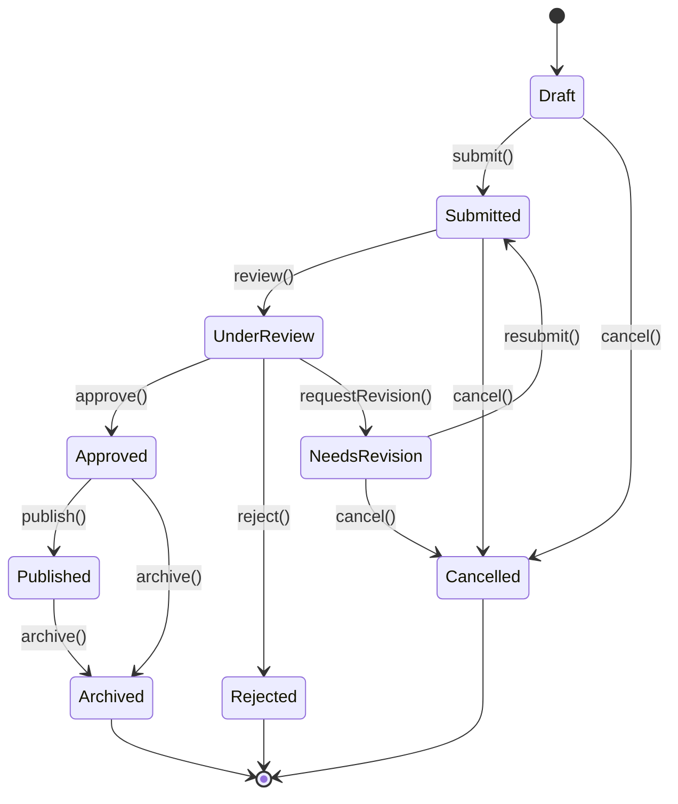

## 🔗 Relationships in UML

### 1. Association

General relationship between classes.

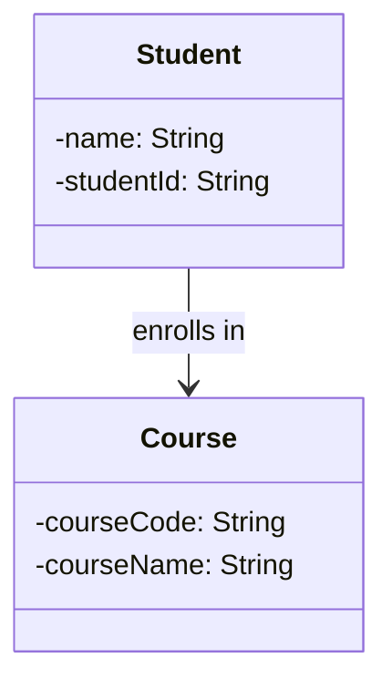

### 2. Aggregation (Has-a)

"Part-of" relationship where parts can exist independently.

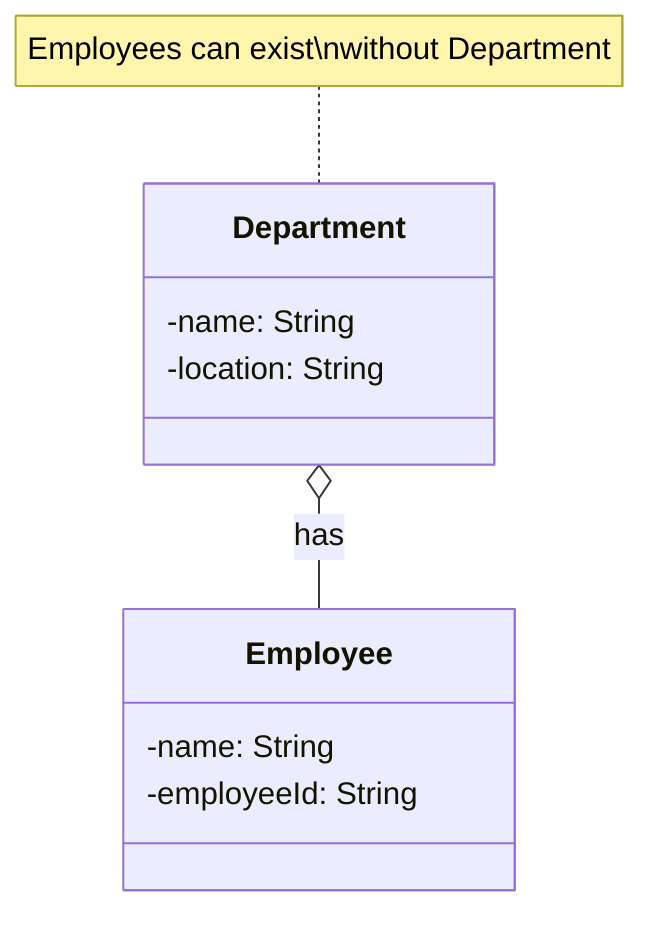

### 3. Composition (Part-of)

Strong ownership where parts cannot exist without the whole.

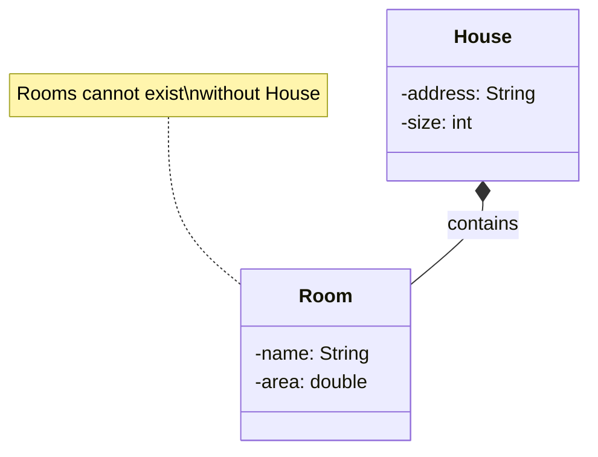

### 4. Inheritance (Is-a)

Generalization/specialization relationship.

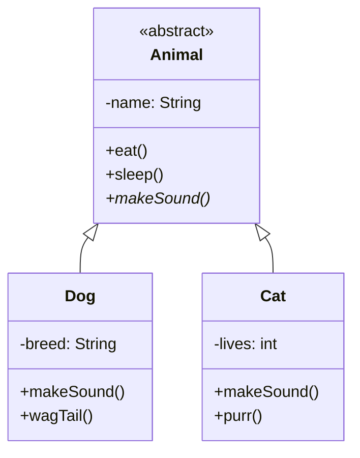

### 5. Realization/Implementation

Implementation of interface by a class.

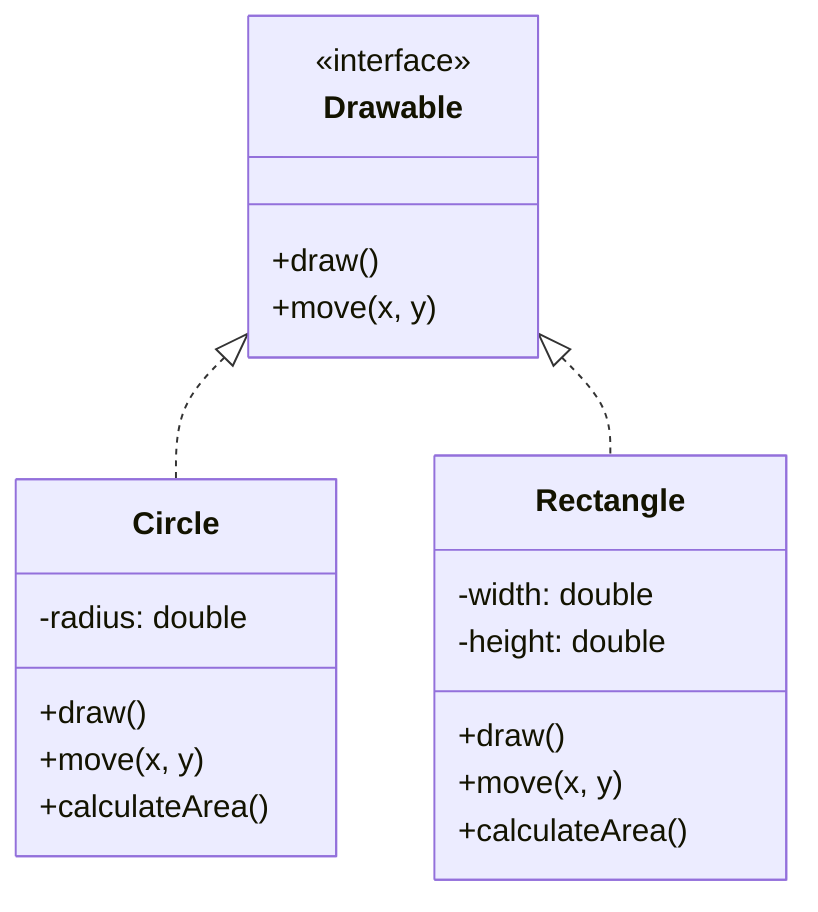

### 6. Dependency

One class uses another class.

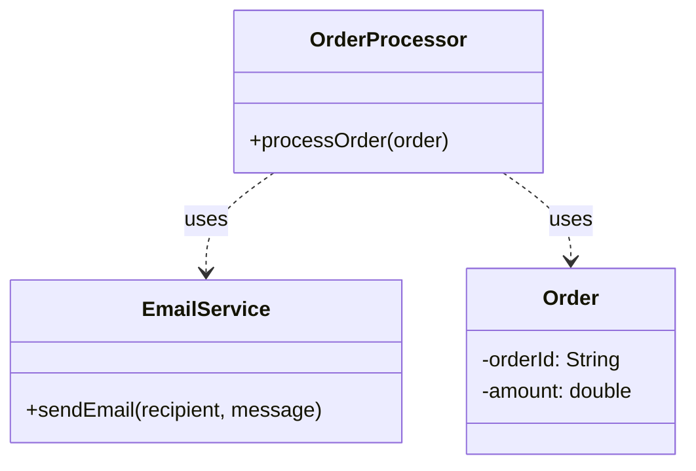

## 📊 Multiplicity Indicators

| Notation      | Meaning         |
| ------------- | --------------- |
| `1`           | Exactly one     |
| `0..1`        | Zero or one     |
| `*` or `0..*` | Zero or more    |
| `1..*`        | One or more     |
| `2..5`        | Between 2 and 5 |
| `3`           | Exactly 3       |

### Example with Multiplicity

```mermaid
classDiagram
    class Library {
        -name: String
        -address: String
    }

    class Book {
        -isbn: String
        -title: String
        -author: String
    }

    class Member {
        -memberId: String
        -name: String
    }

    class Loan {
        -loanDate: Date
        -dueDate: Date
        -returned: boolean
    }

    Library ||--o{ Book : contains
    Member ||--o{ Loan : has
    Book ||--o{ Loan : involved in

    note right of Library : "One library has\nmany books"
    note right of Member : "One member can have\nmultiple loans"
```

## 🛠️ Practical UML Example: Order Management System

Let's design a complete order management system using various UML diagrams.

### Class Diagram

```mermaid
classDiagram
    class Customer {
        -customerId: String
        -name: String
        -email: String
        -address: Address
        +placeOrder(items)
        +getOrderHistory()
        +updateProfile()
    }

    class Order {
        -orderId: String
        -orderDate: Date
        -status: OrderStatus
        -totalAmount: double
        +addItem(product, quantity)
        +removeItem(productId)
        +calculateTotal()
        +updateStatus(status)
    }

    class OrderItem {
        -quantity: int
        -unitPrice: double
        +getSubtotal()
        +updateQuantity(quantity)
    }

    class Product {
        -productId: String
        -name: String
        -price: double
        -stockQuantity: int
        +updatePrice(price)
        +updateStock(quantity)
        +isAvailable()
    }

    class Address {
        -street: String
        -city: String
        -zipCode: String
        -country: String
        +getFullAddress()
    }

    class Payment {
        -paymentId: String
        -amount: double
        -paymentDate: Date
        -method: PaymentMethod
        +processPayment()
        +refund()
    }

    class OrderStatus {
        <<enumeration>>
        PENDING
        CONFIRMED
        SHIPPED
        DELIVERED
        CANCELLED
    }

    class PaymentMethod {
        <<enumeration>>
        CREDIT_CARD
        DEBIT_CARD
        PAYPAL
        CASH
    }

    Customer ||--o{ Order : places
    Customer ||-- Address : has
    Order ||--o{ OrderItem : contains
    Order ||--|| Payment : has
    OrderItem }o--|| Product : refers to
    Order --> OrderStatus
    Payment --> PaymentMethod
```

### Sequence Diagram: Order Processing

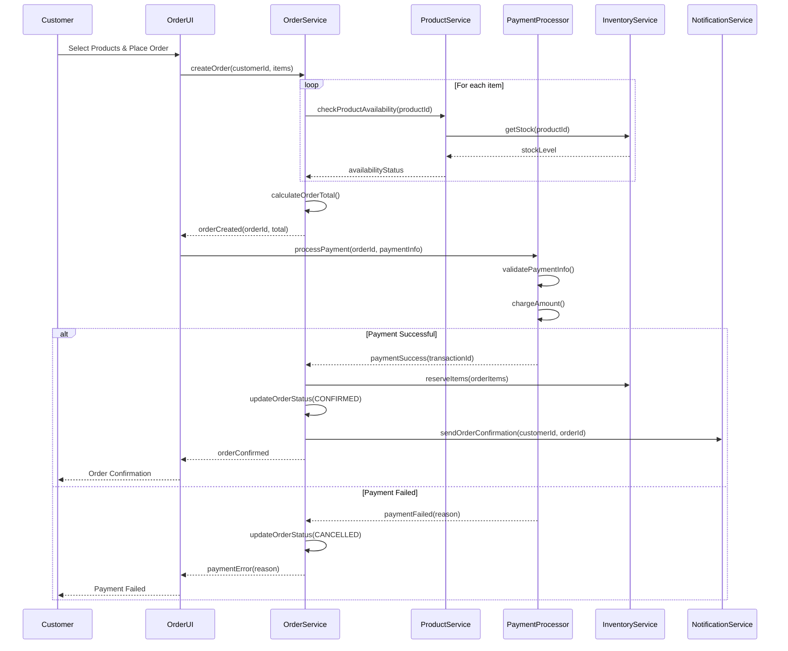

### State Diagram: Order Lifecycle

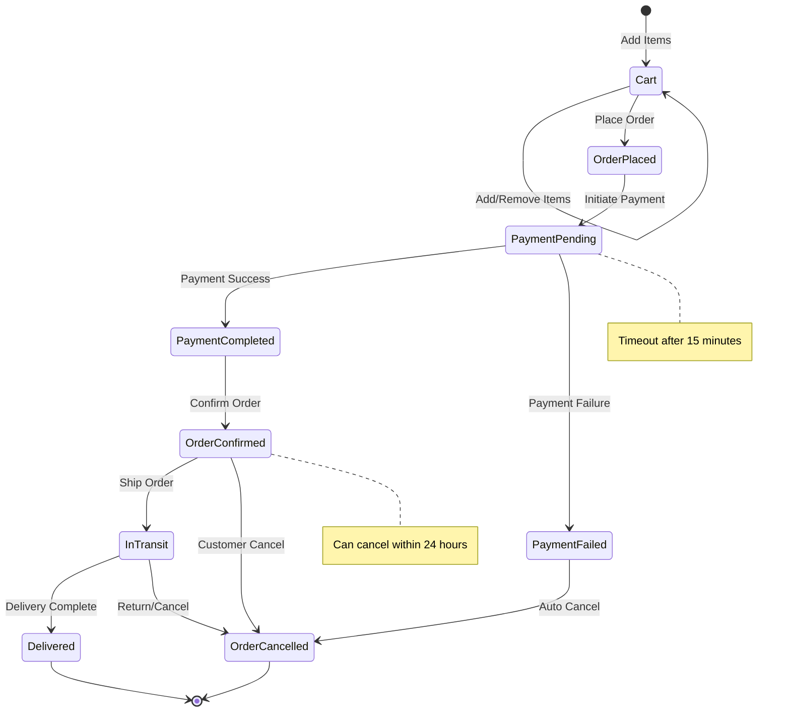

## 🎯 Best Practices for UML

### ✅ DO

1. **Keep it Simple**: Don't over-complicate diagrams
2. **Focus on Key Relationships**: Show the most important relationships
3. **Use Appropriate Diagrams**: Choose the right diagram type for your purpose
4. **Consistent Naming**: Use clear, consistent naming conventions
5. **Add Notes**: Include explanatory notes for complex parts
6. **Version Control**: Keep diagrams updated with code changes

### ❌ DON'T

1. **Don't Show Everything**: Avoid cluttered diagrams with every detail
2. **Don't Skip Relationships**: Missing relationships can confuse readers
3. **Don't Use Wrong Notations**: Stick to standard UML notation
4. **Don't Create Outdated Diagrams**: Keep diagrams synchronized with code
5. **Don't Ignore Your Audience**: Create diagrams appropriate for your audience

## 🔧 Tools for UML

### Free Tools

- **Draw.io (now diagrams.net)**: Web-based, simple to use
- **PlantUML**: Text-based UML diagrams
- **Mermaid**: Markdown-based diagrams (used in this guide)
- **UMLet**: Simple UML tool
- **ArgoUML**: Open source UML modeling tool

### Commercial Tools

- **Lucidchart**: Professional diagramming
- **Visual Paradigm**: Comprehensive UML suite
- **Enterprise Architect**: Advanced modeling tool
- **MagicDraw**: Professional UML tool
- **Visio**: Microsoft's diagramming tool

## 📚 UML in Different Phases

### 1. Requirements Analysis

- **Use Case Diagrams**: Capture functional requirements
- **Activity Diagrams**: Model business processes

### 2. System Design

- **Class Diagrams**: Define system structure
- **Component Diagrams**: Show system architecture
- **Sequence Diagrams**: Design interactions

### 3. Implementation

- **Class Diagrams**: Code structure reference
- **Object Diagrams**: Runtime instances

### 4. Testing

- **State Diagrams**: Test state transitions
- **Sequence Diagrams**: Test interaction scenarios

## 🎓 Practice Exercises

### Exercise 1: Library Management System

Create UML diagrams for a library system with:

- Books, Members, Loans
- Borrowing and returning processes
- Late fee calculations

### Exercise 2: ATM System

Design UML diagrams for an ATM system including:

- User authentication
- Account operations (withdraw, deposit, balance inquiry)
- Transaction processing

### Exercise 3: Restaurant Ordering System

Model a restaurant ordering system with:

- Menu management
- Order taking process
- Payment processing
- Kitchen workflow

## 📝 Summary

UML provides a powerful visual language for software design that:

- **Standardizes Communication**: Common vocabulary for development teams
- **Documents Design Decisions**: Permanent record of system structure
- **Identifies Problems Early**: Visual representation helps spot issues
- **Facilitates Planning**: Clear roadmap for implementation
- **Supports Maintenance**: Understanding existing systems

Key takeaways:

- Use appropriate diagram types for different purposes
- Focus on clarity and simplicity
- Keep diagrams updated with code changes
- Choose the right level of detail for your audience
- Use standard UML notation consistently

Remember: UML is a tool to help you design better systems, not an end in itself. Use it when it adds value to your development process!

---

[← Back to Fundamentals](./README.md) | [Next: Class Relationships →](./04-class-relationships.md)
