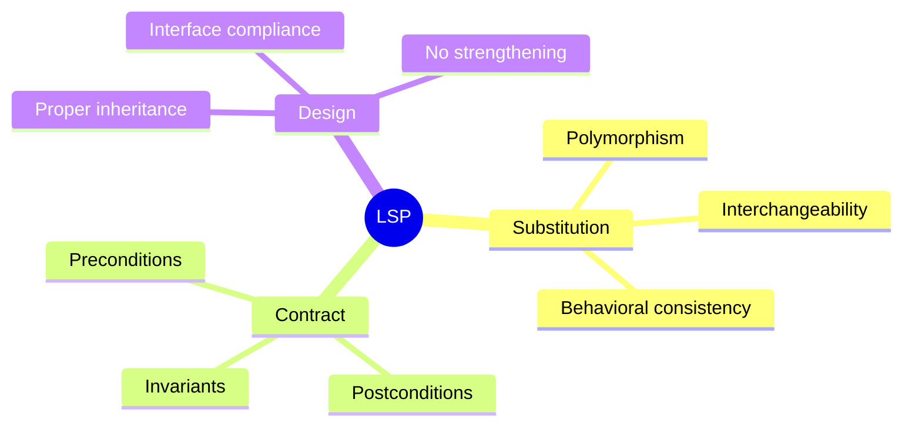
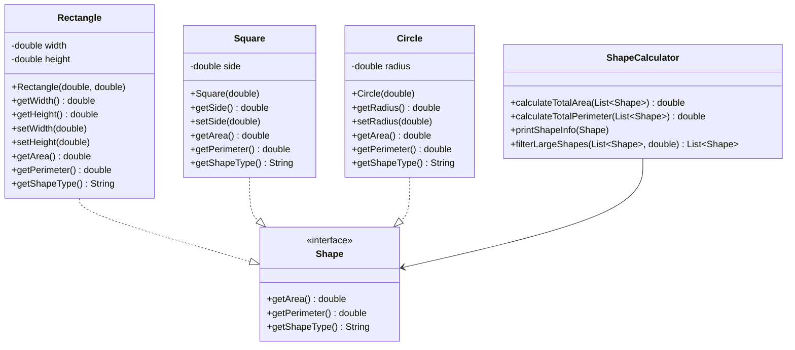

# Liskov Substitution Principle (LSP)

## 🎯 Definition

> "Objects of a superclass should be **replaceable** with objects of its subclasses **without breaking** the application."
>
> _- Barbara Liskov_

The Liskov Substitution Principle states that if S is a subtype of T, then objects of type T may be **replaced** with objects of type S without altering any of the desirable properties of the program.

## 🤔 What Does "Substitutable" Mean?

- **Behavioral Substitutability**: Subclasses must behave consistently with their parent class
- **Contract Compliance**: Subclasses must honor the same contracts (preconditions, postconditions)
- **No Surprising Behavior**: Clients should work the same way with both parent and child objects

### Key Concepts



## ❌ LSP Violation: Broken Substitution

Let's look at a classic example that violates LSP:

```java
// ❌ VIOLATION: Rectangle-Square problem
public class Rectangle {
    protected double width;
    protected double height;

    public Rectangle(double width, double height) {
        this.width = width;
        this.height = height;
    }

    public double getWidth() { return width; }
    public double getHeight() { return height; }

    public void setWidth(double width) {
        this.width = width;
    }

    public void setHeight(double height) {
        this.height = height;
    }

    public double getArea() {
        return width * height;
    }
}

// ❌ VIOLATION: Square violates LSP
public class Square extends Rectangle {
    public Square(double side) {
        super(side, side);
    }

    @Override
    public void setWidth(double width) {
        this.width = width;
        this.height = width; // ❌ Violates expected behavior!
    }

    @Override
    public void setHeight(double height) {
        this.width = height;  // ❌ Violates expected behavior!
        this.height = height;
    }
}
```

### Why This Violates LSP

```java
public class GeometryCalculator {
    public void demonstrateViolation() {
        Rectangle rectangle = new Rectangle(5, 10);
        testRectangle(rectangle); // Works fine

        Rectangle square = new Square(5); // Square as Rectangle
        testRectangle(square); // ❌ Breaks expectations!
    }

    private void testRectangle(Rectangle rect) {
        rect.setWidth(5);
        rect.setHeight(10);

        // Expected: area = 50 (5 * 10)
        // With Square: area = 100 (10 * 10) ❌ Wrong!
        double area = rect.getArea();
        System.out.println("Expected area 50, got: " + area);

        // This assertion fails with Square
        assert area == 50 : "Rectangle area calculation failed!";
    }
}
```

### Problems with This Design

1. **Behavioral Inconsistency**: Square doesn't behave like a Rectangle
2. **Contract Violation**: Setting width shouldn't affect height in a Rectangle
3. **Surprise Behavior**: Clients get unexpected results
4. **Broken Polymorphism**: Can't substitute Square for Rectangle safely
5. **Violation of Expectations**: Square changes both dimensions when setting one

## ✅ LSP Solution: Proper Abstraction

Let's refactor using proper inheritance hierarchy:

### 1. Create Common Shape Interface

```java
// ✅ GOOD: Common interface for all shapes
public interface Shape {
    double getArea();
    double getPerimeter();
    String getShapeType();
}
```

### 2. Separate Rectangle and Square

```java
// ✅ GOOD: Rectangle with consistent behavior
public class Rectangle implements Shape {
    private double width;
    private double height;

    public Rectangle(double width, double height) {
        if (width <= 0 || height <= 0) {
            throw new IllegalArgumentException("Dimensions must be positive");
        }
        this.width = width;
        this.height = height;
    }

    public double getWidth() { return width; }
    public double getHeight() { return height; }

    public void setWidth(double width) {
        if (width <= 0) {
            throw new IllegalArgumentException("Width must be positive");
        }
        this.width = width;
    }

    public void setHeight(double height) {
        if (height <= 0) {
            throw new IllegalArgumentException("Height must be positive");
        }
        this.height = height;
    }

    @Override
    public double getArea() {
        return width * height;
    }

    @Override
    public double getPerimeter() {
        return 2 * (width + height);
    }

    @Override
    public String getShapeType() {
        return "Rectangle";
    }

    @Override
    public String toString() {
        return String.format("Rectangle(%.2f x %.2f)", width, height);
    }
}

// ✅ GOOD: Square with its own consistent behavior
public class Square implements Shape {
    private double side;

    public Square(double side) {
        if (side <= 0) {
            throw new IllegalArgumentException("Side must be positive");
        }
        this.side = side;
    }

    public double getSide() { return side; }

    public void setSide(double side) {
        if (side <= 0) {
            throw new IllegalArgumentException("Side must be positive");
        }
        this.side = side;
    }

    @Override
    public double getArea() {
        return side * side;
    }

    @Override
    public double getPerimeter() {
        return 4 * side;
    }

    @Override
    public String getShapeType() {
        return "Square";
    }

    @Override
    public String toString() {
        return String.format("Square(%.2f)", side);
    }
}
```

### 3. Shape Calculator

```java
// ✅ GOOD: Works with any shape consistently
public class ShapeCalculator {

    public double calculateTotalArea(List<Shape> shapes) {
        return shapes.stream()
                    .mapToDouble(Shape::getArea)
                    .sum();
    }

    public double calculateTotalPerimeter(List<Shape> shapes) {
        return shapes.stream()
                    .mapToDouble(Shape::getPerimeter)
                    .sum();
    }

    public void printShapeInfo(Shape shape) {
        System.out.printf("%s - Area: %.2f, Perimeter: %.2f%n",
                         shape.toString(), shape.getArea(), shape.getPerimeter());
    }

    // ✅ Works consistently with all Shape implementations
    public List<Shape> filterLargeShapes(List<Shape> shapes, double minArea) {
        return shapes.stream()
                    .filter(shape -> shape.getArea() >= minArea)
                    .collect(Collectors.toList());
    }
}
```

## 🏗️ Class Diagram After LSP



## 🎯 Using the LSP Solution

```java
public class GeometryApplication {
    public static void main(String[] args) {
        ShapeCalculator calculator = new ShapeCalculator();

        // Create different shapes
        List<Shape> shapes = Arrays.asList(
            new Rectangle(5, 10),
            new Square(7),
            new Circle(3),
            new Rectangle(8, 6),
            new Square(4)
        );

        // ✅ All shapes work consistently
        System.out.println("All Shapes:");
        shapes.forEach(calculator::printShapeInfo);

        System.out.printf("\nTotal Area: %.2f%n", calculator.calculateTotalArea(shapes));
        System.out.printf("Total Perimeter: %.2f%n", calculator.calculateTotalPerimeter(shapes));

        // ✅ Filtering works with all shapes
        List<Shape> largeShapes = calculator.filterLargeShapes(shapes, 40);
        System.out.println("\nLarge Shapes (Area >= 40):");
        largeShapes.forEach(calculator::printShapeInfo);
    }
}
```

## 🎨 More LSP Examples

### Example 1: Bird Hierarchy

#### ❌ Violation

```java
// ❌ VIOLATION: Not all birds can fly
public abstract class Bird {
    public abstract void fly();
    public abstract void eat();
}

public class Sparrow extends Bird {
    @Override
    public void fly() {
        System.out.println("Sparrow flying");
    }

    @Override
    public void eat() {
        System.out.println("Sparrow eating seeds");
    }
}

public class Penguin extends Bird {
    @Override
    public void fly() {
        // ❌ Penguins can't fly! This violates LSP
        throw new UnsupportedOperationException("Penguins can't fly!");
    }

    @Override
    public void eat() {
        System.out.println("Penguin eating fish");
    }
}

// ❌ This will break with Penguin
public void makeBirdFly(Bird bird) {
    bird.fly(); // Throws exception with Penguin!
}
```

#### ✅ Solution

```java
// ✅ GOOD: Separate flying and non-flying birds
public interface Bird {
    void eat();
    void makeSound();
    String getSpecies();
}

public interface FlyingBird extends Bird {
    void fly();
    double getFlightSpeed();
}

public interface SwimmingBird extends Bird {
    void swim();
    double getSwimSpeed();
}

// Concrete implementations
public class Sparrow implements FlyingBird {
    @Override
    public void eat() {
        System.out.println("Sparrow eating seeds");
    }

    @Override
    public void makeSound() {
        System.out.println("Chirp chirp!");
    }

    @Override
    public String getSpecies() {
        return "House Sparrow";
    }

    @Override
    public void fly() {
        System.out.println("Sparrow flying gracefully");
    }

    @Override
    public double getFlightSpeed() {
        return 24.0; // km/h
    }
}

public class Penguin implements SwimmingBird {
    @Override
    public void eat() {
        System.out.println("Penguin eating fish");
    }

    @Override
    public void makeSound() {
        System.out.println("Squawk squawk!");
    }

    @Override
    public String getSpecies() {
        return "Emperor Penguin";
    }

    @Override
    public void swim() {
        System.out.println("Penguin swimming underwater");
    }

    @Override
    public double getSwimSpeed() {
        return 9.0; // km/h
    }
}

// ✅ GOOD: Methods work with appropriate bird types
public class BirdWatcher {
    public void observeFlyingBird(FlyingBird bird) {
        System.out.println("Watching " + bird.getSpecies());
        bird.fly(); // ✅ Safe - all FlyingBirds can fly
        System.out.println("Flight speed: " + bird.getFlightSpeed() + " km/h");
    }

    public void observeSwimmingBird(SwimmingBird bird) {
        System.out.println("Watching " + bird.getSpecies());
        bird.swim(); // ✅ Safe - all SwimmingBirds can swim
        System.out.println("Swim speed: " + bird.getSwimSpeed() + " km/h");
    }

    public void observeAnyBird(Bird bird) {
        System.out.println("General observation of " + bird.getSpecies());
        bird.eat();
        bird.makeSound();
        // ✅ Only calls methods that ALL birds can do
    }
}
```

### Example 2: Vehicle Inheritance

#### ❌ Violation

```java
// ❌ VIOLATION: Not all vehicles have engines
public abstract class Vehicle {
    protected String model;
    protected int year;

    public abstract void startEngine();
    public abstract void accelerate();
    public abstract void brake();
    public abstract double getMaxSpeed();
}

public class Car extends Vehicle {
    @Override
    public void startEngine() {
        System.out.println("Car engine started");
    }

    @Override
    public void accelerate() {
        System.out.println("Car accelerating");
    }

    @Override
    public void brake() {
        System.out.println("Car braking");
    }

    @Override
    public double getMaxSpeed() {
        return 200.0;
    }
}

public class Bicycle extends Vehicle {
    @Override
    public void startEngine() {
        // ❌ Bicycles don't have engines!
        throw new UnsupportedOperationException("Bicycles don't have engines!");
    }

    @Override
    public void accelerate() {
        System.out.println("Pedaling faster");
    }

    @Override
    public void brake() {
        System.out.println("Using hand brakes");
    }

    @Override
    public double getMaxSpeed() {
        return 50.0;
    }
}
```

#### ✅ Solution

```java
// ✅ GOOD: Proper vehicle hierarchy
public interface Vehicle {
    void accelerate();
    void brake();
    double getMaxSpeed();
    String getModel();
    int getYear();
}

public interface MotorizedVehicle extends Vehicle {
    void startEngine();
    void stopEngine();
    double getFuelEfficiency();
    String getFuelType();
}

public interface HumanPoweredVehicle extends Vehicle {
    void pedal();
    double getEffort(); // effort required (1-10 scale)
}

// Implementations
public class Car implements MotorizedVehicle {
    private String model;
    private int year;
    private boolean engineRunning;

    public Car(String model, int year) {
        this.model = model;
        this.year = year;
        this.engineRunning = false;
    }

    @Override
    public void startEngine() {
        engineRunning = true;
        System.out.println("Car engine started");
    }

    @Override
    public void stopEngine() {
        engineRunning = false;
        System.out.println("Car engine stopped");
    }

    @Override
    public void accelerate() {
        if (engineRunning) {
            System.out.println("Car accelerating");
        } else {
            System.out.println("Start engine first!");
        }
    }

    @Override
    public void brake() {
        System.out.println("Car braking with disc brakes");
    }

    @Override
    public double getMaxSpeed() {
        return 200.0;
    }

    @Override
    public double getFuelEfficiency() {
        return 15.5; // km/l
    }

    @Override
    public String getFuelType() {
        return "Gasoline";
    }

    @Override
    public String getModel() { return model; }

    @Override
    public int getYear() { return year; }
}

public class Bicycle implements HumanPoweredVehicle {
    private String model;
    private int year;

    public Bicycle(String model, int year) {
        this.model = model;
        this.year = year;
    }

    @Override
    public void pedal() {
        System.out.println("Pedaling the bicycle");
    }

    @Override
    public void accelerate() {
        pedal();
        System.out.println("Bicycle speeding up");
    }

    @Override
    public void brake() {
        System.out.println("Using hand brakes on bicycle");
    }

    @Override
    public double getMaxSpeed() {
        return 50.0;
    }

    @Override
    public double getEffort() {
        return 6.0; // Medium effort
    }

    @Override
    public String getModel() { return model; }

    @Override
    public int getYear() { return year; }
}
```

## 🛡️ LSP Rules and Contracts

### 1. Preconditions Cannot Be Strengthened

```java
// ❌ BAD: Subclass strengthens preconditions
public class Rectangle {
    public void setDimensions(double width, double height) {
        // Precondition: width > 0 AND height > 0
        if (width <= 0 || height <= 0) {
            throw new IllegalArgumentException("Dimensions must be positive");
        }
        this.width = width;
        this.height = height;
    }
}

public class Square extends Rectangle {
    @Override
    public void setDimensions(double width, double height) {
        // ❌ VIOLATION: Strengthened precondition (width must equal height)
        if (width <= 0 || height <= 0 || width != height) {
            throw new IllegalArgumentException("Square dimensions must be positive and equal");
        }
        super.setDimensions(width, height);
    }
}

// ✅ GOOD: Separate classes with appropriate preconditions
public class Rectangle {
    public void setDimensions(double width, double height) {
        if (width <= 0 || height <= 0) {
            throw new IllegalArgumentException("Dimensions must be positive");
        }
        this.width = width;
        this.height = height;
    }
}

public class Square {
    public void setDimension(double side) {
        if (side <= 0) {
            throw new IllegalArgumentException("Side must be positive");
        }
        this.side = side;
    }
}
```

### 2. Postconditions Cannot Be Weakened

```java
// ✅ GOOD: Consistent postconditions
public abstract class SortingAlgorithm {
    // Postcondition: Returns array in ascending order
    public abstract int[] sort(int[] array);

    protected boolean isAscending(int[] array) {
        for (int i = 1; i < array.length; i++) {
            if (array[i] < array[i-1]) return false;
        }
        return true;
    }
}

public class QuickSort extends SortingAlgorithm {
    @Override
    public int[] sort(int[] array) {
        int[] result = array.clone();
        quickSort(result, 0, result.length - 1);
        // ✅ Maintains postcondition: result is sorted in ascending order
        assert isAscending(result) : "QuickSort postcondition violated";
        return result;
    }

    private void quickSort(int[] arr, int low, int high) {
        // QuickSort implementation
    }
}

// ❌ BAD: Would violate postcondition
public class BrokenSort extends SortingAlgorithm {
    @Override
    public int[] sort(int[] array) {
        // ❌ Returns descending order - violates postcondition!
        return Arrays.stream(array)
                    .boxed()
                    .sorted(Collections.reverseOrder())
                    .mapToInt(Integer::intValue)
                    .toArray();
    }
}
```

### 3. Invariants Must Be Preserved

```java
// ✅ GOOD: Invariants preserved across inheritance
public class BankAccount {
    protected double balance;

    // Invariant: balance >= 0 (no overdraft allowed)
    public BankAccount(double initialBalance) {
        if (initialBalance < 0) {
            throw new IllegalArgumentException("Initial balance cannot be negative");
        }
        this.balance = initialBalance;
    }

    public void withdraw(double amount) {
        if (amount <= 0) {
            throw new IllegalArgumentException("Amount must be positive");
        }
        if (balance - amount < 0) {
            throw new IllegalStateException("Insufficient funds");
        }
        balance -= amount;
        // Invariant preserved: balance >= 0
    }

    public void deposit(double amount) {
        if (amount <= 0) {
            throw new IllegalArgumentException("Amount must be positive");
        }
        balance += amount;
        // Invariant preserved: balance >= 0
    }

    public double getBalance() {
        return balance;
    }
}

public class SavingsAccount extends BankAccount {
    private static final double MINIMUM_BALANCE = 100.0;

    // Additional invariant: balance >= 100
    public SavingsAccount(double initialBalance) {
        super(Math.max(initialBalance, MINIMUM_BALANCE));
    }

    @Override
    public void withdraw(double amount) {
        if (amount <= 0) {
            throw new IllegalArgumentException("Amount must be positive");
        }
        if (balance - amount < MINIMUM_BALANCE) {
            throw new IllegalStateException("Withdrawal would violate minimum balance");
        }
        balance -= amount;
        // ✅ All invariants preserved: balance >= 0 AND balance >= 100
    }

    // deposit method inherited - automatically preserves invariants
}
```

## 🔍 How to Identify LSP Violations

### Questions to Ask

1. **Can I use a subclass anywhere I use the parent class without issues?**
2. **Does the subclass throw exceptions that the parent class doesn't?**
3. **Does the subclass have stronger preconditions than the parent?**
4. **Does the subclass have weaker postconditions than the parent?**
5. **Does the subclass change the expected behavior in surprising ways?**

### Warning Signs

- ❌ `instanceof` checks in client code
- ❌ Empty or exception-throwing method implementations
- ❌ Subclasses that require special handling
- ❌ Conditional logic based on concrete types
- ❌ Methods that don't make sense for the subclass

## 🎯 Benefits of Following LSP

### 1. **Reliable Polymorphism**

```java
// ✅ Can use any Shape implementation reliably
public void processShapes(List<Shape> shapes) {
    for (Shape shape : shapes) {
        // ✅ Works consistently with all Shape implementations
        double area = shape.getArea();
        double perimeter = shape.getPerimeter();
        System.out.printf("%s: Area=%.2f, Perimeter=%.2f%n",
                         shape.getShapeType(), area, perimeter);
    }
}
```

### 2. **Easier Testing**

```java
@Test
public void testAllShapes() {
    List<Shape> shapes = Arrays.asList(
        new Rectangle(5, 10),
        new Square(7),
        new Circle(3)
    );

    // ✅ Same test works for all implementations
    for (Shape shape : shapes) {
        double area = shape.getArea();
        assertTrue("Area should be positive", area > 0);

        double perimeter = shape.getPerimeter();
        assertTrue("Perimeter should be positive", perimeter > 0);
    }
}
```

### 3. **Flexible Design**

```java
// ✅ Can add new shapes without changing existing code
public class Triangle implements Shape {
    private double base, height, side1, side2, side3;

    @Override
    public double getArea() {
        return 0.5 * base * height;
    }

    @Override
    public double getPerimeter() {
        return side1 + side2 + side3;
    }

    @Override
    public String getShapeType() {
        return "Triangle";
    }
}
```

## 🚨 Common LSP Mistakes

### ❌ Inappropriate Inheritance

```java
// ❌ BAD: Stack is not a proper List
public class Stack<T> extends ArrayList<T> {
    public T push(T item) {
        add(item);
        return item;
    }

    public T pop() {
        return remove(size() - 1);
    }

    // ❌ Stack shouldn't allow insertion at arbitrary positions
    // But inherits add(index, element) from ArrayList
}

// ✅ BETTER: Composition over inheritance
public class Stack<T> {
    private List<T> elements = new ArrayList<>();

    public T push(T item) {
        elements.add(item);
        return item;
    }

    public T pop() {
        if (elements.isEmpty()) {
            throw new IllegalStateException("Stack is empty");
        }
        return elements.remove(elements.size() - 1);
    }

    public T peek() {
        if (elements.isEmpty()) {
            throw new IllegalStateException("Stack is empty");
        }
        return elements.get(elements.size() - 1);
    }

    public boolean isEmpty() {
        return elements.isEmpty();
    }

    public int size() {
        return elements.size();
    }
}
```

## 🛠️ Refactoring to LSP

### Step-by-Step Process

1. **Identify Problematic Inheritance**: Find classes that can't substitute their parents
2. **Analyze Contracts**: Check preconditions, postconditions, and invariants
3. **Extract Common Interface**: Create interfaces for common behavior
4. **Separate Hierarchies**: Split into appropriate inheritance trees
5. **Use Composition**: Consider composition over inheritance
6. **Test Substitutability**: Verify all subclasses work in parent's place

### Example Refactoring

```java
// BEFORE: LSP Violation
public class Document {
    protected boolean isReadOnly;

    public void save() {
        if (isReadOnly) {
            throw new UnsupportedOperationException("Cannot save read-only document");
        }
        // Save logic
    }

    public void edit(String content) {
        if (isReadOnly) {
            throw new UnsupportedOperationException("Cannot edit read-only document");
        }
        // Edit logic
    }
}

public class ReadOnlyDocument extends Document {
    public ReadOnlyDocument() {
        this.isReadOnly = true;
    }

    // ❌ These methods throw exceptions - violates LSP
    @Override
    public void save() {
        throw new UnsupportedOperationException("Read-only document cannot be saved");
    }

    @Override
    public void edit(String content) {
        throw new UnsupportedOperationException("Read-only document cannot be edited");
    }
}

// AFTER: LSP Compliant
public interface Document {
    String getContent();
    String getTitle();
    LocalDateTime getCreatedDate();
}

public interface EditableDocument extends Document {
    void edit(String content);
    void save();
    LocalDateTime getLastModified();
}

public class StandardDocument implements EditableDocument {
    private String content;
    private String title;
    private LocalDateTime createdDate;
    private LocalDateTime lastModified;

    // All methods implemented properly
    @Override
    public void edit(String content) {
        this.content = content;
        this.lastModified = LocalDateTime.now();
    }

    @Override
    public void save() {
        // Save implementation
        System.out.println("Document saved");
    }

    // Other methods...
}

public class ReadOnlyDocument implements Document {
    private final String content;
    private final String title;
    private final LocalDateTime createdDate;

    public ReadOnlyDocument(String title, String content) {
        this.title = title;
        this.content = content;
        this.createdDate = LocalDateTime.now();
    }

    // Only implements methods it can actually support
    @Override
    public String getContent() { return content; }

    @Override
    public String getTitle() { return title; }

    @Override
    public LocalDateTime getCreatedDate() { return createdDate; }
}
```

## 🎓 Practice Exercise

### Exercise: Fix the Employee Hierarchy

Here's a hierarchy that violates LSP. Can you refactor it?

```java
public abstract class Employee {
    protected String name;
    protected double salary;

    public abstract double calculatePay();
    public abstract void clockIn();
    public abstract void clockOut();
    public abstract int getVacationDays();
}

public class FullTimeEmployee extends Employee {
    @Override
    public double calculatePay() {
        return salary;
    }

    @Override
    public void clockIn() {
        System.out.println("Full-time employee clocked in");
    }

    @Override
    public void clockOut() {
        System.out.println("Full-time employee clocked out");
    }

    @Override
    public int getVacationDays() {
        return 20;
    }
}

public class Contractor extends Employee {
    private double hourlyRate;
    private int hoursWorked;

    @Override
    public double calculatePay() {
        return hourlyRate * hoursWorked;
    }

    @Override
    public void clockIn() {
        // ❌ Contractors don't clock in/out
        throw new UnsupportedOperationException("Contractors don't clock in");
    }

    @Override
    public void clockOut() {
        // ❌ Contractors don't clock in/out
        throw new UnsupportedOperationException("Contractors don't clock out");
    }

    @Override
    public int getVacationDays() {
        // ❌ Contractors don't get vacation days
        return 0; // or throw exception?
    }
}
```

### Solution Approach

1. Extract common `Worker` interface
2. Create separate interfaces for different capabilities
3. Implement appropriate combinations in concrete classes
4. Use composition where inheritance doesn't fit

## 📚 Summary

The Liskov Substitution Principle ensures that inheritance hierarchies are **logically sound** and **behaviorally consistent**. By following LSP:

- ✅ **Reliable Polymorphism**: Subclasses work wherever parent classes work
- ✅ **Predictable Behavior**: No surprises when using subclasses
- ✅ **Maintainable Code**: Changes don't break existing functionality
- ✅ **Better Design**: Leads to more logical inheritance hierarchies
- ✅ **Easier Testing**: Consistent behavior across implementations

Remember: **Subclasses should be substitutable for their parent classes without altering program correctness!**

The key is to ensure that inheritance represents a true "is-a" relationship with consistent behavior, not just code reuse. When in doubt, favor composition over inheritance.

---
