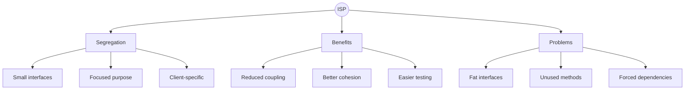
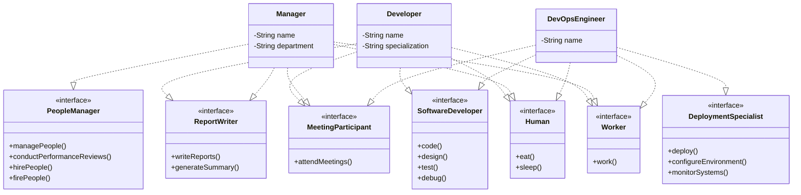

🧑‍💻 **Author:** RK ROY

# Interface Segregation Principle (ISP)

## 🎯 Definition

> "Clients should not be **forced to depend** on interfaces they don't use."
>
> _- Robert C. Martin_

The Interface Segregation Principle states that **no client should be forced to implement methods it doesn't use**. Instead of having large, monolithic interfaces, create **small, focused interfaces** that are specific to client needs.

## 🤔 What Does "Interface Segregation" Mean?

- **Focused Interfaces**: Each interface should serve a specific purpose
- **Client-Specific**: Interfaces should be tailored to client needs
- **No Fat Interfaces**: Avoid large interfaces with many unrelated methods
- **Role-Based Design**: Design interfaces around roles and responsibilities

### Key Concepts



## ❌ ISP Violation: Fat Interface

Let's look at a classic example that violates ISP:

```java
// ❌ VIOLATION: Fat interface with too many responsibilities
public interface Worker {
    void work();
    void eat();
    void sleep();
    void attendMeetings();
    void writeReports();
    void managePeople();
    void code();
    void design();
    void test();
    void deploy();
    void handleCustomerSupport();
    void doAccounting();
}

// ❌ PROBLEM: All implementers must implement ALL methods
public class Developer implements Worker {
    @Override
    public void work() {
        System.out.println("Developer writing code");
    }

    @Override
    public void eat() {
        System.out.println("Developer eating lunch");
    }

    @Override
    public void sleep() {
        System.out.println("Developer sleeping");
    }

    @Override
    public void attendMeetings() {
        System.out.println("Developer attending meetings");
    }

    @Override
    public void writeReports() {
        System.out.println("Developer writing reports");
    }

    @Override
    public void managePeople() {
        // ❌ Developers don't manage people!
        throw new UnsupportedOperationException("Developers don't manage people");
    }

    @Override
    public void code() {
        System.out.println("Developer coding");
    }

    @Override
    public void design() {
        System.out.println("Developer designing");
    }

    @Override
    public void test() {
        System.out.println("Developer testing");
    }

    @Override
    public void deploy() {
        System.out.println("Developer deploying");
    }

    @Override
    public void handleCustomerSupport() {
        // ❌ Developers don't handle customer support!
        throw new UnsupportedOperationException("Developers don't handle customer support");
    }

    @Override
    public void doAccounting() {
        // ❌ Developers don't do accounting!
        throw new UnsupportedOperationException("Developers don't do accounting");
    }
}

public class Manager implements Worker {
    // ❌ Must implement ALL methods, many of which don't apply
    @Override
    public void code() {
        // ❌ Managers typically don't code!
        throw new UnsupportedOperationException("Managers don't code");
    }

    @Override
    public void test() {
        // ❌ Managers don't test!
        throw new UnsupportedOperationException("Managers don't test");
    }

    @Override
    public void deploy() {
        // ❌ Managers don't deploy!
        throw new UnsupportedOperationException("Managers don't deploy");
    }

    // ... many more inappropriate methods
}
```

### Problems with This Design

1. **Forced Dependencies**: Classes depend on methods they don't use
2. **Bloated Interfaces**: Single interface tries to do everything
3. **Coupling Issues**: Changes affect unrelated clients
4. **Implementation Burden**: Classes must implement irrelevant methods
5. **Violation of SRP**: Interface has multiple responsibilities

## ✅ ISP Solution: Segregated Interfaces

Let's refactor using focused, client-specific interfaces:

### 1. Create Role-Based Interfaces

```java
// ✅ GOOD: Basic worker interface
public interface Worker {
    void work();
}

// ✅ GOOD: Human needs interface
public interface Human {
    void eat();
    void sleep();
}

// ✅ GOOD: Meeting participant interface
public interface MeetingParticipant {
    void attendMeetings();
}

// ✅ GOOD: Report writer interface
public interface ReportWriter {
    void writeReports();
    void generateSummary();
}

// ✅ GOOD: People manager interface
public interface PeopleManager {
    void managePeople();
    void conductPerformanceReviews();
    void hirePeople();
    void firePeople();
}

// ✅ GOOD: Software developer interface
public interface SoftwareDeveloper {
    void code();
    void design();
    void test();
    void debug();
}

// ✅ GOOD: Deployment specialist interface
public interface DeploymentSpecialist {
    void deploy();
    void configureEnvironment();
    void monitorSystems();
}

// ✅ GOOD: Customer support interface
public interface CustomerSupportAgent {
    void handleCustomerSupport();
    void processTickets();
    void escalateIssues();
}

// ✅ GOOD: Accountant interface
public interface Accountant {
    void doAccounting();
    void processPayroll();
    void generateFinancialReports();
}
```

### 2. Implement Focused Classes

```java
// ✅ GOOD: Developer only implements relevant interfaces
public class Developer implements Worker, Human, MeetingParticipant,
                                  SoftwareDeveloper, ReportWriter {
    private String name;
    private String specialization;

    public Developer(String name, String specialization) {
        this.name = name;
        this.specialization = specialization;
    }

    @Override
    public void work() {
        System.out.println(name + " is working on " + specialization + " tasks");
    }

    @Override
    public void eat() {
        System.out.println(name + " is eating lunch");
    }

    @Override
    public void sleep() {
        System.out.println(name + " is sleeping");
    }

    @Override
    public void attendMeetings() {
        System.out.println(name + " is attending technical meetings");
    }

    @Override
    public void writeReports() {
        System.out.println(name + " is writing technical reports");
    }

    @Override
    public void generateSummary() {
        System.out.println(name + " is generating code review summary");
    }

    @Override
    public void code() {
        System.out.println(name + " is coding in " + specialization);
    }

    @Override
    public void design() {
        System.out.println(name + " is designing software architecture");
    }

    @Override
    public void test() {
        System.out.println(name + " is writing and running tests");
    }

    @Override
    public void debug() {
        System.out.println(name + " is debugging code");
    }
}

// ✅ GOOD: Manager only implements relevant interfaces
public class Manager implements Worker, Human, MeetingParticipant,
                               PeopleManager, ReportWriter {
    private String name;
    private String department;

    public Manager(String name, String department) {
        this.name = name;
        this.department = department;
    }

    @Override
    public void work() {
        System.out.println(name + " is managing the " + department + " department");
    }

    @Override
    public void eat() {
        System.out.println(name + " is having lunch with the team");
    }

    @Override
    public void sleep() {
        System.out.println(name + " is resting");
    }

    @Override
    public void attendMeetings() {
        System.out.println(name + " is attending management meetings");
    }

    @Override
    public void writeReports() {
        System.out.println(name + " is writing management reports");
    }

    @Override
    public void generateSummary() {
        System.out.println(name + " is generating team performance summary");
    }

    @Override
    public void managePeople() {
        System.out.println(name + " is managing team members");
    }

    @Override
    public void conductPerformanceReviews() {
        System.out.println(name + " is conducting performance reviews");
    }

    @Override
    public void hirePeople() {
        System.out.println(name + " is interviewing candidates");
    }

    @Override
    public void firePeople() {
        System.out.println(name + " is handling terminations");
    }
}

// ✅ GOOD: DevOps Engineer implements specific interfaces
public class DevOpsEngineer implements Worker, Human, MeetingParticipant,
                                      SoftwareDeveloper, DeploymentSpecialist {
    private String name;

    public DevOpsEngineer(String name) {
        this.name = name;
    }

    // Implements only relevant methods for DevOps role
    @Override
    public void work() {
        System.out.println(name + " is managing infrastructure");
    }

    @Override
    public void deploy() {
        System.out.println(name + " is deploying applications");
    }

    @Override
    public void configureEnvironment() {
        System.out.println(name + " is configuring deployment environment");
    }

    @Override
    public void monitorSystems() {
        System.out.println(name + " is monitoring system health");
    }

    @Override
    public void code() {
        System.out.println(name + " is writing automation scripts");
    }

    @Override
    public void design() {
        System.out.println(name + " is designing CI/CD pipelines");
    }

    @Override
    public void test() {
        System.out.println(name + " is testing infrastructure");
    }

    @Override
    public void debug() {
        System.out.println(name + " is troubleshooting deployment issues");
    }

    // Other interface methods...
}
```

### 3. Client-Specific Services

```java
// ✅ GOOD: Services work with specific interfaces
public class ProjectManagementService {

    public void organizeStandupMeeting(List<MeetingParticipant> participants) {
        System.out.println("Starting daily standup meeting");
        participants.forEach(MeetingParticipant::attendMeetings);
    }

    public void generateProjectReports(List<ReportWriter> reporters) {
        System.out.println("Generating project reports");
        reporters.forEach(reporter -> {
            reporter.writeReports();
            reporter.generateSummary();
        });
    }

    public void manageTeam(List<PeopleManager> managers) {
        System.out.println("Managing team operations");
        managers.forEach(manager -> {
            manager.managePeople();
            manager.conductPerformanceReviews();
        });
    }
}

// ✅ GOOD: Development service uses developer-specific interfaces
public class DevelopmentService {

    public void conductCodeReview(List<SoftwareDeveloper> developers) {
        System.out.println("Conducting code review session");
        developers.forEach(dev -> {
            dev.design();
            dev.code();
            dev.test();
        });
    }

    public void deployApplication(List<DeploymentSpecialist> deploymentTeam) {
        System.out.println("Deploying application");
        deploymentTeam.forEach(specialist -> {
            specialist.configureEnvironment();
            specialist.deploy();
            specialist.monitorSystems();
        });
    }
}
```

## 🏗️ Class Diagram After ISP



## 🎯 Using the ISP Solution

```java
public class CompanyManagementSystem {
    public static void main(String[] args) {
        // Create employees with specific roles
        Developer juniorDev = new Developer("Alice", "Frontend");
        Developer seniorDev = new Developer("Bob", "Backend");
        Manager projectManager = new Manager("Charlie", "Engineering");
        DevOpsEngineer devOps = new DevOpsEngineer("Diana");

        // Create services
        ProjectManagementService pmService = new ProjectManagementService();
        DevelopmentService devService = new DevelopmentService();

        // ✅ Use only relevant interfaces
        List<MeetingParticipant> meetingParticipants = Arrays.asList(
            juniorDev, seniorDev, projectManager, devOps
        );

        List<ReportWriter> reporters = Arrays.asList(
            juniorDev, seniorDev, projectManager
        );

        List<SoftwareDeveloper> developers = Arrays.asList(
            juniorDev, seniorDev, devOps
        );

        List<DeploymentSpecialist> deploymentTeam = Arrays.asList(devOps);

        List<PeopleManager> managers = Arrays.asList(projectManager);

        // ✅ Services work with specific interfaces
        pmService.organizeStandupMeeting(meetingParticipants);
        pmService.generateProjectReports(reporters);
        pmService.manageTeam(managers);

        devService.conductCodeReview(developers);
        devService.deployApplication(deploymentTeam);
    }
}
```

## 🎨 More ISP Examples

### Example 1: Printer Interface

#### ❌ Violation

```java
// ❌ VIOLATION: Fat interface with all printer capabilities
public interface Printer {
    void print(Document document);
    void scan(Document document);
    void fax(Document document);
    void copyColor(Document document);
    void copyBlackWhite(Document document);
    void staple(Document document);
    void duplex(Document document);
    void emailDocument(Document document, String email);
}

// ❌ PROBLEM: Simple printer forced to implement everything
public class BasicPrinter implements Printer {
    @Override
    public void print(Document document) {
        System.out.println("Printing document");
    }

    @Override
    public void scan(Document document) {
        // ❌ Basic printer can't scan!
        throw new UnsupportedOperationException("Basic printer cannot scan");
    }

    @Override
    public void fax(Document document) {
        // ❌ Basic printer can't fax!
        throw new UnsupportedOperationException("Basic printer cannot fax");
    }

    // ❌ Many more unsupported operations...
}
```

#### ✅ Solution

```java
// ✅ GOOD: Segregated printer interfaces
public interface BasicPrinter {
    void print(Document document);
}

public interface Scanner {
    Document scan();
    void scanToFile(String filename);
}

public interface FaxMachine {
    void fax(Document document, String phoneNumber);
    void receiveFax();
}

public interface ColorPrinter extends BasicPrinter {
    void printColor(Document document);
    void setColorProfile(ColorProfile profile);
}

public interface CopyMachine {
    void copy(Document document);
    void copyMultiple(Document document, int copies);
}

public interface MultiFunctionDevice extends BasicPrinter, Scanner, CopyMachine {
    void emailDocument(Document document, String email);
}

// ✅ GOOD: Implementations only implement what they can do
public class SimplePrinter implements BasicPrinter {
    @Override
    public void print(Document document) {
        System.out.println("Printing: " + document.getTitle());
    }
}

public class ColorInkjetPrinter implements ColorPrinter, Scanner {
    @Override
    public void print(Document document) {
        System.out.println("Printing B&W: " + document.getTitle());
    }

    @Override
    public void printColor(Document document) {
        System.out.println("Printing Color: " + document.getTitle());
    }

    @Override
    public void setColorProfile(ColorProfile profile) {
        System.out.println("Setting color profile: " + profile.getName());
    }

    @Override
    public Document scan() {
        System.out.println("Scanning document");
        return new Document("Scanned Document");
    }

    @Override
    public void scanToFile(String filename) {
        System.out.println("Scanning to file: " + filename);
    }
}

public class OfficeMultiFunction implements MultiFunctionDevice, FaxMachine {
    @Override
    public void print(Document document) {
        System.out.println("MFD Printing: " + document.getTitle());
    }

    @Override
    public Document scan() {
        System.out.println("MFD Scanning");
        return new Document("MFD Scanned Document");
    }

    @Override
    public void scanToFile(String filename) {
        System.out.println("MFD Scanning to: " + filename);
    }

    @Override
    public void copy(Document document) {
        System.out.println("MFD Copying: " + document.getTitle());
    }

    @Override
    public void copyMultiple(Document document, int copies) {
        System.out.println("MFD Making " + copies + " copies of: " + document.getTitle());
    }

    @Override
    public void fax(Document document, String phoneNumber) {
        System.out.println("MFD Faxing " + document.getTitle() + " to " + phoneNumber);
    }

    @Override
    public void receiveFax() {
        System.out.println("MFD Receiving fax");
    }

    @Override
    public void emailDocument(Document document, String email) {
        System.out.println("MFD Emailing " + document.getTitle() + " to " + email);
    }
}
```

### Example 2: Media Player

#### ❌ Violation

```java
// ❌ VIOLATION: Fat interface for all media operations
public interface MediaPlayer {
    void playAudio(String audioFile);
    void playVideo(String videoFile);
    void recordAudio(String filename);
    void recordVideo(String filename);
    void streamOnline(String url);
    void downloadMedia(String url, String filename);
    void editMedia(String filename);
    void convertFormat(String input, String output, String format);
    void burnToDisc(String filename);
    void rip(String disc, String outputDir);
}

// ❌ PROBLEM: Simple audio player forced to implement video features
public class SimpleAudioPlayer implements MediaPlayer {
    @Override
    public void playAudio(String audioFile) {
        System.out.println("Playing audio: " + audioFile);
    }

    @Override
    public void playVideo(String videoFile) {
        // ❌ Audio player can't play video!
        throw new UnsupportedOperationException("Cannot play video");
    }

    @Override
    public void recordVideo(String filename) {
        // ❌ Audio player can't record video!
        throw new UnsupportedOperationException("Cannot record video");
    }

    // ❌ Many more unsupported operations...
}
```

#### ✅ Solution

```java
// ✅ GOOD: Segregated media interfaces
public interface AudioPlayer {
    void playAudio(String audioFile);
    void pauseAudio();
    void stopAudio();
    void setVolume(int volume);
}

public interface VideoPlayer {
    void playVideo(String videoFile);
    void pauseVideo();
    void stopVideo();
    void setResolution(Resolution resolution);
}

public interface AudioRecorder {
    void recordAudio(String filename);
    void stopRecording();
    void setAudioQuality(AudioQuality quality);
}

public interface VideoRecorder {
    void recordVideo(String filename);
    void stopRecording();
    void setVideoQuality(VideoQuality quality);
}

public interface OnlineStreamer {
    void streamOnline(String url);
    void stopStream();
    void setStreamQuality(StreamQuality quality);
}

public interface MediaDownloader {
    void downloadMedia(String url, String filename);
    void pauseDownload();
    void resumeDownload();
}

public interface MediaEditor {
    void editMedia(String filename);
    void applyFilter(String filter);
    void trimMedia(int start, int end);
}

public interface FormatConverter {
    void convertFormat(String input, String output, String format);
    void setBitrate(int bitrate);
}

// ✅ GOOD: Specific implementations
public class BasicAudioPlayer implements AudioPlayer {
    private int currentVolume = 50;

    @Override
    public void playAudio(String audioFile) {
        System.out.println("Playing audio: " + audioFile);
    }

    @Override
    public void pauseAudio() {
        System.out.println("Audio paused");
    }

    @Override
    public void stopAudio() {
        System.out.println("Audio stopped");
    }

    @Override
    public void setVolume(int volume) {
        this.currentVolume = volume;
        System.out.println("Volume set to: " + volume);
    }
}

public class MultiMediaPlayer implements AudioPlayer, VideoPlayer, OnlineStreamer {
    @Override
    public void playAudio(String audioFile) {
        System.out.println("Multimedia playing audio: " + audioFile);
    }

    @Override
    public void playVideo(String videoFile) {
        System.out.println("Multimedia playing video: " + videoFile);
    }

    @Override
    public void streamOnline(String url) {
        System.out.println("Streaming from: " + url);
    }

    // Implement other required methods...
}

public class ProfessionalMediaSuite implements AudioPlayer, VideoPlayer,
                                               AudioRecorder, VideoRecorder,
                                               MediaEditor, FormatConverter {
    // Implements all professional features
    @Override
    public void editMedia(String filename) {
        System.out.println("Professional editing: " + filename);
    }

    @Override
    public void convertFormat(String input, String output, String format) {
        System.out.println("Converting " + input + " to " + format);
    }

    // Other implementations...
}
```

## 🛠️ ISP Implementation Patterns

### 1. Role-Based Interfaces

```java
// ✅ GOOD: Interfaces based on user roles
public interface Reader {
    String readContent(String id);
    List<String> listContent();
}

public interface Writer {
    void writeContent(String id, String content);
    void deleteContent(String id);
}

public interface Admin {
    void manageUsers();
    void configureSystem();
    void viewLogs();
}

// Users implement only the roles they need
public class ReadOnlyUser implements Reader {
    @Override
    public String readContent(String id) {
        return "Content for " + id;
    }

    @Override
    public List<String> listContent() {
        return Arrays.asList("content1", "content2");
    }
}

public class Editor implements Reader, Writer {
    @Override
    public String readContent(String id) {
        return "Editor reading " + id;
    }

    @Override
    public List<String> listContent() {
        return Arrays.asList("editable1", "editable2");
    }

    @Override
    public void writeContent(String id, String content) {
        System.out.println("Editor writing to " + id);
    }

    @Override
    public void deleteContent(String id) {
        System.out.println("Editor deleting " + id);
    }
}

public class Administrator implements Reader, Writer, Admin {
    // Implements all interfaces - has all permissions
}
```

### 2. Feature-Based Segregation

```java
// ✅ GOOD: Interfaces based on features
public interface Searchable {
    List<Item> search(String query);
    List<Item> searchByCategory(String category);
}

public interface Sortable {
    List<Item> sortByName();
    List<Item> sortByDate();
    List<Item> sortByPrice();
}

public interface Filterable {
    List<Item> filterByPrice(double min, double max);
    List<Item> filterByRating(int minRating);
}

public interface Pageable {
    Page<Item> getPage(int pageNumber, int pageSize);
    int getTotalPages();
}

// Implementations choose which features to support
public class BasicProductCatalog implements Searchable {
    @Override
    public List<Item> search(String query) {
        return findProductsContaining(query);
    }

    @Override
    public List<Item> searchByCategory(String category) {
        return findProductsInCategory(category);
    }

    private List<Item> findProductsContaining(String query) {
        // Basic search implementation
        return new ArrayList<>();
    }

    private List<Item> findProductsInCategory(String category) {
        // Category search implementation
        return new ArrayList<>();
    }
}

public class AdvancedProductCatalog implements Searchable, Sortable,
                                              Filterable, Pageable {
    // Implements all advanced features
}
```

### 3. Client-Specific Interfaces

```java
// ✅ GOOD: Interfaces tailored to specific clients
public interface DatabaseReader {
    ResultSet executeQuery(String sql);
    List<Map<String, Object>> select(String table, String conditions);
}

public interface DatabaseWriter {
    int executeUpdate(String sql);
    void insert(String table, Map<String, Object> data);
    void update(String table, Map<String, Object> data, String conditions);
    void delete(String table, String conditions);
}

public interface TransactionManager {
    void beginTransaction();
    void commitTransaction();
    void rollbackTransaction();
}

public interface ConnectionManager {
    Connection getConnection();
    void closeConnection();
    boolean isConnected();
}

// Services use only what they need
public class ReportingService {
    private DatabaseReader reader;

    public ReportingService(DatabaseReader reader) {
        this.reader = reader;
    }

    public Report generateSalesReport() {
        List<Map<String, Object>> data = reader.select("sales", "date > '2023-01-01'");
        return new Report(data);
    }
}

public class DataMigrationService {
    private DatabaseReader reader;
    private DatabaseWriter writer;
    private TransactionManager transactionManager;

    public DataMigrationService(DatabaseReader reader,
                               DatabaseWriter writer,
                               TransactionManager transactionManager) {
        this.reader = reader;
        this.writer = writer;
        this.transactionManager = transactionManager;
    }

    public void migrateData() {
        try {
            transactionManager.beginTransaction();

            List<Map<String, Object>> oldData = reader.select("old_table", "");
            for (Map<String, Object> record : oldData) {
                writer.insert("new_table", transformRecord(record));
            }

            transactionManager.commitTransaction();
        } catch (Exception e) {
            transactionManager.rollbackTransaction();
            throw e;
        }
    }

    private Map<String, Object> transformRecord(Map<String, Object> record) {
        // Data transformation logic
        return record;
    }
}
```

## 🔍 How to Identify ISP Violations

### Questions to Ask

1. **Are clients forced to implement methods they don't use?**
2. **Do interfaces have multiple unrelated responsibilities?**
3. **Are there many empty or exception-throwing implementations?**
4. **Do changes to the interface affect unrelated clients?**
5. **Are interfaces hard to name because they do too much?**

### Warning Signs

- ❌ Large interfaces with many methods
- ❌ Method implementations that throw `UnsupportedOperationException`
- ❌ Empty method implementations
- ❌ Interfaces with methods for different types of clients
- ❌ Classes implementing only a subset of interface methods

## 🎯 Benefits of Following ISP

### 1. **Reduced Coupling**

```java
// ✅ Services depend only on what they need
public class EmailService {
    private MessageSender sender; // Not coupled to MessageReceiver

    public void sendWelcomeEmail(String recipient) {
        sender.sendMessage(recipient, "Welcome!", "Welcome to our service");
    }
}
```

### 2. **Easier Testing**

```java
@Test
public void testEmailService() {
    // ✅ Mock only what's needed
    MessageSender mockSender = Mockito.mock(MessageSender.class);
    EmailService service = new EmailService(mockSender);

    service.sendWelcomeEmail("test@example.com");

    verify(mockSender).sendMessage(eq("test@example.com"), eq("Welcome!"), any());
}
```

### 3. **Flexible Implementation**

```java
// ✅ Can implement different combinations of interfaces
public class ReadOnlyFileSystem implements Reader {
    // Only implements reading - no write methods to worry about
}

public class FullFileSystem implements Reader, Writer, Admin {
    // Implements all capabilities
}
```

## 🚨 Common ISP Mistakes

### ❌ Over-Segregation

```java
// ❌ BAD: Too granular - makes the system complex
public interface NameGetter {
    String getName();
}

public interface NameSetter {
    void setName(String name);
}

public interface AgeGetter {
    int getAge();
}

public interface AgeSetter {
    void setAge(int age);
}

// ✅ BETTER: Reasonable grouping
public interface PersonInfo {
    String getName();
    void setName(String name);
    int getAge();
    void setAge(int age);
}
```

### ❌ Wrong Segregation Boundaries

```java
// ❌ BAD: Segregated by technical concerns instead of business roles
public interface GetterInterface {
    String getName();
    int getAge();
    String getEmail();
}

public interface SetterInterface {
    void setName(String name);
    void setAge(int age);
    void setEmail(String email);
}

// ✅ BETTER: Segregated by business concerns
public interface PersonalInfo {
    String getName();
    void setName(String name);
    int getAge();
    void setAge(int age);
}

public interface ContactInfo {
    String getEmail();
    void setEmail(String email);
    String getPhone();
    void setPhone(String phone);
}
```

## 🛠️ Refactoring to ISP

### Step-by-Step Process

1. **Identify Fat Interfaces**: Find interfaces with many unrelated methods
2. **Group Related Methods**: Cluster methods by responsibility or client type
3. **Extract Focused Interfaces**: Create smaller, cohesive interfaces
4. **Use Interface Inheritance**: Build hierarchies when appropriate
5. **Update Implementations**: Make classes implement only relevant interfaces
6. **Refactor Clients**: Update clients to depend on specific interfaces

### Example Refactoring

```java
// BEFORE: Fat interface
public interface UserManager {
    // User CRUD operations
    void createUser(User user);
    void updateUser(User user);
    void deleteUser(String userId);
    User getUser(String userId);
    List<User> getAllUsers();

    // Authentication
    boolean authenticate(String username, String password);
    void logout(String sessionId);
    void resetPassword(String username);

    // Authorization
    boolean hasPermission(String userId, String permission);
    void grantPermission(String userId, String permission);
    void revokePermission(String userId, String permission);

    // Audit
    void logActivity(String userId, String activity);
    List<ActivityLog> getActivityLog(String userId);

    // Notification
    void sendNotification(String userId, String message);
    void sendBulkNotification(List<String> userIds, String message);
}

// AFTER: Segregated interfaces
public interface UserRepository {
    void createUser(User user);
    void updateUser(User user);
    void deleteUser(String userId);
    User getUser(String userId);
    List<User> getAllUsers();
}

public interface AuthenticationService {
    boolean authenticate(String username, String password);
    void logout(String sessionId);
    void resetPassword(String username);
}

public interface AuthorizationService {
    boolean hasPermission(String userId, String permission);
    void grantPermission(String userId, String permission);
    void revokePermission(String userId, String permission);
}

public interface AuditService {
    void logActivity(String userId, String activity);
    List<ActivityLog> getActivityLog(String userId);
}

public interface NotificationService {
    void sendNotification(String userId, String message);
    void sendBulkNotification(List<String> userIds, String message);
}

// Implementations
public class DatabaseUserRepository implements UserRepository {
    // Only implements user CRUD operations
}

public class JWTAuthenticationService implements AuthenticationService {
    // Only implements authentication
}

public class RoleBasedAuthorizationService implements AuthorizationService {
    // Only implements authorization
}
```

## 🎓 Practice Exercise

### Exercise: Refactor the Document Management System

Here's a fat interface that violates ISP. Can you refactor it?

```java
public interface DocumentManager {
    // Basic operations
    void createDocument(String title, String content);
    void updateDocument(String id, String content);
    void deleteDocument(String id);
    Document getDocument(String id);
    List<Document> getAllDocuments();

    // Search operations
    List<Document> searchByTitle(String title);
    List<Document> searchByContent(String content);
    List<Document> searchByTag(String tag);

    // Version control
    void createVersion(String documentId, String comment);
    List<Version> getVersionHistory(String documentId);
    void revertToVersion(String documentId, int version);

    // Sharing and permissions
    void shareDocument(String documentId, String userId, Permission permission);
    void revokeAccess(String documentId, String userId);
    List<User> getSharedUsers(String documentId);

    // Export operations
    void exportToPDF(String documentId, String filename);
    void exportToWord(String documentId, String filename);
    void exportToHTML(String documentId, String filename);

    // Collaboration
    void addComment(String documentId, String comment, String userId);
    List<Comment> getComments(String documentId);
    void reviewDocument(String documentId, ReviewStatus status, String feedback);

    // Analytics
    void trackView(String documentId, String userId);
    DocumentStats getDocumentStats(String documentId);
    List<Document> getMostViewedDocuments();
}
```

### Solution Approach

1. Group methods by functionality (CRUD, Search, Versioning, etc.)
2. Create focused interfaces for each group
3. Consider client needs (who uses what features?)
4. Design inheritance hierarchy if appropriate
5. Update implementations to use segregated interfaces

## 📚 Summary

The Interface Segregation Principle promotes **focused, client-specific interfaces** over large, monolithic ones. By following ISP:

- ✅ **Reduced Coupling**: Clients depend only on methods they use
- ✅ **Better Cohesion**: Interfaces have a single, focused purpose
- ✅ **Easier Testing**: Smaller interfaces are easier to mock and test
- ✅ **Flexible Design**: Classes implement only relevant capabilities
- ✅ **Maintainable Code**: Changes affect fewer clients

Remember: **Many small, focused interfaces are better than one large, fat interface!**

The key is to design interfaces from the client's perspective, grouping methods that clients actually use together. This leads to more maintainable and flexible code that's easier to understand and test.

---
