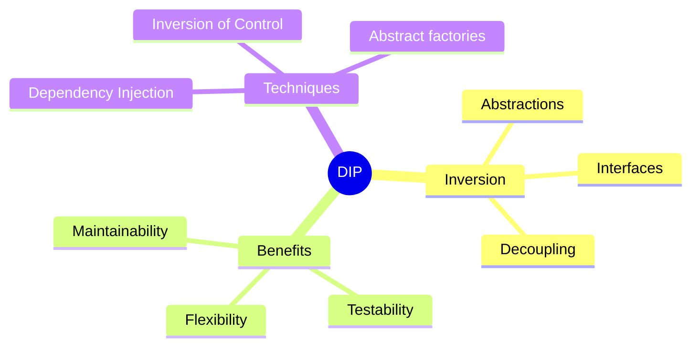
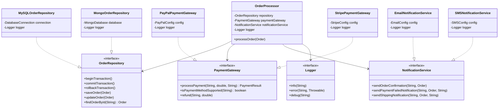

🧑‍💻 **Author:** RK ROY

# Dependency Inversion Principle (DIP)

## 🎯 Definition

> "High-level modules should not depend on low-level modules. **Both should depend on abstractions**. Abstractions should not depend on details. **Details should depend on abstractions**."
>
> _- Robert C. Martin_

The Dependency Inversion Principle reverses the traditional dependency flow by making high-level modules independent of low-level implementation details through **abstractions**.

## 🤔 What Does "Dependency Inversion" Mean?

- **High-Level Modules**: Business logic, policies, and complex operations
- **Low-Level Modules**: Specific implementations, I/O operations, databases, file systems
- **Abstractions**: Interfaces, abstract classes that define contracts
- **Inversion**: Dependencies point toward abstractions, not concrete implementations

### Key Concepts



## ❌ DIP Violation: High-Level Depends on Low-Level

Let's look at a classic example that violates DIP:

```java
// ❌ VIOLATION: High-level module depends directly on low-level modules
public class OrderProcessor {
    private MySQLDatabase database;          // ❌ Depends on concrete implementation
    private EmailService emailService;      // ❌ Depends on concrete implementation
    private PayPalPaymentGateway paymentGateway; // ❌ Depends on concrete implementation

    public OrderProcessor() {
        // ❌ Hard-coded dependencies - tight coupling
        this.database = new MySQLDatabase("localhost", "orders_db");
        this.emailService = new EmailService("smtp.gmail.com", 587);
        this.paymentGateway = new PayPalPaymentGateway("api_key", "secret");
    }

    public void processOrder(Order order) {
        try {
            // Business logic mixed with implementation details

            // ❌ Directly using concrete database
            database.connect();
            database.beginTransaction();
            database.saveOrder(order);

            // ❌ Directly using concrete payment gateway
            PaymentResult result = paymentGateway.processPayment(
                order.getCustomerId(),
                order.getTotalAmount(),
                order.getPaymentMethod()
            );

            if (result.isSuccessful()) {
                order.setStatus(OrderStatus.PAID);
                database.updateOrder(order);
                database.commitTransaction();

                // ❌ Directly using concrete email service
                emailService.sendEmail(
                    order.getCustomerEmail(),
                    "Order Confirmation",
                    "Your order #" + order.getId() + " has been confirmed."
                );
            } else {
                database.rollbackTransaction();
                throw new PaymentFailedException("Payment failed: " + result.getErrorMessage());
            }

        } catch (Exception e) {
            database.rollbackTransaction();
            throw new OrderProcessingException("Failed to process order", e);
        } finally {
            database.disconnect();
        }
    }
}

// ❌ PROBLEM: Concrete low-level implementations
public class MySQLDatabase {
    private String host;
    private String databaseName;
    private Connection connection;

    public MySQLDatabase(String host, String databaseName) {
        this.host = host;
        this.databaseName = databaseName;
    }

    public void connect() {
        // MySQL-specific connection code
        System.out.println("Connecting to MySQL at " + host);
    }

    public void beginTransaction() {
        System.out.println("Beginning MySQL transaction");
    }

    public void saveOrder(Order order) {
        System.out.println("Saving order to MySQL: " + order.getId());
    }

    public void updateOrder(Order order) {
        System.out.println("Updating order in MySQL: " + order.getId());
    }

    public void commitTransaction() {
        System.out.println("Committing MySQL transaction");
    }

    public void rollbackTransaction() {
        System.out.println("Rolling back MySQL transaction");
    }

    public void disconnect() {
        System.out.println("Disconnecting from MySQL");
    }
}

public class PayPalPaymentGateway {
    private String apiKey;
    private String secret;

    public PayPalPaymentGateway(String apiKey, String secret) {
        this.apiKey = apiKey;
        this.secret = secret;
    }

    public PaymentResult processPayment(String customerId, double amount, String paymentMethod) {
        // PayPal-specific payment processing
        System.out.println("Processing PayPal payment: $" + amount);
        return new PaymentResult(true, "Payment successful", "txn_12345");
    }
}

public class EmailService {
    private String smtpHost;
    private int smtpPort;

    public EmailService(String smtpHost, int smtpPort) {
        this.smtpHost = smtpHost;
        this.smtpPort = smtpPort;
    }

    public void sendEmail(String to, String subject, String body) {
        System.out.println("Sending email via " + smtpHost + ":" + smtpPort);
        System.out.println("To: " + to + ", Subject: " + subject);
    }
}
```

### Problems with This Design

1. **Tight Coupling**: High-level logic tied to specific implementations
2. **Hard to Test**: Cannot easily mock dependencies
3. **Inflexible**: Cannot switch implementations without code changes
4. **Violation of OCP**: Adding new implementations requires modifying existing code
5. **Configuration Issues**: Hard-coded configuration values

## ✅ DIP Solution: Depend on Abstractions

Let's refactor using dependency inversion:

### 1. Define Abstractions (Interfaces)

```java
// ✅ GOOD: Abstract interface for database operations
public interface OrderRepository {
    void beginTransaction();
    void commitTransaction();
    void rollbackTransaction();
    void saveOrder(Order order);
    void updateOrder(Order order);
    Order findOrderById(String orderId);
}

// ✅ GOOD: Abstract interface for payment processing
public interface PaymentGateway {
    PaymentResult processPayment(String customerId, double amount, String paymentMethod);
    boolean isPaymentMethodSupported(String paymentMethod);
    void refund(String transactionId, double amount);
}

// ✅ GOOD: Abstract interface for notification services
public interface NotificationService {
    void sendOrderConfirmation(String customerEmail, Order order);
    void sendPaymentFailedNotification(String customerEmail, Order order, String reason);
    void sendShippingNotification(String customerEmail, Order order, String trackingNumber);
}

// ✅ GOOD: Abstract interface for logging
public interface Logger {
    void info(String message);
    void error(String message, Throwable throwable);
    void debug(String message);
}
```

### 2. High-Level Module Depends on Abstractions

```java
// ✅ GOOD: High-level module depends only on abstractions
public class OrderProcessor {
    private final OrderRepository orderRepository;
    private final PaymentGateway paymentGateway;
    private final NotificationService notificationService;
    private final Logger logger;

    // ✅ Dependencies injected through constructor
    public OrderProcessor(OrderRepository orderRepository,
                         PaymentGateway paymentGateway,
                         NotificationService notificationService,
                         Logger logger) {
        this.orderRepository = orderRepository;
        this.paymentGateway = paymentGateway;
        this.notificationService = notificationService;
        this.logger = logger;
    }

    public void processOrder(Order order) {
        logger.info("Processing order: " + order.getId());

        try {
            orderRepository.beginTransaction();

            // Save order
            orderRepository.saveOrder(order);
            logger.info("Order saved: " + order.getId());

            // Process payment
            PaymentResult result = paymentGateway.processPayment(
                order.getCustomerId(),
                order.getTotalAmount(),
                order.getPaymentMethod()
            );

            if (result.isSuccessful()) {
                // Update order status
                order.setStatus(OrderStatus.PAID);
                order.setTransactionId(result.getTransactionId());
                orderRepository.updateOrder(order);

                orderRepository.commitTransaction();
                logger.info("Order payment successful: " + order.getId());

                // Send confirmation
                notificationService.sendOrderConfirmation(order.getCustomerEmail(), order);

            } else {
                orderRepository.rollbackTransaction();
                logger.error("Payment failed for order: " + order.getId() +
                           ", Reason: " + result.getErrorMessage(), null);

                // Send payment failed notification
                notificationService.sendPaymentFailedNotification(
                    order.getCustomerEmail(), order, result.getErrorMessage());

                throw new PaymentFailedException("Payment failed: " + result.getErrorMessage());
            }

        } catch (Exception e) {
            orderRepository.rollbackTransaction();
            logger.error("Failed to process order: " + order.getId(), e);
            throw new OrderProcessingException("Failed to process order", e);
        }
    }
}
```

### 3. Low-Level Modules Implement Abstractions

```java
// ✅ GOOD: MySQL implementation of the abstraction
public class MySQLOrderRepository implements OrderRepository {
    private final DatabaseConnection connection;
    private final Logger logger;

    public MySQLOrderRepository(DatabaseConnection connection, Logger logger) {
        this.connection = connection;
        this.logger = logger;
    }

    @Override
    public void beginTransaction() {
        connection.beginTransaction();
        logger.debug("MySQL transaction started");
    }

    @Override
    public void commitTransaction() {
        connection.commit();
        logger.debug("MySQL transaction committed");
    }

    @Override
    public void rollbackTransaction() {
        connection.rollback();
        logger.debug("MySQL transaction rolled back");
    }

    @Override
    public void saveOrder(Order order) {
        String sql = "INSERT INTO orders (id, customer_id, amount, status) VALUES (?, ?, ?, ?)";
        connection.executeUpdate(sql, order.getId(), order.getCustomerId(),
                               order.getTotalAmount(), order.getStatus().toString());
        logger.debug("Order saved to MySQL: " + order.getId());
    }

    @Override
    public void updateOrder(Order order) {
        String sql = "UPDATE orders SET status = ?, transaction_id = ? WHERE id = ?";
        connection.executeUpdate(sql, order.getStatus().toString(),
                               order.getTransactionId(), order.getId());
        logger.debug("Order updated in MySQL: " + order.getId());
    }

    @Override
    public Order findOrderById(String orderId) {
        String sql = "SELECT * FROM orders WHERE id = ?";
        return connection.queryForObject(sql, Order.class, orderId);
    }
}

// ✅ GOOD: Alternative MongoDB implementation
public class MongoOrderRepository implements OrderRepository {
    private final MongoDatabase database;
    private final Logger logger;

    public MongoOrderRepository(MongoDatabase database, Logger logger) {
        this.database = database;
        this.logger = logger;
    }

    @Override
    public void beginTransaction() {
        database.startSession();
        logger.debug("MongoDB session started");
    }

    @Override
    public void commitTransaction() {
        database.commitTransaction();
        logger.debug("MongoDB transaction committed");
    }

    @Override
    public void rollbackTransaction() {
        database.abortTransaction();
        logger.debug("MongoDB transaction aborted");
    }

    @Override
    public void saveOrder(Order order) {
        database.getCollection("orders").insertOne(orderToDocument(order));
        logger.debug("Order saved to MongoDB: " + order.getId());
    }

    @Override
    public void updateOrder(Order order) {
        database.getCollection("orders")
               .updateOne(eq("_id", order.getId()), orderToDocument(order));
        logger.debug("Order updated in MongoDB: " + order.getId());
    }

    @Override
    public Order findOrderById(String orderId) {
        Document doc = database.getCollection("orders")
                              .find(eq("_id", orderId))
                              .first();
        return documentToOrder(doc);
    }

    private Document orderToDocument(Order order) {
        // Convert Order to MongoDB Document
        return new Document("_id", order.getId())
                   .append("customerId", order.getCustomerId())
                   .append("amount", order.getTotalAmount())
                   .append("status", order.getStatus().toString());
    }

    private Order documentToOrder(Document doc) {
        // Convert MongoDB Document to Order
        return new Order(doc.getString("_id"),
                        doc.getString("customerId"),
                        doc.getDouble("amount"));
    }
}

// ✅ GOOD: PayPal implementation
public class PayPalPaymentGateway implements PaymentGateway {
    private final PayPalConfig config;
    private final Logger logger;

    public PayPalPaymentGateway(PayPalConfig config, Logger logger) {
        this.config = config;
        this.logger = logger;
    }

    @Override
    public PaymentResult processPayment(String customerId, double amount, String paymentMethod) {
        logger.info("Processing PayPal payment: $" + amount + " for customer: " + customerId);

        try {
            // PayPal-specific payment logic
            String transactionId = "pp_" + System.currentTimeMillis();

            // Simulate payment processing
            if (amount > 0 && amount <= config.getMaxTransactionAmount()) {
                return new PaymentResult(true, "Payment successful", transactionId);
            } else {
                return new PaymentResult(false, "Invalid amount", null);
            }

        } catch (Exception e) {
            logger.error("PayPal payment failed", e);
            return new PaymentResult(false, "Payment processing error", null);
        }
    }

    @Override
    public boolean isPaymentMethodSupported(String paymentMethod) {
        return "paypal".equalsIgnoreCase(paymentMethod) ||
               "credit_card".equalsIgnoreCase(paymentMethod);
    }

    @Override
    public void refund(String transactionId, double amount) {
        logger.info("Processing PayPal refund: $" + amount + " for transaction: " + transactionId);
        // PayPal refund logic
    }
}

// ✅ GOOD: Stripe implementation
public class StripePaymentGateway implements PaymentGateway {
    private final StripeConfig config;
    private final Logger logger;

    public StripePaymentGateway(StripeConfig config, Logger logger) {
        this.config = config;
        this.logger = logger;
    }

    @Override
    public PaymentResult processPayment(String customerId, double amount, String paymentMethod) {
        logger.info("Processing Stripe payment: $" + amount + " for customer: " + customerId);

        try {
            // Stripe-specific payment logic
            String transactionId = "st_" + System.currentTimeMillis();

            if (amount > 0) {
                return new PaymentResult(true, "Stripe payment successful", transactionId);
            } else {
                return new PaymentResult(false, "Invalid amount", null);
            }

        } catch (Exception e) {
            logger.error("Stripe payment failed", e);
            return new PaymentResult(false, "Payment processing error", null);
        }
    }

    @Override
    public boolean isPaymentMethodSupported(String paymentMethod) {
        return "stripe".equalsIgnoreCase(paymentMethod) ||
               "credit_card".equalsIgnoreCase(paymentMethod) ||
               "debit_card".equalsIgnoreCase(paymentMethod);
    }

    @Override
    public void refund(String transactionId, double amount) {
        logger.info("Processing Stripe refund: $" + amount + " for transaction: " + transactionId);
        // Stripe refund logic
    }
}

// ✅ GOOD: Email notification implementation
public class EmailNotificationService implements NotificationService {
    private final EmailConfig config;
    private final Logger logger;

    public EmailNotificationService(EmailConfig config, Logger logger) {
        this.config = config;
        this.logger = logger;
    }

    @Override
    public void sendOrderConfirmation(String customerEmail, Order order) {
        logger.info("Sending order confirmation email to: " + customerEmail);

        String subject = "Order Confirmation #" + order.getId();
        String body = buildConfirmationEmail(order);

        sendEmail(customerEmail, subject, body);
    }

    @Override
    public void sendPaymentFailedNotification(String customerEmail, Order order, String reason) {
        logger.info("Sending payment failed email to: " + customerEmail);

        String subject = "Payment Failed - Order #" + order.getId();
        String body = buildPaymentFailedEmail(order, reason);

        sendEmail(customerEmail, subject, body);
    }

    @Override
    public void sendShippingNotification(String customerEmail, Order order, String trackingNumber) {
        logger.info("Sending shipping notification email to: " + customerEmail);

        String subject = "Your Order Has Shipped #" + order.getId();
        String body = buildShippingEmail(order, trackingNumber);

        sendEmail(customerEmail, subject, body);
    }

    private void sendEmail(String to, String subject, String body) {
        // Email sending logic using config
        System.out.printf("Email sent via %s:%d%n", config.getSmtpHost(), config.getSmtpPort());
        System.out.printf("To: %s, Subject: %s%n", to, subject);
    }

    private String buildConfirmationEmail(Order order) {
        return String.format(
            "Dear Customer,%n%nYour order #%s has been confirmed.%nAmount: $%.2f%n%nThank you!",
            order.getId(), order.getTotalAmount()
        );
    }

    private String buildPaymentFailedEmail(Order order, String reason) {
        return String.format(
            "Dear Customer,%n%nPayment for order #%s failed.%nReason: %s%n%nPlease try again.",
            order.getId(), reason
        );
    }

    private String buildShippingEmail(Order order, String trackingNumber) {
        return String.format(
            "Dear Customer,%n%nYour order #%s has shipped.%nTracking: %s%n%nThank you!",
            order.getId(), trackingNumber
        );
    }
}

// ✅ GOOD: SMS notification implementation
public class SMSNotificationService implements NotificationService {
    private final SMSConfig config;
    private final Logger logger;

    public SMSNotificationService(SMSConfig config, Logger logger) {
        this.config = config;
        this.logger = logger;
    }

    @Override
    public void sendOrderConfirmation(String customerEmail, Order order) {
        String phoneNumber = lookupPhoneNumber(customerEmail);
        if (phoneNumber != null) {
            String message = "Order #" + order.getId() + " confirmed. Amount: $" + order.getTotalAmount();
            sendSMS(phoneNumber, message);
        }
    }

    @Override
    public void sendPaymentFailedNotification(String customerEmail, Order order, String reason) {
        String phoneNumber = lookupPhoneNumber(customerEmail);
        if (phoneNumber != null) {
            String message = "Payment failed for order #" + order.getId() + ". Reason: " + reason;
            sendSMS(phoneNumber, message);
        }
    }

    @Override
    public void sendShippingNotification(String customerEmail, Order order, String trackingNumber) {
        String phoneNumber = lookupPhoneNumber(customerEmail);
        if (phoneNumber != null) {
            String message = "Order #" + order.getId() + " shipped. Tracking: " + trackingNumber;
            sendSMS(phoneNumber, message);
        }
    }

    private void sendSMS(String phoneNumber, String message) {
        logger.info("Sending SMS to: " + phoneNumber);
        System.out.println("SMS sent to " + phoneNumber + ": " + message);
    }

    private String lookupPhoneNumber(String email) {
        // Look up phone number by email
        return "+1234567890"; // Simplified for demo
    }
}
```

## 🏗️ Class Diagram After DIP



## 🎯 Dependency Injection and IoC Container

### 1. Manual Dependency Injection

```java
public class OrderProcessingApplication {
    public static void main(String[] args) {
        // ✅ Create configuration objects
        DatabaseConfig dbConfig = new DatabaseConfig("localhost", "orders_db");
        PayPalConfig paypalConfig = new PayPalConfig("api_key", "secret");
        EmailConfig emailConfig = new EmailConfig("smtp.gmail.com", 587);

        // ✅ Create logger
        Logger logger = new FileLogger("app.log");

        // ✅ Create low-level dependencies
        OrderRepository orderRepository = new MySQLOrderRepository(
            new DatabaseConnection(dbConfig), logger);

        PaymentGateway paymentGateway = new PayPalPaymentGateway(paypalConfig, logger);

        NotificationService notificationService = new EmailNotificationService(
            emailConfig, logger);

        // ✅ Inject dependencies into high-level module
        OrderProcessor orderProcessor = new OrderProcessor(
            orderRepository, paymentGateway, notificationService, logger);

        // ✅ Use the fully configured system
        Order order = new Order("ORD-001", "CUST-123", 99.99);
        order.setCustomerEmail("customer@example.com");
        order.setPaymentMethod("paypal");

        orderProcessor.processOrder(order);
    }
}
```

### 2. Configuration-Based Injection

```java
// ✅ Configuration class for dependency setup
public class ApplicationConfiguration {
    private final Properties config;

    public ApplicationConfiguration(String configFile) {
        this.config = loadConfiguration(configFile);
    }

    public OrderProcessor createOrderProcessor() {
        Logger logger = createLogger();
        OrderRepository repository = createOrderRepository(logger);
        PaymentGateway paymentGateway = createPaymentGateway(logger);
        NotificationService notificationService = createNotificationService(logger);

        return new OrderProcessor(repository, paymentGateway, notificationService, logger);
    }

    private Logger createLogger() {
        String logType = config.getProperty("logger.type", "file");
        String logPath = config.getProperty("logger.path", "app.log");

        switch (logType.toLowerCase()) {
            case "console":
                return new ConsoleLogger();
            case "file":
                return new FileLogger(logPath);
            default:
                return new ConsoleLogger();
        }
    }

    private OrderRepository createOrderRepository(Logger logger) {
        String dbType = config.getProperty("database.type", "mysql");

        switch (dbType.toLowerCase()) {
            case "mysql":
                return new MySQLOrderRepository(createDatabaseConnection(), logger);
            case "mongodb":
                return new MongoOrderRepository(createMongoDatabase(), logger);
            case "inmemory":
                return new InMemoryOrderRepository(logger);
            default:
                return new MySQLOrderRepository(createDatabaseConnection(), logger);
        }
    }

    private PaymentGateway createPaymentGateway(Logger logger) {
        String gatewayType = config.getProperty("payment.gateway", "paypal");

        switch (gatewayType.toLowerCase()) {
            case "paypal":
                PayPalConfig paypalConfig = new PayPalConfig(
                    config.getProperty("paypal.api_key"),
                    config.getProperty("paypal.secret")
                );
                return new PayPalPaymentGateway(paypalConfig, logger);
            case "stripe":
                StripeConfig stripeConfig = new StripeConfig(
                    config.getProperty("stripe.api_key"),
                    config.getProperty("stripe.secret")
                );
                return new StripePaymentGateway(stripeConfig, logger);
            default:
                return new MockPaymentGateway(logger);
        }
    }

    private NotificationService createNotificationService(Logger logger) {
        String notificationType = config.getProperty("notification.type", "email");

        switch (notificationType.toLowerCase()) {
            case "email":
                EmailConfig emailConfig = new EmailConfig(
                    config.getProperty("email.smtp.host"),
                    Integer.parseInt(config.getProperty("email.smtp.port"))
                );
                return new EmailNotificationService(emailConfig, logger);
            case "sms":
                SMSConfig smsConfig = new SMSConfig(
                    config.getProperty("sms.api_key"),
                    config.getProperty("sms.endpoint")
                );
                return new SMSNotificationService(smsConfig, logger);
            default:
                return new EmailNotificationService(createDefaultEmailConfig(), logger);
        }
    }

    private Properties loadConfiguration(String configFile) {
        // Load configuration from file
        Properties props = new Properties();
        try (InputStream input = getClass().getClassLoader().getResourceAsStream(configFile)) {
            props.load(input);
        } catch (IOException e) {
            throw new RuntimeException("Failed to load configuration", e);
        }
        return props;
    }

    // Other factory methods...
}

// Usage
public class Main {
    public static void main(String[] args) {
        ApplicationConfiguration config = new ApplicationConfiguration("application.properties");
        OrderProcessor processor = config.createOrderProcessor();

        // Process orders
        Order order = new Order("ORD-001", "CUST-123", 149.99);
        processor.processOrder(order);
    }
}
```

### 3. Simple IoC Container

```java
// ✅ Simple IoC Container implementation
public class DIContainer {
    private final Map<Class<?>, Object> instances = new HashMap<>();
    private final Map<Class<?>, Class<?>> bindings = new HashMap<>();

    // Bind interface to implementation
    public <T> void bind(Class<T> interfaceType, Class<? extends T> implementationType) {
        bindings.put(interfaceType, implementationType);
    }

    // Register singleton instance
    public <T> void registerSingleton(Class<T> type, T instance) {
        instances.put(type, instance);
    }

    // Get instance (with dependency injection)
    @SuppressWarnings("unchecked")
    public <T> T getInstance(Class<T> type) {
        // Check if singleton exists
        if (instances.containsKey(type)) {
            return (T) instances.get(type);
        }

        // Check if binding exists
        Class<?> implementationType = bindings.get(type);
        if (implementationType == null) {
            implementationType = type;
        }

        try {
            // Find constructor and inject dependencies
            Constructor<?>[] constructors = implementationType.getConstructors();
            if (constructors.length == 0) {
                throw new RuntimeException("No public constructor found for " + implementationType);
            }

            Constructor<?> constructor = constructors[0];
            Class<?>[] paramTypes = constructor.getParameterTypes();
            Object[] args = new Object[paramTypes.length];

            // Recursively resolve dependencies
            for (int i = 0; i < paramTypes.length; i++) {
                args[i] = getInstance(paramTypes[i]);
            }

            T instance = (T) constructor.newInstance(args);

            // Cache singleton if needed
            instances.put(type, instance);

            return instance;

        } catch (Exception e) {
            throw new RuntimeException("Failed to create instance of " + type, e);
        }
    }
}

// Usage
public class DIExample {
    public static void main(String[] args) {
        DIContainer container = new DIContainer();

        // Configure bindings
        container.bind(Logger.class, FileLogger.class);
        container.bind(OrderRepository.class, MySQLOrderRepository.class);
        container.bind(PaymentGateway.class, PayPalPaymentGateway.class);
        container.bind(NotificationService.class, EmailNotificationService.class);

        // Register configured instances
        container.registerSingleton(DatabaseConnection.class,
            new DatabaseConnection(new DatabaseConfig("localhost", "orders")));
        container.registerSingleton(PayPalConfig.class,
            new PayPalConfig("api_key", "secret"));
        container.registerSingleton(EmailConfig.class,
            new EmailConfig("smtp.example.com", 587));

        // Get fully injected instance
        OrderProcessor processor = container.getInstance(OrderProcessor.class);

        // Use the processor
        Order order = new Order("ORD-001", "CUST-123", 199.99);
        processor.processOrder(order);
    }
}
```

## 🎨 More DIP Examples

### Example 1: File Processing System

#### ❌ Violation

```java
// ❌ VIOLATION: High-level logic depends on specific file format
public class DocumentProcessor {
    private PDFReader pdfReader;
    private XMLWriter xmlWriter;
    private MySQLDatabase database;

    public DocumentProcessor() {
        this.pdfReader = new PDFReader();
        this.xmlWriter = new XMLWriter();
        this.database = new MySQLDatabase("localhost", "docs");
    }

    public void processDocument(String inputFile, String outputFile) {
        // ❌ Tightly coupled to PDF and XML
        Document doc = pdfReader.read(inputFile);
        doc.setProcessedDate(new Date());

        xmlWriter.write(doc, outputFile);
        database.saveDocument(doc);
    }
}
```

#### ✅ Solution

```java
// ✅ GOOD: Abstract interfaces
public interface DocumentReader {
    Document read(String filePath);
    boolean supports(String fileExtension);
}

public interface DocumentWriter {
    void write(Document document, String filePath);
    boolean supports(String fileExtension);
}

public interface DocumentRepository {
    void save(Document document);
    Document findById(String id);
    List<Document> findByType(String type);
}

// ✅ GOOD: High-level module depends on abstractions
public class DocumentProcessor {
    private final DocumentReader reader;
    private final DocumentWriter writer;
    private final DocumentRepository repository;
    private final Logger logger;

    public DocumentProcessor(DocumentReader reader,
                           DocumentWriter writer,
                           DocumentRepository repository,
                           Logger logger) {
        this.reader = reader;
        this.writer = writer;
        this.repository = repository;
        this.logger = logger;
    }

    public void processDocument(String inputFile, String outputFile) {
        try {
            logger.info("Processing document: " + inputFile);

            Document doc = reader.read(inputFile);
            doc.setProcessedDate(new Date());
            doc.setStatus(DocumentStatus.PROCESSED);

            writer.write(doc, outputFile);
            repository.save(doc);

            logger.info("Document processed successfully: " + doc.getId());

        } catch (Exception e) {
            logger.error("Failed to process document: " + inputFile, e);
            throw new DocumentProcessingException("Processing failed", e);
        }
    }
}

// ✅ GOOD: Specific implementations
public class PDFDocumentReader implements DocumentReader {
    @Override
    public Document read(String filePath) {
        System.out.println("Reading PDF: " + filePath);
        // PDF reading logic
        return new Document("pdf_doc", "PDF Content", DocumentType.PDF);
    }

    @Override
    public boolean supports(String fileExtension) {
        return "pdf".equalsIgnoreCase(fileExtension);
    }
}

public class WordDocumentReader implements DocumentReader {
    @Override
    public Document read(String filePath) {
        System.out.println("Reading Word document: " + filePath);
        // Word document reading logic
        return new Document("word_doc", "Word Content", DocumentType.WORD);
    }

    @Override
    public boolean supports(String fileExtension) {
        return "docx".equalsIgnoreCase(fileExtension) ||
               "doc".equalsIgnoreCase(fileExtension);
    }
}

public class JSONDocumentWriter implements DocumentWriter {
    @Override
    public void write(Document document, String filePath) {
        System.out.println("Writing JSON to: " + filePath);
        // JSON writing logic
    }

    @Override
    public boolean supports(String fileExtension) {
        return "json".equalsIgnoreCase(fileExtension);
    }
}
```

### Example 2: E-commerce Search

#### ❌ Violation

```java
// ❌ VIOLATION: Search service depends on specific implementations
public class ProductSearchService {
    private ElasticsearchClient elasticsearchClient;
    private RedisCache redisCache;
    private MySQLDatabase database;

    public ProductSearchService() {
        this.elasticsearchClient = new ElasticsearchClient("localhost:9200");
        this.redisCache = new RedisCache("localhost:6379");
        this.database = new MySQLDatabase("localhost", "products");
    }

    public SearchResult searchProducts(String query, SearchOptions options) {
        // ❌ Tightly coupled to specific technologies
        String cacheKey = "search:" + query;

        // Check Redis cache
        SearchResult cached = redisCache.get(cacheKey);
        if (cached != null) {
            return cached;
        }

        // Search in Elasticsearch
        SearchResult result = elasticsearchClient.search(query, options);

        // Cache result in Redis
        redisCache.put(cacheKey, result, 300); // 5 minutes

        // Update search analytics in MySQL
        database.recordSearch(query, result.getTotalHits());

        return result;
    }
}
```

#### ✅ Solution

```java
// ✅ GOOD: Abstract search interfaces
public interface SearchEngine {
    SearchResult search(String query, SearchOptions options);
    void indexProduct(Product product);
    void removeProduct(String productId);
}

public interface CacheService {
    <T> T get(String key, Class<T> type);
    <T> void put(String key, T value, int ttlSeconds);
    void remove(String key);
    boolean exists(String key);
}

public interface SearchAnalytics {
    void recordSearch(String query, int resultCount);
    void recordClick(String query, String productId);
    SearchStats getSearchStats(String query);
}

// ✅ GOOD: High-level service depends on abstractions
public class ProductSearchService {
    private final SearchEngine searchEngine;
    private final CacheService cacheService;
    private final SearchAnalytics analytics;
    private final Logger logger;

    public ProductSearchService(SearchEngine searchEngine,
                               CacheService cacheService,
                               SearchAnalytics analytics,
                               Logger logger) {
        this.searchEngine = searchEngine;
        this.cacheService = cacheService;
        this.analytics = analytics;
        this.logger = logger;
    }

    public SearchResult searchProducts(String query, SearchOptions options) {
        logger.debug("Searching products for query: " + query);

        try {
            String cacheKey = buildCacheKey(query, options);

            // Check cache first
            SearchResult cached = cacheService.get(cacheKey, SearchResult.class);
            if (cached != null) {
                logger.debug("Cache hit for query: " + query);
                analytics.recordSearch(query, cached.getTotalHits());
                return cached;
            }

            // Search using search engine
            SearchResult result = searchEngine.search(query, options);

            // Cache the result
            cacheService.put(cacheKey, result, options.getCacheTTL());

            // Record analytics
            analytics.recordSearch(query, result.getTotalHits());

            logger.info("Search completed for query: " + query +
                       ", results: " + result.getTotalHits());

            return result;

        } catch (Exception e) {
            logger.error("Search failed for query: " + query, e);
            throw new SearchException("Search operation failed", e);
        }
    }

    private String buildCacheKey(String query, SearchOptions options) {
        return String.format("search:%s:%s", query, options.hashCode());
    }
}

// ✅ GOOD: Elasticsearch implementation
public class ElasticsearchSearchEngine implements SearchEngine {
    private final ElasticsearchClient client;
    private final Logger logger;

    public ElasticsearchSearchEngine(ElasticsearchConfig config, Logger logger) {
        this.client = new ElasticsearchClient(config);
        this.logger = logger;
    }

    @Override
    public SearchResult search(String query, SearchOptions options) {
        logger.debug("Elasticsearch search: " + query);

        SearchRequest request = new SearchRequest()
            .query(query)
            .size(options.getPageSize())
            .from(options.getOffset());

        SearchResponse response = client.search(request);

        return new SearchResult(
            response.getHits(),
            response.getTotalHits(),
            options.getPageSize()
        );
    }

    @Override
    public void indexProduct(Product product) {
        logger.debug("Indexing product: " + product.getId());
        client.index("products", product.getId(), product);
    }

    @Override
    public void removeProduct(String productId) {
        logger.debug("Removing product from index: " + productId);
        client.delete("products", productId);
    }
}

// ✅ GOOD: Redis cache implementation
public class RedisCacheService implements CacheService {
    private final RedisClient client;
    private final ObjectMapper objectMapper;
    private final Logger logger;

    public RedisCacheService(RedisConfig config, Logger logger) {
        this.client = new RedisClient(config);
        this.objectMapper = new ObjectMapper();
        this.logger = logger;
    }

    @Override
    public <T> T get(String key, Class<T> type) {
        try {
            String json = client.get(key);
            if (json != null) {
                return objectMapper.readValue(json, type);
            }
        } catch (Exception e) {
            logger.error("Cache get failed for key: " + key, e);
        }
        return null;
    }

    @Override
    public <T> void put(String key, T value, int ttlSeconds) {
        try {
            String json = objectMapper.writeValueAsString(value);
            client.setex(key, ttlSeconds, json);
        } catch (Exception e) {
            logger.error("Cache put failed for key: " + key, e);
        }
    }

    @Override
    public void remove(String key) {
        client.del(key);
    }

    @Override
    public boolean exists(String key) {
        return client.exists(key);
    }
}
```

## 🔍 How to Identify DIP Violations

### Questions to Ask

1. **Does my high-level module depend on concrete low-level modules?**
2. **Are dependencies created (using `new`) inside the class?**
3. **Would changing a low-level implementation require changing high-level code?**
4. **Is it difficult to unit test the class in isolation?**
5. **Are configuration details mixed with business logic?**

### Warning Signs

- ❌ `new` keyword in business logic classes
- ❌ Hard-coded class names and configurations
- ❌ Direct imports of implementation classes
- ❌ Difficult to mock dependencies for testing
- ❌ Changes propagate up the dependency chain

## 🎯 Benefits of Following DIP

### 1. **Flexibility**

```java
// ✅ Easy to switch implementations
public class Main {
    public static void main(String[] args) {
        Logger logger = new ConsoleLogger();

        // Can easily switch between implementations
        OrderRepository repository = isProduction()
            ? new MySQLOrderRepository(createDbConnection(), logger)
            : new InMemoryOrderRepository(logger);

        PaymentGateway gateway = getPaymentProvider().equals("stripe")
            ? new StripePaymentGateway(stripeConfig, logger)
            : new PayPalPaymentGateway(paypalConfig, logger);
    }
}
```

### 2. **Testability**

```java
@Test
public void testOrderProcessing() {
    // ✅ Easy to create mocks for all dependencies
    OrderRepository mockRepository = mock(OrderRepository.class);
    PaymentGateway mockGateway = mock(PaymentGateway.class);
    NotificationService mockNotification = mock(NotificationService.class);
    Logger mockLogger = mock(Logger.class);

    OrderProcessor processor = new OrderProcessor(
        mockRepository, mockGateway, mockNotification, mockLogger);

    // Configure mock behaviors
    when(mockGateway.processPayment(any(), anyDouble(), any()))
        .thenReturn(new PaymentResult(true, "Success", "txn_123"));

    // Test the business logic
    Order order = new Order("ORD-001", "CUST-123", 99.99);
    processor.processOrder(order);

    // Verify interactions
    verify(mockRepository).saveOrder(order);
    verify(mockGateway).processPayment("CUST-123", 99.99, order.getPaymentMethod());
    verify(mockNotification).sendOrderConfirmation(order.getCustomerEmail(), order);
}
```

### 3. **Maintainability**

```java
// ✅ Adding new implementations doesn't affect existing code
public class BlockchainPaymentGateway implements PaymentGateway {
    @Override
    public PaymentResult processPayment(String customerId, double amount, String paymentMethod) {
        // New blockchain payment implementation
        return new PaymentResult(true, "Blockchain payment successful", "bc_" + System.currentTimeMillis());
    }

    // Other methods...
}

// ✅ OrderProcessor doesn't need to change
```

## 🛠️ Refactoring to DIP

### Step-by-Step Process

1. **Identify Dependencies**: Find where high-level modules depend on low-level modules
2. **Extract Abstractions**: Create interfaces for dependencies
3. **Inject Dependencies**: Use constructor injection or setter injection
4. **Create Implementations**: Move concrete implementations behind interfaces
5. **Configure at Startup**: Set up dependency wiring in main method or IoC container
6. **Test**: Verify that dependencies can be easily mocked

### Example Refactoring

```java
// BEFORE: DIP Violation
public class UserService {
    private MySQLUserRepository repository = new MySQLUserRepository();
    private SMTPEmailSender emailSender = new SMTPEmailSender("smtp.example.com");

    public void registerUser(User user) {
        repository.save(user);
        emailSender.sendWelcomeEmail(user.getEmail());
    }
}

// AFTER: Following DIP
public interface UserRepository {
    void save(User user);
    User findByEmail(String email);
}

public interface EmailSender {
    void sendWelcomeEmail(String email);
}

public class UserService {
    private final UserRepository repository;
    private final EmailSender emailSender;

    public UserService(UserRepository repository, EmailSender emailSender) {
        this.repository = repository;
        this.emailSender = emailSender;
    }

    public void registerUser(User user) {
        repository.save(user);
        emailSender.sendWelcomeEmail(user.getEmail());
    }
}

// Configuration
public class ApplicationConfig {
    public UserService createUserService() {
        UserRepository repository = new MySQLUserRepository(createDatabaseConnection());
        EmailSender emailSender = new SMTPEmailSender(createEmailConfig());
        return new UserService(repository, emailSender);
    }
}
```

## 🎓 Practice Exercise

### Exercise: Refactor the Report Generation System

Here's a system that violates DIP. Can you refactor it?

```java
public class ReportGenerator {
    private MySQLDatabase database = new MySQLDatabase("localhost", "reports");
    private ExcelFileWriter excelWriter = new ExcelFileWriter();
    private SMTPEmailSender emailSender = new SMTPEmailSender("mail.company.com", 587);
    private FileSystemStorage storage = new FileSystemStorage("/var/reports");

    public void generateSalesReport(Date startDate, Date endDate) {
        // Get data from MySQL
        List<SaleRecord> sales = database.getSalesData(startDate, endDate);

        // Generate Excel report
        String fileName = "sales_report_" + System.currentTimeMillis() + ".xlsx";
        excelWriter.writeReport(sales, fileName);

        // Store file
        String filePath = storage.store(fileName, excelWriter.getBytes());

        // Email report
        emailSender.sendEmail("manager@company.com",
                            "Sales Report",
                            "Please find attached sales report",
                            filePath);

        System.out.println("Sales report generated: " + filePath);
    }
}
```

### Solution Approach

1. Identify dependencies: Database, FileWriter, EmailSender, Storage
2. Create abstractions for each dependency
3. Inject dependencies through constructor
4. Create configuration class for dependency setup
5. Write tests using mocked dependencies

## 📚 Summary

The Dependency Inversion Principle is about **decoupling high-level business logic from low-level implementation details** through abstractions. By following DIP:

- ✅ **Flexibility**: Easy to swap implementations
- ✅ **Testability**: Dependencies can be easily mocked
- ✅ **Maintainability**: Changes are isolated to specific layers
- ✅ **Reusability**: High-level modules can work with different implementations
- ✅ **Scalability**: System can evolve without breaking existing code

Remember: **Depend on abstractions, not concretions!**

The key techniques for implementing DIP are:

- **Dependency Injection**: Provide dependencies from outside
- **Inversion of Control**: Let a container manage dependencies
- **Interface Segregation**: Create focused, role-based abstractions
- **Configuration**: Centralize dependency setup

DIP is the foundation that makes all other SOLID principles work together effectively, creating a flexible and maintainable codebase.

---
