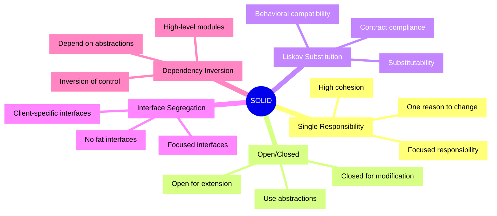
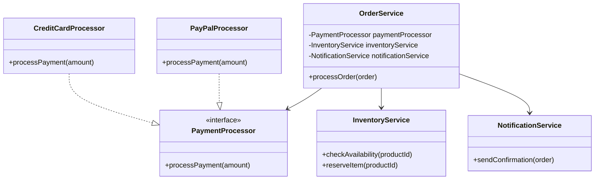

🧑‍💻 **Author:** RK ROY

# 🏗️ SOLID Principles

The SOLID principles are five fundamental design principles that help create maintainable, flexible, and robust object-oriented software. These principles were popularized by Robert C. Martin (Uncle Bob) and form the foundation of clean code and good software design.

## 🎯 Overview

**SOLID** is an acronym for:

- **S** - Single Responsibility Principle (SRP)
- **O** - Open/Closed Principle (OCP)
- **L** - Liskov Substitution Principle (LSP)
- **I** - Interface Segregation Principle (ISP)
- **D** - Dependency Inversion Principle (DIP)

## 📚 The SOLID Principles



## 🎭 Why SOLID Principles Matter

### ✅ Benefits

- **Maintainability**: Easier to understand, modify, and extend
- **Flexibility**: Adaptable to changing requirements
- **Testability**: Easier to write unit tests
- **Reusability**: Components can be reused across different contexts
- **Reduced Coupling**: Less interdependence between components
- **Better Design**: Leads to cleaner, more organized code

### ❌ Problems They Solve

- **Rigid Code**: Hard to change without breaking other parts
- **Fragile Code**: Small changes cause unexpected failures
- **Immobile Code**: Difficult to reuse in different contexts
- **Complex Dependencies**: Tightly coupled components
- **Difficult Testing**: Hard to isolate and test components

## 🚀 Learning Path

### Beginner Approach

1. **Start with SRP**: Understand single responsibility
2. **Learn OCP**: Practice extending without modifying
3. **Master LSP**: Understand proper inheritance
4. **Apply ISP**: Create focused interfaces
5. **Implement DIP**: Use dependency injection

### Practice Strategy

- Read each principle thoroughly
- Understand the problem it solves
- Study the examples (both good and bad)
- Practice with the provided exercises
- Apply to your own projects

## 📖 Detailed Sections

### 1. [Single Responsibility Principle (SRP)](./01-srp.md)

> A class should have only one reason to change.

**Key Concepts:**

- One responsibility per class
- High cohesion
- Separation of concerns

### 2. [Open/Closed Principle (OCP)](./02-ocp.md)

> Software entities should be open for extension but closed for modification.

**Key Concepts:**

- Extension through inheritance/composition
- Abstraction and polymorphism
- Plugin architectures

### 3. [Liskov Substitution Principle (LSP)](./03-lsp.md)

> Objects of a superclass should be replaceable with objects of its subclasses.

**Key Concepts:**

- Behavioral substitutability
- Contract compliance
- Proper inheritance hierarchies

### 4. [Interface Segregation Principle (ISP)](./04-isp.md)

> Clients should not be forced to depend on interfaces they don't use.

**Key Concepts:**

- Focused interfaces
- Role-based design
- Avoiding fat interfaces

### 5. [Dependency Inversion Principle (DIP)](./05-dip.md)

> High-level modules should not depend on low-level modules. Both should depend on abstractions.

**Key Concepts:**

- Dependency injection
- Inversion of control
- Abstraction layers

## 🛠️ Practical Application

### SOLID in Action: E-commerce Example

Let's see how SOLID principles work together in a real system:



This design follows all SOLID principles:

- **SRP**: Each class has a single responsibility
- **OCP**: New payment methods can be added without modifying OrderService
- **LSP**: All payment processors are interchangeable
- **ISP**: Interfaces are focused and specific
- **DIP**: OrderService depends on abstractions, not concrete classes

## 🎯 Common Violations and Solutions

### Violation Example: God Class

```java
// ❌ Violates SRP, hard to maintain
public class User {
    private String name;
    private String email;

    // Database operations
    public void saveToDatabase() { ... }
    public void deleteFromDatabase() { ... }

    // Email operations
    public void sendEmail() { ... }
    public void validateEmail() { ... }

    // Authentication
    public boolean authenticate(String password) { ... }
    public void generateToken() { ... }

    // Logging
    public void logActivity() { ... }
}
```

### SOLID Solution: Separated Responsibilities

```java
// ✅ Follows SOLID principles
public class User {
    private String name;
    private String email;
    // Only user data and basic operations
}

public class UserRepository {
    public void save(User user) { ... }
    public void delete(User user) { ... }
}

public class EmailService {
    public void sendEmail(User user, String message) { ... }
    public boolean isValidEmail(String email) { ... }
}

public class AuthenticationService {
    public boolean authenticate(User user, String password) { ... }
    public String generateToken(User user) { ... }
}
```

## 📊 SOLID Principles Comparison

| Principle | Focus            | Main Benefit    | Common Violation        |
| --------- | ---------------- | --------------- | ----------------------- |
| **SRP**   | Responsibility   | Maintainability | God classes             |
| **OCP**   | Extension        | Flexibility     | Modifying existing code |
| **LSP**   | Substitution     | Reliability     | Breaking contracts      |
| **ISP**   | Interface Design | Decoupling      | Fat interfaces          |
| **DIP**   | Dependencies     | Testability     | Tight coupling          |

## 🏆 Best Practices

### General Guidelines

1. **Start Simple**: Don't over-engineer initially
2. **Refactor Regularly**: Apply SOLID principles during refactoring
3. **Use Design Patterns**: Many patterns implement SOLID principles
4. **Write Tests**: SOLID code is easier to test
5. **Code Reviews**: Use SOLID as evaluation criteria

### Red Flags to Watch For

- ❌ Classes with multiple responsibilities
- ❌ Modifying existing classes for new features
- ❌ Subclasses that can't replace parent classes
- ❌ Interfaces with too many methods
- ❌ High-level classes depending on low-level details

## 🎓 Exercises and Practice

### Exercise 1: Identify Violations

Review existing code and identify SOLID principle violations.

### Exercise 2: Refactor Legacy Code

Take a poorly designed class and refactor it to follow SOLID principles.

### Exercise 3: Design from Scratch

Design a new feature using SOLID principles from the beginning.

### Exercise 4: Pattern Application

Implement common design patterns that demonstrate SOLID principles.

## 🔗 Related Concepts

- **Design Patterns**: Many patterns implement SOLID principles
- **Clean Architecture**: Built on SOLID foundation
- **Test-Driven Development**: Easier with SOLID code
- **Dependency Injection**: Implements DIP
- **Interface-Based Programming**: Supports OCP and DIP

## 📚 Further Reading

- "Clean Code" by Robert C. Martin
- "Agile Software Development, Principles, Patterns, and Practices" by Robert C. Martin
- "Design Patterns: Elements of Reusable Object-Oriented Software" by Gang of Four

---

## 🚀 Getting Started

Ready to dive deep into SOLID principles? Start with the [Single Responsibility Principle](./01-srp.md) and work your way through each principle systematically.

Remember: SOLID principles are guidelines, not rigid rules. Use them to create better software, but don't over-engineer solutions.
