🧑‍💻 **Author:** RK ROY

# 🔒 Singleton Pattern

> **Ensure a class has only one instance and provide a global point of access to it.**

[](https://github.com)
[](https://github.com)
[](https://github.com)

## 📋 Table of Contents

- [🎯 Intent](#-intent)
- [🚀 Problem & Solution](#-problem--solution)
- [🏗️ Structure](#️-structure)
- [💻 Implementation](#-implementation)
- [🌟 Real-World Examples](#-real-world-examples)
- [✅ Best Practices](#-best-practices)
- [❌ Common Pitfalls](#-common-pitfalls)
- [🎤 Interview Questions](#-interview-questions)

## 🎯 Intent

The Singleton pattern restricts the instantiation of a class to **one single instance**. This is useful when exactly one object is needed to coordinate actions across the system.

### Key Characteristics

- ✅ **Single Instance**: Only one instance exists throughout the application lifecycle
- ✅ **Global Access**: Provides a global access point to the instance
- ✅ **Lazy Initialization**: Instance created only when first requested
- ✅ **Thread Safety**: Handles concurrent access properly

## 🚀 Problem & Solution

### 🚨 Problem

Consider these scenarios:

- **Database Connection Pool**: Multiple connections would waste resources
- **Logger**: Multiple loggers would create file conflicts
- **Configuration Manager**: Inconsistent settings across the application
- **Print Spooler**: Multiple spoolers would cause print job conflicts

### 💡 Solution

<div align = "center">


</div>

## 🏗️ Structure

### UML Class Diagram

<div align = "center">


</div>

### Sequence Diagram


## 💻 Implementation

### 1. 🔰 Basic Thread-Safe Implementation (Java)

```java path=null start=null
public class Singleton {
    // Volatile ensures visibility across threads
    private static volatile Singleton instance;

    // Private constructor prevents instantiation
    private Singleton() {
        // Prevent reflection attacks
        if (instance != null) {
            throw new RuntimeException("Use getInstance() method to create instance");
        }
    }

    // Double-checked locking for thread safety
    public static Singleton getInstance() {
        if (instance == null) {
            synchronized (Singleton.class) {
                if (instance == null) {
                    instance = new Singleton();
                }
            }
        }
        return instance;
    }

    // Business methods
    public void doSomething() {
        System.out.println("Doing something...");
    }
}
```

### 2. 🚀 Enum-Based Implementation (Java)

```java path=null start=null
public enum SingletonEnum {
    INSTANCE;

    private String data;

    public void setData(String data) {
        this.data = data;
    }

    public String getData() {
        return data;
    }

    public void doSomething() {
        System.out.println("Enum singleton doing: " + data);
    }
}

// Usage
SingletonEnum.INSTANCE.setData("Hello World");
SingletonEnum.INSTANCE.doSomething();
```

## 🌟 Real-World Examples

### 1. 🗄️ Database Connection Manager

```java path=null start=null
public class DatabaseManager {
    private static volatile DatabaseManager instance;
    private Connection connection;
    private String url = "jdbc:mysql://localhost:3306/mydb";

    private DatabaseManager() {
        try {
            this.connection = DriverManager.getConnection(url, "user", "password");
        } catch (SQLException e) {
            throw new RuntimeException("Failed to create database connection", e);
        }
    }

    public static DatabaseManager getInstance() {
        if (instance == null) {
            synchronized (DatabaseManager.class) {
                if (instance == null) {
                    instance = new DatabaseManager();
                }
            }
        }
        return instance;
    }

    public Connection getConnection() {
        return connection;
    }

    public void executeQuery(String query) {
        try (Statement stmt = connection.createStatement()) {
            ResultSet rs = stmt.executeQuery(query);
            // Process results...
        } catch (SQLException e) {
            e.printStackTrace();
        }
    }
}
```

### 2. 📝 Logger Implementation

```java path=null start=null
public class Logger {
    private static volatile Logger instance;
    private PrintWriter writer;

    private Logger() {
        try {
            writer = new PrintWriter(new FileWriter("application.log", true));
        } catch (IOException e) {
            throw new RuntimeException("Cannot create logger", e);
        }
    }

    public static Logger getInstance() {
        if (instance == null) {
            synchronized (Logger.class) {
                if (instance == null) {
                    instance = new Logger();
                }
            }
        }
        return instance;
    }

    public void log(LogLevel level, String message) {
        String timestamp = LocalDateTime.now().format(DateTimeFormatter.ISO_LOCAL_DATE_TIME);
        String logEntry = String.format("[%s] %s: %s", timestamp, level, message);

        synchronized (writer) {
            writer.println(logEntry);
            writer.flush();
        }

        System.out.println(logEntry);
    }

    public enum LogLevel {
        DEBUG, INFO, WARN, ERROR
    }
}

// Usage
Logger.getInstance().log(Logger.LogLevel.INFO, "Application started");
Logger.getInstance().log(Logger.LogLevel.ERROR, "Something went wrong");
```

## ✅ Best Practices

### 🎯 Do's

- ✅ **Use double-checked locking** for thread safety
- ✅ **Make constructor private** to prevent direct instantiation
- ✅ **Handle serialization properly** if needed
- ✅ **Consider using enum** in Java for simplicity
- ✅ **Document thread-safety guarantees**
- ✅ **Handle exceptions in constructor** properly

### 📊 Thread Safety Comparison

```mermaid
%%{init: {'theme': 'default'}}%%
graph TD
    A[Singleton Implementations] --> B[Eager Initialization]
    A --> C[Lazy Initialization]
    A --> D[Double-Checked Locking]
    A --> E[Enum-based]

    B --> B1["✅ Thread-safe\n❌ Memory waste"]
    C --> C1["❌ Not thread-safe\n✅ Memory efficient"]
    D --> D1["✅ Thread-safe\n✅ Memory efficient\n❌ Complex"]
    E --> E1["✅ Thread-safe\n✅ Simple\n✅ Serialization-safe"]

    style B1 fill:#fff3cd
    style C1 fill:#f8d7da
    style D1 fill:#d4edda
    style E1 fill:#d1ecf1
```



## ❌ Common Pitfalls

### 🚨 Anti-Patterns to Avoid

1. **Breaking Singleton with Reflection**

```java path=null start=null
// BAD: This breaks singleton
Constructor<Singleton> constructor = Singleton.class.getDeclaredConstructor();
constructor.setAccessible(true);
Singleton instance1 = constructor.newInstance();
Singleton instance2 = constructor.newInstance();
// instance1 != instance2 ❌
```

2. **Serialization Issues**

```java path=null start=null
// PROBLEM: Deserialization creates new instance
public class Singleton implements Serializable {
    // ... singleton implementation

    // SOLUTION: Override readResolve()
    protected Object readResolve() {
        return getInstance();
    }
}
```

3. **Multithreading Issues**

```java path=null start=null
// BAD: Race condition
public static Singleton getInstance() {
    if (instance == null) {  // Thread 1 checks
        instance = new Singleton();  // Thread 2 also creates!
    }
    return instance;
}
```

### 🔧 Testing Challenges

```java path=null start=null
// PROBLEM: Hard to test due to global state
@Test
public void testSingleton() {
    Singleton s1 = Singleton.getInstance();
    s1.setValue("test1");

    // This test might fail if another test modified the singleton
    assertEquals("test1", s1.getValue());
}

// SOLUTION: Reset method for testing (not recommended for production)
public void resetForTesting() {
    if (isTestEnvironment()) {
        instance = null;
    }
}
```

## 🎤 Interview Questions

### 📝 Fundamental Questions

**Q1: What is the Singleton pattern and when would you use it?**

**A:** The Singleton pattern ensures a class has only one instance and provides global access to it. Use it for:

- Database connections
- Loggers
- Configuration managers
- Thread pools
- Caches

**Q2: How do you make Singleton thread-safe?**

**A:** Several approaches:

```java path=null start=null
// 1. Synchronized method (performance impact)
public static synchronized Singleton getInstance() { ... }

// 2. Double-checked locking (recommended)
public static Singleton getInstance() {
    if (instance == null) {
        synchronized (Singleton.class) {
            if (instance == null) {
                instance = new Singleton();
            }
        }
    }
    return instance;
}

// 3. Enum-based (best approach)
public enum Singleton {
    INSTANCE;
    // methods...
}
```

### 🚀 Advanced Questions

**Q3: What are the problems with Singleton pattern?**

**A:**

- **Testing difficulties**: Hard to mock, global state
- **Violation of Single Responsibility**: Class controls its creation and behavior
- **Hidden dependencies**: Dependencies not clear from constructor
- **Concurrency issues**: If not implemented properly
- **Serialization problems**: Can create multiple instances

**Q4: How would you break a Singleton?**

**A:**

```java path=null start=null
// 1. Reflection
Constructor<Singleton> constructor = Singleton.class.getDeclaredConstructor();
constructor.setAccessible(true);
Singleton broken = constructor.newInstance();

// 2. Serialization/Deserialization
ObjectOutputStream out = new ObjectOutputStream(new FileOutputStream("singleton.ser"));
out.writeObject(Singleton.getInstance());
ObjectInputStream in = new ObjectInputStream(new FileInputStream("singleton.ser"));
Singleton deserializedSingleton = (Singleton) in.readObject();

// 3. Cloning (if Cloneable is implemented)
Singleton cloned = (Singleton) Singleton.getInstance().clone();
```

**Q5: Alternatives to Singleton pattern?**

**A:**

- **Dependency Injection**: Pass dependencies explicitly
- **Factory Pattern**: Control object creation
- **Registry Pattern**: Manage object instances
- **Monostate Pattern**: Share state, not instance

### 💡 Design Questions

**Q6: Design a thread-safe Logger using Singleton pattern**

**A:**

```java path=null start=null
public class Logger {
    private static volatile Logger instance;
    private final PrintWriter writer;
    private final Object lock = new Object();

    private Logger() {
        try {
            writer = new PrintWriter(new FileWriter("app.log", true));
        } catch (IOException e) {
            throw new RuntimeException("Cannot initialize logger", e);
        }
    }

    public static Logger getInstance() {
        if (instance == null) {
            synchronized (Logger.class) {
                if (instance == null) {
                    instance = new Logger();
                }
            }
        }
        return instance;
    }

    public void log(String level, String message) {
        String timestamp = LocalDateTime.now().toString();
        String logEntry = String.format("[%s] %s: %s%n", timestamp, level, message);

        synchronized (lock) {
            writer.print(logEntry);
            writer.flush();
        }
    }

    // Prevent cloning
    @Override
    protected Object clone() throws CloneNotSupportedException {
        throw new CloneNotSupportedException("Cannot clone singleton");
    }

    // Handle serialization
    protected Object readResolve() {
        return getInstance();
    }
}
```

## 🎯 Summary

| Aspect        | Details                                          |
| ------------- | ------------------------------------------------ |
| **Intent**    | Ensure single instance with global access        |
| **Problem**   | Need exactly one instance system-wide            |
| **Solution**  | Private constructor + static getInstance()       |
| **Benefits**  | Controlled access, reduced memory footprint      |
| **Drawbacks** | Testing difficulties, tight coupling             |
| **Use When**  | Exactly one instance needed (DB, Logger, Config) |

### 📚 Key Takeaways

1. **Choose the right implementation** based on your needs
2. **Consider enum-based approach** for simplicity in Java
3. **Handle thread safety** properly
4. **Be aware of testing challenges**
5. **Consider alternatives** like dependency injection

---

[← Back to Design Patterns](../README.md) | [Next: Factory Pattern →](../02-factory/README.md)
