🧑‍💻 **Author:** RK ROY

# 🏭 Factory Pattern

> **Create objects without specifying the exact class to create. Delegate object creation to factory classes.**

[](https://github.com)
[](https://github.com)
[](https://github.com)

## 📋 Table of Contents

- [🎯 Intent](#-intent)
- [🚀 Problem & Solution](#-problem--solution)
- [🏗️ Structure](#️-structure)
- [💻 Implementation](#-implementation)
- [🌟 Real-World Examples](#-real-world-examples)
- [✅ Best Practices](#-best-practices)
- [❌ Common Pitfalls](#-common-pitfalls)
- [🎤 Interview Questions](#-interview-questions)

## 🎯 Intent

The Factory pattern provides an interface for creating objects in a superclass, but allows subclasses to alter the type of objects that will be created. It **encapsulates object creation logic** and **promotes loose coupling**.

### Key Characteristics

- ✅ **Encapsulation**: Object creation logic is centralized
- ✅ **Flexibility**: Easy to add new product types
- ✅ **Loose Coupling**: Client code doesn't depend on concrete classes
- ✅ **Single Responsibility**: Creation logic separated from business logic

## 🚀 Problem & Solution

### 🚨 Problem

Consider these scenarios:

- **GUI Framework**: Creating buttons for different platforms (Windows, Mac, Linux)
- **Database Drivers**: Creating connections for different databases (MySQL, PostgreSQL, MongoDB)
- **Document Processing**: Creating parsers for different formats (PDF, Word, Excel)
- **Vehicle Manufacturing**: Creating different types of vehicles (Car, Truck, Motorcycle)

### 💡 Solution


## 🏗️ Structure

### Factory Method Pattern


### Simple Factory Pattern


### Sequence Diagram


## 💻 Implementation

### 1. 🔰 Simple Factory (Java)

```java path=null start=null
// Product interface
interface Shape {
    void draw();
    double calculateArea();
}

// Concrete products
class Circle implements Shape {
    private double radius;

    public Circle(double radius) {
        this.radius = radius;
    }

    @Override
    public void draw() {
        System.out.println("Drawing Circle with radius: " + radius);
    }

    @Override
    public double calculateArea() {
        return Math.PI * radius * radius;
    }
}

class Rectangle implements Shape {
    private double width, height;

    public Rectangle(double width, double height) {
        this.width = width;
        this.height = height;
    }

    @Override
    public void draw() {
        System.out.println("Drawing Rectangle: " + width + "x" + height);
    }

    @Override
    public double calculateArea() {
        return width * height;
    }
}

class Triangle implements Shape {
    private double base, height;

    public Triangle(double base, double height) {
        this.base = base;
        this.height = height;
    }

    @Override
    public void draw() {
        System.out.println("Drawing Triangle: base=" + base + ", height=" + height);
    }

    @Override
    public double calculateArea() {
        return 0.5 * base * height;
    }
}

// Simple Factory
class ShapeFactory {
    public static Shape createShape(String shapeType, double... params) {
        if (shapeType == null) return null;

        switch (shapeType.toLowerCase()) {
            case "circle":
                return new Circle(params[0]);
            case "rectangle":
                return new Rectangle(params[0], params[1]);
            case "triangle":
                return new Triangle(params[0], params[1]);
            default:
                throw new IllegalArgumentException("Unknown shape type: " + shapeType);
        }
    }
}

// Usage
public class SimpleFactoryDemo {
    public static void main(String[] args) {
        Shape circle = ShapeFactory.createShape("circle", 5.0);
        Shape rectangle = ShapeFactory.createShape("rectangle", 4.0, 6.0);
        Shape triangle = ShapeFactory.createShape("triangle", 3.0, 4.0);

        circle.draw();
        rectangle.draw();
        triangle.draw();

        System.out.println("Circle area: " + circle.calculateArea());
        System.out.println("Rectangle area: " + rectangle.calculateArea());
        System.out.println("Triangle area: " + triangle.calculateArea());
    }
}
```

### 2. 🎨 Factory Method Pattern (Java)

```java path=null start=null
// Product interface
interface Button {
    void render();
    void onClick();
}

// Concrete products
class WindowsButton implements Button {
    @Override
    public void render() {
        System.out.println("Rendering Windows-style button");
    }

    @Override
    public void onClick() {
        System.out.println("Windows button clicked!");
    }
}

class MacButton implements Button {
    @Override
    public void render() {
        System.out.println("Rendering Mac-style button");
    }

    @Override
    public void onClick() {
        System.out.println("Mac button clicked!");
    }
}

class LinuxButton implements Button {
    @Override
    public void render() {
        System.out.println("Rendering Linux-style button");
    }

    @Override
    public void onClick() {
        System.out.println("Linux button clicked!");
    }
}

// Creator abstract class
abstract class Dialog {
    public void renderWindow() {
        Button okButton = createButton();
        okButton.render();
        okButton.onClick();
    }

    // Factory method - subclasses will override this
    protected abstract Button createButton();
}

// Concrete creators
class WindowsDialog extends Dialog {
    @Override
    protected Button createButton() {
        return new WindowsButton();
    }
}

class MacDialog extends Dialog {
    @Override
    protected Button createButton() {
        return new MacButton();
    }
}

class LinuxDialog extends Dialog {
    @Override
    protected Button createButton() {
        return new LinuxButton();
    }
}

// Usage
public class FactoryMethodDemo {
    private static Dialog dialog;

    public static void main(String[] args) {
        configure();
        runBusinessLogic();
    }

    static void configure() {
        String osName = System.getProperty("os.name").toLowerCase();
        if (osName.contains("windows")) {
            dialog = new WindowsDialog();
        } else if (osName.contains("mac")) {
            dialog = new MacDialog();
        } else {
            dialog = new LinuxDialog();
        }
    }

    static void runBusinessLogic() {
        dialog.renderWindow();
    }
}
```

### 3. 🐍 Python Implementation

```python path=null start=null
from abc import ABC, abstractmethod
from enum import Enum
from typing import Protocol

# Product protocol
class Vehicle(Protocol):
    def start(self) -> str: ...
    def stop(self) -> str: ...
    def get_info(self) -> dict: ...

# Concrete products
class Car:
    def __init__(self, brand: str, model: str):
        self.brand = brand
        self.model = model
        self.engine_running = False

    def start(self) -> str:
        self.engine_running = True
        return f"{self.brand} {self.model} car engine started"

    def stop(self) -> str:
        self.engine_running = False
        return f"{self.brand} {self.model} car engine stopped"

    def get_info(self) -> dict:
        return {
            "type": "Car",
            "brand": self.brand,
            "model": self.model,
            "running": self.engine_running
        }

class Motorcycle:
    def __init__(self, brand: str, model: str):
        self.brand = brand
        self.model = model
        self.engine_running = False

    def start(self) -> str:
        self.engine_running = True
        return f"{self.brand} {self.model} motorcycle engine started"

    def stop(self) -> str:
        self.engine_running = False
        return f"{self.brand} {self.model} motorcycle engine stopped"

    def get_info(self) -> dict:
        return {
            "type": "Motorcycle",
            "brand": self.brand,
            "model": self.model,
            "running": self.engine_running
        }

class Truck:
    def __init__(self, brand: str, model: str, capacity: float):
        self.brand = brand
        self.model = model
        self.capacity = capacity
        self.engine_running = False

    def start(self) -> str:
        self.engine_running = True
        return f"{self.brand} {self.model} truck engine started"

    def stop(self) -> str:
        self.engine_running = False
        return f"{self.brand} {self.model} truck engine stopped"

    def get_info(self) -> dict:
        return {
            "type": "Truck",
            "brand": self.brand,
            "model": self.model,
            "capacity": self.capacity,
            "running": self.engine_running
        }

# Factory Method Pattern
class VehicleFactory(ABC):
    @abstractmethod
    def create_vehicle(self, **kwargs) -> Vehicle:
        pass

    def deliver_vehicle(self, **kwargs) -> Vehicle:
        vehicle = self.create_vehicle(**kwargs)
        print(f"Vehicle created: {vehicle.get_info()}")
        return vehicle

class CarFactory(VehicleFactory):
    def create_vehicle(self, **kwargs) -> Vehicle:
        brand = kwargs.get('brand', 'Generic')
        model = kwargs.get('model', 'Model')
        return Car(brand, model)

class MotorcycleFactory(VehicleFactory):
    def create_vehicle(self, **kwargs) -> Vehicle:
        brand = kwargs.get('brand', 'Generic')
        model = kwargs.get('model', 'Model')
        return Motorcycle(brand, model)

class TruckFactory(VehicleFactory):
    def create_vehicle(self, **kwargs) -> Vehicle:
        brand = kwargs.get('brand', 'Generic')
        model = kwargs.get('model', 'Model')
        capacity = kwargs.get('capacity', 1000.0)
        return Truck(brand, model, capacity)

# Simple Factory Pattern
class VehicleType(Enum):
    CAR = "car"
    MOTORCYCLE = "motorcycle"
    TRUCK = "truck"

class SimpleVehicleFactory:
    @staticmethod
    def create_vehicle(vehicle_type: VehicleType, **kwargs) -> Vehicle:
        factories = {
            VehicleType.CAR: CarFactory(),
            VehicleType.MOTORCYCLE: MotorcycleFactory(),
            VehicleType.TRUCK: TruckFactory()
        }

        factory = factories.get(vehicle_type)
        if not factory:
            raise ValueError(f"Unknown vehicle type: {vehicle_type}")

        return factory.create_vehicle(**kwargs)

# Usage example
if __name__ == "__main__":
    # Using Factory Method Pattern
    print("=== Factory Method Pattern ===")
    car_factory = CarFactory()
    motorcycle_factory = MotorcycleFactory()
    truck_factory = TruckFactory()

    car = car_factory.deliver_vehicle(brand="Toyota", model="Camry")
    motorcycle = motorcycle_factory.deliver_vehicle(brand="Harley", model="Davidson")
    truck = truck_factory.deliver_vehicle(brand="Ford", model="F-150", capacity=2000.0)

    # Using Simple Factory Pattern
    print("\\n=== Simple Factory Pattern ===")
    car2 = SimpleVehicleFactory.create_vehicle(VehicleType.CAR, brand="Honda", model="Civic")
    motorcycle2 = SimpleVehicleFactory.create_vehicle(VehicleType.MOTORCYCLE, brand="Yamaha", model="R1")
    truck2 = SimpleVehicleFactory.create_vehicle(VehicleType.TRUCK, brand="Volvo", model="FH", capacity=3000.0)

    print(car2.start())
    print(motorcycle2.start())
    print(truck2.start())
```

### 4. 📱 TypeScript Implementation

```typescript path=null start=null
// Product interface
interface Notification {
	send(title: string, message: string): void
}

// Concrete products
class EmailNotification implements Notification {
	private email: string

	constructor(email: string) {
		this.email = email
	}

	send(title: string, message: string): void {
		console.log(`Email sent to ${this.email}`)
		console.log(`Subject: ${title}`)
		console.log(`Body: ${message}`)
	}
}

class SMSNotification implements Notification {
	private phoneNumber: string

	constructor(phoneNumber: string) {
		this.phoneNumber = phoneNumber
	}

	send(title: string, message: string): void {
		console.log(`SMS sent to ${this.phoneNumber}`)
		console.log(`Message: ${title} - ${message}`)
	}
}

class PushNotification implements Notification {
	private deviceId: string

	constructor(deviceId: string) {
		this.deviceId = deviceId
	}

	send(title: string, message: string): void {
		console.log(`Push notification sent to device ${this.deviceId}`)
		console.log(`Title: ${title}`)
		console.log(`Message: ${message}`)
	}
}

// Factory Method Pattern
abstract class NotificationCreator {
	abstract createNotification(contact: string): Notification

	public sendNotification(contact: string, title: string, message: string): void {
		const notification = this.createNotification(contact)
		notification.send(title, message)
	}
}

class EmailNotificationCreator extends NotificationCreator {
	createNotification(email: string): Notification {
		return new EmailNotification(email)
	}
}

class SMSNotificationCreator extends NotificationCreator {
	createNotification(phoneNumber: string): Notification {
		return new SMSNotification(phoneNumber)
	}
}

class PushNotificationCreator extends NotificationCreator {
	createNotification(deviceId: string): Notification {
		return new PushNotification(deviceId)
	}
}

// Simple Factory
enum NotificationType {
	EMAIL = 'email',
	SMS = 'sms',
	PUSH = 'push',
}

class NotificationFactory {
	static createNotification(type: NotificationType, contact: string): Notification {
		switch (type) {
			case NotificationType.EMAIL:
				return new EmailNotification(contact)
			case NotificationType.SMS:
				return new SMSNotification(contact)
			case NotificationType.PUSH:
				return new PushNotification(contact)
			default:
				throw new Error(`Unknown notification type: ${type}`)
		}
	}
}

// Usage
const emailCreator = new EmailNotificationCreator()
const smsCreator = new SMSNotificationCreator()

emailCreator.sendNotification('user@example.com', 'Welcome!', 'Thanks for joining us!')
smsCreator.sendNotification('+1234567890', 'Alert', 'Your order is ready!')

// Using simple factory
const emailNotification = NotificationFactory.createNotification(
	NotificationType.EMAIL,
	'admin@company.com',
)
emailNotification.send('System Alert', 'Server is down!')
```

## 🌟 Real-World Examples

### 1. 🗄️ Database Connection Factory

```java path=null start=null
// Product interface
interface DatabaseConnection {
    void connect();
    void disconnect();
    void executeQuery(String query);
}

// Concrete products
class MySQLConnection implements DatabaseConnection {
    private String connectionString;

    public MySQLConnection(String host, int port, String database) {
        this.connectionString = String.format("jdbc:mysql://%s:%d/%s", host, port, database);
    }

    @Override
    public void connect() {
        System.out.println("Connecting to MySQL: " + connectionString);
        // MySQL-specific connection logic
    }

    @Override
    public void disconnect() {
        System.out.println("Disconnecting from MySQL");
    }

    @Override
    public void executeQuery(String query) {
        System.out.println("Executing MySQL query: " + query);
    }
}

class PostgreSQLConnection implements DatabaseConnection {
    private String connectionString;

    public PostgreSQLConnection(String host, int port, String database) {
        this.connectionString = String.format("jdbc:postgresql://%s:%d/%s", host, port, database);
    }

    @Override
    public void connect() {
        System.out.println("Connecting to PostgreSQL: " + connectionString);
        // PostgreSQL-specific connection logic
    }

    @Override
    public void disconnect() {
        System.out.println("Disconnecting from PostgreSQL");
    }

    @Override
    public void executeQuery(String query) {
        System.out.println("Executing PostgreSQL query: " + query);
    }
}

class MongoDBConnection implements DatabaseConnection {
    private String connectionString;

    public MongoDBConnection(String host, int port, String database) {
        this.connectionString = String.format("mongodb://%s:%d/%s", host, port, database);
    }

    @Override
    public void connect() {
        System.out.println("Connecting to MongoDB: " + connectionString);
        // MongoDB-specific connection logic
    }

    @Override
    public void disconnect() {
        System.out.println("Disconnecting from MongoDB");
    }

    @Override
    public void executeQuery(String query) {
        System.out.println("Executing MongoDB query: " + query);
    }
}

// Factory
enum DatabaseType {
    MYSQL, POSTGRESQL, MONGODB
}

class DatabaseConnectionFactory {
    public static DatabaseConnection createConnection(DatabaseType type, String host, int port, String database) {
        switch (type) {
            case MYSQL:
                return new MySQLConnection(host, port, database);
            case POSTGRESQL:
                return new PostgreSQLConnection(host, port, database);
            case MONGODB:
                return new MongoDBConnection(host, port, database);
            default:
                throw new IllegalArgumentException("Unknown database type: " + type);
        }
    }
}

// Usage
public class DatabaseFactoryExample {
    public static void main(String[] args) {
        DatabaseConnection mysql = DatabaseConnectionFactory.createConnection(
            DatabaseType.MYSQL, "localhost", 3306, "myapp"
        );

        DatabaseConnection postgres = DatabaseConnectionFactory.createConnection(
            DatabaseType.POSTGRESQL, "localhost", 5432, "myapp"
        );

        mysql.connect();
        mysql.executeQuery("SELECT * FROM users");
        mysql.disconnect();

        postgres.connect();
        postgres.executeQuery("SELECT * FROM products");
        postgres.disconnect();
    }
}
```

### 2. 📄 Document Parser Factory

```python path=null start=null
from abc import ABC, abstractmethod
from typing import Dict, Any, List

# Product interface
class DocumentParser(ABC):
    @abstractmethod
    def parse(self, file_path: str) -> Dict[str, Any]:
        pass

    @abstractmethod
    def get_supported_extensions(self) -> List[str]:
        pass

# Concrete products
class PDFParser(DocumentParser):
    def parse(self, file_path: str) -> Dict[str, Any]:
        print(f"Parsing PDF file: {file_path}")
        # Simulate PDF parsing
        return {
            "type": "PDF",
            "content": "PDF content extracted...",
            "pages": 10,
            "metadata": {"author": "John Doe", "title": "Sample PDF"}
        }

    def get_supported_extensions(self) -> List[str]:
        return [".pdf"]

class WordParser(DocumentParser):
    def parse(self, file_path: str) -> Dict[str, Any]:
        print(f"Parsing Word document: {file_path}")
        # Simulate Word parsing
        return {
            "type": "Word",
            "content": "Word document content...",
            "word_count": 1500,
            "metadata": {"author": "Jane Smith", "last_modified": "2023-01-15"}
        }

    def get_supported_extensions(self) -> List[str]:
        return [".doc", ".docx"]

class ExcelParser(DocumentParser):
    def parse(self, file_path: str) -> Dict[str, Any]:
        print(f"Parsing Excel file: {file_path}")
        # Simulate Excel parsing
        return {
            "type": "Excel",
            "content": "Spreadsheet data...",
            "sheets": ["Sheet1", "Sheet2", "Summary"],
            "metadata": {"total_rows": 1000, "total_columns": 20}
        }

    def get_supported_extensions(self) -> List[str]:
        return [".xls", ".xlsx"]

class PowerPointParser(DocumentParser):
    def parse(self, file_path: str) -> Dict[str, Any]:
        print(f"Parsing PowerPoint presentation: {file_path}")
        # Simulate PowerPoint parsing
        return {
            "type": "PowerPoint",
            "content": "Presentation content...",
            "slides": 15,
            "metadata": {"theme": "Corporate", "duration": "30 minutes"}
        }

    def get_supported_extensions(self) -> List[str]:
        return [".ppt", ".pptx"]

# Factory
class DocumentParserFactory:
    _parsers = {
        ".pdf": PDFParser,
        ".doc": WordParser,
        ".docx": WordParser,
        ".xls": ExcelParser,
        ".xlsx": ExcelParser,
        ".ppt": PowerPointParser,
        ".pptx": PowerPointParser
    }

    @classmethod
    def create_parser(cls, file_extension: str) -> DocumentParser:
        file_extension = file_extension.lower()
        parser_class = cls._parsers.get(file_extension)

        if not parser_class:
            raise ValueError(f"No parser available for extension: {file_extension}")

        return parser_class()

    @classmethod
    def get_supported_extensions(cls) -> List[str]:
        return list(cls._parsers.keys())

    @classmethod
    def register_parser(cls, extension: str, parser_class: type):
        """Allow registration of new parsers"""
        cls._parsers[extension.lower()] = parser_class

# Document processor using the factory
class DocumentProcessor:
    def __init__(self):
        self.factory = DocumentParserFactory()

    def process_document(self, file_path: str) -> Dict[str, Any]:
        # Extract file extension
        extension = self._get_file_extension(file_path)

        try:
            # Create appropriate parser using factory
            parser = self.factory.create_parser(extension)

            # Parse the document
            result = parser.parse(file_path)

            print(f"Successfully processed {file_path}")
            return result

        except ValueError as e:
            print(f"Error processing {file_path}: {e}")
            return {"error": str(e)}

    def _get_file_extension(self, file_path: str) -> str:
        return file_path[file_path.rfind('.'):] if '.' in file_path else ''

    def get_supported_formats(self) -> List[str]:
        return self.factory.get_supported_extensions()

# Usage
if __name__ == "__main__":
    processor = DocumentProcessor()

    print("Supported formats:", processor.get_supported_formats())
    print()

    # Test different document types
    files = [
        "report.pdf",
        "proposal.docx",
        "data.xlsx",
        "presentation.pptx",
        "unsupported.txt"
    ]

    for file in files:
        result = processor.process_document(file)
        print(f"Result: {result}")
        print("-" * 50)
```

### 3. 🎮 Game Character Factory

```typescript path=null start=null
// Product interface
interface GameCharacter {
	name: string
	level: number
	health: number
	attack(): string
	defend(): string
	specialAbility(): string
	getStats(): object
}

// Concrete products
class Warrior implements GameCharacter {
	name: string
	level: number
	health: number
	armor: number

	constructor(name: string, level: number = 1) {
		this.name = name
		this.level = level
		this.health = 100 + level * 20
		this.armor = 50 + level * 10
	}

	attack(): string {
		const damage = 20 + this.level * 5
		return `${this.name} swings sword for ${damage} damage!`
	}

	defend(): string {
		return `${this.name} raises shield, reducing incoming damage by ${this.armor}%`
	}

	specialAbility(): string {
		return `${this.name} uses Battle Cry, increasing team damage by 25%!`
	}

	getStats(): object {
		return {
			type: 'Warrior',
			name: this.name,
			level: this.level,
			health: this.health,
			armor: this.armor,
		}
	}
}

class Mage implements GameCharacter {
	name: string
	level: number
	health: number
	mana: number

	constructor(name: string, level: number = 1) {
		this.name = name
		this.level = level
		this.health = 60 + level * 10
		this.mana = 100 + level * 15
	}

	attack(): string {
		const damage = 30 + this.level * 8
		return `${this.name} casts fireball for ${damage} magical damage!`
	}

	defend(): string {
		return `${this.name} creates magical barrier, absorbing 30% of damage`
	}

	specialAbility(): string {
		return `${this.name} casts Meteor Storm, dealing area damage!`
	}

	getStats(): object {
		return {
			type: 'Mage',
			name: this.name,
			level: this.level,
			health: this.health,
			mana: this.mana,
		}
	}
}

class Archer implements GameCharacter {
	name: string
	level: number
	health: number
	accuracy: number

	constructor(name: string, level: number = 1) {
		this.name = name
		this.level = level
		this.health = 80 + level * 15
		this.accuracy = 70 + level * 5
	}

	attack(): string {
		const damage = 25 + this.level * 6
		return `${this.name} shoots arrow for ${damage} damage with ${this.accuracy}% accuracy!`
	}

	defend(): string {
		return `${this.name} dodges with agility, avoiding 40% of attacks`
	}

	specialAbility(): string {
		return `${this.name} uses Multi-Shot, hitting all enemies!`
	}

	getStats(): object {
		return {
			type: 'Archer',
			name: this.name,
			level: this.level,
			health: this.health,
			accuracy: this.accuracy,
		}
	}
}

// Factory Method Pattern
abstract class CharacterCreator {
	abstract createCharacter(name: string, level?: number): GameCharacter

	public createPlayerCharacter(name: string, level: number = 1): GameCharacter {
		const character = this.createCharacter(name, level)
		console.log(`Created ${character.getStats()}`)
		return character
	}
}

class WarriorCreator extends CharacterCreator {
	createCharacter(name: string, level: number = 1): GameCharacter {
		return new Warrior(name, level)
	}
}

class MageCreator extends CharacterCreator {
	createCharacter(name: string, level: number = 1): GameCharacter {
		return new Mage(name, level)
	}
}

class ArcherCreator extends CharacterCreator {
	createCharacter(name: string, level: number = 1): GameCharacter {
		return new Archer(name, level)
	}
}

// Simple Factory
enum CharacterType {
	WARRIOR = 'warrior',
	MAGE = 'mage',
	ARCHER = 'archer',
}

class GameCharacterFactory {
	static createCharacter(type: CharacterType, name: string, level: number = 1): GameCharacter {
		switch (type) {
			case CharacterType.WARRIOR:
				return new Warrior(name, level)
			case CharacterType.MAGE:
				return new Mage(name, level)
			case CharacterType.ARCHER:
				return new Archer(name, level)
			default:
				throw new Error(`Unknown character type: ${type}`)
		}
	}

	static getAvailableTypes(): CharacterType[] {
		return Object.values(CharacterType)
	}
}

// Game class using the factory
class Game {
	private characters: GameCharacter[] = []

	createPlayerCharacter(type: CharacterType, name: string, level: number = 1): GameCharacter {
		const character = GameCharacterFactory.createCharacter(type, name, level)
		this.characters.push(character)
		console.log(`${character.name} the ${type} joined the party!`)
		return character
	}

	startBattle(): void {
		console.log('\\n=== BATTLE STARTS ===')
		this.characters.forEach((character) => {
			console.log(character.attack())
			console.log(character.defend())
			console.log(character.specialAbility())
			console.log('---')
		})
	}

	getPartyStats(): object[] {
		return this.characters.map((char) => char.getStats())
	}
}

// Usage
const game = new Game()

// Create different characters
const warrior = game.createPlayerCharacter(CharacterType.WARRIOR, 'Conan', 5)
const mage = game.createPlayerCharacter(CharacterType.MAGE, 'Gandalf', 8)
const archer = game.createPlayerCharacter(CharacterType.ARCHER, 'Legolas', 6)

// Show party stats
console.log('\\nParty Stats:', game.getPartyStats())

// Start battle
game.startBattle()
```

## ✅ Best Practices

### 🎯 Do's

- ✅ **Use when object creation logic is complex**
- ✅ **Encapsulate object creation in factory methods**
- ✅ **Follow naming conventions** (e.g., `createProduct()`, `ProductFactory`)
- ✅ **Handle invalid inputs gracefully**
- ✅ **Make factories extensible** for new product types
- ✅ **Document which products each factory creates**

### 📊 Factory Pattern Comparison

```mermaid
graph TD
    A[Factory Patterns] --> B[Simple Factory]
    A --> C[Factory Method]
    A --> D[Abstract Factory]

    B --> B1[✅ Easy to implement<br/>✅ Centralized creation<br/>❌ Not extensible<br/>❌ Violates OCP]
    C --> C1[✅ Extensible<br/>✅ Follows OCP<br/>✅ Flexible<br/>❌ More complex]
    D --> D1[✅ Related products<br/>✅ Family consistency<br/>❌ Complex structure<br/>❌ Hard to extend]

    style B1 fill:#fff3cd
    style C1 fill:#d4edda
    style D1 fill:#d1ecf1
```



### 🏗️ When to Use Each Pattern


## ❌ Common Pitfalls

### 🚨 Anti-Patterns to Avoid

1. **Creating God Factory**

```java path=null start=null
// BAD: Factory that creates too many unrelated products
public class GodFactory {
    public Object createAnything(String type) {
        switch (type) {
            case "car": return new Car();
            case "house": return new House();
            case "pizza": return new Pizza();
            case "database": return new Database();
            // ... 50+ more unrelated products
        }
    }
}
```

2. **Not Handling Invalid Input**

```java path=null start=null
// BAD: No error handling
public class ShapeFactory {
    public static Shape createShape(String type) {
        if ("circle".equals(type)) {
            return new Circle();
        } else if ("square".equals(type)) {
            return new Square();
        }
        // Returns null for invalid input!
        return null;
    }
}

// GOOD: Proper error handling
public class ShapeFactory {
    public static Shape createShape(String type) {
        switch (type.toLowerCase()) {
            case "circle": return new Circle();
            case "square": return new Square();
            default:
                throw new IllegalArgumentException("Unknown shape: " + type);
        }
    }
}
```

3. **Tight Coupling in Factory**

```java path=null start=null
// BAD: Factory directly dependent on concrete classes
public class BadNotificationFactory {
    public Notification create(String type, String config) {
        if ("email".equals(type)) {
            // Hard-coded email server configuration
            return new EmailNotification("smtp.gmail.com", 587, config);
        } else if ("sms".equals(type)) {
            // Hard-coded SMS provider
            return new SMSNotification("twilio-api-key", config);
        }
        return null;
    }
}

// GOOD: Use configuration or dependency injection
public class GoodNotificationFactory {
    private final NotificationConfig config;

    public GoodNotificationFactory(NotificationConfig config) {
        this.config = config;
    }

    public Notification create(String type, String recipient) {
        switch (type) {
            case "email":
                return new EmailNotification(config.getEmailConfig(), recipient);
            case "sms":
                return new SMSNotification(config.getSmsConfig(), recipient);
            default:
                throw new IllegalArgumentException("Unknown notification type: " + type);
        }
    }
}
```

## 🎤 Interview Questions

### 📝 Fundamental Questions

**Q1: What is the Factory pattern and when would you use it?**

**A:** The Factory pattern provides an interface for creating objects without specifying their exact classes. Use it when:

- Object creation logic is complex
- You need to decouple client code from concrete classes
- You want to centralize object creation
- Product types may vary based on configuration

**Q2: What's the difference between Simple Factory, Factory Method, and Abstract Factory?**

**A:**

- **Simple Factory**: Single class with method to create objects based on parameter
- **Factory Method**: Abstract class with virtual method overridden by subclasses
- **Abstract Factory**: Interface for creating families of related objects

**Q3: How does Factory pattern promote loose coupling?**

**A:** Factory pattern promotes loose coupling by:

- Client code depends on abstract interfaces, not concrete classes
- Object creation logic is centralized in factory
- New product types can be added without changing client code
- Dependencies are injected rather than hard-coded

### 🚀 Advanced Questions

**Q4: How would you implement a thread-safe Factory?**

**A:**

```java path=null start=null
public class ThreadSafeFactory {
    private static final Map<String, Supplier<Product>> productCreators =
        Map.of(
            "A", ProductA::new,
            "B", ProductB::new
        );

    // Thread-safe using immutable map and suppliers
    public static Product createProduct(String type) {
        Supplier<Product> creator = productCreators.get(type);
        if (creator == null) {
            throw new IllegalArgumentException("Unknown product type: " + type);
        }
        return creator.get();
    }
}
```

**Q5: How would you make Factory pattern extensible for new products?**

**A:**

```java path=null start=null
public class ExtensibleFactory {
    private static final Map<String, Class<? extends Product>> registry =
        new ConcurrentHashMap<>();

    static {
        register("car", Car.class);
        register("truck", Truck.class);
    }

    public static void register(String type, Class<? extends Product> productClass) {
        registry.put(type, productClass);
    }

    public static Product createProduct(String type) {
        Class<? extends Product> productClass = registry.get(type);
        if (productClass == null) {
            throw new IllegalArgumentException("Unknown product: " + type);
        }

        try {
            return productClass.getDeclaredConstructor().newInstance();
        } catch (Exception e) {
            throw new RuntimeException("Failed to create product", e);
        }
    }
}

// Adding new product at runtime
ExtensibleFactory.register("motorcycle", Motorcycle.class);
```

### 💡 Design Questions

**Q6: Design a logging framework using Factory pattern**

**A:**

```java path=null start=null
// Product interface
interface Logger {
    void log(Level level, String message);
    void close();
}

enum Level { DEBUG, INFO, WARN, ERROR }

// Concrete products
class FileLogger implements Logger {
    private PrintWriter writer;

    public FileLogger(String filename) {
        try {
            writer = new PrintWriter(new FileWriter(filename, true));
        } catch (IOException e) {
            throw new RuntimeException("Cannot create file logger", e);
        }
    }

    @Override
    public void log(Level level, String message) {
        String timestamp = LocalDateTime.now().toString();
        writer.println(String.format("[%s] %s: %s", timestamp, level, message));
        writer.flush();
    }

    @Override
    public void close() {
        if (writer != null) {
            writer.close();
        }
    }
}

class ConsoleLogger implements Logger {
    @Override
    public void log(Level level, String message) {
        System.out.println(String.format("%s: %s", level, message));
    }

    @Override
    public void close() {
        // Nothing to close for console
    }
}

class DatabaseLogger implements Logger {
    private Connection connection;

    public DatabaseLogger(String connectionString) {
        // Initialize database connection
    }

    @Override
    public void log(Level level, String message) {
        String sql = "INSERT INTO logs (level, message, timestamp) VALUES (?, ?, ?)";
        try (PreparedStatement stmt = connection.prepareStatement(sql)) {
            stmt.setString(1, level.toString());
            stmt.setString(2, message);
            stmt.setTimestamp(3, Timestamp.valueOf(LocalDateTime.now()));
            stmt.executeUpdate();
        } catch (SQLException e) {
            e.printStackTrace();
        }
    }

    @Override
    public void close() {
        // Close database connection
    }
}

// Factory
enum LoggerType { FILE, CONSOLE, DATABASE }

class LoggerFactory {
    public static Logger createLogger(LoggerType type, String config) {
        switch (type) {
            case FILE:
                return new FileLogger(config);
            case CONSOLE:
                return new ConsoleLogger();
            case DATABASE:
                return new DatabaseLogger(config);
            default:
                throw new IllegalArgumentException("Unknown logger type: " + type);
        }
    }
}

// Usage
Logger fileLogger = LoggerFactory.createLogger(LoggerType.FILE, "app.log");
Logger consoleLogger = LoggerFactory.createLogger(LoggerType.CONSOLE, null);

fileLogger.log(Level.INFO, "Application started");
consoleLogger.log(Level.ERROR, "Something went wrong");
```

## 🎯 Summary

| Aspect        | Details                                             |
| ------------- | --------------------------------------------------- |
| **Intent**    | Create objects without specifying exact classes     |
| **Problem**   | Complex object creation, tight coupling             |
| **Solution**  | Encapsulate creation logic in factory methods       |
| **Benefits**  | Loose coupling, extensibility, centralized creation |
| **Drawbacks** | Additional complexity, more classes                 |
| **Use When**  | Complex creation logic, multiple product types      |

### 📚 Key Takeaways

1. **Choose the right factory type** based on complexity needs
2. **Handle errors gracefully** in factory methods
3. **Make factories extensible** for future product types
4. **Follow SOLID principles** especially Open-Closed Principle
5. **Consider using enums** for product types in simple factories

---

[← Back: Singleton Pattern](../01-singleton/) | [Next: Observer Pattern →](../03-observer/)
