🧑‍💻 **Author:** RK ROY

# 👀 Observer Pattern

> **Define a one-to-many dependency between objects so that when one object changes state, all its dependents are notified and updated automatically.**

[](https://github.com)
[](https://github.com)
[](https://github.com)

## 📋 Table of Contents

- [🎯 Intent](#-intent)
- [🚀 Problem & Solution](#-problem--solution)
- [🏗️ Structure](#️-structure)
- [💻 Implementation](#-implementation)
- [🌟 Real-World Examples](#-real-world-examples)
- [✅ Best Practices](#-best-practices)
- [❌ Common Pitfalls](#-common-pitfalls)
- [🎤 Interview Questions](#-interview-questions)

## 🎯 Intent

The Observer pattern defines a **one-to-many dependency** between objects. When the subject (observable) changes its state, all registered observers are automatically notified and updated. This pattern is fundamental to **event-driven programming** and **reactive systems**.

### Key Characteristics

- ✅ **Loose Coupling**: Observers and subjects are loosely coupled
- ✅ **Dynamic Relationships**: Observers can be added/removed at runtime
- ✅ **Broadcast Communication**: One-to-many notification
- ✅ **Open/Closed Principle**: Easy to add new observer types

## 🚀 Problem & Solution

### 🚨 Problem

Consider these scenarios:

- **News Agency**: Multiple news channels need updates when news breaks
- **Stock Market**: Multiple investors want real-time price updates
- **Weather Station**: Multiple displays showing weather data
- **Social Media**: Followers need notifications when someone posts
- **Model-View Architecture**: Views need updates when model changes

### 💡 Solution


## 🏗️ Structure

### UML Class Diagram


### Sequence Diagram


### Push vs Pull Models

```mermaid
graph TD
    A[Observer Pattern] --> B[Push Model]
    A --> C[Pull Model]

    B --> B1[Subject sends data<br/>in update() call]
    B --> B2[✅ Observer gets all data<br/>❌ May send unnecessary data<br/>❌ Less flexible]

    C --> C1[Subject sends notification<br/>Observer pulls data]
    C --> C2[✅ Observer gets only needed data<br/>✅ More flexible<br/>❌ Extra method calls]
```

## 💻 Implementation

### 1. 🔰 Basic Observer Pattern (Java)

```java path=null start=null
import java.util.*;

// Observer interface
interface Observer {
    void update(String message);
}

// Subject interface
interface Subject {
    void attach(Observer observer);
    void detach(Observer observer);
    void notifyObservers();
}

// Concrete Subject
class NewsAgency implements Subject {
    private List<Observer> observers = new ArrayList<>();
    private String news;

    @Override
    public void attach(Observer observer) {
        observers.add(observer);
    }

    @Override
    public void detach(Observer observer) {
        observers.remove(observer);
    }

    @Override
    public void notifyObservers() {
        for (Observer observer : observers) {
            observer.update(news);
        }
    }

    public void setNews(String news) {
        this.news = news;
        notifyObservers();
    }

    public String getNews() {
        return news;
    }
}

// Concrete Observers
class NewsChannel implements Observer {
    private String name;
    private String news;

    public NewsChannel(String name) {
        this.name = name;
    }

    @Override
    public void update(String news) {
        this.news = news;
        System.out.println(name + " received news: " + news);
    }

    public String getNews() {
        return news;
    }
}

class NewsWebsite implements Observer {
    private String url;
    private String news;

    public NewsWebsite(String url) {
        this.url = url;
    }

    @Override
    public void update(String news) {
        this.news = news;
        System.out.println("Website " + url + " updated with: " + news);
        publishToWebsite(news);
    }

    private void publishToWebsite(String news) {
        System.out.println("Publishing to website: " + news);
    }
}

// Usage
public class ObserverPatternDemo {
    public static void main(String[] args) {
        NewsAgency agency = new NewsAgency();

        NewsChannel cnn = new NewsChannel("CNN");
        NewsChannel bbc = new NewsChannel("BBC");
        NewsWebsite website = new NewsWebsite("news.com");

        // Subscribe observers
        agency.attach(cnn);
        agency.attach(bbc);
        agency.attach(website);

        // Publish news
        agency.setNews("Breaking: Observer Pattern Explained!");

        System.out.println("\\n--- Removing BBC ---");
        agency.detach(bbc);

        agency.setNews("Update: Design Patterns are Powerful!");
    }
}
```

### 2. 🎨 Advanced Observer with Event Types (Java)

```java path=null start=null
import java.util.*;
import java.util.concurrent.ConcurrentHashMap;

// Event types
enum EventType {
    PRICE_CHANGE, VOLUME_CHANGE, MARKET_OPEN, MARKET_CLOSE
}

// Event data
class StockEvent {
    private final EventType type;
    private final String symbol;
    private final Object data;
    private final long timestamp;

    public StockEvent(EventType type, String symbol, Object data) {
        this.type = type;
        this.symbol = symbol;
        this.data = data;
        this.timestamp = System.currentTimeMillis();
    }

    // Getters
    public EventType getType() { return type; }
    public String getSymbol() { return symbol; }
    public Object getData() { return data; }
    public long getTimestamp() { return timestamp; }

    @Override
    public String toString() {
        return String.format("StockEvent{type=%s, symbol='%s', data=%s, timestamp=%d}",
                           type, symbol, data, timestamp);
    }
}

// Generic Observer interface
interface StockObserver {
    void onEvent(StockEvent event);
    Set<EventType> getInterestedEvents();
}

// Subject with event filtering
class StockMarket {
    private Map<EventType, Set<StockObserver>> observers = new ConcurrentHashMap<>();
    private Map<String, Double> stockPrices = new ConcurrentHashMap<>();
    private Map<String, Long> stockVolumes = new ConcurrentHashMap<>();

    public void subscribe(StockObserver observer) {
        for (EventType eventType : observer.getInterestedEvents()) {
            observers.computeIfAbsent(eventType, k -> ConcurrentHashMap.newKeySet())
                    .add(observer);
        }
    }

    public void unsubscribe(StockObserver observer) {
        for (EventType eventType : observer.getInterestedEvents()) {
            Set<StockObserver> eventObservers = observers.get(eventType);
            if (eventObservers != null) {
                eventObservers.remove(observer);
            }
        }
    }

    private void notifyObservers(StockEvent event) {
        Set<StockObserver> eventObservers = observers.get(event.getType());
        if (eventObservers != null) {
            eventObservers.forEach(observer -> observer.onEvent(event));
        }
    }

    public void updatePrice(String symbol, double price) {
        Double oldPrice = stockPrices.put(symbol, price);
        if (oldPrice == null || !oldPrice.equals(price)) {
            notifyObservers(new StockEvent(EventType.PRICE_CHANGE, symbol, price));
        }
    }

    public void updateVolume(String symbol, long volume) {
        Long oldVolume = stockVolumes.put(symbol, volume);
        if (oldVolume == null || !oldVolume.equals(volume)) {
            notifyObservers(new StockEvent(EventType.VOLUME_CHANGE, symbol, volume));
        }
    }

    public void openMarket() {
        notifyObservers(new StockEvent(EventType.MARKET_OPEN, "MARKET", "Market opened"));
    }

    public void closeMarket() {
        notifyObservers(new StockEvent(EventType.MARKET_CLOSE, "MARKET", "Market closed"));
    }
}

// Concrete Observers
class PriceDisplay implements StockObserver {
    private String name;

    public PriceDisplay(String name) {
        this.name = name;
    }

    @Override
    public void onEvent(StockEvent event) {
        if (event.getType() == EventType.PRICE_CHANGE) {
            System.out.printf("[%s] Price Update: %s = $%.2f%n",
                            name, event.getSymbol(), (Double) event.getData());
        }
    }

    @Override
    public Set<EventType> getInterestedEvents() {
        return Set.of(EventType.PRICE_CHANGE);
    }
}

class VolumeAlert implements StockObserver {
    private String name;
    private long threshold;

    public VolumeAlert(String name, long threshold) {
        this.name = name;
        this.threshold = threshold;
    }

    @Override
    public void onEvent(StockEvent event) {
        if (event.getType() == EventType.VOLUME_CHANGE) {
            long volume = (Long) event.getData();
            if (volume > threshold) {
                System.out.printf("[%s] HIGH VOLUME ALERT: %s volume = %d (threshold: %d)%n",
                                name, event.getSymbol(), volume, threshold);
            }
        }
    }

    @Override
    public Set<EventType> getInterestedEvents() {
        return Set.of(EventType.VOLUME_CHANGE);
    }
}

class MarketStatusMonitor implements StockObserver {
    private String name;

    public MarketStatusMonitor(String name) {
        this.name = name;
    }

    @Override
    public void onEvent(StockEvent event) {
        if (event.getType() == EventType.MARKET_OPEN || event.getType() == EventType.MARKET_CLOSE) {
            System.out.printf("[%s] Market Status: %s%n", name, event.getData());
        }
    }

    @Override
    public Set<EventType> getInterestedEvents() {
        return Set.of(EventType.MARKET_OPEN, EventType.MARKET_CLOSE);
    }
}

// Usage
public class AdvancedObserverDemo {
    public static void main(String[] args) {
        StockMarket market = new StockMarket();

        // Create observers
        PriceDisplay priceDisplay1 = new PriceDisplay("Main Display");
        PriceDisplay priceDisplay2 = new PriceDisplay("Mobile App");
        VolumeAlert volumeAlert = new VolumeAlert("Volume Monitor", 1000000);
        MarketStatusMonitor statusMonitor = new MarketStatusMonitor("Status Monitor");

        // Subscribe observers
        market.subscribe(priceDisplay1);
        market.subscribe(priceDisplay2);
        market.subscribe(volumeAlert);
        market.subscribe(statusMonitor);

        // Market events
        market.openMarket();

        market.updatePrice("AAPL", 150.25);
        market.updatePrice("GOOGL", 2750.80);
        market.updateVolume("AAPL", 1500000);  // High volume alert
        market.updateVolume("GOOGL", 500000);  // No alert

        market.closeMarket();
    }
}
```

### 3. 🐍 Python Implementation with Property Observers

```python path=null start=null
from abc import ABC, abstractmethod
from typing import List, Set, Any, Dict, Callable
from enum import Enum
import threading
from datetime import datetime

# Observer interface
class Observer(ABC):
    @abstractmethod
    def update(self, subject: 'Subject', **kwargs) -> None:
        pass

# Subject base class
class Subject:
    def __init__(self):
        self._observers: List[Observer] = []
        self._lock = threading.RLock()

    def attach(self, observer: Observer) -> None:
        with self._lock:
            if observer not in self._observers:
                self._observers.append(observer)

    def detach(self, observer: Observer) -> None:
        with self._lock:
            if observer in self._observers:
                self._observers.remove(observer)

    def notify(self, **kwargs) -> None:
        with self._lock:
            for observer in self._observers.copy():  # Copy to avoid concurrent modification
                try:
                    observer.update(self, **kwargs)
                except Exception as e:
                    print(f"Error notifying observer {observer}: {e}")

# Weather data subject
class WeatherStation(Subject):
    def __init__(self, location: str):
        super().__init__()
        self._location = location
        self._temperature = 0.0
        self._humidity = 0.0
        self._pressure = 0.0
        self._timestamp = None

    @property
    def location(self) -> str:
        return self._location

    @property
    def temperature(self) -> float:
        return self._temperature

    @temperature.setter
    def temperature(self, value: float) -> None:
        if self._temperature != value:
            old_value = self._temperature
            self._temperature = value
            self._timestamp = datetime.now()
            self.notify(property='temperature', old_value=old_value, new_value=value)

    @property
    def humidity(self) -> float:
        return self._humidity

    @humidity.setter
    def humidity(self, value: float) -> None:
        if self._humidity != value:
            old_value = self._humidity
            self._humidity = value
            self._timestamp = datetime.now()
            self.notify(property='humidity', old_value=old_value, new_value=value)

    @property
    def pressure(self) -> float:
        return self._pressure

    @pressure.setter
    def pressure(self, value: float) -> None:
        if self._pressure != value:
            old_value = self._pressure
            self._pressure = value
            self._timestamp = datetime.now()
            self.notify(property='pressure', old_value=old_value, new_value=value)

    def set_measurements(self, temperature: float, humidity: float, pressure: float) -> None:
        """Set all measurements at once to avoid multiple notifications"""
        changes = {}

        if self._temperature != temperature:
            changes['temperature'] = {'old': self._temperature, 'new': temperature}
            self._temperature = temperature

        if self._humidity != humidity:
            changes['humidity'] = {'old': self._humidity, 'new': humidity}
            self._humidity = humidity

        if self._pressure != pressure:
            changes['pressure'] = {'old': self._pressure, 'new': pressure}
            self._pressure = pressure

        if changes:
            self._timestamp = datetime.now()
            self.notify(changes=changes)

    def get_measurements(self) -> Dict[str, Any]:
        return {
            'location': self._location,
            'temperature': self._temperature,
            'humidity': self._humidity,
            'pressure': self._pressure,
            'timestamp': self._timestamp
        }

# Concrete Observers
class CurrentConditionsDisplay(Observer):
    def __init__(self, name: str):
        self.name = name
        self.temperature = 0.0
        self.humidity = 0.0
        self.pressure = 0.0

    def update(self, subject: WeatherStation, **kwargs) -> None:
        if 'changes' in kwargs:
            # Batch update
            changes = kwargs['changes']
            for prop, values in changes.items():
                setattr(self, prop, values['new'])
            self._display()
        else:
            # Single property update
            property_name = kwargs.get('property')
            new_value = kwargs.get('new_value')
            if property_name:
                setattr(self, property_name, new_value)
                self._display()

    def _display(self) -> None:
        print(f"[{self.name}] Current conditions: "
              f"Temperature: {self.temperature}°F, "
              f"Humidity: {self.humidity}%, "
              f"Pressure: {self.pressure} inHg")

class StatisticsDisplay(Observer):
    def __init__(self, name: str):
        self.name = name
        self.temperature_readings = []
        self.humidity_readings = []
        self.pressure_readings = []

    def update(self, subject: WeatherStation, **kwargs) -> None:
        measurements = subject.get_measurements()

        # Store readings for statistics
        if 'changes' in kwargs or 'property' in kwargs:
            self.temperature_readings.append(measurements['temperature'])
            self.humidity_readings.append(measurements['humidity'])
            self.pressure_readings.append(measurements['pressure'])

            # Keep only last 10 readings
            for readings in [self.temperature_readings, self.humidity_readings, self.pressure_readings]:
                if len(readings) > 10:
                    readings.pop(0)

            self._display_stats()

    def _display_stats(self) -> None:
        if self.temperature_readings:
            avg_temp = sum(self.temperature_readings) / len(self.temperature_readings)
            min_temp = min(self.temperature_readings)
            max_temp = max(self.temperature_readings)

            print(f"[{self.name}] Temperature stats: "
                  f"Avg: {avg_temp:.1f}°F, "
                  f"Min: {min_temp}°F, "
                  f"Max: {max_temp}°F")

class ForecastDisplay(Observer):
    def __init__(self, name: str):
        self.name = name
        self.current_pressure = 0.0
        self.last_pressure = 0.0

    def update(self, subject: WeatherStation, **kwargs) -> None:
        if 'changes' in kwargs:
            changes = kwargs['changes']
            if 'pressure' in changes:
                self._update_pressure(changes['pressure']['new'])
        elif kwargs.get('property') == 'pressure':
            self._update_pressure(kwargs.get('new_value'))

    def _update_pressure(self, new_pressure: float) -> None:
        self.last_pressure = self.current_pressure
        self.current_pressure = new_pressure
        self._display_forecast()

    def _display_forecast(self) -> None:
        if self.last_pressure == 0:
            forecast = "More weather data needed"
        elif self.current_pressure > self.last_pressure:
            forecast = "Improving weather on the way!"
        elif self.current_pressure < self.last_pressure:
            forecast = "Watch out for cooler, rainy weather"
        else:
            forecast = "More of the same"

        print(f"[{self.name}] Forecast: {forecast}")

class WeatherAlert(Observer):
    def __init__(self, name: str, temp_threshold: float = 100.0, humidity_threshold: float = 80.0):
        self.name = name
        self.temp_threshold = temp_threshold
        self.humidity_threshold = humidity_threshold

    def update(self, subject: WeatherStation, **kwargs) -> None:
        measurements = subject.get_measurements()

        # Check for alerts
        alerts = []

        if measurements['temperature'] > self.temp_threshold:
            alerts.append(f"HIGH TEMPERATURE ALERT: {measurements['temperature']}°F")

        if measurements['humidity'] > self.humidity_threshold:
            alerts.append(f"HIGH HUMIDITY ALERT: {measurements['humidity']}%")

        if measurements['pressure'] < 29.80:  # Low pressure threshold
            alerts.append(f"LOW PRESSURE ALERT: {measurements['pressure']} inHg")

        for alert in alerts:
            print(f"[{self.name}] ⚠️  {alert}")

# Usage example
if __name__ == "__main__":
    # Create weather station
    station = WeatherStation("New York Central Park")

    # Create displays
    current_display = CurrentConditionsDisplay("Current Display")
    stats_display = StatisticsDisplay("Statistics Display")
    forecast_display = ForecastDisplay("Forecast Display")
    alert_system = WeatherAlert("Weather Alert System", temp_threshold=85.0, humidity_threshold=75.0)

    # Subscribe observers
    station.attach(current_display)
    station.attach(stats_display)
    station.attach(forecast_display)
    station.attach(alert_system)

    print("=== Initial Weather Data ===")
    station.set_measurements(80.0, 65.0, 30.4)

    print("\\n=== Weather Update 1 ===")
    station.temperature = 82.0
    station.humidity = 70.0

    print("\\n=== Weather Update 2 ===")
    station.set_measurements(88.0, 78.0, 29.2)  # Should trigger alerts

    print("\\n=== Weather Update 3 ===")
    station.pressure = 29.1  # Should trigger pressure alert

    print("\\n=== Removing Alert System ===")
    station.detach(alert_system)

    print("\\n=== Weather Update 4 ===")
    station.set_measurements(90.0, 80.0, 28.5)  # No alerts should appear
```

### 4. 📱 TypeScript Implementation with Generic Events

```typescript path=null start=null
// Generic Event System
interface IObserver<T> {
	update(data: T): void
}

interface ISubject<T> {
	subscribe(observer: IObserver<T>): void
	unsubscribe(observer: IObserver<T>): void
	notify(data: T): void
}

// Base Event class
abstract class EventSubject<T> implements ISubject<T> {
	private observers: Set<IObserver<T>> = new Set()

	subscribe(observer: IObserver<T>): void {
		this.observers.add(observer)
	}

	unsubscribe(observer: IObserver<T>): void {
		this.observers.delete(observer)
	}

	notify(data: T): void {
		this.observers.forEach((observer) => {
			try {
				observer.update(data)
			} catch (error) {
				console.error('Error notifying observer:', error)
			}
		})
	}

	getObserverCount(): number {
		return this.observers.size
	}
}

// User Management System
interface UserEvent {
	type: 'USER_CREATED' | 'USER_UPDATED' | 'USER_DELETED' | 'USER_LOGIN' | 'USER_LOGOUT'
	userId: string
	userData?: any
	timestamp: Date
}

interface User {
	id: string
	name: string
	email: string
	isActive: boolean
}

class UserManager extends EventSubject<UserEvent> {
	private users: Map<string, User> = new Map()

	createUser(user: User): void {
		this.users.set(user.id, user)
		this.notify({
			type: 'USER_CREATED',
			userId: user.id,
			userData: user,
			timestamp: new Date(),
		})
	}

	updateUser(userId: string, updates: Partial<User>): void {
		const user = this.users.get(userId)
		if (user) {
			const updatedUser = { ...user, ...updates }
			this.users.set(userId, updatedUser)
			this.notify({
				type: 'USER_UPDATED',
				userId: userId,
				userData: updatedUser,
				timestamp: new Date(),
			})
		}
	}

	deleteUser(userId: string): void {
		const user = this.users.get(userId)
		if (user) {
			this.users.delete(userId)
			this.notify({
				type: 'USER_DELETED',
				userId: userId,
				userData: user,
				timestamp: new Date(),
			})
		}
	}

	loginUser(userId: string): void {
		this.notify({
			type: 'USER_LOGIN',
			userId: userId,
			timestamp: new Date(),
		})
	}

	logoutUser(userId: string): void {
		this.notify({
			type: 'USER_LOGOUT',
			userId: userId,
			timestamp: new Date(),
		})
	}

	getUser(userId: string): User | undefined {
		return this.users.get(userId)
	}

	getAllUsers(): User[] {
		return Array.from(this.users.values())
	}
}

// Concrete Observers
class EmailNotificationService implements IObserver<UserEvent> {
	private name: string

	constructor(name: string) {
		this.name = name
	}

	update(event: UserEvent): void {
		switch (event.type) {
			case 'USER_CREATED':
				this.sendWelcomeEmail(event.userData)
				break
			case 'USER_UPDATED':
				this.sendUpdateNotificationEmail(event.userData)
				break
			case 'USER_DELETED':
				this.sendGoodbyeEmail(event.userData)
				break
			default:
				// No email for login/logout events
				break
		}
	}

	private sendWelcomeEmail(user: User): void {
		console.log(`[${this.name}] 📧 Sending welcome email to ${user.email}`)
	}

	private sendUpdateNotificationEmail(user: User): void {
		console.log(`[${this.name}] 📧 Sending profile update notification to ${user.email}`)
	}

	private sendGoodbyeEmail(user: User): void {
		console.log(`[${this.name}] 📧 Sending account deletion confirmation to ${user.email}`)
	}
}

class AuditLogger implements IObserver<UserEvent> {
	private logs: UserEvent[] = []

	update(event: UserEvent): void {
		this.logs.push(event)
		this.logEvent(event)
	}

	private logEvent(event: UserEvent): void {
		console.log(
			`[Audit Logger] 📝 ${event.type}: User ${event.userId} at ${event.timestamp.toISOString()}`,
		)
	}

	getRecentLogs(limit: number = 10): UserEvent[] {
		return this.logs.slice(-limit)
	}

	getLogsByType(type: UserEvent['type']): UserEvent[] {
		return this.logs.filter((log) => log.type === type)
	}
}

class AnalyticsTracker implements IObserver<UserEvent> {
	private stats = {
		usersCreated: 0,
		usersUpdated: 0,
		usersDeleted: 0,
		userLogins: 0,
		userLogouts: 0,
	}

	update(event: UserEvent): void {
		switch (event.type) {
			case 'USER_CREATED':
				this.stats.usersCreated++
				break
			case 'USER_UPDATED':
				this.stats.usersUpdated++
				break
			case 'USER_DELETED':
				this.stats.usersDeleted++
				break
			case 'USER_LOGIN':
				this.stats.userLogins++
				break
			case 'USER_LOGOUT':
				this.stats.userLogouts++
				break
		}

		this.reportStats(event.type)
	}

	private reportStats(eventType: string): void {
		console.log(`[Analytics] 📊 Event: ${eventType}, Current stats:`, this.stats)
	}

	getStats() {
		return { ...this.stats }
	}
}

class DatabaseSyncService implements IObserver<UserEvent> {
	private syncQueue: UserEvent[] = []

	update(event: UserEvent): void {
		this.syncQueue.push(event)
		this.processSync(event)
	}

	private processSync(event: UserEvent): void {
		console.log(`[DB Sync] 🔄 Syncing ${event.type} for user ${event.userId}`)
		// Simulate database sync
		setTimeout(() => {
			this.syncQueue = this.syncQueue.filter((e) => e !== event)
			console.log(`[DB Sync] ✅ Sync completed for ${event.type} - ${event.userId}`)
		}, 100)
	}

	getPendingSyncs(): UserEvent[] {
		return [...this.syncQueue]
	}
}

// Conditional Observer - only subscribes to specific event types
class LoginTracker implements IObserver<UserEvent> {
	private loginSessions: Map<string, Date> = new Map()

	update(event: UserEvent): void {
		// Only handle login/logout events
		if (event.type === 'USER_LOGIN') {
			this.loginSessions.set(event.userId, event.timestamp)
			console.log(
				`[Login Tracker] 👤 User ${event.userId} logged in at ${event.timestamp.toLocaleTimeString()}`,
			)
		} else if (event.type === 'USER_LOGOUT') {
			const loginTime = this.loginSessions.get(event.userId)
			if (loginTime) {
				const sessionDuration = event.timestamp.getTime() - loginTime.getTime()
				console.log(
					`[Login Tracker] 👤 User ${event.userId} logged out. Session duration: ${Math.round(sessionDuration / 1000)} seconds`,
				)
				this.loginSessions.delete(event.userId)
			}
		}
	}

	getActiveSessions(): Map<string, Date> {
		return new Map(this.loginSessions)
	}
}

// Usage example
const userManager = new UserManager()

// Create observers
const emailService = new EmailNotificationService('Email Service')
const auditLogger = new AuditLogger()
const analytics = new AnalyticsTracker()
const dbSync = new DatabaseSyncService()
const loginTracker = new LoginTracker()

// Subscribe observers
userManager.subscribe(emailService)
userManager.subscribe(auditLogger)
userManager.subscribe(analytics)
userManager.subscribe(dbSync)
userManager.subscribe(loginTracker)

console.log('=== User Management System Demo ===')
console.log(`Active observers: ${userManager.getObserverCount()}`)

// Test user operations
console.log('\\n--- Creating Users ---')
userManager.createUser({
	id: 'user1',
	name: 'John Doe',
	email: 'john@example.com',
	isActive: true,
})

userManager.createUser({
	id: 'user2',
	name: 'Jane Smith',
	email: 'jane@example.com',
	isActive: true,
})

console.log('\\n--- User Login/Logout ---')
userManager.loginUser('user1')
setTimeout(() => {
	userManager.logoutUser('user1')
}, 200)

console.log('\\n--- Updating User ---')
userManager.updateUser('user2', { name: 'Jane Smith-Johnson' })

console.log('\\n--- Deleting User ---')
userManager.deleteUser('user1')

// Show final stats
setTimeout(() => {
	console.log('\\n--- Final Analytics ---')
	console.log('Analytics Stats:', analytics.getStats())
	console.log('Recent Audit Logs:', auditLogger.getRecentLogs(5))
}, 300)
```

## 🌟 Real-World Examples

### 1. 📈 Stock Price Monitoring System

```java path=null start=null
import java.util.*;
import java.util.concurrent.ConcurrentHashMap;
import java.time.LocalDateTime;
import java.time.format.DateTimeFormatter;

// Stock data model
class Stock {
    private String symbol;
    private double price;
    private long volume;
    private LocalDateTime lastUpdate;

    public Stock(String symbol, double price, long volume) {
        this.symbol = symbol;
        this.price = price;
        this.volume = volume;
        this.lastUpdate = LocalDateTime.now();
    }

    // Getters and setters
    public String getSymbol() { return symbol; }
    public double getPrice() { return price; }
    public void setPrice(double price) {
        this.price = price;
        this.lastUpdate = LocalDateTime.now();
    }
    public long getVolume() { return volume; }
    public void setVolume(long volume) {
        this.volume = volume;
        this.lastUpdate = LocalDateTime.now();
    }
    public LocalDateTime getLastUpdate() { return lastUpdate; }

    @Override
    public String toString() {
        return String.format("Stock{symbol='%s', price=%.2f, volume=%d, lastUpdate=%s}",
                           symbol, price, volume, lastUpdate.format(DateTimeFormatter.ISO_LOCAL_TIME));
    }
}

// Stock price observer interface
interface StockPriceObserver {
    void onPriceUpdate(Stock stock, double oldPrice);
    void onVolumeUpdate(Stock stock, long oldVolume);
}

// Stock exchange (Subject)
class StockExchange {
    private Map<String, Stock> stocks = new ConcurrentHashMap<>();
    private Set<StockPriceObserver> observers = ConcurrentHashMap.newKeySet();

    public void addObserver(StockPriceObserver observer) {
        observers.add(observer);
    }

    public void removeObserver(StockPriceObserver observer) {
        observers.remove(observer);
    }

    private void notifyPriceChange(Stock stock, double oldPrice) {
        observers.forEach(observer -> {
            try {
                observer.onPriceUpdate(stock, oldPrice);
            } catch (Exception e) {
                System.err.println("Error notifying observer: " + e.getMessage());
            }
        });
    }

    private void notifyVolumeChange(Stock stock, long oldVolume) {
        observers.forEach(observer -> {
            try {
                observer.onVolumeUpdate(stock, oldVolume);
            } catch (Exception e) {
                System.err.println("Error notifying observer: " + e.getMessage());
            }
        });
    }

    public void addStock(String symbol, double price, long volume) {
        Stock stock = new Stock(symbol, price, volume);
        stocks.put(symbol, stock);
        System.out.println("Added stock: " + stock);
    }

    public void updatePrice(String symbol, double newPrice) {
        Stock stock = stocks.get(symbol);
        if (stock != null) {
            double oldPrice = stock.getPrice();
            stock.setPrice(newPrice);
            notifyPriceChange(stock, oldPrice);
        }
    }

    public void updateVolume(String symbol, long newVolume) {
        Stock stock = stocks.get(symbol);
        if (stock != null) {
            long oldVolume = stock.getVolume();
            stock.setVolume(newVolume);
            notifyVolumeChange(stock, oldVolume);
        }
    }

    public Stock getStock(String symbol) {
        return stocks.get(symbol);
    }

    public Collection<Stock> getAllStocks() {
        return stocks.values();
    }
}

// Portfolio manager (Observer)
class Portfolio implements StockPriceObserver {
    private String portfolioName;
    private Map<String, Integer> holdings = new HashMap<>(); // symbol -> shares
    private double totalValue = 0.0;

    public Portfolio(String portfolioName) {
        this.portfolioName = portfolioName;
    }

    public void addHolding(String symbol, int shares) {
        holdings.put(symbol, holdings.getOrDefault(symbol, 0) + shares);
    }

    @Override
    public void onPriceUpdate(Stock stock, double oldPrice) {
        String symbol = stock.getSymbol();
        if (holdings.containsKey(symbol)) {
            int shares = holdings.get(symbol);
            double oldValue = shares * oldPrice;
            double newValue = shares * stock.getPrice();
            double change = newValue - oldValue;

            System.out.printf("[%s Portfolio] %s: %.2f -> %.2f (Change: %+.2f, Total holding value: %.2f)%n",
                            portfolioName, symbol, oldPrice, stock.getPrice(), change, newValue);
        }
    }

    @Override
    public void onVolumeUpdate(Stock stock, long oldVolume) {
        // Portfolio may not care about volume changes
    }

    public Map<String, Integer> getHoldings() {
        return new HashMap<>(holdings);
    }
}

// Price alert system (Observer)
class PriceAlertSystem implements StockPriceObserver {
    private Map<String, Double> highAlerts = new HashMap<>();
    private Map<String, Double> lowAlerts = new HashMap<>();

    public void setHighAlert(String symbol, double price) {
        highAlerts.put(symbol, price);
    }

    public void setLowAlert(String symbol, double price) {
        lowAlerts.put(symbol, price);
    }

    @Override
    public void onPriceUpdate(Stock stock, double oldPrice) {
        String symbol = stock.getSymbol();
        double currentPrice = stock.getPrice();

        // Check high alerts
        if (highAlerts.containsKey(symbol) && currentPrice >= highAlerts.get(symbol)) {
            System.out.printf("🔴 HIGH PRICE ALERT: %s reached %.2f (alert level: %.2f)%n",
                            symbol, currentPrice, highAlerts.get(symbol));
        }

        // Check low alerts
        if (lowAlerts.containsKey(symbol) && currentPrice <= lowAlerts.get(symbol)) {
            System.out.printf("🟡 LOW PRICE ALERT: %s dropped to %.2f (alert level: %.2f)%n",
                            symbol, currentPrice, lowAlerts.get(symbol));
        }
    }

    @Override
    public void onVolumeUpdate(Stock stock, long oldVolume) {
        // Could implement volume-based alerts here
    }
}

// Trading bot (Observer)
class TradingBot implements StockPriceObserver {
    private String botName;
    private double buyThreshold = 0.05;  // 5% drop
    private double sellThreshold = 0.10; // 10% gain
    private Map<String, Double> referencePrice = new HashMap<>();

    public TradingBot(String botName) {
        this.botName = botName;
    }

    public void setReferencePrice(String symbol, double price) {
        referencePrice.put(symbol, price);
    }

    @Override
    public void onPriceUpdate(Stock stock, double oldPrice) {
        String symbol = stock.getSymbol();
        double currentPrice = stock.getPrice();

        if (referencePrice.containsKey(symbol)) {
            double refPrice = referencePrice.get(symbol);
            double changePercent = (currentPrice - refPrice) / refPrice;

            if (changePercent <= -buyThreshold) {
                System.out.printf("[%s] 🟢 BUY SIGNAL: %s dropped %.2f%% to %.2f%n",
                                botName, symbol, Math.abs(changePercent * 100), currentPrice);
                // Update reference price after buy signal
                referencePrice.put(symbol, currentPrice);
            } else if (changePercent >= sellThreshold) {
                System.out.printf("[%s] 🔴 SELL SIGNAL: %s gained %.2f%% to %.2f%n",
                                botName, symbol, changePercent * 100, currentPrice);
                // Update reference price after sell signal
                referencePrice.put(symbol, currentPrice);
            }
        }
    }

    @Override
    public void onVolumeUpdate(Stock stock, long oldVolume) {
        // Could implement volume-based trading signals
    }
}

// Usage example
public class StockTradingSystem {
    public static void main(String[] args) throws InterruptedException {
        StockExchange exchange = new StockExchange();

        // Create observers
        Portfolio johnPortfolio = new Portfolio("John's");
        Portfolio janePortfolio = new Portfolio("Jane's");
        PriceAlertSystem alertSystem = new PriceAlertSystem();
        TradingBot bot = new TradingBot("Momentum Bot");

        // Subscribe observers
        exchange.addObserver(johnPortfolio);
        exchange.addObserver(janePortfolio);
        exchange.addObserver(alertSystem);
        exchange.addObserver(bot);

        // Add stocks to exchange
        exchange.addStock("AAPL", 150.00, 1000000);
        exchange.addStock("GOOGL", 2800.00, 500000);
        exchange.addStock("TSLA", 900.00, 2000000);

        // Set up portfolios
        johnPortfolio.addHolding("AAPL", 100);
        johnPortfolio.addHolding("GOOGL", 10);
        janePortfolio.addHolding("TSLA", 50);
        janePortfolio.addHolding("AAPL", 200);

        // Set up alerts
        alertSystem.setHighAlert("AAPL", 155.00);
        alertSystem.setLowAlert("AAPL", 140.00);
        alertSystem.setHighAlert("TSLA", 950.00);

        // Set up trading bot reference prices
        bot.setReferencePrice("AAPL", 150.00);
        bot.setReferencePrice("GOOGL", 2800.00);
        bot.setReferencePrice("TSLA", 900.00);

        System.out.println("\\n=== Stock Price Updates ===");

        // Simulate price changes
        exchange.updatePrice("AAPL", 155.50);  // Should trigger high alert
        Thread.sleep(100);

        exchange.updatePrice("TSLA", 855.00);   // Should trigger buy signal (5% drop)
        Thread.sleep(100);

        exchange.updatePrice("GOOGL", 3080.00); // Should trigger sell signal (10% gain)
        Thread.sleep(100);

        exchange.updatePrice("AAPL", 138.00);   // Should trigger low alert and buy signal
        Thread.sleep(100);

        System.out.println("\\n=== Volume Updates ===");
        exchange.updateVolume("AAPL", 3000000);
        exchange.updateVolume("TSLA", 5000000);

        System.out.println("\\n=== Portfolio Summary ===");
        System.out.println("John's holdings: " + johnPortfolio.getHoldings());
        System.out.println("Jane's holdings: " + janePortfolio.getHoldings());
    }
}
```

### 2. 🎮 Game Event System

```python path=null start=null
from abc import ABC, abstractmethod
from typing import Dict, List, Any, Set
from enum import Enum
import time
import random

# Event types for the game
class EventType(Enum):
    PLAYER_DAMAGED = "player_damaged"
    PLAYER_HEALED = "player_healed"
    PLAYER_DIED = "player_died"
    PLAYER_RESPAWNED = "player_respawned"
    ITEM_COLLECTED = "item_collected"
    ENEMY_DEFEATED = "enemy_defeated"
    LEVEL_COMPLETED = "level_completed"
    ACHIEVEMENT_UNLOCKED = "achievement_unlocked"

# Game event data structure
class GameEvent:
    def __init__(self, event_type: EventType, player_id: str, data: Dict[str, Any] = None):
        self.event_type = event_type
        self.player_id = player_id
        self.data = data or {}
        self.timestamp = time.time()

    def __str__(self):
        return f"GameEvent(type={self.event_type.value}, player={self.player_id}, data={self.data})"

# Observer interface
class GameEventObserver(ABC):
    @abstractmethod
    def on_game_event(self, event: GameEvent) -> None:
        pass

# Event manager (Subject)
class GameEventManager:
    def __init__(self):
        self._observers: Set[GameEventObserver] = set()
        self._event_history: List[GameEvent] = []

    def subscribe(self, observer: GameEventObserver) -> None:
        self._observers.add(observer)

    def unsubscribe(self, observer: GameEventObserver) -> None:
        self._observers.discard(observer)

    def publish_event(self, event: GameEvent) -> None:
        self._event_history.append(event)

        # Notify all observers
        for observer in self._observers.copy():  # Copy to avoid modification during iteration
            try:
                observer.on_game_event(event)
            except Exception as e:
                print(f"Error notifying observer {observer}: {e}")

    def get_event_history(self, limit: int = None) -> List[GameEvent]:
        if limit:
            return self._event_history[-limit:]
        return self._event_history.copy()

    def get_observer_count(self) -> int:
        return len(self._observers)

# Player statistics tracker (Observer)
class PlayerStatsTracker(GameEventObserver):
    def __init__(self):
        self.player_stats: Dict[str, Dict[str, Any]] = {}

    def _init_player_stats(self, player_id: str) -> None:
        if player_id not in self.player_stats:
            self.player_stats[player_id] = {
                'damage_taken': 0,
                'healing_received': 0,
                'deaths': 0,
                'items_collected': 0,
                'enemies_defeated': 0,
                'levels_completed': 0,
                'achievements_unlocked': 0,
                'play_time': 0,
                'first_seen': time.time()
            }

    def on_game_event(self, event: GameEvent) -> None:
        self._init_player_stats(event.player_id)
        stats = self.player_stats[event.player_id]

        if event.event_type == EventType.PLAYER_DAMAGED:
            stats['damage_taken'] += event.data.get('damage', 0)
        elif event.event_type == EventType.PLAYER_HEALED:
            stats['healing_received'] += event.data.get('healing', 0)
        elif event.event_type == EventType.PLAYER_DIED:
            stats['deaths'] += 1
        elif event.event_type == EventType.ITEM_COLLECTED:
            stats['items_collected'] += 1
        elif event.event_type == EventType.ENEMY_DEFEATED:
            stats['enemies_defeated'] += 1
        elif event.event_type == EventType.LEVEL_COMPLETED:
            stats['levels_completed'] += 1
        elif event.event_type == EventType.ACHIEVEMENT_UNLOCKED:
            stats['achievements_unlocked'] += 1

        # Update play time
        stats['play_time'] = event.timestamp - stats['first_seen']

    def get_player_stats(self, player_id: str) -> Dict[str, Any]:
        return self.player_stats.get(player_id, {})

    def get_leaderboard(self, metric: str = 'enemies_defeated') -> List[tuple]:
        """Get leaderboard sorted by specified metric"""
        leaderboard = [(player_id, stats.get(metric, 0))
                      for player_id, stats in self.player_stats.items()]
        return sorted(leaderboard, key=lambda x: x[1], reverse=True)

# Achievement system (Observer)
class AchievementSystem(GameEventObserver):
    def __init__(self, stats_tracker: PlayerStatsTracker):
        self.stats_tracker = stats_tracker
        self.achievements: Dict[str, Dict[str, Any]] = {
            'first_blood': {'name': 'First Blood', 'description': 'Defeat your first enemy', 'unlocked_by': set()},
            'survivor': {'name': 'Survivor', 'description': 'Take 1000 damage and survive', 'unlocked_by': set()},
            'collector': {'name': 'Collector', 'description': 'Collect 50 items', 'unlocked_by': set()},
            'slayer': {'name': 'Slayer', 'description': 'Defeat 100 enemies', 'unlocked_by': set()},
            'explorer': {'name': 'Explorer', 'description': 'Complete 10 levels', 'unlocked_by': set()},
            'phoenix': {'name': 'Phoenix', 'description': 'Die and respawn 5 times', 'unlocked_by': set()},
        }
        self.event_manager: GameEventManager = None

    def set_event_manager(self, event_manager: GameEventManager) -> None:
        self.event_manager = event_manager

    def on_game_event(self, event: GameEvent) -> None:
        player_id = event.player_id
        stats = self.stats_tracker.get_player_stats(player_id)

        if not stats:
            return

        # Check for new achievements
        new_achievements = []

        # First Blood achievement
        if ('first_blood' not in [a for a in self.achievements if player_id in self.achievements[a]['unlocked_by']] and
            stats.get('enemies_defeated', 0) >= 1):
            new_achievements.append('first_blood')

        # Survivor achievement
        if ('survivor' not in [a for a in self.achievements if player_id in self.achievements[a]['unlocked_by']] and
            stats.get('damage_taken', 0) >= 1000):
            new_achievements.append('survivor')

        # Collector achievement
        if ('collector' not in [a for a in self.achievements if player_id in self.achievements[a]['unlocked_by']] and
            stats.get('items_collected', 0) >= 50):
            new_achievements.append('collector')

        # Slayer achievement
        if ('slayer' not in [a for a in self.achievements if player_id in self.achievements[a]['unlocked_by']] and
            stats.get('enemies_defeated', 0) >= 100):
            new_achievements.append('slayer')

        # Explorer achievement
        if ('explorer' not in [a for a in self.achievements if player_id in self.achievements[a]['unlocked_by']] and
            stats.get('levels_completed', 0) >= 10):
            new_achievements.append('explorer')

        # Phoenix achievement
        if ('phoenix' not in [a for a in self.achievements if player_id in self.achievements[a]['unlocked_by']] and
            stats.get('deaths', 0) >= 5):
            new_achievements.append('phoenix')

        # Unlock new achievements
        for achievement_id in new_achievements:
            self.achievements[achievement_id]['unlocked_by'].add(player_id)
            achievement = self.achievements[achievement_id]
            print(f"🏆 {player_id} unlocked achievement: {achievement['name']} - {achievement['description']}")

            # Publish achievement event
            if self.event_manager:
                self.event_manager.publish_event(GameEvent(
                    EventType.ACHIEVEMENT_UNLOCKED,
                    player_id,
                    {'achievement': achievement_id, 'name': achievement['name']}
                ))

    def get_player_achievements(self, player_id: str) -> List[Dict[str, Any]]:
        return [
            {'id': aid, **achievement}
            for aid, achievement in self.achievements.items()
            if player_id in achievement['unlocked_by']
        ]

# Combat logger (Observer)
class CombatLogger(GameEventObserver):
    def __init__(self):
        self.combat_log: List[str] = []

    def on_game_event(self, event: GameEvent) -> None:
        player_id = event.player_id

        if event.event_type == EventType.PLAYER_DAMAGED:
            damage = event.data.get('damage', 0)
            source = event.data.get('source', 'unknown')
            log_entry = f"⚔️  {player_id} took {damage} damage from {source}"
            self.combat_log.append(log_entry)
            print(f"[Combat Log] {log_entry}")

        elif event.event_type == EventType.PLAYER_HEALED:
            healing = event.data.get('healing', 0)
            source = event.data.get('source', 'potion')
            log_entry = f"❤️  {player_id} healed for {healing} from {source}"
            self.combat_log.append(log_entry)
            print(f"[Combat Log] {log_entry}")

        elif event.event_type == EventType.PLAYER_DIED:
            cause = event.data.get('cause', 'unknown')
            log_entry = f"💀 {player_id} died from {cause}"
            self.combat_log.append(log_entry)
            print(f"[Combat Log] {log_entry}")

        elif event.event_type == EventType.ENEMY_DEFEATED:
            enemy = event.data.get('enemy_type', 'enemy')
            exp_gained = event.data.get('exp_gained', 0)
            log_entry = f"⚡ {player_id} defeated {enemy} and gained {exp_gained} XP"
            self.combat_log.append(log_entry)
            print(f"[Combat Log] {log_entry}")

    def get_recent_combat_log(self, limit: int = 10) -> List[str]:
        return self.combat_log[-limit:]

# Notification system (Observer)
class NotificationSystem(GameEventObserver):
    def __init__(self):
        self.notifications: Dict[str, List[str]] = {}

    def on_game_event(self, event: GameEvent) -> None:
        player_id = event.player_id

        if player_id not in self.notifications:
            self.notifications[player_id] = []

        notification = None

        if event.event_type == EventType.LEVEL_COMPLETED:
            level = event.data.get('level', 'unknown')
            notification = f"🎉 Congratulations! You completed level {level}!"

        elif event.event_type == EventType.ACHIEVEMENT_UNLOCKED:
            achievement_name = event.data.get('name', 'Unknown Achievement')
            notification = f"🏆 Achievement Unlocked: {achievement_name}!"

        elif event.event_type == EventType.PLAYER_DIED:
            notification = "💀 You have died. Respawning soon..."

        elif event.event_type == EventType.PLAYER_RESPAWNED:
            notification = "✨ You have respawned. Good luck!"

        if notification:
            self.notifications[player_id].append(notification)
            print(f"[Notification -> {player_id}] {notification}")

    def get_notifications(self, player_id: str) -> List[str]:
        return self.notifications.get(player_id, [])

    def clear_notifications(self, player_id: str) -> None:
        self.notifications[player_id] = []

# Game simulation
class GameSimulator:
    def __init__(self):
        self.event_manager = GameEventManager()
        self.stats_tracker = PlayerStatsTracker()
        self.achievement_system = AchievementSystem(self.stats_tracker)
        self.combat_logger = CombatLogger()
        self.notification_system = NotificationSystem()

        # Wire up the achievement system
        self.achievement_system.set_event_manager(self.event_manager)

        # Subscribe all observers
        self.event_manager.subscribe(self.stats_tracker)
        self.event_manager.subscribe(self.achievement_system)
        self.event_manager.subscribe(self.combat_logger)
        self.event_manager.subscribe(self.notification_system)

    def simulate_gameplay(self):
        players = ['Alice', 'Bob', 'Charlie']

        print("=== Starting Game Simulation ===")
        print(f"Observers registered: {self.event_manager.get_observer_count()}")

        # Simulate various game events
        for round_num in range(1, 4):
            print(f"\\n--- Round {round_num} ---")

            for player in players:
                # Random combat events
                if random.random() < 0.7:  # 70% chance of combat
                    damage = random.randint(10, 50)
                    self.event_manager.publish_event(GameEvent(
                        EventType.PLAYER_DAMAGED, player,
                        {'damage': damage, 'source': random.choice(['orc', 'goblin', 'dragon'])}
                    ))

                if random.random() < 0.5:  # 50% chance of healing
                    healing = random.randint(5, 30)
                    self.event_manager.publish_event(GameEvent(
                        EventType.PLAYER_HEALED, player,
                        {'healing': healing, 'source': 'health potion'}
                    ))

                if random.random() < 0.8:  # 80% chance of defeating enemy
                    exp = random.randint(10, 100)
                    self.event_manager.publish_event(GameEvent(
                        EventType.ENEMY_DEFEATED, player,
                        {'enemy_type': random.choice(['orc', 'goblin', 'skeleton']), 'exp_gained': exp}
                    ))

                if random.random() < 0.4:  # 40% chance of collecting item
                    self.event_manager.publish_event(GameEvent(
                        EventType.ITEM_COLLECTED, player,
                        {'item': random.choice(['sword', 'armor', 'potion', 'gold'])}
                    ))

                if random.random() < 0.1:  # 10% chance of death
                    self.event_manager.publish_event(GameEvent(
                        EventType.PLAYER_DIED, player,
                        {'cause': random.choice(['dragon', 'fall damage', 'poison'])}
                    ))

                    # Immediate respawn
                    self.event_manager.publish_event(GameEvent(
                        EventType.PLAYER_RESPAWNED, player, {}
                    ))

            # Level completion
            if round_num % 2 == 0:
                for player in players:
                    if random.random() < 0.6:  # 60% chance of completing level
                        self.event_manager.publish_event(GameEvent(
                            EventType.LEVEL_COMPLETED, player,
                            {'level': round_num, 'time_taken': random.randint(300, 600)}
                        ))

            time.sleep(0.5)  # Pause between rounds

        # Print final statistics
        print("\\n=== Final Statistics ===")
        for player in players:
            stats = self.stats_tracker.get_player_stats(player)
            achievements = self.achievement_system.get_player_achievements(player)
            print(f"\\n{player}:")
            print(f"  Enemies Defeated: {stats.get('enemies_defeated', 0)}")
            print(f"  Damage Taken: {stats.get('damage_taken', 0)}")
            print(f"  Items Collected: {stats.get('items_collected', 0)}")
            print(f"  Deaths: {stats.get('deaths', 0)}")
            print(f"  Achievements: {len(achievements)}")
            for achievement in achievements:
                print(f"    - {achievement['name']}")

        print("\\n=== Leaderboard (Enemies Defeated) ===")
        leaderboard = self.stats_tracker.get_leaderboard('enemies_defeated')
        for i, (player, score) in enumerate(leaderboard, 1):
            print(f"{i}. {player}: {score} enemies defeated")

# Run the simulation
if __name__ == "__main__":
    simulator = GameSimulator()
    simulator.simulate_gameplay()
```

## ✅ Best Practices

### 🎯 Do's

- ✅ **Keep observers lightweight** to avoid performance issues
- ✅ **Handle exceptions** in observer notifications gracefully
- ✅ **Use weak references** to prevent memory leaks
- ✅ **Consider async notifications** for time-consuming operations
- ✅ **Implement proper cleanup** when observers are removed
- ✅ **Document the notification contract** clearly

### 📊 Observer Pattern Variations

```mermaid
graph TD
    A[Observer Pattern Variations] --> B[Push Model]
    A --> C[Pull Model]
    A --> D[Event-Driven]
    A --> E[Asynchronous]

    B --> B1[Subject sends data<br/>✅ Simple<br/>❌ May waste bandwidth]
    C --> C1[Observer pulls data<br/>✅ Efficient<br/>❌ Extra calls]
    D --> D1[Event types & filtering<br/>✅ Flexible<br/>❌ More complex]
    E --> E1[Non-blocking notifications<br/>✅ Performance<br/>❌ Ordering issues]
```



### 🔄 Notification Models Comparison


## ❌ Common Pitfalls

### 🚨 Anti-Patterns to Avoid

1. **Memory Leaks from Unregistered Observers**

```java path=null start=null
// BAD: Observer never gets cleaned up
public class BadSubject {
    private List<Observer> observers = new ArrayList<>();

    public void addObserver(Observer observer) {
        observers.add(observer);
        // No way to remove observers!
    }
}

// GOOD: Proper observer management
public class GoodSubject {
    private Set<Observer> observers = new WeakHashMap<Observer, Boolean>().keySet();

    public void addObserver(Observer observer) {
        observers.add(observer);
    }

    public void removeObserver(Observer observer) {
        observers.remove(observer);
    }

    public void cleanup() {
        observers.clear();
    }
}
```

2. **Blocking Notifications**

```java path=null start=null
// BAD: Synchronous notifications can block
public class BadSubject {
    public void notify(String data) {
        for (Observer observer : observers) {
            observer.update(data); // If observer is slow, blocks entire notification
        }
    }
}

// GOOD: Asynchronous notifications
public class GoodSubject {
    private ExecutorService executor = Executors.newCachedThreadPool();

    public void notify(String data) {
        for (Observer observer : observers) {
            executor.submit(() -> {
                try {
                    observer.update(data);
                } catch (Exception e) {
                    logger.error("Error notifying observer", e);
                }
            });
        }
    }

    public void shutdown() {
        executor.shutdown();
    }
}
```

3. **Circular Dependencies**

```java path=null start=null
// BAD: Can cause infinite loops
class BadObserver implements Observer {
    private BadSubject subject;

    public void update(String data) {
        // This could cause infinite loop!
        subject.setState(processData(data));
    }
}

// GOOD: Break circular dependencies
class GoodObserver implements Observer {
    private boolean updating = false;

    public void update(String data) {
        if (updating) return; // Prevent recursion

        updating = true;
        try {
            // Process data without modifying subject
            processData(data);
        } finally {
            updating = false;
        }
    }
}
```

## 🎤 Interview Questions

### 📝 Fundamental Questions

**Q1: What is the Observer pattern and when would you use it?**

**A:** The Observer pattern defines a one-to-many dependency between objects. When the subject changes state, all registered observers are automatically notified. Use it for:

- Event handling systems
- Model-View architectures (MVC, MVP, MVVM)
- Real-time data updates (stock prices, weather)
- Publish-subscribe messaging
- GUI component updates

**Q2: What's the difference between Push and Pull models in Observer pattern?**

**A:**

- **Push Model**: Subject sends data directly to observers in the update method
    - Pros: Simple, observers get all needed data
    - Cons: May send unnecessary data, less flexible
- **Pull Model**: Subject sends minimal notification, observers pull data as needed
    - Pros: More flexible, observers get only needed data
    - Cons: Extra method calls, potential performance overhead

**Q3: How does Observer pattern promote loose coupling?**

**A:** Observer pattern promotes loose coupling by:

- Subject only knows observers implement the Observer interface
- Observers can be added/removed dynamically at runtime
- Subject doesn't need to know concrete observer classes
- Changes in observers don't affect the subject

### 🚀 Advanced Questions

**Q4: How would you handle exceptions in observer notifications?**

**A:**

```java path=null start=null
public class RobustSubject {
    private List<Observer> observers = new ArrayList<>();
    private Logger logger = Logger.getLogger(RobustSubject.class);

    public void notifyObservers(String data) {
        // Create a copy to avoid ConcurrentModificationException
        List<Observer> observersCopy = new ArrayList<>(observers);

        for (Observer observer : observersCopy) {
            try {
                observer.update(data);
            } catch (Exception e) {
                logger.error("Error notifying observer: " + observer, e);
                // Optionally remove faulty observers
                // observers.remove(observer);
            }
        }
    }
}
```

**Q5: How would you implement thread-safe Observer pattern?**

**A:**

```java path=null start=null
public class ThreadSafeSubject {
    private final Set<Observer> observers = ConcurrentHashMap.newKeySet();
    private final ReadWriteLock lock = new ReentrantReadWriteLock();
    private volatile String state;

    public void addObserver(Observer observer) {
        observers.add(observer);
    }

    public void removeObserver(Observer observer) {
        observers.remove(observer);
    }

    public void setState(String newState) {
        lock.writeLock().lock();
        try {
            this.state = newState;
            notifyObservers();
        } finally {
            lock.writeLock().unlock();
        }
    }

    public String getState() {
        lock.readLock().lock();
        try {
            return state;
        } finally {
            lock.readLock().unlock();
        }
    }

    private void notifyObservers() {
        // Notification outside of lock to prevent deadlock
        Set<Observer> currentObservers = new HashSet<>(observers);
        for (Observer observer : currentObservers) {
            try {
                observer.update(this);
            } catch (Exception e) {
                // Handle exception
            }
        }
    }
}
```

### 💡 Design Questions

**Q6: Design a stock trading system using Observer pattern**

**A:**

```java path=null start=null
interface StockObserver {
    void onPriceUpdate(String symbol, double oldPrice, double newPrice);
}

class Stock {
    private String symbol;
    private double price;
    private Set<StockObserver> observers = new ConcurrentHashMap().newKeySet();

    public Stock(String symbol, double price) {
        this.symbol = symbol;
        this.price = price;
    }

    public void addObserver(StockObserver observer) {
        observers.add(observer);
    }

    public void removeObserver(StockObserver observer) {
        observers.remove(observer);
    }

    public void setPrice(double newPrice) {
        if (this.price != newPrice) {
            double oldPrice = this.price;
            this.price = newPrice;
            notifyObservers(oldPrice, newPrice);
        }
    }

    private void notifyObservers(double oldPrice, double newPrice) {
        observers.forEach(observer -> {
            try {
                observer.onPriceUpdate(symbol, oldPrice, newPrice);
            } catch (Exception e) {
                System.err.println("Error notifying observer: " + e.getMessage());
            }
        });
    }

    // Getters
    public String getSymbol() { return symbol; }
    public double getPrice() { return price; }
}

class Portfolio implements StockObserver {
    private String name;
    private Map<String, Integer> holdings = new HashMap<>();

    public Portfolio(String name) {
        this.name = name;
    }

    public void addHolding(String symbol, int shares) {
        holdings.put(symbol, shares);
    }

    @Override
    public void onPriceUpdate(String symbol, double oldPrice, double newPrice) {
        if (holdings.containsKey(symbol)) {
            int shares = holdings.get(symbol);
            double oldValue = shares * oldPrice;
            double newValue = shares * newPrice;
            double change = newValue - oldValue;

            System.out.printf("[%s] %s: %.2f -> %.2f (Change: %+.2f)%n",
                            name, symbol, oldPrice, newPrice, change);
        }
    }
}

class PriceAlert implements StockObserver {
    private String symbol;
    private double targetPrice;
    private boolean isAbove;

    public PriceAlert(String symbol, double targetPrice, boolean isAbove) {
        this.symbol = symbol;
        this.targetPrice = targetPrice;
        this.isAbove = isAbove;
    }

    @Override
    public void onPriceUpdate(String symbol, double oldPrice, double newPrice) {
        if (this.symbol.equals(symbol)) {
            boolean triggered = isAbove ? newPrice >= targetPrice : newPrice <= targetPrice;
            if (triggered) {
                System.out.printf("ALERT: %s reached %.2f (target: %.2f)%n",
                                symbol, newPrice, targetPrice);
            }
        }
    }
}
```

## 🎯 Summary

| Aspect        | Details                                                        |
| ------------- | -------------------------------------------------------------- |
| **Intent**    | Define one-to-many dependency between objects                  |
| **Problem**   | Need to notify multiple objects about state changes            |
| **Solution**  | Subject maintains list of observers and notifies them          |
| **Benefits**  | Loose coupling, dynamic relationships, broadcast communication |
| **Drawbacks** | Potential memory leaks, notification overhead                  |
| **Use When**  | Event systems, real-time updates, MVC architectures            |

### 📚 Key Takeaways

1. **Choose appropriate notification model** (push vs pull)
2. **Handle exceptions gracefully** in notifications
3. **Manage observer lifecycle** to prevent memory leaks
4. **Consider thread safety** in multi-threaded environments
5. **Use event filtering** for complex systems

---

[← Back: Factory Pattern](../02-factory/) | [Next: Strategy Pattern →](../04-strategy/)
