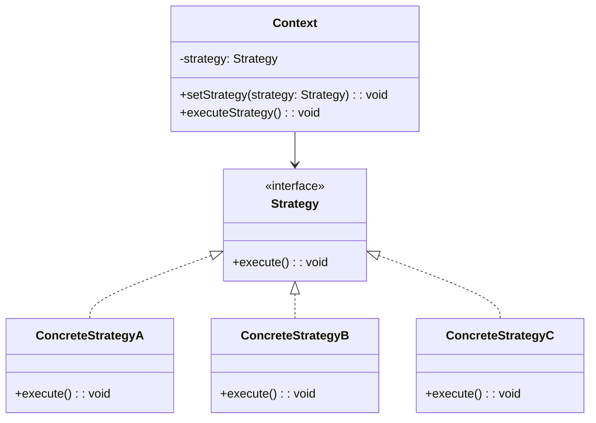

🧑‍💻 **Author:** RK ROY

# 🎯 Strategy Pattern

> **Define a family of algorithms, encapsulate each one, and make them interchangeable. Strategy lets the algorithm vary independently from clients that use it.**

[](https://github.com)
[](https://github.com)
[](https://github.com)

## 🎯 Intent

The Strategy pattern defines a **family of algorithms**, encapsulates each algorithm, and makes them interchangeable at runtime. This pattern promotes the **Open/Closed Principle** and eliminates complex conditional statements.

### Key Characteristics

- ✅ **Algorithm Encapsulation**: Each algorithm is encapsulated in its own class
- ✅ **Runtime Selection**: Algorithms can be chosen at runtime
- ✅ **Loose Coupling**: Client code is decoupled from algorithm implementations
- ✅ **Easy Extension**: New algorithms can be added without modifying existing code

## 🚀 Problem & Solution

### 🚨 Problem

- **Payment Processing**: Different payment methods (Credit Card, PayPal, Bitcoin)
- **Sorting Algorithms**: Multiple sorting strategies (QuickSort, MergeSort, BubbleSort)
- **Discount Calculations**: Various discount strategies (Percentage, Fixed Amount, Buy-One-Get-One)
- **Navigation Routes**: Different routing algorithms (Shortest, Fastest, Scenic)

### 💡 Solution



## 💻 Implementation

### 1. 🔰 Payment Processing System (Java)

```java path=null start=null
// Strategy interface
interface PaymentStrategy {
    void pay(double amount);
    boolean validate();
}

// Concrete Strategies
class CreditCardPayment implements PaymentStrategy {
    private String cardNumber;
    private String cvv;
    private String expiryDate;

    public CreditCardPayment(String cardNumber, String cvv, String expiryDate) {
        this.cardNumber = cardNumber;
        this.cvv = cvv;
        this.expiryDate = expiryDate;
    }

    @Override
    public boolean validate() {
        return cardNumber != null && cardNumber.length() == 16 &&
               cvv != null && cvv.length() == 3;
    }

    @Override
    public void pay(double amount) {
        if (validate()) {
            System.out.printf("Paid $%.2f using Credit Card ending in %s%n",
                            amount, cardNumber.substring(12));
        } else {
            System.out.println("Invalid credit card details!");
        }
    }
}

class PayPalPayment implements PaymentStrategy {
    private String email;
    private String password;

    public PayPalPayment(String email, String password) {
        this.email = email;
        this.password = password;
    }

    @Override
    public boolean validate() {
        return email != null && email.contains("@") && password != null;
    }

    @Override
    public void pay(double amount) {
        if (validate()) {
            System.out.printf("Paid $%.2f using PayPal account %s%n", amount, email);
        } else {
            System.out.println("Invalid PayPal credentials!");
        }
    }
}

class BitcoinPayment implements PaymentStrategy {
    private String walletAddress;
    private String privateKey;

    public BitcoinPayment(String walletAddress, String privateKey) {
        this.walletAddress = walletAddress;
        this.privateKey = privateKey;
    }

    @Override
    public boolean validate() {
        return walletAddress != null && walletAddress.length() >= 26 &&
               privateKey != null;
    }

    @Override
    public void pay(double amount) {
        if (validate()) {
            System.out.printf("Paid $%.2f using Bitcoin wallet %s...%s%n",
                            amount, walletAddress.substring(0, 4),
                            walletAddress.substring(walletAddress.length() - 4));
        } else {
            System.out.println("Invalid Bitcoin wallet details!");
        }
    }
}

// Context class
class PaymentProcessor {
    private PaymentStrategy paymentStrategy;

    public void setPaymentStrategy(PaymentStrategy strategy) {
        this.paymentStrategy = strategy;
    }

    public void processPayment(double amount) {
        if (paymentStrategy == null) {
            System.out.println("No payment strategy selected!");
            return;
        }
        paymentStrategy.pay(amount);
    }
}

// Usage
public class PaymentDemo {
    public static void main(String[] args) {
        PaymentProcessor processor = new PaymentProcessor();

        // Credit Card Payment
        processor.setPaymentStrategy(new CreditCardPayment("1234567890123456", "123", "12/25"));
        processor.processPayment(100.00);

        // PayPal Payment
        processor.setPaymentStrategy(new PayPalPayment("user@example.com", "password"));
        processor.processPayment(75.50);

        // Bitcoin Payment
        processor.setPaymentStrategy(new BitcoinPayment("1A1zP1eP5QGefi2DMPTfTL5SLmv7DivfNa", "private_key"));
        processor.processPayment(200.00);
    }
}
```

### 2. 🔄 Sorting Algorithms Strategy (Java)

```java path=null start=null
import java.util.*;

// Strategy interface
interface SortingStrategy {
    void sort(int[] array);
    String getAlgorithmName();
}

// Concrete Strategies
class QuickSortStrategy implements SortingStrategy {
    @Override
    public void sort(int[] array) {
        quickSort(array, 0, array.length - 1);
    }

    private void quickSort(int[] array, int low, int high) {
        if (low < high) {
            int pi = partition(array, low, high);
            quickSort(array, low, pi - 1);
            quickSort(array, pi + 1, high);
        }
    }

    private int partition(int[] array, int low, int high) {
        int pivot = array[high];
        int i = low - 1;

        for (int j = low; j < high; j++) {
            if (array[j] <= pivot) {
                i++;
                swap(array, i, j);
            }
        }
        swap(array, i + 1, high);
        return i + 1;
    }

    private void swap(int[] array, int i, int j) {
        int temp = array[i];
        array[i] = array[j];
        array[j] = temp;
    }

    @Override
    public String getAlgorithmName() {
        return "QuickSort";
    }
}

class MergeSortStrategy implements SortingStrategy {
    @Override
    public void sort(int[] array) {
        mergeSort(array, 0, array.length - 1);
    }

    private void mergeSort(int[] array, int left, int right) {
        if (left < right) {
            int middle = left + (right - left) / 2;
            mergeSort(array, left, middle);
            mergeSort(array, middle + 1, right);
            merge(array, left, middle, right);
        }
    }

    private void merge(int[] array, int left, int middle, int right) {
        int[] leftArray = Arrays.copyOfRange(array, left, middle + 1);
        int[] rightArray = Arrays.copyOfRange(array, middle + 1, right + 1);

        int i = 0, j = 0, k = left;

        while (i < leftArray.length && j < rightArray.length) {
            if (leftArray[i] <= rightArray[j]) {
                array[k++] = leftArray[i++];
            } else {
                array[k++] = rightArray[j++];
            }
        }

        while (i < leftArray.length) {
            array[k++] = leftArray[i++];
        }

        while (j < rightArray.length) {
            array[k++] = rightArray[j++];
        }
    }

    @Override
    public String getAlgorithmName() {
        return "MergeSort";
    }
}

class BubbleSortStrategy implements SortingStrategy {
    @Override
    public void sort(int[] array) {
        int n = array.length;
        for (int i = 0; i < n - 1; i++) {
            for (int j = 0; j < n - i - 1; j++) {
                if (array[j] > array[j + 1]) {
                    swap(array, j, j + 1);
                }
            }
        }
    }

    private void swap(int[] array, int i, int j) {
        int temp = array[i];
        array[i] = array[j];
        array[j] = temp;
    }

    @Override
    public String getAlgorithmName() {
        return "BubbleSort";
    }
}

// Context class with performance measurement
class SortingContext {
    private SortingStrategy strategy;

    public void setSortingStrategy(SortingStrategy strategy) {
        this.strategy = strategy;
    }

    public void performSort(int[] array) {
        if (strategy == null) {
            System.out.println("No sorting strategy selected!");
            return;
        }

        int[] arrayCopy = Arrays.copyOf(array, array.length);

        long startTime = System.nanoTime();
        strategy.sort(arrayCopy);
        long endTime = System.nanoTime();

        double executionTime = (endTime - startTime) / 1_000_000.0; // Convert to milliseconds

        System.out.printf("%s completed in %.3f ms%n",
                        strategy.getAlgorithmName(), executionTime);
        System.out.println("Sorted array: " + Arrays.toString(arrayCopy));
    }
}

// Usage
public class SortingDemo {
    public static void main(String[] args) {
        SortingContext context = new SortingContext();
        int[] array = {64, 34, 25, 12, 22, 11, 90, 88, 76, 50};

        System.out.println("Original array: " + Arrays.toString(array));
        System.out.println();

        // Test QuickSort
        context.setSortingStrategy(new QuickSortStrategy());
        context.performSort(array);

        // Test MergeSort
        context.setSortingStrategy(new MergeSortStrategy());
        context.performSort(array);

        // Test BubbleSort
        context.setSortingStrategy(new BubbleSortStrategy());
        context.performSort(array);
    }
}
```

### 3. 🐍 Discount Strategy System (Python)

```python path=null start=null
from abc import ABC, abstractmethod
from typing import List, Dict, Any
from decimal import Decimal
from datetime import datetime

# Strategy interface
class DiscountStrategy(ABC):
    @abstractmethod
    def calculate_discount(self, order_total: Decimal, customer: 'Customer' = None) -> Decimal:
        pass

    @abstractmethod
    def get_description(self) -> str:
        pass

# Concrete Strategies
class PercentageDiscountStrategy(DiscountStrategy):
    def __init__(self, percentage: float, max_discount: Decimal = None):
        self.percentage = percentage / 100  # Convert to decimal
        self.max_discount = max_discount

    def calculate_discount(self, order_total: Decimal, customer: 'Customer' = None) -> Decimal:
        discount = order_total * Decimal(str(self.percentage))
        if self.max_discount and discount > self.max_discount:
            discount = self.max_discount
        return discount

    def get_description(self) -> str:
        desc = f"{self.percentage * 100:.0f}% discount"
        if self.max_discount:
            desc += f" (max ${self.max_discount})"
        return desc

class FixedAmountDiscountStrategy(DiscountStrategy):
    def __init__(self, discount_amount: Decimal, minimum_order: Decimal = None):
        self.discount_amount = discount_amount
        self.minimum_order = minimum_order or Decimal('0')

    def calculate_discount(self, order_total: Decimal, customer: 'Customer' = None) -> Decimal:
        if order_total >= self.minimum_order:
            return min(self.discount_amount, order_total)
        return Decimal('0')

    def get_description(self) -> str:
        desc = f"${self.discount_amount} off"
        if self.minimum_order > 0:
            desc += f" on orders over ${self.minimum_order}"
        return desc

class BuyOneGetOneStrategy(DiscountStrategy):
    def __init__(self, eligible_items: List[str] = None):
        self.eligible_items = eligible_items or []

    def calculate_discount(self, order_total: Decimal, customer: 'Customer' = None) -> Decimal:
        # Simplified BOGO calculation - assumes 50% of eligible items are free
        if not self.eligible_items:
            return order_total * Decimal('0.25')  # 25% discount approximation

        # In a real implementation, you'd analyze individual items
        eligible_amount = order_total * Decimal('0.6')  # Assume 60% are eligible items
        return eligible_amount * Decimal('0.5')  # 50% of eligible items free

    def get_description(self) -> str:
        if self.eligible_items:
            return f"Buy one get one free on: {', '.join(self.eligible_items)}"
        return "Buy one get one free on selected items"

class LoyaltyDiscountStrategy(DiscountStrategy):
    def __init__(self, points_per_dollar: float, points_value: float):
        self.points_per_dollar = points_per_dollar
        self.points_value = points_value  # Dollar value per point

    def calculate_discount(self, order_total: Decimal, customer: 'Customer' = None) -> Decimal:
        if not customer or not hasattr(customer, 'loyalty_points'):
            return Decimal('0')

        max_points_to_use = int(order_total / Decimal(str(self.points_value)))
        points_to_use = min(customer.loyalty_points, max_points_to_use)

        return Decimal(str(points_to_use * self.points_value))

    def get_description(self) -> str:
        return f"Loyalty points discount (${self.points_value:.2f} per point)"

class SeasonalDiscountStrategy(DiscountStrategy):
    def __init__(self, percentage: float, start_date: datetime, end_date: datetime):
        self.percentage = percentage / 100
        self.start_date = start_date
        self.end_date = end_date

    def calculate_discount(self, order_total: Decimal, customer: 'Customer' = None) -> Decimal:
        current_date = datetime.now()
        if self.start_date <= current_date <= self.end_date:
            return order_total * Decimal(str(self.percentage))
        return Decimal('0')

    def get_description(self) -> str:
        return (f"Seasonal {self.percentage * 100:.0f}% discount "
                f"({self.start_date.strftime('%Y-%m-%d')} to {self.end_date.strftime('%Y-%m-%d')})")

# Customer class for context
class Customer:
    def __init__(self, name: str, email: str, loyalty_points: int = 0):
        self.name = name
        self.email = email
        self.loyalty_points = loyalty_points

# Context class
class ShoppingCart:
    def __init__(self):
        self.items: List[Dict[str, Any]] = []
        self.discount_strategies: List[DiscountStrategy] = []

    def add_item(self, name: str, price: Decimal, quantity: int = 1):
        self.items.append({
            'name': name,
            'price': price,
            'quantity': quantity,
            'subtotal': price * quantity
        })

    def add_discount_strategy(self, strategy: DiscountStrategy):
        self.discount_strategies.append(strategy)

    def remove_discount_strategy(self, strategy: DiscountStrategy):
        if strategy in self.discount_strategies:
            self.discount_strategies.remove(strategy)

    def get_subtotal(self) -> Decimal:
        return sum(item['subtotal'] for item in self.items)

    def calculate_total_discount(self, customer: Customer = None) -> Decimal:
        subtotal = self.get_subtotal()
        total_discount = Decimal('0')

        for strategy in self.discount_strategies:
            discount = strategy.calculate_discount(subtotal, customer)
            total_discount += discount

        # Ensure total discount doesn't exceed subtotal
        return min(total_discount, subtotal)

    def get_final_total(self, customer: Customer = None) -> Decimal:
        subtotal = self.get_subtotal()
        total_discount = self.calculate_total_discount(customer)
        return subtotal - total_discount

    def print_receipt(self, customer: Customer = None):
        print("=" * 50)
        print("                  RECEIPT                  ")
        print("=" * 50)

        if customer:
            print(f"Customer: {customer.name}")
            print(f"Loyalty Points: {customer.loyalty_points}")
            print("-" * 50)

        for item in self.items:
            print(f"{item['name']} x{item['quantity']} @ ${item['price']} = ${item['subtotal']}")

        print("-" * 50)
        subtotal = self.get_subtotal()
        print(f"Subtotal: ${subtotal:.2f}")

        if self.discount_strategies:
            print("\nDiscounts Applied:")
            total_discount = Decimal('0')

            for strategy in self.discount_strategies:
                discount = strategy.calculate_discount(subtotal, customer)
                if discount > 0:
                    print(f"  - {strategy.get_description()}: -${discount:.2f}")
                    total_discount += discount

            print(f"\nTotal Discount: -${total_discount:.2f}")
            print(f"Final Total: ${self.get_final_total(customer):.2f}")
        else:
            print(f"Total: ${subtotal:.2f}")

        print("=" * 50)

# Usage example
if __name__ == "__main__":
    # Create customer
    customer = Customer("John Doe", "john@example.com", loyalty_points=150)

    # Create shopping cart
    cart = ShoppingCart()

    # Add items
    cart.add_item("Laptop", Decimal('999.99'), 1)
    cart.add_item("Mouse", Decimal('25.99'), 2)
    cart.add_item("Keyboard", Decimal('79.99'), 1)

    print("Shopping Cart without Discounts:")
    cart.print_receipt()
    print()

    # Add discount strategies
    cart.add_discount_strategy(PercentageDiscountStrategy(10, max_discount=Decimal('100')))
    cart.add_discount_strategy(FixedAmountDiscountStrategy(Decimal('20'), minimum_order=Decimal('100')))
    cart.add_discount_strategy(LoyaltyDiscountStrategy(1, 0.10))  # 10 cents per point

    print("Shopping Cart with Multiple Discounts:")
    cart.print_receipt(customer)
    print()

    # Test seasonal discount
    from datetime import datetime, timedelta

    # Create a seasonal discount that's currently active
    start_date = datetime.now() - timedelta(days=5)
    end_date = datetime.now() + timedelta(days=10)
    cart.add_discount_strategy(SeasonalDiscountStrategy(15, start_date, end_date))

    print("Shopping Cart with Seasonal Discount:")
    cart.print_receipt(customer)
```

### 4. 📱 Navigation Strategy (TypeScript)

```typescript path=null start=null
// Strategy interface
interface RouteStrategy {
	calculateRoute(start: Location, end: Location): Route
	getStrategyName(): string
	getEstimatedTime(distance: number): number // in minutes
}

interface Location {
	latitude: number
	longitude: number
	address: string
}

interface Route {
	distance: number // in kilometers
	estimatedTime: number // in minutes
	instructions: string[]
	routeType: string
}

// Concrete Strategies
class FastestRouteStrategy implements RouteStrategy {
	calculateRoute(start: Location, end: Location): Route {
		// Simulate fastest route calculation
		const distance = this.calculateDistance(start, end)
		const estimatedTime = this.getEstimatedTime(distance)

		return {
			distance: distance,
			estimatedTime: estimatedTime,
			instructions: [
				'Take the highway for maximum speed',
				'Use express lanes where available',
				'Avoid traffic signals and stops',
			],
			routeType: 'Fastest',
		}
	}

	getEstimatedTime(distance: number): number {
		return Math.round(distance / 1.2) // Assuming 72 km/h average speed
	}

	getStrategyName(): string {
		return 'Fastest Route'
	}

	private calculateDistance(start: Location, end: Location): number {
		// Simplified distance calculation
		const latDiff = Math.abs(start.latitude - end.latitude)
		const lngDiff = Math.abs(start.longitude - end.longitude)
		return Math.round(Math.sqrt(latDiff * latDiff + lngDiff * lngDiff) * 111) // Rough km conversion
	}
}

class ShortestRouteStrategy implements RouteStrategy {
	calculateRoute(start: Location, end: Location): Route {
		const distance = this.calculateDistance(start, end) * 0.85 // Shorter but slower roads
		const estimatedTime = this.getEstimatedTime(distance)

		return {
			distance: distance,
			estimatedTime: estimatedTime,
			instructions: [
				'Take direct city streets',
				'Use shortest connecting roads',
				'Minimize total distance traveled',
			],
			routeType: 'Shortest',
		}
	}

	getEstimatedTime(distance: number): number {
		return Math.round(distance / 0.8) // Assuming 48 km/h average speed (slower due to city streets)
	}

	getStrategyName(): string {
		return 'Shortest Route'
	}

	private calculateDistance(start: Location, end: Location): number {
		const latDiff = Math.abs(start.latitude - end.latitude)
		const lngDiff = Math.abs(start.longitude - end.longitude)
		return Math.round(Math.sqrt(latDiff * latDiff + lngDiff * lngDiff) * 111 * 0.85)
	}
}

class EcoFriendlyRouteStrategy implements RouteStrategy {
	calculateRoute(start: Location, end: Location): Route {
		const distance = this.calculateDistance(start, end) * 0.95 // Slightly longer but more efficient
		const estimatedTime = this.getEstimatedTime(distance)

		return {
			distance: distance,
			estimatedTime: estimatedTime,
			instructions: [
				'Maintain steady speeds for fuel efficiency',
				'Avoid steep hills where possible',
				'Use routes with fewer stops and starts',
			],
			routeType: 'Eco-Friendly',
		}
	}

	getEstimatedTime(distance: number): number {
		return Math.round(distance / 1.0) // Assuming 60 km/h average speed (moderate pace)
	}

	getStrategyName(): string {
		return 'Eco-Friendly Route'
	}

	private calculateDistance(start: Location, end: Location): number {
		const latDiff = Math.abs(start.latitude - end.latitude)
		const lngDiff = Math.abs(start.longitude - end.longitude)
		return Math.round(Math.sqrt(latDiff * latDiff + lngDiff * lngDiff) * 111 * 0.95)
	}
}

class ScenicRouteStrategy implements RouteStrategy {
	calculateRoute(start: Location, end: Location): Route {
		const distance = this.calculateDistance(start, end) * 1.3 // Longer but scenic
		const estimatedTime = this.getEstimatedTime(distance)

		return {
			distance: distance,
			estimatedTime: estimatedTime,
			instructions: [
				'Take scenic byways and country roads',
				'Pass through parks and natural areas',
				'Enjoy beautiful landscapes and viewpoints',
			],
			routeType: 'Scenic',
		}
	}

	getEstimatedTime(distance: number): number {
		return Math.round(distance / 0.9) // Assuming 54 km/h average speed (leisurely pace)
	}

	getStrategyName(): string {
		return 'Scenic Route'
	}

	private calculateDistance(start: Location, end: Location): number {
		const latDiff = Math.abs(start.latitude - end.latitude)
		const lngDiff = Math.abs(start.longitude - end.longitude)
		return Math.round(Math.sqrt(latDiff * latDiff + lngDiff * lngDiff) * 111 * 1.3)
	}
}

// Context class
class NavigationSystem {
	private routeStrategy: RouteStrategy
	private currentRoute: Route | null = null

	setRouteStrategy(strategy: RouteStrategy): void {
		this.routeStrategy = strategy
		console.log(`Route strategy changed to: ${strategy.getStrategyName()}`)
	}

	calculateRoute(start: Location, end: Location): Route {
		if (!this.routeStrategy) {
			throw new Error('No route strategy selected')
		}

		console.log(`Calculating route using ${this.routeStrategy.getStrategyName()}...`)
		this.currentRoute = this.routeStrategy.calculateRoute(start, end)
		return this.currentRoute
	}

	displayRoute(): void {
		if (!this.currentRoute) {
			console.log('No route calculated yet.')
			return
		}

		console.log(`\n--- ${this.currentRoute.routeType} Route ---`)
		console.log(`Distance: ${this.currentRoute.distance.toFixed(1)} km`)
		console.log(`Estimated Time: ${this.currentRoute.estimatedTime} minutes`)
		console.log('Instructions:')
		this.currentRoute.instructions.forEach((instruction, index) => {
			console.log(`  ${index + 1}. ${instruction}`)
		})
	}

	compareStrategies(start: Location, end: Location): void {
		const strategies = [
			new FastestRouteStrategy(),
			new ShortestRouteStrategy(),
			new EcoFriendlyRouteStrategy(),
			new ScenicRouteStrategy(),
		]

		console.log('\n=== Route Comparison ===')
		console.log(`From: ${start.address}`)
		console.log(`To: ${end.address}\n`)

		strategies.forEach((strategy) => {
			const route = strategy.calculateRoute(start, end)
			console.log(`${strategy.getStrategyName()}:`)
			console.log(`  Distance: ${route.distance.toFixed(1)} km`)
			console.log(`  Time: ${route.estimatedTime} minutes`)
			console.log(
				`  Efficiency: ${((route.distance / route.estimatedTime) * 60).toFixed(1)} km/h\n`,
			)
		})
	}
}

// Usage example
const navigationSystem = new NavigationSystem()

const startLocation: Location = {
	latitude: 37.7749,
	longitude: -122.4194,
	address: 'San Francisco, CA',
}

const endLocation: Location = {
	latitude: 34.0522,
	longitude: -118.2437,
	address: 'Los Angeles, CA',
}

// Test different strategies
console.log('=== Navigation System Demo ===\n')

// Fastest route
navigationSystem.setRouteStrategy(new FastestRouteStrategy())
navigationSystem.calculateRoute(startLocation, endLocation)
navigationSystem.displayRoute()

// Shortest route
navigationSystem.setRouteStrategy(new ShortestRouteStrategy())
navigationSystem.calculateRoute(startLocation, endLocation)
navigationSystem.displayRoute()

// Eco-friendly route
navigationSystem.setRouteStrategy(new EcoFriendlyRouteStrategy())
navigationSystem.calculateRoute(startLocation, endLocation)
navigationSystem.displayRoute()

// Scenic route
navigationSystem.setRouteStrategy(new ScenicRouteStrategy())
navigationSystem.calculateRoute(startLocation, endLocation)
navigationSystem.displayRoute()

// Compare all strategies
navigationSystem.compareStrategies(startLocation, endLocation)
```

## ✅ Best Practices & Interview Questions

### 🎯 When to Use Strategy Pattern

- ✅ **Multiple algorithms**: When you have multiple ways to perform a task
- ✅ **Runtime selection**: When algorithm choice depends on runtime conditions
- ✅ **Eliminating conditionals**: Replace long if-else or switch statements
- ✅ **Easy testing**: Each strategy can be tested independently

### 🎤 Common Interview Questions

**Q1: Strategy vs State Pattern - What's the difference?**

**A:**

- **Strategy**: Client chooses algorithm, strategies are independent
- **State**: Context changes state automatically, states are aware of each other

**Q2: How does Strategy pattern follow SOLID principles?**

**A:**

- **Single Responsibility**: Each strategy has one algorithm
- **Open/Closed**: Open for extension (new strategies), closed for modification
- **Liskov Substitution**: Any strategy can replace another
- **Interface Segregation**: Clients depend only on strategy interface
- **Dependency Inversion**: Context depends on abstraction, not concretions

**Q3: What are the trade-offs of using Strategy pattern?**

**A:**

- **Pros**: Flexible, extensible, testable, follows SOLID principles
- **Cons**: Increased number of classes, clients must know about strategies

## 🎯 Summary

| Aspect        | Details                                       |
| ------------- | --------------------------------------------- |
| **Intent**    | Make algorithms interchangeable at runtime    |
| **Problem**   | Complex conditionals for algorithm selection  |
| **Solution**  | Encapsulate algorithms in strategy classes    |
| **Benefits**  | Flexible algorithm selection, easy to extend  |
| **Drawbacks** | More classes, client strategy awareness       |
| **Use When**  | Multiple algorithms, runtime selection needed |

---

[← Back: Observer Pattern](../03-observer/README.md) | [Next: Command Pattern →](../05-command/README.md)
