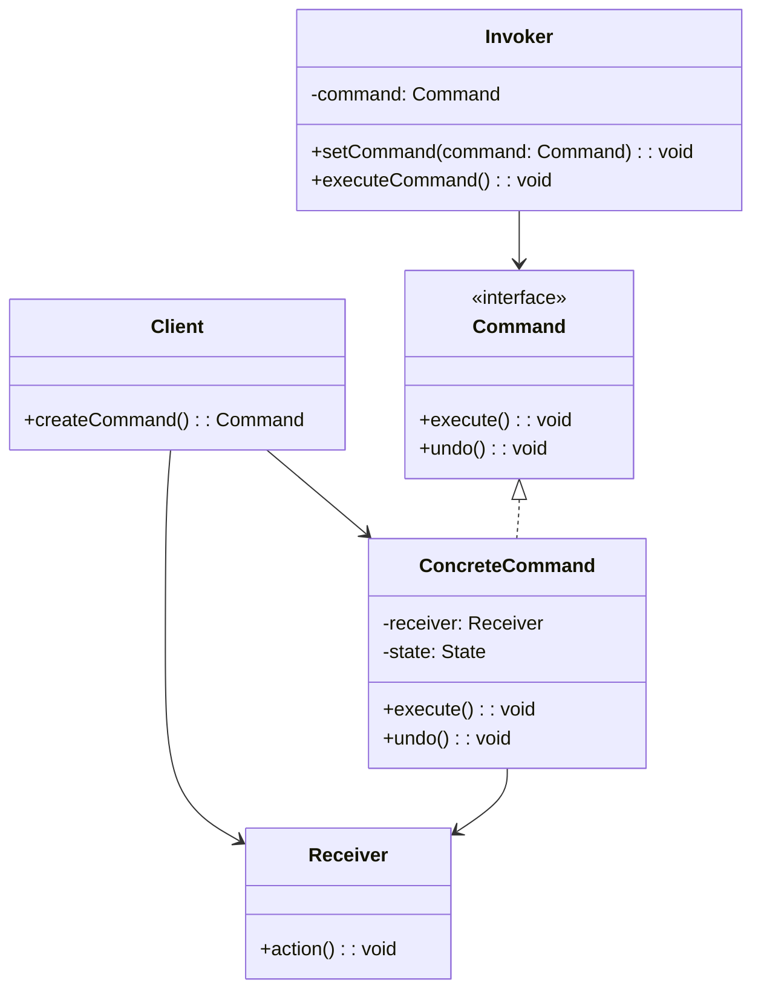
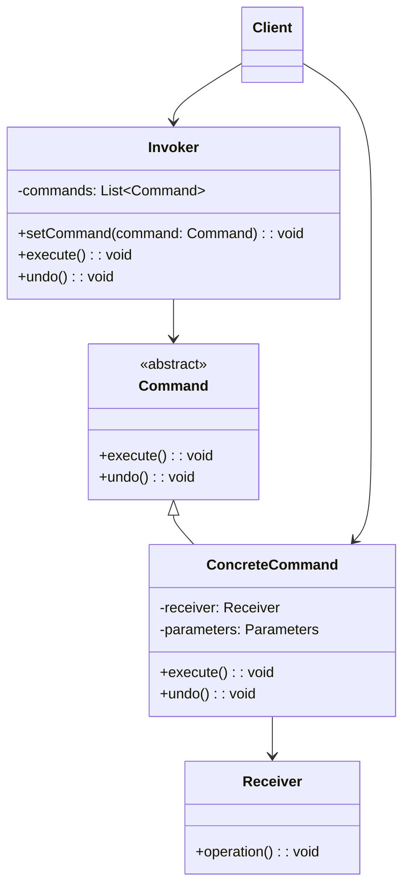
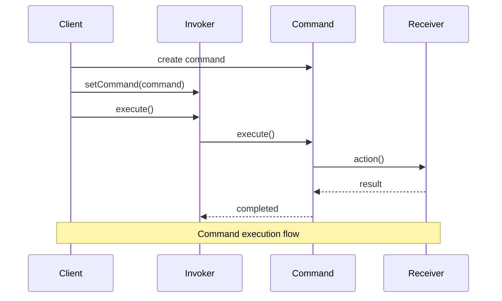
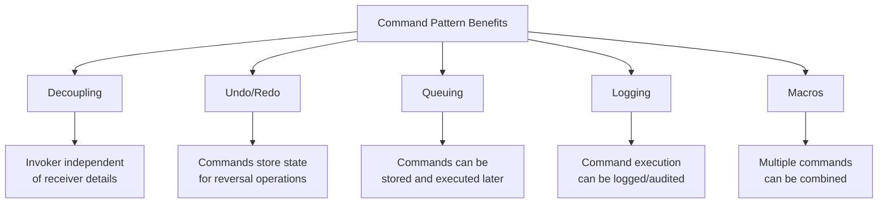

🧑‍💻 **Author:** RK ROY

# ⚡ Command Pattern

> **Encapsulate a request as an object, thereby letting you parameterize clients with different requests, queue or log requests, and support undoable operations.**

[](https://github.com)
[](https://github.com)
[](https://github.com)

## 📋 Table of Contents

- [🎯 Intent](#-intent)
- [🚀 Problem & Solution](#-problem--solution)
- [🏗️ Structure](#️-structure)
- [💻 Implementation](#-implementation)
- [🌟 Real-World Examples](#-real-world-examples)
- [✅ Best Practices](#-best-practices)
- [❌ Common Pitfalls](#-common-pitfalls)
- [🎤 Interview Questions](#-interview-questions)

## 🎯 Intent

The Command pattern **encapsulates a request as an object**, allowing you to parameterize clients with different requests, queue operations, log requests, and support **undo/redo functionality**. It decouples the object that invokes the operation from the object that performs it.

### Key Characteristics

- ✅ **Request Encapsulation**: Commands are objects that encapsulate requests
- ✅ **Decoupling**: Invoker and receiver are decoupled
- ✅ **Undo/Redo Support**: Commands can be reversed
- ✅ **Queuing & Logging**: Commands can be stored and executed later
- ✅ **Macro Commands**: Multiple commands can be combined

## 🚀 Problem & Solution

### 🚨 Problem

Consider these scenarios:

- **GUI Applications**: Button clicks need to trigger different actions
- **Remote Controls**: Different buttons control various devices
- **Text Editors**: Undo/Redo functionality for text operations
- **Task Queuing**: Executing operations in background
- **Macro Recording**: Recording and replaying user actions

### 💡 Solution



## 🏗️ Structure

### UML Class Diagram



### Sequence Diagram



## 💻 Implementation

### 1. 🔰 Basic Command Pattern (Java)

```java path=null start=null
// Command interface
interface Command {
    void execute();
    void undo();
}

// Receiver classes
class Light {
    private boolean isOn = false;
    private int brightness = 0;

    public void turnOn() {
        isOn = true;
        brightness = 100;
        System.out.println("Light is ON (brightness: " + brightness + ")");
    }

    public void turnOff() {
        isOn = false;
        brightness = 0;
        System.out.println("Light is OFF");
    }

    public void setBrightness(int level) {
        if (isOn) {
            brightness = Math.max(0, Math.min(100, level));
            System.out.println("Light brightness set to: " + brightness);
        }
    }

    public boolean isOn() { return isOn; }
    public int getBrightness() { return brightness; }
}

class Fan {
    private boolean isOn = false;
    private int speed = 0;

    public void turnOn() {
        isOn = true;
        speed = 1;
        System.out.println("Fan is ON (speed: " + speed + ")");
    }

    public void turnOff() {
        isOn = false;
        speed = 0;
        System.out.println("Fan is OFF");
    }

    public void setSpeed(int speed) {
        if (isOn) {
            this.speed = Math.max(0, Math.min(5, speed));
            System.out.println("Fan speed set to: " + this.speed);
        }
    }

    public boolean isOn() { return isOn; }
    public int getSpeed() { return speed; }
}

// Concrete Commands
class LightOnCommand implements Command {
    private Light light;

    public LightOnCommand(Light light) {
        this.light = light;
    }

    @Override
    public void execute() {
        light.turnOn();
    }

    @Override
    public void undo() {
        light.turnOff();
    }
}

class LightOffCommand implements Command {
    private Light light;

    public LightOffCommand(Light light) {
        this.light = light;
    }

    @Override
    public void execute() {
        light.turnOff();
    }

    @Override
    public void undo() {
        light.turnOn();
    }
}

class FanOnCommand implements Command {
    private Fan fan;

    public FanOnCommand(Fan fan) {
        this.fan = fan;
    }

    @Override
    public void execute() {
        fan.turnOn();
    }

    @Override
    public void undo() {
        fan.turnOff();
    }
}

class FanSpeedCommand implements Command {
    private Fan fan;
    private int newSpeed;
    private int previousSpeed;

    public FanSpeedCommand(Fan fan, int speed) {
        this.fan = fan;
        this.newSpeed = speed;
    }

    @Override
    public void execute() {
        previousSpeed = fan.getSpeed();
        fan.setSpeed(newSpeed);
    }

    @Override
    public void undo() {
        fan.setSpeed(previousSpeed);
    }
}

// Null Object Pattern for empty slots
class NoCommand implements Command {
    @Override
    public void execute() {
        // Do nothing
    }

    @Override
    public void undo() {
        // Do nothing
    }
}

// Invoker
class RemoteControl {
    private Command[] onCommands;
    private Command[] offCommands;
    private Command undoCommand;

    public RemoteControl() {
        onCommands = new Command[7];
        offCommands = new Command[7];

        Command noCommand = new NoCommand();
        for (int i = 0; i < 7; i++) {
            onCommands[i] = noCommand;
            offCommands[i] = noCommand;
        }
        undoCommand = noCommand;
    }

    public void setCommand(int slot, Command onCommand, Command offCommand) {
        onCommands[slot] = onCommand;
        offCommands[slot] = offCommand;
    }

    public void onButtonPressed(int slot) {
        onCommands[slot].execute();
        undoCommand = onCommands[slot];
    }

    public void offButtonPressed(int slot) {
        offCommands[slot].execute();
        undoCommand = offCommands[slot];
    }

    public void undoButtonPressed() {
        undoCommand.undo();
    }

    @Override
    public String toString() {
        StringBuilder builder = new StringBuilder();
        builder.append("\n------ Remote Control ------\n");
        for (int i = 0; i < onCommands.length; i++) {
            builder.append("[slot ").append(i).append("] ")
                   .append(onCommands[i].getClass().getSimpleName())
                   .append("    ")
                   .append(offCommands[i].getClass().getSimpleName())
                   .append("\n");
        }
        builder.append("[undo] ").append(undoCommand.getClass().getSimpleName()).append("\n");
        return builder.toString();
    }
}

// Usage
public class RemoteControlDemo {
    public static void main(String[] args) {
        RemoteControl remote = new RemoteControl();

        Light livingRoomLight = new Light();
        Light kitchenLight = new Light();
        Fan ceilingFan = new Fan();

        // Create commands
        LightOnCommand livingRoomLightOn = new LightOnCommand(livingRoomLight);
        LightOffCommand livingRoomLightOff = new LightOffCommand(livingRoomLight);
        LightOnCommand kitchenLightOn = new LightOnCommand(kitchenLight);
        LightOffCommand kitchenLightOff = new LightOffCommand(kitchenLight);

        FanOnCommand ceilingFanOn = new FanOnCommand(ceilingFan);
        FanSpeedCommand ceilingFanMedium = new FanSpeedCommand(ceilingFan, 3);

        // Set commands
        remote.setCommand(0, livingRoomLightOn, livingRoomLightOff);
        remote.setCommand(1, kitchenLightOn, kitchenLightOff);
        remote.setCommand(2, ceilingFanOn, new NoCommand());
        remote.setCommand(3, ceilingFanMedium, new NoCommand());

        System.out.println(remote);

        // Test commands
        remote.onButtonPressed(0);  // Living room light on
        remote.offButtonPressed(0); // Living room light off
        remote.undoButtonPressed(); // Undo (light on again)

        remote.onButtonPressed(2);  // Fan on
        remote.onButtonPressed(3);  // Fan medium speed
        remote.undoButtonPressed(); // Undo (back to speed 1)
    }
}
```

### 2. 🎨 Text Editor with Undo/Redo (Java)

```java path=null start=null
import java.util.*;

// Command interface
interface TextCommand {
    void execute();
    void undo();
    String getDescription();
}

// Receiver
class TextDocument {
    private StringBuilder content;
    private int cursorPosition;

    public TextDocument() {
        content = new StringBuilder();
        cursorPosition = 0;
    }

    public void insertText(String text, int position) {
        content.insert(position, text);
        cursorPosition = position + text.length();
    }

    public String deleteText(int start, int length) {
        String deleted = content.substring(start, Math.min(start + length, content.length()));
        content.delete(start, Math.min(start + length, content.length()));
        cursorPosition = start;
        return deleted;
    }

    public void replaceText(int start, int length, String newText) {
        content.replace(start, Math.min(start + length, content.length()), newText);
        cursorPosition = start + newText.length();
    }

    public String getContent() {
        return content.toString();
    }

    public int getCursorPosition() {
        return cursorPosition;
    }

    public void setCursorPosition(int position) {
        cursorPosition = Math.max(0, Math.min(position, content.length()));
    }

    public int getLength() {
        return content.length();
    }
}

// Concrete Commands
class InsertTextCommand implements TextCommand {
    private TextDocument document;
    private String text;
    private int position;

    public InsertTextCommand(TextDocument document, String text, int position) {
        this.document = document;
        this.text = text;
        this.position = position;
    }

    @Override
    public void execute() {
        document.insertText(text, position);
    }

    @Override
    public void undo() {
        document.deleteText(position, text.length());
    }

    @Override
    public String getDescription() {
        return "Insert '" + text + "' at position " + position;
    }
}

class DeleteTextCommand implements TextCommand {
    private TextDocument document;
    private int start;
    private int length;
    private String deletedText;

    public DeleteTextCommand(TextDocument document, int start, int length) {
        this.document = document;
        this.start = start;
        this.length = length;
    }

    @Override
    public void execute() {
        deletedText = document.deleteText(start, length);
    }

    @Override
    public void undo() {
        if (deletedText != null) {
            document.insertText(deletedText, start);
        }
    }

    @Override
    public String getDescription() {
        return "Delete " + length + " characters from position " + start;
    }
}

class ReplaceTextCommand implements TextCommand {
    private TextDocument document;
    private int start;
    private int length;
    private String newText;
    private String originalText;

    public ReplaceTextCommand(TextDocument document, int start, int length, String newText) {
        this.document = document;
        this.start = start;
        this.length = length;
        this.newText = newText;
    }

    @Override
    public void execute() {
        String content = document.getContent();
        originalText = content.substring(start, Math.min(start + length, content.length()));
        document.replaceText(start, length, newText);
    }

    @Override
    public void undo() {
        if (originalText != null) {
            document.replaceText(start, newText.length(), originalText);
        }
    }

    @Override
    public String getDescription() {
        return "Replace text at position " + start + " with '" + newText + "'";
    }
}

// Macro Command
class MacroCommand implements TextCommand {
    private List<TextCommand> commands;
    private String description;

    public MacroCommand(List<TextCommand> commands, String description) {
        this.commands = new ArrayList<>(commands);
        this.description = description;
    }

    @Override
    public void execute() {
        for (TextCommand command : commands) {
            command.execute();
        }
    }

    @Override
    public void undo() {
        // Undo in reverse order
        for (int i = commands.size() - 1; i >= 0; i--) {
            commands.get(i).undo();
        }
    }

    @Override
    public String getDescription() {
        return description;
    }
}

// Command Manager (Invoker)
class TextEditor {
    private TextDocument document;
    private Stack<TextCommand> undoStack;
    private Stack<TextCommand> redoStack;
    private final int maxUndoLevels;

    public TextEditor(int maxUndoLevels) {
        document = new TextDocument();
        undoStack = new Stack<>();
        redoStack = new Stack<>();
        this.maxUndoLevels = maxUndoLevels;
    }

    public void executeCommand(TextCommand command) {
        command.execute();

        // Add to undo stack
        undoStack.push(command);

        // Limit undo stack size
        if (undoStack.size() > maxUndoLevels) {
            undoStack.remove(0);
        }

        // Clear redo stack when new command is executed
        redoStack.clear();

        System.out.println("Executed: " + command.getDescription());
        System.out.println("Document: \"" + document.getContent() + "\"");
        System.out.println();
    }

    public void undo() {
        if (!undoStack.isEmpty()) {
            TextCommand command = undoStack.pop();
            command.undo();
            redoStack.push(command);

            System.out.println("Undone: " + command.getDescription());
            System.out.println("Document: \"" + document.getContent() + "\"");
            System.out.println();
        } else {
            System.out.println("Nothing to undo");
        }
    }

    public void redo() {
        if (!redoStack.isEmpty()) {
            TextCommand command = redoStack.pop();
            command.execute();
            undoStack.push(command);

            System.out.println("Redone: " + command.getDescription());
            System.out.println("Document: \"" + document.getContent() + "\"");
            System.out.println();
        } else {
            System.out.println("Nothing to redo");
        }
    }

    public TextDocument getDocument() {
        return document;
    }

    public void printHistory() {
        System.out.println("=== Command History ===");
        System.out.println("Undo Stack (" + undoStack.size() + " commands):");
        for (int i = undoStack.size() - 1; i >= 0; i--) {
            System.out.println("  " + (undoStack.size() - i) + ". " + undoStack.get(i).getDescription());
        }

        System.out.println("Redo Stack (" + redoStack.size() + " commands):");
        for (int i = redoStack.size() - 1; i >= 0; i--) {
            System.out.println("  " + (redoStack.size() - i) + ". " + redoStack.get(i).getDescription());
        }
        System.out.println();
    }
}

// Usage
public class TextEditorDemo {
    public static void main(String[] args) {
        TextEditor editor = new TextEditor(10);
        TextDocument doc = editor.getDocument();

        System.out.println("=== Text Editor Command Pattern Demo ===\n");

        // Execute various commands
        editor.executeCommand(new InsertTextCommand(doc, "Hello", 0));
        editor.executeCommand(new InsertTextCommand(doc, " World", 5));
        editor.executeCommand(new InsertTextCommand(doc, "!", 11));

        // Create a macro command
        List<TextCommand> macroCommands = Arrays.asList(
            new DeleteTextCommand(doc, 5, 6),  // Delete " World"
            new InsertTextCommand(doc, " Java", 5)  // Insert " Java"
        );
        editor.executeCommand(new MacroCommand(macroCommands, "Replace 'World' with 'Java'"));

        // Test undo/redo
        editor.undo();
        editor.undo();
        editor.redo();

        // Show command history
        editor.printHistory();

        // More operations
        editor.executeCommand(new ReplaceTextCommand(doc, 0, 5, "Hi"));
        editor.executeCommand(new DeleteTextCommand(doc, 2, 5));

        System.out.println("Final document: \"" + doc.getContent() + "\"");
    }
}
```

### 3. 🐍 Task Queue System (Python)

```python path=null start=null
from abc import ABC, abstractmethod
from typing import List, Dict, Any, Optional
import time
import threading
from enum import Enum
from datetime import datetime, timedelta
import json

# Command interface
class Command(ABC):
    @abstractmethod
    def execute(self) -> Any:
        pass

    @abstractmethod
    def undo(self) -> Any:
        pass

    @abstractmethod
    def can_undo(self) -> bool:
        pass

    @abstractmethod
    def get_description(self) -> str:
        pass

    @abstractmethod
    def serialize(self) -> Dict[str, Any]:
        pass

# Task status enumeration
class TaskStatus(Enum):
    PENDING = "pending"
    RUNNING = "running"
    COMPLETED = "completed"
    FAILED = "failed"
    CANCELLED = "cancelled"

# File operations receiver
class FileManager:
    def __init__(self):
        self.files: Dict[str, str] = {}

    def create_file(self, filename: str, content: str) -> bool:
        if filename not in self.files:
            self.files[filename] = content
            print(f"Created file: {filename}")
            return True
        return False

    def delete_file(self, filename: str) -> Optional[str]:
        if filename in self.files:
            content = self.files.pop(filename)
            print(f"Deleted file: {filename}")
            return content
        return None

    def update_file(self, filename: str, new_content: str) -> Optional[str]:
        if filename in self.files:
            old_content = self.files[filename]
            self.files[filename] = new_content
            print(f"Updated file: {filename}")
            return old_content
        return None

    def read_file(self, filename: str) -> Optional[str]:
        return self.files.get(filename)

    def list_files(self) -> List[str]:
        return list(self.files.keys())

# Concrete Commands
class CreateFileCommand(Command):
    def __init__(self, file_manager: FileManager, filename: str, content: str):
        self.file_manager = file_manager
        self.filename = filename
        self.content = content
        self.executed = False

    def execute(self) -> Any:
        result = self.file_manager.create_file(self.filename, self.content)
        self.executed = result
        return result

    def undo(self) -> Any:
        if self.executed:
            self.file_manager.delete_file(self.filename)
            self.executed = False
            return True
        return False

    def can_undo(self) -> bool:
        return self.executed

    def get_description(self) -> str:
        return f"Create file '{self.filename}' with {len(self.content)} characters"

    def serialize(self) -> Dict[str, Any]:
        return {
            "type": "CreateFileCommand",
            "filename": self.filename,
            "content": self.content,
            "executed": self.executed
        }

class DeleteFileCommand(Command):
    def __init__(self, file_manager: FileManager, filename: str):
        self.file_manager = file_manager
        self.filename = filename
        self.deleted_content: Optional[str] = None

    def execute(self) -> Any:
        self.deleted_content = self.file_manager.delete_file(self.filename)
        return self.deleted_content is not None

    def undo(self) -> Any:
        if self.deleted_content is not None:
            result = self.file_manager.create_file(self.filename, self.deleted_content)
            if result:
                self.deleted_content = None
            return result
        return False

    def can_undo(self) -> bool:
        return self.deleted_content is not None

    def get_description(self) -> str:
        return f"Delete file '{self.filename}'"

    def serialize(self) -> Dict[str, Any]:
        return {
            "type": "DeleteFileCommand",
            "filename": self.filename,
            "deleted_content": self.deleted_content
        }

class UpdateFileCommand(Command):
    def __init__(self, file_manager: FileManager, filename: str, new_content: str):
        self.file_manager = file_manager
        self.filename = filename
        self.new_content = new_content
        self.old_content: Optional[str] = None

    def execute(self) -> Any:
        self.old_content = self.file_manager.update_file(self.filename, self.new_content)
        return self.old_content is not None

    def undo(self) -> Any:
        if self.old_content is not None:
            self.file_manager.update_file(self.filename, self.old_content)
            return True
        return False

    def can_undo(self) -> bool:
        return self.old_content is not None

    def get_description(self) -> str:
        return f"Update file '{self.filename}'"

    def serialize(self) -> Dict[str, Any]:
        return {
            "type": "UpdateFileCommand",
            "filename": self.filename,
            "new_content": self.new_content,
            "old_content": self.old_content
        }

# Batch Command (Composite)
class BatchCommand(Command):
    def __init__(self, commands: List[Command], description: str):
        self.commands = commands
        self.description = description
        self.executed_commands: List[Command] = []

    def execute(self) -> Any:
        results = []
        self.executed_commands = []

        for command in self.commands:
            try:
                result = command.execute()
                self.executed_commands.append(command)
                results.append(result)
            except Exception as e:
                print(f"Error executing command {command.get_description()}: {e}")
                # Rollback executed commands
                self.undo()
                raise e

        return results

    def undo(self) -> Any:
        # Undo in reverse order
        for command in reversed(self.executed_commands):
            if command.can_undo():
                command.undo()
        self.executed_commands = []
        return True

    def can_undo(self) -> bool:
        return len(self.executed_commands) > 0

    def get_description(self) -> str:
        return self.description

    def serialize(self) -> Dict[str, Any]:
        return {
            "type": "BatchCommand",
            "description": self.description,
            "commands": [cmd.serialize() for cmd in self.commands],
            "executed_count": len(self.executed_commands)
        }

# Task wrapper for commands
class Task:
    def __init__(self, task_id: str, command: Command, priority: int = 0, scheduled_time: Optional[datetime] = None):
        self.task_id = task_id
        self.command = command
        self.priority = priority
        self.scheduled_time = scheduled_time or datetime.now()
        self.status = TaskStatus.PENDING
        self.created_at = datetime.now()
        self.started_at: Optional[datetime] = None
        self.completed_at: Optional[datetime] = None
        self.result: Any = None
        self.error: Optional[str] = None

    def execute(self) -> Any:
        self.status = TaskStatus.RUNNING
        self.started_at = datetime.now()

        try:
            self.result = self.command.execute()
            self.status = TaskStatus.COMPLETED
            self.completed_at = datetime.now()
            return self.result
        except Exception as e:
            self.status = TaskStatus.FAILED
            self.error = str(e)
            self.completed_at = datetime.now()
            raise e

    def cancel(self):
        if self.status == TaskStatus.PENDING:
            self.status = TaskStatus.CANCELLED
            return True
        return False

    def get_info(self) -> Dict[str, Any]:
        return {
            "task_id": self.task_id,
            "description": self.command.get_description(),
            "status": self.status.value,
            "priority": self.priority,
            "scheduled_time": self.scheduled_time.isoformat(),
            "created_at": self.created_at.isoformat(),
            "started_at": self.started_at.isoformat() if self.started_at else None,
            "completed_at": self.completed_at.isoformat() if self.completed_at else None,
            "error": self.error,
            "can_undo": self.command.can_undo() if self.status == TaskStatus.COMPLETED else False
        }

# Task Queue Manager (Invoker)
class TaskQueueManager:
    def __init__(self, max_workers: int = 3):
        self.task_queue: List[Task] = []
        self.completed_tasks: List[Task] = []
        self.max_workers = max_workers
        self.workers: List[threading.Thread] = []
        self.running = False
        self.lock = threading.Lock()
        self.task_counter = 0

    def add_task(self, command: Command, priority: int = 0, scheduled_time: Optional[datetime] = None) -> str:
        with self.lock:
            self.task_counter += 1
            task_id = f"task_{self.task_counter:04d}"
            task = Task(task_id, command, priority, scheduled_time)

            # Insert task based on priority (higher priority first)
            inserted = False
            for i, existing_task in enumerate(self.task_queue):
                if existing_task.priority < priority:
                    self.task_queue.insert(i, task)
                    inserted = True
                    break

            if not inserted:
                self.task_queue.append(task)

            print(f"Added task {task_id}: {command.get_description()}")
            return task_id

    def start_processing(self):
        if self.running:
            return

        self.running = True
        for i in range(self.max_workers):
            worker = threading.Thread(target=self._worker, name=f"Worker-{i+1}")
            worker.daemon = True
            worker.start()
            self.workers.append(worker)

        print(f"Started task queue with {self.max_workers} workers")

    def stop_processing(self):
        self.running = False
        for worker in self.workers:
            worker.join()
        self.workers = []
        print("Stopped task queue processing")

    def _worker(self):
        while self.running:
            task = self._get_next_task()
            if task:
                try:
                    print(f"[{threading.current_thread().name}] Executing: {task.command.get_description()}")
                    task.execute()

                    with self.lock:
                        self.completed_tasks.append(task)

                    print(f"[{threading.current_thread().name}] Completed: {task.task_id}")
                except Exception as e:
                    print(f"[{threading.current_thread().name}] Failed: {task.task_id} - {e}")
                    with self.lock:
                        self.completed_tasks.append(task)
            else:
                time.sleep(0.1)  # Wait for new tasks

    def _get_next_task(self) -> Optional[Task]:
        with self.lock:
            current_time = datetime.now()
            for i, task in enumerate(self.task_queue):
                if task.status == TaskStatus.PENDING and task.scheduled_time <= current_time:
                    return self.task_queue.pop(i)
            return None

    def cancel_task(self, task_id: str) -> bool:
        with self.lock:
            for task in self.task_queue:
                if task.task_id == task_id:
                    return task.cancel()
            return False

    def undo_task(self, task_id: str) -> bool:
        with self.lock:
            for task in self.completed_tasks:
                if task.task_id == task_id and task.command.can_undo():
                    try:
                        task.command.undo()
                        print(f"Undone task {task_id}: {task.command.get_description()}")
                        return True
                    except Exception as e:
                        print(f"Failed to undo task {task_id}: {e}")
                        return False
            return False

    def get_status(self) -> Dict[str, Any]:
        with self.lock:
            pending_tasks = len([t for t in self.task_queue if t.status == TaskStatus.PENDING])
            running_tasks = len([t for t in self.completed_tasks if t.status == TaskStatus.RUNNING])
            completed_tasks = len([t for t in self.completed_tasks if t.status == TaskStatus.COMPLETED])
            failed_tasks = len([t for t in self.completed_tasks if t.status == TaskStatus.FAILED])

            return {
                "running": self.running,
                "workers": len(self.workers),
                "pending_tasks": pending_tasks,
                "running_tasks": running_tasks,
                "completed_tasks": completed_tasks,
                "failed_tasks": failed_tasks,
                "total_tasks": self.task_counter
            }

    def list_tasks(self, status_filter: Optional[TaskStatus] = None) -> List[Dict[str, Any]]:
        with self.lock:
            all_tasks = self.task_queue + self.completed_tasks
            if status_filter:
                all_tasks = [t for t in all_tasks if t.status == status_filter]

            return [task.get_info() for task in sorted(all_tasks, key=lambda t: t.created_at, reverse=True)]

# Usage example
if __name__ == "__main__":
    # Create file manager and task queue
    file_manager = FileManager()
    task_queue = TaskQueueManager(max_workers=2)

    print("=== Task Queue Command Pattern Demo ===\n")

    # Start processing
    task_queue.start_processing()

    # Add individual tasks
    task1_id = task_queue.add_task(
        CreateFileCommand(file_manager, "document.txt", "Hello World!"),
        priority=1
    )

    task2_id = task_queue.add_task(
        CreateFileCommand(file_manager, "readme.md", "# Project README"),
        priority=2
    )

    # Add batch command
    batch_commands = [
        UpdateFileCommand(file_manager, "document.txt", "Hello Python!"),
        CreateFileCommand(file_manager, "config.json", '{"setting": "value"}')
    ]
    batch_task_id = task_queue.add_task(
        BatchCommand(batch_commands, "Update document and create config"),
        priority=3
    )

    # Add scheduled task (2 seconds from now)
    scheduled_time = datetime.now() + timedelta(seconds=2)
    scheduled_task_id = task_queue.add_task(
        DeleteFileCommand(file_manager, "readme.md"),
        scheduled_time=scheduled_time
    )

    # Wait for tasks to complete
    time.sleep(3)

    # Show status
    print("\n=== Task Queue Status ===")
    status = task_queue.get_status()
    for key, value in status.items():
        print(f"{key}: {value}")

    # List all tasks
    print("\n=== All Tasks ===")
    tasks = task_queue.list_tasks()
    for task_info in tasks:
        print(f"Task {task_info['task_id']}: {task_info['status']} - {task_info['description']}")

    # Test undo functionality
    print("\n=== Testing Undo ===")
    task_queue.undo_task(task1_id)
    task_queue.undo_task(batch_task_id)

    # Show final file state
    print(f"\n=== Final File State ===")
    print(f"Files: {file_manager.list_files()}")
    for filename in file_manager.list_files():
        print(f"{filename}: {file_manager.read_file(filename)}")

    # Stop processing
    task_queue.stop_processing()
```

## ✅ Best Practices

### 🎯 When to Use Command Pattern

- ✅ **Undo/Redo functionality** needed
- ✅ **Queuing operations** for later execution
- ✅ **Logging requests** for audit trails
- ✅ **Decoupling** invoker from receiver
- ✅ **Macro commands** combining multiple operations

### 📊 Command Pattern Benefits



## ❌ Common Pitfalls

### 🚨 Anti-Patterns to Avoid

1. **Commands with Side Effects**

```java path=null start=null
// BAD: Command with uncontrollable side effects
class BadEmailCommand implements Command {
    public void execute() {
        sendEmail(); // What if this fails? How to undo?
        logToDatabase(); // Multiple side effects
        updateFileSystem(); // Hard to reverse
    }
}

// GOOD: Atomic command with proper undo
class GoodEmailCommand implements Command {
    private EmailService emailService;
    private String emailId;

    public void execute() {
        emailId = emailService.sendEmail(recipient, subject, body);
    }

    public void undo() {
        if (emailId != null) {
            emailService.markAsRecalled(emailId);
        }
    }
}
```

2. **Missing Undo State**

```java path=null start=null
// BAD: No state preservation for undo
class BadDeleteCommand implements Command {
    private File file;

    public void undo() {
        // Cannot restore - file content is lost!
    }
}

// GOOD: Preserve state for undo
class GoodDeleteCommand implements Command {
    private File file;
    private String fileContent;

    public void execute() {
        fileContent = readFile(file);
        deleteFile(file);
    }

    public void undo() {
        if (fileContent != null) {
            writeFile(file, fileContent);
        }
    }
}
```

## 🎤 Interview Questions

### 📝 Fundamental Questions

**Q1: What is the Command pattern and when would you use it?**

**A:** The Command pattern encapsulates requests as objects, allowing you to:

- Parameterize clients with different requests
- Queue or log requests
- Support undo operations
- Decouple invokers from receivers

Use it for undo/redo functionality, task queues, GUI actions, and macro recording.

**Q2: How does Command pattern support undo/redo?**

**A:** Commands store the necessary state to reverse their operations:

```java path=null start=null
interface Command {
    void execute();
    void undo();     // Reverse the execute operation
}

class TextInsertCommand implements Command {
    private TextEditor editor;
    private String text;
    private int position;

    public void execute() {
        editor.insert(text, position);
    }

    public void undo() {
        editor.delete(position, text.length());
    }
}
```

**Q3: What's the difference between Command and Strategy patterns?**

**A:**

- **Command**: Encapsulates requests/operations as objects, supports undo
- **Strategy**: Encapsulates algorithms, focuses on interchangeable behavior
- **Command** stores state and can be executed later; **Strategy** is stateless

### 🚀 Advanced Questions

**Q4: How would you implement a macro command?**

**A:**

```java path=null start=null
class MacroCommand implements Command {
    private List<Command> commands;

    public void execute() {
        for (Command cmd : commands) {
            cmd.execute();
        }
    }

    public void undo() {
        // Undo in reverse order
        for (int i = commands.size() - 1; i >= 0; i--) {
            commands.get(i).undo();
        }
    }
}
```

**Q5: How do you handle command failures in a macro?**

**A:** Implement transactional behavior:

```java path=null start=null
class TransactionalMacro implements Command {
    private List<Command> commands;
    private List<Command> executed = new ArrayList<>();

    public void execute() throws Exception {
        try {
            for (Command cmd : commands) {
                cmd.execute();
                executed.add(cmd);
            }
        } catch (Exception e) {
            // Rollback executed commands
            rollback();
            throw e;
        }
    }

    private void rollback() {
        for (int i = executed.size() - 1; i >= 0; i--) {
            executed.get(i).undo();
        }
        executed.clear();
    }
}
```

## 🎯 Summary

| Aspect        | Details                                               |
| ------------- | ----------------------------------------------------- |
| **Intent**    | Encapsulate requests as objects                       |
| **Problem**   | Need for undo/redo, queuing, logging operations       |
| **Solution**  | Command objects with execute() and undo() methods     |
| **Benefits**  | Decoupling, undo/redo, queuing, macro commands        |
| **Drawbacks** | Increased number of classes, complexity               |
| **Use When**  | GUI actions, undo/redo, task queues, transaction logs |

### 📚 Key Takeaways

1. **Encapsulate requests** as command objects
2. **Store state** necessary for undo operations
3. **Support macro commands** for complex operations
4. **Handle failures gracefully** with rollback mechanisms
5. **Consider queuing and scheduling** capabilities

---

[← Back: Strategy Pattern](../04-strategy/README.md) | [Next: Decorator Pattern →](../06-decorator/README.md)
