🧑‍💻 **Author:** RK ROY

# 🎭 Decorator Pattern

> **Attach additional responsibilities to an object dynamically. Decorators provide a flexible alternative to subclassing for extending functionality.**

[](https://github.com)
[](https://github.com)
[](https://github.com)

## 📋 Table of Contents

- [🎯 Intent](#-intent)
- [🚀 Problem & Solution](#-problem--solution)
- [🏗️ Structure](#️-structure)
- [💻 Implementation](#-implementation)
- [🌟 Real-World Examples](#-real-world-examples)
- [✅ Best Practices](#-best-practices)
- [❌ Common Pitfalls](#-common-pitfalls)
- [🎤 Interview Questions](#-interview-questions)

## 🎯 Intent

The Decorator pattern allows you to **dynamically add new functionality** to objects without altering their structure. It provides a **flexible alternative to inheritance** for extending functionality and follows the **composition over inheritance** principle.

### Key Characteristics

- ✅ **Dynamic Enhancement**: Add functionality at runtime
- ✅ **Flexible Alternative**: Better than inheritance for extending behavior
- ✅ **Single Responsibility**: Each decorator has one responsibility
- ✅ **Composable**: Multiple decorators can be chained together
- ✅ **Transparent**: Decorators maintain the same interface as the component

## 🚀 Problem & Solution

### 🚨 Problem

Consider these scenarios:

- **Coffee Shop**: Add various ingredients (milk, sugar, whip) to basic coffee
- **Text Processing**: Apply multiple formatting options (bold, italic, underline)
- **Stream Processing**: Add compression, encryption, or buffering to data streams
- **UI Components**: Add borders, shadows, animations to basic components
- **Web Services**: Add logging, caching, authentication to API calls

### 💡 Solution


## 🏗️ Structure

### UML Class Diagram


### Decorator Chain Diagram


## 💻 Implementation

### 1. 🔰 Coffee Shop Example (Java)

```java path=null start=null
// Component interface
interface Coffee {
    String getDescription();
    double getCost();
    int getCalories();
}

// Concrete Component
class BasicCoffee implements Coffee {
    @Override
    public String getDescription() {
        return "Basic Coffee";
    }

    @Override
    public double getCost() {
        return 2.00;
    }

    @Override
    public int getCalories() {
        return 5;
    }
}

class Espresso implements Coffee {
    @Override
    public String getDescription() {
        return "Espresso";
    }

    @Override
    public double getCost() {
        return 1.50;
    }

    @Override
    public int getCalories() {
        return 3;
    }
}

class DarkRoast implements Coffee {
    @Override
    public String getDescription() {
        return "Dark Roast Coffee";
    }

    @Override
    public double getCost() {
        return 2.50;
    }

    @Override
    public int getCalories() {
        return 8;
    }
}

// Abstract Decorator
abstract class CoffeeDecorator implements Coffee {
    protected Coffee coffee;

    public CoffeeDecorator(Coffee coffee) {
        this.coffee = coffee;
    }

    @Override
    public String getDescription() {
        return coffee.getDescription();
    }

    @Override
    public double getCost() {
        return coffee.getCost();
    }

    @Override
    public int getCalories() {
        return coffee.getCalories();
    }
}

// Concrete Decorators
class MilkDecorator extends CoffeeDecorator {
    public MilkDecorator(Coffee coffee) {
        super(coffee);
    }

    @Override
    public String getDescription() {
        return coffee.getDescription() + ", Milk";
    }

    @Override
    public double getCost() {
        return coffee.getCost() + 0.60;
    }

    @Override
    public int getCalories() {
        return coffee.getCalories() + 50;
    }
}

class SugarDecorator extends CoffeeDecorator {
    private int cubes;

    public SugarDecorator(Coffee coffee, int cubes) {
        super(coffee);
        this.cubes = cubes;
    }

    @Override
    public String getDescription() {
        return coffee.getDescription() + ", " + cubes + " Sugar cube(s)";
    }

    @Override
    public double getCost() {
        return coffee.getCost() + (cubes * 0.25);
    }

    @Override
    public int getCalories() {
        return coffee.getCalories() + (cubes * 16);
    }
}

class WhipCreamDecorator extends CoffeeDecorator {
    public WhipCreamDecorator(Coffee coffee) {
        super(coffee);
    }

    @Override
    public String getDescription() {
        return coffee.getDescription() + ", Whip Cream";
    }

    @Override
    public double getCost() {
        return coffee.getCost() + 0.80;
    }

    @Override
    public int getCalories() {
        return coffee.getCalories() + 100;
    }
}

class VanillaSyrupDecorator extends CoffeeDecorator {
    public VanillaSyrupDecorator(Coffee coffee) {
        super(coffee);
    }

    @Override
    public String getDescription() {
        return coffee.getDescription() + ", Vanilla Syrup";
    }

    @Override
    public double getCost() {
        return coffee.getCost() + 0.70;
    }

    @Override
    public int getCalories() {
        return coffee.getCalories() + 80;
    }
}

class ExtraShotDecorator extends CoffeeDecorator {
    private int shots;

    public ExtraShotDecorator(Coffee coffee, int shots) {
        super(coffee);
        this.shots = shots;
    }

    @Override
    public String getDescription() {
        return coffee.getDescription() + ", " + shots + " Extra Shot(s)";
    }

    @Override
    public double getCost() {
        return coffee.getCost() + (shots * 0.75);
    }

    @Override
    public int getCalories() {
        return coffee.getCalories() + (shots * 5);
    }
}

// Coffee Shop class to demonstrate usage
class CoffeeShop {
    public void printOrder(Coffee coffee) {
        System.out.printf("Order: %s%n", coffee.getDescription());
        System.out.printf("Cost: $%.2f%n", coffee.getCost());
        System.out.printf("Calories: %d%n", coffee.getCalories());
        System.out.println("─".repeat(50));
    }

    public Coffee createCustomCoffee() {
        // Start with basic coffee
        Coffee coffee = new BasicCoffee();

        // Add decorations based on customer preference
        coffee = new MilkDecorator(coffee);
        coffee = new SugarDecorator(coffee, 2);
        coffee = new WhipCreamDecorator(coffee);
        coffee = new VanillaSyrupDecorator(coffee);

        return coffee;
    }

    public Coffee createComplexOrder() {
        // Create a complex coffee order
        Coffee coffee = new DarkRoast();
        coffee = new ExtraShotDecorator(coffee, 2);
        coffee = new MilkDecorator(coffee);
        coffee = new SugarDecorator(coffee, 1);
        coffee = new WhipCreamDecorator(coffee);

        return coffee;
    }
}

// Usage
public class CoffeeShopDemo {
    public static void main(String[] args) {
        CoffeeShop shop = new CoffeeShop();

        System.out.println("☕ Welcome to the Coffee Shop! ☕\n");

        // Simple orders
        Coffee basicCoffee = new BasicCoffee();
        shop.printOrder(basicCoffee);

        Coffee espresso = new Espresso();
        shop.printOrder(espresso);

        // Decorated orders
        Coffee milkyEspresso = new MilkDecorator(new Espresso());
        shop.printOrder(milkyEspresso);

        Coffee sweetCoffee = new SugarDecorator(
            new MilkDecorator(new BasicCoffee()), 3
        );
        shop.printOrder(sweetCoffee);

        // Custom coffee
        Coffee customCoffee = shop.createCustomCoffee();
        shop.printOrder(customCoffee);

        // Complex order
        Coffee complexOrder = shop.createComplexOrder();
        shop.printOrder(complexOrder);

        // Demonstrate decorator flexibility
        Coffee flexibleOrder = new WhipCreamDecorator(
            new VanillaSyrupDecorator(
                new ExtraShotDecorator(
                    new MilkDecorator(
                        new SugarDecorator(new Espresso(), 2)
                    ), 1
                )
            )
        );
        shop.printOrder(flexibleOrder);
    }
}
```

### 2. 🎨 Text Formatting Decorator (Java)

```java path=null start=null
// Component interface
interface TextComponent {
    String render();
    int getLength();
    String getPlainText();
}

// Concrete component
class PlainText implements TextComponent {
    private String text;

    public PlainText(String text) {
        this.text = text;
    }

    @Override
    public String render() {
        return text;
    }

    @Override
    public int getLength() {
        return text.length();
    }

    @Override
    public String getPlainText() {
        return text;
    }
}

// Abstract decorator
abstract class TextDecorator implements TextComponent {
    protected TextComponent textComponent;

    public TextDecorator(TextComponent textComponent) {
        this.textComponent = textComponent;
    }

    @Override
    public String render() {
        return textComponent.render();
    }

    @Override
    public int getLength() {
        return textComponent.getLength();
    }

    @Override
    public String getPlainText() {
        return textComponent.getPlainText();
    }
}

// Concrete decorators
class BoldDecorator extends TextDecorator {
    public BoldDecorator(TextComponent textComponent) {
        super(textComponent);
    }

    @Override
    public String render() {
        return "<b>" + textComponent.render() + "</b>";
    }
}

class ItalicDecorator extends TextDecorator {
    public ItalicDecorator(TextComponent textComponent) {
        super(textComponent);
    }

    @Override
    public String render() {
        return "<i>" + textComponent.render() + "</i>";
    }
}

class UnderlineDecorator extends TextDecorator {
    public UnderlineDecorator(TextComponent textComponent) {
        super(textComponent);
    }

    @Override
    public String render() {
        return "<u>" + textComponent.render() + "</u>";
    }
}

class ColorDecorator extends TextDecorator {
    private String color;

    public ColorDecorator(TextComponent textComponent, String color) {
        super(textComponent);
        this.color = color;
    }

    @Override
    public String render() {
        return String.format("<span style=\"color: %s\">%s</span>",
                           color, textComponent.render());
    }
}

class SizeDecorator extends TextDecorator {
    private int size;

    public SizeDecorator(TextComponent textComponent, int size) {
        super(textComponent);
        this.size = size;
    }

    @Override
    public String render() {
        return String.format("<span style=\"font-size: %dpx\">%s</span>",
                           size, textComponent.render());
    }
}

class BackgroundDecorator extends TextDecorator {
    private String backgroundColor;

    public BackgroundDecorator(TextComponent textComponent, String backgroundColor) {
        super(textComponent);
        this.backgroundColor = backgroundColor;
    }

    @Override
    public String render() {
        return String.format("<span style=\"background-color: %s\">%s</span>",
                           backgroundColor, textComponent.render());
    }
}

// Link decorator with additional behavior
class LinkDecorator extends TextDecorator {
    private String url;
    private String title;

    public LinkDecorator(TextComponent textComponent, String url, String title) {
        super(textComponent);
        this.url = url;
        this.title = title != null ? title : "";
    }

    @Override
    public String render() {
        return String.format("<a href=\"%s\" title=\"%s\">%s</a>",
                           url, title, textComponent.render());
    }

    public String getUrl() {
        return url;
    }

    public String getTitle() {
        return title;
    }
}

// Rich text builder using decorator pattern
class RichTextBuilder {
    private TextComponent text;

    public RichTextBuilder(String plainText) {
        this.text = new PlainText(plainText);
    }

    public RichTextBuilder bold() {
        text = new BoldDecorator(text);
        return this;
    }

    public RichTextBuilder italic() {
        text = new ItalicDecorator(text);
        return this;
    }

    public RichTextBuilder underline() {
        text = new UnderlineDecorator(text);
        return this;
    }

    public RichTextBuilder color(String color) {
        text = new ColorDecorator(text, color);
        return this;
    }

    public RichTextBuilder size(int size) {
        text = new SizeDecorator(text, size);
        return this;
    }

    public RichTextBuilder background(String backgroundColor) {
        text = new BackgroundDecorator(text, backgroundColor);
        return this;
    }

    public RichTextBuilder link(String url, String title) {
        text = new LinkDecorator(text, url, title);
        return this;
    }

    public TextComponent build() {
        return text;
    }

    public String render() {
        return text.render();
    }
}

// Usage
public class TextFormattingDemo {
    public static void main(String[] args) {
        System.out.println("🎨 Text Formatting with Decorator Pattern 🎨\n");

        // Basic text
        TextComponent plainText = new PlainText("Hello World!");
        System.out.println("Plain: " + plainText.render());
        System.out.println("Length: " + plainText.getLength());
        System.out.println();

        // Single decorations
        TextComponent boldText = new BoldDecorator(plainText);
        System.out.println("Bold: " + boldText.render());

        TextComponent italicText = new ItalicDecorator(plainText);
        System.out.println("Italic: " + italicText.render());

        // Multiple decorations
        TextComponent boldItalic = new ItalicDecorator(new BoldDecorator(plainText));
        System.out.println("Bold + Italic: " + boldItalic.render());

        // Complex formatting
        TextComponent fancyText = new BackgroundDecorator(
            new ColorDecorator(
                new SizeDecorator(
                    new UnderlineDecorator(
                        new ItalicDecorator(
                            new BoldDecorator(plainText)
                        )
                    ), 18
                ), "red"
            ), "yellow"
        );
        System.out.println("Fancy: " + fancyText.render());
        System.out.println();

        // Using builder pattern with decorators
        System.out.println("=== Using RichTextBuilder ===");

        String simpleFormatted = new RichTextBuilder("Important Text")
            .bold()
            .color("red")
            .render();
        System.out.println("Simple: " + simpleFormatted);

        String complexFormatted = new RichTextBuilder("Click Here")
            .bold()
            .italic()
            .underline()
            .color("blue")
            .size(16)
            .background("lightgray")
            .link("https://example.com", "Example Link")
            .render();
        System.out.println("Complex: " + complexFormatted);

        // Demonstrate flexibility
        TextComponent flexibleText = new RichTextBuilder("Flexible Styling")
            .size(20)
            .color("green")
            .build();

        // Can add more decorations to existing decorated text
        TextComponent moreDecorated = new BackgroundDecorator(
            new BoldDecorator(flexibleText), "lightyellow"
        );
        System.out.println("More Decorated: " + moreDecorated.render());

        // Show plain text is preserved
        System.out.println("Original text preserved: " + moreDecorated.getPlainText());
    }
}
```

### 3. 🐍 Stream Processing Decorator (Python)

```python path=null start=null
from abc import ABC, abstractmethod
from typing import Any, List, Optional, Dict
import json
import base64
import zlib
import time
import hashlib
from datetime import datetime

# Component interface
class DataStream(ABC):
    @abstractmethod
    def write(self, data: str) -> None:
        pass

    @abstractmethod
    def read(self) -> str:
        pass

    @abstractmethod
    def get_info(self) -> Dict[str, Any]:
        pass

# Concrete component
class BasicFileStream(DataStream):
    def __init__(self, filename: str):
        self.filename = filename
        self.data = ""
        self.write_count = 0
        self.read_count = 0

    def write(self, data: str) -> None:
        self.data += data
        self.write_count += 1
        print(f"[BasicFileStream] Writing {len(data)} characters to {self.filename}")

    def read(self) -> str:
        self.read_count += 1
        print(f"[BasicFileStream] Reading from {self.filename}")
        return self.data

    def get_info(self) -> Dict[str, Any]:
        return {
            "type": "BasicFileStream",
            "filename": self.filename,
            "data_length": len(self.data),
            "write_count": self.write_count,
            "read_count": self.read_count
        }

class MemoryStream(DataStream):
    def __init__(self, name: str):
        self.name = name
        self.buffer = []
        self.position = 0

    def write(self, data: str) -> None:
        self.buffer.append(data)
        print(f"[MemoryStream] Writing to buffer {self.name}")

    def read(self) -> str:
        result = "".join(self.buffer)
        print(f"[MemoryStream] Reading from buffer {self.name}")
        return result

    def get_info(self) -> Dict[str, Any]:
        return {
            "type": "MemoryStream",
            "name": self.name,
            "buffer_size": len(self.buffer),
            "total_length": sum(len(data) for data in self.buffer)
        }

# Abstract decorator
class StreamDecorator(DataStream):
    def __init__(self, stream: DataStream):
        self._stream = stream

    def write(self, data: str) -> None:
        self._stream.write(data)

    def read(self) -> str:
        return self._stream.read()

    def get_info(self) -> Dict[str, Any]:
        info = self._stream.get_info()
        info["decorators"] = info.get("decorators", [])
        return info

# Concrete decorators
class CompressionDecorator(StreamDecorator):
    def __init__(self, stream: DataStream, compression_level: int = 6):
        super().__init__(stream)
        self.compression_level = compression_level
        self.compression_ratio = 0.0

    def write(self, data: str) -> None:
        # Compress data before writing
        original_size = len(data.encode('utf-8'))
        compressed_data = zlib.compress(data.encode('utf-8'), self.compression_level)
        compressed_b64 = base64.b64encode(compressed_data).decode('utf-8')

        self.compression_ratio = len(compressed_data) / original_size if original_size > 0 else 0

        print(f"[CompressionDecorator] Compressing data: {original_size} -> {len(compressed_data)} bytes "
              f"({self.compression_ratio:.2%} of original)")

        super().write(f"COMPRESSED:{compressed_b64}")

    def read(self) -> str:
        compressed_data = super().read()

        if compressed_data.startswith("COMPRESSED:"):
            compressed_b64 = compressed_data[11:]  # Remove "COMPRESSED:" prefix
            try:
                compressed_bytes = base64.b64decode(compressed_b64)
                decompressed_data = zlib.decompress(compressed_bytes).decode('utf-8')
                print(f"[CompressionDecorator] Decompressing data")
                return decompressed_data
            except Exception as e:
                print(f"[CompressionDecorator] Decompression failed: {e}")
                return compressed_data

        return compressed_data

    def get_info(self) -> Dict[str, Any]:
        info = super().get_info()
        info["decorators"].append({
            "type": "CompressionDecorator",
            "compression_level": self.compression_level,
            "compression_ratio": f"{self.compression_ratio:.2%}"
        })
        return info

class EncryptionDecorator(StreamDecorator):
    def __init__(self, stream: DataStream, key: str):
        super().__init__(stream)
        self.key = key.encode('utf-8')
        self.key_hash = hashlib.sha256(self.key).digest()

    def _simple_encrypt(self, data: str) -> str:
        """Simple XOR encryption for demonstration"""
        encrypted = []
        key_len = len(self.key_hash)

        for i, char in enumerate(data.encode('utf-8')):
            encrypted.append(char ^ self.key_hash[i % key_len])

        return base64.b64encode(bytes(encrypted)).decode('utf-8')

    def _simple_decrypt(self, encrypted_data: str) -> str:
        """Simple XOR decryption for demonstration"""
        try:
            encrypted_bytes = base64.b64decode(encrypted_data)
            decrypted = []
            key_len = len(self.key_hash)

            for i, byte in enumerate(encrypted_bytes):
                decrypted.append(byte ^ self.key_hash[i % key_len])

            return bytes(decrypted).decode('utf-8')
        except Exception:
            return encrypted_data

    def write(self, data: str) -> None:
        encrypted_data = self._simple_encrypt(data)
        print(f"[EncryptionDecorator] Encrypting data ({len(data)} chars)")
        super().write(f"ENCRYPTED:{encrypted_data}")

    def read(self) -> str:
        encrypted_data = super().read()

        if encrypted_data.startswith("ENCRYPTED:"):
            encrypted_content = encrypted_data[10:]  # Remove "ENCRYPTED:" prefix
            decrypted_data = self._simple_decrypt(encrypted_content)
            print(f"[EncryptionDecorator] Decrypting data")
            return decrypted_data

        return encrypted_data

    def get_info(self) -> Dict[str, Any]:
        info = super().get_info()
        info["decorators"].append({
            "type": "EncryptionDecorator",
            "key_hash": hashlib.sha256(self.key).hexdigest()[:16] + "..."
        })
        return info

class BufferingDecorator(StreamDecorator):
    def __init__(self, stream: DataStream, buffer_size: int = 1024):
        super().__init__(stream)
        self.buffer_size = buffer_size
        self.write_buffer = []
        self.buffer_length = 0

    def write(self, data: str) -> None:
        self.write_buffer.append(data)
        self.buffer_length += len(data)

        print(f"[BufferingDecorator] Buffering data ({len(data)} chars, "
              f"total buffer: {self.buffer_length}/{self.buffer_size})")

        if self.buffer_length >= self.buffer_size:
            self._flush_buffer()

    def _flush_buffer(self):
        if self.write_buffer:
            buffered_data = "".join(self.write_buffer)
            print(f"[BufferingDecorator] Flushing buffer ({len(buffered_data)} chars)")
            super().write(buffered_data)
            self.write_buffer = []
            self.buffer_length = 0

    def read(self) -> str:
        self._flush_buffer()  # Ensure all buffered data is written
        return super().read()

    def get_info(self) -> Dict[str, Any]:
        info = super().get_info()
        info["decorators"].append({
            "type": "BufferingDecorator",
            "buffer_size": self.buffer_size,
            "current_buffer_length": self.buffer_length,
            "pending_items": len(self.write_buffer)
        })
        return info

class LoggingDecorator(StreamDecorator):
    def __init__(self, stream: DataStream, log_level: str = "INFO"):
        super().__init__(stream)
        self.log_level = log_level
        self.operation_count = 0
        self.start_time = time.time()
        self.logs = []

    def _log(self, operation: str, details: str):
        timestamp = datetime.now().isoformat()
        log_entry = f"[{timestamp}] {self.log_level}: {operation} - {details}"
        self.logs.append(log_entry)
        print(f"[LoggingDecorator] {log_entry}")

    def write(self, data: str) -> None:
        self.operation_count += 1
        self._log("WRITE", f"Writing {len(data)} characters (operation #{self.operation_count})")
        super().write(data)

    def read(self) -> str:
        self.operation_count += 1
        self._log("READ", f"Reading data (operation #{self.operation_count})")
        result = super().read()
        self._log("READ_COMPLETE", f"Read {len(result)} characters")
        return result

    def get_info(self) -> Dict[str, Any]:
        info = super().get_info()
        info["decorators"].append({
            "type": "LoggingDecorator",
            "log_level": self.log_level,
            "operation_count": self.operation_count,
            "uptime_seconds": time.time() - self.start_time,
            "log_entries": len(self.logs)
        })
        return info

    def get_logs(self) -> List[str]:
        return self.logs.copy()

class MetricsDecorator(StreamDecorator):
    def __init__(self, stream: DataStream):
        super().__init__(stream)
        self.metrics = {
            "total_bytes_written": 0,
            "total_bytes_read": 0,
            "write_operations": 0,
            "read_operations": 0,
            "average_write_size": 0.0,
            "start_time": time.time(),
            "last_operation_time": time.time()
        }

    def write(self, data: str) -> None:
        data_size = len(data.encode('utf-8'))
        self.metrics["total_bytes_written"] += data_size
        self.metrics["write_operations"] += 1
        self.metrics["average_write_size"] = (
            self.metrics["total_bytes_written"] / self.metrics["write_operations"]
        )
        self.metrics["last_operation_time"] = time.time()

        print(f"[MetricsDecorator] Write metrics: {data_size} bytes, "
              f"total: {self.metrics['total_bytes_written']} bytes")

        super().write(data)

    def read(self) -> str:
        result = super().read()
        data_size = len(result.encode('utf-8'))

        self.metrics["total_bytes_read"] += data_size
        self.metrics["read_operations"] += 1
        self.metrics["last_operation_time"] = time.time()

        print(f"[MetricsDecorator] Read metrics: {data_size} bytes, "
              f"total: {self.metrics['total_bytes_read']} bytes")

        return result

    def get_info(self) -> Dict[str, Any]:
        info = super().get_info()
        current_time = time.time()
        metrics_copy = self.metrics.copy()
        metrics_copy["uptime_seconds"] = current_time - self.metrics["start_time"]
        metrics_copy["seconds_since_last_operation"] = current_time - self.metrics["last_operation_time"]

        info["decorators"].append({
            "type": "MetricsDecorator",
            "metrics": metrics_copy
        })
        return info

    def get_metrics(self) -> Dict[str, Any]:
        return self.metrics.copy()

# Stream factory for easy creation
class StreamFactory:
    @staticmethod
    def create_basic_file_stream(filename: str) -> DataStream:
        return BasicFileStream(filename)

    @staticmethod
    def create_memory_stream(name: str) -> DataStream:
        return MemoryStream(name)

    @staticmethod
    def create_secure_stream(base_stream: DataStream, encryption_key: str) -> DataStream:
        return EncryptionDecorator(
            CompressionDecorator(base_stream),
            encryption_key
        )

    @staticmethod
    def create_monitored_stream(base_stream: DataStream) -> DataStream:
        return MetricsDecorator(
            LoggingDecorator(base_stream)
        )

    @staticmethod
    def create_high_performance_stream(base_stream: DataStream, buffer_size: int = 2048) -> DataStream:
        return BufferingDecorator(
            CompressionDecorator(base_stream, compression_level=1),
            buffer_size
        )

# Usage example
if __name__ == "__main__":
    print("🌊 Stream Processing with Decorator Pattern 🌊\n")

    # Basic stream
    print("=== Basic Stream ===")
    basic_stream = StreamFactory.create_basic_file_stream("test.txt")
    basic_stream.write("Hello, World!")
    data = basic_stream.read()
    print(f"Read: {data}")
    print(f"Info: {json.dumps(basic_stream.get_info(), indent=2)}")
    print()

    # Decorated stream with compression
    print("=== Compressed Stream ===")
    compressed_stream = CompressionDecorator(
        BasicFileStream("compressed.txt"),
        compression_level=9
    )
    compressed_stream.write("This is a longer text that will benefit from compression. " * 10)
    compressed_data = compressed_stream.read()
    print(f"Decompressed: {compressed_data[:100]}...")
    print()

    # Multiple decorators
    print("=== Multiple Decorators ===")
    secure_stream = EncryptionDecorator(
        CompressionDecorator(
            LoggingDecorator(
                BufferingDecorator(
                    BasicFileStream("secure.txt"),
                    buffer_size=100
                )
            )
        ),
        "my_secret_key"
    )

    # Write some data
    secure_stream.write("Sensitive data that needs to be compressed, encrypted, and logged.")
    secure_stream.write(" This is additional sensitive information.")

    # Read back the data
    retrieved_data = secure_stream.read()
    print(f"Retrieved: {retrieved_data}")

    # Show detailed information
    print("\\n=== Stream Information ===")
    info = secure_stream.get_info()
    print(json.dumps(info, indent=2))

    # Using factory methods
    print("\\n=== Factory Created Streams ===")

    memory_stream = StreamFactory.create_memory_stream("cache")
    monitored_stream = StreamFactory.create_monitored_stream(memory_stream)

    monitored_stream.write("Factory created stream with monitoring.")
    result = monitored_stream.read()
    print(f"Factory stream result: {result}")

    # Show metrics if available
    if hasattr(monitored_stream, 'get_metrics'):
        print("Metrics:", monitored_stream.get_metrics())

    # Show logs if available
    current = monitored_stream
    while hasattr(current, '_stream'):
        if hasattr(current, 'get_logs'):
            print("\\nLogs:")
            for log in current.get_logs()[-5:]:  # Show last 5 logs
                print(f"  {log}")
            break
        current = current._stream
```

## ✅ Best Practices

### 🎯 When to Use Decorator Pattern

- ✅ **Add responsibilities dynamically** to objects
- ✅ **Alternative to inheritance** when subclassing is impractical
- ✅ **Compose behavior** from multiple small pieces
- ✅ **Follow Single Responsibility Principle** for each decorator
- ✅ **Need runtime behavior modification**

### 📊 Decorator vs Inheritance Comparison

```mermaid
graph TD
    A[Behavior Extension] --> B[Inheritance]
    A --> C[Decorator Pattern]

    B --> B1["❌ Static behavior at compile time<br/>❌ Class explosion problem<br/>❌ Tight coupling<br/>✅ Simple to understand"]

    C --> C1["✅ Dynamic behavior at runtime<br/>✅ Flexible composition<br/>✅ Loose coupling<br/>❌ More complex structure"]

    style B1 fill:#fce4ec
    style C1 fill:#e8f5e8
```



### 🔄 Decorator Composition Patterns


## ❌ Common Pitfalls

### 🚨 Anti-Patterns to Avoid

1. **Too Many Decorators Creating Confusion**

```java path=null start=null
// BAD: Too many nested decorators become unreadable
Coffee coffee = new WhipCreamDecorator(
    new VanillaSyrupDecorator(
        new CaramelSyrupDecorator(
            new ExtraShotDecorator(
                new ExtraShotDecorator(
                    new SugarDecorator(
                        new MilkDecorator(
                            new BasicCoffee()
                        ), 3
                    ), 2
                ), 1
            )
        )
    )
);

// GOOD: Use builder pattern or factory for complex decorations
Coffee coffee = new CoffeeBuilder("BasicCoffee")
    .addMilk()
    .addSugar(3)
    .addExtraShots(3)
    .addSyrup("caramel")
    .addSyrup("vanilla")
    .addWhipCream()
    .build();
```

2. **Breaking the Interface Contract**

```java path=null start=null
// BAD: Decorator changes the interface
class BadDecorator extends CoffeeDecorator {
    public void someNewMethod() {  // This breaks the pattern!
        // New method not in component interface
    }
}

// GOOD: Maintain the same interface
class GoodDecorator extends CoffeeDecorator {
    @Override
    public String getDescription() {
        return coffee.getDescription() + ", Extra Flavor";
    }

    // Additional behavior through existing interface
    @Override
    public double getCost() {
        return coffee.getCost() + getExtraFlavorCost();
    }

    private double getExtraFlavorCost() {
        return 0.50;
    }
}
```

3. **Order-Dependent Decorators**

```java path=null start=null
// PROBLEM: Order matters but not documented
DataStream stream1 = new EncryptionDecorator(
    new CompressionDecorator(baseStream), "key"
); // Compress then encrypt - CORRECT

DataStream stream2 = new CompressionDecorator(
    new EncryptionDecorator(baseStream, "key")
); // Encrypt then compress - WRONG! Won't compress well

// SOLUTION: Document order dependencies or create factory methods
public static DataStream createSecureStream(DataStream base, String key) {
    // Always compress first, then encrypt for best results
    return new EncryptionDecorator(
        new CompressionDecorator(base), key
    );
}
```

## 🎤 Interview Questions

### 📝 Fundamental Questions

**Q1: What is the Decorator pattern and when would you use it?**

**A:** The Decorator pattern allows adding new functionality to objects dynamically without altering their structure. Use it when:

- You need to add responsibilities to objects at runtime
- Inheritance would create too many subclasses
- You want to combine different features flexibly
- You need to follow the Single Responsibility Principle

**Q2: How is Decorator pattern different from Inheritance?**

**A:**

- **Decorator**: Runtime composition, flexible, follows composition over inheritance
- **Inheritance**: Compile-time, static, can lead to class explosion
- **Decorator** allows dynamic combination of features; **Inheritance** is fixed

**Q3: What are the key components of Decorator pattern?**

**A:**

- **Component**: Interface for objects that can have responsibilities added
- **ConcreteComponent**: Basic implementation of component
- **Decorator**: Abstract class implementing component and containing component reference
- **ConcreteDecorator**: Adds specific functionality to component

### 🚀 Advanced Questions

**Q4: How do you handle decorator order dependencies?**

**A:**

```java path=null start=null
// Document order requirements
class SecureStreamFactory {
    /**
     * Creates a secure stream with proper order:
     * 1. Compression (must be first for efficiency)
     * 2. Encryption (after compression)
     * 3. Logging (outermost for complete visibility)
     */
    public static DataStream create(DataStream base, String key) {
        return new LoggingDecorator(
            new EncryptionDecorator(
                new CompressionDecorator(base), key
            )
        );
    }
}

// Or use builder with validation
class StreamBuilder {
    private DataStream stream;
    private boolean compressed = false;

    public StreamBuilder compress() {
        if (stream instanceof EncryptionDecorator) {
            throw new IllegalStateException("Cannot compress after encryption");
        }
        stream = new CompressionDecorator(stream);
        compressed = true;
        return this;
    }
}
```

**Q5: How do you avoid the complexity of deeply nested decorators?**

**A:**

```java path=null start=null
// Use Builder pattern
class CoffeeBuilder {
    private Coffee coffee;

    public CoffeeBuilder(String baseType) {
        coffee = createBaseCoffee(baseType);
    }

    public CoffeeBuilder addMilk() {
        coffee = new MilkDecorator(coffee);
        return this;
    }

    public CoffeeBuilder addSugar(int cubes) {
        coffee = new SugarDecorator(coffee, cubes);
        return this;
    }

    public Coffee build() {
        return coffee;
    }
}

// Or use Factory with configuration
class CoffeeFactory {
    public static Coffee create(CoffeeConfig config) {
        Coffee coffee = new BasicCoffee();

        if (config.hasMilk()) {
            coffee = new MilkDecorator(coffee);
        }
        if (config.getSugarCubes() > 0) {
            coffee = new SugarDecorator(coffee, config.getSugarCubes());
        }
        // ... other decorations

        return coffee;
    }
}
```

**Q6: How do you implement undo functionality with decorators?**

**A:**

```java path=null start=null
interface UndoableDecorator {
    void undo();
    boolean canUndo();
}

class UndoableCoffeeDecorator extends CoffeeDecorator implements UndoableDecorator {
    private Coffee previousState;

    public UndoableCoffeeDecorator(Coffee coffee) {
        super(coffee);
        this.previousState = coffee; // Store previous state
    }

    @Override
    public void undo() {
        // Restore to previous state
        // Implementation depends on specific needs
    }

    @Override
    public boolean canUndo() {
        return previousState != null;
    }
}

// Or maintain decoration history
class DecorationManager {
    private Stack<Function<Coffee, Coffee>> decorationHistory = new Stack<>();

    public Coffee addDecoration(Coffee coffee, Function<Coffee, Coffee> decorator) {
        decorationHistory.push(decorator);
        return decorator.apply(coffee);
    }

    public Coffee undo(Coffee currentCoffee) {
        if (!decorationHistory.isEmpty()) {
            decorationHistory.pop();
            // Rebuild from base with remaining decorations
            Coffee result = getBaseCoffee();
            for (Function<Coffee, Coffee> decoration : decorationHistory) {
                result = decoration.apply(result);
            }
            return result;
        }
        return currentCoffee;
    }
}
```

## 🎯 Summary

| Aspect        | Details                                              |
| ------------- | ---------------------------------------------------- |
| **Intent**    | Add functionality to objects dynamically             |
| **Problem**   | Need flexible behavior extension without inheritance |
| **Solution**  | Wrap objects with decorator objects                  |
| **Benefits**  | Runtime flexibility, composition over inheritance    |
| **Drawbacks** | Can create complex nested structures                 |
| **Use When**  | Dynamic feature addition, avoiding class explosion   |

### 📚 Key Takeaways

1. **Favor composition over inheritance** for flexible behavior
2. **Maintain the same interface** across all decorators
3. **Consider order dependencies** when chaining decorators
4. **Use builder pattern** for complex decorator chains
5. **Document decoration order** requirements clearly

---

[← Back: Command Pattern](../05-command/README.md) | [Next: Builder Pattern →](../07-builder/README.md)
