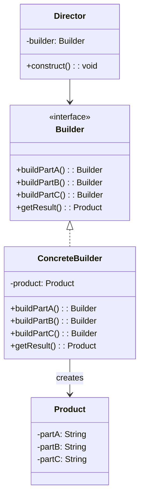
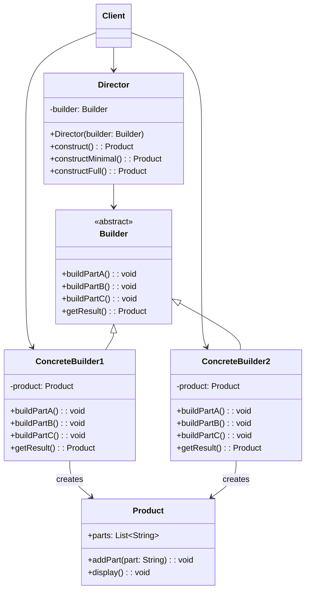
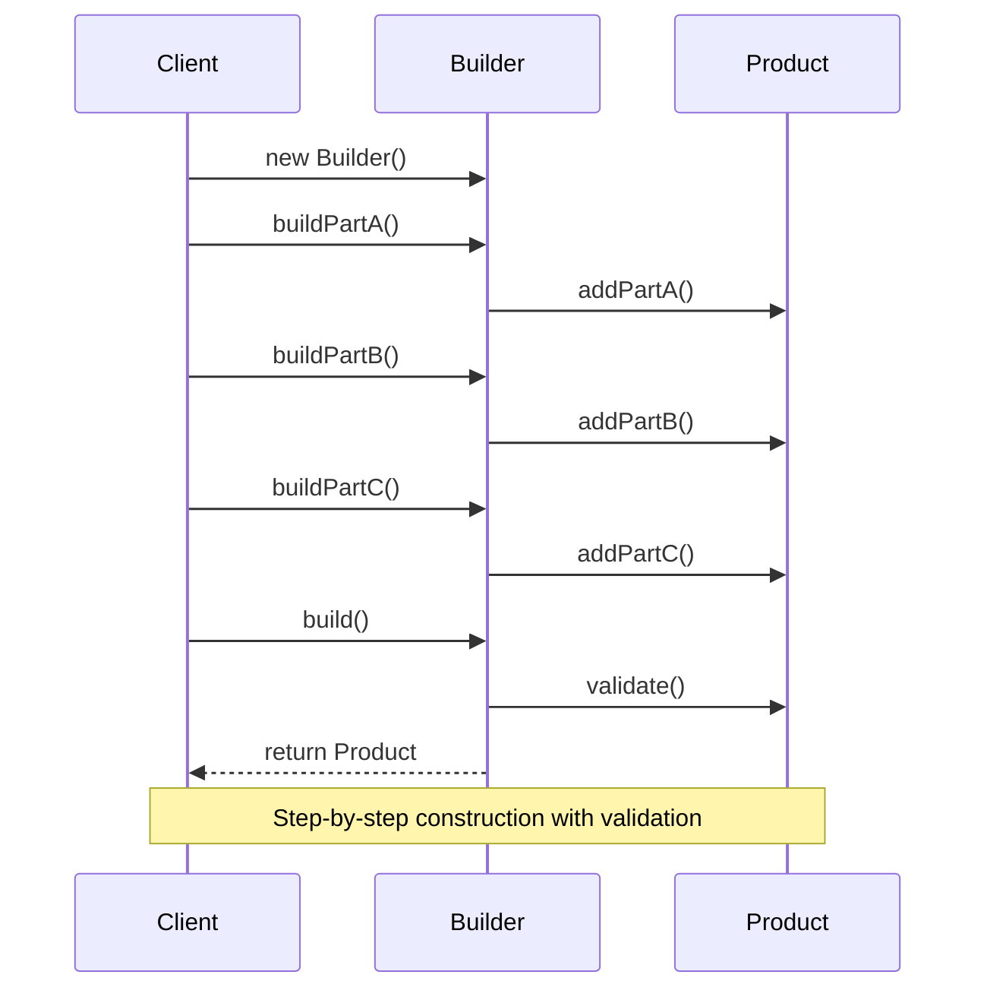

🧑‍💻 **Author:** RK ROY

# 🔨 Builder Pattern

> **Separate the construction of a complex object from its representation so that the same construction process can create different representations.**

[](https://github.com)
[](https://github.com)
[](https://github.com)

## 📋 Table of Contents

- [🎯 Intent](#-intent)
- [🚀 Problem & Solution](#-problem--solution)
- [🏗️ Structure](#️-structure)
- [💻 Implementation](#-implementation)
- [🌟 Real-World Examples](#-real-world-examples)
- [✅ Best Practices](#-best-practices)
- [❌ Common Pitfalls](#-common-pitfalls)
- [🎤 Interview Questions](#-interview-questions)

## 🎯 Intent

The Builder pattern **constructs complex objects step by step**. It allows you to produce different types and representations of an object using the same construction code, providing **fine control over the construction process** and ensuring **object consistency**.

### Key Characteristics

- ✅ **Step-by-step Construction**: Build complex objects incrementally
- ✅ **Flexible Configuration**: Same builder can create different object variations
- ✅ **Immutable Objects**: Can create immutable objects safely
- ✅ **Readable Code**: Fluent interface makes code more readable
- ✅ **Parameter Validation**: Validate parameters during construction

## 🚀 Problem & Solution

### 🚨 Problem

Consider these scenarios:

- **Complex Constructors**: Objects with many parameters (some optional)
- **SQL Query Building**: Constructing complex SQL queries dynamically
- **Configuration Objects**: Objects with many optional settings
- **Document Generation**: Building complex documents (HTML, PDF)
- **API Request Building**: Constructing HTTP requests with many options

### 💡 Solution



## 🏗️ Structure

### UML Class Diagram



### Builder Process Flow



## 💻 Implementation

### 1. 🔰 Basic Builder Pattern (Java)

```java path=null start=null
// Product class
class House {
    private String foundation;
    private String walls;
    private String roof;
    private String interior;
    private boolean hasGarden;
    private boolean hasGarage;
    private boolean hasSwimmingPool;
    private int rooms;

    // Private constructor - only builder can create
    private House() {}

    // Getters
    public String getFoundation() { return foundation; }
    public String getWalls() { return walls; }
    public String getRoof() { return roof; }
    public String getInterior() { return interior; }
    public boolean hasGarden() { return hasGarden; }
    public boolean hasGarage() { return hasGarage; }
    public boolean hasSwimmingPool() { return hasSwimmingPool; }
    public int getRooms() { return rooms; }

    @Override
    public String toString() {
        return String.format("House{foundation='%s', walls='%s', roof='%s', interior='%s', " +
                           "hasGarden=%s, hasGarage=%s, hasSwimmingPool=%s, rooms=%d}",
                           foundation, walls, roof, interior, hasGarden, hasGarage, hasSwimmingPool, rooms);
    }

    // Static nested Builder class
    public static class Builder {
        private House house;

        public Builder() {
            house = new House();
        }

        public Builder foundation(String foundation) {
            house.foundation = foundation;
            return this;
        }

        public Builder walls(String walls) {
            house.walls = walls;
            return this;
        }

        public Builder roof(String roof) {
            house.roof = roof;
            return this;
        }

        public Builder interior(String interior) {
            house.interior = interior;
            return this;
        }

        public Builder withGarden() {
            house.hasGarden = true;
            return this;
        }

        public Builder withGarage() {
            house.hasGarage = true;
            return this;
        }

        public Builder withSwimmingPool() {
            house.hasSwimmingPool = true;
            return this;
        }

        public Builder rooms(int rooms) {
            if (rooms <= 0) {
                throw new IllegalArgumentException("Number of rooms must be positive");
            }
            house.rooms = rooms;
            return this;
        }

        public House build() {
            // Validation
            if (house.foundation == null || house.foundation.isEmpty()) {
                throw new IllegalStateException("Foundation is required");
            }
            if (house.walls == null || house.walls.isEmpty()) {
                throw new IllegalStateException("Walls are required");
            }
            if (house.roof == null || house.roof.isEmpty()) {
                throw new IllegalStateException("Roof is required");
            }
            if (house.rooms <= 0) {
                throw new IllegalStateException("Number of rooms must be specified");
            }

            // Return the built house
            House builtHouse = house;
            house = new House(); // Reset for potential reuse
            return builtHouse;
        }
    }
}

// Usage example
public class BasicBuilderDemo {
    public static void main(String[] args) {
        System.out.println("🏠 House Builder Pattern Demo 🏠\n");

        // Basic house
        House basicHouse = new House.Builder()
            .foundation("Concrete")
            .walls("Brick")
            .roof("Tile")
            .rooms(3)
            .build();

        System.out.println("Basic House: " + basicHouse);
        System.out.println();

        // Luxury house with all amenities
        House luxuryHouse = new House.Builder()
            .foundation("Reinforced Concrete")
            .walls("Marble")
            .roof("Solar Tile")
            .interior("Premium")
            .rooms(8)
            .withGarden()
            .withGarage()
            .withSwimmingPool()
            .build();

        System.out.println("Luxury House: " + luxuryHouse);
        System.out.println();

        // Eco-friendly house
        House ecoHouse = new House.Builder()
            .foundation("Eco-friendly Concrete")
            .walls("Bamboo")
            .roof("Living Roof")
            .interior("Sustainable")
            .rooms(5)
            .withGarden()
            .build();

        System.out.println("Eco House: " + ecoHouse);

        // Demonstrate validation
        try {
            House invalidHouse = new House.Builder()
                .walls("Brick")
                .roof("Tile")
                .build(); // Missing foundation - should throw exception
        } catch (IllegalStateException e) {
            System.out.println("\\n❌ Validation Error: " + e.getMessage());
        }
    }
}
```

### 2. 🎨 SQL Query Builder (Java)

```java path=null start=null
import java.util.*;
import java.util.stream.Collectors;

// Product class
class SQLQuery {
    private String queryType;
    private String tableName;
    private List<String> selectColumns;
    private List<String> whereConditions;
    private List<String> joinClauses;
    private List<String> orderByColumns;
    private List<String> groupByColumns;
    private String havingCondition;
    private Integer limitCount;
    private Integer offsetCount;
    private Map<String, Object> insertValues;
    private Map<String, Object> updateValues;

    // Private constructor
    private SQLQuery() {
        this.selectColumns = new ArrayList<>();
        this.whereConditions = new ArrayList<>();
        this.joinClauses = new ArrayList<>();
        this.orderByColumns = new ArrayList<>();
        this.groupByColumns = new ArrayList<>();
        this.insertValues = new HashMap<>();
        this.updateValues = new HashMap<>();
    }

    public String toSQL() {
        StringBuilder sql = new StringBuilder();

        switch (queryType) {
            case "SELECT":
                buildSelectQuery(sql);
                break;
            case "INSERT":
                buildInsertQuery(sql);
                break;
            case "UPDATE":
                buildUpdateQuery(sql);
                break;
            case "DELETE":
                buildDeleteQuery(sql);
                break;
        }

        return sql.toString().trim();
    }

    private void buildSelectQuery(StringBuilder sql) {
        sql.append("SELECT ");
        if (selectColumns.isEmpty()) {
            sql.append("*");
        } else {
            sql.append(String.join(", ", selectColumns));
        }

        sql.append(" FROM ").append(tableName);

        joinClauses.forEach(join -> sql.append(" ").append(join));

        if (!whereConditions.isEmpty()) {
            sql.append(" WHERE ").append(String.join(" AND ", whereConditions));
        }

        if (!groupByColumns.isEmpty()) {
            sql.append(" GROUP BY ").append(String.join(", ", groupByColumns));
        }

        if (havingCondition != null) {
            sql.append(" HAVING ").append(havingCondition);
        }

        if (!orderByColumns.isEmpty()) {
            sql.append(" ORDER BY ").append(String.join(", ", orderByColumns));
        }

        if (limitCount != null) {
            sql.append(" LIMIT ").append(limitCount);
        }

        if (offsetCount != null) {
            sql.append(" OFFSET ").append(offsetCount);
        }
    }

    private void buildInsertQuery(StringBuilder sql) {
        sql.append("INSERT INTO ").append(tableName);

        if (!insertValues.isEmpty()) {
            sql.append(" (").append(String.join(", ", insertValues.keySet())).append(")");
            sql.append(" VALUES (");
            sql.append(insertValues.values().stream()
                      .map(this::formatValue)
                      .collect(Collectors.joining(", ")));
            sql.append(")");
        }
    }

    private void buildUpdateQuery(StringBuilder sql) {
        sql.append("UPDATE ").append(tableName).append(" SET ");

        sql.append(updateValues.entrySet().stream()
                  .map(entry -> entry.getKey() + " = " + formatValue(entry.getValue()))
                  .collect(Collectors.joining(", ")));

        if (!whereConditions.isEmpty()) {
            sql.append(" WHERE ").append(String.join(" AND ", whereConditions));
        }
    }

    private void buildDeleteQuery(StringBuilder sql) {
        sql.append("DELETE FROM ").append(tableName);

        if (!whereConditions.isEmpty()) {
            sql.append(" WHERE ").append(String.join(" AND ", whereConditions));
        }
    }

    private String formatValue(Object value) {
        if (value instanceof String) {
            return "'" + value.toString().replace("'", "''") + "'";
        } else if (value == null) {
            return "NULL";
        } else {
            return value.toString();
        }
    }

    // Builder class
    public static class Builder {
        private SQLQuery query;

        public Builder() {
            query = new SQLQuery();
        }

        // SELECT query builder
        public Builder select(String... columns) {
            query.queryType = "SELECT";
            Collections.addAll(query.selectColumns, columns);
            return this;
        }

        public Builder selectAll() {
            query.queryType = "SELECT";
            query.selectColumns.clear();
            return this;
        }

        public Builder from(String tableName) {
            query.tableName = tableName;
            return this;
        }

        public Builder where(String condition) {
            query.whereConditions.add(condition);
            return this;
        }

        public Builder whereEquals(String column, Object value) {
            query.whereConditions.add(column + " = " + query.formatValue(value));
            return this;
        }

        public Builder whereIn(String column, Object... values) {
            String inClause = Arrays.stream(values)
                .map(query::formatValue)
                .collect(Collectors.joining(", ", "(", ")"));
            query.whereConditions.add(column + " IN " + inClause);
            return this;
        }

        public Builder whereBetween(String column, Object start, Object end) {
            query.whereConditions.add(column + " BETWEEN " +
                query.formatValue(start) + " AND " + query.formatValue(end));
            return this;
        }

        public Builder join(String table, String condition) {
            query.joinClauses.add("JOIN " + table + " ON " + condition);
            return this;
        }

        public Builder leftJoin(String table, String condition) {
            query.joinClauses.add("LEFT JOIN " + table + " ON " + condition);
            return this;
        }

        public Builder rightJoin(String table, String condition) {
            query.joinClauses.add("RIGHT JOIN " + table + " ON " + condition);
            return this;
        }

        public Builder innerJoin(String table, String condition) {
            query.joinClauses.add("INNER JOIN " + table + " ON " + condition);
            return this;
        }

        public Builder groupBy(String... columns) {
            Collections.addAll(query.groupByColumns, columns);
            return this;
        }

        public Builder having(String condition) {
            query.havingCondition = condition;
            return this;
        }

        public Builder orderBy(String column) {
            query.orderByColumns.add(column);
            return this;
        }

        public Builder orderByDesc(String column) {
            query.orderByColumns.add(column + " DESC");
            return this;
        }

        public Builder limit(int count) {
            query.limitCount = count;
            return this;
        }

        public Builder offset(int count) {
            query.offsetCount = count;
            return this;
        }

        // INSERT query builder
        public Builder insertInto(String tableName) {
            query.queryType = "INSERT";
            query.tableName = tableName;
            return this;
        }

        public Builder value(String column, Object value) {
            query.insertValues.put(column, value);
            return this;
        }

        public Builder values(Map<String, Object> values) {
            query.insertValues.putAll(values);
            return this;
        }

        // UPDATE query builder
        public Builder update(String tableName) {
            query.queryType = "UPDATE";
            query.tableName = tableName;
            return this;
        }

        public Builder set(String column, Object value) {
            query.updateValues.put(column, value);
            return this;
        }

        public Builder setValues(Map<String, Object> values) {
            query.updateValues.putAll(values);
            return this;
        }

        // DELETE query builder
        public Builder deleteFrom(String tableName) {
            query.queryType = "DELETE";
            query.tableName = tableName;
            return this;
        }

        public SQLQuery build() {
            // Validation
            if (query.tableName == null || query.tableName.isEmpty()) {
                throw new IllegalStateException("Table name is required");
            }

            if (query.queryType == null) {
                throw new IllegalStateException("Query type must be specified");
            }

            // Additional validations based on query type
            switch (query.queryType) {
                case "INSERT":
                    if (query.insertValues.isEmpty()) {
                        throw new IllegalStateException("INSERT query requires at least one value");
                    }
                    break;
                case "UPDATE":
                    if (query.updateValues.isEmpty()) {
                        throw new IllegalStateException("UPDATE query requires at least one value to set");
                    }
                    break;
            }

            SQLQuery builtQuery = query;
            query = new SQLQuery(); // Reset for potential reuse
            return builtQuery;
        }
    }
}

// Usage example
public class SQLQueryBuilderDemo {
    public static void main(String[] args) {
        System.out.println("🗄️ SQL Query Builder Pattern Demo 🗄️\n");

        // Simple SELECT query
        SQLQuery simpleSelect = new SQLQuery.Builder()
            .select("name", "email")
            .from("users")
            .whereEquals("active", true)
            .orderBy("name")
            .build();

        System.out.println("Simple SELECT:");
        System.out.println(simpleSelect.toSQL());
        System.out.println();

        // Complex SELECT with joins and grouping
        SQLQuery complexSelect = new SQLQuery.Builder()
            .select("u.name", "u.email", "COUNT(o.id) as order_count")
            .from("users u")
            .leftJoin("orders o", "u.id = o.user_id")
            .where("u.created_at > '2023-01-01'")
            .whereIn("u.status", "active", "premium")
            .groupBy("u.id", "u.name", "u.email")
            .having("COUNT(o.id) > 5")
            .orderByDesc("order_count")
            .limit(10)
            .build();

        System.out.println("Complex SELECT:");
        System.out.println(complexSelect.toSQL());
        System.out.println();

        // INSERT query
        Map<String, Object> userData = new HashMap<>();
        userData.put("name", "John Doe");
        userData.put("email", "john@example.com");
        userData.put("age", 30);

        SQLQuery insertQuery = new SQLQuery.Builder()
            .insertInto("users")
            .values(userData)
            .value("created_at", "NOW()")
            .build();

        System.out.println("INSERT:");
        System.out.println(insertQuery.toSQL());
        System.out.println();

        // UPDATE query
        SQLQuery updateQuery = new SQLQuery.Builder()
            .update("users")
            .set("email", "newemail@example.com")
            .set("updated_at", "NOW()")
            .whereEquals("id", 123)
            .build();

        System.out.println("UPDATE:");
        System.out.println(updateQuery.toSQL());
        System.out.println();

        // DELETE query
        SQLQuery deleteQuery = new SQLQuery.Builder()
            .deleteFrom("users")
            .where("active = false")
            .whereBetween("created_at", "2020-01-01", "2022-12-31")
            .build();

        System.out.println("DELETE:");
        System.out.println(deleteQuery.toSQL());
        System.out.println();

        // Pagination query
        SQLQuery paginationQuery = new SQLQuery.Builder()
            .selectAll()
            .from("products")
            .where("category = 'electronics'")
            .orderBy("price")
            .limit(20)
            .offset(40) // Page 3 (assuming 20 items per page)
            .build();

        System.out.println("Pagination:");
        System.out.println(paginationQuery.toSQL());
    }
}
```

### 3. 🐍 Configuration Builder (Python)

````python path=null start=null
from typing import Dict, List, Any, Optional, Union\nfrom dataclasses import dataclass, field\nfrom enum import Enum\nimport json\n\n# Enums for configuration options\nclass LogLevel(Enum):\n    DEBUG = \"DEBUG\"\n    INFO = \"INFO\"\n    WARN = \"WARN\"\n    ERROR = \"ERROR\"\n\nclass DatabaseType(Enum):\n    MYSQL = \"mysql\"\n    POSTGRESQL = \"postgresql\"\n    SQLITE = \"sqlite\"\n    MONGODB = \"mongodb\"\n\nclass CacheType(Enum):\n    REDIS = \"redis\"\n    MEMCACHED = \"memcached\"\n    IN_MEMORY = \"in_memory\"\n\n# Configuration data classes\n@dataclass\nclass DatabaseConfig:\n    db_type: DatabaseType\n    host: str\n    port: int\n    username: str\n    password: str\n    database_name: str\n    connection_pool_size: int = 10\n    connection_timeout: int = 30\n    ssl_enabled: bool = False\n    \n    def to_dict(self) -> Dict[str, Any]:\n        return {\n            \"type\": self.db_type.value,\n            \"host\": self.host,\n            \"port\": self.port,\n            \"username\": self.username,\n            \"password\": \"***\",  # Hide password in output\n            \"database\": self.database_name,\n            \"pool_size\": self.connection_pool_size,\n            \"timeout\": self.connection_timeout,\n            \"ssl\": self.ssl_enabled\n        }\n\n@dataclass\nclass CacheConfig:\n    cache_type: CacheType\n    host: str = \"localhost\"\n    port: int = 6379\n    ttl_seconds: int = 3600\n    max_memory_mb: int = 128\n    \n    def to_dict(self) -> Dict[str, Any]:\n        return {\n            \"type\": self.cache_type.value,\n            \"host\": self.host,\n            \"port\": self.port,\n            \"ttl\": self.ttl_seconds,\n            \"max_memory\": self.max_memory_mb\n        }\n\n@dataclass\nclass SecurityConfig:\n    jwt_secret: str\n    jwt_expiration_hours: int = 24\n    password_min_length: int = 8\n    require_special_chars: bool = True\n    max_login_attempts: int = 5\n    session_timeout_minutes: int = 30\n    enable_2fa: bool = False\n    \n    def to_dict(self) -> Dict[str, Any]:\n        return {\n            \"jwt_secret\": \"***\",  # Hide secret in output\n            \"jwt_expiration\": self.jwt_expiration_hours,\n            \"password_min_length\": self.password_min_length,\n            \"require_special_chars\": self.require_special_chars,\n            \"max_login_attempts\": self.max_login_attempts,\n            \"session_timeout\": self.session_timeout_minutes,\n            \"two_factor_auth\": self.enable_2fa\n        }\n\n# Main configuration product\nclass ApplicationConfig:\n    def __init__(self):\n        self.app_name: str = \"MyApplication\"\n        self.version: str = \"1.0.0\"\n        self.environment: str = \"development\"\n        self.debug: bool = True\n        self.log_level: LogLevel = LogLevel.INFO\n        self.host: str = \"localhost\"\n        self.port: int = 8080\n        self.database: Optional[DatabaseConfig] = None\n        self.cache: Optional[CacheConfig] = None\n        self.security: Optional[SecurityConfig] = None\n        self.features: Dict[str, bool] = {}\n        self.custom_settings: Dict[str, Any] = {}\n        self.middleware: List[str] = []\n        self.cors_origins: List[str] = [\"*\"]\n        self.rate_limit_per_minute: int = 60\n        self.max_request_size_mb: int = 10\n    \n    def to_dict(self) -> Dict[str, Any]:\n        config_dict = {\n            \"application\": {\n                \"name\": self.app_name,\n                \"version\": self.version,\n                \"environment\": self.environment,\n                \"debug\": self.debug,\n                \"log_level\": self.log_level.value,\n                \"host\": self.host,\n                \"port\": self.port\n            },\n            \"features\": self.features,\n            \"middleware\": self.middleware,\n            \"cors_origins\": self.cors_origins,\n            \"rate_limit\": self.rate_limit_per_minute,\n            \"max_request_size\": self.max_request_size_mb,\n            \"custom\": self.custom_settings\n        }\n        \n        if self.database:\n            config_dict[\"database\"] = self.database.to_dict()\n        \n        if self.cache:\n            config_dict[\"cache\"] = self.cache.to_dict()\n        \n        if self.security:\n            config_dict[\"security\"] = self.security.to_dict()\n        \n        return config_dict\n    \n    def to_json(self, indent: int = 2) -> str:\n        return json.dumps(self.to_dict(), indent=indent)\n    \n    def validate(self) -> List[str]:\n        \"\"\"Validate the configuration and return list of errors\"\"\"\n        errors = []\n        \n        # Basic validation\n        if not self.app_name or not self.app_name.strip():\n            errors.append(\"Application name is required\")\n        \n        if self.port < 1 or self.port > 65535:\n            errors.append(\"Port must be between 1 and 65535\")\n        \n        if self.max_request_size_mb < 1:\n            errors.append(\"Max request size must be at least 1 MB\")\n        \n        if self.rate_limit_per_minute < 1:\n            errors.append(\"Rate limit must be at least 1 request per minute\")\n        \n        # Database validation\n        if self.database:\n            if not self.database.host:\n                errors.append(\"Database host is required\")\n            if not self.database.database_name:\n                errors.append(\"Database name is required\")\n            if self.database.connection_pool_size < 1:\n                errors.append(\"Database connection pool size must be at least 1\")\n        \n        # Security validation\n        if self.security:\n            if len(self.security.jwt_secret) < 32:\n                errors.append(\"JWT secret must be at least 32 characters\")\n            if self.security.jwt_expiration_hours < 1:\n                errors.append(\"JWT expiration must be at least 1 hour\")\n        \n        return errors\n\n# Builder class\nclass ApplicationConfigBuilder:\n    def __init__(self):\n        self._config = ApplicationConfig()\n    \n    # Application settings\n    def app_name(self, name: str) -> 'ApplicationConfigBuilder':\n        self._config.app_name = name\n        return self\n    \n    def version(self, version: str) -> 'ApplicationConfigBuilder':\n        self._config.version = version\n        return self\n    \n    def environment(self, env: str) -> 'ApplicationConfigBuilder':\n        self._config.environment = env\n        return self\n    \n    def debug(self, enabled: bool = True) -> 'ApplicationConfigBuilder':\n        self._config.debug = enabled\n        return self\n    \n    def log_level(self, level: LogLevel) -> 'ApplicationConfigBuilder':\n        self._config.log_level = level\n        return self\n    \n    def host(self, host: str) -> 'ApplicationConfigBuilder':\n        self._config.host = host\n        return self\n    \n    def port(self, port: int) -> 'ApplicationConfigBuilder':\n        if port < 1 or port > 65535:\n            raise ValueError(\"Port must be between 1 and 65535\")\n        self._config.port = port\n        return self\n    \n    # Database configuration\n    def database(self, \n                db_type: DatabaseType,\n                host: str,\n                port: int,\n                username: str,\n                password: str,\n                database_name: str) -> 'ApplicationConfigBuilder':\n        self._config.database = DatabaseConfig(\n            db_type=db_type,\n            host=host,\n            port=port,\n            username=username,\n            password=password,\n            database_name=database_name\n        )\n        return self\n    \n    def database_pool_size(self, size: int) -> 'ApplicationConfigBuilder':\n        if self._config.database:\n            self._config.database.connection_pool_size = size\n        return self\n    \n    def database_ssl(self, enabled: bool = True) -> 'ApplicationConfigBuilder':\n        if self._config.database:\n            self._config.database.ssl_enabled = enabled\n        return self\n    \n    # Cache configuration\n    def cache(self, cache_type: CacheType, host: str = \"localhost\", port: int = None) -> 'ApplicationConfigBuilder':\n        default_ports = {\n            CacheType.REDIS: 6379,\n            CacheType.MEMCACHED: 11211,\n            CacheType.IN_MEMORY: 0\n        }\n        \n        if port is None:\n            port = default_ports.get(cache_type, 6379)\n        \n        self._config.cache = CacheConfig(\n            cache_type=cache_type,\n            host=host,\n            port=port\n        )\n        return self\n    \n    def cache_ttl(self, seconds: int) -> 'ApplicationConfigBuilder':\n        if self._config.cache:\n            self._config.cache.ttl_seconds = seconds\n        return self\n    \n    # Security configuration\n    def security(self, jwt_secret: str) -> 'ApplicationConfigBuilder':\n        if len(jwt_secret) < 32:\n            raise ValueError(\"JWT secret must be at least 32 characters\")\n        \n        self._config.security = SecurityConfig(jwt_secret=jwt_secret)\n        return self\n    \n    def jwt_expiration(self, hours: int) -> 'ApplicationConfigBuilder':\n        if self._config.security:\n            self._config.security.jwt_expiration_hours = hours\n        return self\n    \n    def enable_2fa(self) -> 'ApplicationConfigBuilder':\n        if self._config.security:\n            self._config.security.enable_2fa = True\n        return self\n    \n    def password_policy(self, min_length: int = 8, require_special: bool = True) -> 'ApplicationConfigBuilder':\n        if self._config.security:\n            self._config.security.password_min_length = min_length\n            self._config.security.require_special_chars = require_special\n        return self\n    \n    # Feature flags\n    def feature(self, name: str, enabled: bool = True) -> 'ApplicationConfigBuilder':\n        self._config.features[name] = enabled\n        return self\n    \n    def features(self, feature_dict: Dict[str, bool]) -> 'ApplicationConfigBuilder':\n        self._config.features.update(feature_dict)\n        return self\n    \n    # Middleware\n    def middleware(self, *middleware_names: str) -> 'ApplicationConfigBuilder':\n        self._config.middleware.extend(middleware_names)\n        return self\n    \n    # CORS settings\n    def cors_origins(self, *origins: str) -> 'ApplicationConfigBuilder':\n        self._config.cors_origins = list(origins)\n        return self\n    \n    def allow_all_cors(self) -> 'ApplicationConfigBuilder':\n        self._config.cors_origins = [\"*\"]\n        return self\n    \n    # Rate limiting\n    def rate_limit(self, requests_per_minute: int) -> 'ApplicationConfigBuilder':\n        if requests_per_minute < 1:\n            raise ValueError(\"Rate limit must be at least 1 request per minute\")\n        self._config.rate_limit_per_minute = requests_per_minute\n        return self\n    \n    # Request size limit\n    def max_request_size(self, mb: int) -> 'ApplicationConfigBuilder':\n        if mb < 1:\n            raise ValueError(\"Max request size must be at least 1 MB\")\n        self._config.max_request_size_mb = mb\n        return self\n    \n    # Custom settings\n    def custom_setting(self, key: str, value: Any) -> 'ApplicationConfigBuilder':\n        self._config.custom_settings[key] = value\n        return self\n    \n    def custom_settings(self, settings: Dict[str, Any]) -> 'ApplicationConfigBuilder':\n        self._config.custom_settings.update(settings)\n        return self\n    \n    # Preset configurations\n    def development_preset(self) -> 'ApplicationConfigBuilder':\n        return (self\n                .environment(\"development\")\n                .debug(True)\n                .log_level(LogLevel.DEBUG)\n                .rate_limit(1000)\n                .allow_all_cors())\n    \n    def production_preset(self) -> 'ApplicationConfigBuilder':\n        return (self\n                .environment(\"production\")\n                .debug(False)\n                .log_level(LogLevel.INFO)\n                .rate_limit(60)\n                .cors_origins(\"https://myapp.com\", \"https://www.myapp.com\"))\n    \n    def testing_preset(self) -> 'ApplicationConfigBuilder':\n        return (self\n                .environment(\"testing\")\n                .debug(True)\n                .log_level(LogLevel.WARN)\n                .rate_limit(10000)\n                .allow_all_cors())\n    \n    # Build method\n    def build(self) -> ApplicationConfig:\n        # Validate the configuration\n        errors = self._config.validate()\n        if errors:\n            raise ValueError(f\"Configuration validation failed: {'; '.join(errors)}\")\n        \n        # Return the built configuration\n        built_config = self._config\n        self._config = ApplicationConfig()  # Reset for potential reuse\n        return built_config\n\n# Factory methods for common configurations\nclass ConfigFactory:\n    @staticmethod\n    def create_web_api_config(app_name: str, environment: str = \"development\") -> ApplicationConfig:\n        builder = ApplicationConfigBuilder()\n        \n        config = (builder\n                  .app_name(app_name)\n                  .port(8080)\n                  .middleware(\"cors\", \"auth\", \"rate_limit\", \"logging\")\n                  .feature(\"api_docs\", True)\n                  .feature(\"metrics\", True))\n        \n        if environment == \"development\":\n            config = config.development_preset()\n        elif environment == \"production\":\n            config = config.production_preset()\n        elif environment == \"testing\":\n            config = config.testing_preset()\n        \n        return config.build()\n    \n    @staticmethod\n    def create_microservice_config(service_name: str) -> ApplicationConfig:\n        return (ApplicationConfigBuilder()\n                .app_name(service_name)\n                .production_preset()\n                .port(8080)\n                .cache(CacheType.REDIS)\n                .cache_ttl(1800)\n                .middleware(\"tracing\", \"metrics\", \"health_check\")\n                .feature(\"circuit_breaker\", True)\n                .feature(\"retry_policy\", True)\n                .rate_limit(100)\n                .max_request_size(5)\n                .build())\n    \n    @staticmethod\n    def create_database_app_config(app_name: str, db_config: Dict[str, str]) -> ApplicationConfig:\n        return (ApplicationConfigBuilder()\n                .app_name(app_name)\n                .production_preset()\n                .database(\n                    DatabaseType(db_config['type']),\n                    db_config['host'],\n                    int(db_config['port']),\n                    db_config['username'],\n                    db_config['password'],\n                    db_config['database']\n                )\n                .database_pool_size(20)\n                .database_ssl(True)\n                .middleware(\"db_transaction\", \"db_logging\")\n                .feature(\"db_migration\", True)\n                .build())\n\n# Usage example\nif __name__ == \"__main__\":\n    print(\"⚙️ Configuration Builder Pattern Demo ⚙️\\n\")\n    \n    # Simple configuration\n    print(\"=== Simple Configuration ===\")\n    simple_config = (ApplicationConfigBuilder()\n                     .app_name(\"Simple App\")\n                     .version(\"1.0.0\")\n                     .development_preset()\n                     .build())\n    \n    print(simple_config.to_json())\n    print()\n    \n    # Complex configuration with all features\n    print(\"=== Complex Configuration ===\")\n    try:\n        complex_config = (ApplicationConfigBuilder()\n                          .app_name(\"Complex Enterprise App\")\n                          .version(\"2.1.0\")\n                          .production_preset()\n                          .host(\"0.0.0.0\")\n                          .port(8443)\n                          .database(\n                              DatabaseType.POSTGRESQL,\n                              \"db.example.com\",\n                              5432,\n                              \"app_user\",\n                              \"super_secure_password_12345678\",\n                              \"production_db\"\n                          )\n                          .database_pool_size(50)\n                          .database_ssl()\n                          .cache(CacheType.REDIS, \"redis.example.com\", 6379)\n                          .cache_ttl(3600)\n                          .security(\"this_is_a_very_secure_jwt_secret_key_with_more_than_32_chars\")\n                          .jwt_expiration(12)\n                          .enable_2fa()\n                          .password_policy(10, True)\n                          .features({\n                              \"user_registration\": True,\n                              \"email_notifications\": True,\n                              \"admin_panel\": True,\n                              \"analytics\": True,\n                              \"file_upload\": True\n                          })\n                          .middleware(\"auth\", \"cors\", \"rate_limit\", \"logging\", \"monitoring\")\n                          .cors_origins(\"https://app.example.com\", \"https://admin.example.com\")\n                          .rate_limit(120)\n                          .max_request_size(50)\n                          .custom_settings({\n                              \"email_service_url\": \"https://api.emailservice.com\",\n                              \"storage_provider\": \"aws_s3\",\n                              \"cdn_url\": \"https://cdn.example.com\"\n                          })\n                          .build())\n        \n        print(complex_config.to_json())\n    except ValueError as e:\n        print(f\"❌ Configuration Error: {e}\")\n    \n    print()\n    \n    # Using factory methods\n    print(\"=== Factory-created Configurations ===\")\n    \n    web_api_config = ConfigFactory.create_web_api_config(\"My Web API\", \"production\")\n    print(\"Web API Config:\")\n    print(json.dumps(web_api_config.to_dict()['application'], indent=2))\n    print()\n    \n    microservice_config = ConfigFactory.create_microservice_config(\"User Service\")\n    print(\"Microservice Config:\")\n    print(json.dumps(microservice_config.to_dict()['application'], indent=2))\n    print()\n    \n    # Configuration validation demo\n    print(\"=== Configuration Validation ===\")\n    try:\n        invalid_config = (ApplicationConfigBuilder()\n                          .app_name(\"\")  # Invalid: empty name\n                          .port(70000)  # Invalid: port out of range\n                          .build())\n    except ValueError as e:\n        print(f\"✅ Validation caught errors: {e}\")\n```

## ✅ Best Practices

### 🎯 When to Use Builder Pattern
- ✅ **Complex object construction** with many parameters
- ✅ **Optional parameters** that make constructors unwieldy
- ✅ **Immutable objects** that need step-by-step construction
- ✅ **Validation during construction** process
- ✅ **Multiple representations** of the same object

### 📊 Builder Pattern Benefits

```mermaid
graph TD
    A[Builder Pattern Benefits] --> B[Readable Code]
    A --> C[Flexible Construction]
    A --> D[Validation]
    A --> E[Immutable Objects]
    A --> F[Step-by-Step Building]

    B --> B1[Fluent interface makes<br/>code self-documenting]
    C --> C1[Same builder can create<br/>different object variants]
    D --> D1[Validate parameters<br/>during construction]
    E --> E1[Safe creation of<br/>immutable objects]
    F --> F1[Control construction<br/>order and process]
````

### 🏗️ Builder Variations

```mermaid
flowchart TD
    A[Builder Pattern Types] --> B[Simple Builder]
    A --> C[Director Builder]
    A --> D[Fluent Builder]
    A --> E[Telescoping Builder]

    B --> B1[Basic step-by-step construction]
    C --> C1[Separate director controls process]
    D --> D1[Method chaining for readability]
    E --> E1[Multiple build methods for variations]

    style A fill:#e1f5fe
    style B fill:#f3e5f5
    style C fill:#fff3e0
    style D fill:#e8f5e8
    style E fill:#fce4ec
```

## ❌ Common Pitfalls

### 🚨 Anti-Patterns to Avoid

1. **Not Validating Construction Parameters**

```java path=null start=null
// BAD: No validation in builder
class BadBuilder {
    private String email;
    private int age;

    public BadBuilder email(String email) {
        this.email = email; // No validation!
        return this;
    }

    public BadBuilder age(int age) {
        this.age = age; // Negative ages allowed!
        return this;
    }
}

// GOOD: Proper validation
class GoodBuilder {
    private String email;
    private int age;

    public GoodBuilder email(String email) {
        if (email == null || !email.contains("@")) {
            throw new IllegalArgumentException("Invalid email format");
        }
        this.email = email;
        return this;
    }

    public GoodBuilder age(int age) {
        if (age < 0 || age > 150) {
            throw new IllegalArgumentException("Age must be between 0 and 150");
        }
        this.age = age;
        return this;
    }
}
```

2. **Mutable Objects in Builder**

```java path=null start=null
// BAD: Builder creates mutable object
class BadUser {
    private String name;
    private String email;

    // Setters allow mutation after construction
    public void setName(String name) { this.name = name; }
    public void setEmail(String email) { this.email = email; }
}

// GOOD: Builder creates immutable object
class GoodUser {
    private final String name;
    private final String email;

    private GoodUser(String name, String email) {
        this.name = name;
        this.email = email;
    }

    // Only getters, no setters
    public String getName() { return name; }
    public String getEmail() { return email; }

    public static class Builder {
        // Builder implementation...
    }
}
```

3. **Not Handling Required vs Optional Fields**

```java path=null start=null
// BAD: No distinction between required and optional
class BadBuilder {
    public Product build() {
        return new Product(name, description, price, category);
        // What if name is null? What if price is 0?
    }
}

// GOOD: Clear required vs optional handling
class GoodBuilder {
    private String name; // Required
    private double price; // Required
    private String description = ""; // Optional with default
    private String category = "General"; // Optional with default

    public Product build() {
        if (name == null || name.isEmpty()) {
            throw new IllegalStateException("Name is required");
        }
        if (price <= 0) {
            throw new IllegalStateException("Price must be positive");
        }
        return new Product(name, description, price, category);
    }
}
```

## 🎤 Interview Questions

### 📝 Fundamental Questions

**Q1: What is the Builder pattern and when would you use it?**

**A:** The Builder pattern separates object construction from representation, allowing step-by-step creation of complex objects. Use it when:

- Objects have many constructor parameters (especially optional ones)
- You need to create different representations of the same object
- Construction process must be controlled or validated
- You want to create immutable objects safely

**Q2: What's the difference between Builder pattern and Factory pattern?**

**A:**

- **Builder**: Constructs objects step-by-step, focuses on HOW to build
- **Factory**: Creates objects in one step, focuses on WHAT to create
- **Builder** is better for complex objects with many parameters
- **Factory** is better for simple object creation with few variations

**Q3: How does Builder pattern handle optional parameters?**

**A:**

```java path=null start=null
class User {
    // Required fields
    private final String name;
    private final String email;

    // Optional fields with defaults
    private final int age;
    private final String address;
    private final boolean isActive;

    public static class Builder {
        // Required parameters
        private final String name;
        private final String email;

        // Optional parameters with defaults
        private int age = 0;
        private String address = "";
        private boolean isActive = true;

        public Builder(String name, String email) {
            this.name = name;
            this.email = email;
        }

        public Builder age(int age) {
            this.age = age;
            return this;
        }

        public Builder address(String address) {
            this.address = address;
            return this;
        }

        public Builder inactive() {
            this.isActive = false;
            return this;
        }

        public User build() {
            return new User(this);
        }
    }
}
```

### 🚀 Advanced Questions

**Q4: How do you implement validation in Builder pattern?**

**A:**

```java path=null start=null
class ValidatedBuilder {
    private String email;
    private int age;
    private List<String> errors = new ArrayList<>();

    public ValidatedBuilder email(String email) {
        if (email == null || !isValidEmail(email)) {
            errors.add("Invalid email format");
        }
        this.email = email;
        return this;
    }

    public ValidatedBuilder age(int age) {
        if (age < 0 || age > 150) {
            errors.add("Age must be between 0 and 150");
        }
        this.age = age;
        return this;
    }

    public User build() {
        if (!errors.isEmpty()) {
            throw new IllegalStateException("Validation errors: " +
                String.join(", ", errors));
        }

        if (email == null) {
            throw new IllegalStateException("Email is required");
        }

        return new User(email, age);
    }

    private boolean isValidEmail(String email) {
        return email.contains("@") && email.contains(".");
    }
}
```

**Q5: How do you handle inheritance with Builder pattern?**

**A:**

```java path=null start=null
// Base class with builder
abstract class Vehicle {
    protected final String brand;
    protected final String model;

    protected Vehicle(Builder<?> builder) {
        this.brand = builder.brand;
        this.model = builder.model;
    }

    public abstract static class Builder<T extends Builder<T>> {
        protected String brand;
        protected String model;

        public T brand(String brand) {
            this.brand = brand;
            return self();
        }

        public T model(String model) {
            this.model = model;
            return self();
        }

        protected abstract T self();
        public abstract Vehicle build();
    }
}

// Derived class with extended builder
class Car extends Vehicle {
    private final int doors;

    private Car(Builder builder) {
        super(builder);
        this.doors = builder.doors;
    }

    public static class Builder extends Vehicle.Builder<Builder> {
        private int doors = 4;

        public Builder doors(int doors) {
            this.doors = doors;
            return this;
        }

        @Override
        protected Builder self() {
            return this;
        }

        @Override
        public Car build() {
            return new Car(this);
        }
    }
}

// Usage
Car car = new Car.Builder()
    .brand("Toyota")
    .model("Camry")
    .doors(4)
    .build();
```

## 🎯 Summary

| Aspect        | Details                                                      |
| ------------- | ------------------------------------------------------------ |
| **Intent**    | Construct complex objects step by step                       |
| **Problem**   | Complex constructors with many parameters                    |
| **Solution**  | Separate construction logic in builder class                 |
| **Benefits**  | Readable code, flexible construction, validation             |
| **Drawbacks** | More code, additional complexity                             |
| **Use When**  | Complex objects, many optional parameters, immutable objects |

### 📚 Key Takeaways

1. **Use for complex object construction** with many parameters
2. **Implement proper validation** during construction process
3. **Create immutable objects** safely with builders
4. **Provide fluent interface** for better readability
5. **Handle required vs optional parameters** explicitly

---

[← Back: Decorator Pattern](../06-decorator/) | [🏠 Back to Design Patterns](../)
