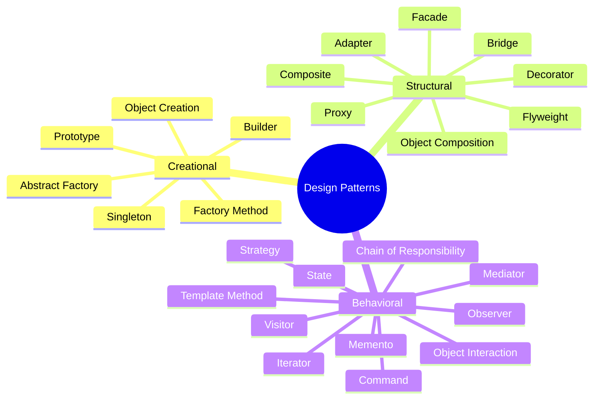
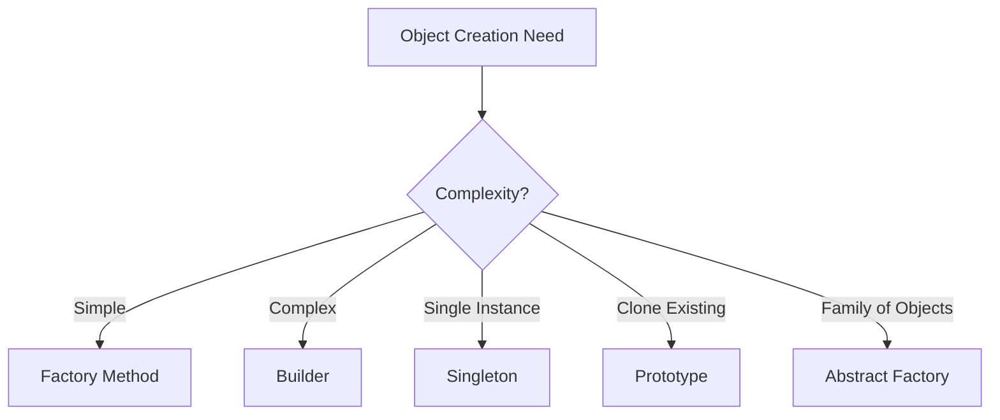
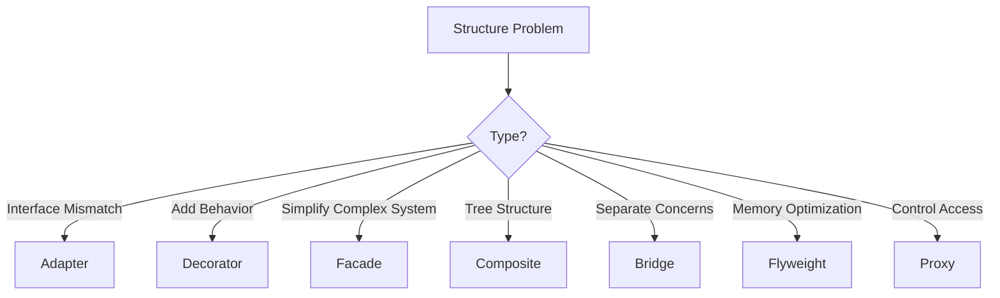
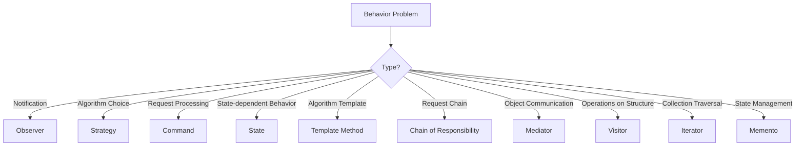
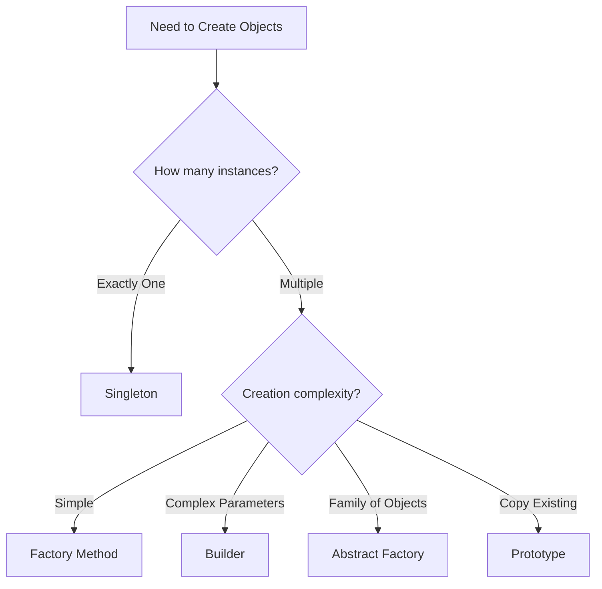
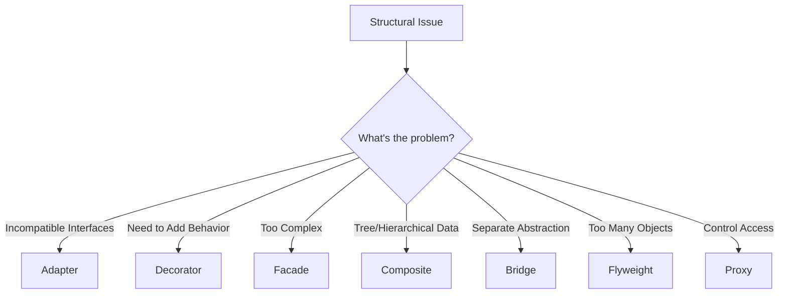
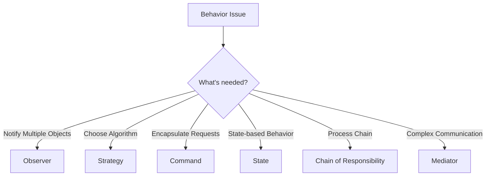
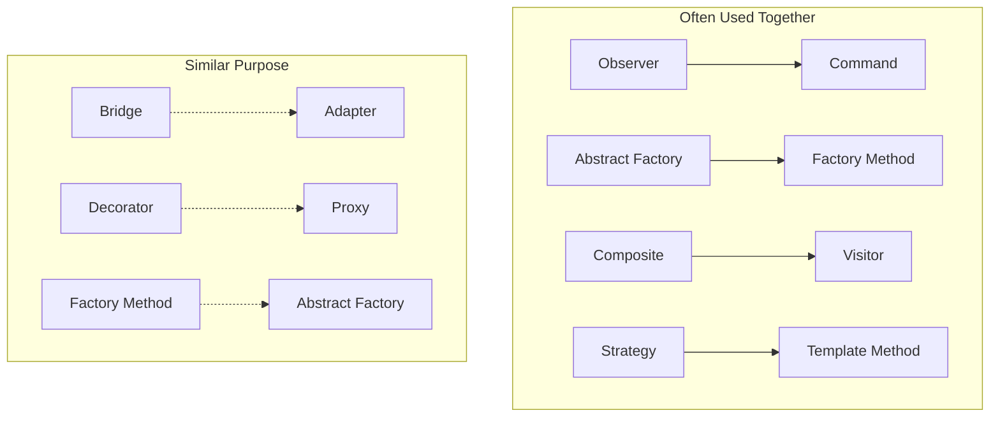

# 🎨 Design Patterns

Design patterns are reusable solutions to common problems in software design. They represent best practices evolved over time by experienced object-oriented software developers. This section covers all 23 Gang of Four (GoF) design patterns with detailed explanations, examples, and real-world implementations.

## 🎯 What are Design Patterns?

> Design patterns are descriptions of communicating objects and classes that are customized to solve a general design problem in a particular context.
>
> *- Gang of Four*

### Key Benefits
- **Reusability**: Proven solutions that can be applied to similar problems
- **Communication**: Common vocabulary for developers
- **Best Practices**: Encapsulate expert knowledge and experience
- **Flexibility**: Make code more flexible and maintainable

## 📚 Pattern Categories

## 🏗️ Creational Patterns

**Purpose**: Deal with object creation mechanisms, trying to create objects in a manner suitable to the situation.

| Pattern | Purpose | Use When |
|---------|---------|----------|
| [**Singleton**](./creational/01-singleton.md) | Ensure only one instance exists | Need exactly one instance (DB connection, logger) |
| [**Factory Method**](./creational/02-factory-method.md) | Create objects without specifying exact classes | Object creation logic is complex or varies |
| [**Abstract Factory**](./creational/03-abstract-factory.md) | Create families of related objects | Need to create groups of related objects |
| [**Builder**](./creational/04-builder.md) | Construct complex objects step by step | Objects have many optional parameters |
| [**Prototype**](./creational/05-prototype.md) | Create objects by cloning existing instances | Object creation is expensive |

### Creational Patterns Overview

## 🏛️ Structural Patterns

**Purpose**: Deal with object composition, forming larger structures from individual objects.

| Pattern | Purpose | Use When |
|---------|---------|----------|
| [**Adapter**](./structural/01-adapter.md) | Allow incompatible interfaces to work together | Integrate existing classes with incompatible interfaces |
| [**Decorator**](./structural/02-decorator.md) | Add behavior to objects dynamically | Need to add responsibilities without subclassing |
| [**Facade**](./structural/03-facade.md) | Provide simplified interface to complex subsystem | Want to hide complexity of subsystem |
| [**Composite**](./structural/04-composite.md) | Compose objects into tree structures | Need to treat individual and composite objects uniformly |
| [**Bridge**](./structural/05-bridge.md) | Separate abstraction from implementation | Want to avoid permanent binding between abstraction and implementation |
| [**Flyweight**](./structural/06-flyweight.md) | Share objects efficiently to support large numbers | Need to support large numbers of fine-grained objects |
| [**Proxy**](./structural/07-proxy.md) | Provide placeholder/surrogate for another object | Need to control access to another object |

### Structural Patterns Overview

## 🎭 Behavioral Patterns

**Purpose**: Focus on communication between objects and the assignment of responsibilities.

| Pattern | Purpose | Use When |
|---------|---------|----------|
| [**Observer**](./behavioral/01-observer.md) | Define one-to-many dependency between objects | Changes to one object require updating multiple objects |
| [**Strategy**](./behavioral/02-strategy.md) | Define family of algorithms and make them interchangeable | Have multiple ways to perform a task |
| [**Command**](./behavioral/03-command.md) | Encapsulate requests as objects | Need to parameterize objects with operations |
| [**State**](./behavioral/04-state.md) | Allow object to alter behavior when internal state changes | Object behavior depends on its state |
| [**Template Method**](./behavioral/05-template-method.md) | Define skeleton of algorithm, let subclasses override steps | Algorithm structure is fixed but steps vary |
| [**Chain of Responsibility**](./behavioral/06-chain-of-responsibility.md) | Pass requests along chain of handlers | Multiple objects can handle request |
| [**Mediator**](./behavioral/07-mediator.md) | Define how objects interact without direct references | Complex interactions between multiple objects |
| [**Visitor**](./behavioral/08-visitor.md) | Define new operations without changing object structure | Need to perform operations on objects of different classes |
| [**Iterator**](./behavioral/09-iterator.md) | Provide way to access elements sequentially | Need to traverse collection without exposing structure |
| [**Memento**](./behavioral/10-memento.md) | Capture and restore object state | Need to save/restore object state |

### Behavioral Patterns Overview

## 🚀 Pattern Selection Guide

### By Problem Type

#### Object Creation Problems

#### Structural Problems

#### Behavioral Problems

## 🎯 Popular Pattern Combinations

### Model-View-Controller (MVC)
- **Observer**: View observes Model
- **Strategy**: Controller strategies
- **Composite**: View hierarchies

### Enterprise Applications
- **Factory Method**: Create business objects
- **Decorator**: Add cross-cutting concerns
- **Command**: Encapsulate business operations
- **Observer**: Event-driven architecture

### Game Development
- **State**: Character states
- **Observer**: Game events
- **Command**: Player actions
- **Flyweight**: Game objects

## 🛠️ Implementation Guidelines

### When to Use Patterns
✅ **DO use patterns when:**
- You have a recurring design problem
- The pattern fits naturally
- It improves code maintainability
- Team understands the pattern

❌ **DON'T use patterns when:**
- The problem is simple
- It adds unnecessary complexity
- You're forcing a pattern to fit
- Team is unfamiliar with the pattern

### Anti-Patterns to Avoid
- **Golden Hammer**: Using same pattern everywhere
- **Over-Engineering**: Using complex patterns for simple problems
- **Pattern Fever**: Using patterns just to use them
- **Copy-Paste Patterns**: Not understanding the pattern before using

## 📊 Pattern Comparison Matrix

| Pattern | Complexity | Flexibility | Performance | Use Frequency |
|---------|------------|-------------|-------------|---------------|
| Singleton | Low | Low | High | High |
| Factory Method | Medium | High | Medium | High |
| Observer | Medium | High | Medium | High |
| Strategy | Low | High | High | High |
| Decorator | Medium | High | Medium | Medium |
| Command | Medium | High | Medium | Medium |
| Adapter | Low | Medium | High | Medium |
| Facade | Low | Low | High | Medium |

## 🎓 Learning Path

### Beginner Path (Start Here)
1. **Singleton** - Understand the concept of patterns
2. **Factory Method** - Learn about object creation
3. **Observer** - Understand behavioral patterns
4. **Strategy** - Learn algorithm selection
5. **Decorator** - Understand structural composition

### Intermediate Path
1. **Builder** - Complex object creation
2. **Adapter** - Interface integration
3. **Command** - Request encapsulation
4. **State** - State-dependent behavior
5. **Facade** - System simplification

### Advanced Path
1. **Abstract Factory** - Complex creation patterns
2. **Proxy** - Access control patterns
3. **Visitor** - Complex behavioral patterns
4. **Mediator** - Communication patterns
5. **Flyweight** - Performance optimization

## 🔗 Pattern Relationships

## 📚 Further Reading

- **Books**:
  - "Design Patterns: Elements of Reusable Object-Oriented Software" by Gang of Four
  - "Head First Design Patterns" by Freeman & Robson
  - "Patterns of Enterprise Application Architecture" by Martin Fowler

- **Online Resources**:
  - Refactoring.Guru Design Patterns
  - SourceMaking Design Patterns
  - DoFactory Design Pattern Framework

## 🎯 Quick Reference

### Most Common Patterns (80/20 Rule)
1. **Singleton** - Single instance
2. **Factory Method** - Object creation
3. **Observer** - Event notification
4. **Strategy** - Algorithm selection
5. **Decorator** - Add behavior
6. **Command** - Encapsulate requests
7. **Adapter** - Interface conversion
8. **Facade** - Simplify interface

---

Ready to dive deep into design patterns? Start with the [Creational Patterns](./creational/README.md) and work your way through each category!

**Remember**: Patterns are tools, not rules. Use them when they solve real problems, not just because they exist.

---
[← Back to Main](../README.md) | [Next: Creational Patterns →](./creational/README.md)
