🧑‍💻 **Author:** RK ROY

# 🚀 Advanced Design Concepts

This section covers advanced topics in Low-Level Design that are essential for building robust, scalable, and maintainable systems. These concepts build upon the fundamental principles and patterns to address real-world challenges in software development.

## 🎯 What You'll Learn

- Advanced architectural patterns and techniques
- Performance optimization strategies
- Concurrency and thread safety patterns
- Scalability design principles
- Error handling and resilience patterns
- Testing strategies for complex systems
- Memory management and optimization

## 📚 Advanced Topics Overview

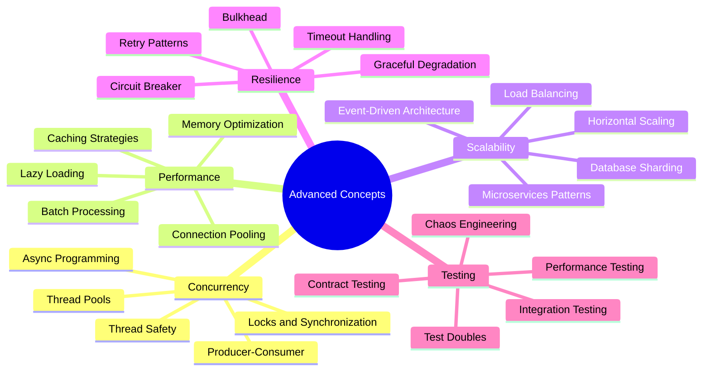

## 📖 Detailed Sections

### 1. [Concurrency Patterns](./01-concurrency-patterns.md)

**Focus**: Thread-safe design and concurrent programming patterns

**Key Topics:**

- Thread safety mechanisms
- Lock-free programming
- Producer-Consumer patterns
- Thread pool management
- Async/await patterns
- Deadlock prevention

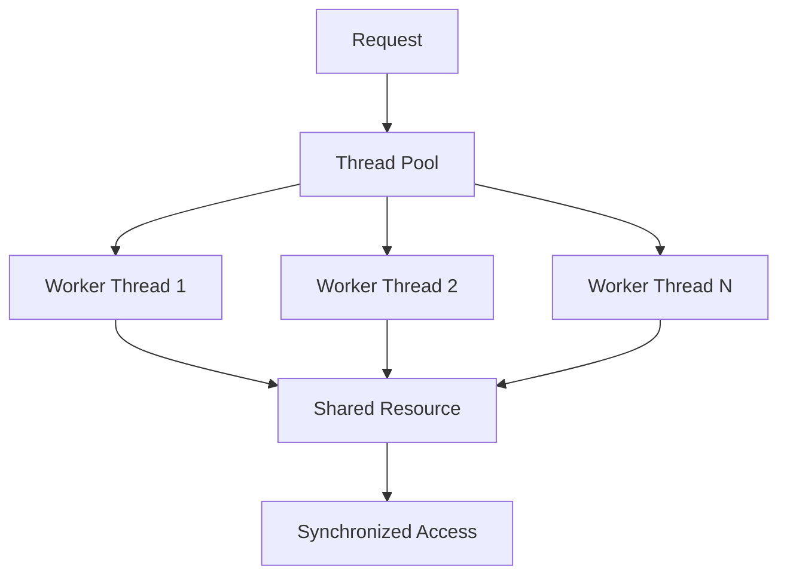

### 2. [Performance Optimization](./02-performance-optimization.md)

**Focus**: Techniques to improve system performance and efficiency

**Key Topics:**

- Caching strategies (In-memory, Distributed, CDN)
- Lazy loading and eager loading
- Connection pooling
- Batch processing
- Memory optimization
- Database optimization

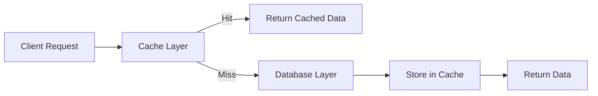

### 3. [Scalability Patterns](./03-scalability-patterns.md)

**Focus**: Designing systems that can handle increased load

**Key Topics:**

- Horizontal vs Vertical scaling
- Load balancing strategies
- Database sharding and partitioning
- Microservices architecture
- Event-driven systems
- CQRS (Command Query Responsibility Segregation)

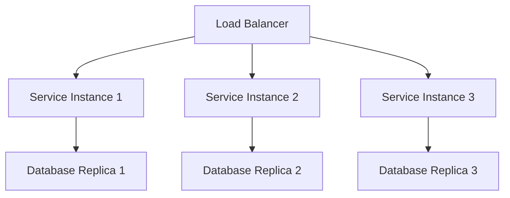

### 4. [Error Handling Patterns](./04-error-handling.md)

**Focus**: Building resilient systems that handle failures gracefully

**Key Topics:**

- Circuit Breaker pattern
- Retry mechanisms with backoff
- Bulkhead pattern
- Timeout handling
- Graceful degradation
- Fail-fast vs Fail-safe

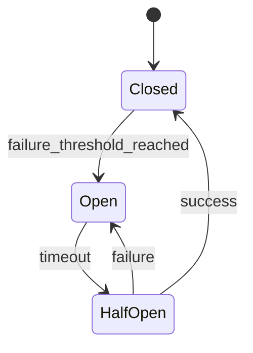

### 5. [Testing Strategies](./05-testing-strategies.md)

**Focus**: Comprehensive testing approaches for complex systems

**Key Topics:**

- Test pyramid and testing levels
- Test doubles (Mocks, Stubs, Fakes)
- Integration testing strategies
- Performance testing
- Contract testing
- Chaos engineering

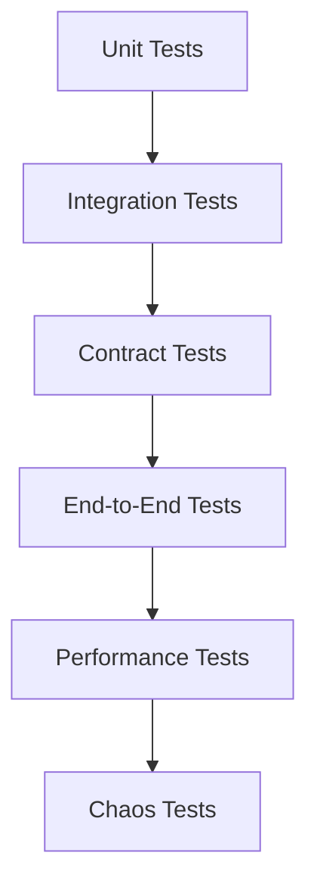

### 6. [Memory Management](./06-memory-management.md)

**Focus**: Efficient memory usage and garbage collection optimization

**Key Topics:**

- Memory leak detection and prevention
- Garbage collection tuning
- Object pooling
- Memory-mapped files
- Off-heap storage
- Memory profiling

## 🏗️ Architectural Patterns

### Event-Driven Architecture

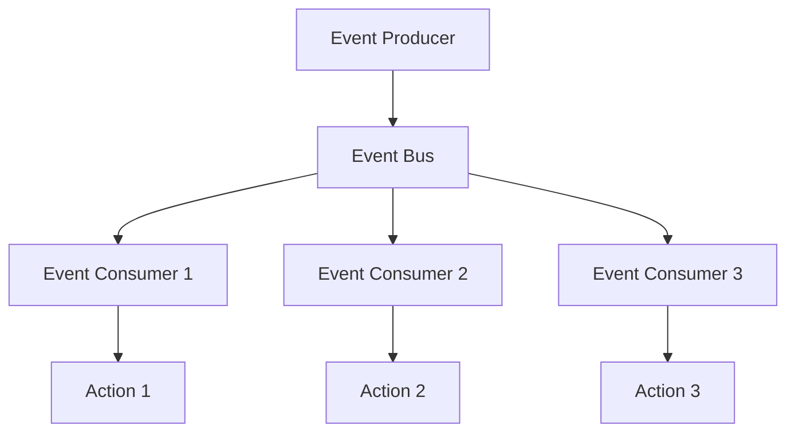

**Benefits:**

- Loose coupling between components
- Asynchronous processing
- Scalability and flexibility
- Event sourcing capabilities

### CQRS (Command Query Responsibility Segregation)

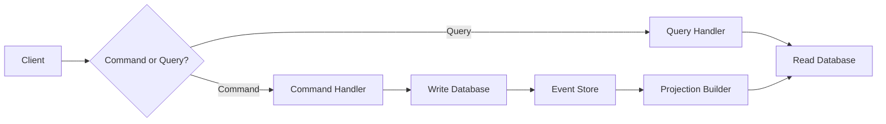

**Use Cases:**

- Complex business logic
- High read/write ratio differences
- Event sourcing requirements
- Independent scaling of read/write operations

### Microservices Patterns

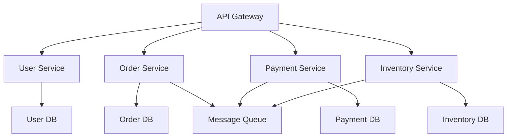

**Key Patterns:**

- Service Discovery
- API Gateway
- Circuit Breaker
- Saga Pattern
- Event Sourcing

## 🎯 Design Principles for Scale

### CAP Theorem

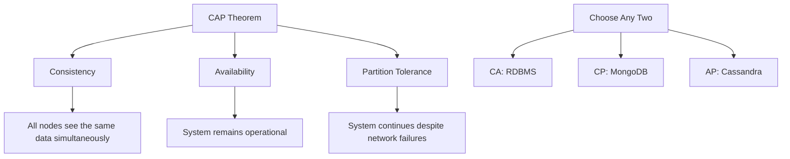

### Eventual Consistency

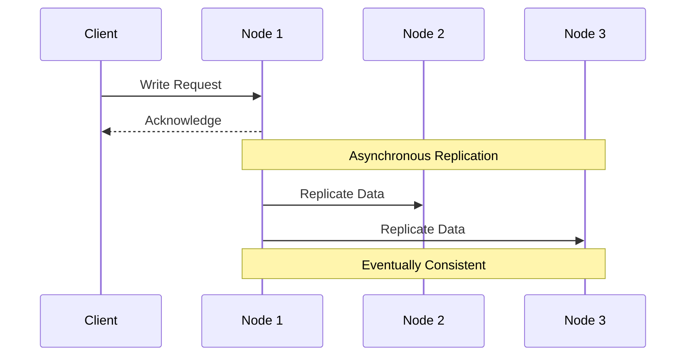

## 🛠️ Performance Optimization Techniques

### Caching Strategies

| Strategy          | Use Case           | Pros               | Cons                   |
| ----------------- | ------------------ | ------------------ | ---------------------- |
| **Cache-Aside**   | General purpose    | Simple, flexible   | Cache misses penalty   |
| **Write-Through** | Strong consistency | Data safety        | Higher latency         |
| **Write-Behind**  | High write load    | Better performance | Data loss risk         |
| **Refresh-Ahead** | Predictable access | Always fresh       | Complex implementation |

### Database Optimization

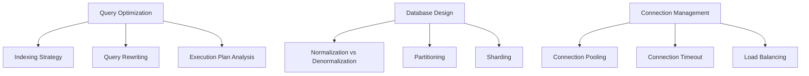

## 🔒 Concurrency Control Mechanisms

### Locking Strategies

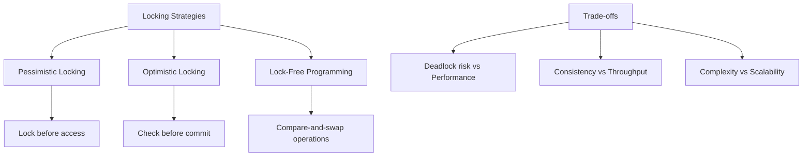

### Thread Safety Patterns

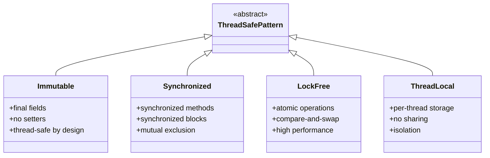

## 📊 Monitoring and Observability

### The Three Pillars

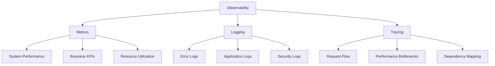

### Monitoring Patterns

1. **Health Checks**: Regular system health verification
2. **Circuit Breaker**: Prevent cascade failures
3. **Bulkhead**: Isolate critical resources
4. **Timeout**: Prevent hanging requests
5. **Rate Limiting**: Control request flow

## 🎯 Best Practices Summary

### Design for Scale

✅ **Stateless Design**: Services should not maintain client state  
✅ **Horizontal Scaling**: Design for adding more instances  
✅ **Loose Coupling**: Minimize dependencies between components  
✅ **Asynchronous Processing**: Use async operations where possible

### Performance Optimization

✅ **Caching Strategy**: Implement appropriate caching at multiple levels  
✅ **Database Optimization**: Proper indexing and query optimization  
✅ **Resource Pooling**: Reuse expensive resources  
✅ **Lazy Loading**: Load resources only when needed

### Resilience and Reliability

✅ **Circuit Breaker**: Prevent cascade failures  
✅ **Retry Logic**: Handle transient failures gracefully  
✅ **Graceful Degradation**: Maintain core functionality during failures  
✅ **Monitoring**: Comprehensive observability and alerting

### Security Considerations

✅ **Input Validation**: Validate all external inputs  
✅ **Authentication**: Secure user identity verification  
✅ **Authorization**: Proper access control  
✅ **Data Encryption**: Encrypt sensitive data

## 🔗 Integration with Design Patterns

### Pattern Combinations for Advanced Systems

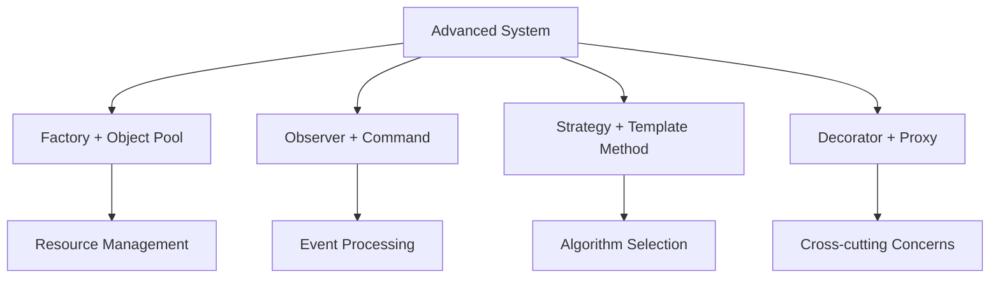

### Real-World Applications

- **E-commerce Platform**: Observer + Command + Strategy + Factory
- **Gaming System**: State + Command + Flyweight + Object Pool
- **Financial System**: Strategy + Decorator + Chain of Responsibility
- **Content Management**: Composite + Visitor + Template Method

## 🎓 Learning Path

### Beginner to Advanced

1. **Start with fundamentals**: SOLID principles and basic patterns
2. **Learn concurrency**: Thread safety and basic parallel programming
3. **Understand caching**: Implement various caching strategies
4. **Study resilience**: Circuit breaker and retry patterns
5. **Practice scalability**: Design systems for growth
6. **Master testing**: Comprehensive testing strategies

### Hands-On Practice

- Implement a scalable web service
- Build a high-performance caching system
- Design a resilient microservices architecture
- Create a real-time event processing system

## 📚 Recommended Resources

### Books

- "Designing Data-Intensive Applications" by Martin Kleppmann
- "Building Microservices" by Sam Newman
- "Release It!" by Michael Nygard
- "Java Concurrency in Practice" by Brian Goetz

### Online Resources

- High Scalability blog
- AWS Architecture Center
- Google Cloud Architecture Framework
- Microsoft Azure Architecture Center

---

## 🚀 Next Steps

Ready to dive into advanced concepts? These topics will take your system design skills to the next level. Start with [Concurrency Patterns](./01-concurrency-patterns.md) to understand thread-safe programming, then progress through each topic based on your interests and project needs.

Remember: Advanced concepts should solve real problems, not add unnecessary complexity!

---

[← Back to Main](../) | [Next: Concurrency Patterns →](./01-concurrency-patterns.md)
