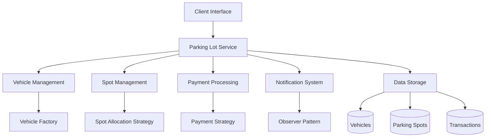
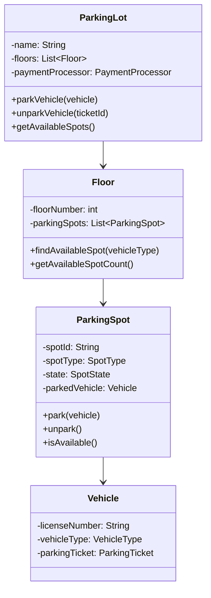
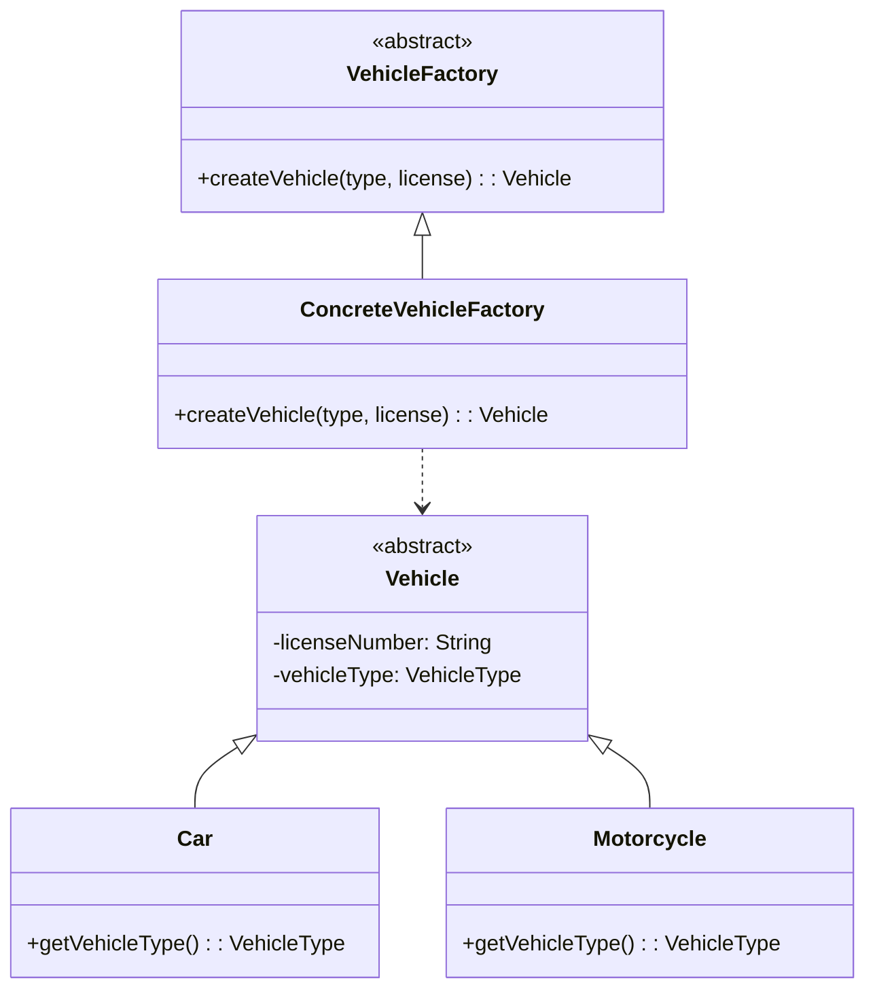
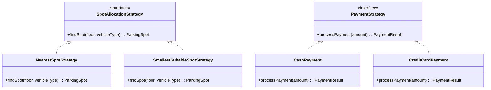
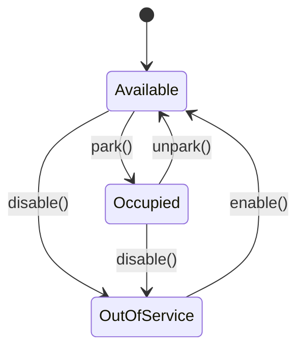
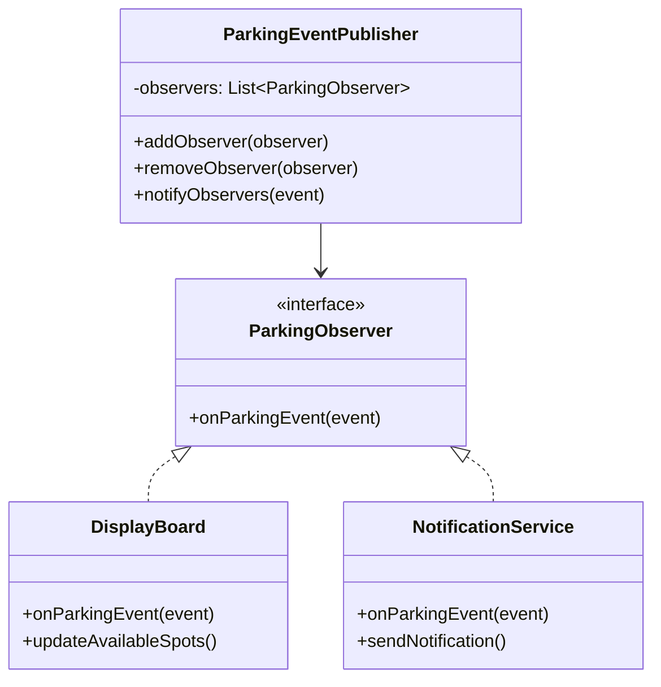
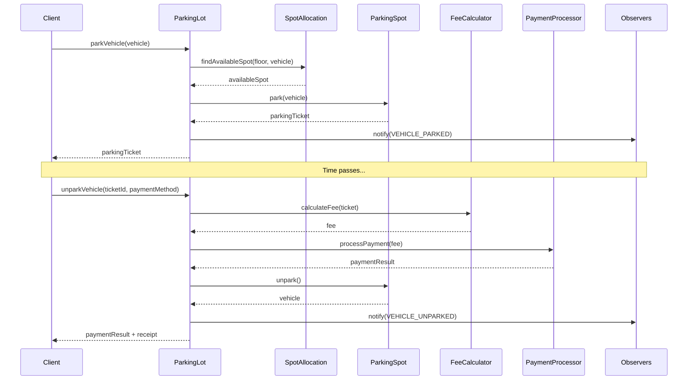
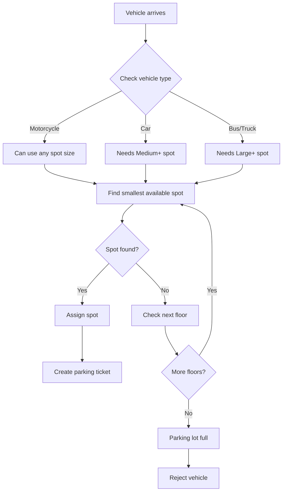
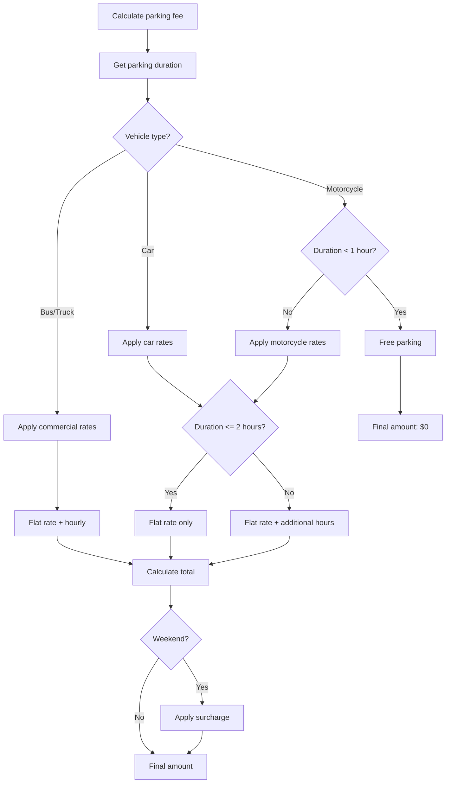

# 🅿️ Parking Lot System - Case Study

## 🎯 Overview

The Parking Lot System is a comprehensive case study that demonstrates fundamental object-oriented design principles, design patterns, and real-world system modeling. This system manages vehicle parking, fee calculation, and provides various administrative features.

**Complexity Level**: Beginner to Intermediate  
**Estimated Time**: 4-6 hours  
**Design Patterns Used**: Factory Method, Strategy, State, Observer, Template Method

## 📋 Requirements

### Functional Requirements

#### Core Features

1. **Vehicle Management**
    - Support different vehicle types (Car, Motorcycle, Bus, Truck)
    - Each vehicle has a license plate, type, and size

2. **Parking Spot Management**
    - Different spot sizes (Small, Medium, Large, Extra Large)
    - Spot availability tracking
    - Automatic spot assignment based on vehicle type

3. **Parking Operations**
    - Park vehicle (assign available spot)
    - Unpark vehicle (free up spot and calculate fee)
    - Real-time availability checking

4. **Payment Processing**
    - Multiple payment methods (Cash, Credit Card, Digital Wallet)
    - Dynamic fee calculation based on time and vehicle type
    - Receipt generation

5. **Administrative Features**
    - View all parked vehicles
    - View available spots
    - Generate revenue reports
    - System statistics

#### Business Rules

- **Spot Assignment Rules**:
    - Motorcycles can park in any spot size
    - Cars can park in Medium, Large, or Extra Large spots
    - Buses and Trucks require Large or Extra Large spots
    - Always assign the smallest suitable spot

- **Pricing Rules**:
    - First hour free for motorcycles
    - Flat rate for first 2 hours, then hourly rate
    - Different rates for different vehicle types
    - Weekend surcharge

### Non-Functional Requirements

- **Performance**: System should handle 1000+ concurrent operations
- **Scalability**: Easily extendable to multiple floors and locations
- **Maintainability**: Clean code with proper separation of concerns
- **Reliability**: Robust error handling and data consistency

## 🏗️ System Architecture

### High-Level Architecture



### Core Components Overview



## 🎨 Design Patterns Implementation

### 1. Factory Method Pattern

**Purpose**: Create different types of vehicles without specifying their exact classes.



### 2. Strategy Pattern

**Purpose**: Implement different spot allocation and payment strategies.



### 3. State Pattern

**Purpose**: Manage different states of parking spots.



### 4. Observer Pattern

**Purpose**: Notify interested parties about parking events.



## 💻 Implementation

### Core Classes

#### 1. Vehicle Hierarchy

```java
// Abstract Vehicle class
public abstract class Vehicle {
    protected String licenseNumber;
    protected VehicleType vehicleType;
    protected ParkingTicket parkingTicket;

    public Vehicle(String licenseNumber) {
        this.licenseNumber = licenseNumber;
        this.vehicleType = getVehicleType();
    }

    public abstract VehicleType getVehicleType();
    public abstract SpotType getRequiredSpotType();

    // Getters and setters
}

// Concrete Vehicle implementations
public class Car extends Vehicle {
    public Car(String licenseNumber) {
        super(licenseNumber);
    }

    @Override
    public VehicleType getVehicleType() {
        return VehicleType.CAR;
    }

    @Override
    public SpotType getRequiredSpotType() {
        return SpotType.MEDIUM;
    }
}

public class Motorcycle extends Vehicle {
    public Motorcycle(String licenseNumber) {
        super(licenseNumber);
    }

    @Override
    public VehicleType getVehicleType() {
        return VehicleType.MOTORCYCLE;
    }

    @Override
    public SpotType getRequiredSpotType() {
        return SpotType.SMALL;
    }
}
```

#### 2. Parking Spot Management

```java
public class ParkingSpot {
    private String spotId;
    private SpotType spotType;
    private SpotState state;
    private Vehicle parkedVehicle;
    private LocalDateTime parkingTime;

    public ParkingSpot(String spotId, SpotType spotType) {
        this.spotId = spotId;
        this.spotType = spotType;
        this.state = SpotState.AVAILABLE;
    }

    public boolean canFitVehicle(Vehicle vehicle) {
        return isAvailable() &&
               spotType.canFit(vehicle.getRequiredSpotType());
    }

    public synchronized boolean park(Vehicle vehicle) {
        if (canFitVehicle(vehicle)) {
            this.parkedVehicle = vehicle;
            this.state = SpotState.OCCUPIED;
            this.parkingTime = LocalDateTime.now();

            // Create parking ticket
            ParkingTicket ticket = new ParkingTicket(
                generateTicketId(),
                vehicle,
                this,
                parkingTime
            );
            vehicle.setParkingTicket(ticket);

            return true;
        }
        return false;
    }

    public synchronized Vehicle unpark() {
        if (state == SpotState.OCCUPIED) {
            Vehicle vehicle = this.parkedVehicle;
            this.parkedVehicle = null;
            this.state = SpotState.AVAILABLE;
            this.parkingTime = null;
            return vehicle;
        }
        return null;
    }

    public boolean isAvailable() {
        return state == SpotState.AVAILABLE;
    }
}
```

#### 3. Strategy Pattern Implementation

```java
public interface SpotAllocationStrategy {
    ParkingSpot findAvailableSpot(Floor floor, Vehicle vehicle);
}

public class SmallestSuitableSpotStrategy implements SpotAllocationStrategy {
    @Override
    public ParkingSpot findAvailableSpot(Floor floor, Vehicle vehicle) {
        List<ParkingSpot> suitableSpots = floor.getParkingSpots()
            .stream()
            .filter(spot -> spot.canFitVehicle(vehicle))
            .sorted(Comparator.comparing(spot -> spot.getSpotType().getSize()))
            .collect(Collectors.toList());

        return suitableSpots.isEmpty() ? null : suitableSpots.get(0);
    }
}

public class NearestSpotStrategy implements SpotAllocationStrategy {
    @Override
    public ParkingSpot findAvailableSpot(Floor floor, Vehicle vehicle) {
        return floor.getParkingSpots()
            .stream()
            .filter(spot -> spot.canFitVehicle(vehicle))
            .findFirst() // Assumes spots are ordered by distance
            .orElse(null);
    }
}
```

#### 4. Payment Processing

```java
public interface PaymentStrategy {
    PaymentResult processPayment(double amount, PaymentDetails details);
}

public class CreditCardPayment implements PaymentStrategy {
    @Override
    public PaymentResult processPayment(double amount, PaymentDetails details) {
        // Simulate credit card processing
        if (validateCreditCard(details.getCardNumber())) {
            return new PaymentResult(true, "Payment successful",
                                   generateTransactionId());
        }
        return new PaymentResult(false, "Invalid credit card", null);
    }

    private boolean validateCreditCard(String cardNumber) {
        // Basic validation logic
        return cardNumber != null && cardNumber.length() == 16;
    }
}

public class CashPayment implements PaymentStrategy {
    @Override
    public PaymentResult processPayment(double amount, PaymentDetails details) {
        // Cash payments are always successful if amount is sufficient
        double providedAmount = details.getAmount();
        if (providedAmount >= amount) {
            double change = providedAmount - amount;
            return new PaymentResult(true, "Payment successful",
                                   generateTransactionId(), change);
        }
        return new PaymentResult(false, "Insufficient cash", null);
    }
}
```

#### 5. Main Parking Lot System

```java
public class ParkingLot {
    private String name;
    private List<Floor> floors;
    private SpotAllocationStrategy allocationStrategy;
    private ParkingFeeCalculator feeCalculator;
    private List<ParkingObserver> observers;

    public ParkingLot(String name) {
        this.name = name;
        this.floors = new ArrayList<>();
        this.allocationStrategy = new SmallestSuitableSpotStrategy();
        this.feeCalculator = new ParkingFeeCalculator();
        this.observers = new ArrayList<>();
    }

    public ParkingTicket parkVehicle(Vehicle vehicle) {
        for (Floor floor : floors) {
            ParkingSpot spot = allocationStrategy.findAvailableSpot(floor, vehicle);
            if (spot != null && spot.park(vehicle)) {
                // Notify observers
                notifyObservers(new ParkingEvent(ParkingEventType.VEHICLE_PARKED,
                                               vehicle, spot));
                return vehicle.getParkingTicket();
            }
        }
        throw new ParkingLotFullException("No available spots for vehicle: " +
                                        vehicle.getLicenseNumber());
    }

    public PaymentResult unparkVehicle(String ticketId, PaymentStrategy paymentStrategy) {
        ParkingTicket ticket = findTicketById(ticketId);
        if (ticket == null) {
            throw new InvalidTicketException("Invalid ticket ID: " + ticketId);
        }

        // Calculate parking fee
        double fee = feeCalculator.calculateFee(ticket);

        // Process payment
        PaymentResult paymentResult = paymentStrategy.processPayment(fee,
                                                                   new PaymentDetails());

        if (paymentResult.isSuccessful()) {
            // Unpark vehicle
            Vehicle vehicle = ticket.getParkingSpot().unpark();

            // Generate receipt
            Receipt receipt = new Receipt(ticket, fee, paymentResult.getTransactionId());

            // Notify observers
            notifyObservers(new ParkingEvent(ParkingEventType.VEHICLE_UNPARKED,
                                           vehicle, ticket.getParkingSpot()));

            paymentResult.setReceipt(receipt);
        }

        return paymentResult;
    }

    public int getAvailableSpotCount(SpotType spotType) {
        return floors.stream()
                    .mapToInt(floor -> floor.getAvailableSpotCount(spotType))
                    .sum();
    }

    // Observer pattern methods
    public void addObserver(ParkingObserver observer) {
        observers.add(observer);
    }

    private void notifyObservers(ParkingEvent event) {
        observers.forEach(observer -> observer.onParkingEvent(event));
    }
}
```

### Usage Example

```java
public class ParkingLotDemo {
    public static void main(String[] args) {
        // Create parking lot
        ParkingLot parkingLot = new ParkingLot("City Center Parking");

        // Add floors and spots
        Floor groundFloor = new Floor(0);
        groundFloor.addParkingSpots(createParkingSpots());
        parkingLot.addFloor(groundFloor);

        // Add observers
        parkingLot.addObserver(new DisplayBoard());
        parkingLot.addObserver(new NotificationService());

        // Create vehicles
        Vehicle car = VehicleFactory.createVehicle(VehicleType.CAR, "ABC123");
        Vehicle motorcycle = VehicleFactory.createVehicle(VehicleType.MOTORCYCLE, "XYZ789");

        try {
            // Park vehicles
            ParkingTicket carTicket = parkingLot.parkVehicle(car);
            System.out.println("Car parked. Ticket ID: " + carTicket.getTicketId());

            ParkingTicket motorTicket = parkingLot.parkVehicle(motorcycle);
            System.out.println("Motorcycle parked. Ticket ID: " + motorTicket.getTicketId());

            // Simulate some time passing
            Thread.sleep(3600000); // 1 hour

            // Unpark vehicles with different payment methods
            PaymentStrategy creditCard = new CreditCardPayment();
            PaymentResult carPayment = parkingLot.unparkVehicle(carTicket.getTicketId(),
                                                               creditCard);

            if (carPayment.isSuccessful()) {
                System.out.println("Car unparked successfully. Fee: $" +
                                 carPayment.getReceipt().getTotalAmount());
            }

            PaymentStrategy cash = new CashPayment();
            PaymentResult motorPayment = parkingLot.unparkVehicle(motorTicket.getTicketId(),
                                                                 cash);

            if (motorPayment.isSuccessful()) {
                System.out.println("Motorcycle unparked successfully. Fee: $" +
                                 motorPayment.getReceipt().getTotalAmount());
            }

        } catch (Exception e) {
            System.err.println("Error: " + e.getMessage());
        }
    }
}
```

## 📊 System Features Demonstration

### Parking Operations Flow



### Spot Allocation Algorithm



### Fee Calculation Logic



## 🎯 Key Design Decisions

### 1. **Vehicle Type Hierarchy**

- **Decision**: Use inheritance for different vehicle types
- **Rationale**: Each vehicle type has different behavior (spot requirements, fees)
- **Alternative**: Could use composition with strategy pattern for behavior

### 2. **Spot Allocation Strategy**

- **Decision**: Strategy pattern for different allocation algorithms
- **Rationale**: Allows runtime switching of allocation strategies
- **Benefit**: Easy to add new strategies (random, priority-based, etc.)

### 3. **Payment Processing**

- **Decision**: Strategy pattern for different payment methods
- **Rationale**: Multiple payment types with different processing logic
- **Extensibility**: Easy to add new payment methods (mobile pay, crypto, etc.)

### 4. **State Management**

- **Decision**: Simple state enum vs full State pattern
- **Rationale**: Parking spot states are simple enough for enum
- **Note**: Could upgrade to State pattern for more complex state transitions

### 5. **Observer Pattern for Notifications**

- **Decision**: Observer pattern for event notifications
- **Rationale**: Multiple components need to react to parking events
- **Benefits**: Loose coupling, easy to add new observers

## 🔧 Extensions and Enhancements

### Possible Extensions

1. **Multi-level Parking**
    - Add basement and upper floor support
    - Elevator simulation for vehicle movement

2. **Reservation System**
    - Advance booking of parking spots
    - Time-based reservations

3. **VIP/Premium Services**
    - Priority parking for premium members
    - Valet parking service

4. **IoT Integration**
    - Sensor-based spot detection
    - Automated entry/exit gates
    - Mobile app integration

5. **Analytics and Reporting**
    - Revenue analytics
    - Peak time analysis
    - Occupancy reports

### Performance Optimizations

1. **Caching**
    - Cache available spot counts
    - Cache frequently accessed data

2. **Database Integration**
    - Persistent storage for tickets and transactions
    - Database indexing for quick lookups

3. **Concurrency Improvements**
    - Better thread safety for high concurrency
    - Lock-free data structures where possible

## 📚 Learning Outcomes

After completing this case study, you should understand:

### Design Principles

- ✅ Single Responsibility Principle (each class has one purpose)
- ✅ Open/Closed Principle (easy to extend without modification)
- ✅ Interface Segregation (focused interfaces)
- ✅ Dependency Inversion (depend on abstractions)

### Design Patterns

- ✅ **Factory Method**: Creating different vehicle types
- ✅ **Strategy**: Different algorithms for spot allocation and payments
- ✅ **Observer**: Event-driven notifications
- ✅ **State**: Managing parking spot states (implicit)
- ✅ **Template Method**: Fee calculation workflow

### System Design Concepts

- ✅ Object modeling and class relationships
- ✅ State management in systems
- ✅ Event-driven architecture
- ✅ Error handling and validation
- ✅ Extensible system design

## 🎓 Practice Exercises

### Exercise 1: Basic Implementation

Implement the core parking lot system with:

- Basic vehicle parking/unparking
- Simple fee calculation
- Console-based interface

### Exercise 2: Add New Vehicle Types

Extend the system to support:

- Electric vehicles (special charging spots)
- Handicapped vehicles (reserved spots)
- Different fee structures for each type

### Exercise 3: Implement Reservation System

Add the ability to:

- Reserve spots in advance
- Handle reservation conflicts
- Different pricing for reserved vs walk-in

### Exercise 4: Add Reporting Features

Implement:

- Daily/monthly revenue reports
- Occupancy statistics
- Peak hour analysis

### Exercise 5: Multi-location Support

Extend to support:

- Multiple parking lot locations
- Cross-location reports
- Different pricing per location

## 🔍 Code Review Checklist

When implementing this system, ensure:

- [ ] All classes follow Single Responsibility Principle
- [ ] Proper use of inheritance vs composition
- [ ] Thread safety for concurrent operations
- [ ] Proper error handling and validation
- [ ] Clean, readable code with good naming
- [ ] Comprehensive unit tests
- [ ] Proper use of design patterns
- [ ] Extensible design for future enhancements

---

## 📝 Summary

The Parking Lot System demonstrates fundamental OOP principles and design patterns in a realistic scenario. It showcases how to:

- Model real-world entities as classes
- Use design patterns to solve common problems
- Create extensible and maintainable systems
- Handle state management and business logic
- Implement event-driven architectures

This case study serves as an excellent foundation for understanding system design and can be extended in numerous ways to explore more advanced concepts.

---

[← Back to Case Studies](../) | [Next: Elevator System →](../02-elevator-system/)
