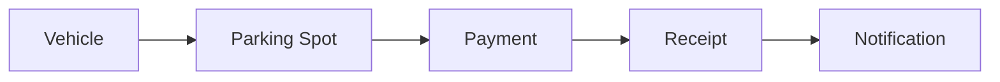
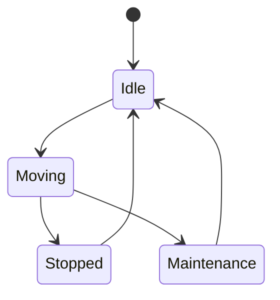
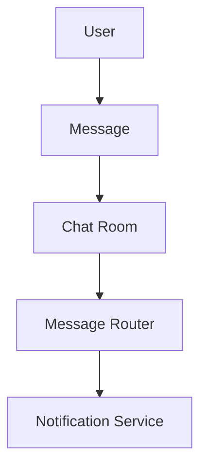
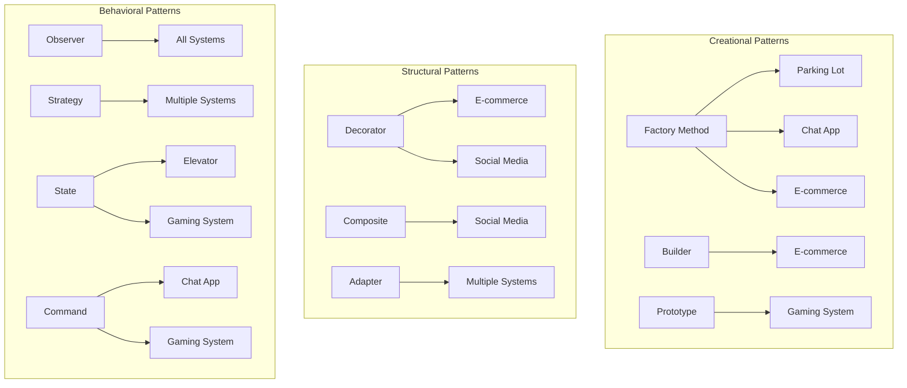

🧑‍💻 **Author:** RK ROY

# 📋 Real-World Case Studies

This section contains comprehensive case studies that demonstrate how to apply Low-Level Design principles and patterns to solve real-world problems. Each case study includes requirements analysis, design decisions, implementation, and explanations of the patterns used.

## 🎯 What You'll Learn

- How to approach system design from requirements to implementation
- When and how to apply design patterns in practice
- How different patterns work together in real systems
- Trade-offs in design decisions
- Best practices for maintainable, scalable code

## 📚 Available Case Studies

### 🅿️ 1. Parking Lot System

**Complexity**: Beginner to Intermediate  
**Patterns Used**: Factory Method, Strategy, State, Observer  
**Concepts**: OOP fundamentals, state management, payment processing

[**View Case Study →**](./01-parking-lot/)

**What you'll learn:**

- Vehicle type hierarchy design
- Parking spot allocation strategies
- Payment processing systems
- State management for parking spots
- Event-driven notifications

### 🏢 2. Elevator System

**Complexity**: Intermediate to Advanced  
**Patterns Used**: State, Command, Observer, Strategy  
**Concepts**: State machines, concurrent processing, scheduling algorithms

[**View Case Study →**](./02-elevator-system/)

**What you'll learn:**

- Complex state machine design
- Command queuing and processing
- Scheduling algorithms (FCFS, SCAN, LOOK)
- Thread-safe operations
- Real-time system considerations

### 💬 3. Chat Application

**Complexity**: Intermediate  
**Patterns Used**: Observer, Command, Mediator, Factory  
**Concepts**: Real-time messaging, user management, message routing

[**View Case Study →**](./03-chat-application/)

**What you'll learn:**

- Message routing and delivery
- User presence management
- Group chat functionality
- Message persistence
- Real-time updates

### 📚 4. Library Management System

**Complexity**: Beginner to Intermediate  
**Patterns Used**: Repository, Factory, Template Method, Strategy  
**Concepts**: CRUD operations, data modeling, business rules

[**View Case Study →**](./04-library-management/)

**What you'll learn:**

- Book and member management
- Borrowing and return workflows
- Fine calculation strategies
- Search and filtering capabilities
- Data persistence patterns

### 🛒 5. E-commerce System

**Complexity**: Advanced  
**Patterns Used**: Strategy, Decorator, Observer, Factory, Command  
**Concepts**: Complex business logic, payment processing, inventory management

[**View Case Study →**](./05-ecommerce-system/)

**What you'll learn:**

- Product catalog management
- Shopping cart functionality
- Multiple payment methods
- Order processing pipeline
- Inventory tracking
- Discount and promotion systems

### 📱 6. Social Media Feed

**Complexity**: Advanced  
**Patterns Used**: Observer, Strategy, Decorator, Composite  
**Concepts**: Feed algorithms, content filtering, user interactions

[**View Case Study →**](./06-social-media-feed/)

**What you'll learn:**

- Feed generation algorithms
- Content filtering and ranking
- User interaction tracking
- Privacy and security considerations
- Performance optimization techniques

### 🎮 7. Online Gaming System

**Complexity**: Expert  
**Patterns Used**: State, Command, Observer, Flyweight, Prototype  
**Concepts**: Real-time systems, performance optimization, scalability

[**View Case Study →**](./07-gaming-system/)

**What you'll learn:**

- Game state management
- Player action processing
- Real-time multiplayer considerations
- Performance optimization
- Scalability patterns

## 🎯 Learning Path Recommendations

### 🔰 For Beginners

Start with these case studies to build foundational understanding:

1. **Library Management System** - Basic CRUD operations and business logic
2. **Parking Lot System** - State management and simple patterns
3. **Chat Application** - Event-driven architecture basics

### 🚀 For Intermediate Developers

Build upon fundamentals with more complex scenarios:

1. **Elevator System** - Complex state machines and concurrency
2. **E-commerce System** - Advanced business logic and multiple patterns
3. **Social Media Feed** - Performance and scalability considerations

### 🏆 For Advanced Practitioners

Tackle the most complex scenarios:

1. **Online Gaming System** - Real-time systems and optimization
2. **E-commerce System** (advanced features) - Distributed systems concepts
3. **Social Media Feed** (scalability focus) - High-performance architectures

## 📊 Case Study Comparison

| Case Study         | Complexity | Patterns Count | Key Learning                                   |
| ------------------ | ---------- | -------------- | ---------------------------------------------- |
| Library Management | ⭐⭐       | 4              | CRUD, Basic Business Logic                     |
| Parking Lot        | ⭐⭐       | 5              | State Management, Payment Processing           |
| Chat Application   | ⭐⭐⭐     | 6              | Real-time Communication, Event Handling        |
| Elevator System    | ⭐⭐⭐⭐   | 7              | Complex State Machines, Concurrency            |
| E-commerce         | ⭐⭐⭐⭐   | 8              | Advanced Business Logic, Multiple Integrations |
| Social Media Feed  | ⭐⭐⭐⭐⭐ | 6              | Performance Optimization, Scalability          |
| Gaming System      | ⭐⭐⭐⭐⭐ | 9              | Real-time Systems, High Performance            |

## 🛠️ How to Use These Case Studies

### 1. **Understand Requirements**

- Read the problem statement carefully
- Identify functional and non-functional requirements
- Note any constraints or assumptions

### 2. **Analyze the Solution**

- Study the class diagrams and relationships
- Understand the design decisions made
- Identify the patterns used and why

### 3. **Examine the Code**

- Look at the implementation details
- Understand how patterns are implemented in code
- Note the trade-offs and alternatives

### 4. **Practice and Extend**

- Implement the solution yourself
- Add new features or modify existing ones
- Try different approaches or patterns

### 5. **Review and Reflect**

- Compare your solution with the provided one
- Identify areas for improvement
- Document lessons learned

## 🎨 Design Patterns Usage Across Case Studies

## 🔗 Cross-Case Study Concepts

### Common Design Elements

1. **User Management**: Present in most systems
2. **State Management**: Critical for dynamic systems
3. **Event Handling**: Essential for responsive systems
4. **Data Persistence**: Required for most applications
5. **Validation and Error Handling**: Universal concerns

### Reusable Components

Many components can be reused across different case studies:

- Authentication and authorization systems
- Notification services
- Payment processing modules
- Logging and monitoring systems
- Configuration management

## 📚 Additional Resources

### Books

- "System Design Interview" by Alex Xu
- "Designing Data-Intensive Applications" by Martin Kleppmann
- "Clean Architecture" by Robert C. Martin

### Online Resources

- High Scalability case studies
- Engineering blogs from major tech companies
- Open source project architectures

## 🎓 Assessment and Practice

### Self-Assessment Questions

For each case study, ask yourself:

1. **Understanding**: Can I explain the system architecture without looking at the solution?
2. **Application**: Can I identify which patterns are used and why?
3. **Extension**: Can I add new features using the same design principles?
4. **Alternatives**: Can I suggest different approaches or improvements?

### Practice Exercises

1. **Modify Existing Systems**: Add new features to the provided case studies
2. **Combine Systems**: Create a system that combines elements from multiple case studies
3. **Scale Up**: Design how you would handle increased load or users
4. **New Case Studies**: Create your own case study for a domain you're familiar with

---

## 🚀 Getting Started

Ready to dive into real-world system design? Start with the [Parking Lot System](./01-parking-lot/) for a gentle introduction, or jump to any case study that interests you most!

Remember: The goal is not just to understand the solution, but to learn the thinking process behind good system design.

**Happy Designing! 🎉**

---

[← Back to Main](../) | [Next: Parking Lot System →](./01-parking-lot/)
