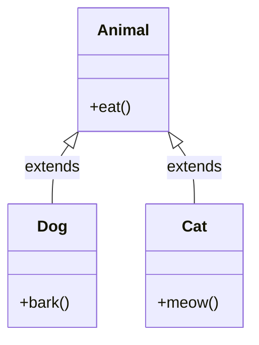
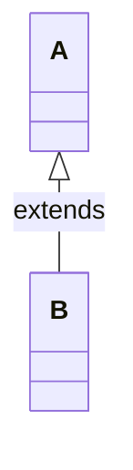
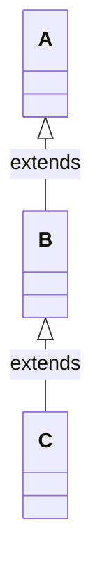
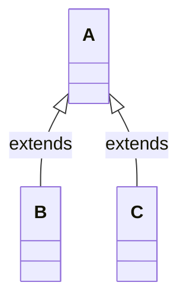
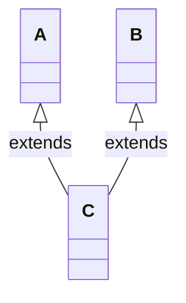
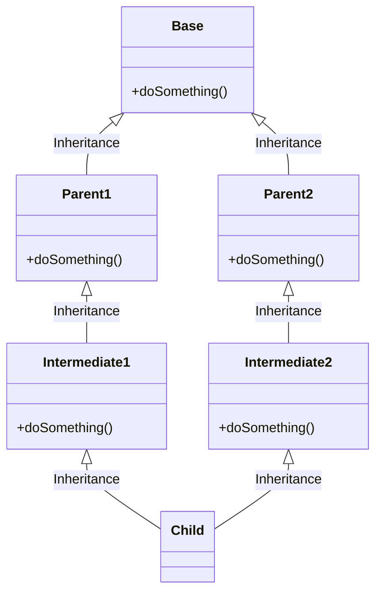
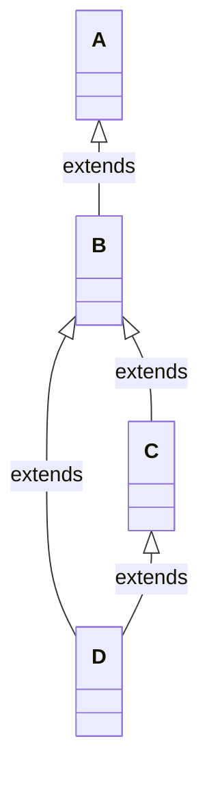
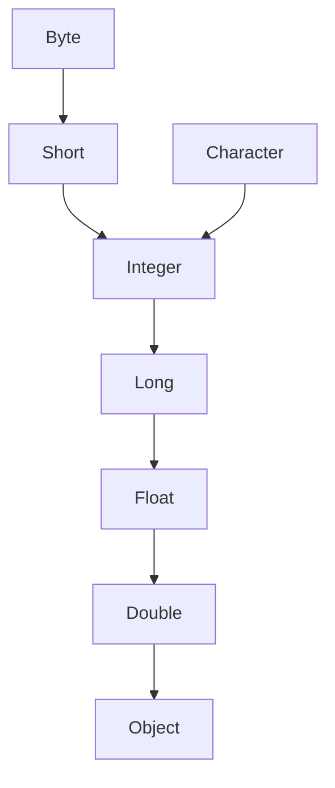
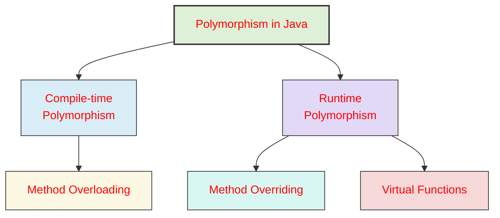
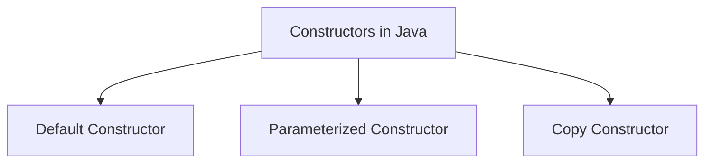

<div align = "center"> 
  <h1 style = "color:orange"> 💻 Object Oriented Programming </h1>
  </div>

- Object-oriented programming is a programming paradigm built on the concept of objects.

> ## Importance:

- An approach to solve problems where all computations are carried out using objects
- Promotes code reuse through inheritance.
- Improves code organization and readability.
- Makes maintenance and scaling easier.
- Encapsulates data, increasing security and reducing complexity.
- Follow **DRY (Don't Repeat Yourself)** Principle.

<div align = "center">
    <h2 style = "color:orange"> Import Statements </h2>
</div>

- Import Statements are used to import classes, packages, and other resources into a program.
  <br>
- An Example of fully qualified name

```java
public class Main {
    public static void main(String[] args) {
        // Fully Qualified Name.
        java.util.ArrayList list = new java.util.ArrayList();
    }
}
```

- To use short name directly, use import statement

```java
import java.util.ArrayList;
public class Main {
    public static void main(String[] args) {
        // Short name.
        ArrayList list = new ArrayList();
    }
}
```

- Types of Import Statements :
    - Explicit Import Statements
        ```java
        //Recommended
        import java.util.ArrayList;
        public class Main {
            publis static void main(String args[]) {
                ArrayList list = new ArrayList();
            }
        }
        ```
    - Implicit Import Statements :
        ```java
        //Not Recommended
        import java.util.*;
        public class Main {
            public static void main(String args[]) {
                ArrayList list = new ArrayList();
            }
        }
        ```
- No need to import the packages that are inside java.lang packages. -> it will automatically get imoprted;

> Example :

```java
//String, Thread, Exception, StringBuffer are some of the classes that are present inside java.lang package.
public class Main {
    public static void main(String args[]) {
        String s = new String("RAJ ROY");
        Thread t= new Thread();
        Exception e = new Exception();
        StringBuffer sb = new StringBuffer("RAJ ROY");
        System.out.println(s);
    }
}
```

> Output :

```text
RAJ ROY
```

- All the classes that are present inside the current working directory will be automatically imported.

- we know we have java.util.regex.Pattern
    - Lets say we want to use the Pattern class then the import statement can be written as#️⃣
        ```java
         import java.util.regex.Pattern; //valid
         import java.util.regex.*; //valid
         import java.util.*; --> //not valid;
        ```

<div align = "center">
    <h2 style = "color:orange"> Package Statements </h2> </div>

- Package :
    - Group of related classes and interfaces.
- Package statement is used to group related classes and interfaces together.
- Package statements must be the first line of code in a java file other than comment lines.
- At most one package statements are allowed in a java file.
- Resolves naming conflicts.

> Example :

```java
package mypackage; // user-defined package
public class Hello {
    public void sayHi() {
        System.out.println("Hello from my package!");
    }
}
```

<div align = "center">
     <h2 style = "color:orange"> Class and Object </h2>
</div>

- Class → A blueprint or template that defines the properties (fields/variables) and behaviors (methods) of objects.
- Object → A real instance of a class that actually uses the defined properties and behaviors.
- Example :

```java
class Car { // class
    private String color;
    private int speed;
    public Car(String color, int speed) {
        this.color = color;
        this.speed = speed;
    }
    public void run() {
        System.out.println("Car is running");
    }
}

public class Main {
    public static void main(String[] args) {
        Car myCar = new Car("Red", 100); //object of class Car
        myCar.run();
    }
}
```

- In the above example, Car is a class and myCar is an object of the Car class.
- The run() method is a behavior of the Car class and color & speed are the properties of the Car class.

<div align = "center"> 
    <h2 style = "color:orange">  Access Modifiers </h2>
</div>

- In Java, access modifiers are essential tools that define how the members of a class, like variables, methods, and even the class itself, can be accessed from other parts of our program.

> Class Level Modifiers (Top level classes)

- public : accessible from anywhere.
- default(if nothing specified) : accessible from the same package.
- abstract : prohibits instantiation.
- final :
    - prohibits child class creation.
    - Final access modifier is a modifier applicable to classes, methods, and variables. If we declare a parent class method as final then **we can’t override that method in the child class** because its implementation is final and **if a class is declared as final we can’t extend the functionality of that class** i.e we can’t create a child class for that class i.e inheritance is not possible for final classes.
    - **Every method present inside the final class is always final by default** but every variable present inside the final class need not be final.

> Class Level Modifiers (Nested classes)

- Top level class modifiers + private + protected + static;

> static :

- The static keyword in Java is mainly used for memory management, allowing variables and methods to belong to the **class itself rather than individual instances.**
- The static keyword belongs to the class rather than an instance of the class.
- The static keyword is used for a constant variable or a method that is the same for every instance of a class.
- We do not need to create objects of the class to use static methods.
- We can call static members using the class name directly.
- Static members belong to the class, not to any specified object.
- Static members can not access non-static members.
- Static methods **cannot be overridden** in subclasses because they belong to the class, not to an object.

> This example demonstrates that a static method can be called without creating an instance of the class.

```java
/* Java program to demonstrate that a static member */
/*  can be accessed before instantiating a class */
class Roy {
    // static method
    static void m1() {
        System.out.println("from m1");
    }
    public static void main(String[] args) {
          /* calling m1 without creating */
          /* any object of class Test */
           m1();
    }
}
```

> static block :

- If you need to do the computation in order to initialize your static variables, you can declare a static block that gets executed exactly once, when the class is first loaded.

> This example demonstrates the use of a static block to initialize static variables before the main method is executed.

```java
/* Java program to demonstrate use of static blocks */
class Roy {
    // static variable
    static int a = 10;
    static int b;

    // static block
    static {
        System.out.println("Static block initialized.");
        b = a * 4;
    }
    public static void main(String[] args) {
       System.out.println("from main");
       System.out.println("Value of a : "+a);
       System.out.println("Value of b : "+b);
    }
}
```

> static variables :

- When a variable is declared as static, then a single copy of the variable is created and shared among all objects at the class level. Static variables are, essentially, global variables. All instances of the class share the same static variable.
- Importance :
    - We can create static variables at the class level only.
    - static block and static variables are executed in the order they are present in a program.

> This example demonstrates that static variables are initialized by calling static methods before the static block is executed.

```java
/* Java program to demonstrate execution */
/* of static blocks and variables */
class Roy {
    // static variable
    static int a = m1();

    // static block
    static {
        System.out.println("Inside static block");
    }

    // static method
    static int m1() {
        System.out.println("from m1");
        return 20;
    }

    // static method(main !!)
    public static void main(String[] args) {
       System.out.println("Value of a : "+a);
       System.out.println("from main");
    }
}
```

> static methods :

- When a method is declared with the static keyword, it is known as the static method. The most common example of a static method is the main() method. As discussed above, Any static member can be accessed before any objects of its class are created, and without reference to any object. Methods declared as static have several restrictions:
- They can only directly call other static methods.
- They can only directly access static data.
- They cannot refer to this or super in any way.

> This example demonstrates the restriction that static methods cannot access instance variables, instance methods, or use super in a static context.

```java
/* Java program to demonstrate restriction on static methods */
class Roy {
    // static variable
    static int a = 10;
    // instance variable
    int b = 20;
    // static method
    static void m1() {
        a = 20;
        System.out.println("from m1");
         // Cannot make a static reference to the non-static field b
         b = 10; // compilation error
         // Cannot make a static reference to the
                 // non-static method m2() from the type Test
         m2();  // compilation error

         //  Cannot use super in a static context
         System.out.println(super.a); // compiler error
    }

    // instance method
    void m2() {
        System.out.println("from m2");
    }

    public static void main(String[] args) {
        // main method
    }
}
```

> Output :

```text
prog.java:18: error: non-static variable b cannot be referenced from a static context
         b = 10; // compilation error
         ^
prog.java:22: error: non-static method m2() cannot be referenced from a static context
         m2();  // compilation error
         ^
prog.java:25: error: non-static variable super cannot be referenced from a static context
         System.out.println(super.a); // compiler error
                            ^
prog.java:25: error: cannot find symbol
         System.out.println(super.a); // compiler error
                                 ^
  symbol: variable a
4 errors
```

> 🧠 **when to use static variables and methods ?**

- Use the static variable for the property that is common to all objects. For example, in class Student, all students share the same college name. Use static methods for changing static variables.

> This example demonstrates the use of static variables and methods to share data (like cllgName and counter) across all instances of a class.

```java
/* A java program to demonstrate use of static keyword with methods and variables */
class Student {
    String name;
    int rollNo;
    // static variable
    static String cllgName;
    // static counter to set unique roll no
    static int counter = 0;
    public Student(String name) {
        this.name = name;
        this.rollNo = setRollNo();
    }
    // getting unique rollNo
    // through static variable(counter)
    static int setRollNo() {
        counter++;
        return counter;
    }
    // static method
    static void setCllg(String name) { cllgName = name; }
    // instance method
    void getStudentInfo() {
        System.out.println("name : " + this.name);
        System.out.println("rollNo : " + this.rollNo);
        // accessing static variable
        System.out.println("cllgName : " + cllgName);
    }
}
// Driver class
public class StaticDemo {
    public static void main(String[] args) {
        // calling static method
        // without instantiating Student class
        Student.setCllg("XYZ");

        Student s1 = new Student("Geek1");
        Student s2 = new Student("Geek2");

        s1.getStudentInfo();
        s2.getStudentInfo();
    }
}
```

> Output :

```text
name : Geek1
rollNo : 1
cllgName : XYZ
name : Geek2
rollNo : 2
cllgName : XYZ
```

> ### Table for visibility of access modifiers

| visibility                                | public | protected | default | private |
| ----------------------------------------- | ------ | --------- | ------- | ------- |
| within the same class                     | ✅     | ✅        | ✅      | ✅      |
| from child class of same package          | ✅     | ✅        | ✅      | ❎      |
| from non child class of same package      | ✅     | ✅        | ✅      | ❎      |
| from child class of different package     | ✅     | ✅        | ❎      | ❎      |
| from non child class of different package | ✅     | ❎        | ❎      | ❎      |

<div align = "center">
    <h2 style = "color:orange">  static classes </h2>
</div>

- A class can be made static only if it is a nested class. We cannot declare a top-level class with a static modifier but can declare nested classes as static. Such types of classes are called Nested static classes.
- Nested static class doesn’t need a reference of Outer class. In this case, a static class cannot access non-static members of the Outer class.

> Example :

```java
/* A java program to demonstrate use of static keyword with Classes */
import java.io.*;
public class Roy {
    private static String str = "GeeksforGeeks";
    // Static class
    static class MyNestedClass {
        // non-static method
        public void disp(){
          System.out.println(str);
        }
    }
    public static void main(String args[]) {
        Geeks.MyNestedClass obj
            = new Geeks.MyNestedClass();
        obj.disp();
    }
}
```

> The table below demonstrates the difference between Static and Non-Static

| Static                                                          | Non-Static                                                              |
| --------------------------------------------------------------- | ----------------------------------------------------------------------- |
| Static members have one copy shared across the class.           | Non-static members have a separate copy for each instance of the class. |
| Static members are accessed via the class name.                 | Non-static members are accessed via an object reference.                |
| Static members cannot be overridden.                            | Non-static members can be overridden in subclasses.                     |
| Static members cannot use `this` or `super` keyword.            | Non-static members can use `this` and `super` keyword.                  |
| Static members exist for the duration of the class's lifecycle. | Non-static members exist as long as the object they belong to is alive. |

> Advantages of static keyword

- Static members use the memory only once and this helps save memory when we have to deal with big programs.
- Static members provide fast access because static members belong to the class not to an object and that's why they can be access faster than regular member.
- We can access static members from anywhere, whether an object of the class has been created or not.
- We can use static final variables to create constant that stays the same throughout the program.

> Disadvantages of static keyword

- Static members can't be overridden or dynamically bound like instance members.
- Static methods and variables make unit testing difficult due to tight coupling.
- Static variables create a global state, which can lead to unwanted side effects across different parts of the program.
- Static variables stay in memory as long as the program runs, which might cause memory to be used longer than needed.
- Using too many static members can reduce the benefits of object-oriented programming, like hiding data and using inheritance.

<div align = "center"> <h2 style = "color:orange"> Abstract (Partial or Incomplete) </h2> </div>

- An abstract is a **Java modifier** applicable for classes and methods in Java but not for Variables

> ### Abstract Method

- Abstract method is a method that is declared in an abstract class but does not have an **implementation.**
- The abstract Method is used for creating blueprints for classes or interfaces.
- Here methods are defined but these methods don't provide the implementation.
- Abstract Methods can only be implemented using subclasses or classes that implement the interfaces.
- A subclass must override them to provide a method definition.

> ##### Rules :

- Any class that contains one or more abstract methods must also be declared abstract.
- If a class contains an abstract method it needs to be abstract and vice versa is not true.
- An abstract class may or may not contain abstract methods(java).
- If a non-abstract class extends an abstract class, then the class must implement all the abstract methods of the abstract class else the concrete class has to be declared as abstract as well.
- The following are various illegal combinations of other modifiers for methods with respect to abstract modifiers:
    - final
    - abstract native
    - abstract synchronized
    - abstract static
    - abstract private
    - abstract strictfp

> ##### Example :

```java
//Example 1
abstract class Shape {
    abstract double area(); // abstract method
    abstract double perimeter(); // abstract method
}
```

> ##### Example :

```java
//Example 2;
// Abstract class
abstract class Vehicle {
    // Abstract method (no body)
    abstract void start();
    // Normal method
    void fuel() {
        System.out.println("This vehicle needs fuel to run.");
    }
}
// Subclass 1
class Car extends Vehicle {
    @Override
    void start() {
        System.out.println("Car starts with a key.");
    }
}
// Subclass 2
class Bike extends Vehicle {
    @Override
    void start() {
        System.out.println("Bike starts with a kick or button.");
    }
}

// Main class
public class Main {
    public static void main(String[] args) {
        Vehicle v1 = new Car();   // Polymorphism
        v1.start();               // Car's implementation
        v1.fuel();

        Vehicle v2 = new Bike();  // Polymorphism
        v2.start();               // Bike's implementation
        v2.fuel();
    }
}
```

> ##### Output :

```text
Car starts with a key.
This vehicle needs fuel to run.
Bike starts with a kick or button.
This vehicle needs fuel to run.
```

> NOTE :

- Although abstract classes cannot be used to instantiate objects, they can be used to **create object references**, because Java’s approach to run-time polymorphism is implemented through the use of super-class references. Thus, it must be **possible to create a reference to an abstract class** so that it can be used to point to a subclass object.

> ### Abstract Class

- Abstract class is declared with the abstract keyword.
- Abstract class is a class that cannot be instantiated.
- Abstract class can have abstract methods as well as concrete methods.
- Child class is responsible for implementing the all abstract methods.(compulsory to implement all the abstract methods);

> ##### Example :

```java
import java.util.*; //Not recommended.
// Abstract class
abstract class Shape {
    String name;
    Shape(String name) {
        this.name = name;
    }
    // Abstract methods (must be implemented by subclasses)
    abstract double area();
    abstract double perimeter();
    // Concrete method (common to all shapes)
    void display() {
        System.out.println("Shape: " + name);
        System.out.println("Area: " + area());
        System.out.println("Perimeter: " + perimeter());
        System.out.println("----------------------");
    }
}
// Subclass 1: Circle
class Circle extends Shape {
    double radius;
    Circle(double radius) {
        super("Circle");
        this.radius = radius;
    }
    @Override
    double area() {
        return Math.PI * radius * radius;
    }
    @Override
    double perimeter() {
        return 2 * Math.PI * radius;
    }
}
// Subclass 2: Rectangle
class Rectangle extends Shape {
    double length, width;
    Rectangle(double length, double width) {
        super("Rectangle");
        this.length = length;
        this.width = width;
    }
    @Override
    double area() {
        return length * width;
    }
    @Override
    double perimeter() {
        return 2 * (length + width);
    }
}
// Subclass 3: Triangle
class Triangle extends Shape {
    double a, b, c;
    Triangle(double a, double b, double c) {
        super("Triangle");
        this.a = a;
        this.b = b;
        this.c = c;
    }
    @Override
    double area() {
        double s = (a + b + c) / 2;
        return Math.sqrt(s * (s - a) * (s - b) * (s - c));
    }
    @Override
    double perimeter() {
        return a + b + c;
    }
}
// Main class
public class Main {
    public static void main(String[] args) {
        Shape s1 = new Circle(5);
        Shape s2 = new Rectangle(4, 6);
        Shape s3 = new Triangle(3, 4, 5);
        // Polymorphism: common interface, different implementations
        s1.display();
        s2.display();
        s3.display();
    }
}
```

> Output :

```text
Shape: Circle
Area: 78.53981633974483
Perimeter: 31.41592653589793
----------------------
Shape: Rectangle
Area: 24.0
Perimeter: 20.0
----------------------
Shape: Triangle
Area: 6.0
Perimeter: 12.0
----------------------
```

> ##### important observations about abstract classes

- An instance of an abstract class cannot be created.
- Constructors are allowed.
- We can have an abstract class without any abstract method.
- There can be a **final method** in abstract class **but any abstract method in class(abstract class) can not be declared as final.**
- We can define **static methods** in an abstract class.
- We can use the abstract keyword for declaring top-level classes (Outer class) as well as inner classes as abstract.
- If a class contains at least one abstract method then compulsory should declare a class as abstract
- If the Child class is unable to provide implementation to all abstract methods of the Parent class then we should declare that Child class as abstract so that the next level Child class should provide implementation to the remaining abstract method

<div align = "center"> <h2 style = "color:orange"> Interfaces </h2> </div>

- Any contract between client and service provider.
- An **interface** is a contract that defines a set of method signatures (and sometimes properties) that a class must implement, but does not provide any implementation itself.
- Interfaces allow different classes to guarantee they provide certain behaviors, enabling polymorphism and decoupling code from specific implementations.

> #### Key Properties of Interfaces :

- The interface in Java is a mechanism to achieve **abstraction and multiple inheritance**.
- By default, variables in an interface are public, static and final.
- In other words, interfaces primarily define methods that other classes must implement.

> ##### Example :

```java
// Payment interface (contract)
interface Payment {
    void pay(double amount);   // abstract method
}
// Implementation 1: Credit Card Payment
class CreditCardPayment implements Payment {
    private String cardNumber;
    CreditCardPayment(String cardNumber) {
        this.cardNumber = cardNumber;
    }
    @Override
    public void pay(double amount) {
        System.out.println("Paid ₹" + amount + " using Credit Card: " + cardNumber);
    }
}
// Implementation 2: PayPal Payment
class PayPalPayment implements Payment {
    private String email;
    PayPalPayment(String email) {
        this.email = email;
    }
    @Override
    public void pay(double amount) {
        System.out.println("Paid ₹" + amount + " using PayPal account: " + email);
    }
}
// Implementation 3: UPI Payment
class UPIPayment implements Payment {
    private String upiId;
    UPIPayment(String upiId) {
        this.upiId = upiId;
    }
    @Override
    public void pay(double amount) {
        System.out.println("Paid ₹" + amount + " using UPI ID: " + upiId);
    }
}
public class Main {
    public static void main(String[] args) {
        Payment p1 = new CreditCardPayment("1234-5678-9876-5432");
        Payment p2 = new PayPalPayment("user@example.com");
        Payment p3 = new UPIPayment("raj@upi");

        p1.pay(1500.00);
        p2.pay(299.99);
        p3.pay(500.00);
    }
}
```

> Output :

```text
Paid ₹1500.0 using Credit Card: 1234-5678-9876-5432
Paid ₹299.99 using PayPal account: user@example.com
Paid ₹500.0 using UPI ID: raj@upi
```

> Relationship between Interfaces and Classes :

- A class can extend another class and similarly, an interface can extend another interface. However, only a class can implement an interface and the reverse (an interface implementing a class) is not allowed.

<div align = "center">
    
```mermaid
flowchart LR
    %% First: class extends class
    A2[class] -->|extends| A1[class]

    %% Second: class implements interface
    B2[class] -.->|implements| B1[interface]

    %% Third: interface extends interface
    C2[interface] -->|extends| C1[interface]

````

</div>


> 🧠 **What is the difference between and interface and abstract class ?**

- An interface defines a contract: it specifies method signatures (and sometimes properties) that implementing classes must provide, but contains no implementation (except default methods in some languages like Java).

- An abstract class can provide both method signatures (abstract methods) and concrete method implementations. It can also have fields and constructors.

> Key differences:

- A class can implement multiple interfaces, but can inherit from only one abstract class (in most languages).
- Interfaces cannot have state (fields), while abstract classes can.
- Abstract classes are used for sharing code among related classes; interfaces are for defining capabilities.
- Example

> 🧠 **When to Use Class and Interface ?**


> ##### Use Class when:

- Use a class when you need to represent a real-world entity with attributes (fields) and behaviors (methods).
- Use a class when you need to create objects that hold state and perform actions
- Classes are used for defining templates for objects with specific functionality and properties.

> ##### Use  Interface when:
- Use an interface when you need to define a contract for behavior that multiple classes can implement.
- Interface is ideal for achieving abstraction and multiple inheritance.

<div align = "center">
    <h2 style = "color:orange"> Pillars of OOPS </h2>
</div>

- They are the **fundamental building blocks or core principles** that support the whole idea of Object-Oriented Programming

> ## Inheritance

- It is the mechanism in Java by which one class is allowed to inherit the features(fields and methods) of another class.
- Inheritance means creating new classes based on existing ones.
- A class that inherits from another class can reuse the methods and fields of that class.
> Example :

```java
// Parent class
class Animal {
    void eat() {
        System.out.println("This animal eats food.");
    }
}
// Child class 1
class Dog extends Animal {
    void bark() {
        System.out.println("Dog barks.");
    }
}
// Child class 2
class Cat extends Animal {
    void meow() {
        System.out.println("Cat meows.");
    }
}
// Main class
public class Main {
    public static void main(String[] args) {
        Dog d = new Dog();
        d.eat();   // Inherited from Animal
        d.bark();  // Dog-specific method

        Cat c = new Cat();
        c.eat();   // Inherited from Animal
        c.meow();  // Cat-specific method
    }
}
```

<div align = "center">


</div>

- `Animal` is the parent class(base class).
- `Dog` and `Cat` inherit from `Animal`(child class).

> Note :

- In Java, inheritance is implemented using the extends keyword. The class that inherits is called the subclass (child class) and the class being inherited from is called the superclass (parent class).


> 🧠 **why use inheritance ?**

- Code Reusability :
    -  The code written in the Superclass is common to all subclasses. Child classes can directly use the parent class code.
- Method Overriding :
    -  Method Overriding is achievable only through Inheritance. It is one of the ways by which Java achieves Run Time Polymorphism.
- Abstraction :
    -  The concept of abstraction where we do not have to provide all details, is achieved through inheritance. Abstraction only shows the functionality to the user.


> #### Types of Inheritance
- Single Inheritance
- Multiple Inheritance
- Multilevel Inheritance
- Hierarchical Inheritance
- Hybrid Interitance (Combination of two or more type of inheritance, not allowed in java)
- Multiple Inhertiance can be achieved in java by using concept of interface.

> Single Inheritance

- In single inheritance, a sub-class is derived from only one super class. It inherits the properties and behavior of a single-parent class. Sometimes, it is also known as simple inheritance.

<div align = "center">



</div>


> Example :
```java
class A {}
class B extends A {}
```


> Example :

```java
//Super class
class Vehicle {
    Vehicle() {
        System.out.println("This is a Vehicle");
    }
}
// Subclass
class Car extends Vehicle {
    Car() {
        super(); // always is there by default;
        System.out.println("This Vehicle is Car");
    }
}
public class Test {
    public static void main(String[] args) {
        // Creating object of subclass invokes base class constructor
        Car obj = new Car();
    }
}
```
> Output :

```text
This is a Vehicle
This Vehicle is Car
```


> Multilevel Inheritance

- In Multilevel Inheritance, a derived class will be inheriting a base class and as well as the derived class also acts as the base class for other classes.

<div align = "center">


</div>


> Example :

```java
class A {}
class B extends A {}
class C extends B {}
```

> Example :

```java
class Vehicle {
    Vehicle() {
        System.out.println("This is a Vehicle");
    }
}
class FourWheeler extends Vehicle {
    FourWheeler() {
        System.out.println("4 Wheeler Vehicles");
    }
}
class Car extends FourWheeler {
    Car() {
        System.out.println("This 4 Wheeler Vehicle is a Car");
    }
}
public class Roy {
    public static void main(String[] args) {
        Car obj = new Car(); // Triggers all constructors in order
    }
}
```

> Output :

```text
This is a Vehicle
4 Wheeler Vehicles
This 4 Wheeler Vehicle is a Car
```

> Hierarchical Inheritance

- In hierarchical inheritance, more than one subclass is inherited from a single base class. i.e. more than one derived class is created from a single base class. For example, cars and buses both are vehicle

<div align = "center">



</div>

> Example :

```java
class A {}
class B extends A {}
class C extends A {}
```

> Example :

```java
class Vehicle {
    Vehicle() {
        System.out.println("This is a Vehicle");
    }
}
class Car extends Vehicle {
    Car() {
        System.out.println("This Vehicle is Car");
    }
}
class Bus extends Vehicle {
    Bus() {
        System.out.println("This Vehicle is Bus");
    }
}
public class Test {
    public static void main(String[] args) {
        Car obj1 = new Car();
        Bus obj2 = new Bus();
    }
}
```

> Output :

```text
This is a Vehicle
This Vehicle is Car
This is a Vehicle
This Vehicle is Bus
```


> Multiple Inheritance (Can be achieved through interfaces)

- In Multiple inheritances, one class can have more than one superclass and inherit features from all parent classes.

<div align = "center">



</div>

- Example 📳

```java
class A {}
class B {}
class C extends A, B {} // Not allowed in Java.
```

> Example :

```java
interface LandVehicle {
    default void landInfo() {
        System.out.println("This is a LandVehicle");
    }
}
interface WaterVehicle {
    default void waterInfo() {
        System.out.println("This is a WaterVehicle");
    }
}
// Subclass implementing both interfaces
class AmphibiousVehicle implements LandVehicle, WaterVehicle {
    AmphibiousVehicle() {
        System.out.println("This is an AmphibiousVehicle");
    }
}
public class Test {
    public static void main(String[] args) {
        AmphibiousVehicle obj = new AmphibiousVehicle();
        obj.waterInfo();
        obj.landInfo();
    }
}
```

> Output :

```text
This is an AmphibiousVehicle
This is a WaterVehicle
This is a LandVehicle
```

> Example :

```java
interface A {
    void show();
}
interface B {
    void show();
}
class MyClass implements A, B {
    // Only one implementation needed
    public void show() {
        System.out.println("Implemented once, works for both A and B");
    }
}
public class Main {
    public static void main(String[] args) {
        MyClass obj = new MyClass();
        obj.show();  // Output: Implemented once, works for both A and B
    }
}
```

> Example :
```java
// First interface
interface Animal {
    void eat();
}
// Second interface
interface Pet {
    void play();
}
// A class can implement multiple interfaces
class Dog implements Animal, Pet {
    @Override
    public void eat() {
        System.out.println("Dog is eating.");
    }
    @Override
    public void play() {
        System.out.println("Dog is playing.");
    }
}
// Main class to run the program
public class MultipleInheritanceDemo {
    public static void main(String[] args) {
        Dog dog = new Dog();
        dog.eat();   // From Animal interface
        dog.play();  // From Pet interface
    }
}
```

> Output :
```text
Dog is eating.
Dog is playing.
```

> 🧠 **Reason why multiple inheritance is not allowed in Java :**

- Ambiguity & Complexity
    - If a class were allowed to inherit from multiple classes that define the same method, the Java compiler would not know which version of the method to use. This leads to ambiguity and can complicate debugging and maintenance of code.
- The Diamond Problem :
    - The diamond problem is illustrated in this diagram with a more complex hierarchy. Here, Child inherits from two intermediate classes (Intermediate1 and Intermediate2), which both inherit from Parent1 and Parent2 respectively. Both Parent1 and Parent2 classes again inherit from the same Base class. This creates a "diamond-shaped" inheritance structure, where the Base class is at the top, Parent1 and Parent2 form the middle, and Child is at the bottom.
    - The problem arises because there are two paths from the Child class to the Base class, through Intermediate1 and Intermediate2. If Base class's +doSomething() method is overridden in both Parent1 and Parent2, and Intermediate1 and Intermediate2 do not override it, the Child class faces ambiguity in deciding which version of the method to inherit. This situation complicates method resolution and can lead to unexpected behaviour.

    - `Base` → root class.
    - `Parent1` and `Parent2` inherit from `Base`.
    - `Intermediate1` inherits from `Parent1`, `Intermediate2` inherits from `Parent2`.
    - `Child` inherits from `Intermediate1` and `Intermediate2`.


<div align = "center">



</div>

> Hybrid Interitance (Combination of two or more type of inheritance, not allowed in java)

- It is a mix of two or more of the above types of inheritance. In Java, we can achieve hybrid inheritance only through Interfaces if we want to involve multiple inheritance to implement Hybrid inheritance.
- In Java, hybrid inheritance (a combination of multiple and multilevel inheritance) is not directly supported with classes because of the diamond problem. But we can achieve it using a mix of classes and interfaces.

<div align = "center">



</div>

> Example :

```java
class A {}
class B extends A {}
class C extends B {}
class D extends B, C {}
```

> Example :

```java
// Parent class
class A {
    void displayA() {
        System.out.println("Class A method");
    }
}
// Interface 1
interface B {
    void displayB();
}
// Interface 2
interface C {
    void displayC();
}
// Class D extends class A and implements interfaces B and C
class D extends A implements B, C {
    @Override
    public void displayB() {
        System.out.println("Interface B method implemented in Class D");
    }
    @Override
    public void displayC() {
        System.out.println("Interface C method implemented in Class D");
    }
    void displayD() {
        System.out.println("Class D method");
    }
}
public class HybridInheritanceExample {
    public static void main(String[] args) {
        D obj = new D();
        obj.displayA(); // from Class A
        obj.displayB(); // from Interface B
        obj.displayC(); // from Interface C
        obj.displayD(); // from Class D
    }
}
```

> Output :

```text
Class A method
Interface B method implemented in Class D
Interface C method implemented in Class D
Class D method
```


> Java also does not support cyclic inhertiance.

- Example 📳

```java
class A extends A{} ❎
class A extends B {}
class B extends A {} : ❎
```


> 🧠 **What Can Be Done in a Subclass ?**

- The inherited fields can be used directly, just like any other fields.
- We can declare new fields in the subclass that are not in the superclass.
- The inherited methods can be used directly as they are.
- We can write a new instance method in the subclass that has the same signature as the one in the superclass, thus overriding it (as in the example above, toString() method is overridden).
- We can write a new static method in the subclass that has the same signature as the one in the superclass, thus hiding it.
- We can declare new methods in the subclass that are not in the superclass.
- We can write a subclass constructor that invokes the constructor of the superclass, either implicitly or by using the keyword super.


> ## Abstraction

- Abstraction in Java is the process of hiding internal implementation details and showing only essential functionality to the user
- Abstraction can be achieved through abstract classes and interfaces.

> Using Abstract class :

```java
// Abstract class - common behavior and abstraction
abstract class Vehicle {
    private String brand;
    public Vehicle(String brand) {
        this.brand = brand;
    }
    // Abstract method -> must be implemented by subclasses
    public abstract void drive();
    // Concrete method -> can be inherited directly
    public void showBrand() {
        System.out.println("Brand: " + brand);
    }
}
// Car extends Vehicle
class Car extends Vehicle {
    public Car(String brand) {
        super(brand);
    }
    @Override
    public void drive() {
        System.out.println("Driving a car smoothly on the road...");
    }
}
// Bike extends Vehicle
class Bike extends Vehicle {
    public Bike(String brand) {
        super(brand);
    }
    @Override
    public void drive() {
        System.out.println("Riding a bike through traffic...");
    }
}
public class AbstractClassExample {
    public static void main(String[] args) {
        Vehicle car = new Car("Tesla");
        car.showBrand();
        car.drive();

        Vehicle bike = new Bike("Yamaha");
        bike.showBrand();
        bike.drive();
    }
}
```

> Using Interface :

```java
// Interface - pure abstraction
interface Animal {
    void makeSound();
    void move();
}
// Dog implements Animal
class Dog implements Animal {
    @Override
    public void makeSound() {
        System.out.println("Dog barks: Woof Woof!");
    }
    @Override
    public void move() {
        System.out.println("Dog runs on 4 legs.");
    }
}
// Bird implements Animal
class Bird implements Animal {
    @Override
    public void makeSound() {
        System.out.println("Bird chirps: Tweet Tweet!");
    }
    @Override
    public void move() {
        System.out.println("Bird flies in the sky.");
    }
}
public class InterfaceExample {
    public static void main(String[] args) {
        Animal dog = new Dog();
        dog.makeSound();
        dog.move();

        Animal bird = new Bird();
        bird.makeSound();
        bird.move();
    }
}
```

> #### Advantages of Abstraction :

- Abstraction makes complex systems easier to understand by hiding the implementation details.
- Abstraction keeps different part of the system separated.
- Abstraction maintains code more efficiently.
- Abstraction increases the security by only showing the necessary details to the user.

> #### Disadvantages of Abstraction :

- It can add unnecessary complexity if overused.
- May reduce flexibility in implementation.
- Makes debugging and understanding the system harder for unfamiliar users.
- Overhead from abstraction layers can affect performance.

> ## Encapsulation

- Encapsulation means binding (wrapping) the data (variables) and the methods (functions) that operate on that data into a single unit (class), while restricting direct access to some of the object's components.

- This is usually achieved by :
    - Declaring fields (variables) as private.
    - Providing public getter and setter methods to access and update the private fields safely
    - This way, the internal representation of an object is hidden from the outside world, and access to it is controlled.

> Example :

```java
// Class representing a Bank Account
class BankAccount {
    // Private data members (hidden from outside)
    private String accountHolderName;
    private double balance;
    // Constructor
    public BankAccount(String accountHolderName, double balance) {
        this.accountHolderName = accountHolderName;
        this.balance = balance;
    }
    // Public getter for account holder name
    public String getAccountHolderName() {
        return accountHolderName;
    }
    // Public setter for account holder name
    public void setAccountHolderName(String accountHolderName) {
        this.accountHolderName = accountHolderName;
    }
    // Public getter for balance
    public double getBalance() {
        return balance;
    }
    // Controlled way to deposit money
    public void deposit(double amount) {
        if (amount > 0) {
            balance += amount;
            System.out.println("Deposited: " + amount);
        } else {
            System.out.println("Invalid deposit amount!");
        }
    }
    // Controlled way to withdraw money
    public void withdraw(double amount) {
        if (amount > 0 && amount <= balance) {
            balance -= amount;
            System.out.println("Withdrawn: " + amount);
        } else {
            System.out.println("Insufficient balance or invalid amount!");
        }
    }
}
public class Main {
    public static void main(String[] args) {
        // Create a new bank account
        BankAccount account = new BankAccount("Raj", 1000);

        // Access through getters and setters
        System.out.println("Account Holder: " + account.getAccountHolderName());
        System.out.println("Initial Balance: " + account.getBalance());

        // Modify values using encapsulated methods
        account.deposit(500);
        account.withdraw(200);

        // Updated balance
        System.out.println("Final Balance: " + account.getBalance());
    }
}
```
> Output :

```text
Account Holder: Raj
Initial Balance: 1000.0
Deposited: 500.0
Withdrawn: 200.0
Final Balance: 1300.0
```


> Key points in above example :

- Private fields: accountHolderName, balance cannot be accessed directly outside the class.
- Public methods (get, set, deposit, withdraw): These control how the fields are accessed or modified.
- Security & control: You cannot directly set balance to a negative value — logic in methods prevents misuse.


> Uses of Encapsulation :

- Data Hiding
    - The internal data of an object is hidden from the outside world, preventing direct access.
- Data Integrity:
    - Only validated or safe values can be assigned to an object’s attributes via setter methods.
- Reusability
    - Encapsulated code is more flexible and reusable for future modifications or requirements.
- Security:
    - Sensitive data is protected as it cannot be accessed directly.

> Disadvantages of Encapsulation :

- Sometimes encapuslation can make the code complex and hard to understand if we do not use it in the right way.
- It can make it more difficult to understand how the program works because some part of the program are hidden.


> ## Polymorphism

- Polymorphism in Java is one of the core concepts in object-oriented programming (OOP) that allows objects to behave differently based on their specific class type.
- polymorphism allows the same method or object to behave differently based on the context, specially on the project's actual runtime class.

> Key Features :

- Multiple Behaviors:
    - The same method can behave differently depending on the object that calls this method.
- Method Overriding
    - A child class can redefine a method of its parent class.
- Method Overloading
    - We can define multiple methods with the same name but different parameters.
- Runtime Decision
    - At runtime, Java determines which method to call depending on the object's actual class.

> 🧠 **why use polymorphism ?**

- Code Reusability
    - Polymorphism allows the same method or class to be used with different types of objects, which makes the code more useable.
- Flexibility
    - Polymorphism enables object of different classes to be treated as objects of a common superclass, which provides flexibility in method execution and object interaction.
- Abstraction
    - It allows the use of abstract classes or interfaces, enabling you to work with general types (like a superclass or interface) instead of concrete types (like specific subclasses), thus simplifying the interaction with objects.

- Dynamic Behavior
    - With polymorphism, Java can select the appropriate method to call at runtime, giving the program dynamic behavior based on the actual object type rather than the reference type, which enhances flexibility.


> Automatic Type Promotion :
- Automatic type promotion is a feature in Java that allows the compiler to automatically convert one type to another just in case if the exact match is not found.

> Example :

```java
class Test {
    public int m1(int i) {
        return i;
    }
    public static void main(String[] args) {
        Test t = new Test();
        System.out.println(t.m1('a')); // here the character will be promoted to int(no compilation error)
    }
}
```

<div align = "center">



</div>

> Types of Polymorphism :


<div align = "center">


</div>


> Compile-time Polymorphism / static Polymorphism:

- Compile-Time Polymorphism in Java is also known as static polymorphism and also known as method overloading. This happens when multiple methods in the same class have the same name but different parameters.

> ##### Note :
- Java doesn't support the Operator Overloading.

> ##### Example :
```java
class MathUtils {
    // Overloaded method 1: adds two integers
    public int add(int a, int b) {
        return a + b;
    }
    // Overloaded method 2: adds three integers
    public int add(int a, int b, int c) {
        return a + b + c;
    }
    // Overloaded method 3: adds two doubles
    public double add(double a, double b) {
        return a + b;
    }
    // Overloaded method 4: adds an integer and a double
    public double add(int a, double b) {
        return a + b;
    }
}
public class OverloadingExample {
    public static void main(String[] args) {
        MathUtils mu = new MathUtils();

        System.out.println("Sum of 2 int: " + mu.add(5, 10));        // calls 1
        System.out.println("Sum of 3 int: " + mu.add(5, 10, 15));    // calls 2
        System.out.println("Sum of 2 double: " + mu.add(5.5, 4.5));  // calls 3
        System.out.println("Sum of int & double: " + mu.add(5, 4.5)); // calls 4
    }
}
```

> Output :

```text
Sum of 2 int: 15
Sum of 3 int: 30
Sum of 2 double: 10.0
Sum of int & double: 9.5
```

> 🧠 **Why is method overloading also called Static / Compile-Time Polymorphism?**
- In overloading, the method that will be executed is decided by the compiler at compile-time, based on the method signature (number and type of arguments).


> Runtime Polymorphism / Dynamic Polymorphism :

- It is a process in which a function call to the overridden method is resolved at Runtime.
- Method overriding, on the other hand, occurs when a derived class has a definition for one of the member functions of the base class. That base function is said to be overridden.

> Example :

```java
// Parent Class
class Animal {
    void sound() {
        System.out.println("Animal makes a sound");
    }
}
// Child Class
class Dog extends Animal {
    @Override
    void sound() {
        System.out.println("Dog barks");
    }
}
// Another Child Class
class Cat extends Animal {
    @Override
    void sound() {
        System.out.println("Cat meows");
    }
}
public class RuntimePolymorphismDemo {
    public static void main(String[] args) {
        Animal a;
        a = new Dog();
        a.sound();
        a = new Cat();
        a.sound();
    }
}
```

> Output :

```text
Dog barks
Cat meows
```

> 🧠 **Why is method overriding also called as Dynamic / Runtime Polymorphism?**

- Because the method that will be executed is decided at runtime, based on the actual type of the object.
- At runtime, based on the actual object (parent or child), the JVM decides which method implementation to call.


<div align = "center">
    <h2 style = "color:orange"> Constructors </h2>
</div>

- Spcecial block of code which is used to initialize an object.

> Characteristics of Constructors :

- Same Name as the class :
    - A constructor has the same name as the class in which it is defined.
- No Return Type :
    - Constructors do not have any return type, not even void. The main purpose of a constructor is to initialize the object, not to return a value.
- Automatically Called on Object Creation :
    - When an object of a class is created, the constructor is called automatically to initialize the object’s attributes.
- Used to Set Initial Values for Object Attributes :
    - Constructors are primarily used to set the initial state or values of an object’s attributes when it is created.
> Note :

- If you think your class is not a subclass it actually is, every class in Java is the subclass of a class object even if you don't say extends object in your class definition.

- The first line of a constructor is a call to super() or this(), (a call to a constructor of a super-class or an overloaded constructor), if you don't type in the call to super in your constructor the compiler will provide you with a non-argument call to super at the first line of your code, the super constructor must be called to create an object:

- A constructor in Java can not be abstract, final, static, or Synchronized.

- Allowed access modifiers for constructors are public, default(nothing), protected, private.

> Constructors vs Methods in java


| Features   | Constructor                                           | Method                                         |
|------------|------------------------------------------------------|-----------------------------------------------|
| Name       | Constructors must have the same name as the class name | Methods can have any valid name              |
| Return Type| Constructors do not return any type                  | Methods have the return type or void if does not return any value |
| Invocation | Constructors are called automatically with `new` keyword | Methods are called explicitly               |
| Purpose    | Constructors are used to initialize objects         | Methods are used to perform operations       |


> **🧠Why do we need constructor ?**

- it ensures that an object is properly **initialized before use.**
- Without Constructors :
    - Objects might have undefined or default values.
    - Extra initialization methods would be required.
    - Risk of improper object state

> **🧠 when java constructor is called ?**

- Each time an object is created using a new() keyword, at least one constructor (it could be the default constructor) is invoked to assign initial values to the data members of the same class.


> ## Types of Constructors :

<div align = "center">



</div>

> ##### Default Constructors :

- A constructor that has no parameters is known as default constructor.
- A Default Constructor is invisible.
- if we write a constructor with no arguments, the compiler does not create a default constructor.
- Defining a parameterized constructor does not automatically create a no-argument constructor, we must explicitly define if needed.
- The default constructor can be implicit or explicit.
- The access modifier of default constructor is same as class modifier(only true for public and default).

- Implicit Default Constructor :
    - If no constructor is defined in a class, the Java compiler automatically provides a default constructor. This constructor doesn’t take any parameters and initializes the object with default values, such as 0 for numbers, null for objects.

- Explicit Default Constructor :
    - If we define a constructor that takes no parameters, it's called an explicit default constructor. This constructor replaces the one the compiler would normally create automatically. Once you define any constructor (with or without parameters), the compiler no longer provides the default constructor for you.

> Example :

```java
class Student {
    String name;
    int age;
    // Default constructor
    Student() {
        this.name = "Unknown";
        this.age = 0;
    }
    void display() {
        System.out.println("Name: " + name + ", Age: " + age);
    }
}

public class Main {
    public static void main(String[] args) {
        Student s1 = new Student(); // Calls default constructor
        s1.display();
    }
}
```

> Output :

```text
Name: Unknown, Age: 0
```


> ##### Parameterized Constructor :

- A constructor that has parameters is known as parameterized constructor. If we want to initialize fields of the class with our own values, then use a parameterized constructor.


> Example :

```java
class Student {
    String name;
    int age;
    // Parameterized constructor
    Student(String name, int age) {
        this.name = n;
        this.age = a;
    }
    void display() {
        System.out.println("Name: " + name + ", Age: " + age);
    }
}

public class Main {
    public static void main(String[] args) {
        Student s2 = new Student("Alice", 20); // Calls parameterized constructor
        s2.display();
    }
}
```


> Output
```text
Name: Alice, Age: 20
```


> ## Copy Constructor :

- Unlike other constructors copy constructor is passed with another object which copies the data available from the passed object to the newly created object.

> ##### NOTE:

- Java does not provide a built-in copy constructor like C++. We can create our own by writing a constructor that takes an object of the same class as a parameter and copies its fields.

> Example :

```java
import java.io.*;
class Roy {
    // data members of the class
    String name;
    int id;
    // Parameterized Constructor
    Roy(String name, int id) {
        this.name = name;
        this.id = id;
    }
    // Copy Constructor
    Roy(Roy obj2) {
        this.name = obj2.name;
        this.id = obj2.id;
    }
}

class Raj {
    public static void main(String[] args) {
        // This would invoke the parameterized constructor
        System.out.println("First Object");
        Roy obj1 = new Roy("Unknown", 68);
        System.out.println("Name: " + obj1.name
                           + " and Id: " + obj1.id);

        System.out.println();

        // This would invoke the copy constructor
        Roy obj2 = new Roy(obj1);
        System.out.println(
            "Copy Constructor used Second Object");
        System.out.println("Name: " + obj2.name
                           + " and Id: " + obj2.id);
    }
}
```


> Output

```text
First Object
Name: Unknown and Id: 68

Copy Constructor used Second Object
Name: Unknown and Id: 68
```

> ### Constructor Overloading

- This is a key concept in OOPs related to constructors is constructor overloading. This allows us to create multiple constructors in the same class with different parameter lists.
- A class can have multiple constructors with different parameter lists.

> Example :

```java
class Student {
    String name;
    int age;
    // Default constructor
    Student() {
        name = "Unknown";
        age = 0;
    }
    // Parameterized constructor
    Student(String n, int a) {
        name = n;
        age = a;
    }
    void display() {
        System.out.println("Name: " + name + ", Age: " + age);
    }
}
public class Main {
    public static void main(String[] args) {
        Student s1 = new Student();
        Student s2 = new Student("Bob", 22);
        s1.display();
        s2.display();
    }
}
```

> Output

```text
Name: Unknown, Age: 0
Name: Bob, Age: 22
```

````
