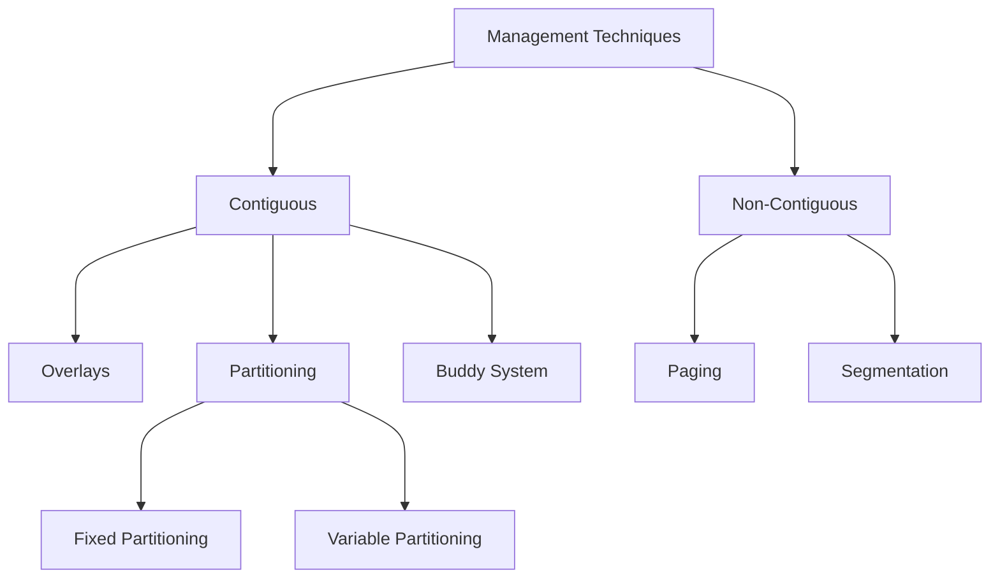

# Memory Management

* Memory management is a technique handled by the **Operating System's memory manager**.

---

## Goals of the Memory Manager
1. **Allocation**: Allocate memory space to processes.  
2. **Protection**: Protect memory from unauthorized access for security purposes.  
3. **Free Space Management**: Manage free space created when processes are deallocated.  
4. **Deallocation**: Remove processes from memory when they finish execution.  
5. **Effective Utilization**: Handle fragmentation efficiently.  
6. **Support Large Processes**: Allow large processes to run even in smaller memory spaces using advanced techniques.  

---

## Memory Management Techniques


* ### Non-Continuous Memory Allocation
  * Memory is allocated in a single contiguous block. Each process occupies one large block of memory.

  * ### Partitioning:
     * I oparation system mainly 2 tpye of partition is there:
     * **Fixed**:Memory is divided into fixed-size partitions at system startup.but there is the problem of internal fraqmentation.and partition are allocated using allocation policies like FF, BS, WF, NF .also degree of multiprogramming is limited. and max process size is also limited.
     * **Variable partition**:Memory is divided dynamically based on process size.this prevent from internal fraq but external fraq is arises.degree of the multiprogramming is limited, also max process size is also limited,and best allocation policy is the WF.
       * *NOTE:* one way to reduce this external fraq is campation(moving holes(free space one side other allocated part other side)),else move towards non continues memory allocation techniques.

* ### Non-Continuous Memory Allocation
  * Memory is allocated in multiple non-contiguous blocks.
Allows a process to occupy memory wherever free space is available.


---

* ## Address binding
   * Association of the program instruction or data unit to the memory  location 
   * all bindings are static except run time which is dynamic.

```mermaid
flowchart 
    node2[binding]--->node4[Compile time]
    node2[binding]--->node5[Run time]
    node2[binding]--->node6[Load time]

 ```

 ---
 * ### Address Space :
   * Group of the words that are associated with the address
  

  ```mermaid
flowchart 
    node2[Address Space]--->node4[Logical]
    node2[Address Space]--->node5[Physical]

 ```

