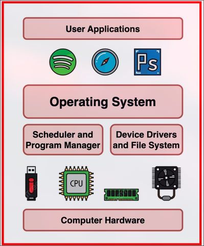
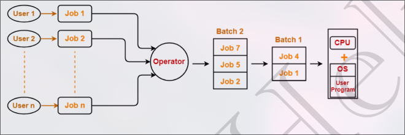
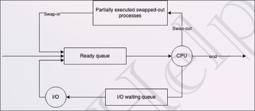
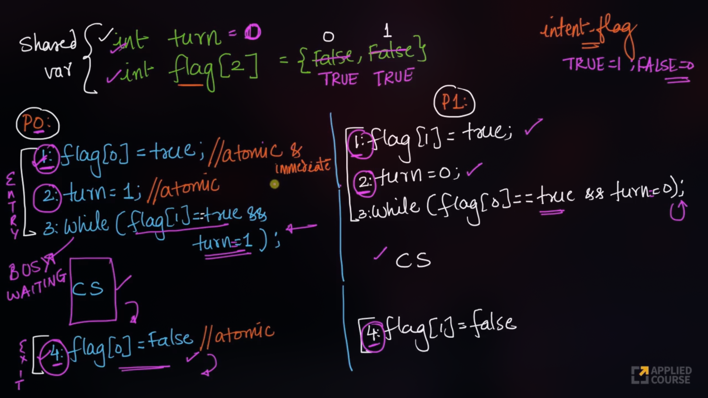
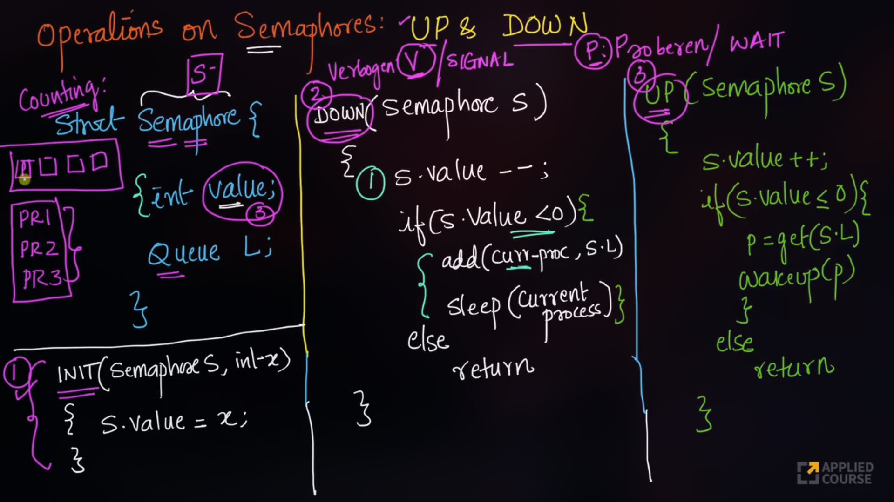
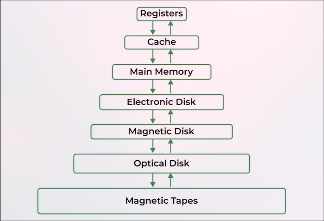

🧑‍💻 **Author:** RK ROY

[Download Full Notes PDF](./OS_Full_Notes.pdf)

<div align = "center"> <h1 style = "color:purple"> 🖥️ Operating System</h1></div>

- Operating system is a system software that acts as an interface between user and computer's hardware.
- A resource manager.

# 🔑Key functions of os

- Process Management – Manages execution of multiple processes (multitasking).
- Memory Management – Allocates and deallocates memory space as needed.
- File System Management – Organizes, stores, retrieves, and protects data on storage devices.
- Device Management – Manages input/output devices via device drivers.
- Security and Access Control – Ensures authorized access to data and resources.
- User Interface – Provides interfaces like CLI (Command Line Interface) or GUI (Graphical User Interface).

<div align="center"> 
    
</div>

# 📚 Goals of os

- Convenient to Use
- Efficient Resource management
- provide security and protection
- To enable multitasking and multiprogramming

<br>

<div align = "center"> <h1  style="color:purple"> 🥷 Types of OS </h1></div>

- Single process operating system
- Batch-processing operating system
- Multiprogramming operating system
- Multitasking operating system
- Multi-processing operating system
- Distributed system
- Real time OS

# 📚 Single process os

- A single-process operating system, specifically a single-user single-tasking operating system, allows only one process (or program) to be executed at a time by a single user

## Advantages

- Occupies less space in memory
- Easy to maintain
- Less chance of damage

## Disadvantages

- It can perform only a single task at a time.
- Tasks take longer to complete.
- os remains idle for most of the time and is not utilized to its maximum.

<div align = "center"> 
    
</div>

# 📚 Batch processing os

- A batch processing operating system is an operating system that is designed to perform multiple tasks in a sequential manner.
- Firstly, user prepares his job using punch cards.
- Then, he submits the job to the computer operator.
- Operator collects the jobs from different users and sort the jobs into batches with
  similar needs.
- Then, operator submits the batches to the processor one by one.
- All the jobs of one batch are executed together.

## Advantages

- It can perform multiple tasks at a time.
- It can perform tasks faster than a single-process operating system.

## Disadvantages

- Priorities cannot be set, if a job comes with some higher priority.
- May lead to starvation. (A batch may take more time to complete)
- CPU may become idle in case of I/O operations.

<div align = "center"> 
    
</div>

# 📚 Multiprogramming os

- Multiprogramming increases CPU utilization by keeping multiple jobs (code and data)
  in the memory so that the CPU always has one to execute in case some job gets busy with
  I/O.
    - Single CPU
    - Context switching for processes.
    - Switch happens when current process goes to wait state.
    - CPU idle time reduced.

# 📚 Multitasking os

- Multitasking is a logical extension of multiprogramming.
    - Single CPU.
    - Able to run more than one task simultaneously.
    - context switching and time sharing is used.
    - CPU idle time is further reduced.

# 📚 Multi-processing os

- More than one CPUs in a single computer.
    - Increases reliability, 1 cpu fails, other can work.
    - Better throughput.
    - Lesser process starvation, (if 1 CPU is
      working on some process, other can be
      executed on other CPU)

# 📚 Distributed os

- A Distributed Operating System is an OS that manages a collection of independent computers (nodes) and makes them appear to the user as a single coherent system.
    - Each node has its own processor and memory.
    - The OS coordinates all these nodes so users feel like they are using one powerful machine instead of many.
    - Think of it as a virtual single system built from multiple networked computers.

- Key Features :
    - Resource Sharing
    - Scalability
    - Concurrency
    - Fault Tolerance --> if one node fails, others can continue to run.

- Advantages :
    - Better performance (parallelism).
    - Reliability (fault tolerance).
    - Resource utilization (idle resources used efficiently).
    - Easier scalability.

- Challenges :
    - Synchronization between nodes.
    - Deadlocks across distributed processes.
    - Security (data is spread across many nodes).
    - Communication overhead (network delays, message passing).

# 📚 RTOS

- Real time error free, computations
  within tight-time boundaries.
- Air Traffic control system, ROBOTS etc.
- Eg--> FreeRTOS, NuttX, Contiki, TinyOS, VxWorks, etc.
- RTOS is like a strict teacher 👩‍🏫 who ensures every student (task) speaks exactly on time, never late. A general OS is like a friendly teacher who tries to give everyone equal chance, but doesn’t mind small delays.

<br>

<div align = "center"> 
    <h1 style = "color:purple"> 📖 Multi-Tasking and Multi-Threading </h1>
</div>

# 📨 Program

A program is a set of instructions written in a programming language to perform a specific task.

# 📨 Process

A process is an active instance of a program in execution.

# 📨 Thread

A thread is the smallest unit of execution within a process.

| Multi-Tasking                                                                                                                 | Multi-Threading                                                                                                                                                                                                          |
| :---------------------------------------------------------------------------------------------------------------------------- | :----------------------------------------------------------------------------------------------------------------------------------------------------------------------------------------------------------------------- |
| The execution of more than one task <br> simultaneously is called as Multi-Tasking                                            | A process is divided into several <br> different sub-tasks called as threads, which has its own path of execution. <br> The process of executing this thread simultaneously is called as multi-threading.                |
| Concept of more than 1 processes being context switched.                                                                      | Concept of more than 1 thread. Threads are context switche                                                                                                                                                               |
| Isolation and memory protection exists. OS must allocate separate memory and resources to each program that CPU is executing. | No isolation and memory protection, resources are shared among threads of that process. OS allocates memory to a process; multiple threads of that process share the same memory and resources allocated to the process. |

# 📘 Thread Scheduling

- Threads are scheduled for execution based on their priority.

## Difference between Thread Context Switching and Process Context Switching:

| Thread context switching                                                                                  | Process context switching                                                               |
| :-------------------------------------------------------------------------------------------------------- | :-------------------------------------------------------------------------------------- |
| OS saves current state of thread & switches to another thread of same process.                            | OS saves current state of process & switches to another process by restoring its state. |
| Doesn’t includes switching of memory address space. (But Program counter, registers & stac are included.) | Includes switching of memory address space.                                             |
| Fast Switching                                                                                            | Slow Switching                                                                          |
| CPU’s cache state is preserved.                                                                           | CPU’s cache state is flushed.                                                           |

## Context Switching

- Context Switching is the process of storing the state of a currently running process or thread, so that it can be resumed later, and loading the state of another process or thread to start or resume its execution.

## 🧠 Why is Context Switching needed?

- To implement multitasking or multithreading.
- To ensure fair CPU time among all active processes/threads.
- To allow the OS to switch between user applications and system tasks.

## 🔍 Example:

Suppose Process A is running and its time slice ends. The OS:

- Saves A’s context (e.g., PC = 205, register R1 = 50) in A’s PCB.
- Loads context of Process B from B’s PCB.
- CPU resumes execution of Process B.

<br>

<div align = "center"> <h1 style = "color:purple"> 🖥️ Components of OS </h1></div>

# 🎰 Kernel

- A kernel is that part of the operating system which interacts directly with
  the hardware and performs the most crucial tasks
    - Heart of OS/Core component
    - very first part of OS to load on start-up

# 👨‍🦲 User space

- Where application software runs, apps don’t have privileged access to the
  underlying hardware. It interacts with kernel.
    - GUI, CLI, etc.

# 📳 User Mode V/S Kernel Mode

- User Mode
    - The CPU executes application code.
    - Has restricted access to system resources (no direct I/O or hardware access).
    - If the program needs OS services, it must request them via a system call.

- Kernel Mode
    - The CPU executes OS kernel code.
    - Has unrestricted access to hardware and all memory.
    - Used to perform privileged operations on behalf of user programs.

- 🧠 Example

    ```C
    #include<unistd.h>
    #include<stdio.h>
    int main() {
        int a, b, c;
        a = 1;
        fork();
        system("Hi");
        return 0;
    }
    ```

    - First line of code is in a user mode.
    - Second line of code is in a user mode.
    - Third line of code is in a kernel mode.
        - when third line gets executed, the CPU switches to kernel mode.
        - The CPU executes the system call.
        - It creates a new process and copies all the instructions in the program and starts executing them from next instructions after fork().
        - when its done, it returns to the previous process and start executing from the next instructions from fork().
    - If we have N forks() we will be creating $2^N$ processes in total including the first process.

<div align = "center"> 

</div>

# 👩‍💻 Shell

- A shell, also known as a command interpreter, is that part of the operating system that receives
  commands from the users and gets them executed.

# 📚 Functions of Kernel

- Process Management
- Memory Management
- File Management
- I/O Management

# 🌐 Types of Kernel

- Monolithic Kernel
    - All functions are in kernel itself.
    - Bulky in size.
    - Memory required to run is high.
    - Less reliable, one module crashes --> whole kernel is down.
    - High performance as communication is fast.
    - Example : Linux, Unix, MS-DOS

- Mircro Kernel
    - only major functions are in kernel (memory management, process management)
    - file management and I/O management are in user space.
    - smaller in size.
    - More reliable.
    - More stable.
    - Performance is slow.
    - Overhead switching b/w user mode and kernel mode
    - Eg. L4 Linux, Symbian OS, MINIX etc

- Hybrid Kernel
    - Advantages of both worlds. (File mgmt. in User space and rest in Kernel
      space. )
    - Combined approach.
    - speed and design of mono.
    - Modularity and stability of micro
    - Eg. MacOS, Windows NT/7/10
    - IPC also happens but lesser overheads.

- Nano/Exo kernels

<br>

<div align = "center"> <h1 style = "color:purple"> 📲 System Calls</h1></div>

- How does apps interacts with kernel ?
    - using system calls.
- A system call is a mechanism using which a user program can request a service from the kernel for
  which it does not have the permission to perform.
- System Calls are the only way through which a process can go into kernel mode from user mode.

<div align = "center">
- Examples of windows and unix system calls

| Category          |                                  windows                                   |                     unix                     |
| :---------------- | :------------------------------------------------------------------------: | :------------------------------------------: |
| Process Control   |      Create Process() <br> Exit Process() <br> WaitForSingleObject()       |        fork() <br> exit() <br> wait()        |
| File Management   |               CreateFile() <br> ReadFile() <br> WriteFile()                | open() <br> read() <br> write() <br> close() |
| Device Management | SetConsoleMode() <br> ReadConsole() <br> ReadConsole() <br> WriteConsole() |       ioctl() <br> read() <br> write()       |
| Comunication      |         CreatePipe() <br> CreateFileMapping() <br> MapViewOfFile()         |       pipe() <br> shmget() <br> mmap()       |

</div>

# 🧠 What happens when you turn on your computer ?

- PC On
- CPU initializes itself and looks for a firmware program (BIOS) stored in
  BIOS Chip (Basic input-output system chip is a ROM chip found on
  mother board that allows to access & setup computer system at most
  basic level.)
    - In modern PCs, CPU loads UEFI (Unified extensible firmware
      interface)

- CPU runs the BIOS which tests and initializes system hardware. Bios
  loads configuration settings. If something is not appropriate (like missing
  RAM) error is thrown and boot process is stopped.
  This is called POST (Power on self-test) process.
  (UEFI can do a lot more than just initialize hardware; it’s really a tiny
  operating system. For example, Intel CPUs have the Intel Management
  Engine. This provides a variety of features, including powering Intel’s
  Active Management Technology, which allows for remote management
  of business PCs.)

- BIOS will handoff responsibility for booting your PC to your OS’s
  bootloader.
    - BIOS looked at the MBR (master boot record), a special boot
      sector at the beginning of a disk. The MBR contains code that
      loads the rest of the operating system, known as a “bootloader.”
      The BIOS executes the bootloader, which takes it from there and
      begins booting the actual operating system—Windows or Linux,
      for example.
      In other words,
      the BIOS or UEFI examines a storage device on your system to
      look for a small program, either in the MBR or on an EFI system
      partition, and runs it.

- The bootloader is a small program that has the large task of booting the
  rest of the operating system (Boots Kernel then, User Space). Windows
  uses a bootloader named Windows Boot Manager (Bootmgr.exe), most
  Linux systems use GRUB, and Macs use something called boot.efi

<br>

<div align = "center"> <h1 style = "color:purple"> 📚 Process </h1></div>

- A process is an active instance of a program in execution.

- 🧠 How OS creates a process ?
    - Load the program and static data into memory.
    - Allocate runtime stack.
    - Heap memory allocation.
    - IO tasks.
- Architecture of a process

<div align = "center">

| **Segment**      | **Description**                                                           |
| ---------------- | ------------------------------------------------------------------------- |
| **Stack**        | Stores function calls, local variables, return addresses. Grows downward. |
| **Heap**         | Dynamically allocated memory during runtime. Grows upward.                |
| **Data Segment** | Stores global and static variables.                                       |
| **Text Segment** | Stores the program code (instructions to be executed).                    |

</div>

- Stack : Local variables and function call information.
- Heap : Dynamic allocated values.
- Data : Global and static data.
- Text : Compiled code(Loaded from disk)

- PCB : Stores all the information about the process.
    - Stores information of a process such as process id, program counter, process state, priority, etc.

<div align = "center">

🖥️ Process Control Block (PCB Diagram)

| **Field**                  | **Description**                                   |
| -------------------------- | ------------------------------------------------- |
| **Process ID (PID)**       | Unique identifier                                 |
| **Process State**          | New / Ready / Running / Waiting / Terminated      |
| **Program Counter (PC)**   | Address of next instruction                       |
| **CPU Registers**          | General purpose, stack, accumulator, etc.         |
| **CPU Scheduling Info**    | Priority, scheduling queues, timeslices           |
| **Memory Management Info** | Base register, limit, page tables, segment tables |
| **I/O Status Information** | List of I/O devices, open files, buffers          |
| **Accounting Info**        | CPU used, time limits, process number, UID, etc.  |

</div>

- Process States
    - As Process executes, it changes its state. Each Process may be in one of the following states
        - New : OS is about to pick the program & convert it into process. OR the process is being created and we allocate the resrouces.
        - Run : Instructions are being executed. CPU is Allocated.
        - Waiting : Waiting for IO.
        - Ready : The process is in memory and waiting to be executed.
        - Terminated : The process has finished execution.

<div align = "center">  </div>

# 📖 Swapping

- Swapping is a mechanism in which a process can be swapped temporarily out of main memory (or move) to secondary storage (disk) and make that memory available to other processes. At some
  later time, the system swaps back the process from the secondary storage to the main memory.

<div align = "center">  </div>

# 📖 Context Switching

- Switching the CPU to another process requires performing a state save of the current process and a state restore of a different process.
- When this occurs, the kernel saves the context of the old process in its PCB and loads the saved context of the new process schedule to run.

# 📖 Orphan Process

- The process whose parent process has been terminated and it is still running.
- Orphan processes are adopted by init process.
- init is the first process of OS.

# 📖 Zombie Process / Defunct Process

- A zombie process is a process whose execution is completed but it still has an entry in the process table.
- Zombie processes usually occur for child processes, as the parent process still needs to read its child’s exit status. Once this is done using the wait system call, the zombie process is eliminated from the process table. This is known as reaping the zombie process.
- It is because parent process may call wait () on child process for a longer time duration and child process got terminated much earlier.
- As entry in the process table can only be removed, after the parent process reads the exit status of child process. Hence, the child process remains a zombie till it is removed from the process table.

<br>

<div align = "center"> <h1 style = "color:purple"> 🚸 Process Scheduling </h1> </div>

- Process Scheduling is the method by which an operating system decides which process in the ready queue should be executed next by the CPU. The goal is to maximize CPU utilization and system responsiveness while ensuring fairness among processes.

- Types of Process Scheduling
    - Preemptive Scheduling
        - In preemptive scheduling, the CPU can be taken away from a running process and assigned to another process (usually with higher priority or fairness requirements).
        - Example Algorithms:
            - Round Robin
            - Shortest Remaining Time First (SRTF)
            - Priority Scheduling
            - Multilevel Feedback Queue (MFQ)
        - Key Characteristics
            - Better for real-time systems.
            - Ensures responsiveness.
            - More context switches (overhead).
            - Allows interruption of long tasks.
        - Example :
            - If Process A is running and Process B (higher priority) arrives, then Process A is preempted, and Process B gets the CPU.

    - Non-Preemptive Scheduling
        - Once a process starts its execution, it cannot be interrupted until it finishes or blocks (e.g., for I/O).
        - Example Algorithms:
            - First Come First Served (FCFS)
            - Shortest Job First (SJF)
            - Priority Scheduling (non-preemptive)
        - Key Characteristics
            - Simpler to implement.
            - No context switch overhead due to preemption.
            - Poor responsiveness for shorter processes.
            - A long process can block others.
        - Example :
            - If Process A is running and Process B arrives, Process A continues until completion, then Process B is scheduled.

- Throughput : Number of processes completed per unit time.
- Arrival Time : Time when process arrives at ready queue.
- Burst Time : Time required by the process to complete its execution.
- Turnaround Time : Time taken from first time process enters ready state till it terminates.
- Wait Time : Time process spends waiting for CPU. (WT = TAT – BT)

- 🧠 what is convoy effect ?
    - The Convoy Effect is a phenomenon associated with the First Come First Serve (FCFS) algorithm, in which the whole Operating System slows down due to a few slow processes.

<div align = "center"> 

</div>

<br>

<div align = "center">
    <h1 style = "color:purple"> 📖 Inter Process Communication and Synchronization </h1>

</div>

- Inter-Process Communication or IPC is a mechanism that allows processes to communicate and exchange data with each other.

<div align = "center">

```C
+-------------------+       +-------------------+
|     Process A     |       |     Process B     |
|                   |       |                   |
|   ┌───────────┐   |       |   ┌───────────┐   |
|   │   Send     │----------->  │  Receive   │   |
|   └───────────┘   |       |   └───────────┘   |
|                   |       |                   |
+-------------------+       +-------------------+
```

</div>

- 🧠 How can you achieve it ?
    - Let's take an example of streaming a video to youtube.
    - Lets say one process is responsible to record your video and another process is responsible to take that video data and send it to youtube server.
    - To do this, both the processes need to communicate with each other.
    - Once way to achieve it is ---> lets say we will stored the video data into a file and then another process will grab it from the secondary device where the video data is stored.
    - This is not very good, since the process will be very slow as the data is stored in a secondary storage.
    - To solve this problem we need to stored the data into memory.

- Better Solution to the above problems is to use some mechanism listed down below
    - Shared Memory.
    - Message Passing.
    - Pipes.

- Synchronization
    - The process of coordinating the execution of processes or threads so that they can access shared resources or data safely without causing errors like race conditions, data corruption, or inconsistencies.

- Role of Synchronization in IPC
    - Preventing Race Conditions.
    - Ensuring Mutual Exclusion.
    - Coordinating Process Execution.
    - Preventing Deadlocks.

- Example of IPC : Producer Consumer Problem
    - The Producer–Consumer Problem is a classic process synchronization problem that deals with coordinating two types of processes:
        - Producer → Generates data and places it in a buffer.
        - Consumer → Takes data from the buffer and uses it.
    - The problem arises when producer and consumer run at different speeds and share a common buffer.
    - We have :
        - A shared buffer of finite size.
        - Producer inserts items into the buffer.
        - Consumer removes items from the buffer.
    - Constraints :
        - Producer must wait if the buffer is full.
        - Consumer must wait if the buffer is empty.
        - Both must not access the buffer at the same time (to avoid race conditions).
    - 🧠 Why Synchronization is needed ?
        - Producer may overwrite data before the consumer uses it.
        - Consumer may try to consume from an empty buffer.
        - Concurrent modifications can corrupt the buffer.

- Incorrect Solution to producer-consumer problem

```C
#include <stdio.h>
#include <pthread.h>
#include <unistd.h>

#define BUFFER_SIZE 5

int buffer[BUFFER_SIZE];
int count = 0; // Number of items in buffer

void* producer(void* arg) {
    int item = 0;
    while(1) {
        if(count < BUFFER_SIZE) { // Check if buffer is not full
            buffer[count] = item;
            printf("Produced: %d\n", item);
            count++;
            item++;
        }
        sleep(1);
    }
    return NULL;
}

void* consumer(void* arg) {
    while(1) {
        if(count > 0) { // Check if buffer is not empty
            int item = buffer[count - 1];
            printf("Consumed: %d\n", item);
            count--;
        }
        sleep(1);
    }
    return NULL;
}

int main() {
    pthread_t prod, cons;

    pthread_create(&prod, NULL, producer, NULL);
    pthread_create(&cons, NULL, consumer, NULL);

    pthread_join(prod, NULL);
    pthread_join(cons, NULL);

    return 0;
}
```

- No mutual exclusion: Both producer and consumer modify count and buffer simultaneously → race condition.
- Possible buffer overflow/underflow: Multiple threads may check count and update it concurrently, violating BUFFER_SIZE limit
- No synchronization primitives: Should use mutexes and condition variables to coordinate access.

- Correct Solution to producer-consumer problem using mutexes

```C
#include <stdio.h>
#include <pthread.h>
#include <unistd.h>

#define BUFFER_SIZE 5

int buffer[BUFFER_SIZE];
int count = 0;   // Number of items in buffer
int in = 0;      // Next write index
int out = 0;     // Next read index

pthread_mutex_t mutex = PTHREAD_MUTEX_INITIALIZER;
pthread_cond_t not_full = PTHREAD_COND_INITIALIZER;
pthread_cond_t not_empty = PTHREAD_COND_INITIALIZER;

// Producer function
void* producer(void* arg) {
    int item = 0;
    while (1) {
        pthread_mutex_lock(&mutex);

        while (count == BUFFER_SIZE) { // Buffer full
            pthread_cond_wait(&not_full, &mutex);
        }

        buffer[in] = item;
        in = (in + 1) % BUFFER_SIZE;
        count++;
        printf("Produced: %d\n", item++);

        pthread_cond_signal(&not_empty); // Notify consumer
        pthread_mutex_unlock(&mutex);

        sleep(1); // Simulate production time
    }
    return NULL;
}

// Consumer function
void* consumer(void* arg) {
    while (1) {
        pthread_mutex_lock(&mutex);

        while (count == 0) { // Buffer empty
            pthread_cond_wait(&not_empty, &mutex);
        }

        int item = buffer[out];
        out = (out + 1) % BUFFER_SIZE;
        count--;
        printf("Consumed: %d\n", item);

        pthread_cond_signal(&not_full); // Notify producer
        pthread_mutex_unlock(&mutex);

        sleep(2); // Simulate consumption time
    }
    return NULL;
}

int main() {
    pthread_t prod, cons;

    pthread_create(&prod, NULL, producer, NULL);
    pthread_create(&cons, NULL, consumer, NULL);

    pthread_join(prod, NULL);
    pthread_join(cons, NULL);

    return 0;
}
```

- To Solve these kinds os problems, we need to use synchronization primitives like mutexes, semaphores, and condition variables.

- Necessary conditions for a Synchronization problem to occur
    - Critical Section
        - The critical section refers to the segment of code where processes/threads access shared resources, such as common variables and files, and perform write operations on them. Since processes/threads execute concurrently, any process can be interrupted mid-execution.
    - Race Condition :
        - A race condition occurs when two or more processes can access shared data and they try to change it at the same time.
    - Premption

- How to avoid these kinds of problems ?
    - Mututal Exclusion : Ensure that only one process or thread can access the critical section at a time.
        - Techniques:
            - Mutexes: Threads acquire the lock before entering the critical section and release it after leaving.
            - Semaphores : Counting or binary semaphores can control access to shared resources.
    - Hold and Wait Prevention
        - Prevent a process from holding one resource while waiting for another.
        - Example: Require a process to request all required resources at once, or release held resources if the next resource is not available.
    - Avoiding Race Conditions :
        - Use atomic operations whenever possible (operations that cannot be interrupted).
        - Ensure critical sections are protected using locks (mutexes, semaphores, or monitors).
        - Peterson’s solution can be used to avoid race condition but holds good for only 2 process/thread.

<div align = "center"> 
    
</div>

- <p style = "color:orange"> Sample Code for Peterson’s solution </p>

```C
#include <stdio.h>
#include <pthread.h>

int flag[2];   // Indicates if a process wants to enter critical section
int turn;      // Whose turn is it?
int shared = 0; // Shared resource

void* process0(void* arg) {
    for (int i = 0; i < 5; i++) {
        flag[0] = 1;      // Process 0 wants to enter
        turn = 1;         // Give turn to process 1
        while (flag[1] && turn == 1); // Wait if process 1 wants to enter and it's its turn

        // Critical section
        shared++;
        printf("Process 0: shared = %d\n", shared);

        flag[0] = 0; // Exit critical section
    }
    return NULL;
}

void* process1(void* arg) {
    for (int i = 0; i < 5; i++) {
        flag[1] = 1;      // Process 1 wants to enter
        turn = 0;         // Give turn to process 0
        while (flag[0] && turn == 0); // Wait if process 0 wants to enter and it's its turn

        // Critical section
        shared++;
        printf("Process 1: shared = %d\n", shared);

        flag[1] = 0; // Exit critical section
    }
    return NULL;
}

int main() {
    pthread_t t0, t1;

    pthread_create(&t0, NULL, process0, NULL);
    pthread_create(&t1, NULL, process1, NULL);

    pthread_join(t0, NULL);
    pthread_join(t1, NULL);

    printf("Final value of shared: %d\n", shared);
    return 0;
}
```

<br>

<div align = "center"><h1 style = "color:purple"> 🔏 Critical Section </h1> </div>

- Proces Synchronization techniques play a key role in maintaining the consistency of shared data.

# 📚 Critical Section

- The critical section refers to the segment of code where processes/threads
  access shared resources, such as common variables and files, and perform
  write operations on them. Since processes/threads execute concurrently, any
  process can be interrupted mid-execution.

# 📖 Race Condition

- A race condition occurs when two or more threads can access shared data and they try to change it at the same time.

- Solution to Race Condition
    - Mutual Exclusion using locks.
    - Semaphores.
    - Atomic operations: Make Critical code section an atomic operation, i.e., Executed in one CPU cycle.
    - Peterson’s Solution can be used to avoid race condition but holds good for only 2 process/threads.
    - Mutex/Locks :
        - Locks can be used to implement mutual exclusion and avoid race condition by allowing only one thread/process to access critical section.
        - Disadvantages
            - Deadlocks.
            - Starvation of high priority threads.
            - Contention : one thread has acquired the lock, other thread will be busy waiting, what if thread that had acquired the lock dies, then all other threads will be in infinite waiting.

# 📖 Mututal Exclusion

- Mutual Exclusion ensures that only one process or thread can access a critical section (shared resource) at a time. This prevents race conditions, data inconsistency, and unexpected behavior.

- <p style = "color:orange"> Sample code for Mutexes </p>

```c
#include <stdio.h>
#include <pthread.h>

int counter = 0; // shared resource
pthread_mutex_t lock; // mutex

void* increment(void* arg) {
    for (int i = 0; i < 1000000; i++) {
        pthread_mutex_lock(&lock);     // Enter critical section
        counter++;
        pthread_mutex_unlock(&lock);   // Exit critical section
    }
    return NULL;
}

int main() {
    pthread_t t1, t2;
    pthread_mutex_init(&lock, NULL);  // Initialize mutex

    pthread_create(&t1, NULL, increment, NULL);
    pthread_create(&t2, NULL, increment, NULL);

    pthread_join(t1, NULL);
    pthread_join(t2, NULL);

    pthread_mutex_destroy(&lock);     // Destroy mutex
    printf("Final counter (with mutex): %d\n", counter);
    return 0;
}
```

# 📖 Semaphores

- A semaphore is a synchronization tool used to control access to shared resources in a concurrent system like a multitasking OS.

- Types of Semaphores
    - Binary Semaphores :
        - This is also known as a mutex lock, as they are locks that provide mutual exclusion. It can have only two values - 0 and 1. Its value is initialized to 1. It is used to implement the solution of critical section problems with multiple processes and a single resource.
    - Counting Semaphores :
        - Counting semaphores can be used to control access to a given resource consisting of a finite number of instances. The semaphore is initialized to the number of resources available. Its value can range over an unrestricted domain.

- Binary Semaphores cannot tell me how many process are waiting for the resources, but Counting Semaphores does.

- 🗝️ Key idea
    - A semaphore is a special variable(part of os itself) that is used to
        - signal and wait.
        - Ensure mutual exlusion.
        - Avoid race condition and deadlocks.
    - All the operations performed are atomic(either complete or nothing, cannot preempt a function).

- <p style = "color:orange"> Counting Semaphores </p>
      <div align = "center">
      
      </div>

```java
import java.util.LinkedList;
import java.util.Queue;
// semaphore class
class Semaphore {
    // our value
    int value;
    public Semaphore(int value) {
        this.value = value;
        q = new LinkedList<>();
    }
    public void P(Process p) {
        value--;
        if (value < 0) {
            q.add(p);
            p.block();
        }
    }
    public void V() {
        value++;
        if (value <= 0) {
            Process p = q.remove();
            p.wakeup();
        }
    }
}
```

- <p style = "color:orange"> Binary Semaphores </p>

<div align = "center">
  
</div>

```java
import java.util.*;
class Semaphore {
    public enum Value { Zero, One }
    public Queue<Process> q = new LinkedList<Process>();
    public Value value = Value.One;
    public void P(Semaphore s, Process p) {
        if (s.value == Value.One) {
            s.value = Value.Zero;
        }
        else {
            // add the process to the waiting queue
            q.add(p);
            p.Sleep();
        }
    }
    public void V(Semaphore s) {
        if (s.q.size() == 0) {
            s.value = Value.One;
        }
        else {
            // select a process from waiting queue
            Process p = q.peek();
            // remove the process from waiting as it has
            // been sent for CS
            q.remove();
            p.Wakeup();
        }
    }
}
```

- <p style = "color:orange"> Example : Dining Philosoper Problem </p>

<div align = "center"> 
    
</div>

- Deadlock problem occurs when each philosopher are hungry are the same time and each one of them picks their left fork.

- Solution : Use a semaphore to ensure that only one philosopher is eating at a time.

```c
#include <stdio.h>
#include <stdlib.h>
#include <pthread.h>
#include <semaphore.h>
#include <unistd.h>

#define NUM_PHILOSOPHERS 5

sem_t chopsticks[NUM_PHILOSOPHERS];

void* philosopher(void* num) {
    int id = *(int*)num;
    int left = id;
    int right = (id + 1) % NUM_PHILOSOPHERS;

    while (1) {
        printf("Philosopher %d is thinking...\n", id);
        sleep(rand() % 3 + 1);  // Think

        printf("Philosopher %d is hungry...\n", id);

        // To prevent deadlock, pick lower-numbered chopstick first
        if (id % 2 == 0) {
            sem_wait(&chopsticks[left]);
            sem_wait(&chopsticks[right]);
        } else {
            sem_wait(&chopsticks[right]);
            sem_wait(&chopsticks[left]);
        }

        printf("Philosopher %d is eating...\n", id);
        sleep(rand() % 2 + 1);  // Eat

        sem_post(&chopsticks[left]);
        sem_post(&chopsticks[right]);

        printf("Philosopher %d finished eating.\n", id);
        sleep(rand() % 2 + 1);
    }

    return NULL;
}

int main() {
    pthread_t threads[NUM_PHILOSOPHERS];
    int ids[NUM_PHILOSOPHERS];

    for (int i = 0; i < NUM_PHILOSOPHERS; i++)
        sem_init(&chopsticks[i], 0, 1);

    for (int i = 0; i < NUM_PHILOSOPHERS; i++) {
        ids[i] = i;
        pthread_create(&threads[i], NULL, philosopher, &ids[i]);
    }

    for (int i = 0; i < NUM_PHILOSOPHERS; i++)
        pthread_join(threads[i], NULL);

    for (int i = 0; i < NUM_PHILOSOPHERS; i++)
        sem_destroy(&chopsticks[i]);

    return 0;
}
```

- Although the semaphore solution makes sure that no two neighbors are eating simultaneously
  but it could still create Deadlock.
- Suppose that all 5 ph. Become hungry at the same time and each picks up their left fork, then
  All fork semaphores would be 0
- When each ph. Tries to grab his right fork, he will be waiting for ever (Deadlock)

- Odd-even rule (fix Deadlock) : an odd philosopher Picks up first his left fork and then his right fork, whereas an even philosopher Picks up his right fork then his left fork.

<br>

<div align = "center"><h1 style = "color:purple"> ㊙️ Introduction to concurrency </h1> </div>

- Concurrency in Operating System refers to the ability of the system to execute multiple tasks or processes at the same time improving resource utilization and system efficiency.

- Key Points
    - Concurrency is about managing multiple tasks at once.
    - It's achieved through context switching, where the CPU rapidly switches between tasks.
    - Used in both single-core (via time slicing) and multi-core (via parallelism) systems.
    - Implemented using threads, processes, and scheduling algorithms.
    - Enhances resource utilization, responsiveness, and system throughput.

- Conditions of concurrency
    - There must be two or more processes or threads that can run independently.
    - Two Process that share resources (memory, disk, etc.) can still be executed concurrently using proper synchronization.
    - If both processes try to access shared resources at the same time without proper synchronization, it may lead to:
        - Race Conditions
        - Deadlocks
        - Data inconsistency

- The Processes executing in the operating system is one of the following two types
    - independent processes
        - A process that does not rely on or affect the execution of other processes. Its execution is completely self-contained.
        - Example : A background file compression process running alone.
    - cooperative processes
        - A process that depends on the results or execution of other processes. Its execution may be influenced by other processes.
        - Example : A process that prints a file after another process generates it.

- Problems in Concurrency
    - Sharing global resources
        - Sharing of global resources safely is difficult. If two processes both make use of a global variable and both perform read and write on that variable, then the order in which various read and write are executed is critical.
    - Optimal allocation of resources
        - It is difficult for the operating system to manage the allocation of resources optimally.

- Advantages of Concurrency
    - Running of multiple applications:
        - It enable to run multiple applications at the same time. <br>
    - Better resource utilization
        - It enables that the resources that are unused by one application can be used for other applications.
    - Better performance

## 🔐 Deadlock

                            +--------+       wait for       +--------+
                            |  P1    | -------------------> |  R2    |
                            |        |                      |        |
                            +--------+                      +--------+
                                |                                ^
                        holds   |                                |  held by
                                v                                |
                            +--------+       wait for       +--------+
                            |  R1    | <------------------- |  P2    |
                            +--------+                      +--------+

- Two or more processes are waiting on some resource’s availability, which will never be available as it is also busy with some other process. The Processes are said to be in Deadlock.

- Deadlock is a bug present in the process/thread synchronization method.

- Resouce Allocation Graph
    - A Resource Allocation Graph shows which resources are held by which processes and which processes are waiting for specific types of resources, including how many resources are available, how many are allocated, and what each process needs.

<div align = "center">  </div>

- <p style = "color:red"> Note : It is not always true that if a graph has a cycle, then there is a deadlock. </p>

- If graph contains no cycles → no deadlock.
- If graph contains a cycle → if only one instance per resource type, then deadlock.
  if several instances per resource type, possibility of deadlock

- # ❕Necessary Conditions for deadlock
    - A deadlock can occur only if all four conditions hold simultaneously:
        - Mututal Exclusion :
            - if there exist a deadlock that means, there exist a critical section and shared resources(cpu, variables, semaphores) concept being used between two processes or threads.
        - Hold and wait :
            - A process must be holding at least one resource & waiting to acquire additional resources that are currently being held by other processes.
        - No Preemption :
            - A resource cannot be forcibly taken away; it must be released voluntarily.
        - Circular wait :
            - A closed chain of processes exists, where each process is waiting for a resource held by the next.

- # 🔑 Deadlock Prevention
    - By ensuring at least one of the necessary conditions cannot hold.
        - Mututal Exclusion
            - Try to avoid resource sharing between processes meaning not having a critical section (which is almost not possible).

        - Preemption
            - Allow the OS to forcibly take resources.
                - forcefull preemption.
                - self preemption.
            - We can use the concept of priority to achieve it.
            - Starvation Problem

        - Circular Wait
            - Impose ordering on resources (e.g., request in increasing order).
            - Every process will request the resoures in inreasing order of the resource id.
            - Starvation Problem.
        - Hold and Wait
            - Let a process request all the resources it needs, let's say it needs r1, r2, r3, and just in case if any of the resources are not available, then don't allocate any of the resources(r1, r2, r3) to the current process.
            - if process request ri and if all the previously allocated id of rp is less than id of ri we will allocat it, but if not we will release all the rp whose id > id of ri and will request them in future.
            - Starvation Problem.

- # 🚷 Deadlock Avoidance

- Deadlock avoidance is a technique in operating systems used to dynamically decide whether it is safe to allocate a requested resource to a process, before doing so — ensuring the system never enters an unsafe (potentially deadlocked) state.

- Banker's Algorithm: Deadlock avoidance algorithm that uses a banker's queue to ensure that a process is not starved of resources.

<div align = "center"> <h1 style = "color:purple"> 💀 Banker's Algorithm (Deadlock Avoidance Algorithm)</h1> </div>

- Banker's Algorithm is a resource allocation and deadlock avoidance algorithm used in operating systems. It ensures that a system remains in a safe state by carefully allocating resources to processes while avoiding unsafe states that could lead to deadlocks.

- max[i][j] = We need to know the maximum number of resource j that a process i need.
- allot[i][j] = The number of resource j that process i has already been allocated.
- need[i][j] = The number of resource j that process i needs to completely get executed.
- avail[j] = The number of resource j that is currently available.

- <p style = "color:orange"> Algorithm </p>

```Java
import java.util.*;
class Banker {
    // Number of processes
    static int P = 5;
    // Number of resources
    static int R = 3;
    // Function to find the need of each process
    static void calculateNeed(int need[][], int maxm[][], int allot[][]) {
        // Calculating Need of each process
        for (int i = 0; i < P; i++) {
            for (int j = 0; j < R; j++) {
                // Need of instance = max instance - allocated instance
                need[i][j] = maxm[i][j] - allot[i][j];
            }
        }
    }
    // Function to check if the system is in a safe state
    static boolean isSafe(int processes[], int avail[], int maxm[][], int allot[][]) {
        int[][] need = new int[P][R];
        // Calculate need matrix
        calculateNeed(need, maxm, allot);
        // Mark all processes as unfinished
        boolean[] finish = new boolean[P];
        // To store safe sequence
        int[] safeSeq = new int[P];
        // Make a copy of available resources
        int[] work = new int[R];
        for (int i = 0; i < R; i++) {
            work[i] = avail[i];
        }
        int count = 0;
        while (count < P) {
            boolean found = false;
            for (int p = 0; p < P; p++) {
                // If process is not finished and its needs can be satisfied
                if (!finish[p]) {
                    int j;
                    for (j = 0; j < R; j++) {
                        if (need[p][j] > work[j]) {
                            break;
                        }
                    }
                    // If all needs of p are satisfied
                    if (j == R) {
                        // Release resources
                        for (int k = 0; k < R; k++) {
                            work[k] += allot[p][k];
                        }
                        // Add this process to safe sequence
                        safeSeq[count++] = p;
                        // Mark as finished
                        finish[p] = true;
                        found = true;
                    }
                }
            }
            // If no process was found
            if (!found) {
                System.out.println("System is not in safe state");
                return false;
            }
        }
        // If system is in safe state
        System.out.print("System is in safe state.\nSafe sequence is: ");
        for (int i = 0; i < P; i++) {
            System.out.print(safeSeq[i] + " ");
        }
        System.out.println();
        return true;
    }
    public static void main(String[] args) {
        int processes[] = {0, 1, 2, 3, 4};
        // Available instances of resources
        int avail[] = {3, 3, 2};
        // Maximum resources that can be allocated to processes
        int maxm[][] = {
            {7, 5, 3},
            {3, 2, 2},
            {9, 0, 2},
            {2, 2, 2},
            {4, 3, 3}
        };
        // Resources currently allocated to processes
        int allot[][] = {
            {0, 1, 0},
            {2, 0, 0},
            {3, 0, 2},
            {2, 1, 1},
            {0, 0, 2}
        };
        // Check if system is in safe state
        isSafe(processes, avail, maxm, allot);
    }
}
```

<br>

<div align = "center"> 
    <h1 style = "color:purple"> ♏ Multi-Threading </h1>
</div>

- Multithreading is a feature in operating systems that allows a program to do several tasks at the same time. Think of it like having multiple hands working together to complete different parts of a job faster. Each "hand" is called a thread, and they help make programs run more efficiently.
- Multithreading makes your computer work better by using its resources more effectively, leading to quicker and smoother performance for applications like web browsers, games, and many other programs you use every day.

| Feature          | Multithreading                                                                         | Multitasking                                                                              |
| ---------------- | -------------------------------------------------------------------------------------- | ----------------------------------------------------------------------------------------- |
| **Definition**   | Running multiple threads within a single program simultaneously.                       | Running multiple programs or tasks concurrently.                                          |
| **Example**      | Web browser loading a page, handling user input, and downloading files simultaneously. | Listening to music, browsing the web, and typing a document at the same time.             |
| **Scope**        | Within a single program.                                                               | Across multiple programs.                                                                 |
| **Resource Use** | Utilizes CPU resources more efficiently within a program.                              | Manages system resources to allocate time and memory to different programs.               |
| **Purpose**      | Enhances the performance and responsiveness of a single application.                   | Improves overall system efficiency by allowing concurrent execution of multiple programs. |
| **Switching**    | Threads are managed by the program itself.                                             | Programs are managed by the operating system, which switches between them.                |

- Drawbacks of multithreading
    - If you don’t make use of the locking mechanisms properly, while investigating data access issues there is a chance of problems arising like data inconsistency and dead-lock.
    - If many threads try to access the same data, then there is a chance that the situation of thread starvation may arise. Resource contention issues are another problem that can trouble the user.
    - Display issues may occur if threads lack coordination when displaying data.

- Benefits of Multithreading
    - 🚀 Improved performance - Multiple tasks execute in parallel, making programs faster.
    - ⭐ Better CPU utilization – Keeps CPU busy by running multiple threads instead of idle waiting.
    - 🖥️ Responsive applications – UI stays smooth while background tasks (like file downloads) run.
    - ⏩ Faster context switching – Threads switch quicker than processes since they share memory.
    - 📂 Resource sharing – Threads within a process share memory and resources, reducing overhead.
    - 📈 Scalability – Effective use of multi-core processors for parallel execution.

<br> 
<div align = "center"> <h1 style = "color:purple"> 👨‍🏭 Memory Management </h1> </div>

- Memory is a hardware component that stores data, instructions and information temporarily or permanently for processing. It consists of an array of bytes or words, each with a unique address.

# 📚 Static and Dynamic Loading

- Static loading
    - Static Loading is basically loading the entire program into a fixed address. It requires more memory space.
    - Speed of execution is faster than dynamic loading.
    - Unefficient use of memory since we are loading all the modules of the program at once.

- Dynamic Loading
    - Dynamic loading loads program routines into memory only when they are needed. This saves memory by not loading unused routines.
    - Speed of execution is slower than static loading.
    - Efficient use of memory since we are loading only the modules that are needed.

# 📚 Logical and Physical Address

- Logical Address
    - An address generated by the CPU.
    - The logical address is basically the address of an instruction or data used by a process.
    - User can access logical address of the process.
    - Logical address does not exist physically. Hence, aka, Virtual Address.
- <p style = "color:orange"> Physical Address </p>
    
    - An address generated by the memory management unit.
    - User can never access the physical address of the Program.
    - A physical address can be accessed by a user indirectly but not directly.

- <p style = "color:orange"> Memory Management </p>
    
    - Memory management is a critical aspect of operating systems that ensures efficient use of the computer's memory resources. It controls how memory is allocated and deallocated to processes, which is key to both performance and stability.

<div align = "center"> 
    
</div>

- 🧠 why memory management is important ?
    - Allocate and de-allocate memory before and after process execution.
    - To keep track of used memory space by processes.
    - To minimize fragmentation issues.
    - To proper utilization of main memory.
    - To maintain data integrity while executing of process.

# 📚 Memory Management Techniques

- Memory management techniques are methods used by an operating system to efficiently allocate, utilize, and manage memory resources for processes.

<div align = "center">
    
</div>

- 🚟 Continguous Memory Allocation
    - Contiguous memory allocation is a memory management method where each process is given a single, continuous block of memory. This means all the data for a process is stored in adjacent memory locations.
    - Fixed paritioning
    - Variable paritioning

- Non-Contiguous Memory Allocation
    - This method allows processes to be broken into smaller parts, which are placed in different, non-adjacent memory locations.
    - paging
    - segmentation

- 🔯 Fixed Partitioning
    - Memory is divided into fixed-sized partitions at system boot time(The size of each partition may vary).
    - A process is loaded into a partition only if it fits within its size.
    - Leads to internal fragmentation (wasted space inside a partition).
    - Simple to implement.
    - Leads to external fragmentation.
    - No resizing of partitions during runtime.
    - Also know as multi-programming with fixed number of tasks(MFT).

- ㊙️ Variable Partitioning
    - Memory is divided into variable-sized partitions dynamically based on process size.
    - A process is loaded into a partition of exactly or closely matching size.
    - Leads to external fragmentation (free memory scattered in small blocks)
    - More efficient memory use compared to fixed partitioning.
    - Compaction may be required to remove fragmentation.
    - Complex to implement compared to fixed partitioning.
    - Allows more flexibility and better utilization for varying process sizes.

<div align = "center"> 
    
</div>

- 🧠 How to satisfy a request of a of n size from a list of free holes ?
    - Various algorithms which are implemented by the Operating System in order to find out the holes in the linked list and allocate them to the processes.
        - First Fit
        - Best Fit
        - Worst Fit
        - Next Fit

- 📃 Paging
    - Paging is the process of moving parts of a program, called pages, from secondary storage (like a hard drive) into the main memory (RAM). The main idea behind paging is to break a program into smaller fixed-size blocks called pages.
    - To keep track of where each page is stored in memory, the operating system uses a page table. This table shows the connection between the logical page numbers (used by the program) and the physical page frames (actual locations in RAM). The memory management unit uses the page table to convert logical addresses into physical addresses, so the program can access the correct data in memory.
    - Features
        - <p style = "color:orange"> Logical to physical address mapping</p> Paging divides a process's logical address space into fixed-size pages. Each page maps to a frame in physical memory, enabling flexible memory management.
        - <p style = "color:orange"> Fixed page and frame size</p> Pages and frames have the same fixed size. This simplifies memory management and improves system performance.
        - <p style = "color:orange"> Page table entries </p> Each logical page is represented by a page table entry (PTE). A PTE stores the corresponding frame number and control bits.
        - <p style = "color:orange"> Number of page table entries</p> The page table has one entry per logical page. Thus, its size equals the number of pages in the process's address space.
        - <p style = "color:orange">Page table stored in main memory</p> The page table is kept in main memory. This can add overhead when processes are swapped in or out
    - Advantages
        - Eliminates External Fragmentation
        - Efficient Memory Utilization
        - Supports Virtual Memory
    - Disadvantages
        - Internal Fragmentation
        - I/O Overhead During Page Faults
        - Complexity in Implementation
        - Page Table Lookup Time

- <p style = "color:purple"> 📄 Segmentation </p>
    
    - Segmentation in Operating Systems is a memory management technique in which the process is divided into variable-sized segments, each of which is a logical unit such as:
    functions, object, array, stack, data, code, etc.
    - <p style = "color:orange"> Types of Segmentation </p>
       
      - Virtual Segmentation : 
         -  Each process is divided into a number of segments, but the segmentation is not done all at once. This segmentation may or may not take place at the run time of the program. 
      - Simple Segmentation : 
        - Each process is divided into a number of segments, all of which are loaded into memory at run time, though not necessarily contiguously.
    - <p style = "color:orange"> Segment Table</p>
       
       - It maps a two-dimensional Logical address into a one-dimensional Physical address. It's each table entry has:
            - Base Address :  It contains the starting physical address where the segments reside in memory. 
            - Segment Limit: Also known as segment offset. It specifies the length of the segment.
    - <p style = "color:orange"> Advantages </p>
           
        - Reduced Internal Fragmentation
        - Segment Table consumes less space in comparison to Page table in paging
        - As a complete module is loaded all at once, segmentation improves CPU utilization.
    - <p style = "color:purple"> Disadvantages </p>
        
        - External Fragmentation
        - Complexity
        - Overhead is associated with keeping a segment table for each activity.

<div align = "center"> <h1 style = "color:purple"> 🖥️ Virtual Memory </h1> </div>

- Virtual memory is a memory management technique used by operating systems to give the appearance of a large, continuous block of memory to applications, even if the physical memory (RAM) is limited. It allows larger applications to run on systems with less RAM.

- Objectives
    - To support multiprogramming , it allows more than one program to run at the same time.
    - A program doesn’t need to be fully loaded in memory to run. Only the needed parts are loaded.
    - Programs can be bigger than the physical memory available in the system.
    - Virtual memory creates the illusion of a large memory, even if the actual memory (RAM) is small.
    - It uses both RAM and disk storage to manage memory, loading only parts of programs into RAM as needed.
    - This allows the system to run more programs at once and manage memory more efficiently.

<div align = "center"> 
    
</div>

- Types of Virtual Memory
    - Paging
    - Segmentation

- Demand Paging : The process of loading the page into memory on demand (whenever a page fault occurs) is known as demand paging.

- Thrashing
    - Thrashing is a condition or a situation when the system is spending a major portion of its time servicing the page faults, but the actual processing done is very negligible.
    - Thrashing occurs in a computer system when the CPU spends more time swapping pages in and out of memory than executing actual processes. This happens when there is insufficient physical memory, causing frequent page faults and excessive paging activity. Thrashing reduces system performance and makes processes run very slowly.

- Page Replacement
    - A page is copied to the main memory when its demand is made, or page fault occurs. There are various page replacement algorithms which are used to determine the pages which will be replaced.
    - First In First Out (FIFO)
        - The first page to be used is the first page to be loaded into memory.
        - This is the simplest page replacement algorithm, but it is not the most efficient.
    - Least Recently Used (LRU)
        - The page that has been used the least is replaced first.
        - This algorithm is the most commonly used.
    - Optimal Page Replacement
        - Optimal page replacement is a page replacement algorithm that aims to minimize the number of page faults and maximize the utilization of memory.
        - It uses a data structure called a page replacement policy to determine which pages to replace.
        - The page replacement policy is based on the page's age, frequency of use, and other factors.
