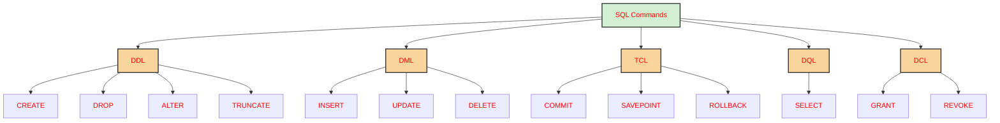

<div align = "center">
   
> # 🧰 SQL

</div>

- Structured Query Language (SQL) is the standard language used to interact with relational databases.
- Mainly used to manage data. Whether you want to create, delete, update or read data, SQL provides commands to perform these operations.
- Widely supported across various database systems like MySQL, Oracle, PostgreSQL, SQL Server and many others.
- Mainly works with Relational Databases (data is stored in the form of tables)

> **🧠 How to SQL works ?**

We interact with databases using SQL queries. DBMS tools like MySQL and SQL Server have their own SQL engine and an interface where users can write and execute SQL queries.

<div align = "center">


</div>

- Steps involved :
    - Input :
        - The user submits a query (e.g., SELECT, INSERT, UPDATE, DELETE) via an application or interface.
    - Parsing :
        - The query processor breaks the query into parts (tokens) and checks for syntax and schema correctness.
    - Optimization :
        - The optimizer finds the most efficient way to run the query using indexes, statistics and available resources.
    - Execution :
        - The execution engine runs the query using the chosen plan, accessing or modifying the database as needed.
    - Output :
        - Results are returned to the user, either data (for SELECT) or a success message (for other operations).

- Key Components of SQL System
    - Databases :
        - A database is a structured collection of data. It organizes data into tables, which are like spreadsheets with rows (records) and columns (fields) .
    - Tables :
        - Each table enforces rules and relationships among its columns for data integrity.
    - Indexes :
        - Indexes speed up queries by allowing the database to quickly locate data without scanning the entire table.
    - Views :
        - A view is a virtual table basically a saved SELECT statement you can query like a table.
    - Stored Procedures :
        - These are pre-written SQL scripts stored inside the database. They can receive inputs, run complex logic and return results boosting performance, reusability and security.
    - Transactions :
        - A transaction groups multiple SQL operations into a single unit. It ensures all changes are applied successfully or none are, preserving data integrity (ACID properties)
    - Security and Permissions :
        - SQL includes tools to restrict access, letting DBAs assign who can do what whether it's accessing tables, executing procedures, or changing structures.
    - Joins :
        - Joins combine data from multiple tables based on relationships essential for querying across related datasets.

> **🧠 What are Different SQL Commands or Queries?**

- Structured Query Language (SQL) commands are standardized instructions used by developers to interact with data stored in relational databases. These commands allow for the creation, manipulation, retrieval and control of data, as well as database structures. SQL commands are categorized based on their specific functionalities:



> ### Data Definition Language

- These commands are used to define the structure of database objects by creating, altering and dropping the database objects. Based on the needs of the business, database engineers create and modify database objects using DDL. The CREATE command, for instance, is used by the database engineer to create database objects like tables, views and indexes.

<div align = "center">

| Command  | Description                                                                   |
| -------- | ----------------------------------------------------------------------------- |
| CREATE   | Creates a new table, a view on a table, or some other object in the database. |
| ALTER    | Modifies an existing database object, such as a table                         |
| DROP     | Deletes an entire table, a view of a table, or other objects in the database  |
| TRUNCATE | Removes all records from a table but keeps the table structure intact.        |

</div>

> ### Data Manipulation Language

- A relational database can be updated with new data using data manipulation language (DML) statements. The INSERT command, for instance, is used by an application to add a new record to the database.

<div align = "center">

| Command | Description       |
| ------- | ----------------- |
| INSERT  | Creates a record. |
| UPDATE  | Modifies records. |
| DELETE  | Deletes records.  |

</div>

> ### Data Query Language

- Data retrieval instructions are written in the data query language (DQL), which is used to access relational databases. The SELECT command is used by software programs to filter and return particular results from a SQL table.

> ### Data Control Language

- DCL commands manage user access to the database by granting or revoking permissions. Database administrators use DCL to enforce security and control access to database objects.

<div align = "center">

| Command | Description                                |
| ------- | ------------------------------------------ |
| GRANT   | Gives a privilege to the user.             |
| REVOKE  | Takes back privileges granted by the user. |

</div>

> ### Transaction Control Language

- TCL commands manage transactions in relational databases, ensuring data integrity and consistency. These commands are used to commit changes or roll back operations in case of errors.

<div align = "center">

| Command   | Description                                                                                                                                             |
| --------- | ------------------------------------------------------------------------------------------------------------------------------------------------------- |
| COMMIT    | Saves all changes made during the current transaction on a permanent basis. Some databases provide an auto-commit feature, configurable using settings. |
| ROLLBACK  | Reverts changes made during the current transaction, ensuring no unwanted changes are saved.                                                            |
| SAVEPOINT | Sets a point within a transaction to which changes can be rolled back, allowing partial rollbacks.                                                      |

</div>

> ## Benefits of SQL

- Efficiency :
    - SQL is designed to handle complex queries and large datasets with optimal performance, making data retrieval and manipulation seamless.
- Standardization :
    - As an ANSI and ISO standard language, SQL provides a universal method to interact with relational databases across platforms.
- Scalability :
    - SQL supports databases ranging from small-scale applications to enterprise-level systems, ensuring smooth operations regardless of size.
- Flexibility :
    - SQL can be extended with procedural programming (e.g., PL/SQL, T-SQL) to build complex business logic and custom functions.

<div align = "center">

> # SQL Data Types

</div>

> ## Numeric Data Types

<div align = "center">

| Data Type      | Description                                            | Range                                                   |
| -------------- | ------------------------------------------------------ | ------------------------------------------------------- |
| **BIGINT**     | Large integer numbers                                  | -9,223,372,036,854,775,808 to 9,223,372,036,854,775,807 |
| **INT**        | Standard integer values                                | -2,147,483,648 to 2,147,483,647                         |
| **SMALLINT**   | Small integers                                         | -32,768 to 32,767                                       |
| **TINYINT**    | Very small integers                                    | 0 to 255                                                |
| **DECIMAL**    | Exact fixed-point numbers (e.g., for financial values) | -10^38 + 1 to 10^38 - 1                                 |
| **NUMERIC**    | Similar to DECIMAL, used for precision data            | -10^38 + 1 to 10^38 - 1                                 |
| **MONEY**      | For storing monetary values                            | -922,337,203,685,477.5808 to 922,337,203,685,477.5807   |
| **SMALLMONEY** | Smaller monetary values                                | -214,748.3648 to 214,748.3647                           |

</div>

> ## Character and String Data Types

<div align = "center">

| Data Type        | Description                                                                                          |
| ---------------- | ---------------------------------------------------------------------------------------------------- |
| **Char**         | The maximum length of 8000 characters. (Fixed-Length non-Unicode Characters)                         |
| **Varchar**      | The maximum length of 8000 characters. (Variable-Length non-Unicode Characters)                      |
| **Varchar(max)** | The maximum length of 2^31 - 1 characters (SQL Server 2005 only). (Variable Length non-Unicode data) |
| **Text**         | The maximum length of 2,127,483,647 characters (Variable Length non-Unicode data)                    |

</div>

> ## Date and Time Data Type

<div align = "center">

| Data Type | Description                                                           | Storage Size |
| --------- | --------------------------------------------------------------------- | ------------ |
| DATE      | stores the data of date (year, month, day)                            | 3 Bytes      |
| TIME      | stores the data of time (hour, minute, second)                        | 3 Bytes      |
| DATETIME  | store both the data and time (year, month, day, hour, minute, second) | 8 Bytes      |

</div>

> ## Binary Data Types in SQL

<div align = "center">

| Data Type | Description                   | Max Length          |
| --------- | ----------------------------- | ------------------- |
| Binary    | Fixed-length binary data.     | 8000 bytes          |
| VarBinary | Variable-length binary data.  | 8000 bytes          |
| Image     | Stores binary data as images. | 2,147,483,647 bytes |

</div>

> ## Boolean Data Type in SQL

- The BOOLEAN data types are used to store logical values, typically TRUE or FALSE. It is commonly used for flag fields or binary conditions.

> ## Special Data Types

- SQL also supports some specialized data types for advanced use cases:
    - XML Data Type: - Used to store XML data and manipulate XML structures in the database
      Spatial Data Type (Geometry): stores planar spatial data, such as points, lines, and polygons, in a database table.

<div align = "center">

> # SQL Operators

</div>

- Types of SQL Operators
    - SQL operators can be categorized based on the type of operation they perform. Here are the primary types of SQL operators:
        - Arithmetic Operator
        - Comparison Operator
        - Logical Operator
        - Bitwise Operators
        - Compound Operators
        - Special Operators

> Arithmetic operators

- Arithmetic operators in SQL are used to perform mathematical operations on numeric data types in SQL queries. Some common arithmetic operators:

| Operator | Description                                                                       |
| -------- | --------------------------------------------------------------------------------- |
| +        | The addition is used to perform an addition operation on the data values.         |
| -        | This operator is used for the subtraction of the data values.                     |
| /        | This operator works with the 'ALL' keyword and it calculates division operations. |
| \*       | This operator is used for multiplying data values.                                |
| %        | Modulus is used to get the remainder when data is divided by another.             |

> Comparison Operators

- Comparison Operators in SQL are used to compare one expression's value to other expressions. SQL supports different types of comparison operator, which are described below:

| Operator | Description            |
| -------- | ---------------------- |
| =        | Equal to.              |
| >        | Greater than.          |
| <        | Less than.             |
| >=       | Greater than equal to. |
| <=       | Less than equal to.    |
| <>       | Not equal to.          |

> Logical Operators

- Logical Operators in SQL are used to combine or manipulate conditions in SQL queries to retrieve or manipulate data based on specified criteria.

| Operator | Description                                                                                              |
| -------- | -------------------------------------------------------------------------------------------------------- |
| AND      | Logical AND compares two Booleans as expressions and returns true when both expressions are true.        |
| OR       | Logical OR compares two Booleans as expressions and returns true when one of the expressions is true.    |
| NOT      | Not takes a single Boolean as an argument and change its value from false to true or from true to false. |

> Bitwise Operators

- Bitwise operators in SQL are used to perform bitwise operations on binary values in SQL queries, manipulating individual bits to perform logical operations at the bit level. Some SQL Bitwise Operators are:

| Operator | Description                         |
| -------- | ----------------------------------- |
| &        | Bitwise AND operator                |
| \|       | Bitwise OR operator                 |
| ^        | Bitwise XOR (exclusive OR) operator |
| ~        | Bitwise NOT (complement) operator   |
| <<       | Left shift operator                 |
| >>       | Right shift operator                |

> Compound Operators

- Compound operators combine an operation with assignment. These operators modify the value of a column and store the result in the same column in a single step. Some Compound operators are:

| Operator | Description            |
| -------- | ---------------------- |
| +=       | Add and assign         |
| -=       | Subtract and assign    |
| \*=      | Multiply and assign    |
| /=       | Divide and assign      |
| %=       | Modulo and assign      |
| &=       | Bitwise AND and assign |
| ^=       | Bitwise XOR and assign |
| \|=      | Bitwise OR and assign  |

> Special Operators

- SQL also provides several special operators that serve specific functions such as filtering data based on a range, checking for existence, and comparing sets of values.

| Operators | Description                                                                                                                                                                                                                             |
| --------- | --------------------------------------------------------------------------------------------------------------------------------------------------------------------------------------------------------------------------------------- |
| ALL       | ALL is used to select all records of a SELECT STATEMENT. It compares a value to every value in a list of results from a query. The ALL must be preceded by the comparison operators and evaluated to TRUE if the query returns no rows. |
| ANY       | ANY compares a value to each value in a list of results from a query and evaluates to true if the result of an inner query contains at least one row.                                                                                   |
| BETWEEN   | The SQL BETWEEN operator tests an expression against a range. The range consists of a beginning, followed by an AND keyword and an end expression.                                                                                      |
| IN        | The IN operator checks a value within a set of values separated by commas and retrieves the rows from the table that match.                                                                                                             |
| EXISTS    | The EXISTS checks the existence of a result of a subquery. The EXISTS subquery tests whether a subquery fetches at least one row. When no data is returned then this operator returns 'FALSE'.                                          |
| SOME      | SOME operator evaluates the condition between the outer and inner tables and evaluates to true if the final result returns any one row. If not, then it evaluates to false.                                                             |
| UNIQUE    | The UNIQUE operator searches every unique row of a specified table.                                                                                                                                                                     |

<div align = "center">

> ## Commands

</div>

- Common DDL Commands

| Command  | Description                                                                                  | Syntax                                                               |
| -------- | -------------------------------------------------------------------------------------------- | -------------------------------------------------------------------- |
| CREATE   | Create database or its objects (table, index, function, views, store procedure and triggers) | CREATE TABLE table_name (column1 data_type, column2 data_type, ...); |
| DROP     | Delete objects from the database                                                             | DROP TABLE table_name;                                               |
| ALTER    | Alter the structure of the database                                                          | ALTER TABLE table_name ADD COLUMN column_name data_type;             |
| TRUNCATE | Remove all records from a table, including all spaces allocated for the records are removed  | TRUNCATE TABLE table_name;                                           |
| COMMENT  | Add comments to the data dictionary                                                          | COMMENT ON TABLE table_name IS 'comment_text';                       |
| RENAME   | Rename an object existing in the database                                                    | RENAME TABLE old_table_name TO new_table_name;                       |

<div align = "center">

> ### Examples for DDL Commands

</div>

Let's start by defining a simple `Employees` table for our examples.

**Table: Employees**

| EmployeeID | FirstName | LastName | Department | Salary |
| :--------- | :-------- | :------- | :--------- | :----- |
| 1          | John      | Doe      | Sales      | 60000  |
| 2          | Jane      | Smith    | Marketing  | 75000  |
| 3          | Peter     | Jones    | Sales      | 50000  |
| 4          | Mary      | Brown    | HR         | 80000  |

#### 1. CREATE TABLE

**Question:** Create a new table named `Projects` with columns `ProjectID` (integer, primary key), `ProjectName` (varchar, not null), and `StartDate` (date).

**SQL Solution:**

```sql
CREATE TABLE Projects (
    ProjectID INT PRIMARY KEY,
    ProjectName VARCHAR(100) NOT NULL,
    StartDate DATE
);
```

#### 2. ALTER TABLE

**Question:** Add a new column `Budget` of type `DECIMAL(10, 2)` to the `Projects` table.

**SQL Solution:**

```sql
ALTER TABLE Projects
ADD Budget DECIMAL(10, 2);
```

**Question:** Modify the `ProjectName` column in the `Projects` table to allow up to 200 characters.

**SQL Solution:**

```sql
ALTER TABLE Projects
ALTER COLUMN ProjectName VARCHAR(200);
```

**Question:** Rename the `Projects` table to `CompanyProjects`.

**SQL Solution:**

```sql
RENAME TABLE Projects TO CompanyProjects;
```

#### 3. TRUNCATE TABLE

**Question:** Remove all data from the `CompanyProjects` table, but keep its structure.

**SQL Solution:**

```sql
TRUNCATE TABLE CompanyProjects;
```

#### 4. DROP TABLE

**Question:** Delete the `CompanyProjects` table entirely from the database.

**SQL Solution:**

```sql
DROP TABLE CompanyProjects;
```

- Common DML Commands

<div align = "center">

> ### Examples for DML Commands

</div>

Let's use a simple `Products` table for our DML examples.

**Table: Products**

| ProductID | ProductName | Category    | Price   | StockQuantity |
| :-------- | :---------- | :---------- | :------ | :------------ |
| 101       | Laptop      | Electronics | 1200.00 | 50            |
| 102       | Mouse       | Electronics | 25.00   | 150           |
| 103       | Keyboard    | Electronics | 75.00   | 100           |
| 104       | Desk Chair  | Furniture   | 250.00  | 30            |

#### 1. INSERT INTO

**Question:** Add a new product, 'Monitor', from the 'Electronics' category, priced at 300.00 with a stock quantity of 75, into the `Products` table.

**SQL Solution:**

```sql
INSERT INTO Products (ProductID, ProductName, Category, Price, StockQuantity)
VALUES (105, 'Monitor', 'Electronics', 300.00, 75);
```

#### 2. UPDATE

**Question:** Update the price of the 'Laptop' to 1150.00 and increase its stock quantity by 10.

**SQL Solution:**

```sql
UPDATE Products
SET Price = 1150.00, StockQuantity = StockQuantity + 10
WHERE ProductName = 'Laptop';
```

**Question:** Increase the price of all 'Electronics' products by 5%.

**SQL Solution:**

```sql
UPDATE Products
SET Price = Price * 1.05
WHERE Category = 'Electronics';
```

#### 3. DELETE FROM

**Question:** Delete the product 'Mouse' from the `Products` table.

**SQL Solution:**

```sql
DELETE FROM Products
WHERE ProductName = 'Mouse';
```

**Question:** Delete all products with a `StockQuantity` less than 20.

**SQL Solution:**

```sql
DELETE FROM Products
WHERE StockQuantity < 20;
```

- Common DQL Commands

<div align = "center">

> ### Examples for DQL Commands

</div>

Let's use an `Orders` and `Customers` table for our DQL examples.

**Table: Customers**

| CustomerID | FirstName | LastName | Email                 | City        |
| :--------- | :-------- | :------- | :-------------------- | :---------- |
| 1          | Alice     | Johnson  | alice.j@example.com   | New York    |
| 2          | Bob       | Williams | bob.w@example.com     | Los Angeles |
| 3          | Charlie   | Brown    | charlie.b@example.com | New York    |
| 4          | Diana     | Miller   | diana.m@example.com   | Chicago     |
| 5          | Eve       | Davis    | eve.d@example.com     | Los Angeles |

**Table: Orders**

| OrderID | CustomerID | OrderDate  | TotalAmount |
| :------ | :--------- | :--------- | :---------- |
| 1001    | 1          | 2023-01-15 | 150.00      |
| 1002    | 3          | 2023-01-15 | 200.00      |
| 1003    | 2          | 2023-01-20 | 500.00      |
| 1004    | 1          | 2023-02-01 | 75.00       |
| 1005    | 4          | 2023-02-05 | 300.00      |
| 1006    | 3          | 2023-02-10 | 120.00      |

#### 1. SELECT

**Question:** Retrieve all columns and rows from the `Customers` table.

**SQL Solution:**

```sql
SELECT * FROM Customers;
```

**Question:** Select only the `FirstName`, `LastName`, and `Email` of all customers.

**SQL Solution:**

```sql
SELECT FirstName, LastName, Email FROM Customers;
```

#### 2. SELECT DISTINCT

**Question:** Find all unique cities where customers are located.

**SQL Solution:**

```sql
SELECT DISTINCT City FROM Customers;
```

#### 3. WHERE Clause

**Question:** Retrieve all customers who live in 'New York'.

**SQL Solution:**

```sql
SELECT * FROM Customers
WHERE City = 'New York';
```

**Question:** Find all orders placed after '2023-01-31' with a `TotalAmount` greater than 100.

**SQL Solution:**

```sql
SELECT * FROM Orders
WHERE OrderDate > '2023-01-31' AND TotalAmount > 100;
```

#### 4. ORDER BY Clause

**Question:** List all customers, ordered by `LastName` in ascending order, then by `FirstName` in descending order.

**SQL Solution:**

```sql
SELECT * FROM Customers
ORDER BY LastName ASC, FirstName DESC;
```

#### 5. LIMIT Clause (or TOP in SQL Server)

**Question:** Retrieve the top 2 most expensive orders.

**SQL Solution (MySQL/PostgreSQL):**

```sql
SELECT * FROM Orders
ORDER BY TotalAmount DESC
LIMIT 2;
```

**SQL Solution (SQL Server):**

```sql
SELECT TOP 2 * FROM Orders
ORDER BY TotalAmount DESC;
```

#### 6. GROUP BY and Aggregate Functions

**Question:** Calculate the total number of orders and the average `TotalAmount` for each customer.

**SQL Solution:**

```sql
SELECT CustomerID, COUNT(OrderID) AS NumberOfOrders, AVG(TotalAmount) AS AverageOrderAmount
FROM Orders
GROUP BY CustomerID;
```

**Question:** Find the total amount spent by customers in each city.

**SQL Solution:**

```sql
SELECT c.City, SUM(o.TotalAmount) AS TotalSpent
FROM Customers c
JOIN Orders o ON c.CustomerID = o.CustomerID
GROUP BY c.City;
```

#### 7. HAVING Clause

**Question:** Find cities where the total number of customers is greater than 1.

**SQL Solution:**

```sql
SELECT City, COUNT(CustomerID) AS NumberOfCustomers
FROM Customers
GROUP BY City
HAVING COUNT(CustomerID) > 1;
```

#### 8. JOINs

Let's consider two tables `Employees` and `Departments`.

**Table: Employees**

| EmployeeID | FirstName | LastName | DepartmentID | Salary |
| :--------- | :-------- | :------- | :----------- | :----- |
| 1          | John      | Doe      | 101          | 60000  |
| 2          | Jane      | Smith    | 102          | 75000  |
| 3          | Peter     | Jones    | 101          | 50000  |
| 4          | Mary      | Brown    | 103          | 80000  |
| 5          | Mark      | White    | NULL         | 45000  |

**Table: Departments**

| DepartmentID | DepartmentName |
| :----------- | :------------- |
| 101          | Sales          |
| 102          | Marketing      |
| 103          | HR             |
| 104          | IT             |

##### INNER JOIN

**Question:** Retrieve employee information along with their department names for all employees who have a department assigned.

**SQL Solution:**

```sql
SELECT e.FirstName, e.LastName, d.DepartmentName
FROM Employees e
INNER JOIN Departments d ON e.DepartmentID = d.DepartmentID;
```

##### LEFT JOIN (or LEFT OUTER JOIN)

**Question:** Retrieve all employees and their department names. If an employee does not have a department, still list the employee.

**SQL Solution:**

```sql
SELECT e.FirstName, e.LastName, d.DepartmentName
FROM Employees e
LEFT JOIN Departments d ON e.DepartmentID = d.DepartmentID;
```

##### RIGHT JOIN (or RIGHT OUTER JOIN)

**Question:** Retrieve all departments and the employees belonging to them. If a department has no employees, still list the department.

**SQL Solution:**

```sql
SELECT e.FirstName, e.LastName, d.DepartmentName
FROM Employees e
RIGHT JOIN Departments d ON e.DepartmentID = d.DepartmentID;
```

##### FULL JOIN (or FULL OUTER JOIN)

**Question:** Retrieve all employees and all departments, matching them where possible. Include employees without departments and departments without employees.

**SQL Solution:**

```sql
SELECT e.FirstName, e.LastName, d.DepartmentName
FROM Employees e
FULL OUTER JOIN Departments d ON e.DepartmentID = d.DepartmentID;
```

##### SELF JOIN

Let's consider an `Employees` table with a `ManagerID` column.

**Table: Employees (for Self Join)**

| EmployeeID | FirstName | LastName | ManagerID |
| :--------- | :-------- | :------- | :-------- |
| 1          | Alice     | Smith    | NULL      |
| 2          | Bob       | Johnson  | 1         |
| 3          | Charlie   | Brown    | 1         |
| 4          | David     | Lee      | 2         |

**Question:** Find the names of employees and their respective managers.

**SQL Solution:**

```sql
SELECT E.FirstName AS EmployeeFirstName, E.LastName AS EmployeeLastName,
       M.FirstName AS ManagerFirstName, M.LastName AS ManagerLastName
FROM Employees E
JOIN Employees M ON E.ManagerID = M.EmployeeID;
```

#### 9. UNION and UNION ALL

Let's consider two tables `CustomersNY` and `CustomersCA`.

**Table: CustomersNY**

| CustomerID | Name    | City     |
| :--------- | :------ | :------- |
| 1          | Alice   | New York |
| 2          | Charlie | New York |

**Table: CustomersCA**

| CustomerID | Name  | City          |
| :--------- | :---- | :------------ |
| 3          | Bob   | Los Angeles   |
| 4          | Diana | San Francisco |
| 1          | Alice | New York      |

##### UNION

**Question:** Combine the customer names and cities from `CustomersNY` and `CustomersCA`, removing duplicate rows.

**SQL Solution:**

```sql
SELECT Name, City FROM CustomersNY
UNION
SELECT Name, City FROM CustomersCA;
```

##### UNION ALL

**Question:** Combine the customer names and cities from `CustomersNY` and `CustomersCA`, including all duplicate rows.

**SQL Solution:**

```sql
SELECT Name, City FROM CustomersNY
UNION ALL
SELECT Name, City FROM CustomersCA;
```

#### 10. Subqueries

**Question:** Find the `FirstName` and `LastName` of customers who have placed at least one order.

**SQL Solution:**

```sql
SELECT FirstName, LastName
FROM Customers
WHERE CustomerID IN (SELECT DISTINCT CustomerID FROM Orders);
```

**Question:** Find all products whose price is greater than the average price of all products.

**SQL Solution:**

```sql
SELECT ProductName, Price
FROM Products
WHERE Price > (SELECT AVG(Price) FROM Products);
```

- Common DCL Commands

<div align = "center">

> ### Examples for DCL Commands

</div>

Let's consider a user `developer` and a table `SensitiveData`.

**Table: SensitiveData**

| ID  | Data     |
| :-- | :------- |
| 1   | Secret A |
| 2   | Secret B |

#### 1. GRANT

**Question:** Grant the `developer` user `SELECT` and `INSERT` privileges on the `SensitiveData` table.

**SQL Solution:**

```sql
GRANT SELECT, INSERT ON SensitiveData TO developer;
```

**Question:** Grant all privileges on the `Employees` table to `admin_user`.

**SQL Solution:**

```sql
GRANT ALL PRIVILEGES ON Employees TO admin_user;
```

#### 2. REVOKE

**Question:** Revoke the `INSERT` privilege from the `developer` user on the `SensitiveData` table.

**SQL Solution:**

```sql
REVOKE INSERT ON SensitiveData FROM developer;
```

**Question:** Revoke all privileges on the `Employees` table from `admin_user`.

**SQL Solution:**

```sql
REVOKE ALL PRIVILEGES ON Employees FROM admin_user;
```

- Common TCL Commands

<div align = "center">

> ### Examples for TCL Commands

</div>

Let's use an `Accounts` table to demonstrate TCL commands.

**Table: Accounts**

| AccountID | AccountHolder | Balance |
| :-------- | :------------ | :------ |
| 1         | Alice         | 1000.00 |
| 2         | Bob           | 500.00  |

#### 1. COMMIT

**Question:** Transfer 100.00 from Alice's account to Bob's account and then commit the transaction.

**SQL Solution:**

```sql
START TRANSACTION; -- or BEGIN TRANSACTION;

UPDATE Accounts
SET Balance = Balance - 100.00
WHERE AccountID = 1;

UPDATE Accounts
SET Balance = Balance + 100.00
WHERE AccountID = 2;

COMMIT;
```

#### 2. ROLLBACK

**Question:** Attempt to transfer 200.00 from Alice's account, but then realize there was an error and roll back the transaction.

**SQL Solution:**

```sql
START TRANSACTION; -- or BEGIN TRANSACTION;

UPDATE Accounts
SET Balance = Balance - 200.00
WHERE AccountID = 1;

-- Assume some error or condition check here

ROLLBACK;
```

#### 3. SAVEPOINT

**Question:** Perform a series of operations, setting a savepoint after the first update. Then, roll back to that savepoint, discarding only the operations after it.

**SQL Solution:**

```sql
START TRANSACTION; -- or BEGIN TRANSACTION;

UPDATE Accounts
SET Balance = Balance - 50.00
WHERE AccountID = 1;

SAVEPOINT before_bob_update;

UPDATE Accounts
SET Balance = Balance + 50.00
WHERE AccountID = 2;

-- Assume an error occurred after updating Bob's account, we want to undo only this change
ROLLBACK TO before_bob_update;

COMMIT; -- Commit the change to Alice's account
```

<div align = "center">

> ### Advanced DQL Commands and Concepts

</div>

Let's use an `Employees` and `Departments` table again for these advanced DQL examples, and introduce a `Salaries` table for more complex scenarios.

**Table: Employees**

| EmployeeID | FirstName | LastName | DepartmentID | HireDate   |
| :--------- | :-------- | :------- | :----------- | :--------- |
| 1          | John      | Doe      | 101          | 2020-01-15 |
| 2          | Jane      | Smith    | 102          | 2019-03-20 |
| 3          | Peter     | Jones    | 101          | 2021-06-01 |
| 4          | Mary      | Brown    | 103          | 2018-11-10 |
| 5          | Michael   | Green    | 102          | 2022-02-28 |
| 6          | Sarah     | Connor   | 101          | 2020-09-01 |

**Table: Departments**

| DepartmentID | DepartmentName |
| :----------- | :------------- |
| 101          | Sales          |
| 102          | Marketing      |
| 103          | HR             |
| 104          | IT             |

**Table: Salaries**

| SalaryID | EmployeeID | Amount | PayDate    |
| :------- | :--------- | :----- | :--------- |
| 1        | 1          | 60000  | 2023-01-01 |
| 2        | 2          | 75000  | 2023-01-01 |
| 3        | 3          | 50000  | 2023-01-01 |
| 4        | 4          | 80000  | 2023-01-01 |
| 5        | 5          | 70000  | 2023-01-01 |
| 6        | 6          | 62000  | 2023-01-01 |
| 7        | 1          | 62000  | 2023-07-01 |
| 8        | 2          | 78000  | 2023-07-01 |
| 9        | 3          | 52000  | 2023-07-01 |

#### 1. Window Functions

##### ROW_NUMBER()

**Question:** Assign a unique row number to each employee within their respective departments, ordered by their `HireDate`.

**SQL Solution:**

```sql
SELECT
    EmployeeID,
    FirstName,
    LastName,
    DepartmentID,
    HireDate,
    ROW_NUMBER() OVER (PARTITION BY DepartmentID ORDER BY HireDate) AS DepartmentRowNumber
FROM Employees;
```

##### RANK() and DENSE_RANK()

**Question:** Rank employees by salary within each department. Show both `RANK()` (with gaps) and `DENSE_RANK()` (without gaps).

**SQL Solution:**

```sql
SELECT
    e.EmployeeID,
    e.FirstName,
    e.LastName,
    d.DepartmentName,
    s.Amount AS Salary,
    RANK() OVER (PARTITION BY e.DepartmentID ORDER BY s.Amount DESC) AS RankWithinDepartment,
    DENSE_RANK() OVER (PARTITION BY e.DepartmentID ORDER BY s.Amount DESC) AS DenseRankWithinDepartment
FROM Employees e
JOIN Departments d ON e.DepartmentID = d.DepartmentID
JOIN Salaries s ON e.EmployeeID = s.EmployeeID
WHERE s.PayDate = '2023-01-01'; -- Assuming we want the initial salary
```

##### LEAD() and LAG()

**Question:** For each employee, show their current salary, the previous salary they received, and the next salary they will receive (if available), ordered by `PayDate`.

**SQL Solution:**

```sql
SELECT
    EmployeeID,
    PayDate,
    Amount AS CurrentSalary,
    LAG(Amount, 1, 0) OVER (PARTITION BY EmployeeID ORDER BY PayDate) AS PreviousSalary,
    LEAD(Amount, 1, 0) OVER (PARTITION BY EmployeeID ORDER BY PayDate) AS NextSalary
FROM Salaries;
```

#### 2. Common Table Expressions (CTEs)

**Question:** Find the average salary for each department and then list all employees whose salary is above their department's average. Use a CTE to calculate the average.

**SQL Solution:**

```sql
WITH DepartmentAvgSalary AS (
    SELECT
        e.DepartmentID,
        AVG(s.Amount) AS AvgSalary
    FROM Employees e
    JOIN Salaries s ON e.EmployeeID = s.EmployeeID
    WHERE s.PayDate = '2023-01-01' -- Or consider a more dynamic way to get current salary
    GROUP BY e.DepartmentID
)
SELECT
    e.FirstName,
    e.LastName,
    d.DepartmentName,
    s.Amount AS EmployeeSalary,
    das.AvgSalary AS DepartmentAverageSalary
FROM Employees e
JOIN Departments d ON e.DepartmentID = d.DepartmentID
JOIN Salaries s ON e.EmployeeID = s.EmployeeID
JOIN DepartmentAvgSalary das ON e.DepartmentID = das.DepartmentID
WHERE s.Amount > das.AvgSalary
AND s.PayDate = '2023-01-01';
```

#### 3. Set Operators (INTERSECT, EXCEPT)

Let's introduce two more tables for these examples: `Employees2020` and `Employees2021`.

**Table: Employees2020**

| EmployeeID | FirstName | LastName |
| :--------- | :-------- | :------- |
| 1          | John      | Doe      |
| 2          | Jane      | Smith    |
| 4          | Mary      | Brown    |

**Table: Employees2021**

| EmployeeID | FirstName | LastName |
| :--------- | :-------- | :------- |
| 1          | John      | Doe      |
| 3          | Peter     | Jones    |
| 5          | Michael   | Green    |

##### INTERSECT

**Question:** Find employees who were present in both `Employees2020` and `Employees2021`.

**SQL Solution:**

```sql
SELECT EmployeeID, FirstName, LastName FROM Employees2020
INTERSECT
SELECT EmployeeID, FirstName, LastName FROM Employees2021;
```

##### EXCEPT (or MINUS in Oracle)

**Question:** Find employees who were in `Employees2020` but not in `Employees2021`.

**SQL Solution:**

```sql
SELECT EmployeeID, FirstName, LastName FROM Employees2020
EXCEPT
SELECT EmployeeID, FirstName, LastName FROM Employees2021;
```

#### 4. Conditional Expressions (CASE Statement)

**Question:** Categorize employees based on their salary from 2023-01-01: 'High Salary' (>70000), 'Medium Salary' (50000-70000), 'Low Salary' (<50000).

**SQL Solution:**

```sql
SELECT
    e.FirstName,
    e.LastName,
    s.Amount AS Salary,
    CASE
        WHEN s.Amount > 70000 THEN 'High Salary'
        WHEN s.Amount BETWEEN 50000 AND 70000 THEN 'Medium Salary'
        ELSE 'Low Salary'
    END AS SalaryCategory
FROM Employees e
JOIN Salaries s ON e.EmployeeID = s.EmployeeID
WHERE s.PayDate = '2023-01-01';
```

#### 5. Date and Time Functions

**Question:** Calculate the number of years each employee has been with the company, based on their `HireDate` relative to '2023-01-01'.

**SQL Solution:**

```sql
SELECT
    FirstName,
    LastName,
    HireDate,
    DATEDIFF('year', HireDate, '2023-01-01') AS YearsInCompany -- For SQL Server
    -- (YEAR('2023-01-01') - YEAR(HireDate)) AS YearsInCompany -- For MySQL
    -- EXTRACT(YEAR FROM '2023-01-01') - EXTRACT(YEAR FROM HireDate) AS YearsInCompany -- For PostgreSQL
FROM Employees;
```

#### 6. String Functions

**Question:** Display employee full names in uppercase and their email addresses with the domain '@company.com'.

**SQL Solution:**

```sql
SELECT
    UPPER(FirstName + ' ' + LastName) AS FullNameUppercase, -- For SQL Server
    -- UPPER(CONCAT(FirstName, ' ', LastName)) AS FullNameUppercase, -- For MySQL/PostgreSQL
    LOWER(FirstName) + '.' + LOWER(LastName) + '@company.com' AS CompanyEmail -- For SQL Server
    -- CONCAT(LOWER(FirstName), '.', LOWER(LastName), '@company.com') AS CompanyEmail -- For MySQL/PostgreSQL
FROM Employees;
```

<div align = "center">

> ### Database Objects and Constraints

</div>

#### 1. Indexes

**Question:** Create a non-clustered index on the `LastName` column of the `Employees` table to speed up searches by last name.

**SQL Solution:**

```sql
CREATE INDEX IX_Employees_LastName ON Employees (LastName);
```

**Question:** Create a unique index on the `Email` column of a `Users` table to ensure no two users have the same email.

**SQL Solution:**

```sql
CREATE UNIQUE INDEX IX_Users_Email ON Users (Email);
```

#### 2. Views

**Question:** Create a view named `SalesEmployeesView` that shows the `EmployeeID`, `FirstName`, `LastName`, and `Salary` for all employees in the 'Sales' department.

**SQL Solution:**

```sql
CREATE VIEW SalesEmployeesView AS
SELECT e.EmployeeID, e.FirstName, e.LastName, s.Amount AS Salary
FROM Employees e
JOIN Departments d ON e.DepartmentID = d.DepartmentID
JOIN Salaries s ON e.EmployeeID = s.EmployeeID
WHERE d.DepartmentName = 'Sales' AND s.PayDate = '2023-01-01';
```

**Question:** Query the `SalesEmployeesView` to find all sales employees with a salary greater than 55000.

**SQL Solution:**

```sql
SELECT * FROM SalesEmployeesView
WHERE Salary > 55000;
```

#### 3. Constraints

**Question:** Define a `Products` table where `ProductID` is a primary key, `ProductName` is unique and not null, `Price` is not null and greater than 0, and `Category` has a default value of 'Uncategorized'.

**SQL Solution:**

```sql
CREATE TABLE ProductsConstraints (
    ProductID INT PRIMARY KEY,
    ProductName VARCHAR(100) UNIQUE NOT NULL,
    Price DECIMAL(10, 2) NOT NULL CHECK (Price > 0),
    Category VARCHAR(50) DEFAULT 'Uncategorized'
);
```

**Question:** Add a foreign key constraint to an `Orders` table, referencing `CustomerID` from the `Customers` table.

**SQL Solution:**

```sql
CREATE TABLE OrdersFK (
    OrderID INT PRIMARY KEY,
    CustomerID INT,
    OrderDate DATE,
    TotalAmount DECIMAL(10, 2),
    FOREIGN KEY (CustomerID) REFERENCES Customers(CustomerID)
);
```

<div align = "center">

> ### Triggers

</div>

Let's consider an `AuditLog` table that records changes.

**Table: Products (for Trigger example)**

| ProductID | ProductName | StockQuantity |
| :-------- | :---------- | :------------ |
| 1         | Widget A    | 100           |

**Table: AuditLog**

| LogID | TableName | ActionType | OldValue | NewValue | ChangeDate |
| :---- | :-------- | :--------- | :------- | :------- | :--------- |

**Question:** Create a trigger that automatically logs an entry into `AuditLog` whenever the `StockQuantity` of a product is updated in the `Products` table.

**SQL Solution (for MySQL/PostgreSQL):**

```sql
DELIMITER //

CREATE TRIGGER trg_ProductStockUpdate
AFTER UPDATE ON Products
FOR EACH ROW
BEGIN
    IF OLD.StockQuantity <> NEW.StockQuantity THEN
        INSERT INTO AuditLog (TableName, ActionType, OldValue, NewValue, ChangeDate)
        VALUES ('Products', 'UPDATE', OLD.StockQuantity, NEW.StockQuantity, NOW());
    END IF;
END;//

DELIMITER ;
```

**SQL Solution (for SQL Server):**

```sql
CREATE TRIGGER trg_ProductStockUpdate
ON Products
AFTER UPDATE
AS
BEGIN
    IF UPDATE(StockQuantity)
    BEGIN
        INSERT INTO AuditLog (TableName, ActionType, OldValue, NewValue, ChangeDate)
        SELECT
            'Products',
            'UPDATE',
            d.StockQuantity,
            i.StockQuantity,
            GETDATE()
        FROM Inserted i
        INNER JOIN Deleted d ON i.ProductID = d.ProductID
        WHERE d.StockQuantity <> i.StockQuantity;
    END
END;
```

```

```
