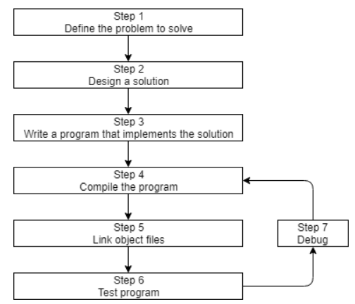
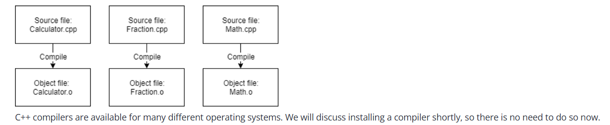

# 0.5 — Introduction to the Compiler, Linker, and Libraries


Continuing our discussion of this diagram from the previous lesson (**0.4 -- Introduction to C++ development**):

---

## The Software Development Process

Let’s discuss steps 




### Step 4: Compiling Your Source Code

To compile C++ source code files, we use a **C++ compiler**. The compiler sequentially processes each source code (`.cpp`) file and performs two key tasks:

1. **Syntax Checking**  
    The compiler checks your C++ code to ensure it follows the rules of the language. If errors are found, it reports them (with line numbers) and aborts compilation until fixed.

2. **Translation to Machine Code**  
    The compiler translates your C++ code into machine language instructions, storing them in an intermediate file called an **object file**. Object files also contain data needed by the linker (step 5) and for debugging (step 7).

> **Object files** are typically named `name.o` or `name.obj`, where `name` matches the original `.cpp` file.

**Example:**  
If your program has 3 `.cpp` files, the compiler generates 3 object files:

```
main.cpp   →   main.obj
utils.cpp  →   utils.obj
math.cpp   →   math.obj
```



> C++ compilers are available for many operating systems. We’ll discuss installation soon.

---

### Step 5: Linking Object Files and Libraries

After successful compilation, the **linker** combines all object files to produce the desired output file (e.g., an executable). This process is called **linking**.

#### Linking Steps

1. **Read Object Files**  
    The linker reads each object file generated by the compiler and checks validity.

2. **Resolve Dependencies**  
    The linker ensures all cross-file dependencies are resolved. For example, if something is defined in one `.cpp` file and used in another, the linker connects them. Unresolved references cause linker errors.

3. **Link Libraries**  
    The linker typically links in one or more **library files**—collections of precompiled code packaged for reuse.

4. **Output File Creation**  
    The linker produces the final output file, usually an executable, but it could be a library file depending on your project setup.

---


### The Standard Library

The **standard library** provides a set of precompiled, reusable code that can be linked into your programs to extend functionality.

---

> **Summary:**  
> - The **compiler** checks and translates your code into object files.  
> - The **linker** combines object files and libraries to create the final output.


---

## 2.1 — Introduction to Functions

**Alex &nbsp;&nbsp; September 28, 2024**

In the last chapter, we defined a function as a collection of statements that execute sequentially. Let’s update our definition:  
A **function** is a reusable sequence of statements designed to do a particular job.

You already know that every executable program must have a function named `main()` (where execution starts). As programs grow, putting all code inside `main()` becomes hard to manage. Functions let us split programs into small, modular chunks that are easier to organize, test, and reuse. Most programs use many functions. The C++ standard library provides many built-in functions, but you’ll often write your own—called **user-defined functions**.

### Functions in Action

Consider this analogy:  
You’re reading a book and remember you need to make a phone call. You put a bookmark in your book, make the call, and then return to the bookmark to continue reading.

C++ programs work similarly. When a function call is encountered, the CPU “bookmarks” the current location, executes the called function, and then returns to the bookmark to resume execution.

#### Nomenclature

- **Caller**: The function initiating the call.
- **Callee**: The function being called.
- **Invocation**: Another term for a function call.

---

### Defining and Calling Functions

The basic syntax for a user-defined function:

```cpp
returnType functionName() // Function header
{
    // Function body
}
```

- **Function header**: Tells the compiler about the function’s existence, name, and return type.
- **Function body**: Contains the statements that define what the function does.

To call a function, use its name followed by parentheses:

```cpp
functionName();
```

> **Note:**  
> A function must be defined before it can be called (we’ll discuss workarounds in lesson 2.7).

#### Example: Defining and Calling a Function

```cpp
#include <iostream> // for std::cout

void doPrint()
{
    std::cout << "In doPrint()\n";
}

int main()
{
    std::cout << "Starting main()\n";
    doPrint();                        // Call to doPrint()
    std::cout << "Ending main()\n";

    return 0;
}
```

**Output:**
```
Starting main()
In doPrint()
Ending main()
```

> **Warning:**  
> Don’t forget the parentheses when calling a function! Omitting them may cause compilation errors or prevent the function from being called.

---

### Calling Functions Multiple Times

Functions can be called as many times as needed:

```cpp
#include <iostream>

void doPrint()
{
    std::cout << "In doPrint()\n";
}

int main()
{
    std::cout << "Starting main()\n";
    doPrint(); // First call
    doPrint(); // Second call
    std::cout << "Ending main()\n";

    return 0;
}
```

**Output:**
```
Starting main()
In doPrint()
In doPrint()
Ending main()
```

---

### Functions Calling Other Functions

Functions can call other functions, creating a chain of calls:

```cpp
#include <iostream>

void doB()
{
    std::cout << "In doB()\n";
}

void doA()
{
    std::cout << "Starting doA()\n";
    doB();
    std::cout << "Ending doA()\n";
}

int main()
{
    std::cout << "Starting main()\n";
    doA();
    std::cout << "Ending main()\n";

    return 0;
}
```

**Output:**
```
Starting main()
Starting doA()
In doB()
Ending doA()
Ending main()
```

---

### Nested Functions Are Not Supported

C++ does **not** support nested function definitions:

```cpp
#include <iostream>

int main()
{
    void foo() // Illegal: nested inside main()
    {
        std::cout << "foo!\n";
    }

    foo();

    return 0;
}
```

**Correct way:**

```cpp
#include <iostream>

void foo()
{
    std::cout << "foo!\n";
}

int main()
{
    foo();

    return 0;
}
```

---

### Metasyntactic Variables

“foo” is a placeholder name often used for demonstration purposes. Other common placeholders include “bar”, “baz”, and words ending in “oo” (e.g., “goo”, “moo”, “boo”).  
For more on the etymology, see [RFC 3092](https://datatracker.ietf.org/doc/html/rfc3092).

---


## 2.2 — Function Return Values (Value-Returning Functions)

**Alex &nbsp;&nbsp; February 5, 2025**

Consider the following program:

```cpp
#include <iostream>

int main()
{
    // get a value from the user
    std::cout << "Enter an integer: ";
    int num{};
    std::cin >> num;

    // print the value doubled
    std::cout << num << " doubled is: " << num * 2 << '\n';

    return 0;
}
```

This program is composed of two conceptual parts:  
1. Get a value from the user.  
2. Tell the user what double that value is.

Although this program is simple, what if we wanted to break it into multiple functions? Getting an integer value from the user is a well-defined job, so it would make a good candidate for a function.

### Attempting to Modularize

```cpp
// This program doesn't work
#include <iostream>

void getValueFromUser()
{
    std::cout << "Enter an integer: ";
    int input{};
    std::cin >> input;
}

int main()
{
    getValueFromUser(); // Ask user for input

    int num{}; // How do we get the value from getValueFromUser() and use it to initialize this variable?

    std::cout << num << " doubled is: " << num * 2 << '\n';

    return 0;
}
```

When `getValueFromUser` is called, the user enters an integer, but the value is lost when the function terminates. Variable `num` is never initialized with the user's input, so the program always prints 0.

### Returning Values from Functions

To return a value from a function, two things are needed:
1. The function must specify a return type (not `void`).
2. The function must use a `return` statement to provide the value.

#### Example: Value-Returning Function

```cpp
#include <iostream>

// int is the return type
int returnFive()
{
    return 5; // return the value 5 back to the caller
}

int main()
{
    std::cout << returnFive() << '\n';      // prints 5
    std::cout << returnFive() + 2 << '\n';  // prints 7

    returnFive(); // value is returned but ignored

    return 0;
}
```

**Output:**
```
5
7
```

> **Tip:**  
> If the caller ignores the return value, it is discarded.

### Fixing the Challenge Program

```cpp
#include <iostream>

int getValueFromUser() // returns an integer value
{
    std::cout << "Enter an integer: ";
    int input{};
    std::cin >> input;

    return input; // return the value to the caller
}

int main()
{
    int num{ getValueFromUser() }; // initialize num with the return value

    std::cout << num << " doubled is: " << num * 2 << '\n';

    return 0;
}
```

Now, `num` is initialized with the user's input, and can be used as needed.

> **Tip:**  
> If you need to use the return value more than once, store it in a variable.

### Revisiting `main()`

- `main()` must return an `int`.
- Explicit calls to `main()` are disallowed.

```cpp
void foo()
{
    main(); // Compile error: main not allowed to be called explicitly
}

void main() // Compile error: main not allowed to have non-int return type
{
    foo();
}
```

> **Note:**  
> Some C++ compilers allow calling `main()` for C compatibility, but avoid doing so.

### Status Codes

The return value from `main()` is called a status code.  
- `0` or `EXIT_SUCCESS` means success.
- `EXIT_FAILURE` means failure.

```cpp
#include <cstdlib> // for EXIT_SUCCESS and EXIT_FAILURE

int main()
{
    return EXIT_SUCCESS;
}
```

> **Best practice:**  
> Return `0` or `EXIT_SUCCESS` for successful termination.

### Undefined Behavior: Not Returning a Value

A value-returning function must return a value. Otherwise, undefined behavior results.

```cpp
#include <iostream>

int getValueFromUserUB() // returns int
{
    std::cout << "Enter an integer: ";
    int input{};
    std::cin >> input;

    // no return statement
}

int main()
{
    int num{ getValueFromUserUB() }; // undefined behavior

    std::cout << num << " doubled is: " << num * 2 << '\n';

    return 0;
}
```

> **Best practice:**  
> Ensure all non-void functions return a value in all cases.

### Implicit Return from `main()`

If no return statement is provided in `main()`, it implicitly returns `0`.  
However, always explicitly return a value for clarity and consistency.

### Functions Can Only Return a Single Value

A function can only return one value per call.  
The return value can be a literal, a variable, or the result of another function call.

```cpp
// Return value is the integer entered by the user
int getValueFromUser()
{
    std::cout << "Enter an integer: ";
    int input{};
    std::cin >> input;

    return input;
}
```

### Reusing Functions

Consider this redundant program:

```cpp
#include <iostream>

int main()
{
    int x{};
    std::cout << "Enter an integer: ";
    std::cin >> x;

    int y{};
    std::cout << "Enter an integer: ";
    std::cin >> y;

    std::cout << x << " + " << y << " = " << x + y << '\n';

    return 0;
}
```

Let's refactor using `getValueFromUser`:

```cpp
#include <iostream>

int getValueFromUser()
{
    std::cout << "Enter an integer: ";
    int input{};
    std::cin >> input;

    return input;
}

int main()
{
    int x{ getValueFromUser() }; // first call
    int y{ getValueFromUser() }; // second call

    std::cout << x << " + " << y << " = " << x + y << '\n';

    return 0;
}
```

**Output:**
```
Enter an integer: 5
Enter an integer: 7
5 + 7 = 12
```

This saves us from duplicating code and reduces the chance of mistakes.

> **Best practice:**  
> Follow DRY: "Don't repeat yourself". Use variables, functions, and loops to minimize redundancy.

### Conclusion

- Return values allow functions to return a single value to the caller.
- Functions help minimize redundancy and improve modularity in programs.
- Always ensure value-returning functions return a value in all cases.
- Use functions to encapsulate reusable logic and follow DRY principles.


## 2.10 — Introduction to the Preprocessor

**Alex &nbsp;&nbsp; March 5, 2025**

When you compile your project, each code file first goes through a **preprocessing phase**. The preprocessor scans your code for **preprocessor directives** (lines starting with `#`) and performs text substitutions or conditional compilation before the compiler sees your code.

### What Does the Preprocessor Do?

- Removes comments and ensures files end with a newline.
- Handles `#include` directives by inserting the contents of included files.
- Processes macros and conditional compilation.

After preprocessing, the result is called a **translation unit**, which is then compiled.

---

### Preprocessor Directives

Preprocessor directives begin with `#` and end with a newline. They are not C++ statements and have their own syntax.

**Examples:**
- `#include <iostream>`
- `#define MY_NAME "Alex"`
- `#ifdef PRINT_JOE`
- `#ifndef PRINT_BOB`
- `#endif`

> **Note:**  
> The final code passed to the compiler contains no preprocessor directives—only their output.

---

### `#include` Directive

The `#include` directive copies the contents of a file (usually a header) into your code.

```cpp
#include <iostream>
```

This replaces the directive with the contents of the `iostream` header before compilation.

---

### Macros: `#define`

Macros allow you to define text substitutions.

**Object-like macros:**
```cpp
#define MY_NAME "Alex"
```
All instances of `MY_NAME` are replaced with `"Alex"`.

**Object-like macros without substitution:**
```cpp
#define USE_YEN
```
This is used for conditional compilation.

> **Best practice:**  
> Macro names should be ALL_UPPERCASE with underscores.

---

### Conditional Compilation

Use conditional directives to include or exclude code:

```cpp
#define PRINT_JOE

int main()
{
#ifdef PRINT_JOE
    std::cout << "Joe\n";
#endif

#ifdef PRINT_BOB
    std::cout << "Bob\n";
#endif

    return 0;
}
```

- `#ifdef IDENTIFIER` — code is included if IDENTIFIER is defined.
- `#ifndef IDENTIFIER` — code is included if IDENTIFIER is NOT defined.

You can also use `#if defined(IDENTIFIER)` and `#if !defined(IDENTIFIER)`.

---

### Excluding Code: `#if 0`

Use `#if 0` to exclude blocks of code:

```cpp
int main()
{
    std::cout << "Joe\n";

#if 0
    std::cout << "Bob\n";
    std::cout << "Steve\n";
#endif

    return 0;
}
```

Change `#if 0` to `#if 1` to re-enable the code.

---

### Macro Substitution Scope

Macros are processed top-to-bottom in each file. They do not respect C++ scopes (e.g., functions). Macros defined in one file do not affect other files unless included.

**Example:**
```cpp
// Alex.h
#define MY_NAME "Alex"

// main.cpp
#include "Alex.h"
#include <iostream>

int main()
{
    std::cout << "My name is: " << MY_NAME << '\n';
    return 0;
}
```

---

### Summary

- The preprocessor handles directives before compilation.
- Use `#include` for headers, `#define` for macros, and conditional directives for selective compilation.
- Macros are global within a file and do not respect C++ scopes.
- Prefer modern C++ features over macros when possible.

---

## 4.12 — Introduction to Type Conversion and `static_cast`

**Alex &nbsp;&nbsp; March 3, 2025**

### Implicit Type Conversion

C++ automatically converts values between fundamental types when needed. This is called *implicit type conversion*. For example:

```cpp
#include <iostream>

void print(double x) // expects a double
{
    std::cout << x << '\n';
}

int main()
{
    print(5); // int 5 is implicitly converted to double 5.0
    return 0;
}
```

Output:
```
5
```
> Floating-point values with no fractional part print without decimals (e.g., 5.0 prints as 5).

Implicit conversion does not modify the original value or variable—it produces a new temporary value of the target type.

### Implicit Conversion Warnings

Some conversions may lose information, such as converting a `double` to an `int`:

```cpp
#include <iostream>

void print(int x)
{
    std::cout << x << '\n';
}

int main()
{
    print(5.5); // double 5.5 implicitly converted to int 5 (fractional part lost)
    return 0;
}
```

Output:
```
5
```
> The compiler will warn about possible data loss. Prefer brace initialization to catch unsafe conversions:

```cpp
int x{5.5}; // error: double to int not safe
```

### Explicit Type Conversion with `static_cast`

To explicitly convert between types, use `static_cast`:

```cpp
#include <iostream>

void print(int x)
{
    std::cout << x << '\n';
}

int main()
{
    print(static_cast<int>(5.5)); // explicit conversion, no warning
    return 0;
}
```

### Using `static_cast` to Convert `char` to `int`

```cpp
#include <iostream>

int main()
{
    char ch{97}; // ASCII for 'a'
    std::cout << ch << " has value " << static_cast<int>(ch) << '\n';
    return 0;
}
```

Output:
```
a has value 97
```

### Sign Conversions

You can convert between signed and unsigned types:

```cpp
#include <iostream>

int main()
{
    unsigned int u1{5};
    int s1{static_cast<int>(u1)};
    std::cout << s1 << '\n'; // prints 5

    int s2{5};
    unsigned int u2{static_cast<unsigned int>(s2)};
    std::cout << u2 << '\n'; // prints 5
    return 0;
}
```

If the value cannot be represented in the destination type, modulo wrapping occurs:

```cpp
#include <iostream>

int main()
{
    int s{-1};
    std::cout << static_cast<unsigned int>(s) << '\n'; // prints 4294967295

    unsigned int u{4294967295};
    std::cout << static_cast<int>(u) << '\n'; // prints -1 (C++20)
    return 0;
}
```

### `std::int8_t` and `std::uint8_t` Behave Like `char`

```cpp
#include <cstdint>
#include <iostream>

int main()
{
    std::int8_t myInt{65};
    std::cout << myInt << '\n'; // prints 'A' on most systems
    std::cout << static_cast<int>(myInt) << '\n'; // always prints 65
    return 0;
}
```

Input may also be affected:

```cpp
#include <cstdint>
#include <iostream>

int main()
{
    std::cout << "Enter a number between 0 and 127: ";
    std::int8_t myInt{};
    std::cin >> myInt;
    std::cout << "You entered: " << static_cast<int>(myInt) << '\n';
    return 0;
}
```

Sample run:
```
Enter a number between 0 and 127: 35
You entered: 51
```
> Input is interpreted as characters, not numbers.

### Summary

- Implicit conversions happen automatically, but may lose data.
- Use `static_cast` for explicit conversions and to suppress warnings.
- Some types (like `std::int8_t`) may behave unexpectedly due to being treated as `char`.
- Prefer brace initialization to catch unsafe conversions.
- Modulo wrapping occurs when converting values outside the destination type's range.


## 5.1 — Constant Variables (Named Constants)

**Alex &nbsp;&nbsp; October 17, 2024**

### Introduction to Constants

A constant is a value that cannot be changed during program execution. C++ supports two kinds of constants:

- **Named constants**: Associated with an identifier (symbolic constants).
- **Literal constants**: Not associated with an identifier.

This lesson covers named constants via constant variables. Object-like macros and enumerated constants are discussed elsewhere.

---

### Defining Constant Variables

A constant variable is a variable whose value cannot be changed after initialization. Use the `const` keyword to declare a constant variable:

```cpp
const double gravity { 9.8 };  // preferred style
int const sidesInSquare { 4 }; // "east const" style (less common)
```

**Best practice:**  
Place `const` before the type for readability.

---

### Initialization Requirement

Constant variables must be initialized when defined and cannot be assigned new values:

```cpp
int main()
{
    const double gravity; // error: must be initialized
    gravity = 9.9;        // error: cannot assign to const

    return 0;
}
```

You can initialize a const variable from another variable:

```cpp
#include <iostream>

int main()
{
    std::cout << "Enter your age: ";
    int age{};
    std::cin >> age;

    const int constAge { age }; // initialized from non-const

    age = 5;      // ok
    constAge = 6; // error

    return 0;
}
```

---

### Naming Conventions

Common conventions for const variable names:

- ALL_UPPERCASE (e.g., `EARTH_GRAVITY`)
- Intercapped with 'k' prefix (e.g., `kEarthGravity`)
- Regular variable naming (e.g., `earthGravity`)

**Best practice:**  
Use the same naming convention as for non-const variables.

---

### Const Function Parameters

Function parameters can be made const:

```cpp
#include <iostream>

void printInt(const int x)
{
    std::cout << x << '\n';
}

int main()
{
    printInt(5);
    printInt(6);

    return 0;
}
```

**Best practice:**  
Do not use `const` for value parameters.

---

### Const Return Values

You can declare a function's return value as const:

```cpp
#include <iostream>

const int getValue()
{
    return 5;
}

int main()
{
    std::cout << getValue() << '\n';
    return 0;
}
```

For fundamental types, the `const` qualifier on return values is ignored.

**Best practice:**  
Do not use `const` when returning by value.

---

### Why Use Constant Variables?

- Prevents accidental modification.
- Enables compiler optimizations.
- Reduces program complexity.

**Best practice:**  
Make variables constant whenever possible (except for value parameters and value return types).

---

### Object-like Macros as Named Constants

Macros can also define named constants:

```cpp
#include <iostream>
#define MY_NAME "Alex"

int main()
{
    std::cout << "My name is: " << MY_NAME << '\n';
    return 0;
}
```

---

### Prefer Constant Variables Over Macros

Macros do not follow C++ scoping rules and can cause unexpected substitutions and errors:

```cpp
#include <iostream>

void someFcn()
{
    #define gravity 9.8
}

void printGravity(double gravity)
{
    std::cout << "gravity: " << gravity << '\n';
}

int main()
{
    printGravity(3.71);
    return 0;
}
```

**Best practice:**  
Prefer constant variables over macros for named constants.

---

### Sharing Constants Across Multiple Files

For global constants used throughout a program, declare them in a central location. See lesson 7.10 for details.

---

### Type Qualifiers

A type qualifier modifies how a type behaves. C++ has two: `const` and `volatile`.

- **cv-unqualified type**: No qualifiers (e.g., `int`)
- **cv-qualified type**: With qualifiers (e.g., `const int`)

---

**Joke:**  
Q: How do you know if a C++ developer is qualified?  
A: You look at their CV.


## 7.2 — User-defined namespaces and the scope resolution operator

**Alex &nbsp;&nbsp; June 28, 2024**

Namespaces help prevent naming collisions by grouping identifiers into named scopes. As projects grow, the risk of collisions increases, so using namespaces is essential for modular code.

### Defining a Namespace

Use the `namespace` keyword followed by an identifier and curly braces:

```cpp
namespace MyNamespace
{
    int value{ 42 };
    void printValue()
    {
        std::cout << value << '\n';
    }
}
```

### Accessing Namespace Members

Use the scope resolution operator `::` to access members:

```cpp
std::cout << MyNamespace::value << '\n';
MyNamespace::printValue();
```

### Example: Resolving Naming Collisions

Suppose two files define functions with the same name:

```cpp
namespace Foo
{
    int doSomething(int x, int y) { return x + y; }
}

namespace Goo
{
    int doSomething(int x, int y) { return x - y; }
}

int main()
{
    std::cout << Foo::doSomething(4, 3) << '\n'; // 7
    std::cout << Goo::doSomething(4, 3) << '\n'; // 1
    return 0;
}
```

### Scope Resolution Operator with Global Namespace

Prefixing with `::` accesses the global namespace:

```cpp
void print() { std::cout << "Global\n"; }

namespace Foo
{
    void print() { std::cout << "Foo\n"; }
    void callPrints()
    {
        print();    // Foo::print()
        ::print();  // global print()
    }
}
```

### Forward Declarations in Namespaces

Forward declarations must be inside the same namespace:

```cpp
// add.h
namespace Math
{
    int add(int x, int y);
}

// add.cpp
namespace Math
{
    int add(int x, int y) { return x + y; }
}
```

### Multiple Namespace Blocks

You can extend a namespace in multiple places/files:

```cpp
namespace Math
{
    constexpr double pi{ 3.14159 };
}

namespace Math
{
    constexpr double e{ 2.71828 };
}
```

### Nested Namespaces

Namespaces can be nested:

```cpp
namespace Company
{
    namespace Project
    {
        void run();
    }
}

// C++17 style
namespace Company::Project
{
    void run() { /* ... */ }
}
```

### Namespace Aliases

Shorten long namespace names:

```cpp
namespace LongName::SubName
{
    void func();
}

namespace LN = LongName::SubName;

LN::func(); // calls LongName::SubName::func()
```

### Best Practices

- Use namespaces to avoid naming collisions.
- Prefer capitalized namespace names for user-defined namespaces.
- Avoid extending the `std` namespace.
- Limit nesting to three levels or fewer.
- Namespace library code for distribution.

---

## 7.3 — Local variables

**Alex &nbsp;&nbsp; June 9, 2024**

In lesson 2.5 -- Introduction to local scope, we introduced local variables, which are variables that are defined inside a function (including function parameters).

It turns out that C++ actually doesn’t have a single attribute that defines a variable as being a local variable. Instead, local variables have several different properties that differentiate how these variables behave from other kinds of (non-local) variables. We’ll explore these properties in this and upcoming lessons.

### Scope of Local Variables

An identifier’s scope determines where it can be accessed within the source code. When an identifier can be accessed, it is *in scope*. When it cannot, it is *out of scope*. Scope is a compile-time property, and using an identifier out of scope causes a compile error.

Local variables have **block scope**: they are in scope from their point of definition to the end of the block in which they are defined.

```cpp
int main()
{
    int i { 5 };      // i enters scope here
    double d { 4.0 }; // d enters scope here

    return 0;
} // d and i go out of scope here
```

Function parameters are also considered part of the function body block's scope:

```cpp
int max(int x, int y) // x and y enter scope here
{
    int max{ (x > y) ? x : y }; // max enters scope here
    return max;
} // max, y, and x leave scope here
```

### Unique Names Within Scope

Variable names must be unique within a given scope:

```cpp
void someFunction(int x)
{
    int x{}; // error: name collision with function parameter
}
```

### Automatic Storage Duration

Local variables have **automatic storage duration**: they are created at the point of definition and destroyed at the end of the block.

```cpp
int main()
{
    int i { 5 };      // created and initialized here
    double d { 4.0 }; // created and initialized here

    return 0;
} // destroyed here
```

Local variables are sometimes called *automatic variables*.

### Local Variables in Nested Blocks

Local variables can be defined inside nested blocks:

```cpp
int main()
{
    int x { 5 }; // x enters scope and is created here

    { // nested block
        int y { 7 }; // y enters scope and is created here
        std::cout << x << " + " << y << " = " << x + y << '\n';
    } // y goes out of scope and is destroyed here

    // y cannot be used here

    return 0;
} // x goes out of scope and is destroyed here
```

Variables defined in the outer block are visible inside nested blocks.

### No Linkage for Local Variables

Local variables have **no linkage**: each declaration refers to a unique object.

```cpp
int main()
{
    int x { 2 }; // local variable, no linkage

    {
        int x { 3 }; // refers to a different object than the previous x
    }

    return 0;
}
```

Scope determines where a single identifier can be used; linkage determines whether multiple declarations refer to the same object.

### Define Variables in the Most Limited Scope

If a variable is only used within a nested block, define it inside that block:

```cpp
int main()
{
    {
        int y { 5 };
        std::cout << y << '\n';
    }
    // y cannot be used here

    return 0;
}
```

If a variable is needed in an outer block, declare it there:

```cpp
int main()
{
    int y { 5 };

    {
        int x{};
        std::cin >> x;
        if (x == 4)
            y = 4;
    }

    std::cout << y;

    return 0;
}
```

### Best Practice

Define variables in the most limited existing scope. Avoid creating new blocks solely to limit variable scope; consider using functions instead.


## 7.4 — Introduction to global variables

**Alex &nbsp;&nbsp; June 9, 2024**

In lesson 7.3 -- Local variables, we covered that local variables are variables defined inside a function body. Local variables have block scope (are only visible within the block they are declared in), and have automatic duration (they are created at the point of definition and destroyed when the block is exited).

### Declaring global variables

In C++, variables can also be declared outside of a function. Such variables are called **global variables**. By convention, global variables are declared at the top of a file, below the includes, in the global namespace.

```cpp
#include <iostream>

// Variables declared outside of a function are global variables
int g_x {}; // global variable g_x

void doSomething()
{
    // global variables can be seen and used everywhere in the file
    g_x = 3;
    std::cout << g_x << '\n';
}

int main()
{
    doSomething();
    std::cout << g_x << '\n';

    // global variables can be seen and used everywhere in the file
    g_x = 5;
    std::cout << g_x << '\n';

    return 0;
}
// g_x goes out of scope here
```

**Output:**
```
3
3
5
```

### The scope of global variables

Identifiers declared in the global namespace have **global namespace scope** (commonly called global scope, and sometimes informally called file scope), which means they are visible from the point of declaration until the end of the file in which they are declared.

Once declared, a global variable can be used anywhere in the file from that point onward. In the above example, global variable `g_x` is used in both functions `doSomething()` and `main()`.

Global variables can also be defined inside a user-defined namespace. Here is the same example as above, but `g_x` has been moved from the global scope into user-defined namespace `Foo`:

```cpp
#include <iostream>

namespace Foo // Foo is defined in the global scope
{
    int g_x {}; // g_x is now inside the Foo namespace, but is still a global variable
}

void doSomething()
{
    // global variables can be seen and used everywhere in the file
    Foo::g_x = 3;
    std::cout << Foo::g_x << '\n';
}

int main()
{
    doSomething();
    std::cout << Foo::g_x << '\n';

    // global variables can be seen and used everywhere in the file
    Foo::g_x = 5;
    std::cout << Foo::g_x << '\n';

    return 0;
}
```

Although the identifier `g_x` is now limited to the scope of namespace `Foo`, that name is still globally accessible (via `Foo::g_x`), and `g_x` is still a global variable.

> **Key insight:**  
> Variables declared inside a namespace are also global variables.

**Best practice:**  
Prefer defining global variables inside a namespace rather than in the global namespace.

### Global variables have static duration

Global variables are created when the program starts (before `main()` begins execution), and destroyed when it ends. This is called **static duration**. Variables with static duration are sometimes called *static variables*.

### Naming global variables

By convention, some developers prefix global variable identifiers with `g` or `g_` to indicate that they are global. This prefix serves several purposes:

- It helps avoid naming collisions with other identifiers in the global namespace.
- It helps prevent inadvertent name shadowing (see lesson 7.5).
- It helps indicate that the prefixed variables persist beyond the scope of the function, and thus any changes we make to them will also persist.

Global variables defined inside a user-defined namespace often omit the prefix (since the first two points above are not an issue in this case, and we can infer that a variable is a global when we see a prepended namespace name). However, it doesn’t hurt if you want to keep the prefix as a more visible reminder of the third point.

**Best practice:**  
Consider using a `g` or `g_` prefix when naming global variables (especially those defined in the global namespace), to help differentiate them from local variables and function parameters.

> **Author’s note:**  
> Using prefixes to represent the scope or duration of a variable (such as `g_` for global, `s_` for static, and `m_` for member) adds value and is not the same as Hungarian notation for types.

### Global variable initialization

Unlike local variables, which are uninitialized by default, variables with static duration are **zero-initialized by default**.

Non-constant global variables can be optionally initialized:

```cpp
int g_x;       // no explicit initializer (zero-initialized by default)
int g_y {};    // value initialized (resulting in zero-initialization)
int g_z { 1 }; // list initialized with specific value
```

### Constant global variables

Just like local variables, global variables can be constant. As with all constants, constant global variables must be initialized.

```cpp
#include <iostream>

const int g_x;     // error: constant variables must be initialized
constexpr int g_w; // error: constexpr variables must be initialized

const int g_y { 1 };     // const global variable g_y, initialized with a value
constexpr int g_z { 2 }; // constexpr global variable g_z, initialized with a value

void doSomething()
{
    // global variables can be seen and used everywhere in the file
    std::cout << g_y << '\n';
    std::cout << g_z << '\n';
}

int main()
{
    doSomething();

    // global variables can be seen and used everywhere in the file
    std::cout << g_y << '\n';
    std::cout << g_z << '\n';

    return 0;
}
// g_y and g_z go out of scope here
```

> See lesson 7.10 for sharing global constants across multiple files.

### A word of caution about (non-constant) global variables

New programmers are often tempted to use lots of global variables, because they can be used without having to explicitly pass them to every function that needs them. However, use of non-constant global variables should generally be avoided altogether! We’ll discuss why in lesson 7.8.

### Quick Summary

```cpp
// Non-constant global variables
int g_x;                 // defines non-initialized global variable (zero initialized by default)
int g_x {};              // defines explicitly value-initialized global variable
int g_x { 1 };           // defines explicitly initialized global variable

// Const global variables
const int g_y;           // error: const variables must be initialized
const int g_y { 2 };     // defines initialized global const

// Constexpr global variables
constexpr int g_y;       // error: constexpr variables must be initialized
constexpr int g_y { 3 }; // defines initialized global constexpr
```


> ## 🚨 VERY VERY IMPORTANT CONCEPT: Categories of "Specifiers" in C++
>
> **Specifiers** in C++ are keywords that *fundamentally* change how variables and functions behave. Understanding them is **critical** for mastering C++!
>
> ### 1. Storage Class Specifiers
> - **Purpose:** Control *linkage* and *storage duration* of variables.
> - **Examples:**  
>   `static`, `extern`, `mutable`, `thread_local`
>
> ### 2. Type Qualifiers (cv-qualifiers)
> - **Purpose:** Modify the *type* of an object, affecting mutability and access.
> - **Examples:**  
>   `const`, `volatile`, `restrict` (C only), `mutable` (special meaning in classes)
>
> ### 3. Function Specifiers
> - **Purpose:** Change *function behavior* and properties.
> - **Examples:**  
>   `inline`, `virtual`, `explicit`, `constexpr`, etc.
>
> ---
>
> **⚡ Mastery of these specifiers is ABSOLUTELY ESSENTIAL for understanding:**
> - Object lifetimes
> - Type safety
> - Function semantics
>
> <span style="color:red; font-weight:bold;">Do not skip this concept!</span>
## 7.6 — Internal Linkage

**Alex &nbsp;&nbsp; January 30, 2025**

---

### What is Internal Linkage?

Internal linkage restricts an identifier's visibility to a single translation unit (source file and its includes). Identifiers with internal linkage are **not accessible from other files**—even if they have the same name and type elsewhere.

> **Key Insight:**  
> Identifiers with internal linkage are either invisible to the linker or marked for use only in their translation unit.

---

### Internal Linkage for Global Variables

- **Non-constant globals**: Use `static` to give internal linkage.
- **const/constexpr globals**: Have internal linkage by default.

```cpp
#include <iostream>

static int g_x{};        // internal linkage via static
const int g_y{ 1 };      // internal linkage by default
constexpr int g_z{ 2 };  // internal linkage by default

int main()
{
    std::cout << g_x << ' ' << g_y << ' ' << g_z << '\n';
    return 0;
}
```

**Multiple files can have their own internal variables with the same name:**

**a.cpp**
```cpp
constexpr int g_x { 2 }; // only accessible in a.cpp
```

**main.cpp**
```cpp
#include <iostream>
static int g_x { 3 }; // only accessible in main.cpp

int main()
{
    std::cout << g_x << '\n'; // prints 3
    return 0;
}
```

---

### Why const Globals Have Internal Linkage

- **Const objects** can be used in constant expressions and propagated via header files.
- Internal linkage allows each translation unit to have its own definition, avoiding ODR (One Definition Rule) violations.
- Enables safe use of constants in headers included in multiple files.

---

### Internal Linkage for Functions

Functions default to **external linkage**, but can be made internal with `static`:

**add.cpp**
```cpp
static int add(int x, int y)
{
    return x + y;
}
```

**main.cpp**
```cpp
#include <iostream>
int add(int x, int y); // forward declaration

int main()
{
    std::cout << add(3, 4) << '\n'; // linker error: add is not accessible
    return 0;
}
```

---

### Modern C++: Prefer Unnamed Namespaces

- `static` for internal linkage is less common now.
- **Unnamed namespaces** provide internal linkage for more identifier types and are preferred for multiple internal items.

---

### When to Use Internal Linkage?

- To **hide identifiers** from other files (e.g., helper functions, private globals).
- To **avoid naming collisions** across translation units.

> **Best Practice:**  
> Give internal linkage to identifiers you explicitly want to keep private to a file.  
> Consider unnamed namespaces for broader internal linkage.

---

### Quick Summary

```cpp
// Internal global variables:
static int g_x;          // zero-initialized internal global
static int g_x{ 1 };     // initialized internal global

const int g_y { 2 };     // initialized internal global const
constexpr int g_y { 3 }; // initialized internal global constexpr

// Internal functions:
static int foo() {};     // internal function
```

---

> See lesson 7.12 for a comprehensive summary of scope, duration, and linkage.


## 7.7 — External linkage and variable forward declarations

**Alex &nbsp;&nbsp; December 11, 2024**

In the prior lesson, we discussed internal linkage, which restricts an identifier's visibility to a single file. Now, let's explore **external linkage**.

### What is External Linkage?

Identifiers with external linkage can be accessed from multiple files in a program. This allows sharing functions and variables across translation units.

> **Key Insight:**  
> Identifiers with external linkage are visible to the linker, enabling cross-file access and deduplication.

---

### Functions Have External Linkage by Default

Functions are externally linked unless marked otherwise. To use a function from another file, provide a **forward declaration** in the file where you want to use it.

**Example:**

**a.cpp**
```cpp
#include <iostream>

void sayHi()
{
    std::cout << "Hi!\n";
}
```

**main.cpp**
```cpp
void sayHi(); // forward declaration

int main()
{
    sayHi(); // linker connects this call to a.cpp's definition
    return 0;
}
```

Output:
```
Hi!
```

If `sayHi()` had internal linkage (`static`), the linker would not be able to connect the call, resulting in a linker error.

---

### Global Variables with External Linkage

Global variables are **external by default** (except for `const` and `constexpr`, which are internal unless marked `extern`). To use a global variable from another file, declare it with `extern` (without initialization) in the file where you want to use it.

**Example:**

**a.cpp**
```cpp
int g_x { 2 };              // non-const globals: external by default
extern const int g_y { 3 }; // const global: external linkage via extern
```

**main.cpp**
```cpp
#include <iostream>

extern int g_x;       // forward declaration
extern const int g_y; // forward declaration

int main()
{
    std::cout << g_x << ' ' << g_y << '\n'; // prints 2 3
    return 0;
}
```

---

### The `extern` Keyword

- For **non-const globals**, `extern` is used for forward declarations only.
- For **const/constexpr globals**, `extern` is required for external linkage and for forward declarations.

**Note:**  
Do not use `extern` with an initializer for non-const globals unless you intend a definition. Compilers may warn about suspicious usage.

---

### Forward Declaration Syntax

```cpp
// Non-constant
int g_x;        // definition
int g_x { 1 };  // definition with initializer
extern int g_x; // forward declaration

// Constant
extern const int g_y { 1 }; // definition (must be initialized)
extern const int g_y;       // forward declaration
```

---

### Limitations with `constexpr`

`constexpr` variables cannot be forward declared, as their value must be known at compile time. You can forward declare a `constexpr` as `const`, but it will be treated as a runtime constant.

---

### Best Practices

- Use `extern` for global variable forward declarations and const global variable definitions.
- Do **not** use `extern` for non-const global variable definitions (they are implicitly external).
- Avoid using `extern` with initializers for non-const globals unless necessary.

---

### Quick Summary

```cpp
// Forward declarations (extern, no initializer):
extern int g_y;                 // non-const global
extern const int g_y;           // const global
extern constexpr int g_y;       // not allowed

// External global variable definitions:
int g_x;                        // non-initialized
int g_x { 1 };                  // initialized

// External const global variable definitions:
extern const int g_x { 2 };     // initialized const
extern constexpr int g_x { 3 }; // initialized constexpr
```

See lesson 7.12 for a comprehensive summary of scope, duration, and linkage.


## 7.8 — Why (non-const) global variables are evil

**Alex &nbsp;&nbsp; January 29, 2025**

---

> **"Avoid global variables!"**  
> — Every experienced C++ developer, ever

Global variables are one of the most abused features in C++. While they seem convenient in small programs, they become a source of bugs and confusion in larger projects. This lesson explains why **non-const global variables** are especially problematic.

---

### The Dangers of Non-const Global Variables

Non-const global variables can be changed by any function, at any time, from anywhere in your program. This makes your program's state unpredictable and hard to reason about.

**Example: Unintended Modification**

```cpp
#include <iostream>

int g_mode; // global variable (zero-initialized)

void doSomething()
{
    g_mode = 2; // modifies global variable
}

int main()
{
    g_mode = 1; // sets global variable

    doSomething(); // changes g_mode unexpectedly

    if (g_mode == 1)
        std::cout << "No threat detected.\n";
    else
        std::cout << "Launching nuclear missiles...\n";

    return 0;
}
```

> **Result:**  
> The programmer expects `g_mode` to be `1`, but `doSomething()` changed it to `2`.  
> The program's behavior is now unpredictable!

---

### Why Are Global Variables Problematic?

- **Unpredictable State:** Any function can change a global variable, making it hard to track changes.
- **Difficult Debugging:** You may need to search the entire codebase to find where a global variable is modified.
- **Reduced Modularity:** Functions that rely on globals are less reusable and harder to test.
- **Initialization Order Issues:** The order in which global variables are initialized (especially across files) is not guaranteed.

---

### The Static Initialization Order Fiasco

Global variables are initialized before `main()` runs, but the order is not always clear—especially across multiple files.

**Example: Ambiguous Initialization**

```cpp
#include <iostream>

int initX();
int initY();

int g_x{ initX() }; // g_x initialized first
int g_y{ initY() };

int initX() { return g_y; } // g_y not initialized yet!
int initY() { return 5; }

int main()
{
    std::cout << g_x << ' ' << g_y << '\n'; // prints: 0 5
}
```

> **Warning:**  
> Never initialize a global variable using another global variable from a different file.

---

### When Are Non-const Globals Acceptable?

Rarely! Only use a non-const global if:
- There should only ever be **one** instance of the thing it represents.
- Its use is **ubiquitous** throughout your program.

**Examples:**  
- Logging objects  
- Random number generators  
- `std::cout` and `std::cin` (implemented as globals in the standard library)

---

### Best Practices for Global Variables

1. **Prefer Local Variables:** Use local variables and pass them as function arguments.
2. **Namespace Your Globals:** Place globals inside a namespace to avoid collisions.

    ```cpp
    namespace constants
    {
        constexpr double gravity { 9.8 };
    }
    std::cout << constants::gravity << '\n';
    ```

3. **Encapsulate Access:** Make globals `static` or `const` and provide access functions.

    ```cpp
    namespace constants
    {
        constexpr double gravity { 9.8 };
    }
    double getGravity() { return constants::gravity; }
    ```

4. **Pass as Arguments:** Write functions that accept values as parameters instead of using globals directly.

    ```cpp
    double instantVelocity(int time, double gravity)
    {
        return gravity * time;
    }
    std::cout << instantVelocity(5, constants::gravity) << '\n';
    ```

---

### A C++ Joke

> **Q:** What's the best naming prefix for a global variable?  
> **A:** `//`  
> *Because every global deserves a comment!*

---

**Summary:**

- Non-const global variables make code unpredictable and hard to maintain.
- Prefer local variables, namespaces, encapsulation, and parameter passing.
- Only use non-const globals when absolutely necessary—and document them well!
## 7.9 — How to use global constants safely and effectively

**Alex &nbsp;&nbsp; January 30, 2025**

---

Global constants are a powerful tool for sharing immutable values across multiple files in a project. Used correctly, they improve code clarity, maintainability, and safety. This lesson covers best practices for defining, sharing, and using global constants in C++.

---

### Why Use Global Constants?

- **Consistency:** Ensures the same value is used everywhere.
- **Maintainability:** Changing the constant in one place updates all usages.
- **Safety:** Prevents accidental modification.

---

### Defining Global Constants

Prefer `constexpr` for compile-time constants, and `const` for runtime constants. Place global constants inside a namespace to avoid naming collisions.

**Example:**

```cpp
// constants.h
#pragma once

namespace constants
{
    constexpr double gravity { 9.8 };
    constexpr int maxPlayers { 4 };
}
```

---

### Sharing Global Constants Across Multiple Files

1. **Declare constants in a header file** (e.g., `constants.h`).
2. **Include the header** wherever the constants are needed.

**Example usage:**

```cpp
// main.cpp
#include <iostream>
#include "constants.h"

int main()
{
    std::cout << "Gravity is " << constants::gravity << '\n';
    std::cout << "Max players: " << constants::maxPlayers << '\n';
    return 0;
}
```

---

### Best Practices

- **Use namespaces** for all global constants.
- **Prefer `constexpr`** for values known at compile time.
- **Avoid macros** for constants; use typed variables instead.
- **Never use non-const globals for shared values.**
- **Document constants** clearly in the header file.

---

### Common Pitfalls

- **Multiple definitions:** Only define the constant once, in the header, using `constexpr` or `inline const` (C++17+).
- **Initialization order:** Constants are safe; avoid using non-const globals.
- **Name collisions:** Namespaces prevent accidental overlap.

---

### Quick Reference

```cpp
// constants.h
namespace constants
{
    constexpr double pi { 3.141592653589793 };
    constexpr int screenWidth { 1024 };
    constexpr int screenHeight { 768 };
}
```

---

**Summary:**

- Use global constants for shared, immutable values.
- Place them in a namespace and a header file.
- Prefer `constexpr` and avoid macros.
- Never use non-const global variables for shared data.

---

---
## 7.11 — Static Local Variables

**Alex &nbsp;&nbsp; December 26, 2024**

The term `static` is one of the most confusing in C++, because it has different meanings depending on context. Previously, we learned that global variables have *static duration* (created at program start, destroyed at program end), and that `static` gives global identifiers *internal linkage* (visible only in their file).

This lesson explores the use of `static` for **local variables**.

---

### Static Local Variables

By default, local variables have *automatic duration*: they are created when the block is entered and destroyed when the block is exited.

Using the `static` keyword on a local variable changes its duration to *static duration*. This means the variable is created at program start and destroyed at program end—just like a global variable. The variable retains its value between function calls.

#### Example: Automatic Duration

```cpp
#include <iostream>

void incrementAndPrint()
{
    int value{ 1 }; // automatic duration
    ++value;
    std::cout << value << '\n';
} // value is destroyed here

int main()
{
    incrementAndPrint();
    incrementAndPrint();
    incrementAndPrint();
    return 0;
}
```

**Output:**
```
2
2
2
```

Each call creates a new `value`, increments it, prints 2, then destroys it.

#### Example: Static Duration

```cpp
#include <iostream>

void incrementAndPrint()
{
    static int s_value{ 1 }; // static duration
    ++s_value;
    std::cout << s_value << '\n';
} // s_value is not destroyed here

int main()
{
    incrementAndPrint();
    incrementAndPrint();
    incrementAndPrint();
    return 0;
}
```

**Output:**
```
2
3
4
```

`s_value` is created once at program start, and its value persists across calls.

---

### Initialization Details

- Static local variables with a constexpr initializer are initialized at program start.
- If no initializer or a non-constexpr initializer is provided, they are zero-initialized at program start, and then initialized the first time the definition is encountered.
- Initialization only happens once.

**Best practice:**  
Always initialize static local variables.

**Tip:**  
Prefix static local variables with `s_` (e.g., `s_value`) for clarity.

---

### Use Case: Unique ID Generation

Static local variables are ideal for generating unique IDs:

```cpp
int generateID()
{
    static int s_itemID{ 0 };
    return s_itemID++; // returns current value, then increments
}
```

Each call returns a unique number. The variable is local (not accessible elsewhere), but persists for the program's lifetime.

---

### Scope and Lifetime

- **Scope:** Block scope (only accessible in the function/block).
- **Lifetime:** Static duration (exists until program ends).

Static local variables combine the safety of local scope with the persistence of global variables.

---

### Static Local Constants

Static local variables can be `const` or `constexpr`. This is useful for expensive initialization:

```cpp
const static int s_expensiveValue{ expensiveCalculation() };
```

The value is computed once and reused on every function call.

---

### Pitfall: Using Static Locals to Alter Flow

Static local variables can make functions non-reusable and unpredictable if used to alter control flow:

```cpp
#include <iostream>

int getInteger()
{
    static bool s_isFirstCall{ true };

    if (s_isFirstCall)
    {
        std::cout << "Enter an integer: ";
        s_isFirstCall = false;
    }
    else
    {
        std::cout << "Enter another integer: ";
    }

    int i{};
    std::cin >> i;
    return i;
}
```

If you call `getInteger()` multiple times, the prompt changes after the first call. This internal state makes the function hard to reuse and understand.

**Better approach:** Pass state as a parameter:

```cpp
constexpr bool g_firstCall{ true };

int getInteger(bool bFirstCall)
{
    if (bFirstCall)
        std::cout << "Enter an integer: ";
    else
        std::cout << "Enter another integer: ";

    int i{};
    std::cin >> i;
    return i;
}
```

Now, the caller controls the prompt, making the function reusable.

---

### Summary and Best Practices

- Use static local variables for values that must persist across function calls and are unique for the program's lifetime.
- Prefer `const` static locals for expensive initialization.
- Avoid non-const static locals for altering control flow or when the variable should be resettable.
- Consider passing state as a parameter for reusable functions.
- Prefix static locals with `s_` for clarity.

**Advanced:**  
For multiple independent persistent values (e.g., multiple ID generators), consider using functors or classes.

---


---

## 7.12 — Summary: Scope, Duration, Linkage, and Storage Class Specifiers

**Alex &nbsp;&nbsp; January 31, 2025**

This section summarizes the most important concepts for understanding how variables and functions behave in C++: **scope**, **duration**, **linkage**, and **storage class specifiers**.

---

### 1. Scope

- **Scope** determines where an identifier can be accessed in source code.
    - **Block (local) scope:** Exists only within the `{}` block where declared.
    - **Global scope:** Exists from its declaration to the end of the file (and possibly in other files, depending on linkage).

**Example:**
```cpp
#include <iostream>

int g_var { 10 }; // global scope

void foo()
{
    int x { 5 }; // block scope
    std::cout << x << '\n';     // accessible
    std::cout << g_var << '\n'; // accessible
}

int main()
{
    foo();
    // std::cout << x; // error: x is out of scope
}
```

**Rule of thumb:**  
Local variables vanish after their block ends.  
Globals exist throughout the file, unless linkage restricts them.

---

### 2. Duration

- **Duration** is when a variable is created and destroyed (its lifetime).
    - **Automatic duration:** Created when definition is reached; destroyed when block ends (default for locals and parameters).
    - **Static duration:** Created when the program starts; destroyed when the program ends (globals and static locals).
    - **Dynamic duration:** Created and destroyed manually (with `new`/`delete`).

**Example:**
```cpp
void test() {
    int x{5}; // automatic duration
} // destroyed here

void counter() {
    static int s_val{0}; // static duration
    ++s_val;
    std::cout << s_val << '\n';
}

int* ptr = new int(42); // dynamic duration
delete ptr; // must explicitly destroy
```

**Rule of thumb:**  
Automatic = temporary  
Static = whole program  
Dynamic = you manage

---

### 3. Linkage

- **Linkage** determines if an identifier can be shared across files.
    - **No linkage:** Unique each time declared (locals, block enums/classes).
    - **Internal linkage:** Shared only within one translation unit (file). (`static` globals, `const` globals, `static` functions)
    - **External linkage:** Shared across multiple files. (non-const globals, non-static functions, `extern` variables)

**Example:**
```cpp
// No linkage
void foo() {
    int x{5}; // unique to this function
}

// Internal linkage
static int g_val { 10 }; // only visible in this file
const int g_const { 20 }; // also internal by default

// External linkage
// globals.cpp
int g_val { 10 }; // definition

// main.cpp
extern int g_val; // forward declaration
```

**Rule of thumb:**  
Local vars: no linkage.  
Globals: internal by default if const or static, external otherwise.

---

### 4. Storage Class Specifiers

- **Keywords that affect duration and linkage:**
    - `static` → static duration + internal linkage
    - `extern` → static duration + external linkage
    - `thread_local` → one variable per thread
    - `mutable` → allows modification in const objects

---

### 5. Summary Table

| Type                  | Example                   | Scope   | Duration   | Linkage   |
|-----------------------|--------------------------|---------|------------|-----------|
| Local variable        | `int x;`                 | Block   | Automatic  | None      |
| Static local          | `static int s_x;`        | Block   | Static     | None      |
| Dynamic local         | `int* p{new int};`       | Block   | Dynamic    | None      |
| Function param        | `void f(int x);`         | Block   | Automatic  | None      |
| Internal global       | `static int g_x;`        | Global  | Static     | Internal  |
| External global       | `int g_x;`               | Global  | Static     | External  |
| Inline global (C++17) | `inline int g_x;`        | Global  | Static     | External  |
| Constexpr global      | `constexpr int g_x{1};`  | Global  | Static     | Internal  |
| Extern const          | `extern const int g_x;`  | Global  | Static     | External  |

---

### 🚀 Best Practices

- Prefer locals over globals (minimize scope).
- Use `const`/`constexpr` wherever possible.
- Use static locals only when remembering state is intentional.
- Use `extern` only when you really need cross-file globals.

---


## 10.1 — Implicit type conversion

**Alex &nbsp;&nbsp; March 3, 2025**

We introduced type conversion in lesson 4.12 -- Introduction to type conversion and `static_cast`. Here are the key points:

- **Type conversion** is the process of converting data from one type to another.
- **Implicit type conversion** is performed automatically by the compiler when a value of one type is used where another type is expected.
- **Explicit type conversion** is requested by using a cast operator, such as `static_cast`.
- Conversions do not change the original data; instead, a temporary object of the target type is created.

### Why conversions are needed

Different data types store and interpret values differently. For example, the integer value `3` and the floating-point value `3.0` have different binary representations. When assigning an `int` to a `float`, the compiler must convert the value, not just copy the bits.

**Example:**
```cpp
float f{ 3 }; // int 3 is implicitly converted to float 3.0
```

If you copy the bits directly:
```cpp
#include <iostream>
#include <cstring>

int main()
{
    int n { 3 };
    float f {};
    std::memcpy(&f, &n, sizeof(float));
    std::cout << f << '\n'; // prints 4.2039e-45 (not 3.0)
    return 0;
}
```

### When implicit type conversion happens

Implicit conversion occurs in many situations:
- Initializing or assigning a variable:
    ```cpp
    double d{ 3 }; // int to double
    d = 6;         // int to double
    ```
- Returning a value from a function:
    ```cpp
    float doSomething() { return 3.0; } // double to float
    ```
- Using binary operators with mixed types:
    ```cpp
    double division{ 4.0 / 3 }; // int to double
    ```
- Using non-Boolean values in conditions:
    ```cpp
    if (5) // int to bool
    ```
- Passing arguments to functions:
    ```cpp
    void doSomething(long l) {}
    doSomething(3); // int to long
    ```

### The standard conversions

C++ defines a set of "standard conversions" for fundamental types and some compound types. As of C++23, there are 14 standard conversions, grouped into categories:

| Category                | Description                                               | See Lesson                |
|-------------------------|----------------------------------------------------------|---------------------------|
| Numeric promotions      | Small integral types to int/unsigned, float to double    | 10.2                      |
| Numeric conversions     | Other integral/floating conversions                      | 10.3                      |
| Qualification conversions | Add/remove `const` or `volatile`                      |                           |
| Value transformations   | Change value category (lvalue/rvalue, array/function decay) | 12.2, 17.8, 20.1        |
| Pointer conversions     | `nullptr` to pointer, pointer type conversions           |                           |

**Full list of standard conversions:**
- Lvalue-to-rvalue
- Array-to-pointer
- Function-to-pointer
- Temporary materialization
- Qualification conversion
- Integral promotions
- Floating point promotions
- Integral conversions
- Floating point conversions
- Integral-floating conversions
- Boolean conversions
- Pointer conversions
- Pointer-to-member conversions
- Function pointer conversions

### Type conversion can fail

If the compiler cannot find a valid conversion, compilation fails.

**Example:**
```cpp
int x { "14" }; // error: cannot convert string literal to int
```

Some conversions are disallowed by specific features:
```cpp
int x { 3.5 }; // error: narrowing conversion disallowed by brace-initialization
```

Ambiguous conversions can also cause errors (see lesson 11.3).

### Summary

- Implicit conversions happen automatically when needed.
- The compiler uses standard conversion rules for fundamental types.
- If no valid conversion exists, compilation fails.
- Most conversions "just work," but be aware of narrowing and ambiguous cases.


## 10.2 — Floating-point and integral promotion

**Alex &nbsp;&nbsp; July 31, 2024**

C++ fundamental types have minimum size guarantees, but their actual size depends on the compiler and architecture. For performance, types like `int` and `double` are typically set to match the CPU's natural word size.

### What is Numeric Promotion?

Numeric promotion is the automatic conversion of certain narrower numeric types (like `char` or `float`) to wider types (`int` or `double`) for efficient processing. Promotions are always value-preserving (safe), so the compiler applies them freely and without warnings.

#### Why Numeric Promotion Matters

Numeric promotion lets you write functions that accept `int` or `double` parameters and call them with arguments of types that can be promoted, reducing code duplication.

### Floating-point Promotion

- `float` is promoted to `double`.

**Example:**
```cpp
#include <iostream>

void printDouble(double d)
{
    std::cout << d << '\n';
}

int main()
{
    printDouble(5.0);   // double, no promotion
    printDouble(4.0f);  // float promoted to double
    return 0;
}
```

### Integral Promotion

- `signed char` and `signed short` → `int`
- `unsigned char`, `char8_t`, and `unsigned short` → `int` (if `int` can hold all values), otherwise `unsigned int`
- `char` follows `signed char` or `unsigned char` rules depending on implementation
- `bool` → `int` (`false` becomes `0`, `true` becomes `1`)

**Example:**
```cpp
#include <iostream>

void printInt(int x)
{
    std::cout << x << '\n';
}

int main()
{
    printInt(2);

    short s{ 3 };
    printInt(s);      // short promoted to int

    printInt('a');    // char promoted to int
    printInt(true);   // bool promoted to int

    return 0;
}
```

> On some systems, unsigned types may be promoted to `unsigned int` instead of `int`. Promotions may change signedness but always preserve value.

### Not All Widening Conversions Are Promotions

Conversions like `char` to `short` or `int` to `long` are *numeric conversions*, not promotions. Promotions specifically help convert smaller types to the CPU's natural size for efficiency.

> The distinction matters for function overload resolution (see lesson 11.3).

### Summary

- Numeric promotions convert narrow types to wider types (`float` → `double`, small integrals → `int`/`unsigned int`).
- Promotions are safe and automatic.
- Not all widening conversions are promotions; some are conversions.
- Numeric promotion simplifies code and improves portability.

## 10.3 — Numeric conversions

**Alex &nbsp;&nbsp; August 20, 2024**

In lesson 10.2, we covered numeric promotions—automatic, value-preserving conversions to `int` or `double`. Numeric conversions are a broader category, covering all other conversions between fundamental numeric types.

### Categories of Numeric Conversions

1. **Integral to integral** (excluding promotions):
    ```cpp
    short s = 3;         // int to short
    long l = 3;          // int to long
    char ch = s;         // short to char
    unsigned int u = 3;  // int to unsigned int
    ```
2. **Floating-point to floating-point** (excluding promotions):
    ```cpp
    float f = 3.0;           // double to float
    long double ld = 3.0;    // double to long double
    ```
3. **Floating-point to integral**:
    ```cpp
    int i = 3.5; // double to int (fractional part lost)
    ```
4. **Integral to floating-point**:
    ```cpp
    double d = 3; // int to double
    ```
5. **Integral or floating-point to bool**:
    ```cpp
    bool b1 = 3;   // int to bool
    bool b2 = 3.0; // double to bool
    ```

> **Note:**  
> Brace initialization (`int x{3.5};`) disallows narrowing conversions; copy initialization (`int x = 3.5;`) allows them.

---

### Safety of Numeric Conversions

- **Value-preserving conversions:**  
  Destination type can represent all source values (e.g., `int` to `long`, `short` to `double`).  
  ```cpp
  int n = 5;
  long l = n; // safe
  short s = 5;
  double d = s; // safe
  ```
  Converting back yields the original value.

- **Reinterpretive conversions:**  
  Signed/unsigned conversions may wrap values but do not lose data.  
  ```cpp
  int n2 = -5;
  unsigned int u2 = n2; // wraps to large unsigned value
  int n3 = static_cast<int>(static_cast<unsigned int>(-5)); // converts back to -5
  ```
  Use with caution—may produce unexpected results.

- **Lossy conversions:**  
  Data may be lost (e.g., fractional part, precision, overflow).  
  ```cpp
  int j = 3.5; // 3.5 → 3 (fraction lost)
  float g = 1.23456789; // precision lost
  ```
  Converting back does not restore the original value.

---

### Platform Considerations

Some conversions are only safe on certain architectures. For example, `int` to `double` is usually safe, but may be lossy if both are 8 bytes.

```cpp
std::cout << static_cast<long long>(static_cast<double>(10000000000000001LL)); // may lose digits
```

---

### Practical Guidelines

- **Overflow:** Assigning a value outside the destination type's range leads to undefined or implementation-defined behavior.
- **Precision loss:** Converting from a wider to a narrower floating-point type loses precision.
- **Fractional loss:** Converting floating-point to integral loses the fractional part.
- **Compiler warnings:** Most compilers warn about lossy conversions, but not always for signed/unsigned conversions.

---

### Summary

- Numeric conversions cover all fundamental type conversions not handled by promotions.
- Value-preserving conversions are safe; reinterpretive and lossy conversions are unsafe.
- Prefer explicit casts for unsafe conversions and be mindful of platform-specific behavior.
- The compiler will usually warn about dangerous conversions, except for signed/unsigned.


## 10.6 — Explicit type conversion (casting) and `static_cast`

**Alex &nbsp;&nbsp; March 4, 2025**

When you need to convert a value from one type to another in C++, you can use **explicit type conversion** (casting). This is especially useful when implicit conversion would not produce the desired result, such as when performing floating-point division with integer variables.

### C-style Casts

C-style casts use the syntax `(type)value` or `type(value)`. For example:

```cpp
int x { 10 };
int y { 4 };
std::cout << (double)x / y << '\n'; // C-style cast
std::cout << double(x) / y << '\n'; // function-style cast
```

**Drawbacks:**  
- C-style casts can perform multiple kinds of conversions (static, const, reinterpret), making code harder to read and maintain.
- They are discouraged in modern C++.

**Best practice:**  
Avoid C-style casts in favor of named casts.

### `static_cast`

The preferred way to perform most explicit conversions is with `static_cast`:

```cpp
int x { 10 };
int y { 4 };
std::cout << static_cast<double>(x) / y << '\n'; // prints 2.5
```

- `static_cast` provides compile-time type checking.
- It only allows safe conversions between related types.
- If the conversion is invalid, compilation fails.

**Example:**

```cpp
char c { 'a' };
std::cout << static_cast<int>(c) << '\n'; // prints 97
```

### Making Narrowing Conversions Explicit

If you need to perform a narrowing conversion (e.g., `int` to `char`), use `static_cast` to indicate intent:

```cpp
int i { 48 };
char ch { static_cast<char>(i) }; // explicit narrowing conversion
```

### Comparison: List Initialization vs. `static_cast`

- List initialization (`int{x}`) disallows narrowing conversions.
- `static_cast<int>(x)` allows explicit narrowing conversions.

**Example:**

```cpp
int x { 10 };
int y { 4 };
std::cout << double{x} / y << '\n'; // may fail on some platforms
std::cout << static_cast<double>(x) / y << '\n'; // always works
```

### Summary

- Prefer `static_cast` for explicit type conversions.
- Avoid C-style casts.
- Use explicit casts to clarify intent and suppress warnings about narrowing conversions.

---

## static_cast vs. dynamic_cast: Key Differences

Both `static_cast` and `dynamic_cast` can convert pointers/references between related classes, but they differ in safety and use cases:

| Feature                | `static_cast`                | `dynamic_cast`                   |
|------------------------|------------------------------|----------------------------------|
| When checked           | Compile-time only            | Runtime (uses RTTI)              |
| Works with             | Any related types            | Polymorphic classes (with `virtual`) |
| Invalid cast result    | Undefined behavior           | `nullptr` (pointer) / exception (reference) |
| Performance            | Fast (no runtime cost)       | Slower (runtime type check)      |
| Use case               | Safe upcasting, basic conversions | Safe downcasting when unsure    |

**static_cast**
- No runtime check; compiler trusts you.
- Use when you are certain of the object's type.
- Unsafe for downcasts if the type is not guaranteed.

**dynamic_cast**
- Performs runtime type checking.
- Only works with polymorphic types (at least one virtual function).
- Returns `nullptr` for invalid pointer casts, throws `std::bad_cast` for references.
- Use when you need safe downcasting and are unsure of the object's runtime type.

**Example:**
```cpp
class Base { public: virtual ~Base(){} };
class Derived : public Base {};

Base* b = new Base();

// Unsafe downcast: may cause undefined behavior
Derived* d1 = static_cast<Derived*>(b);

// Safe downcast: returns nullptr if b is not a Derived
Derived* d2 = dynamic_cast<Derived*>(b);
if (d2)
{
    // d2 is a valid Derived*
}
else
{
    // Cast failed
}
```

**Rule of thumb:**  
Use `static_cast` for safe upcasts or when you know the type.  
Use `dynamic_cast` for safe downcasts when the type may vary at runtime.
## 10.4 — Type deduction with `auto`

**Alex &nbsp;&nbsp; March 5, 2025**

Type deduction with `auto` lets the compiler automatically determine the type of a variable from its initializer, reducing redundancy and improving readability.

### Basic Usage

Instead of explicitly specifying the type:

```cpp
double d { 5.0 }; // d is double
int i { 3 };      // i is int
```

You can use `auto`:

```cpp
auto d { 5.0 }; // deduced as double
auto i { 3 };   // deduced as int
```

The compiler looks at the initializer and deduces the type.

### Rules of `auto` Deduction

- An initializer is required:
    ```cpp
    auto x; // error: cannot deduce type
    ```
- Works with expressions, function calls, literals, etc.:
    ```cpp
    auto sum = 1 + 2;          // int
    auto f   = 3.14f;          // float
    auto s   = add(5, 6);      // type of add’s return
    ```
- `const` is dropped unless explicitly specified:
    ```cpp
    const int a = 10;
    auto b = a;       // int (const dropped)
    const auto c = a; // const int
    ```
- String literals deduce to `const char*`, not `std::string`.

### Why Use `auto`?

- **Reduces redundancy:**  
  ```cpp
  std::vector<int>::iterator it = v.begin();
  auto it = v.begin(); // cleaner
  ```
- **Avoids mistakes with conversions:**  
  ```cpp
  std::string_view getStr();
  std::string s1 { getStr() }; // expensive conversion
  auto s2 { getStr() };        // keeps string_view
  ```
- **Always matches initializer type:**  
  Prevents subtle bugs when you forget the exact type.
- **Improves readability for complex types:**  
  ```cpp
  auto m = std::map<std::string, std::vector<int>>{};
  ```
- **Forces initialization:**  
  `auto x;` doesn’t compile, helping avoid uninitialized variables.

### Downsides of `auto`

- Can obscure the type:
    ```cpp
    auto x = 5;  // int
    auto y = 2;
    std::cout << x / y; // integer division (may want double)
    ```
- Type changes if initializer changes:
    ```cpp
    auto sum = add(5, 6) + gravity; // could be int today, double tomorrow
    ```

### Best Practices

**Use `auto` when:**
- The exact type doesn’t matter to the logic.
- The type is obvious from context.
- The type is long/complex (iterators, templates).

**Don’t use `auto` when:**
- You need a specific type regardless of the initializer.
- You want the code to clearly communicate the type.

**Summary:**  
`auto` reduces redundancy, avoids accidental conversions, improves readability for complex types, and prevents uninitialized variables. Use it when the type is obvious or unimportant, but prefer explicit types when clarity or precision matters.


## 11.1 — Introduction to Function Overloading

**Alex &nbsp;&nbsp; December 28, 2023**

Function overloading allows you to define multiple functions with the same name, as long as their parameter lists differ in type or number. This lets you write cleaner, more intuitive code without inventing unique names for similar operations.

### Why Overload Functions?

Suppose you want to add both integers and doubles:

```cpp
int add(int x, int y)
{
    return x + y;
}

double add(double x, double y)
{
    return x + y;
}
```

Both functions are named `add`, but the compiler can distinguish them by their parameter types.

### How Overload Resolution Works

When you call an overloaded function, the compiler selects the correct version based on the argument types:

```cpp
std::cout << add(1, 2);      // calls add(int, int)
std::cout << add(1.2, 3.4);  // calls add(double, double)
```

### Key Points

- Functions can be overloaded if their parameter lists are different.
- The compiler matches function calls to the correct overload using argument types.
- If overloads cannot be differentiated, or a call is ambiguous, compilation fails.

### Example

```cpp
#include <iostream>

int add(int x, int y)
{
    return x + y;
}

double add(double x, double y)
{
    return x + y;
}

int main()
{
    std::cout << add(1, 2) << '\n';      // 3
    std::cout << add(1.2, 3.4) << '\n';  // 4.6
    return 0;
}
```

### Best Practice

Use function overloading to simplify your code and reduce the number of function names you need to remember.

---

> **Next:**  
> Lesson 11.2 covers how overloaded functions are differentiated.  
> Lesson 11.3 explains how the compiler resolves calls to overloaded functions.

## 11.2 — How Overloaded Functions Are Differentiated

**Alex &nbsp;&nbsp; December 29, 2023**

C++ distinguishes overloaded functions by their **signature**—not by their return type. The signature includes:

- Function name
- Number of parameters
- Types of parameters
- (For member functions) qualifiers like `const`, `&`, `&&`

**Return type is NOT part of the signature.**

### Differentiating Overloads

| Property                | Used for Overload? | Notes                                 |
|-------------------------|--------------------|---------------------------------------|
| Name                    | Yes                | Must be the same                      |
| Number of parameters    | Yes                | Different count = different overloads |
| Parameter types         | Yes                | e.g., `int` vs `double`               |
| Typedef/alias changes   | No                 | Aliases don’t create new overloads    |
| `const` on value params | No                 | `int` vs `const int` is the same      |
| Return type             | No                 | Ignored for overload resolution       |
| Member qualifiers       | Yes (advanced)     | For class methods only                |

**Examples:**

```cpp
int add(int x, int y);        // two ints
int add(int x, int y, int z); // three ints
double add(double a, double b); // two doubles
```

All are valid overloads—different parameter lists.

**Aliased types don’t create new overloads:**

```cpp
typedef int Height;
void print(int value);
void print(Height value); // same as print(int)
```

**`const` on value parameters doesn’t count:**

```cpp
void print(int);
void print(const int); // same as print(int)
```

**But for pointers/references, `const` does matter:**

```cpp
void f(int&);
void f(const int&); // different overloads
```

**Ellipsis (`...`) is unique:**

```cpp
void foo(int x, int y);
void foo(int x, ...); // different overloads
```

### Why Return Type Is Ignored

You cannot overload only by return type:

```cpp
int getValue();
double getValue(); // ERROR
```

Because the compiler can’t tell which to call:

```cpp
getValue(); // ambiguous
```

Instead, use distinct names:

```cpp
int getIntValue();
double getDoubleValue();
```

### Function Signature

In C++, a function’s signature is:

- Name
- Number and types of parameters
- Member qualifiers (`const`, `&`, `&&` for methods)

Return type is **not** part of the signature.

### Name Mangling

Compilers generate unique internal names for each overload so the linker can distinguish them.

**Example:**

```cpp
int fcn();
int fcn(int);
```

May become:

- `__fcn_v` (no params)
- `__fcn_i` (int param)

(Actual mangling depends on compiler.)

---

**Summary:**

- Overloads differ by number and types of parameters.
- Typedefs, aliases, and `const` on value params don’t create new overloads.
- Return type is ignored.
- Member functions can differ by qualifiers.
- Name mangling ensures unique compiled functions.

---


## 11.3 — Function overload resolution and ambiguous matches

**Alex &nbsp;&nbsp; December 30, 2023**

When you call an overloaded function, the compiler tries to find the best match by applying conversions in a strict order. If more than one candidate is equally good at any step, the call is ambiguous and results in a compile error.

### Overload Resolution Steps

1. **Exact match (including trivial conversions)**
2. **Promotion** (integral promotions, float → double)
3. **Standard conversions** (widening/narrowing, pointer conversions)
4. **User-defined conversions** (conversion operators, converting constructors)
5. **Ellipsis (`...`)** (last resort)

At each step:
- If exactly one viable overload is found, it is chosen.
- If none, move to the next step.
- If multiple, the call is ambiguous.

---

### Step Details & Ambiguity

#### 1. Exact Match (Best)
Includes identical types, reference bindings, and trivial conversions (e.g., `int` to `const int&`).

**Example (ambiguous):**
```cpp
void foo(int);          // by value
void foo(const int&);   // by const-ref

int x = 1;
foo(x); // ambiguous: both are exact matches
```

#### 2. Promotion
Covers only certain promotions:
- Integral: `char`, `short`, `bool` → `int` (or `unsigned int`)
- Floating: `float` → `double`

**Example (unambiguous):**
```cpp
void foo(int);
void foo(double);

foo('a'); // char promoted to int → foo(int) chosen
```

#### 3. Standard Numeric Conversions
Covers conversions like `long`→`int`, `int`↔`double`, etc.

**Example (ambiguous):**
```cpp
void foo(int);
void foo(double);

foo(5L); // long can convert to int or double (both standard conversions) → ambiguous
```

Another example:
```cpp
void foo(unsigned int);
void foo(float);

foo(0); // int can convert to unsigned int or float → ambiguous
```

#### 4. User-defined Conversions
If no match so far, conversion operators or converting constructors are considered.

#### 5. Ellipsis (`...`)
Used only if nothing else matches.

---

### How the Compiler Chooses

For multiple arguments, the compiler compares conversion sequences parameter-by-parameter. A candidate is better if it is strictly better for at least one parameter and no worse for the others. If neither is better overall, the call is ambiguous.

**Example (resolved):**
```cpp
void print(char, int);    // prints 'a'
void print(char, double); // prints 'b'
void print(char, float);  // prints 'c'

print('x', 'a'); // 'a' (char) promoted to int, so print(char, int) is chosen
```

---

### Fixing Ambiguous Calls

- Add an overload that exactly matches the argument type.
- Cast the argument explicitly: `foo(static_cast<int>(5L))`.
- Use literal suffixes: `0u`, `5.0f`, `5L`.
- Change or remove conflicting overloads.
- Use templates or concepts for advanced control.

---

### Quick Reference

- **Order:** exact → promotion → standard conversions → user-defined → ellipsis
- **Ambiguity:** Multiple candidates in the same step = error
- **Promotions** are preferred over conversions
- **long** is not promoted to int (only standard conversion)

---

**Summary:**  
Overload resolution is strict and predictable. Ambiguity occurs when multiple overloads are equally good at the same step. Use explicit casts or overloads to resolve ambiguity.

/**
 * Advantages of Object-Oriented Programming (OOP) over other paradigms:
 *
 * 1. Encapsulation (Data Security):
 *    - Data is hidden inside classes and only accessible through methods.
 *    - Prevents accidental modification.
 *    - Example: private balance in a BankAccount class can’t be changed directly.
 *
 * 2. Reusability with Inheritance:
 *    - Enables creation of base classes and derived classes.
 *    - Saves time by avoiding code duplication.
 *    - Example: Car → ElectricCar, SportsCar.
 *
 * 3. Polymorphism (Flexibility):
 *    - Allows the same function name to have different behavior depending on the object.
 *    - Example: draw() method behaves differently for Circle and Square.
 *
 * 4. Abstraction (Hiding Implementation Details):
 *    - Users interact with functionality without knowing internal implementation.
 *    - Example: Using .sort() in C++ STL without knowing its internal algorithm.
 *
 * 5. Easier to Maintain & Scale:
 *    - Modular and organized code structure for large projects.
 *    - Teams can work on different classes independently.
 *
 * 6. Real-World Modeling:
 *    - Direct mapping to real-world entities, making design intuitive.
 *    - Example: Student, Teacher, Course objects in a University system.
 *
 * In summary, OOP makes programs modular, reusable, secure, and easier to maintain compared to procedural programming.
 */

## 14.1 — Introduction to object-oriented programming

**Alex &nbsp;&nbsp; September 15, 2023**

### Procedural programming

Back in lesson 1.3 -- Introduction to objects and variables, we defined an object in C++ as “a piece of memory that can be used to store values”. An object with a name is called a variable. Our C++ programs have consisted of sequential lists of instructions to the computer that define data (via objects) and operations performed on that data (via functions containing statements and expressions).

Up to now, we’ve been doing a type of programming called procedural programming. In procedural programming, the focus is on creating “procedures” (which in C++ are called functions) that implement our program logic. We pass data objects to these functions, those functions perform operations on the data, and then potentially return a result to be used by the caller.

In procedural programming, the functions and the data those functions operate on are separate entities. The programmer is responsible for combining the functions and the data together to produce the desired result. This leads to code that looks like this:

```cpp
eat(you, apple);
```

Now, take a look around you -- everywhere you look are objects: books and buildings and food and even you. Such objects have two major components to them:  
1. Some number of associated properties (e.g. weight, color, size, solidity, shape, etc…)  
2. Some number of behaviors that they can exhibit (e.g. being opened, making something else hot, etc…)  
These properties and behaviors are inseparable.

In programming, properties are represented by objects, and behaviors are represented by functions. And thus, procedural programming represents reality fairly poorly, as it separates properties (objects) and behaviors (functions).

---

### What is object-oriented programming?

In object-oriented programming (often abbreviated as OOP), the focus is on creating program-defined data types that contain both properties and a set of well-defined behaviors. The term “object” in OOP refers to the objects that we can instantiate from such types.

This leads to code that looks more like this:

```cpp
you.eat(apple);
```

This makes it clearer who the subject is (`you`), what behavior is being invoked (`eat()`), and what objects are accessories to that behavior (`apple`).

Because the properties and behaviors are no longer separate, objects are easier to modularize, which makes our programs easier to write and understand, and also provides a higher degree of code reusability. These objects also provide a more intuitive way to work with our data by allowing us to define how we interact with the objects, and how they interact with other objects.

We’ll discuss how to create such objects in the next lesson.

---

### A procedural vs OOP-like example

Here’s a short program written in a procedural programming style that prints the name and number of legs of an animal:

```cpp
#include <iostream>
#include <string_view>

enum AnimalType
{
    cat,
    dog,
    chicken,
};

constexpr std::string_view animalName(AnimalType type)
{
    switch (type)
    {
    case cat: return "cat";
    case dog: return "dog";
    case chicken: return "chicken";
    default:  return "";
    }
}

constexpr int numLegs(AnimalType type)
{
    switch (type)
    {
    case cat: return 4;
    case dog: return 4;
    case chicken: return 2;
    default:  return 0;
    }
}

int main()
{
    constexpr AnimalType animal{ cat };
    std::cout << "A " << animalName(animal) << " has " << numLegs(animal) << " legs\n";
    return 0;
}
```

While this works just fine, consider what happens when we want to update this program so that our animal is now a snake. To add a snake to our code, we’d need to modify `AnimalType`, `numLegs()`, `animalName()`. If this were a larger codebase, we’d also need to update any other function that uses `AnimalType` -- if `AnimalType` was used in a lot of places, that could be a lot of code that needs to get touched (and potentially broken).

Now let’s write that same program (producing the same output) using more of an OOP mindset:

```cpp
#include <iostream>
#include <string_view>

struct Cat
{
    std::string_view name{ "cat" };
    int numLegs{ 4 };
};

struct Dog
{
    std::string_view name{ "dog" };
    int numLegs{ 4 };
};

struct Chicken
{
    std::string_view name{ "chicken" };
    int numLegs{ 2 };
};

int main()
{
    constexpr Cat animal;
    std::cout << "a " << animal.name << " has " << animal.numLegs << " legs\n";
    return 0;
}
```

In this example, each animal is its own program-defined type, and that type manages everything related to that animal (which in this case, is just keeping track of the name and number of legs).

Now consider the case where we want to update our animal to a snake. All we have to do is create a `Snake` type and use it instead of `Cat`. Very little existing code needs to be changed, which means much less risk of breaking something that already works.

As presented, our `Cat`, `Dog`, and `Chicken` example above has a lot of repetition (as each defines the exact same set of members). In such a case, creating a common `Animal` struct and creating an instance for each animal might be preferable. But what if we want to add a new member to `Chicken` that’s not applicable to the other animals (e.g. `wormsPerDay`)? With a common `Animal` struct, all animals will get that member. With our OOP model, we can restrict that member to `Chicken` objects.

---

### OOP brings other benefits to the table

In school, when you submit your programming assignments, your work is essentially done. Your professor or teacher’s assistant will run your code to see if it produces the correct result. It either does or doesn’t, and you are graded accordingly. Your code is likely discarded at that point.

On the other hand, when you submit your code into a repository that is used by other developers, or into an application that’s used by real users, it’s an entirely different ballgame. Some new OS or software release will break your code. Users will find some logic error you made. A business partner will demand some new capability. Other developers will need to extend your code without breaking it. Your code needs to be able to evolve, perhaps significantly, and it needs to be able to do so with minimal time investment, minimal headaches, and minimal breakage.

The best way to address these is by keeping your code as modular (and non-redundant) as possible. To assist with this, OOP also brings a number of other useful concepts to the table: inheritance, encapsulation, abstraction, and polymorphism.

---

### Author’s note

Language designers have a philosophy: never use a small word where a big one will do.

Also why is the word abbreviation so long?

We’ll cover what all of these are in due time, and how they can assist in making your code less redundant, and easier to modify and extend. Once you’ve been properly familiarized with OOP and it clicks, you will likely never want to go back to pure procedural programming again.

That said, OOP doesn’t replace procedural programming -- rather, it gives you additional tools in your programming tool belt to manage complexity when needed.

---

### The term “object”

Note that the term “object” is overloaded a bit, and this causes some amount of confusion. In traditional programming, an object is a piece of memory to store values. And that’s it. In object-oriented programming, an “object” implies that it is both an object in the traditional programming sense, and that it combines both properties and behaviors. We will favor the traditional meaning of the term object in these tutorials, and prefer the term “class object” when specifically referring to OOP objects.

## 14.2 — Why classes are better than structs

Structs are useful for grouping related data, but they have limitations—especially when you need to enforce rules or invariants. In C++, classes extend structs by allowing you to combine data and behavior, hide implementation details, and enforce validity.

### Structs: Simple Data Aggregates

A struct lets you bundle related data together:

```cpp
struct Date {
    int day{};
    int month{};
    int year{};
};
```

You can pass a `Date` as a single unit, but there's no way to prevent invalid states (e.g., a month value outside 1–12).

### The Invariant Problem

Suppose you have:

```cpp
struct Fraction {
    int numerator{0};
    int denominator{1}; // Should never be 0!
};
```

Nothing stops users from creating `Fraction f{5, 0};`, which is invalid and can cause runtime errors.

### Classes: Data + Behavior + Safety

Classes allow you to:

- Make member variables private (hidden from users)
- Provide constructors and setter functions that enforce rules
- Add member functions for safe access and modification

Example:

```cpp
class Fraction {
private:
    int m_numerator{};
    int m_denominator{1};

public:
    Fraction(int num, int den) {
        if (den == 0) {
            throw std::invalid_argument("Denominator cannot be 0!");
        }
        m_numerator = num;
        m_denominator = den;
    }
};
```

Now, invalid fractions can't be created.

### Technical Difference: struct vs class

In C++, the only difference is default access:

- `struct`: members are public by default
- `class`: members are private by default

Otherwise, both can have member functions, constructors, etc.

### When to Use Each

- Use `struct` for simple, plain data holders (no invariants)
- Use `class` when you need to  enforce rules, hide details, or add behavior

Most of the C++ Standard Library uses classes for safety and encapsulation.

**Summary:**  
Structs are great for simple aggregates. Classes are essential for modeling real-world entities safely, enforcing invariants, and combining data with behavior.


## 14.2 — Introduction to classes

**Alex &nbsp;&nbsp; June 26, 2024**

In the previous chapter, we covered structs (see lesson 13.7) and discussed how they are great for bundling multiple member variables into a single object that can be initialized and passed around as a unit. Structs provide a convenient package for storing and moving related data values.

Consider the following struct:

```cpp
#include <iostream>

struct Date
{
    int day{};
    int month{};
    int year{};
};

void printDate(const Date& date)
{
    std::cout << date.day << '/' << date.month << '/' << date.year; // assume DMY format
}

int main()
{
    Date date{ 4, 10, 21 }; // initialize using aggregate initialization
    printDate(date);        // can pass entire struct to function

    return 0;
}
```

This program prints:

```
4/10/21
```

> **Note:**  
> In these tutorials, all of our structs are aggregates. See lesson 13.8 for details on aggregate initialization.

---

### The Class Invariant Problem

Structs are useful, but they do not provide an effective way to document and enforce class invariants.  
A **class invariant** is a condition that must always be true for an object to be valid. If an invariant is violated, the object is in an invalid state and further use may cause undefined behavior.

**Example:**

```cpp
struct Fraction
{
    int numerator { 0 };
    int denominator { 1 }; // class invariant: should never be 0
};
```

If you create a `Fraction` with a denominator of 0, the object is invalid:

```cpp
Fraction f { 5, 0 };   // invalid: denominator is 0
```

Using this object may cause errors, such as division by zero.

> **Key insight:**  
> Using an object whose class invariant has been violated may result in unexpected or undefined behavior.

---

### More Complex Invariants

Some invariants involve relationships between members:

```cpp
#include <string>

struct Employee
{
    std::string name {};
    char firstInitial {}; // should always hold first character of `name` (or `0`)
};
```

Here, `firstInitial` should always match the first character of `name`.  
Relying on users to maintain such invariants is error-prone.

> **Key insight:**  
> Relying on the user of an object to maintain class invariants is likely to result in problems.

---

### Introduction to Classes

C++ classes were designed to solve these problems.  
A **class** is a program-defined compound type, similar to a struct, but with mechanisms to enforce invariants and encapsulate behavior.

**Example:**

```cpp
class Employee
{
    int m_id {};
    int m_age {};
    double m_wage {};
};
```

Classes and structs are technically almost identical, but are used differently in practice.  
See lesson 14.5 for details on technical and practical differences.

---

### Defining a Class

Classes are defined using the `class` keyword.  
Here's the previous `Date` example as a class:

```cpp
#include <iostream>

class Date
{
public:
    int m_day{};
    int m_month{};
    int m_year{};
};

void printDate(const Date& date)
{
    std::cout << date.m_day << '/' << date.m_month << '/' << date.m_year;
}

int main()
{
    Date date{ 4, 10, 21 };
    printDate(date);

    return 0;
}
```

This prints:

```
4/10/21
```

> **Related:**  
> See lesson 14.5 for access specifiers and member naming conventions.

---

### Classes in the Standard Library

Most C++ standard library types (e.g., `std::string`, `std::string_view`) are classes.  
Classes are foundational to C++—the language was originally called “C with classes”.

---

### Quiz Time

**Question #1**

Given:

```cpp
struct minMax
{
    int min; // holds the minimum value seen so far
    int max; // holds the maximum value seen so far
};
```

**What is the invariant?**

> The invariant is:  
> `min` should always be less than or equal to `max`.  
> That is, for any valid `minMax` object, `min <= max` must be true.
    


# Member functions
- In lesson 13.7 -- Introduction to structs, members, and member selection, we introduced the struct program-defined type, which can contain member variables. Here is an example of a struct used to hold a date:

## 4.5 — Public and private members and access specifiers

In C++, each member of a class or struct has an **access level** that determines who can access it. The two most common access levels are **public** and **private**.

### Structs: Members Are Public by Default

Members of a `struct` are public unless specified otherwise. Public members can be accessed from anywhere in your code.

```cpp
#include <iostream>

struct Date
{
    int year {};       // public by default
    int month {};      // public by default
    int day {};        // public by default

    void print() const // public by default
    {
        std::cout << year << '/' << month << '/' << day;
    }
};

int main()
{
    Date today { 2020, 10, 14 };
    today.day = 16;    // allowed: public member
    today.print();     // allowed: public member function
    return 0;
}
```

### Classes: Members Are Private by Default

Members of a `class` are private unless specified otherwise. Private members can only be accessed by other members of the same class.

```cpp
#include <iostream>

class Date
{
    int m_year {};     // private by default
    int m_month {};    // private by default
    int m_day {};      // private by default

    void print() const // private by default
    {
        std::cout << m_year << '/' << m_month << '/' << m_day;
    }
};

int main()
{
    Date today { 2020, 10, 14 }; // error: cannot use aggregate initialization
    today.m_day = 16;            // error: m_day is private
    today.print();               // error: print() is private
    return 0;
}
```

### Access Specifiers

You can explicitly set access levels using `public:`, `private:`, and `protected:` specifiers.

```cpp
class Date
{
public:
    void print() const
    {
        std::cout << m_year << '/' << m_month << '/' << m_day;
    }

private:
    int m_year { 2020 };
    int m_month { 10 };
    int m_day { 14 };
};

int main()
{
    Date d{};
    d.print(); // allowed: print() is public
    return 0;
}
```

### Naming Convention for Private Members

It's common to prefix private member variables with `m_` to distinguish them from parameters and local variables.

```cpp
void setName(std::string_view name)
{
    m_name = name; // m_name is a member, name is a parameter
}
```

### Access Levels Summary

| Access level | Specifier   | Member access | Derived class access | Public access |
|--------------|-------------|---------------|---------------------|--------------|
| Public       | `public:`   | yes           | yes                 | yes          |
| Protected    | `protected:`| yes           | yes                 | no           |
| Private      | `private:`  | yes           | no                  | no           |

### Best Practices

- **Structs:** Avoid access specifiers; keep all members public.
- **Classes:** Make member variables private (or protected), and member functions public.
- **Prefix** private member variables with `m_` for clarity.

### Per-Class Access

Access is granted on a per-class basis. Member functions can access private members of any object of the same class.

```cpp
class Person
{
private:
    std::string m_name{};

public:
    void kisses(const Person& p) const
    {
        std::cout << m_name << " kisses " << p.m_name << '\n'; // allowed
    }
};
```

### Technical Difference: struct vs class

- `struct`: members are public by default
- `class`: members are private by default

Use a `struct` for simple data aggregates with no invariants; use a `class` otherwise.

